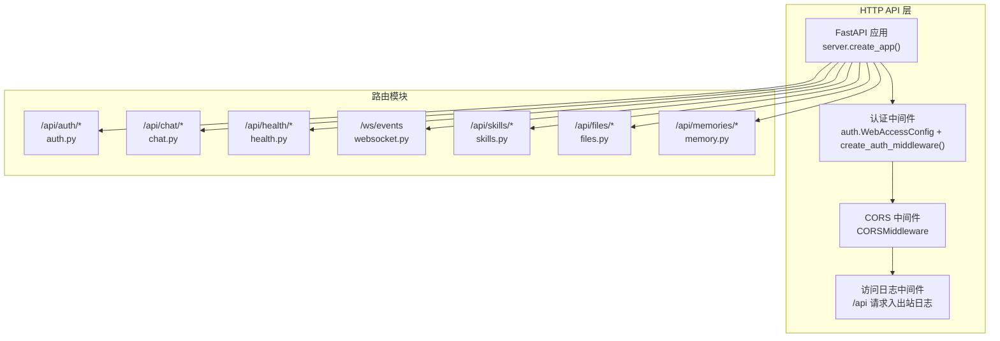
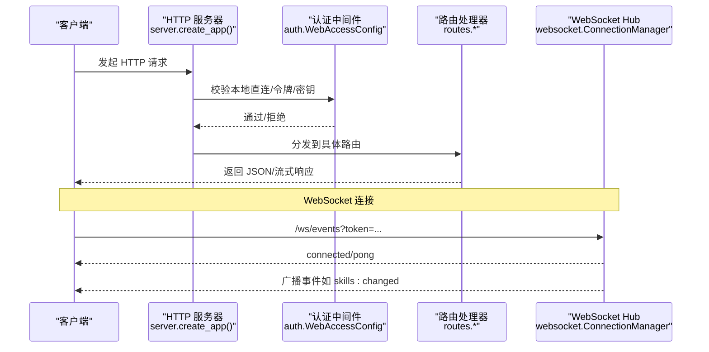
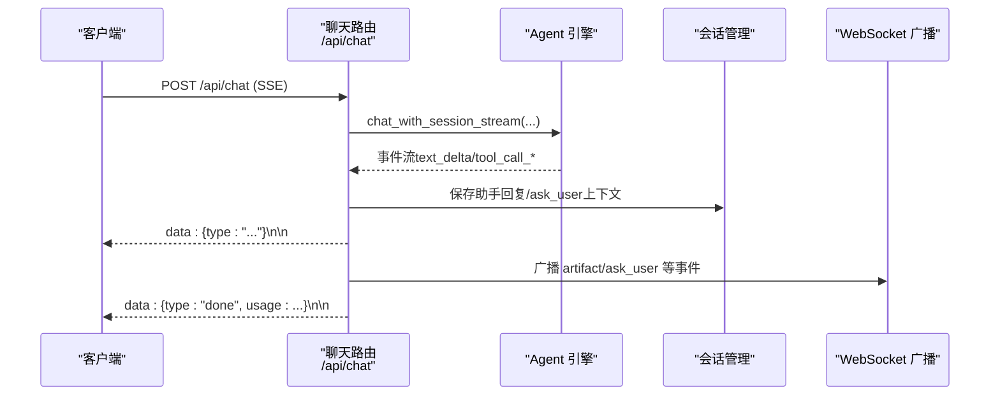
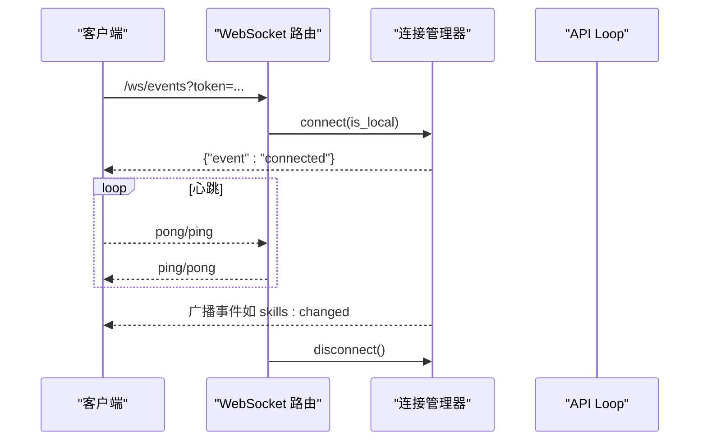
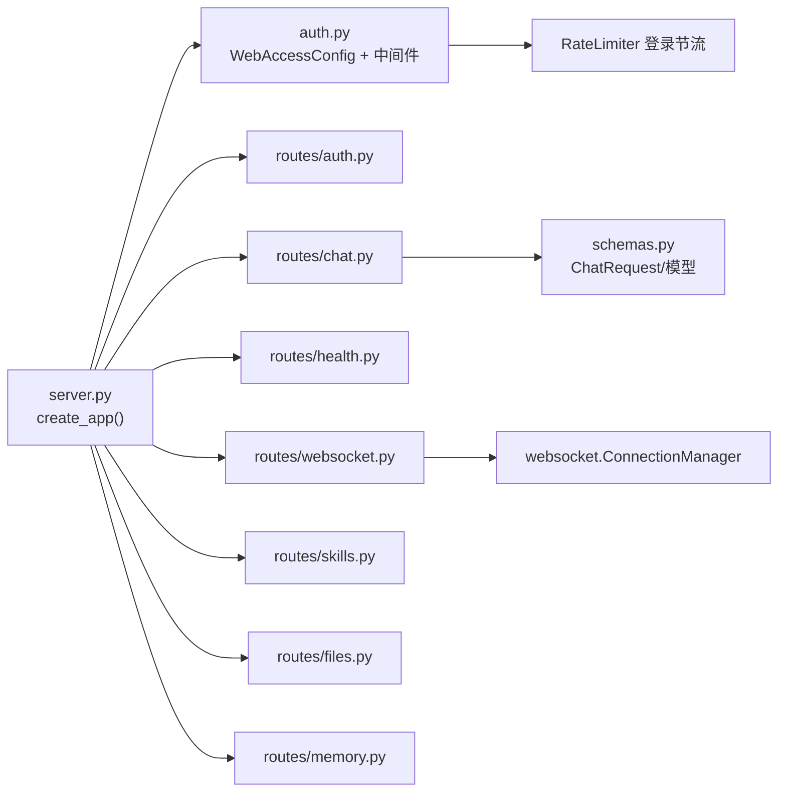

# API参考文档

<cite>
**本文档引用的文件**
- [server.py](file://src/synapse/api/server.py)
- [auth.py](file://src/synapse/api/auth.py)
- [schemas.py](file://src/synapse/api/schemas.py)
- [chat.py](file://src/synapse/api/routes/chat.py)
- [health.py](file://src/synapse/api/routes/health.py)
- [websocket.py](file://src/synapse/api/routes/websocket.py)
- [auth.py](file://src/synapse/api/routes/auth.py)
- [skills.py](file://src/synapse/api/routes/skills.py)
- [files.py](file://src/synapse/api/routes/files.py)
- [memory.py](file://src/synapse/api/routes/memory.py)
</cite>

## 目录
1. [简介](#简介)
2. [项目结构](#项目结构)
3. [核心组件](#核心组件)
4. [架构总览](#架构总览)
5. [详细组件分析](#详细组件分析)
6. [依赖关系分析](#依赖关系分析)
7. [性能考量](#性能考量)
8. [故障排查指南](#故障排查指南)
9. [结论](#结论)
10. [附录](#附录)

## 简介
本文件为 Synapse API 的全面参考文档，覆盖 HTTP REST API 与 WebSocket 实时通信两大部分。内容包括：
- HTTP 方法、URL 模式、请求/响应结构与认证方式
- WebSocket 连接处理、消息格式、事件类型与实时交互模式
- 协议特定示例、错误处理策略、安全考虑、速率限制与版本信息
- 常见用例、客户端实现指南与性能优化技巧
- 协议特定的调试工具与监控方法，以及已弃用功能的迁移与兼容性说明

## 项目结构
Synapse API 以 FastAPI 构建，采用“应用工厂 + 路由模块”组织方式，核心入口负责装配中间件、CORS、认证、静态资源与路由挂载；各业务域（认证、聊天、健康检查、WebSocket、技能、文件、记忆等）分别在独立模块中实现。

图表来源
- [server.py:210-556](file://src/synapse/api/server.py#L210-L556)
- [auth.py:328-380](file://src/synapse/api/auth.py#L328-L380)
- [websocket.py:134-196](file://src/synapse/api/routes/websocket.py#L134-L196)

章节来源
- [server.py:210-556](file://src/synapse/api/server.py#L210-L556)

## 核心组件
- HTTP 服务器与应用工厂
  - 默认监听地址与端口可通过环境变量配置，默认端口 18900
  - 双环架构：独立 API Loop 与引擎 Loop，保证高并发下的响应性
- 认证与授权
  - 单密码模式 + JWT 访问令牌 + 刷新 Cookie
  - 本地直连豁免认证；代理转发需携带有效令牌
  - 登录尝试速率限制（每 IP 每分钟最多 5 次）
- CORS 与访问日志
  - 支持动态配置允许源；移动端 Capacitor 源自动加入
  - 仅对 /api 路径记录入站/出站访问日志，健康检查与日志接口除外
- 静态资源与文档
  - 内置 Web 前端与用户文档静态托管
  - 支持按版本部署文档目录

章节来源
- [server.py:79-81](file://src/synapse/api/server.py#L79-L81)
- [server.py:559-706](file://src/synapse/api/server.py#L559-L706)
- [auth.py:328-380](file://src/synapse/api/auth.py#L328-L380)
- [auth.py:285-287](file://src/synapse/api/auth.py#L285-L287)
- [server.py:313-346](file://src/synapse/api/server.py#L313-L346)

## 架构总览
下图展示了 HTTP 与 WebSocket 的整体交互流程，以及认证与速率限制的关键节点。

图表来源
- [server.py:210-556](file://src/synapse/api/server.py#L210-L556)
- [auth.py:328-380](file://src/synapse/api/auth.py#L328-L380)
- [websocket.py:134-196](file://src/synapse/api/routes/websocket.py#L134-L196)

## 详细组件分析

### HTTP REST API

#### 认证与会话
- 终结点
  - POST /api/auth/login：密码登录，返回访问令牌并设置刷新 Cookie
  - POST /api/auth/refresh：使用刷新 Cookie 获取新访问令牌
  - POST /api/auth/logout：清除刷新 Cookie
  - GET /api/auth/check：检查当前会话状态
  - POST /api/auth/change-password：修改密码（本地直连无需旧密码；远程需提供旧密码）
  - GET /api/auth/password-hint：仅本地直连返回密码提示
- 认证方式
  - Authorization: Bearer <access_token>
  - 查询参数 token=<access_token>（适用于 img/audio 等无法设置头的场景）
  - X-API-Key: <password>（程序化访问）
  - 本地直连（127.0.0.1/::1/localhost 或 IPv4 映射）豁免认证
- 速率限制
  - 登录尝试：每 IP 每分钟最多 5 次，超过触发 429
- 安全考虑
  - 刷新 Cookie 设置 httponly+secure+samesite=strict
  - 密码存储使用 scrypt，支持动态 token 版本与密码轮换
  - 密码变更后断开所有远程 WebSocket 会话

章节来源
- [auth.py:86-257](file://src/synapse/api/routes/auth.py#L86-L257)
- [auth.py:328-380](file://src/synapse/api/auth.py#L328-L380)
- [auth.py:285-287](file://src/synapse/api/auth.py#L285-L287)

#### 对话与流式响应（SSE）
- 终结点
  - POST /api/chat（SSE 流）：发起对话，返回事件流
  - GET /api/commands：列出桌面可用的斜杠命令
  - POST /api/chat/clear：清空会话上下文
- 请求体（ChatRequest）
  - message：用户消息文本
  - conversation_id：会话标识（可选）
  - mode：交互模式（ask/plan/agent）
  - endpoint：指定端点名称（可选）
  - attachments：附件列表（类型、名称、URL、MIME）
  - thinking_mode/thinking_depth：思维模式与深度（可选）
  - agent_profile_id：指定 Agent Profile（可选）
  - client_id：多设备占位协调（可选）
- SSE 事件类型
  - text_delta/text_replace：增量/替换文本
  - tool_call_start/tool_call_end：工具调用开始/结束
  - chain_text：链式推理文本
  - ask_user：等待用户确认（含问题与选项）
  - artifact：工具产出物（deliver_artifacts/send_sticker）
  - done：对话结束，携带 usage 统计
  - error：错误事件
  - heartbeat：保活心跳
- 会话与保存
  - 自动保存助手回复至会话；支持 ask_user 上下文保留
  - 支持后台保存：客户端断连后仍保存剩余结果
- 示例
  - 客户端使用 fetch + EventSource 订阅 /api/chat
  - 通过 Authorization 头或查询参数 token 传递令牌

图表来源
- [chat.py:310-800](file://src/synapse/api/routes/chat.py#L310-L800)

章节来源
- [chat.py:29-84](file://src/synapse/api/routes/chat.py#L29-L84)
- [chat.py:310-800](file://src/synapse/api/routes/chat.py#L310-L800)
- [schemas.py:20-78](file://src/synapse/api/schemas.py#L20-L78)

#### 健康检查与诊断
- 终结点
  - GET /api/health：基础健康状态
  - POST /api/health/check：检查指定或全部 LLM 端点（dry_run）
  - GET /api/health/loop：事件循环延迟与并发统计
  - GET /api/debug/pool-stats：Agent 实例池统计
  - GET /api/debug/orchestrator-state：编排器内部状态
  - GET /api/diagnostics：环境自检报告
- 行为
  - dry_run 模式仅探测，不改变端点健康状态与冷却计数
  - 并发检查使用 per-endpoint 超时，避免阻塞

章节来源
- [health.py:128-424](file://src/synapse/api/routes/health.py#L128-L424)

#### 技能管理
- 终结点
  - GET /api/skills：列出技能（含启用状态、分类、配置模式）
  - POST /api/skills/config：持久化技能配置
  - POST /api/skills/install：安装技能（支持 URL）
  - POST /api/skills/uninstall：卸载技能
  - POST /api/skills/reload：热重载技能
  - GET /api/skills/content/{skill_name}：读取 SKILL.md
  - PUT /api/skills/content/{skill_name}：更新 SKILL.md 并热重载
  - POST /api/skills/dev-tools/test：研发工具技能快速测试
- 行为
  - 支持 data/skills.json 外部白名单裁剪
  - 技能变更后广播 WebSocket 事件（skills:changed）

章节来源
- [skills.py:224-800](file://src/synapse/api/routes/skills.py#L224-L800)

#### 文件访问
- 终结点
  - GET /api/files：从工作区目录安全地提供文件
- 安全
  - 仅允许在工作区根或用户主目录内访问
  - 防止路径穿越，严格解析绝对/相对路径
- 响应
  - 根据 MIME 类型决定 inline/attachment

章节来源
- [files.py:45-139](file://src/synapse/api/routes/files.py#L45-L139)

#### 记忆管理
- 终结点
  - POST /api/memories：创建语义记忆
  - GET /api/memories：分页/筛选列出记忆
  - GET /api/memories/stats：统计信息
  - POST /api/memories/review：异步触发 LLM 记忆审查
  - GET /api/memories/review/status：审查进度
  - POST /api/memories/review/cancel：取消审查
  - POST /api/memories/batch-delete：批量删除
  - GET /api/memories/graph：关系图谱（JSON）
  - GET /api/memories/{memory_id}：获取记忆详情
  - PUT /api/memories/{memory_id}：更新记忆
  - DELETE /api/memories/{memory_id}：删除记忆
  - POST /api/memories/refresh-md：刷新 MEMORY.md
- 行为
  - 支持 FACT 等多种类型与标签
  - 审查任务支持取消与进度回调
  - 图谱模式根据配置自动切换

章节来源
- [memory.py:119-481](file://src/synapse/api/routes/memory.py#L119-L481)

### WebSocket API

#### 连接与认证
- 终结点
  - /ws/events：通用事件流
- 认证
  - 本地直连（无 X-Forwarded-For）豁免
  - 代理转发需携带查询参数 token=<access_token>
- 保活
  - 服务端周期性发送 ping，客户端回 pong
- 广播
  - 支持并发广播，自动清理失效连接
  - 密码变更后断开远程客户端并发送 session_invalidated

图表来源
- [websocket.py:134-196](file://src/synapse/api/routes/websocket.py#L134-L196)

章节来源
- [websocket.py:26-92](file://src/synapse/api/routes/websocket.py#L26-L92)
- [websocket.py:134-196](file://src/synapse/api/routes/websocket.py#L134-L196)

## 依赖关系分析

图表来源
- [server.py:382-417](file://src/synapse/api/server.py#L382-L417)
- [chat.py:21](file://src/synapse/api/routes/chat.py#L21)
- [websocket.py:26-92](file://src/synapse/api/routes/websocket.py#L26-L92)
- [auth.py:263-287](file://src/synapse/api/auth.py#L263-L287)

章节来源
- [server.py:382-417](file://src/synapse/api/server.py#L382-L417)

## 性能考量
- 双环架构
  - API Loop 与引擎 Loop 分离，避免 LLM 高负载影响 HTTP/WebSocket 响应
  - 通过跨环桥接（fire_in_api/set_api_loop）在不同事件循环间安全调度
- SSE 与长任务
  - 客户端断连后保留宽限期（约 15 分钟）再取消任务，确保后台结果保存
  - keepalive 事件防止长时间无数据导致连接中断
- 并发与健康检查
  - LLM 并发统计与事件循环延迟监控，便于定位瓶颈
  - 端点健康检查使用 per-endpoint 超时，避免阻塞
- CORS 与静态资源
  - 动态允许源配置减少跨域失败；静态资源 MIME 类型修正提升加载稳定性

章节来源
- [server.py:559-706](file://src/synapse/api/server.py#L559-L706)
- [chat.py:476-518](file://src/synapse/api/routes/chat.py#L476-L518)
- [health.py:390-424](file://src/synapse/api/routes/health.py#L390-L424)

## 故障排查指南
- 认证失败
  - 确认 Authorization 头或查询参数 token 是否正确
  - 本地直连需满足 127.0.0.1/::1/localhost 或 IPv4 映射条件
  - 密码变更会断开远程 WebSocket 会话，需重新登录
- 登录受限
  - 登录尝试超过每分钟 5 次将触发 429，请稍后再试
- SSE 连接中断
  - 检查网络波动与超时；服务端提供 keepalive 事件
  - 若客户端断连，可在宽限期内恢复查看后台保存的结果
- 健康检查
  - 使用 /api/health/check 检查端点状态；dry_run 模式不改变冷却状态
  - /api/health/loop 查看事件循环延迟与并发统计
- WebSocket 事件未达
  - 确认 token 有效且非远程直连
  - 检查 /api/debug/pool-stats 与 /api/debug/orchestrator-state 辅助诊断

章节来源
- [auth.py:328-380](file://src/synapse/api/auth.py#L328-L380)
- [chat.py:476-518](file://src/synapse/api/routes/chat.py#L476-L518)
- [health.py:356-424](file://src/synapse/api/routes/health.py#L356-L424)
- [websocket.py:134-196](file://src/synapse/api/routes/websocket.py#L134-L196)

## 结论
Synapse API 提供了完善的 HTTP REST 与 WebSocket 实时通信能力，结合双环架构、细粒度认证与速率限制、SSE 流式输出与后台保存策略，既满足桌面与 Web 客户端的交互需求，也兼顾了生产环境的稳定性与可观测性。建议在生产环境中启用 HTTPS、合理配置 CORS 与 TRUST_PROXY，并利用健康检查与诊断接口持续监控系统状态。

## 附录

### 版本与环境
- 版本信息
  - 通过 OpenAPI 描述中的 version 字段获取
  - /api/health 返回后端版本、Git 哈希与主机信息
- 环境变量
  - API_HOST/API_PORT：监听地址与端口
  - CORS_ORIGINS：允许的来源列表（逗号分隔）
  - TRUST_PROXY：是否信任反向代理的 X-Forwarded-For
  - API_HTTPS：是否启用 HTTPS（影响 Cookie Secure 标记）

章节来源
- [server.py:249-259](file://src/synapse/api/server.py#L249-L259)
- [health.py:128-150](file://src/synapse/api/routes/health.py#L128-L150)
- [auth.py:47-58](file://src/synapse/api/routes/auth.py#L47-L58)

### 已弃用与兼容性
- 计划迁移
  - plan_mode 参数在 ChatRequest 中标注为已弃用，建议统一使用 mode='plan'
- 兼容性
  - token 版本随密码轮换递增，旧令牌自动失效
  - 本地直连豁免策略保持向后兼容

章节来源
- [schemas.py:29-31](file://src/synapse/api/schemas.py#L29-L31)
- [auth.py:207-209](file://src/synapse/api/auth.py#L207-L209)