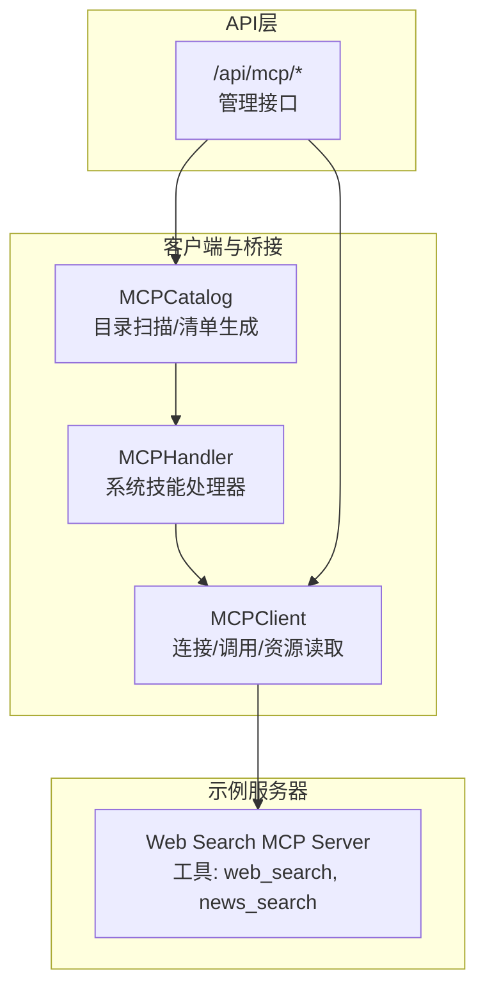
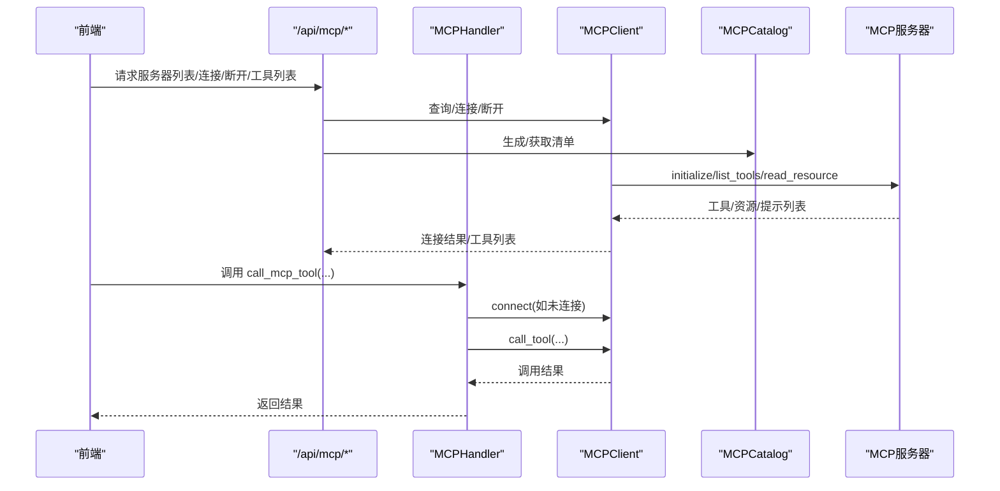
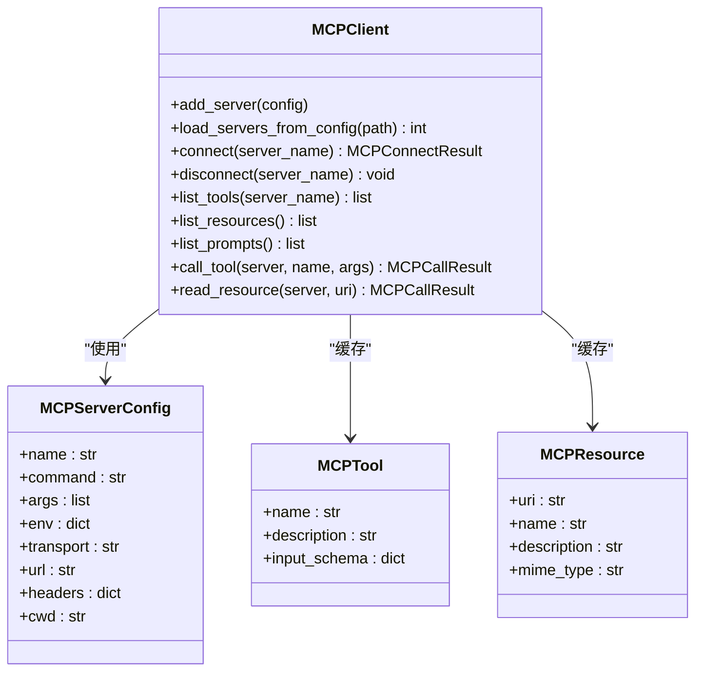
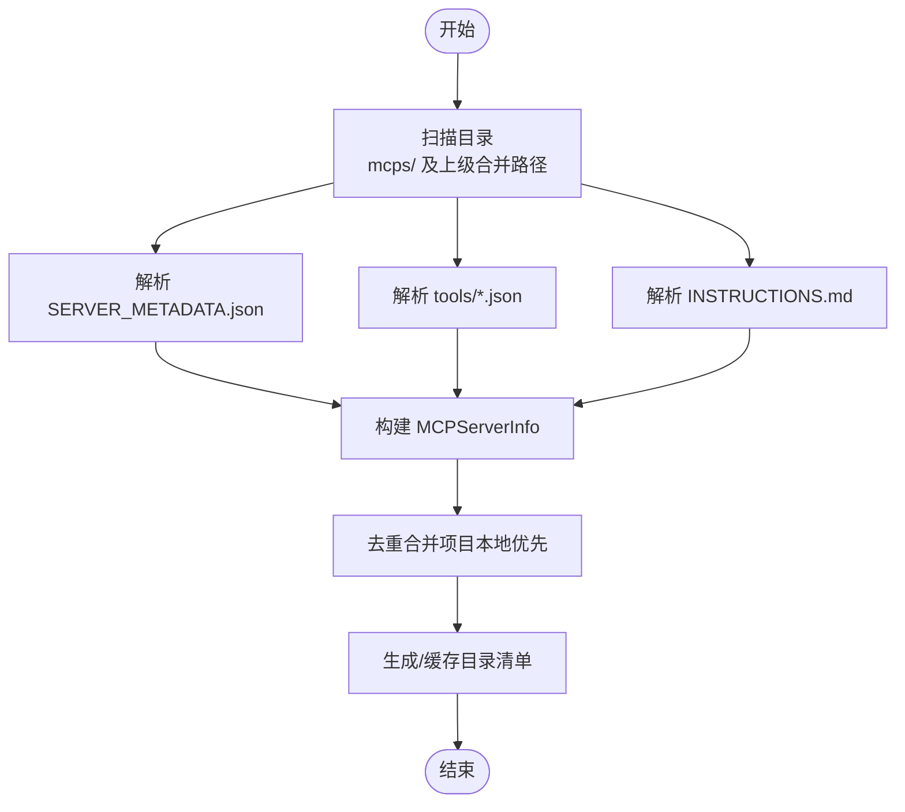
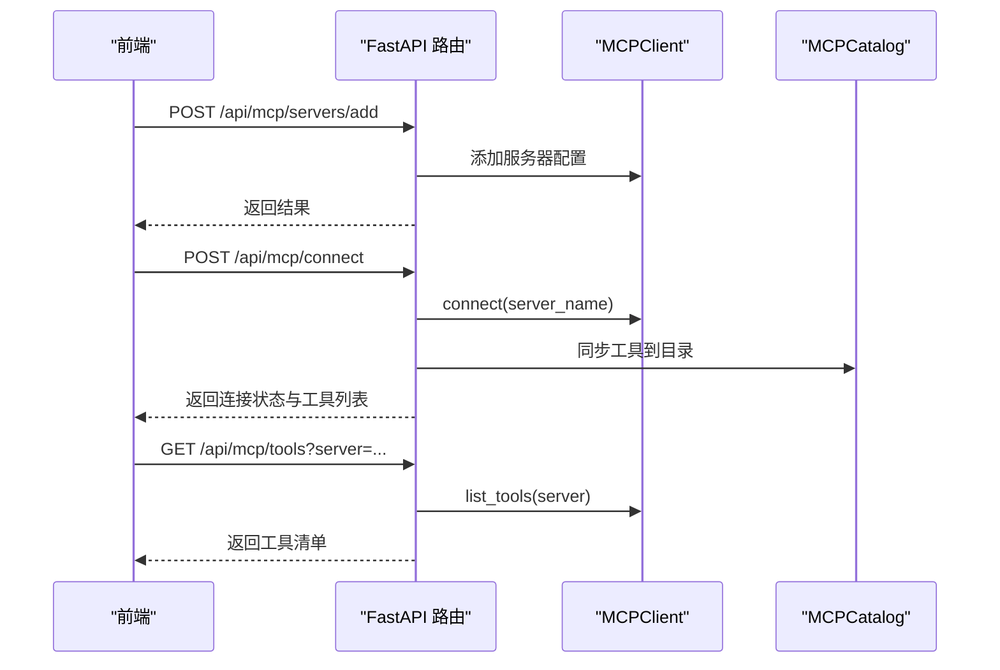
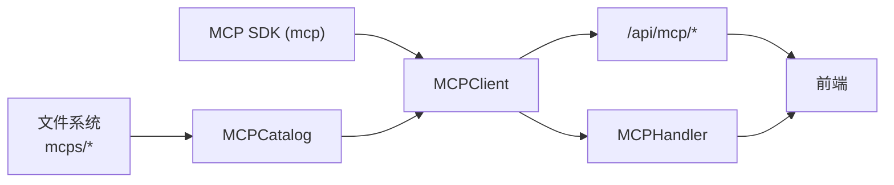

# MCP协议

<cite>
**本文引用的文件**
- [mcp.py](file://src/synapse/tools/mcp.py)
- [mcp_catalog.py](file://src/synapse/tools/mcp_catalog.py)
- [mcp.py（路由）](file://src/synapse/api/routes/mcp.py)
- [mcp.py（处理器）](file://src/synapse/tools/handlers/mcp.py)
- [mcp-integration.md](file://docs/mcp-integration.md)
- [README.md（MCP配置目录）](file://mcps/README.md)
- [SERVER_METADATA.json（Web Search）](file://mcps/web-search/SERVER_METADATA.json)
- [INSTRUCTIONS.md（Web Search）](file://mcps/web-search/INSTRUCTIONS.md)
- [web_search.py](file://src/synapse/mcp_servers/web_search.py)
</cite>

## 目录
1. [简介](#简介)
2. [项目结构](#项目结构)
3. [核心组件](#核心组件)
4. [架构总览](#架构总览)
5. [详细组件分析](#详细组件分析)
6. [依赖关系分析](#依赖关系分析)
7. [性能考量](#性能考量)
8. [故障排查指南](#故障排查指南)
9. [结论](#结论)
10. [附录](#附录)

## 简介
本文件为 Synapse 的 Model Context Protocol（MCP）协议规范文档，面向希望接入或扩展 MCP 服务器的开发者与平台集成者。文档涵盖以下主题：
- MCP 服务器发现机制与配置模型
- 连接协议与消息格式（传输层）
- 工具调用、内容提供与资源管理
- MCP 服务器配置、客户端集成与错误处理
- 安全考虑、认证机制与访问控制
- 第三方 MCP 服务器集成指南与最佳实践

## 项目结构
围绕 MCP 的关键代码分布在以下模块：
- 客户端与传输层：MCPClient 实现连接、工具调用、资源读取与能力发现
- 目录与清单：MCPCatalog 负责扫描配置目录、生成系统提示中的工具清单
- 路由与API：FastAPI 路由提供前端管理接口（增删改查、连接断开、工具列表等）
- 处理器：系统技能处理器封装工具调用入口，负责自动连接与结果回传
- 示例服务器：内置 Web Search MCP 服务器演示工具定义与实现

**图表来源**
- [mcp.py:244-800](file://src/synapse/tools/mcp.py#L244-L800)
- [mcp_catalog.py:151-604](file://src/synapse/tools/mcp_catalog.py#L151-L604)
- [mcp.py（路由）:71-402](file://src/synapse/api/routes/mcp.py#L71-L402)
- [mcp.py（处理器）:31-113](file://src/synapse/tools/handlers/mcp.py#L31-L113)
- [web_search.py:1-162](file://src/synapse/mcp_servers/web_search.py#L1-L162)

**章节来源**
- [mcp.py:1-1306](file://src/synapse/tools/mcp.py#L1-L1306)
- [mcp_catalog.py:1-604](file://src/synapse/tools/mcp_catalog.py#L1-L604)
- [mcp.py（路由）:1-402](file://src/synapse/api/routes/mcp.py#L1-L402)
- [mcp.py（处理器）:1-113](file://src/synapse/tools/handlers/mcp.py#L1-L113)
- [mcp-integration.md:1-192](file://docs/mcp-integration.md#L1-L192)
- [README.md（MCP配置目录）:1-59](file://mcps/README.md#L1-L59)

## 核心组件
- MCPClient：统一的 MCP 客户端，支持 stdio、streamable_http、sse 三种传输协议，负责连接建立、能力发现（工具/资源/提示）、工具调用与资源读取，并具备自动重连与清理机制。
- MCPCatalog：扫描 mcps/ 目录及其上级合并路径，解析 SERVER_METADATA.json 与 tools/*.json，生成系统提示中的“MCP 服务器与工具清单”，并支持按需加载 INSTRUCTIONS.md。
- API 路由：提供 /api/mcp/* 管理接口，包括服务器列表、连接/断开、工具列表、添加/删除/切换服务器、获取 INSTRUCTIONS.md 等。
- 系统技能处理器：封装 call_mcp_tool 等工具调用入口，自动处理未连接服务器的连接、结果回传与错误处理。

**章节来源**
- [mcp.py:244-800](file://src/synapse/tools/mcp.py#L244-L800)
- [mcp_catalog.py:151-604](file://src/synapse/tools/mcp_catalog.py#L151-L604)
- [mcp.py（路由）:123-402](file://src/synapse/api/routes/mcp.py#L123-L402)
- [mcp.py（处理器）:31-113](file://src/synapse/tools/handlers/mcp.py#L31-L113)

## 架构总览
下图展示了 MCP 在 Synapse 中的整体架构：客户端桥接、目录扫描、API 管理与示例服务器之间的交互。

**图表来源**
- [mcp.py（路由）:123-280](file://src/synapse/api/routes/mcp.py#L123-L280)
- [mcp.py（处理器）:48-113](file://src/synapse/tools/handlers/mcp.py#L48-L113)
- [mcp.py:314-730](file://src/synapse/tools/mcp.py#L314-L730)

## 详细组件分析

### MCPClient：连接、工具调用与资源读取
- 传输协议支持
  - stdio：适用于本地进程启动的 MCP 服务器，支持命令适配与环境增强。
  - streamable_http：适用于 HTTP 流式传输的 MCP 服务器。
  - sse：兼容旧版 MCP 服务器的 SSE 传输。
- 连接流程
  - 预检查命令与环境，进入对应传输的连接协程，建立 ClientSession 并调用 initialize。
  - 能力发现：list_tools、list_resources、list_prompts，缓存到内存。
- 工具调用与资源读取
  - call_tool：带超时控制，自动重连检测与恢复标记。
  - read_resource：读取服务器资源，聚合内容块为文本/数据。
- 断开与清理
  - 对 stdio 连接先终止子进程，再在后台任务中隔离清理，避免跨任务取消错误。
- 错误处理
  - 统一捕获连接/超时/命令不存在等异常，返回 MCPConnectResult/MCPCallResult，包含 reconnected 标记。

**图表来源**
- [mcp.py:244-800](file://src/synapse/tools/mcp.py#L244-L800)

**章节来源**
- [mcp.py:314-800](file://src/synapse/tools/mcp.py#L314-L800)

### MCPCatalog：目录扫描与清单生成
- 目录扫描
  - 支持多级合并：项目本地 mcps/、项目级 ~/.cursor/projects/.../mcps/、全局 ~/.cursor/mcps/，相同 ID 时项目本地优先。
  - 解析 SERVER_METADATA.json：serverIdentifier、serverName、command/args/env/transport/url/headers/autoConnect/enabled 等。
  - 解析 tools/*.json：工具名称、描述与 inputSchema（兼容 arguments）。
  - 解析 INSTRUCTIONS.md：用于复杂操作时的详细说明。
- 渐进式披露
  - Level 1：系统提示中的“MCP 服务器与工具清单”。
  - Level 2：调用时加载工具详细参数（inputSchema）。
  - Level 3：复杂操作时加载 INSTRUCTIONS.md。
- 缓存与失效
  - 生成的目录清单可缓存，必要时通过 invalidate_cache() 使能即时刷新。

**图表来源**
- [mcp_catalog.py:201-242](file://src/synapse/tools/mcp_catalog.py#L201-L242)
- [README.md（MCP配置目录）:1-59](file://mcps/README.md#L1-L59)

**章节来源**
- [mcp_catalog.py:151-604](file://src/synapse/tools/mcp_catalog.py#L151-L604)
- [README.md（MCP配置目录）:1-59](file://mcps/README.md#L1-L59)

### API 路由：MCP 管理接口
- 服务器管理
  - GET /api/mcp/servers：列出服务器（含配置与连接状态）
  - POST /api/mcp/connect：连接指定服务器
  - POST /api/mcp/disconnect：断开指定服务器
  - POST /api/mcp/servers/add：新增服务器配置（持久化至工作区 data/mcp/servers/）
  - POST /api/mcp/servers/{server_name}/toggle：切换服务器启用/禁用
  - DELETE /api/mcp/servers/{server_name}：删除服务器配置（仅工作区配置）
- 工具与说明
  - GET /api/mcp/tools：列出可用工具（可按服务器过滤）
  - GET /api/mcp/instructions/{server_name}：获取 INSTRUCTIONS.md

**图表来源**
- [mcp.py（路由）:123-280](file://src/synapse/api/routes/mcp.py#L123-L280)

**章节来源**
- [mcp.py（路由）:1-402](file://src/synapse/api/routes/mcp.py#L1-L402)

### 系统技能处理器：工具调用入口
- 支持工具
  - call_mcp_tool、list_mcp_servers、get_mcp_instructions、add_mcp_server、remove_mcp_server、connect_mcp_server、disconnect_mcp_server、reload_mcp_servers
- 自动连接与结果回传
  - 若目标服务器未连接，自动尝试连接并处理失败情况。
  - 成功/失败均返回人类可读的结果字符串。

**章节来源**
- [mcp.py（处理器）:31-113](file://src/synapse/tools/handlers/mcp.py#L31-L113)

### 示例 MCP 服务器：Web Search
- 服务器元数据
  - SERVER_METADATA.json 定义 serverIdentifier、serverName、command/args 等。
- 工具定义
  - web_search：网页搜索，支持 region、safesearch、max_results 等参数。
  - news_search：新闻搜索，支持 timelimit 等参数。
- INSTRUCTIONS.md
  - 提供工具参数说明与使用建议。

**章节来源**
- [SERVER_METADATA.json（Web Search）:1-8](file://mcps/web-search/SERVER_METADATA.json#L1-L8)
- [INSTRUCTIONS.md（Web Search）:1-56](file://mcps/web-search/INSTRUCTIONS.md#L1-L56)
- [web_search.py:1-162](file://src/synapse/mcp_servers/web_search.py#L1-L162)

## 依赖关系分析
- MCPClient 依赖 MCP SDK（mcp）提供的 ClientSession、stdio/streamable_http/sse 客户端。
- MCPCatalog 依赖 SERVER_METADATA.json 与 tools/*.json 的约定格式，以及 .env 环境变量解析。
- API 路由依赖 MCPClient 与 MCPCatalog 提供的状态与能力。
- 系统技能处理器依赖 MCPClient 与 MCPCatalog 的工具与服务器信息。

**图表来源**
- [mcp.py:49-177](file://src/synapse/tools/mcp.py#L49-L177)
- [mcp_catalog.py:287-347](file://src/synapse/tools/mcp_catalog.py#L287-L347)
- [mcp.py（路由）:71-94](file://src/synapse/api/routes/mcp.py#L71-L94)

**章节来源**
- [mcp.py:49-177](file://src/synapse/tools/mcp.py#L49-L177)
- [mcp_catalog.py:287-347](file://src/synapse/tools/mcp_catalog.py#L287-L347)
- [mcp.py（路由）:71-94](file://src/synapse/api/routes/mcp.py#L71-L94)

## 性能考量
- 连接复用：尽量复用已连接的 MCP 服务器，减少重复初始化成本。
- 超时配置：连接超时与调用超时可通过设置进行调整，避免长时间阻塞。
- 缓存策略：MCPCatalog 对目录清单进行缓存，必要时主动失效以获取最新配置。
- 资源读取：read_resource 聚合内容块，避免频繁小块传输带来的开销。

[本节为通用指导，不直接分析具体文件]

## 故障排查指南
- MCP SDK 不可用
  - 现象：连接失败提示 SDK 未安装或自动安装失败。
  - 处理：手动安装 mcp，或确保自动安装镜像可用。
- 连接超时
  - 现象：stdio/streamable_http/sse 连接超时。
  - 处理：检查命令/URL、网络连通性、超时设置。
- 命令未找到
  - 现象：stdio 模式下启动命令未找到。
  - 处理：确认命令在 PATH 或 cwd 下可访问，必要时使用绝对路径。
- 工具未发现
  - 现象：连接成功但工具列表为空。
  - 处理：确认服务器正确实现 list_tools，或使用 reload_mcp_servers 刷新配置。
- 断开清理异常
  - 现象：断开时出现跨任务取消错误。
  - 处理：使用内置断开流程，避免在不同任务中直接调用断开。

**章节来源**
- [mcp.py:314-800](file://src/synapse/tools/mcp.py#L314-L800)
- [mcp.py（路由）:295-402](file://src/synapse/api/routes/mcp.py#L295-L402)
- [mcp-integration.md:159-192](file://docs/mcp-integration.md#L159-L192)

## 结论
Synapse 的 MCP 实现提供了完整的服务器发现、连接、工具调用与资源读取能力，配合渐进式披露的目录清单与完善的 API 管理接口，能够满足从本地开发到生产部署的多样化需求。通过合理的超时配置、缓存策略与错误处理，可在保证稳定性的同时提升性能与用户体验。

[本节为总结性内容，不直接分析具体文件]

## 附录

### MCP 服务器配置与消息格式
- 配置文件
  - SERVER_METADATA.json：定义服务器标识、名称、命令、参数、传输、URL、请求头、自动连接、启用状态等。
  - tools/*.json：定义工具名称、描述与输入参数 schema（inputSchema/arguments）。
  - INSTRUCTIONS.md：提供工具使用说明与最佳实践。
- 传输协议
  - stdio：通过命令与参数启动本地进程。
  - streamable_http：通过 HTTP URL 与可选 headers 连接。
  - sse：通过 SSE URL 与可选 headers 连接。
- 能力发现
  - list_tools：返回工具清单（名称、描述、输入 schema）。
  - list_resources：返回资源清单（URI、名称、描述、MIME 类型）。
  - list_prompts：返回提示词清单（名称、描述、参数）。

**章节来源**
- [README.md（MCP配置目录）:1-59](file://mcps/README.md#L1-L59)
- [SERVER_METADATA.json（Web Search）:1-8](file://mcps/web-search/SERVER_METADATA.json#L1-L8)
- [INSTRUCTIONS.md（Web Search）:1-56](file://mcps/web-search/INSTRUCTIONS.md#L1-L56)
- [mcp.py:699-730](file://src/synapse/tools/mcp.py#L699-L730)

### 工具调用与内容提供
- 工具调用
  - call_tool(server, name, args)：带超时控制与自动重连检测。
  - 返回 MCPCallResult：success/data/error/reconnected。
- 内容提供
  - read_resource(server, uri)：读取服务器资源，聚合为文本/数据。
- 输入参数
  - 通过 inputSchema 描述工具参数，支持必填/可选、类型与默认值。

**章节来源**
- [mcp.py:1061-1109](file://src/synapse/tools/mcp.py#L1061-L1109)
- [mcp.py:1006-1059](file://src/synapse/tools/mcp.py#L1006-L1059)

### 安全考虑、认证机制与访问控制
- 安全建议
  - 限制浏览器 MCP 的访问域与权限。
  - 数据库 MCP 使用最小权限账户。
  - 对外部 MCP 服务器的输入进行严格校验。
- 认证与访问控制
  - 通过 headers 传递认证信息（如 Authorization）。
  - 使用 .env 文件管理敏感配置，避免硬编码。
  - 服务器启用/禁用开关与 per-server 配置 schema 控制可见性与完整性。

**章节来源**
- [mcp.py（路由）:344-382](file://src/synapse/api/routes/mcp.py#L344-L382)
- [mcp_catalog.py:116-148](file://src/synapse/tools/mcp_catalog.py#L116-L148)
- [mcp-integration.md:135-158](file://docs/mcp-integration.md#L135-L158)

### 第三方 MCP 服务器集成指南与最佳实践
- 快速集成步骤
  - 在 mcps/ 下创建服务器目录与 SERVER_METADATA.json。
  - 定义 tools/*.json 工具清单。
  - 如需复杂说明，编写 INSTRUCTIONS.md。
  - 通过 /api/mcp/servers/add 添加服务器配置。
  - 使用 /api/mcp/connect 连接并验证工具列表。
- 最佳实践
  - 明确工具职责边界，参数 schema 清晰。
  - 提供 INSTRUCTIONS.md 与示例，降低使用者门槛。
  - 使用 autoConnect 与 enabled 控制默认行为。
  - 通过 reload_mcp_servers 刷新配置变更。

**章节来源**
- [mcp-integration.md:64-134](file://docs/mcp-integration.md#L64-L134)
- [mcp.py（路由）:295-341](file://src/synapse/api/routes/mcp.py#L295-L341)
- [README.md（MCP配置目录）:1-59](file://mcps/README.md#L1-L59)