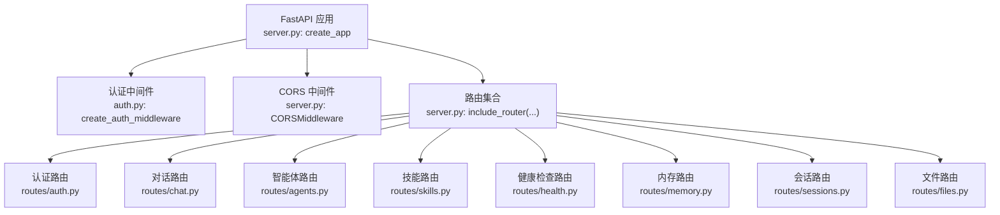
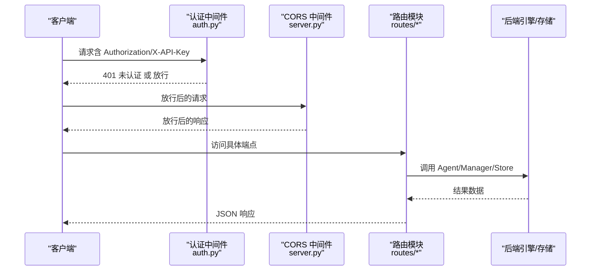
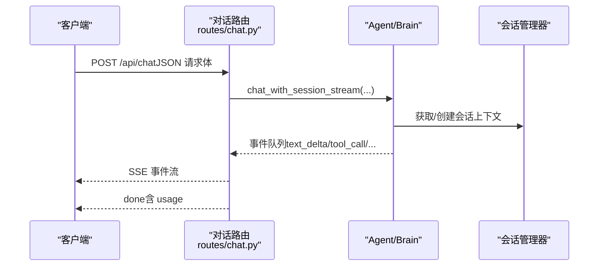
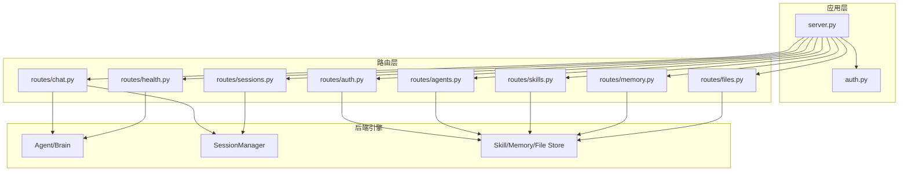

# RESTful API

<cite>
**本文引用的文件**
- [server.py](file://src/synapse/api/server.py)
- [auth.py](file://src/synapse/api/auth.py)
- [schemas.py](file://src/synapse/api/schemas.py)
- [auth.py](file://src/synapse/api/routes/auth.py)
- [chat.py](file://src/synapse/api/routes/chat.py)
- [agents.py](file://src/synapse/api/routes/agents.py)
- [skills.py](file://src/synapse/api/routes/skills.py)
- [health.py](file://src/synapse/api/routes/health.py)
- [memory.py](file://src/synapse/api/routes/memory.py)
- [sessions.py](file://src/synapse/api/routes/sessions.py)
- [files.py](file://src/synapse/api/routes/files.py)
</cite>

## 目录
1. [简介](#简介)
2. [项目结构](#项目结构)
3. [核心组件](#核心组件)
4. [架构总览](#架构总览)
5. [详细组件分析](#详细组件分析)
6. [依赖分析](#依赖分析)
7. [性能考虑](#性能考虑)
8. [故障排查指南](#故障排查指南)
9. [结论](#结论)
10. [附录](#附录)

## 简介
本文件为 Synapse 智能体平台的 RESTful API 文档，覆盖认证、对话、智能体、技能、内存、会话、文件、健康检查等主要模块。文档提供：
- 所有 HTTP 端点的 URL 模式、HTTP 方法、请求参数、响应格式与状态码
- 认证机制（Bearer Token、API Key）与请求头要求
- 查询参数、路径参数、请求体字段说明
- 成功与错误响应示例
- API 版本控制策略、速率限制与错误处理机制
- 常见用例的完整代码示例（身份验证、创建会话、管理智能体、处理工具调用）

## 项目结构
Synapse 的 HTTP API 基于 FastAPI 构建，入口位于服务端创建函数，挂载多条业务路由模块。认证中间件与 CORS 配置在应用初始化阶段完成。

图表来源
- [server.py:210-417](file://src/synapse/api/server.py#L210-L417)
- [auth.py:328-380](file://src/synapse/api/auth.py#L328-L380)

章节来源
- [server.py:210-417](file://src/synapse/api/server.py#L210-L417)

## 核心组件
- 认证与授权
  - 支持 Bearer Token 与 X-API-Key 两种方式；本地回环请求免认证
  - 登录成功返回访问令牌与刷新 Cookie，支持刷新与登出
  - 速率限制：登录尝试每 IP 60 秒最多 5 次
- 路由与中间件
  - 统一挂载多条业务路由（认证、对话、智能体、技能、健康、内存、会话、文件等）
  - CORS 支持动态来源与移动端来源白名单
- 数据模型
  - 统一响应结构：success_response/error_response
  - 对话请求体、附件信息、健康检查结果等模型

章节来源
- [auth.py:328-380](file://src/synapse/api/auth.py#L328-L380)
- [schemas.py:9-17](file://src/synapse/api/schemas.py#L9-L17)
- [schemas.py:20-124](file://src/synapse/api/schemas.py#L20-L124)

## 架构总览
下图展示了 API 的总体交互：客户端经认证中间件与 CORS 后，访问具体路由模块，路由模块调用后端引擎与存储，最终返回响应。

图表来源
- [server.py:275-311](file://src/synapse/api/server.py#L275-L311)
- [auth.py:328-380](file://src/synapse/api/auth.py#L328-L380)

## 详细组件分析

### 认证与安全
- 端点
  - POST /api/auth/login：用户名密码登录，返回访问令牌并设置刷新 Cookie
  - POST /api/auth/refresh：使用刷新 Cookie 获取新的访问令牌
  - POST /api/auth/logout：清除刷新 Cookie
  - GET /api/auth/check：检查当前会话认证状态
  - POST /api/auth/change-password：更改密码（本地免当前密码，远程需校验）
  - GET /api/auth/password-hint：仅本地返回密码提示
- 认证方式
  - Authorization: Bearer <access_token>
  - 查询参数 token=<access_token>（适用于静态资源）
  - X-API-Key: <API Key>（API Key 与密码哈希一致）
- 速率限制
  - 登录：每 IP 60 秒最多 5 次
- 请求头
  - Content-Type: application/json 或 application/x-www-form-urlencoded
  - Authorization: Bearer <token>
  - X-API-Key: <API Key>
- 响应
  - 成功：{"errorcode": 0, "message": "...", "data": {...}}
  - 错误：{"errorcode": N, "message": "...", "data": {"error": "..."}}

章节来源
- [auth.py:86-201](file://src/synapse/api/routes/auth.py#L86-L201)
- [auth.py:208-257](file://src/synapse/api/routes/auth.py#L208-L257)
- [auth.py:286-287](file://src/synapse/api/auth.py#L286-L287)
- [auth.py:357-377](file://src/synapse/api/auth.py#L357-L377)
- [schemas.py:9-17](file://src/synapse/api/schemas.py#L9-L17)

### 对话与流式响应
- 端点
  - POST /api/chat（SSE 流式）：发起对话，返回事件流（文本增量、工具调用、完成、错误等）
  - GET /api/commands：列出可用的斜杠命令
  - POST /api/chat/clear：清空会话上下文
- 请求体（POST /api/chat）
  - message: 字符串，用户消息
  - conversation_id: 字符串，会话标识（可选）
  - mode: 枚举 "ask"|"plan"|"agent"
  - endpoint: 字符串，指定端点名称（可选）
  - attachments: 附件数组（类型、名称、URL、MIME）
  - thinking_mode/thinking_depth: 思维模式与深度
  - agent_profile_id: 智能体配置标识（可选）
  - client_id: 客户端/标签页唯一标识（可选）
- 响应（SSE）
  - 事件类型：text_delta、text_replace、tool_call_start/tool_call_end、done、error、heartbeat、artifact、ui_preference 等
  - done 事件携带 usage 统计
- 错误
  - 401 未认证（Authorization/X-API-Key 缺失或无效）
  - 404 会话不存在
  - 503 会话管理器不可用

图表来源
- [chat.py:310-800](file://src/synapse/api/routes/chat.py#L310-L800)
- [schemas.py:20-78](file://src/synapse/api/schemas.py#L20-L78)

章节来源
- [chat.py:29-84](file://src/synapse/api/routes/chat.py#L29-L84)
- [chat.py:310-800](file://src/synapse/api/routes/chat.py#L310-L800)
- [schemas.py:20-78](file://src/synapse/api/schemas.py#L20-L78)

### 智能体与机器人管理
- 端点
  - GET /api/agents/bots：列出机器人配置
  - POST /api/agents/bots：创建机器人
  - PUT /api/agents/bots/{bot_id}：更新机器人
  - DELETE /api/agents/bots/{bot_id}：删除机器人
  - POST /api/agents/bots/{bot_id}/toggle：启停机器人
  - GET /api/agents/categories：列出分类
  - POST /api/agents/categories：创建分类
  - DELETE /api/agents/categories/{category_id}：删除分类
  - GET /api/agents/profiles：列出智能体配置（含系统预设与用户自定义）
  - POST /api/agents/profiles：创建智能体配置
  - PUT /api/agents/profiles/{profile_id}：更新智能体配置
  - DELETE /api/agents/profiles/{profile_id}：删除智能体配置
  - POST /api/agents/profiles/{profile_id}/reset：重置为系统默认
  - PATCH /api/agents/profiles/{profile_id}/visibility：设置隐藏/显示
  - POST /api/agents/profiles/{profile_id}/identity/init：初始化身份文件目录
  - GET /api/agents/profiles/{profile_id}/identity/{filename}：读取身份文件
  - PUT /api/agents/profiles/{profile_id}/identity/{filename}：写入身份文件
  - GET /api/agents/profiles/{profile_id}/memory/stats：获取隔离记忆统计
  - DELETE /api/agents/profiles/{profile_id}/data：删除配置数据目录
  - GET /api/agents/health：获取编排器健康统计
  - GET /api/agents/topology：聚合拓扑信息
- 请求体与参数
  - 机器人：id、type、name、agent_profile_id、enabled、credentials
  - 智能体配置：id/name/description/icon/color/skills/tools/mcp_servers/plugins/custom_prompt/category/preferred_endpoint/identity_mode/memory_mode/memory_inherit_global
  - 身份文件：SOUL.md、AGENT.md、USER.md、MEMORY.md
- 响应
  - 成功：{"status": "ok", ...}
  - 错误：{"error": "..."} 或 4xx/5xx

章节来源
- [agents.py:184-350](file://src/synapse/api/routes/agents.py#L184-L350)
- [agents.py:361-403](file://src/synapse/api/routes/agents.py#L361-L403)
- [agents.py:408-615](file://src/synapse/api/routes/agents.py#L408-L615)
- [agents.py:627-766](file://src/synapse/api/routes/agents.py#L627-L766)
- [agents.py:768-800](file://src/synapse/api/routes/agents.py#L768-L800)

### 技能管理
- 端点
  - GET /api/skills：列出技能（含启用状态、分类、工具名、配置等）
  - POST /api/skills/config：持久化技能配置
  - POST /api/skills/install：安装技能（远程仓库）
  - POST /api/skills/uninstall：卸载技能
  - POST /api/skills/reload：热重载技能
  - GET /api/skills/content/{skill_name}：读取 SKILL.md
  - PUT /api/skills/content/{skill_name}：更新 SKILL.md 并热重载
  - POST /api/skills/dev-tools/test：研发流程技能测试（临时 Agent 验证）
- 响应
  - 列表：{"skills": [...]}
  - 安装/卸载/重载：{"status": "ok", ...}
  - 错误：{"error": "..."} 或 4xx/5xx

章节来源
- [skills.py:224-326](file://src/synapse/api/routes/skills.py#L224-L326)
- [skills.py:328-361](file://src/synapse/api/routes/skills.py#L328-L361)
- [skills.py:363-466](file://src/synapse/api/routes/skills.py#L363-L466)
- [skills.py:468-515](file://src/synapse/api/routes/skills.py#L468-L515)
- [skills.py:517-574](file://src/synapse/api/routes/skills.py#L517-L574)
- [skills.py:576-627](file://src/synapse/api/routes/skills.py#L576-L627)
- [skills.py:629-699](file://src/synapse/api/routes/skills.py#L629-L699)
- [skills.py:731-800](file://src/synapse/api/routes/skills.py#L731-L800)

### 健康检查与诊断
- 端点
  - GET /api/health：基础健康信息（版本、PID、IP、端口等）
  - POST /api/health/check：检查 LLM 端点健康（dry_run）
  - GET /api/debug/pool-stats：AgentInstancePool 统计
  - GET /api/debug/orchestrator-state：编排器内部状态
  - GET /api/diagnostics：运行环境自检
  - GET /api/health/loop：事件循环延迟与并发统计
- 响应
  - 健康检查：{"results": [...]}，每项包含 name、status、latency_ms、error 等
  - 诊断：{"summary": "...", "checks": [...], "environment": {...}}

章节来源
- [health.py:128-151](file://src/synapse/api/routes/health.py#L128-L151)
- [health.py:356-388](file://src/synapse/api/routes/health.py#L356-L388)
- [health.py:219-228](file://src/synapse/api/routes/health.py#L219-L228)
- [health.py:230-252](file://src/synapse/api/routes/health.py#L230-L252)
- [health.py:254-354](file://src/synapse/api/routes/health.py#L254-L354)
- [health.py:390-424](file://src/synapse/api/routes/health.py#L390-L424)

### 内存管理
- 端点
  - POST /api/memories：创建语义记忆
  - GET /api/memories：列出/搜索记忆（支持 type、search、min_score、limit）
  - GET /api/memories/stats：统计
  - POST /api/memories/review：触发 LLM 驱动的记忆审查（异步）
  - GET /api/memories/review/status：查看审查进度
  - POST /api/memories/review/cancel：取消审查
  - POST /api/memories/batch-delete：批量删除
  - GET /api/memories/graph：返回关系图（节点/边）
  - GET /api/memories/{memory_id}：读取记忆
  - PUT /api/memories/{memory_id}：更新记忆
  - DELETE /api/memories/{memory_id}：删除记忆
  - POST /api/memories/refresh-md：刷新 MEMORY.md
- 响应
  - 成功：{"status": "ok", ...} 或 {"ok": True, ...}
  - 错误：{"error": "..."} 或 4xx/5xx

章节来源
- [memory.py:119-178](file://src/synapse/api/routes/memory.py#L119-L178)
- [memory.py:180-199](file://src/synapse/api/routes/memory.py#L180-L199)
- [memory.py:201-276](file://src/synapse/api/routes/memory.py#L201-L276)
- [memory.py:278-296](file://src/synapse/api/routes/memory.py#L278-L296)
- [memory.py:298-417](file://src/synapse/api/routes/memory.py#L298-L417)
- [memory.py:420-481](file://src/synapse/api/routes/memory.py#L420-L481)

### 会话管理
- 端点
  - GET /api/sessions：列出会话（按最后活跃降序）
  - GET /api/sessions/{conversation_id}/history：获取会话历史
  - DELETE /api/sessions/{conversation_id}：删除会话（取消任务、关闭会话）
  - POST /api/sessions/{conversation_id}/messages：追加消息（可替换）
  - POST /api/sessions/generate-title：基于首条消息生成标题
- 响应
  - 列表：{"sessions": [...], "data_epoch": "...", "ready": true/false}
  - 历史：{"messages": [...]}
  - 删除：{"ok": true/false, "removed": true/false}
  - 标题：{"title": "..."}

章节来源
- [sessions.py:36-97](file://src/synapse/api/routes/sessions.py#L36-L97)
- [sessions.py:99-172](file://src/synapse/api/routes/sessions.py#L99-L172)
- [sessions.py:174-218](file://src/synapse/api/routes/sessions.py#L174-L218)
- [sessions.py:264-298](file://src/synapse/api/routes/sessions.py#L264-L298)
- [sessions.py:300-351](file://src/synapse/api/routes/sessions.py#L300-L351)

### 文件访问
- 端点
  - GET /api/files：从工作区目录提供文件（支持相对与绝对路径）
- 参数
  - path: 目标文件路径（相对工作区根或绝对路径）
- 安全
  - 仅允许访问工作区根或用户主目录下的文件，防止路径穿越
- 响应
  - 文件流（内联或附件）
  - 错误：400/403/404

章节来源
- [files.py:45-98](file://src/synapse/api/routes/files.py#L45-L98)

## 依赖分析
- 组件耦合
  - 路由模块依赖后端引擎（Agent/Brain）、会话管理器、技能/记忆/文件存储等
  - 认证中间件与 CORS 中间件在应用初始化阶段注册，影响所有路由
- 外部依赖
  - FastAPI、Uvicorn、Starlette 中间件栈
  - LLM 提供商健康检查与并发统计
- 循环依赖
  - 未发现明显循环导入；路由模块通过应用状态对象间接访问后端组件

图表来源
- [server.py:382-417](file://src/synapse/api/server.py#L382-L417)
- [auth.py:328-380](file://src/synapse/api/auth.py#L328-L380)

章节来源
- [server.py:382-417](file://src/synapse/api/server.py#L382-L417)

## 性能考虑
- 双事件循环设计
  - API Loop 与 Engine Loop 分离，保证高并发与长任务下的响应性
- SSE 流式输出
  - 心跳事件与断连宽限期，避免前端连接超时与资源泄露
- 并发与冷却
  - LLMClient 并发统计与冷却状态，健康检查采用 dry_run 模式避免干扰
- 会话清理
  - 删除会话时主动取消任务，释放资源

章节来源
- [server.py:559-707](file://src/synapse/api/server.py#L559-L707)
- [chat.py:520-531](file://src/synapse/api/routes/chat.py#L520-L531)
- [health.py:390-424](file://src/synapse/api/routes/health.py#L390-L424)

## 故障排查指南
- 认证失败
  - 确认 Authorization 头或 X-API-Key 是否正确
  - 检查刷新 Cookie 是否有效且未过期
  - 登录失败次数过多会被限流
- 404/503
  - 检查会话管理器是否初始化完成
  - 确认工作区根目录与文件路径
- 健康检查
  - 使用 /api/health/check 进行 dry_run 检测，关注端点状态与错误信息
  - 查看 /api/health/loop 事件循环延迟与 LLM 并发统计
- 记忆审查
  - 使用 /api/memories/review/status 轮询进度，必要时 /api/memories/review/cancel 取消

章节来源
- [auth.py:286-287](file://src/synapse/api/auth.py#L286-L287)
- [auth.py:357-377](file://src/synapse/api/auth.py#L357-L377)
- [health.py:356-388](file://src/synapse/api/routes/health.py#L356-L388)
- [health.py:390-424](file://src/synapse/api/routes/health.py#L390-L424)
- [memory.py:201-276](file://src/synapse/api/routes/memory.py#L201-L276)

## 结论
Synapse 的 RESTful API 以 FastAPI 为基础，围绕认证、对话、智能体、技能、内存、会话与文件等模块构建了完整的 HTTP 接口体系。通过双事件循环、SSE 流式输出、健康检查与并发统计等机制，兼顾易用性与高性能。建议在生产环境中结合 CORS、代理与速率限制策略，确保安全与稳定性。

## 附录

### API 版本控制策略
- 版本信息来源于应用版本字符串，可通过根路径或健康检查端点获取
- 文档与静态资源版本化部署，支持多版本用户文档

章节来源
- [server.py:426-430](file://src/synapse/api/server.py#L426-L430)
- [server.py:441-461](file://src/synapse/api/server.py#L441-L461)

### 速率限制规则
- 登录尝试：每 IP 60 秒最多 5 次（防暴力破解）
- 其他端点：未显式声明速率限制，建议在网关层统一配置

章节来源
- [auth.py:286-287](file://src/synapse/api/auth.py#L286-L287)

### 错误处理机制
- 统一响应结构：success_response/error_response
- FastAPI 验证错误转换为扁平字符串详情
- 认证中间件返回 401 未认证，CORS 中间件确保跨域头

章节来源
- [schemas.py:9-17](file://src/synapse/api/schemas.py#L9-L17)
- [server.py:261-274](file://src/synapse/api/server.py#L261-L274)
- [auth.py:357-377](file://src/synapse/api/auth.py#L357-L377)

### 常见用例示例（路径引用）
- 身份验证
  - POST /api/auth/login：[请求体解析与登录流程:86-119](file://src/synapse/api/routes/auth.py#L86-L119)
  - POST /api/auth/refresh：[刷新令牌:124-147](file://src/synapse/api/routes/auth.py#L124-L147)
  - POST /api/auth/logout：[清除刷新 Cookie:152-156](file://src/synapse/api/routes/auth.py#L152-L156)
- 创建会话
  - POST /api/chat：[SSE 流式对话:310-800](file://src/synapse/api/routes/chat.py#L310-L800)
  - GET /api/sessions：[列出会话:36-97](file://src/synapse/api/routes/sessions.py#L36-L97)
- 管理智能体
  - POST /api/agents/profiles：[创建智能体配置:450-506](file://src/synapse/api/routes/agents.py#L450-L506)
  - PUT /api/agents/profiles/{profile_id}：[更新配置:508-537](file://src/synapse/api/routes/agents.py#L508-L537)
- 处理工具调用
  - SSE 事件：text_delta/tool_call_start/tool_call_end/done 等
  - 参考：[事件流与工具收据注入:560-653](file://src/synapse/api/routes/chat.py#L560-L653)
- 健康检查
  - POST /api/health/check：[端点健康检查:356-388](file://src/synapse/api/routes/health.py#L356-L388)
- 记忆管理
  - POST /api/memories：[创建记忆:119-145](file://src/synapse/api/routes/memory.py#L119-L145)
  - GET /api/memories/graph：[关系图:298-417](file://src/synapse/api/routes/memory.py#L298-L417)
- 文件访问
  - GET /api/files：[安全文件服务:45-98](file://src/synapse/api/routes/files.py#L45-L98)