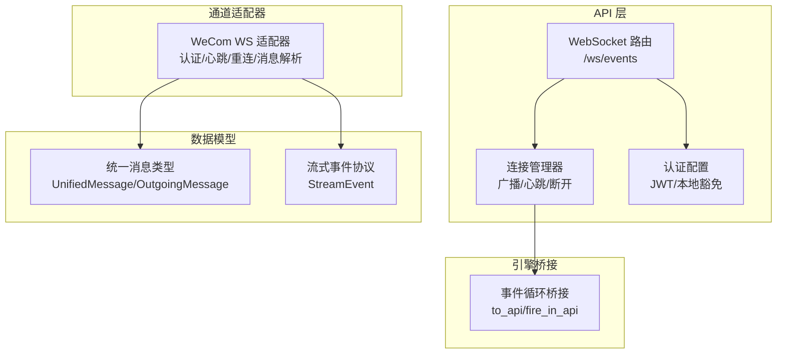
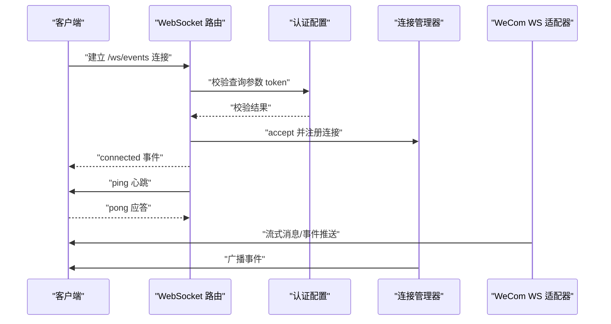
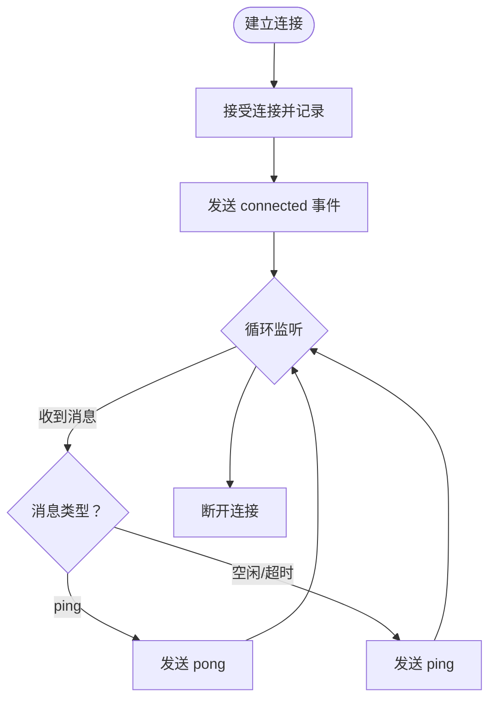
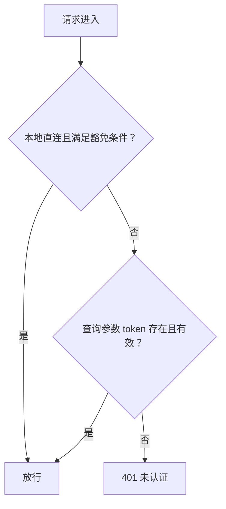
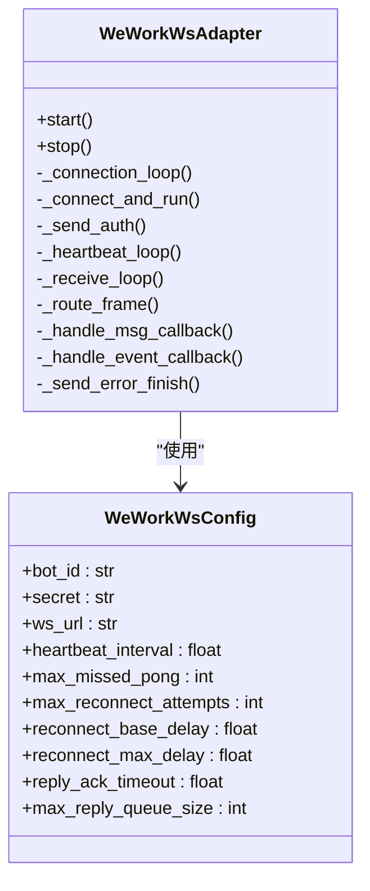
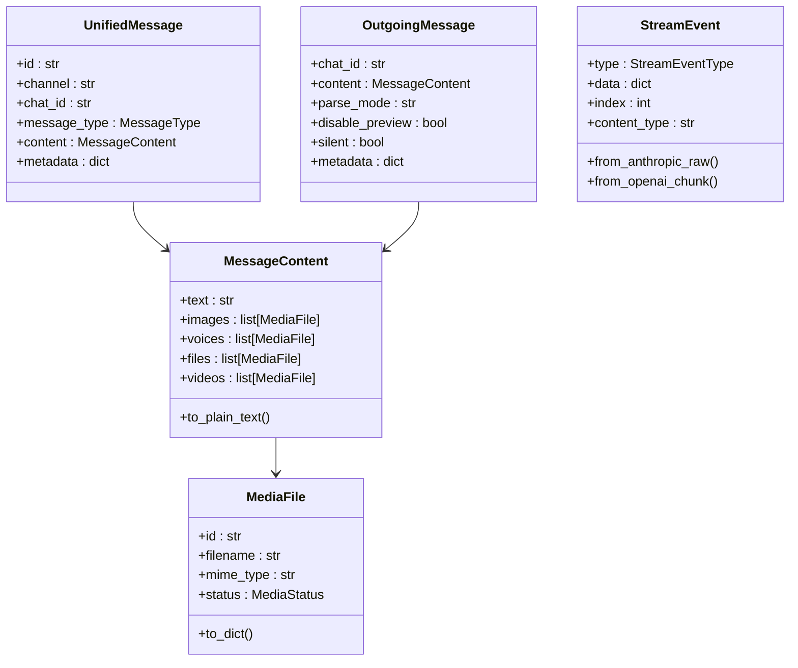
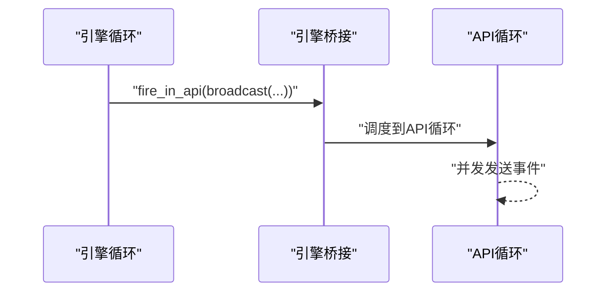
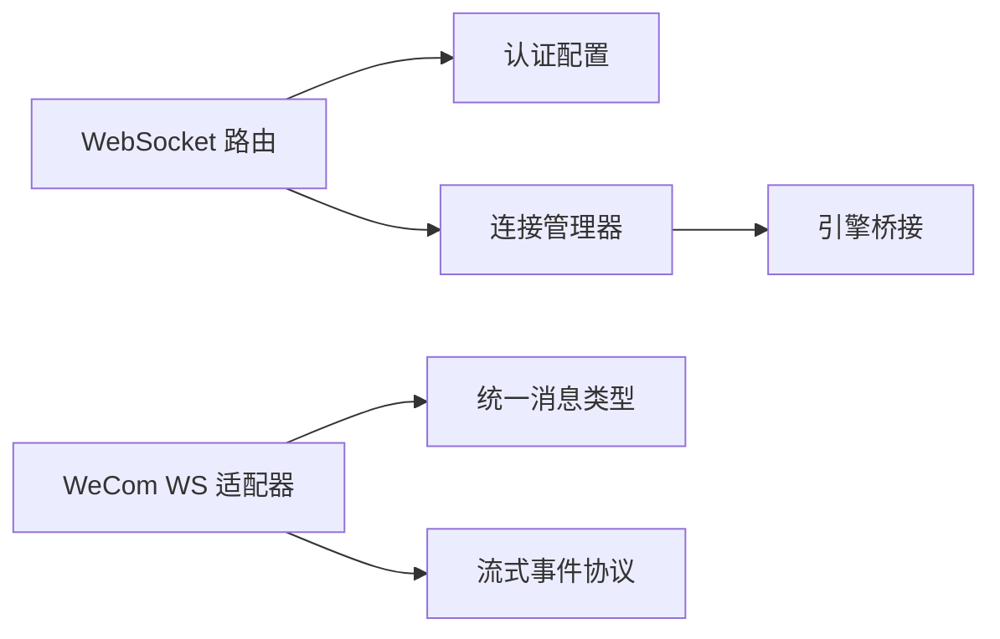

# WebSocket API

<cite>
**本文档引用的文件**
- [websocket.py](file://src/synapse/api/routes/websocket.py)
- [auth.py](file://src/synapse/api/auth.py)
- [wework_ws.py](file://src/synapse/channels/adapters/wework_ws.py)
- [types.py](file://src/synapse/channels/types.py)
- [stream_event.py](file://src/synapse/llm/stream_event.py)
- [engine_bridge.py](file://src/synapse/core/engine_bridge.py)
- [test_wework_ws_adapter.py](file://tests/unit/test_wework_ws_adapter.py)
- [test_auth_flow.py](file://tests/integration/test_auth_flow.py)
</cite>

## 目录
1. [简介](#简介)
2. [项目结构](#项目结构)
3. [核心组件](#核心组件)
4. [架构总览](#架构总览)
5. [详细组件分析](#详细组件分析)
6. [依赖关系分析](#依赖关系分析)
7. [性能考量](#性能考量)
8. [故障排查指南](#故障排查指南)
9. [结论](#结论)
10. [附录](#附录)

## 简介
本文件面向Synapse的实时通信能力，聚焦WebSocket API的设计与实现，涵盖以下主题：
- 连接建立与握手协议
- 认证与授权策略
- 消息格式、事件类型与数据结构
- 实时消息流（流式响应、进度更新、错误通知）
- 连接管理、重连机制与心跳检测
- 客户端连接示例与最佳实践
- 性能优化建议

## 项目结构
围绕WebSocket API的关键模块分布如下：
- API层：提供WebSocket端点与全局连接管理、广播机制
- 认证层：提供JWT访问令牌校验与本地直连豁免逻辑
- 通道适配器：以企业微信WebSocket为例，演示长连接、认证、心跳、重连、消息解析与发送
- 数据模型：统一消息与内容类型，支撑跨平台消息抽象
- 流式事件：统一LLM流式事件协议，便于前端渲染
- 引擎桥接：双事件循环隔离下的跨循环调用与广播

图表来源
- [websocket.py:134-196](file://src/synapse/api/routes/websocket.py#L134-L196)
- [auth.py:91-250](file://src/synapse/api/auth.py#L91-L250)
- [wework_ws.py:514-803](file://src/synapse/channels/adapters/wework_ws.py#L514-L803)
- [types.py:18-615](file://src/synapse/channels/types.py#L18-L615)
- [stream_event.py:27-198](file://src/synapse/llm/stream_event.py#L27-L198)
- [engine_bridge.py:32-113](file://src/synapse/core/engine_bridge.py#L32-L113)

章节来源
- [websocket.py:1-196](file://src/synapse/api/routes/websocket.py#L1-L196)
- [auth.py:1-380](file://src/synapse/api/auth.py#L1-L380)
- [wework_ws.py:1-1200](file://src/synapse/channels/adapters/wework_ws.py#L1-L1200)
- [types.py:1-615](file://src/synapse/channels/types.py#L1-L615)
- [stream_event.py:1-198](file://src/synapse/llm/stream_event.py#L1-L198)
- [engine_bridge.py:1-177](file://src/synapse/core/engine_bridge.py#L1-L177)

## 核心组件
- WebSocket路由与连接管理
  - 提供/ws/events端点，接受WebSocket连接，执行认证，维护连接列表，支持广播与断开远程客户端
  - 支持服务器端ping/客户端pong的心跳保活
- 认证与授权
  - 基于查询参数token的JWT访问令牌校验；本地直连（127.0.0.1/::1/localhost或IPv4映射）在特定条件下豁免认证
  - 支持TRUST_PROXY动态开关，结合X-Forwarded-For区分本地直连与代理转发
- 通道适配器（以WeCom WS为例）
  - 长连接、指数退避重连、认证、心跳、消息回调、事件回调、流式回复、主动推送
  - 消息去重、速率限制、媒体下载与解密、分片上传、欢迎语、断线事件处理
- 统一消息类型
  - 统一输入（UnifiedMessage）与输出（OutgoingMessage）消息结构，支持多类型媒体与元数据
- 流式事件协议
  - 统一LLM流式事件类型，屏蔽不同供应商差异，便于前端渲染
- 引擎桥接
  - 在双事件循环模式下，提供to_api/fire_in_api等桥接函数，保证跨循环安全广播

章节来源
- [websocket.py:26-196](file://src/synapse/api/routes/websocket.py#L26-L196)
- [auth.py:91-250](file://src/synapse/api/auth.py#L91-L250)
- [wework_ws.py:514-1200](file://src/synapse/channels/adapters/wework_ws.py#L514-L1200)
- [types.py:18-615](file://src/synapse/channels/types.py#L18-L615)
- [stream_event.py:27-198](file://src/synapse/llm/stream_event.py#L27-L198)
- [engine_bridge.py:32-113](file://src/synapse/core/engine_bridge.py#L32-L113)

## 架构总览
WebSocket API采用“API层-通道适配器-数据模型-流式协议-引擎桥接”的分层设计。API层负责连接接入与广播；通道适配器负责与外部IM平台的协议对接；数据模型与流式事件协议提供跨平台一致性；引擎桥接保障双事件循环场景下的安全调用。

图表来源
- [websocket.py:134-175](file://src/synapse/api/routes/websocket.py#L134-L175)
- [auth.py:231-250](file://src/synapse/api/auth.py#L231-L250)
- [wework_ws.py:745-833](file://src/synapse/channels/adapters/wework_ws.py#L745-L833)

## 详细组件分析

### WebSocket 路由与连接管理
- 连接接入
  - 接受WebSocket连接，记录是否本地连接；本地直连在特定条件下豁免认证
  - 发送初始“connected”事件，携带时间戳
- 心跳保活
  - 服务器端定时发送“ping”，客户端应答“pong”
  - 超时未收到pong则断开连接
- 广播与断开
  - 并发向所有连接发送事件，自动清理异常连接
  - 支持断开远程客户端（如密码变更触发）

图表来源
- [websocket.py:134-175](file://src/synapse/api/routes/websocket.py#L134-L175)

章节来源
- [websocket.py:26-196](file://src/synapse/api/routes/websocket.py#L26-L196)

### 认证与授权
- 认证入口
  - 查询参数token：优先校验
  - 本地直连豁免：当TRUST_PROXY关闭或无X-Forwarded-For时，本地连接免认证
  - 代理转发：开启TRUST_PROXY且存在X-Forwarded-For时必须提供有效token
- JWT访问令牌
  - 有效期24小时；版本号随密码变更递增，支持强制失效
  - 支持刷新令牌与版本校验

图表来源
- [websocket.py:114-132](file://src/synapse/api/routes/websocket.py#L114-L132)
- [auth.py:231-250](file://src/synapse/api/auth.py#L231-L250)

章节来源
- [websocket.py:102-132](file://src/synapse/api/routes/websocket.py#L102-L132)
- [auth.py:91-250](file://src/synapse/api/auth.py#L91-L250)

### 通道适配器（WeCom WS）
- 连接与认证
  - 建立wss://openws.work.weixin.qq.com长连接
  - 发送订阅帧进行认证，等待认证响应
- 心跳与重连
  - 定时发送心跳；累计missed_pong超过阈值则断开
  - 指数退避重连，支持最大尝试次数与永久失败禁用
- 消息处理
  - 消息回调：解析msgtype/text/image/mixed/voice/file/video，构造UnifiedMessage
  - 事件回调：enter_chat/template_card_event/feedback_event/disconnected_event
  - 去重：基于msg_id与TTL
  - 速率限制：24小时窗口内回复上限与每日主动发送上限
- 流式回复与媒体
  - 流式回复：按chunk发送，支持keepalive与最大中间消息数
  - 主动推送：欢迎语、模板卡片、Markdown、媒体（图片/语音/文件）
  - 媒体下载与AES-256-CBC解密，分片上传临时素材

图表来源
- [wework_ws.py:514-803](file://src/synapse/channels/adapters/wework_ws.py#L514-L803)
- [wework_ws.py:332-352](file://src/synapse/channels/adapters/wework_ws.py#L332-L352)

章节来源
- [wework_ws.py:514-1200](file://src/synapse/channels/adapters/wework_ws.py#L514-L1200)

### 统一消息类型与流式事件
- 统一消息类型
  - UnifiedMessage：接收消息的跨平台统一表示
  - OutgoingMessage：发送消息的统一表示，支持文本、图片、文件、语音、视频等
  - MessageContent：封装文本与多种媒体类型
  - MediaFile：媒体文件元数据与状态
- 流式事件协议
  - 统一StreamEvent类型：message_start/content_start/content_delta/content_stop/message_delta/message_stop/ping/error
  - 支持Anthropic与OpenAI格式转换，便于前端统一渲染

图表来源
- [types.py:18-615](file://src/synapse/channels/types.py#L18-L615)
- [stream_event.py:27-198](file://src/synapse/llm/stream_event.py#L27-L198)

章节来源
- [types.py:18-615](file://src/synapse/channels/types.py#L18-L615)
- [stream_event.py:27-198](file://src/synapse/llm/stream_event.py#L27-L198)

### 引擎桥接与跨循环广播
- 双事件循环隔离
  - API线程运行uvicorn（HTTP/WebSocket），引擎线程运行Agent/OrgRuntime等
- 跨循环调用
  - to_api：在API循环执行协程
  - fire_in_api：在API循环调度但不等待结果（广播常用）
- 广播安全
  - 从引擎侧发起的广播通过fire_in_api进入API循环，避免循环间阻塞

图表来源
- [engine_bridge.py:97-113](file://src/synapse/core/engine_bridge.py#L97-L113)

章节来源
- [engine_bridge.py:1-177](file://src/synapse/core/engine_bridge.py#L1-177)

## 依赖关系分析
- WebSocket路由依赖认证配置进行token校验，并通过连接管理器维护连接与广播
- 通道适配器依赖统一消息类型与流式事件协议，实现跨平台消息抽象与流式渲染
- 引擎桥接为跨循环广播提供安全通道，避免死锁与阻塞

图表来源
- [websocket.py:134-196](file://src/synapse/api/routes/websocket.py#L134-L196)
- [auth.py:91-250](file://src/synapse/api/auth.py#L91-L250)
- [wework_ws.py:514-803](file://src/synapse/channels/adapters/wework_ws.py#L514-L803)
- [types.py:18-615](file://src/synapse/channels/types.py#L18-L615)
- [stream_event.py:27-198](file://src/synapse/llm/stream_event.py#L27-L198)
- [engine_bridge.py:32-113](file://src/synapse/core/engine_bridge.py#L32-L113)

章节来源
- [websocket.py:1-196](file://src/synapse/api/routes/websocket.py#L1-L196)
- [auth.py:1-380](file://src/synapse/api/auth.py#L1-L380)
- [wework_ws.py:1-1200](file://src/synapse/channels/adapters/wework_ws.py#L1-L1200)
- [types.py:1-615](file://src/synapse/channels/types.py#L1-L615)
- [stream_event.py:1-198](file://src/synapse/llm/stream_event.py#L1-L198)
- [engine_bridge.py:1-177](file://src/synapse/core/engine_bridge.py#L1-L177)

## 性能考量
- 连接管理
  - 并发广播使用gather，异常连接自动清理，降低广播开销
  - 心跳间隔与missed_pong阈值可调，平衡网络波动与资源占用
- 重连策略
  - 指数退避避免雪崩效应；最大尝试次数与永久失败禁用防止无限重试
- 消息处理
  - 消息处理超时保护，超时或异常时发送带finish的错误流，避免挂起
  - 去重与速率限制减少重复与滥用
- 流式传输
  - 控制中间流消息数量与keepalive周期，避免平台限制与内存压力
- 跨循环广播
  - fire_in_api用于广播，to_api用于需要结果的调用，避免阻塞引擎循环

## 故障排查指南
- 认证失败
  - 检查查询参数token是否有效；确认本地直连豁免条件与TRUST_PROXY设置
  - 密码变更会提升token版本，旧token失效
- 连接断开
  - 心跳missed_pong达到阈值会断开；检查网络稳定性与心跳间隔
  - 断线事件(disconnected_event)会导致适配器停止重连，需检查平台侧冲突
- 重连异常
  - 连续认证失败超过阈值会禁用适配器，需检查bot_id/secret配置
- 流式响应异常
  - 消息处理超时或异常会发送错误finish流；检查上游处理耗时与异常
- 广播无效
  - 确认引擎桥接是否正确使用fire_in_api；双循环模式下需在API循环执行广播

章节来源
- [websocket.py:102-132](file://src/synapse/api/routes/websocket.py#L102-L132)
- [wework_ws.py:790-833](file://src/synapse/channels/adapters/wework_ws.py#L790-L833)
- [wework_ws.py:908-940](file://src/synapse/channels/adapters/wework_ws.py#L908-L940)
- [engine_bridge.py:97-113](file://src/synapse/core/engine_bridge.py#L97-L113)

## 结论
Synapse的WebSocket API通过清晰的分层设计与严格的认证策略，提供了稳定可靠的实时通信能力。通道适配器以WeCom WS为例展示了完整的长连接生命周期管理，配合统一消息类型与流式事件协议，能够满足多样化的实时消息场景。在双事件循环环境下，引擎桥接确保了跨循环调用的安全与高效。

## 附录

### 消息格式与事件类型
- WebSocket事件
  - connected：连接建立确认
  - ping/pong：心跳保活
  - session_invalidated：会话失效（如密码变更）
- 通道事件（示例）
  - enter_chat：进入聊天
  - template_card_event：模板卡片事件
  - feedback_event：反馈事件
  - 其他平台事件详见适配器实现

章节来源
- [websocket.py:145-175](file://src/synapse/api/routes/websocket.py#L145-L175)
- [wework_ws.py:1143-1200](file://src/synapse/channels/adapters/wework_ws.py#L1143-L1200)

### 客户端连接示例（步骤说明）
- 建立连接
  - 使用/ws/events端点，携带查询参数token
  - 本地直连在满足条件时可免token
- 心跳保活
  - 服务器端定期发送ping，客户端需及时返回pong
- 发送与接收
  - 发送文本/媒体消息（遵循OutgoingMessage结构）
  - 接收流式响应（StreamEvent）与事件（enter_chat等）
- 断线重连
  - 客户端监听连接断开，按指数退避策略重连
  - 重连后重新认证

章节来源
- [websocket.py:134-175](file://src/synapse/api/routes/websocket.py#L134-L175)
- [auth.py:231-250](file://src/synapse/api/auth.py#L231-L250)
- [wework_ws.py:745-833](file://src/synapse/channels/adapters/wework_ws.py#L745-L833)

### 最佳实践
- 认证
  - 生产环境务必启用TRUST_PROXY并正确配置反向代理头
  - 使用短期访问令牌，避免长期暴露
- 连接与心跳
  - 合理设置心跳间隔与missed_pong阈值
  - 客户端实现优雅断线重连与指数退避
- 消息处理
  - 对消息处理设置超时保护，异常时发送错误finish流
  - 使用去重与速率限制，避免重复与滥用
- 广播
  - 使用fire_in_api进行广播，避免阻塞引擎循环
- 前端渲染
  - 统一使用StreamEvent进行流式渲染，兼容多供应商输出

章节来源
- [websocket.py:102-132](file://src/synapse/api/routes/websocket.py#L102-L132)
- [wework_ws.py:806-833](file://src/synapse/channels/adapters/wework_ws.py#L806-L833)
- [engine_bridge.py:97-113](file://src/synapse/core/engine_bridge.py#L97-L113)