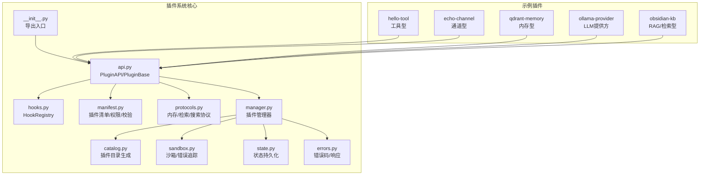
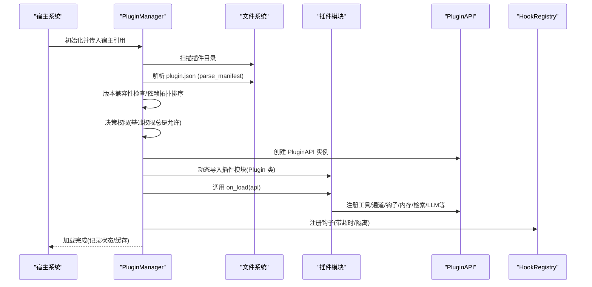
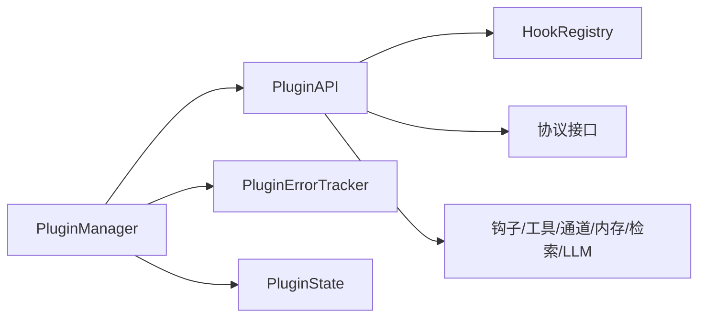

# 插件API

<cite>
**本文引用的文件**
- [src/synapse/plugins/__init__.py](file://src/synapse/plugins/__init__.py)
- [src/synapse/plugins/api.py](file://src/synapse/plugins/api.py)
- [src/synapse/plugins/hooks.py](file://src/synapse/plugins/hooks.py)
- [src/synapse/plugins/manifest.py](file://src/synapse/plugins/manifest.py)
- [src/synapse/plugins/protocols.py](file://src/synapse/plugins/protocols.py)
- [src/synapse/plugins/manager.py](file://src/synapse/plugins/manager.py)
- [src/synapse/plugins/catalog.py](file://src/synapse/plugins/catalog.py)
- [src/synapse/plugins/sandbox.py](file://src/synapse/plugins/sandbox.py)
- [src/synapse/plugins/state.py](file://src/synapse/plugins/state.py)
- [src/synapse/plugins/errors.py](file://src/synapse/plugins/errors.py)
- [examples/plugins/hello-tool/plugin.py](file://examples/plugins/hello-tool/plugin.py)
- [examples/plugins/echo-channel/plugin.py](file://examples/plugins/echo-channel/plugin.py)
- [examples/plugins/qdrant-memory/plugin.py](file://examples/plugins/qdrant-memory/plugin.py)
- [examples/plugins/ollama-provider/plugin.py](file://examples/plugins/ollama-provider/plugin.py)
- [examples/plugins/obsidian-kb/plugin.py](file://examples/plugins/obsidian-kb/plugin.py)
</cite>

## 目录
1. [简介](#简介)
2. [项目结构](#项目结构)
3. [核心组件](#核心组件)
4. [架构总览](#架构总览)
5. [详细组件分析](#详细组件分析)
6. [依赖分析](#依赖分析)
7. [性能考虑](#性能考虑)
8. [故障排查指南](#故障排查指南)
9. [结论](#结论)
10. [附录](#附录)

## 简介
本文件面向插件开发者，系统化阐述 Synapse 插件API的设计与使用方法。内容覆盖插件协议规范、生命周期钩子与事件系统、插件注册机制、权限模型与安全边界、插件类型与示例、配置与元数据、版本兼容性、测试调试与发布流程，以及插件间通信、资源共享与冲突处理策略。

## 项目结构
Synapse 的插件系统位于 src/synapse/plugins 下，围绕“清单解析、权限控制、生命周期管理、钩子调度、沙箱隔离、状态持久化”构建；examples/plugins 提供多种类型插件的参考实现。

图表来源
- [src/synapse/plugins/__init__.py:1-36](file://src/synapse/plugins/__init__.py#L1-L36)
- [src/synapse/plugins/api.py:60-697](file://src/synapse/plugins/api.py#L60-L697)
- [src/synapse/plugins/hooks.py:53-225](file://src/synapse/plugins/hooks.py#L53-L225)
- [src/synapse/plugins/manifest.py:70-378](file://src/synapse/plugins/manifest.py#L70-L378)
- [src/synapse/plugins/protocols.py:8-49](file://src/synapse/plugins/protocols.py#L8-L49)
- [src/synapse/plugins/manager.py:44-781](file://src/synapse/plugins/manager.py#L44-L781)
- [src/synapse/plugins/catalog.py:19-96](file://src/synapse/plugins/catalog.py#L19-L96)
- [src/synapse/plugins/sandbox.py:20-127](file://src/synapse/plugins/sandbox.py#L20-L127)
- [src/synapse/plugins/state.py:29-136](file://src/synapse/plugins/state.py#L29-L136)
- [src/synapse/plugins/errors.py:9-191](file://src/synapse/plugins/errors.py#L9-L191)

章节来源
- [src/synapse/plugins/__init__.py:1-36](file://src/synapse/plugins/__init__.py#L1-L36)
- [src/synapse/plugins/manager.py:44-117](file://src/synapse/plugins/manager.py#L44-L117)

## 核心组件
- 插件API与基类：PluginAPI 提供受限能力接口；PluginBase 定义加载/卸载生命周期。
- 钩子系统：HookRegistry 统一注册、分发与隔离执行，支持异步/同步回调与超时保护。
- 清单与权限：PluginManifest 解析与校验，定义基础/高级/系统三档权限，支持路径安全校验。
- 协议接口：MemoryBackendProtocol、RetrievalSource、SearchBackend 为扩展能力提供抽象。
- 管理器：PluginManager 负责发现、拓扑排序、加载/卸载、权限审批、错误追踪与自动禁用。
- 目录与状态：PluginCatalog 生成系统提示词中的“已安装插件”段落；PluginState 持久化启用/权限/错误等状态。
- 沙箱与错误：PluginErrorTracker 记录错误并触发自动禁用；safe_call/safe_call_sync 提供超时与异常隔离。
- 错误码：统一错误码与多语言消息，便于前端展示与引导。

章节来源
- [src/synapse/plugins/api.py:60-697](file://src/synapse/plugins/api.py#L60-L697)
- [src/synapse/plugins/hooks.py:53-225](file://src/synapse/plugins/hooks.py#L53-L225)
- [src/synapse/plugins/manifest.py:70-378](file://src/synapse/plugins/manifest.py#L70-L378)
- [src/synapse/plugins/protocols.py:8-49](file://src/synapse/plugins/protocols.py#L8-L49)
- [src/synapse/plugins/manager.py:44-781](file://src/synapse/plugins/manager.py#L44-L781)
- [src/synapse/plugins/catalog.py:19-96](file://src/synapse/plugins/catalog.py#L19-L96)
- [src/synapse/plugins/sandbox.py:20-127](file://src/synapse/plugins/sandbox.py#L20-L127)
- [src/synapse/plugins/state.py:29-136](file://src/synapse/plugins/state.py#L29-L136)
- [src/synapse/plugins/errors.py:9-191](file://src/synapse/plugins/errors.py#L9-L191)

## 架构总览
插件系统通过“清单驱动 + 权限约束 + 生命周期 + 钩子调度 + 沙箱隔离”的方式，确保插件在宿主环境内安全可控地扩展能力。

图表来源
- [src/synapse/plugins/manager.py:165-247](file://src/synapse/plugins/manager.py#L165-L247)
- [src/synapse/plugins/manifest.py:253-294](file://src/synapse/plugins/manifest.py#L253-L294)
- [src/synapse/plugins/api.py:60-144](file://src/synapse/plugins/api.py#L60-L144)
- [src/synapse/plugins/hooks.py:64-91](file://src/synapse/plugins/hooks.py#L64-L91)

## 详细组件分析

### 插件API与权限模型
- 权限分级与默认值
  - 基础权限：始终允许（如 tools.register、hooks.basic、config.read/write、data.own、log、skill）。
  - 高级权限：需用户批准（如 memory.read/write、channel.register/send、hooks.message/retrieve、retrieval.register、search.register、routes.register、brain.access、vector.access、settings.read、llm.register）。
  - 系统权限：保留（如 hooks.all、memory.replace、system.config.write）。
- 权限检查策略
  - 调用受控方法前进行权限判定；若未授权且非强制模式，记录告警并跳过；强制模式抛出 PluginPermissionError。
  - 已请求但未批准的高级/系统权限不会自动授予，需通过 UI 审批流程更新。
- 配置与数据
  - 支持读取/写入插件专属 config.json；数据目录自动创建 data 子目录。
- 日志
  - 每个插件拥有独立 logger 与轮转日志文件，避免污染宿主日志。
- 注册能力
  - 工具注册：支持 OpenAI/Anthropic 格式工具定义标准化；去重与冲突检测。
  - 钩子注册：按钩子类别授予不同权限；支持异步/同步回调与超时。
  - 通道注册：注册适配器工厂，支持 owner 标记以便清理。
  - 内存后端：可替换内置内存或追加自定义后端。
  - 检索源：注册外部知识源，参与检索链路。
  - LLM 提供方与注册表：动态注册 LLMProvider 与 Vendor Registry。
  - API 路由：挂载插件专属路由（延迟可用时排队）。
  - 主机访问：按权限暴露 brain/memory/vector/settings 等只读能力。
  - 发送消息：通过网关适配器发送文本消息（异步任务）。
- 卸载清理
  - 自动注销钩子、工具、通道、MCP、内存/检索后端、LLM 提供方/注册表，并关闭日志句柄。

章节来源
- [src/synapse/plugins/api.py:60-697](file://src/synapse/plugins/api.py#L60-L697)
- [src/synapse/plugins/manifest.py:29-67](file://src/synapse/plugins/manifest.py#L29-L67)

### 钩子系统与事件
- 钩子类型
  - 基础：on_init、on_shutdown、on_schedule、on_config_change、on_error
  - 消息：on_message_received、on_message_sending、on_session_start、on_session_end
  - 检索：on_retrieve、on_prompt_build、on_tool_result、on_before_tool_use、on_after_tool_use、on_before_llm_call
- 执行模型
  - 并行异步执行，每个回调独立超时与异常隔离；失败不影响其他回调。
  - 同步上下文提供同步分发，必要时在线程池执行异步回调。
- 超时与隔离
  - 默认超时 5 秒；可通过 manifest.hook_timeout 覆盖；错误计入 PluginErrorTracker。
- 注册与注销
  - 支持按插件维度批量注销；提供统计信息。

章节来源
- [src/synapse/plugins/hooks.py:15-33](file://src/synapse/plugins/hooks.py#L15-L33)
- [src/synapse/plugins/hooks.py:53-225](file://src/synapse/plugins/hooks.py#L53-L225)

### 清单与版本兼容性
- 必填字段与类型
  - id、name、version、type（python/mcp/skill）、entry（默认根据 type 推断）。
- 字段校验
  - 正则校验 id；entry 不允许包含 “..”；路径字段禁止绝对路径与路径穿越。
- 权限过滤
  - 未知权限会被忽略并告警，仅保留已知集合。
- 版本与兼容性
  - 通过 check_compatibility 进行系统版本、API 版本、Python 与 SDK 兼容性检查；错误/警告记录在日志中。
- 依赖与冲突
  - 使用拓扑排序处理 depends；检测循环依赖并跳过；与已加载插件冲突则跳过。

章节来源
- [src/synapse/plugins/manifest.py:24-131](file://src/synapse/plugins/manifest.py#L24-L131)
- [src/synapse/plugins/manifest.py:253-378](file://src/synapse/plugins/manifest.py#L253-L378)
- [src/synapse/plugins/manager.py:106-117](file://src/synapse/plugins/manager.py#L106-L117)
- [src/synapse/plugins/manager.py:132-163](file://src/synapse/plugins/manager.py#L132-L163)

### 协议接口
- 内存后端协议：store/search/delete/get_injection_context/start_session/end_session/record_turn。
- 检索源协议：source_name + retrieve(query, limit)。
- 搜索后端协议：search/add/delete/batch_add/available/backend_type。

章节来源
- [src/synapse/plugins/protocols.py:8-49](file://src/synapse/plugins/protocols.py#L8-L49)

### 管理器与生命周期
- 发现与加载
  - 扫描插件目录，解析清单，拓扑排序，版本兼容性检查，权限决议，加载插件模块，调用 on_load。
- 卸载与重载
  - on_unload 线程化执行；清理工具/钩子/通道/MCP/内存/检索/LLM；支持按需重载以应用新权限。
- 自动禁用
  - PluginErrorTracker 在窗口时间内累计错误达到阈值后自动禁用插件并卸载。
- 状态与日志
  - PluginState 持久化启用/权限/错误计数；提供日志尾部读取接口。

章节来源
- [src/synapse/plugins/manager.py:165-781](file://src/synapse/plugins/manager.py#L165-L781)
- [src/synapse/plugins/state.py:29-136](file://src/synapse/plugins/state.py#L29-L136)
- [src/synapse/plugins/sandbox.py:20-127](file://src/synapse/plugins/sandbox.py#L20-L127)

### 插件目录与状态
- PluginCatalog 生成“已安装插件”表格，汇总工具与技能提供情况。
- PluginState 提供启用/禁用、权限授予、错误计数、活跃后端槽位等持久化能力。

章节来源
- [src/synapse/plugins/catalog.py:19-96](file://src/synapse/plugins/catalog.py#L19-L96)
- [src/synapse/plugins/state.py:29-136](file://src/synapse/plugins/state.py#L29-L136)

### 沙箱与错误处理
- PluginErrorTracker：记录错误上下文（时间、插件、钩子/调用点），在时间窗口内超过阈值自动禁用插件。
- safe_call/safe_call_sync：提供超时与异常隔离，返回默认值而非抛出异常。

章节来源
- [src/synapse/plugins/sandbox.py:20-127](file://src/synapse/plugins/sandbox.py#L20-L127)

### 错误码与响应
- 统一错误码枚举与多语言消息；提供错误响应构造函数，便于 API 层返回一致结构。

章节来源
- [src/synapse/plugins/errors.py:9-191](file://src/synapse/plugins/errors.py#L9-L191)

## 依赖分析
- 组件耦合
  - PluginManager 与 PluginAPI 双向协作：前者负责生命周期与权限，后者提供能力注册与主机访问。
  - HookRegistry 与 PluginAPI 紧密配合，确保钩子注册与超时控制。
  - PluginErrorTracker 与 PluginManager 协作，实现自动禁用与卸载。
- 外部集成点
  - MCP 客户端：用于注册/断开 MCP 服务器。
  - 工具/技能/检索/LLM 注册表：作为宿主引用注入 PluginAPI。
- 循环依赖
  - 未见直接循环依赖；通过“宿主引用字典”与“延迟注册”规避。

图表来源
- [src/synapse/plugins/manager.py:44-781](file://src/synapse/plugins/manager.py#L44-L781)
- [src/synapse/plugins/api.py:60-697](file://src/synapse/plugins/api.py#L60-L697)
- [src/synapse/plugins/hooks.py:53-225](file://src/synapse/plugins/hooks.py#L53-L225)
- [src/synapse/plugins/sandbox.py:20-127](file://src/synapse/plugins/sandbox.py#L20-L127)
- [src/synapse/plugins/state.py:29-136](file://src/synapse/plugins/state.py#L29-L136)
- [src/synapse/plugins/protocols.py:8-49](file://src/synapse/plugins/protocols.py#L8-L49)

## 性能考虑
- 异步钩子与并行分发：提升高并发场景下的响应能力，避免阻塞。
- 超时与隔离：防止慢回调拖垮整个系统；错误累积触发自动禁用，降低级联故障风险。
- 工具/检索/LLM 注册表懒加载：减少启动时的依赖开销。
- 日志轮转与最小化 IO：避免频繁磁盘写入影响性能。

## 故障排查指南
- 常见问题定位
  - 清单校验失败：检查 plugin.json 字段、权限、路径是否合法。
  - 权限不足：确认 UI 中已批准相应权限；查看插件日志中“权限未授予”提示。
  - 加载超时：调整 manifest.load_timeout；检查插件初始化耗时。
  - 钩子超时/报错：查看 manifest.hook_timeout；检查回调实现与外部依赖。
  - 自动禁用：通过 PluginErrorTracker 查看错误记录；检查日志尾部。
- 日志与诊断
  - 使用 PluginManager.get_plugin_logs 获取最近 N 行日志。
  - 检查 data/plugins/<id>/logs/<id>.log 文件。
- 常见错误码
  - INVALID_MANIFEST、PERMISSION_DENIED、LOAD_FAILED、TIMEOUT、COMPATIBILITY_ERROR 等，结合错误码消息与指引快速定位。

章节来源
- [src/synapse/plugins/manager.py:744-758](file://src/synapse/plugins/manager.py#L744-L758)
- [src/synapse/plugins/errors.py:9-191](file://src/synapse/plugins/errors.py#L9-L191)

## 结论
Synapse 插件API通过严格的清单与权限模型、完善的生命周期与钩子系统、可靠的沙箱与错误处理机制，为开发者提供安全、可控、可扩展的插件生态。遵循本文档的规范与最佳实践，可高效构建工具、通道、RAG、记忆、LLM 提供方等各类插件，并在生产环境中稳定运行。

## 附录

### 插件类型与开发示例

- 工具型插件（hello-tool）
  - 目标：注册一个可被 LLM 调用的工具。
  - 关键步骤：定义工具定义（OpenAI/Anthropic 两种格式均可）、实现处理器、调用 api.register_tools。
  - 示例路径：[examples/plugins/hello-tool/plugin.py:8-40](file://examples/plugins/hello-tool/plugin.py#L8-L40)

- 通道型插件（echo-channel）
  - 目标：注册 IM 适配器，回显收到的消息。
  - 关键步骤：实现 ChannelAdapter 子类，注册工厂；注册 on_message_received 钩子；使用 api.send_message 回发。
  - 示例路径：[examples/plugins/echo-channel/plugin.py:17-109](file://examples/plugins/echo-channel/plugin.py#L17-L109)

- 记忆型插件（qdrant-memory）
  - 目标：实现 MemoryBackendProtocol，作为内存后端提供者。
  - 关键步骤：实现协议方法；调用 api.register_memory_backend。
  - 示例路径：[examples/plugins/qdrant-memory/plugin.py:13-75](file://examples/plugins/qdrant-memory/plugin.py#L13-L75)

- LLM 提供方插件（ollama-provider）
  - 目标：注册 LLMProvider 与 Vendor Registry，接入本地推理服务。
  - 关键步骤：定义 Provider/Registry 类；调用 api.register_llm_provider 与 api.register_llm_registry。
  - 示例路径：[examples/plugins/ollama-provider/plugin.py:13-97](file://examples/plugins/ollama-provider/plugin.py#L13-L97)

- RAG/检索型插件（obsidian-kb）
  - 目标：将本地知识库作为检索源，同时提供工具集。
  - 关键步骤：实现检索器（RetrievalSource）；注册检索源与 on_retrieve 钩子；注册工具定义与处理器。
  - 示例路径：[examples/plugins/obsidian-kb/plugin.py:342-657](file://examples/plugins/obsidian-kb/plugin.py#L342-L657)

### 插件配置与元数据
- 清单字段
  - 必填：id、name、version、type、entry（可省略，默认按 type 推断）。
  - 权限：permissions（自动过滤未知项）。
  - 兼容性：load_timeout、hook_timeout、retrieve_timeout（秒）。
  - 元信息：description、author、license、homepage、category、tags、icon、display_name_*、description_i18n、review_status。
  - 依赖与冲突：depends、conflicts。
  - 提供能力：provides（如 provides.skill 指向技能文件）。
- 路径安全
  - 禁止 “..”、绝对路径与盘符路径穿越。

章节来源
- [src/synapse/plugins/manifest.py:70-206](file://src/synapse/plugins/manifest.py#L70-L206)
- [src/synapse/plugins/manifest.py:212-287](file://src/synapse/plugins/manifest.py#L212-L287)

### 插件测试、调试与发布
- 测试建议
  - 单元测试：针对工具处理器、检索器、适配器的关键分支。
  - 集成测试：模拟钩子触发、工具调用、消息收发、检索注入。
  - 性能测试：评估钩子超时、检索延迟、并发场景下的稳定性。
- 调试要点
  - 使用 api.log 输出调试信息；检查插件日志；利用 get_plugin_logs 快速定位问题。
  - 对慢回调设置更长 hook_timeout；对网络依赖增加重试与降级。
- 发布流程
  - 本地验证：validate_plugin 检查清单、路径、入口文件、技能文件（如适用）。
  - 权限最小化：仅声明必要权限；在 UI 中逐步批准高级权限。
  - 兼容性验证：在目标 Synapse 版本上进行加载与功能测试。
  - 文档与元数据：完善 plugin.json 与 README，提供使用示例与注意事项。

章节来源
- [src/synapse/plugins/manifest.py:307-378](file://src/synapse/plugins/manifest.py#L307-L378)
- [src/synapse/plugins/manager.py:744-758](file://src/synapse/plugins/manager.py#L744-L758)

### 插件间通信、资源共享与冲突解决
- 插件间通信
  - 通过共享钩子链路传递上下文；工具调用与检索结果可被其他插件消费。
  - 使用 HookRegistry 的并行分发特性，多个插件可同时响应同一事件。
- 资源共享
  - 工具注册时进行名称去重与冲突检测；通道注册支持 owner 标识以便精确清理。
  - 内存/检索后端可叠加注册；替换模式需明确 granted_permissions。
- 冲突解决
  - 依赖拓扑排序避免循环依赖；conflicts 字段阻止与已加载插件冲突的插件加载。
  - 权限审批：未批准的高级/系统权限不会生效，避免越权行为。

章节来源
- [src/synapse/plugins/api.py:195-250](file://src/synapse/plugins/api.py#L195-L250)
- [src/synapse/plugins/api.py:316-343](file://src/synapse/plugins/api.py#L316-L343)
- [src/synapse/plugins/manager.py:132-163](file://src/synapse/plugins/manager.py#L132-L163)
- [src/synapse/plugins/manager.py:208-226](file://src/synapse/plugins/manager.py#L208-L226)