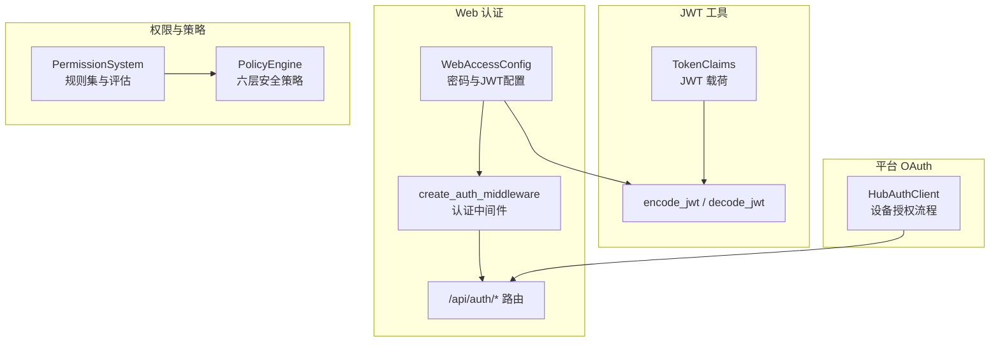
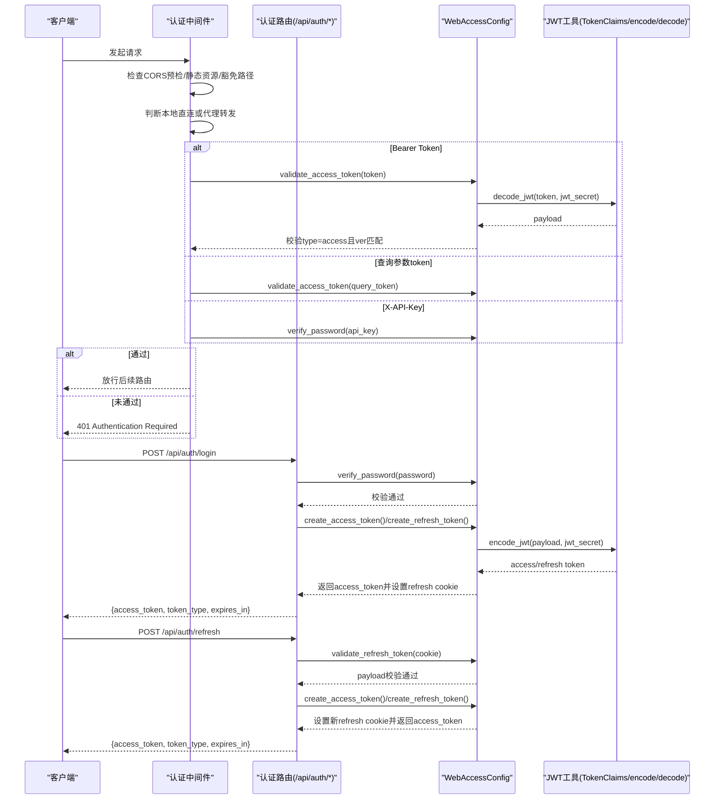
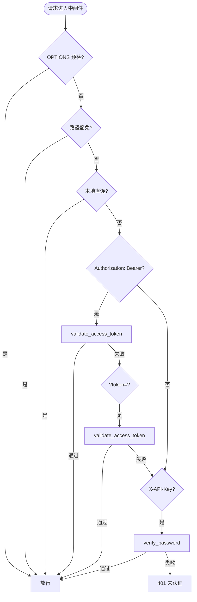
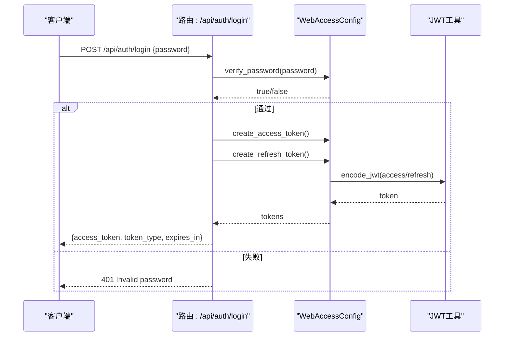
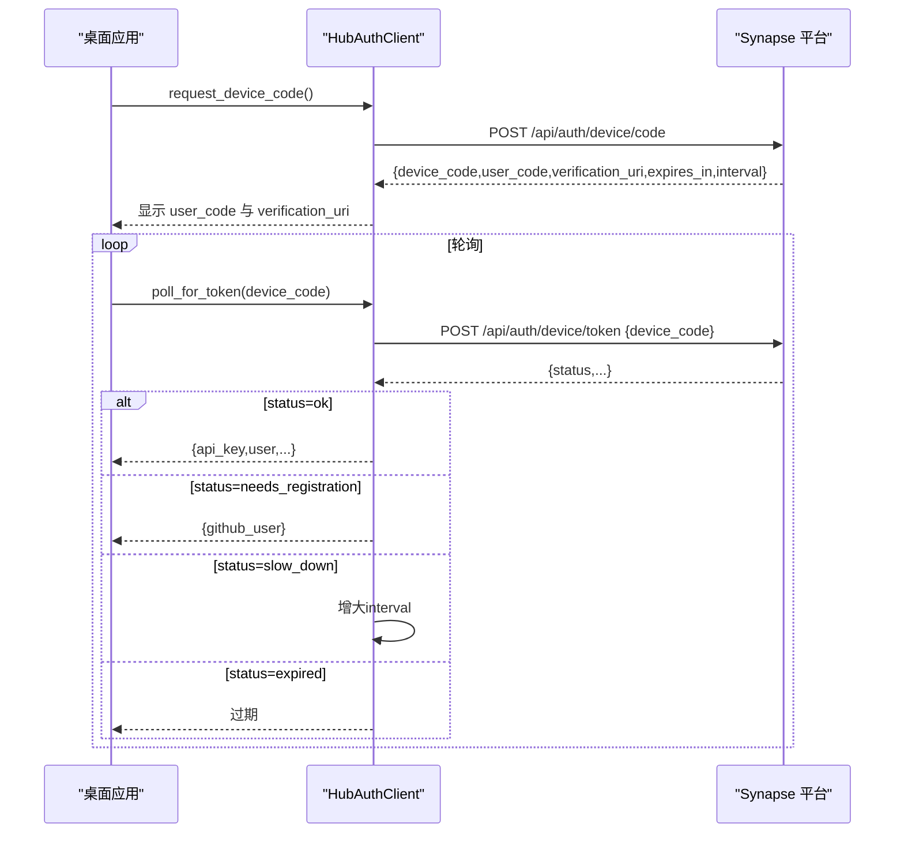
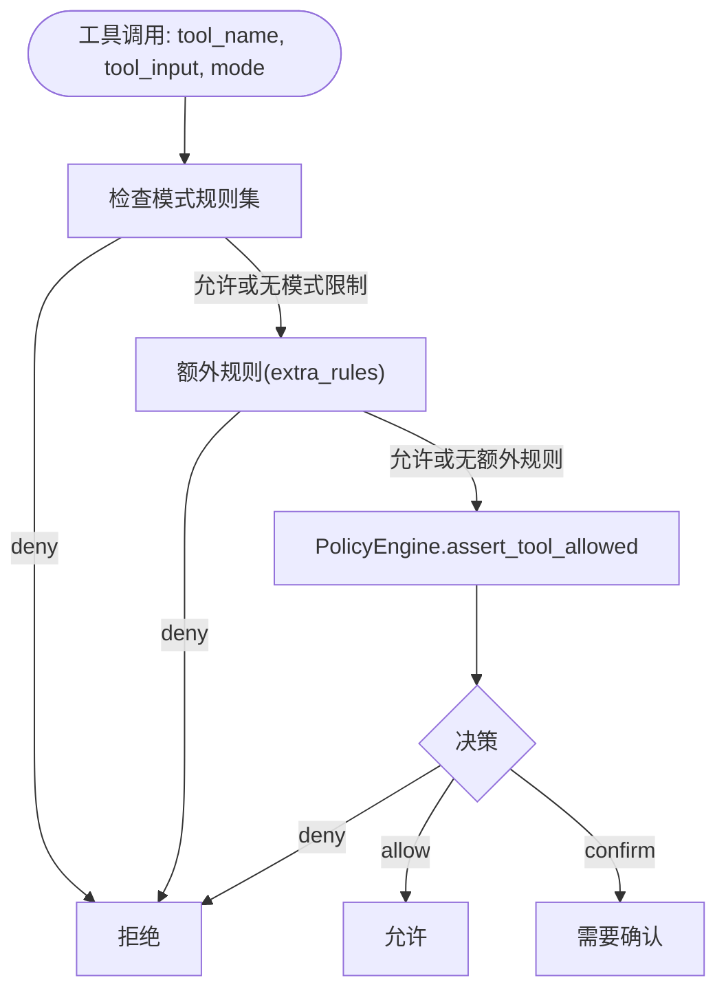
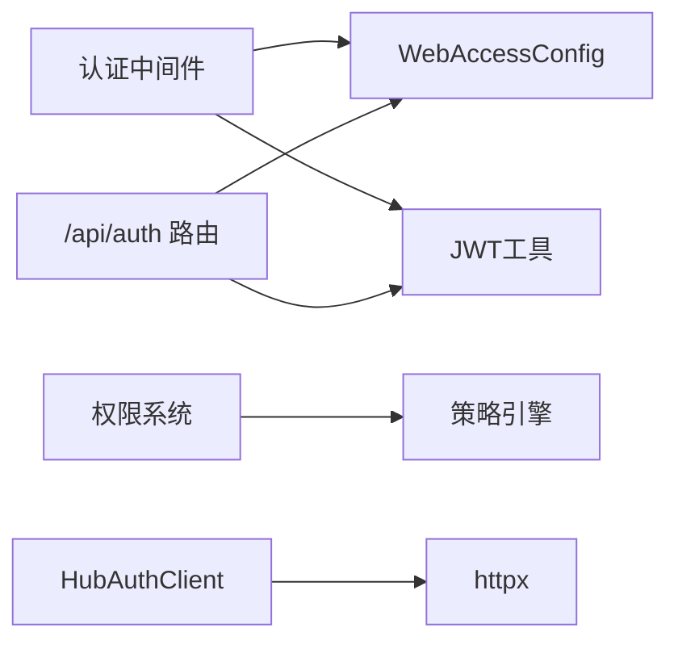

# 认证和授权

<cite>
**本文引用的文件**
- [src/synapse/api/auth.py](file://src/synapse/api/auth.py)
- [src/synapse/api/routes/auth.py](file://src/synapse/api/routes/auth.py)
- [src/synapse/api/server.py](file://src/synapse/api/server.py)
- [src/synapse/core/auth/tokens.py](file://src/synapse/core/auth/tokens.py)
- [src/synapse/core/permission.py](file://src/synapse/core/permission.py)
- [src/synapse/core/policy.py](file://src/synapse/core/policy.py)
- [src/synapse/hub/auth.py](file://src/synapse/hub/auth.py)
- [auth_api/auth_core.py](file://auth_api/auth_core.py)
- [auth_api/user_db.py](file://auth_api/user_db.py)
- [src/synapse/config.py](file://src/synapse/config.py)
</cite>

## 目录
1. [简介](#简介)
2. [项目结构](#项目结构)
3. [核心组件](#核心组件)
4. [架构总览](#架构总览)
5. [详细组件分析](#详细组件分析)
6. [依赖分析](#依赖分析)
7. [性能考虑](#性能考虑)
8. [故障排查指南](#故障排查指南)
9. [结论](#结论)
10. [附录](#附录)

## 简介
本文件为 Synapse 认证与授权系统的权威技术文档，覆盖以下主题：
- 单密码口令认证（Web 访问）、JWT 令牌签发与校验、刷新与撤销流程
- OAuth 设备授权流程（平台侧）
- 权限模型、角色系统与访问控制列表（ACL）
- 安全最佳实践、令牌管理与会话管理
- 认证中间件使用指南与自定义认证方案实现方法

## 项目结构
围绕认证与授权的关键模块分布如下：
- Web 认证与中间件：src/synapse/api/auth.py、src/synapse/api/server.py、src/synapse/api/routes/auth.py
- JWT 工具：src/synapse/core/auth/tokens.py
- 平台 OAuth（设备授权）：src/synapse/hub/auth.py
- 传统 JWT 认证核心与用户存储（auth_api）：auth_api/auth_core.py、auth_api/user_db.py
- 权限与策略：src/synapse/core/permission.py、src/synapse/core/policy.py
- 配置：src/synapse/config.py

图表来源
- [src/synapse/api/auth.py:294-380](file://src/synapse/api/auth.py#L294-L380)
- [src/synapse/api/routes/auth.py:28-257](file://src/synapse/api/routes/auth.py#L28-L257)
- [src/synapse/core/auth/tokens.py:26-77](file://src/synapse/core/auth/tokens.py#L26-L77)
- [src/synapse/hub/auth.py:41-109](file://src/synapse/hub/auth.py#L41-L109)
- [src/synapse/core/permission.py:103-495](file://src/synapse/core/permission.py#L103-L495)
- [src/synapse/core/policy.py:526-800](file://src/synapse/core/policy.py#L526-L800)

章节来源
- [src/synapse/api/server.py:210-556](file://src/synapse/api/server.py#L210-L556)

## 核心组件
- Web 访问认证与中间件
  - WebAccessConfig：管理 web_access.json（JWT 密钥、口令哈希、令牌版本、数据纪元等），提供口令校验、JWT 签发/校验、令牌版本控制、密码变更与提示等
  - create_auth_middleware：FastAPI 中间件，支持 Bearer Token、查询参数 token、X-API-Key 三种认证方式；本地直连豁免；支持 TRUST_PROXY 与 X-Forwarded-For 区分代理转发与本地直连
- JWT 工具
  - TokenClaims：标准化 JWT 载荷（sub、iat、exp、jti、type、ver、scope、extra）
  - encode_jwt / decode_jwt：HS256 签名与校验，含过期时间检查
- 平台 OAuth（设备授权）
  - HubAuthClient：实现 GitHub 设备授权流程（请求设备码、轮询换取令牌、处理需要注册、速率限制、过期等状态）
- 权限与策略
  - PermissionSystem：规则集（permission, pattern, action）与评估（findLast 语义），支持工具级禁用、路径级检查
  - PolicyEngine：六层安全策略（Zone×OpType 矩阵、平台危险命令模式、ToolPolicy、ScopePolicy 等），提供工具执行前的决策与审计
- 传统 JWT 认证核心与用户存储（auth_api）
  - auth_core.py：基于 JOSE 的 HS256 JWT 生成/验证、bcrypt 密码哈希、access/refresh 令牌对生成、JTI 旋转机制
  - user_db.py：SQLite 用户与刷新令牌存储，支持 JTI 唯一性、撤销、过期清理

章节来源
- [src/synapse/api/auth.py:91-250](file://src/synapse/api/auth.py#L91-L250)
- [src/synapse/api/auth.py:294-380](file://src/synapse/api/auth.py#L294-L380)
- [src/synapse/core/auth/tokens.py:26-77](file://src/synapse/core/auth/tokens.py#L26-L77)
- [src/synapse/hub/auth.py:41-109](file://src/synapse/hub/auth.py#L41-L109)
- [src/synapse/core/permission.py:103-495](file://src/synapse/core/permission.py#L103-L495)
- [src/synapse/core/policy.py:526-800](file://src/synapse/core/policy.py#L526-L800)
- [auth_api/auth_core.py:13-86](file://auth_api/auth_core.py#L13-L86)
- [auth_api/user_db.py:12-140](file://auth_api/user_db.py#L12-L140)

## 架构总览
Web 认证与授权的整体流程如下：

图表来源
- [src/synapse/api/auth.py:294-380](file://src/synapse/api/auth.py#L294-L380)
- [src/synapse/api/routes/auth.py:86-201](file://src/synapse/api/routes/auth.py#L86-L201)
- [src/synapse/core/auth/tokens.py:26-77](file://src/synapse/core/auth/tokens.py#L26-L77)

章节来源
- [src/synapse/api/server.py:275-312](file://src/synapse/api/server.py#L275-L312)

## 详细组件分析

### Web 访问认证与中间件
- 认证方式
  - Bearer Token：Authorization: Bearer <access_token>
  - 查询参数 token：/api/...?token=<access_token>（用于 img/audio 等无法设置头的场景）
  - X-API-Key：程序化访问，校验为口令明文（单密码模式）
- 本地直连豁免与代理区分
  - 本地直连（127.0.0.1、::1、localhost，以及 ::ffff:127.0.0.1）在未开启 TRUST_PROXY 或无 X-Forwarded-For 时豁免认证
  - 开启 TRUST_PROXY 时，若存在 X-Forwarded-For，则视为代理转发，必须认证
- 豁免路径
  - 根路径、健康检查、认证相关端点、部分静态资源与文档路径
- 登录限流
  - 基于 IP 的滑动窗口限流，防止暴力破解
- 令牌与配置
  - access_token：24 小时过期
  - refresh_token：90 天过期，HttpOnly Cookie，SameSite=Strict，secure 取决于 API_HTTPS
  - web_access.json：包含 jwt_secret、data_epoch、token_version、口令哈希与提示、用户设置标记等

图表来源
- [src/synapse/api/auth.py:328-380](file://src/synapse/api/auth.py#L328-L380)

章节来源
- [src/synapse/api/auth.py:38-49](file://src/synapse/api/auth.py#L38-L49)
- [src/synapse/api/auth.py:294-380](file://src/synapse/api/auth.py#L294-L380)
- [src/synapse/api/routes/auth.py:86-201](file://src/synapse/api/routes/auth.py#L86-L201)

### 认证 API 路由（登录/刷新/登出/检查/改密/口令提示）
- POST /api/auth/login
  - 校验密码（WebAccessConfig.verify_password）
  - 生成 access_token 与 refresh_token
  - 设置 HttpOnly refresh cookie（90 天）
  - 返回 {access_token, token_type, expires_in}
- POST /api/auth/refresh
  - 读取 refresh cookie，校验 refresh_token（decode + type=refresh + ver）
  - 生成新的 access_token 与 refresh_token，并更新 cookie
- POST /api/auth/logout
  - 清除 refresh cookie
- GET /api/auth/check
  - 本地直连：始终返回 authenticated=true
  - Bearer Token：校验通过则返回 authenticated=true
  - refresh cookie：有效则返回 needs_refresh=true
- POST /api/auth/change-password
  - 本地：无需当前密码，直接变更
  - 远程：需提供正确 current_password
  - 变更后使 token_version 升级，旧令牌失效；广播断开远程会话
- GET /api/auth/password-hint
  - 仅本地直连可用，返回口令提示

图表来源
- [src/synapse/api/routes/auth.py:86-119](file://src/synapse/api/routes/auth.py#L86-L119)
- [src/synapse/api/auth.py:211-229](file://src/synapse/api/auth.py#L211-L229)
- [src/synapse/core/auth/tokens.py:26-77](file://src/synapse/core/auth/tokens.py#L26-L77)

章节来源
- [src/synapse/api/routes/auth.py:86-257](file://src/synapse/api/routes/auth.py#L86-L257)

### 平台 OAuth（设备授权）
- HubAuthClient
  - request_device_code：请求设备码（device_code、user_code、verification_uri、expires_in、interval）
  - poll_for_token：轮询换取 access_token，处理状态：
    - ok：返回 api_key、user 信息
    - needs_registration：返回 github_user，引导注册
    - slow_down：增大轮询间隔
    - expired：设备码过期
- 适用场景：桌面应用通过设备授权流程登录 Synapse 平台

图表来源
- [src/synapse/hub/auth.py:49-109](file://src/synapse/hub/auth.py#L49-L109)

章节来源
- [src/synapse/hub/auth.py:41-109](file://src/synapse/hub/auth.py#L41-L109)

### 权限模型、角色系统与访问控制列表（ACL）
- 规则集（Ruleset）
  - 结构：(permission, pattern, action) 三元组
  - 评估：findLast 语义，最后一个匹配规则生效
  - 动作：allow/deny/ask
- 工具映射
  - 编辑类工具映射到 "edit"，读取类工具映射到 "read"，其他工具映射到工具名
- 路径级检查
  - check_path：在文件操作前进行路径级限制
- 模式规则
  - PLAN_MODE、ASK_MODE、COORDINATOR_MODE 三套规则集，限制不同模式下的工具使用
- 统一权限决策
  - check_permission：先评估模式规则，再调用 PolicyEngine，最后返回统一决策对象（behavior/reason/policy_name/decision_chain）

图表来源
- [src/synapse/core/permission.py:248-332](file://src/synapse/core/permission.py#L248-L332)
- [src/synapse/core/permission.py:334-381](file://src/synapse/core/permission.py#L334-L381)

章节来源
- [src/synapse/core/permission.py:57-178](file://src/synapse/core/permission.py#L57-L178)
- [src/synapse/core/permission.py:189-212](file://src/synapse/core/permission.py#L189-L212)
- [src/synapse/core/permission.py:248-332](file://src/synapse/core/permission.py#L248-L332)

### 策略引擎（PolicyEngine）
- 六层安全防护
  - L1：Zone×OpType 矩阵（workspace/controlled/protected/forbidden 与 read/create/edit/overwrite/delete/recursive_delete）
  - L3：平台危险命令模式匹配与风险分级（CRITICAL/HIGH/MEDIUM/LOW）
  - ToolPolicy：工具级策略（允许/禁止、参数限制、需要确认）
  - ScopePolicy：范围策略（兼容旧配置）
- 关键能力
  - assert_tool_allowed：工具执行前的统一决策入口，返回 PolicyResult（decision/reason/policy_name/metadata）
  - 自保护与只读模式：死亡开关触发后，非只读操作拒绝
  - 用户白名单与临时允许：支持持久化与会话级允许列表
  - 沙箱与快照：高风险命令可进入沙箱执行，支持快照与审计

章节来源
- [src/synapse/core/policy.py:526-800](file://src/synapse/core/policy.py#L526-L800)

### 传统 JWT 认证核心与用户存储（auth_api）
- auth_core.py
  - Settings：SECRET_KEY、ALGORITHM、ACCESS_TOKEN_EXPIRE_MINUTES、REFRESH_TOKEN_EXPIRE_DAYS
  - verify_password/get_password_hash：bcrypt
  - create_access_token/create_refresh_token：HS256，refresh token 包含 JTI
  - decode_token：校验类型与签名
  - create_token_pair：返回 {access_token, refresh_token, token_type}
- user_db.py
  - UserDB：SQLite 用户表与刷新令牌表（refresh_tokens），支持 JTI 唯一性、撤销、过期清理
  - 方法：创建用户、按用户名/邮箱查询、存储/查询/撤销刷新令牌、清理过期

章节来源
- [auth_api/auth_core.py:13-86](file://auth_api/auth_core.py#L13-L86)
- [auth_api/user_db.py:12-140](file://auth_api/user_db.py#L12-L140)

## 依赖分析
- 认证中间件依赖 WebAccessConfig 与 JWT 工具
- 认证路由依赖 WebAccessConfig 与 FastAPI 响应
- 权限系统依赖策略引擎进行工具级决策
- 平台 OAuth 客户端依赖 httpx 与配置

图表来源
- [src/synapse/api/auth.py:25-26](file://src/synapse/api/auth.py#L25-L26)
- [src/synapse/api/routes/auth.py:20-26](file://src/synapse/api/routes/auth.py#L20-L26)
- [src/synapse/core/permission.py:295-314](file://src/synapse/core/permission.py#L295-L314)
- [src/synapse/hub/auth.py:12-16](file://src/synapse/hub/auth.py#L12-L16)

章节来源
- [src/synapse/api/server.py:31-73](file://src/synapse/api/server.py#L31-L73)

## 性能考虑
- 中间件采用滑动窗口限流（每 IP 60 秒最多 5 次），平衡安全与可用性
- JWT 校验为 O(1) 常数时间，decode_jwt 含过期检查与 HMAC 校验
- 权限评估与策略决策在工具执行前进行，建议合理配置规则集规模与模式规则，避免过度匹配
- 策略引擎支持 TTL 缓存与会话允许列表，减少重复确认与计算

## 故障排查指南
- 401 未认证
  - 检查 Authorization 头是否为 Bearer Token
  - 检查查询参数 token 是否正确传递
  - 检查 X-API-Key 是否为正确的口令明文
  - 检查 TRUST_PROXY 与 X-Forwarded-For 配置，确保代理转发场景正确
- 登录失败
  - 核对口令是否正确（WebAccessConfig.verify_password）
  - 检查登录限流（每 IP 60 秒最多 5 次）
- 刷新失败
  - 检查 refresh cookie 是否存在且未过期
  - 确认 token_version 与 jwt_secret 一致
- 口令变更后无法访问
  - 变更口令会提升 token_version，旧令牌失效
  - 远程会话会被断开，需重新登录
- 权限拒绝
  - 检查模式规则（PLAN/ASK/COORDINATOR）
  - 检查工具映射与路径规则
  - 检查策略引擎决策（PolicyEngine.assert_tool_allowed）

章节来源
- [src/synapse/api/auth.py:285-287](file://src/synapse/api/auth.py#L285-L287)
- [src/synapse/api/routes/auth.py:92-96](file://src/synapse/api/routes/auth.py#L92-L96)
- [src/synapse/api/routes/auth.py:127-135](file://src/synapse/api/routes/auth.py#L127-L135)
- [src/synapse/api/auth.py:201-210](file://src/synapse/api/auth.py#L201-L210)
- [src/synapse/core/permission.py:248-332](file://src/synapse/core/permission.py#L248-L332)
- [src/synapse/core/policy.py:759-800](file://src/synapse/core/policy.py#L759-L800)

## 结论
Synapse 的认证与授权体系以 WebAccessConfig 为核心，结合 FastAPI 中间件与 JWT 工具实现简洁可靠的单密码口令认证与令牌管理；通过权限系统与策略引擎提供细粒度的工具与路径级控制；平台侧提供 OAuth 设备授权流程以适配桌面应用登录。整体设计在安全性与易用性之间取得良好平衡。

## 附录

### 认证流程示例（获取访问令牌/刷新令牌/撤销权限）
- 获取访问令牌
  - POST /api/auth/login，携带 {password}
  - 成功后返回 access_token，并设置 HttpOnly refresh cookie
- 刷新访问令牌
  - POST /api/auth/refresh，携带 refresh cookie
  - 成功后返回新的 access_token，并更新 refresh cookie
- 撤销权限（登出）
  - POST /api/auth/logout，清除 refresh cookie
- 检查认证状态
  - GET /api/auth/check，返回当前认证状态与所需动作（如 needs_refresh）

章节来源
- [src/synapse/api/routes/auth.py:86-201](file://src/synapse/api/routes/auth.py#L86-L201)

### 安全最佳实践
- 传输安全
  - 生产环境启用 API_HTTPS，使 refresh cookie 为 secure
  - 使用 TRUST_PROXY 与 X-Forwarded-For 准确识别代理转发与本地直连
- 令牌管理
  - access_token 24 小时过期，refresh_token 90 天过期
  - 变更口令会提升 token_version，旧令牌失效
  - 远程会话断开，避免旧令牌继续使用
- 速率限制
  - 登录接口采用每 IP 60 秒最多 5 次的滑动窗口限流
- 权限与策略
  - 合理配置模式规则与额外规则，避免过度宽松
  - 使用策略引擎对高风险命令进行分级与确认

章节来源
- [src/synapse/api/auth.py:34-36](file://src/synapse/api/auth.py#L34-L36)
- [src/synapse/api/auth.py:201-210](file://src/synapse/api/auth.py#L201-L210)
- [src/synapse/api/routes/auth.py:92-96](file://src/synapse/api/routes/auth.py#L92-L96)
- [src/synapse/core/permission.py:248-332](file://src/synapse/core/permission.py#L248-L332)

### 认证中间件使用指南
- 注册中间件
  - 在 FastAPI 应用中注册 create_auth_middleware，确保在 CORS 之前
  - 中间件自动从 app.state.web_access_config 读取配置
- 配置项
  - TRUST_PROXY：是否信任上游代理的 X-Forwarded-For
  - API_HTTPS：是否启用 HTTPS，影响 refresh cookie 的 secure 标记
  - AUTH_EXEMPT_PATHS/AUTH_EXEMPT_PREFIXES：豁免路径集合
- 自定义认证方案
  - 可扩展中间件逻辑，增加新的认证头或参数校验
  - 可替换 WebAccessConfig 的存储后端（如外部口令服务）

章节来源
- [src/synapse/api/server.py:275-312](file://src/synapse/api/server.py#L275-L312)
- [src/synapse/api/auth.py:328-380](file://src/synapse/api/auth.py#L328-L380)