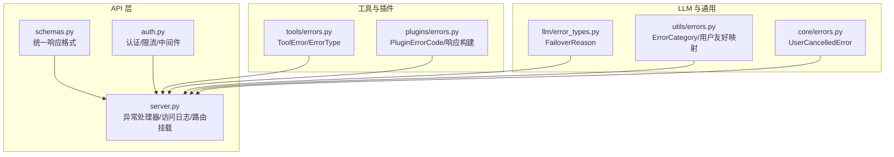
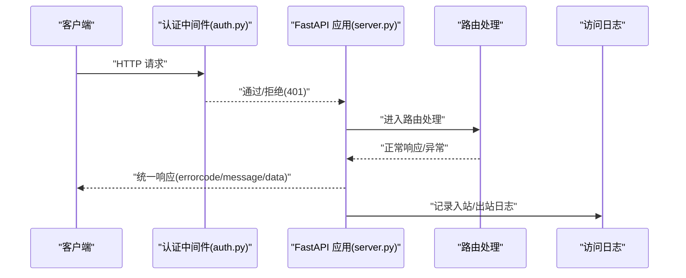
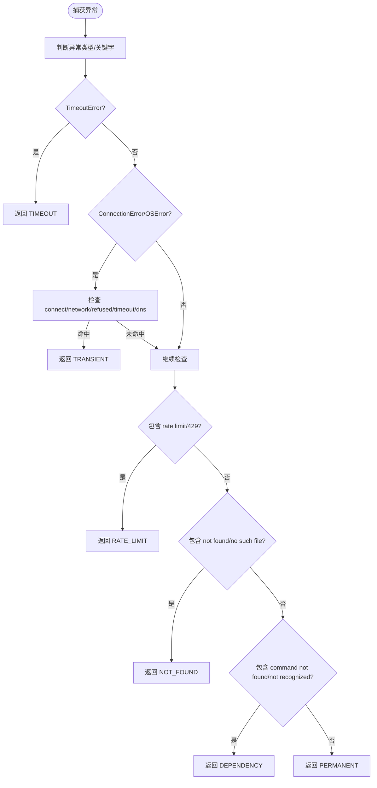
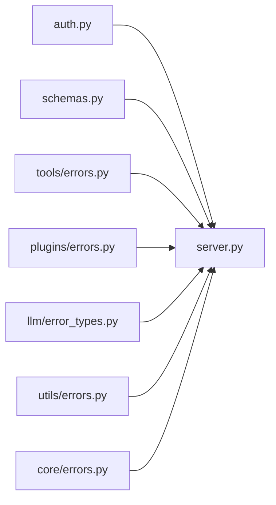

# 错误处理和状态码

<cite>
**本文引用的文件**
- [src/synapse/api/schemas.py](file://src/synapse/api/schemas.py)
- [src/synapse/api/auth.py](file://src/synapse/api/auth.py)
- [src/synapse/api/server.py](file://src/synapse/api/server.py)
- [src/synapse/tools/errors.py](file://src/synapse/tools/errors.py)
- [src/synapse/plugins/errors.py](file://src/synapse/plugins/errors.py)
- [src/synapse/utils/errors.py](file://src/synapse/utils/errors.py)
- [src/synapse/llm/error_types.py](file://src/synapse/llm/error_types.py)
- [src/synapse/core/errors.py](file://src/synapse/core/errors.py)
- [tests/unit/test_errors.py](file://tests/unit/test_errors.py)
</cite>

## 目录
1. [简介](#简介)
2. [项目结构](#项目结构)
3. [核心组件](#核心组件)
4. [架构总览](#架构总览)
5. [详细组件分析](#详细组件分析)
6. [依赖关系分析](#依赖关系分析)
7. [性能考量](#性能考量)
8. [故障排除指南](#故障排除指南)
9. [结论](#结论)
10. [附录](#附录)

## 简介
本文件为 Synapse API 的错误处理与状态码参考文档，覆盖以下主题：
- HTTP 状态码与错误响应格式
- 错误代码与异常类型清单
- 错误消息结构与调试信息
- 常见错误场景的诊断与解决
- API 版本兼容性、错误迁移与向后兼容
- 客户端错误处理最佳实践与重试策略
- 错误监控、日志记录与故障排除实务

## 项目结构
围绕错误处理与状态码的关键模块分布如下：
- API 层：统一响应格式、认证与访问日志、异常处理器
- 工具层：结构化工具错误与错误类型分类
- 插件层：插件 API 的统一错误响应与错误码
- LLM 层：错误分类与降级策略
- 工具函数：错误字符串到用户友好消息映射
- 核心异常：业务层面的用户取消等异常

图表来源
- [src/synapse/api/schemas.py:1-124](file://src/synapse/api/schemas.py#L1-L124)
- [src/synapse/api/auth.py:1-380](file://src/synapse/api/auth.py#L1-L380)
- [src/synapse/api/server.py:1-712](file://src/synapse/api/server.py#L1-L712)
- [src/synapse/tools/errors.py:1-201](file://src/synapse/tools/errors.py#L1-L201)
- [src/synapse/plugins/errors.py:1-191](file://src/synapse/plugins/errors.py#L1-L191)
- [src/synapse/llm/error_types.py:1-25](file://src/synapse/llm/error_types.py#L1-L25)
- [src/synapse/utils/errors.py:1-83](file://src/synapse/utils/errors.py#L1-L83)
- [src/synapse/core/errors.py:1-21](file://src/synapse/core/errors.py#L1-L21)

章节来源
- [src/synapse/api/schemas.py:1-124](file://src/synapse/api/schemas.py#L1-L124)
- [src/synapse/api/auth.py:1-380](file://src/synapse/api/auth.py#L1-L380)
- [src/synapse/api/server.py:1-712](file://src/synapse/api/server.py#L1-L712)

## 核心组件
- 统一响应格式
  - 成功响应字段：errorcode（整型）、message（字符串）、data（对象或空）
  - 失败响应字段：errorcode（整型）、message（字符串）、data.error（字符串或空）
- 错误类型与分类
  - 工具错误类型：transient、permanent、permission、timeout、validation、not_found、rate_limit、dependency
  - LLM 错误分类：quota、auth、structural、transient、unknown
  - 错误类别（UI 分类）：auth、quota、timeout、content_filter、network、server、unknown
  - 插件错误码：涵盖网络、manifest、权限、安装/卸载/加载、超时、依赖、兼容性、压缩包、配置、ID、管理器可用性、内部错误等
- 认证与访问控制
  - 支持 Bearer Token、查询参数 token、X-API-Key；本地直连豁免鉴权
  - 登录限流（滑动窗口）
  - 访问日志：/api 路由入站/出站日志，含状态码与耗时
- 异常处理
  - Pydantic 请求校验错误统一转为 422，并扁平化 detail
  - 401 未认证、403 仅允许本地关闭服务
- 用户友好错误映射
  - 将技术错误字符串映射为 UI 友好提示，保留完整错误供日志使用

章节来源
- [src/synapse/api/schemas.py:9-17](file://src/synapse/api/schemas.py#L9-L17)
- [src/synapse/tools/errors.py:29-52](file://src/synapse/tools/errors.py#L29-L52)
- [src/synapse/llm/error_types.py:13-24](file://src/synapse/llm/error_types.py#L13-L24)
- [src/synapse/utils/errors.py:13-23](file://src/synapse/utils/errors.py#L13-L23)
- [src/synapse/plugins/errors.py:9-29](file://src/synapse/plugins/errors.py#L9-L29)
- [src/synapse/api/auth.py:374-377](file://src/synapse/api/auth.py#L374-L377)
- [src/synapse/api/server.py:261-273](file://src/synapse/api/server.py#L261-L273)

## 架构总览
下面的序列图展示了 API 层在请求处理链路中的错误处理职责。

图表来源
- [src/synapse/api/auth.py:328-379](file://src/synapse/api/auth.py#L328-L379)
- [src/synapse/api/server.py:210-556](file://src/synapse/api/server.py#L210-L556)

## 详细组件分析

### 统一响应格式与错误字段
- 成功响应
  - errorcode: 0
  - message: "success"
  - data: 返回业务数据
- 失败响应
  - errorcode: 非零整数
  - message: 人类可读的错误摘要
  - data.error: 技术错误字符串（可选）

章节来源
- [src/synapse/api/schemas.py:9-17](file://src/synapse/api/schemas.py#L9-L17)

### HTTP 状态码与错误映射
- 401 未认证
  - 触发条件：缺少有效访问令牌、查询参数 token 或 X-API-Key
  - 响应：JSON，包含 detail 字段
- 403 禁止
  - 触发条件：仅允许本地发起的关机请求
- 422 请求校验错误
  - 触发条件：Pydantic 校验失败
  - 响应：扁平化的 detail 字符串
- 5xx 服务器错误
  - 触发条件：未捕获异常或内部错误
  - 响应：遵循统一错误格式

章节来源
- [src/synapse/api/auth.py:374-377](file://src/synapse/api/auth.py#L374-L377)
- [src/synapse/api/server.py:261-273](file://src/synapse/api/server.py#L261-L273)

### 工具错误类型与分类
- 错误类型
  - transient：可重试（网络超时、服务不可用等）
  - permanent：不可重试（逻辑错误、不支持的操作）
  - permission：权限不足
  - timeout：超时
  - validation：参数校验失败
  - not_found：资源不存在
  - rate_limit：速率限制
  - dependency：依赖缺失
- 自动分类策略
  - 基于异常类型与错误消息关键字进行判定
  - 提供 retry_suggestion、alternative_tools、details 等辅助信息
- 序列化
  - to_dict()/to_tool_result() 输出 JSON，便于 LLM 解析

图表来源
- [src/synapse/tools/errors.py:107-201](file://src/synapse/tools/errors.py#L107-L201)

章节来源
- [src/synapse/tools/errors.py:29-52](file://src/synapse/tools/errors.py#L29-L52)
- [src/synapse/tools/errors.py:107-201](file://src/synapse/tools/errors.py#L107-L201)

### 插件错误码与统一响应
- 错误码覆盖范围
  - 网络错误、manifest 格式/缺失、权限、已存在、未找到、安装/卸载/加载失败、超时、依赖缺失、兼容性错误、压缩包炸弹/无效、配置无效、无效 ID、管理器不可用、内部错误
- 统一响应结构
  - ok: false
  - error.code: 错误码字符串
  - error.message: 指定语言的用户提示
  - error.guidance: 指定语言的处置建议
  - error.detail: 附加细节
- 异常类
  - PluginError(code, detail)，便于在 API 层直接抛出并转换为统一响应

章节来源
- [src/synapse/plugins/errors.py:9-29](file://src/synapse/plugins/errors.py#L9-L29)
- [src/synapse/plugins/errors.py:167-182](file://src/synapse/plugins/errors.py#L167-L182)
- [src/synapse/plugins/errors.py:184-191](file://src/synapse/plugins/errors.py#L184-L191)

### LLM 错误分类与降级策略
- 错误分类
  - quota：配额/计费相关
  - auth：认证/权限相关
  - structural：请求结构/参数错误
  - transient：瞬时性错误
  - unknown：未知
- 降级与快速失败
  - 全部端点为结构化错误：快速失败，提示“最后错误”与友好提示
  - 全部端点为配额/认证错误：快速失败，提示类别与最后错误
  - 部分健康：按冷却时间旁路，尝试所有目标

章节来源
- [src/synapse/llm/error_types.py:13-24](file://src/synapse/llm/error_types.py#L13-L24)
- [src/synapse/api/server.py:899-920](file://src/synapse/api/server.py#L899-L920)

### 用户友好错误映射
- 错误类别
  - auth、quota、timeout、content_filter、network、server、unknown
- 映射规则
  - 基于关键字匹配（大小写不敏感）
  - 优先处理“全部端点失败”的复合场景
- 输出
  - 仅向用户显示友好提示，完整错误保留用于日志

章节来源
- [src/synapse/utils/errors.py:13-23](file://src/synapse/utils/errors.py#L13-L23)
- [src/synapse/utils/errors.py:25-56](file://src/synapse/utils/errors.py#L25-L56)
- [src/synapse/utils/errors.py:71-83](file://src/synapse/utils/errors.py#L71-L83)

### 认证与访问控制
- 支持的凭据
  - Bearer Token（Authorization 头）
  - 查询参数 token
  - X-API-Key（Header）
- 本地直连豁免
  - 127.0.0.1、::1、localhost 或 IPv4 映射地址且无 X-Forwarded-For
- 登录限流
  - 滑动窗口：每分钟最多 5 次
- 访问日志
  - /api 路由入站/出站日志，记录状态码与耗时
  - 健康检查与繁忙轮询不记录

章节来源
- [src/synapse/api/auth.py:328-379](file://src/synapse/api/auth.py#L328-L379)
- [src/synapse/api/auth.py:263-283](file://src/synapse/api/auth.py#L263-L283)
- [src/synapse/api/server.py:313-346](file://src/synapse/api/server.py#L313-L346)

### 核心异常
- UserCancelledError
  - 场景：用户主动取消任务（如停止/取消）
  - 字段：reason、source
  - 用途：中断 LLM 调用或工具执行

章节来源
- [src/synapse/core/errors.py:6-21](file://src/synapse/core/errors.py#L6-L21)

## 依赖关系分析
- API 层依赖
  - 认证中间件：提供鉴权与限流
  - 异常处理器：统一 422 错误
  - 访问日志中间件：记录 /api 请求
  - 路由模块：具体业务处理
- 工具/插件层
  - 工具错误类型与分类为上层决策提供依据
  - 插件错误码与统一响应便于前端展示与引导
- LLM 层
  - 错误分类驱动端点降级与快速失败策略
- 通用工具
  - 用户友好映射用于 UI 层展示

图表来源
- [src/synapse/api/auth.py:1-380](file://src/synapse/api/auth.py#L1-L380)
- [src/synapse/api/server.py:1-712](file://src/synapse/api/server.py#L1-L712)
- [src/synapse/api/schemas.py:1-124](file://src/synapse/api/schemas.py#L1-L124)
- [src/synapse/tools/errors.py:1-201](file://src/synapse/tools/errors.py#L1-L201)
- [src/synapse/plugins/errors.py:1-191](file://src/synapse/plugins/errors.py#L1-L191)
- [src/synapse/llm/error_types.py:1-25](file://src/synapse/llm/error_types.py#L1-L25)
- [src/synapse/utils/errors.py:1-83](file://src/synapse/utils/errors.py#L1-L83)
- [src/synapse/core/errors.py:1-21](file://src/synapse/core/errors.py#L1-L21)

## 性能考量
- 访问日志
  - 仅记录 /api 路由，避免高频健康检查与繁忙轮询造成噪声
  - 出站日志包含状态码与耗时，便于性能分析
- 异常处理
  - 422 统一响应减少前端复杂度
  - 认证中间件前置，确保所有响应携带 CORS 头
- LLM 降级
  - 在“全部端点失败”场景下快速失败，避免无意义重试
  - 对结构化错误与配额/认证错误采用不同策略，提升整体稳定性

章节来源
- [src/synapse/api/server.py:313-346](file://src/synapse/api/server.py#L313-L346)
- [src/synapse/api/server.py:261-273](file://src/synapse/api/server.py#L261-L273)
- [src/synapse/api/server.py:899-920](file://src/synapse/api/server.py#L899-L920)

## 故障排除指南
- 401 未认证
  - 检查 Authorization 头、查询参数 token 或 X-API-Key 是否正确
  - 若为本地直连，确认未被代理转发导致误判
- 403 禁止
  - 关机请求仅允许来自本地 IP
- 422 校验错误
  - 查看 detail 中定位字段与错误描述，修正请求体
- 插件错误
  - 使用 make_error_response 获取统一错误响应，结合 guidance 进行处置
  - 常见问题：manifest 缺失、权限不足、依赖缺失、压缩包无效/过大
- 工具错误
  - 根据 error_type 决定重试、更换工具或修正参数
  - transient/rate_limit 可等待后重试；permission/dependency 需要先解决问题
- LLM 错误
  - quota/auth：检查密钥与配额；structural：修正请求结构；transient：重试
  - 全部端点失败：查看最后错误与友好提示，定位根因
- 用户友好提示
  - UI 层仅展示友好提示，完整错误保留用于日志与调试

章节来源
- [src/synapse/api/auth.py:374-377](file://src/synapse/api/auth.py#L374-L377)
- [src/synapse/api/server.py:261-273](file://src/synapse/api/server.py#L261-L273)
- [src/synapse/plugins/errors.py:167-182](file://src/synapse/plugins/errors.py#L167-L182)
- [src/synapse/tools/errors.py:107-201](file://src/synapse/tools/errors.py#L107-L201)
- [src/synapse/utils/errors.py:25-56](file://src/synapse/utils/errors.py#L25-L56)

## 结论
本参考文档梳理了 Synapse API 的错误处理体系：从统一响应格式、HTTP 状态码映射，到工具与插件的结构化错误，再到 LLM 层的错误分类与降级策略，并提供了用户友好提示与访问日志机制。建议在客户端实现基于 error_type 与 error.code 的差异化重试与引导策略，结合日志与监控持续优化稳定性与用户体验。

## 附录

### API 版本兼容性与迁移
- 统一响应格式
  - errorcode 与 message 保持稳定，data.error 作为可选字段，便于向后兼容
- 错误类型与分类
  - 工具错误类型与 LLM 错误分类为稳定枚举，新增类型需向后兼容
  - 插件错误码扩展时，保持 value 不变，新增键值对以支持多语言
- 认证与访问控制
  - 本地直连豁免与限流策略保持不变，避免破坏现有桌面体验
- 日志与监控
  - 访问日志仅记录 /api 路由，避免健康检查与繁忙轮询噪声

章节来源
- [src/synapse/api/schemas.py:9-17](file://src/synapse/api/schemas.py#L9-L17)
- [src/synapse/tools/errors.py:29-52](file://src/synapse/tools/errors.py#L29-L52)
- [src/synapse/llm/error_types.py:13-24](file://src/synapse/llm/error_types.py#L13-L24)
- [src/synapse/plugins/errors.py:9-29](file://src/synapse/plugins/errors.py#L9-L29)
- [src/synapse/api/auth.py:328-379](file://src/synapse/api/auth.py#L328-L379)
- [src/synapse/api/server.py:313-346](file://src/synapse/api/server.py#L313-L346)

### 客户端错误处理最佳实践与重试策略
- 基于错误类型
  - transient/rate_limit：指数退避重试，上限 3–5 次
  - timeout：增加超时阈值后重试
  - validation：修正参数后重试
  - not_found：提示用户检查资源是否存在
  - permission：引导用户授权或调整权限
  - dependency：提示安装依赖后再试
  - permanent：停止重试并上报用户
- 基于错误码
  - 插件错误码：结合 guidance 执行针对性修复
- 基于 HTTP 状态码
  - 401：刷新/重新登录
  - 403：检查本地访问限制
  - 422：解析 detail 并修正请求
- 日志与监控
  - 记录 errorcode/message/data.error，便于定位问题
  - 结合访问日志耗时分析性能瓶颈

章节来源
- [src/synapse/tools/errors.py:107-201](file://src/synapse/tools/errors.py#L107-L201)
- [src/synapse/plugins/errors.py:167-182](file://src/synapse/plugins/errors.py#L167-L182)
- [src/synapse/api/server.py:261-273](file://src/synapse/api/server.py#L261-L273)

### 测试与验证
- 错误类型完整性测试
  - 确认 ErrorType 枚举包含 TRANSIENT、PERMANENT、PERMISSION、TIMEOUT、VALIDATION、RESOURCE_NOT_FOUND、RATE_LIMIT、DEPENDENCY
- 错误分类单元测试
  - 验证 classify_error 能将通用异常映射为 ToolError

章节来源
- [tests/unit/test_errors.py:83-90](file://tests/unit/test_errors.py#L83-L90)