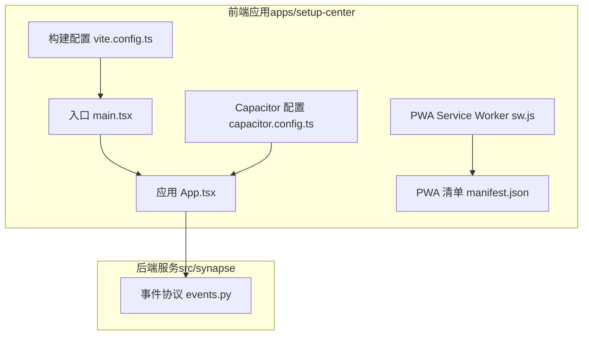
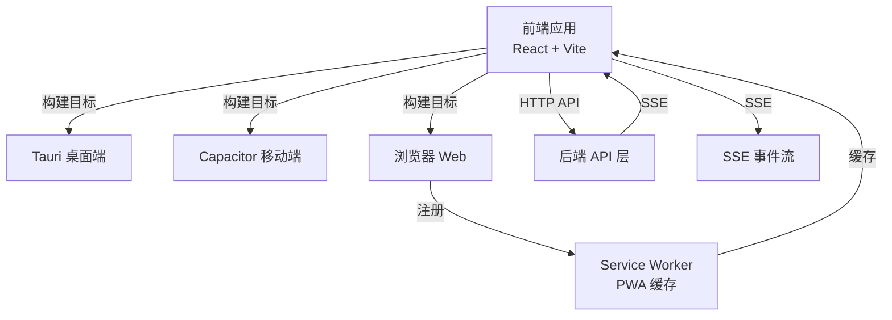
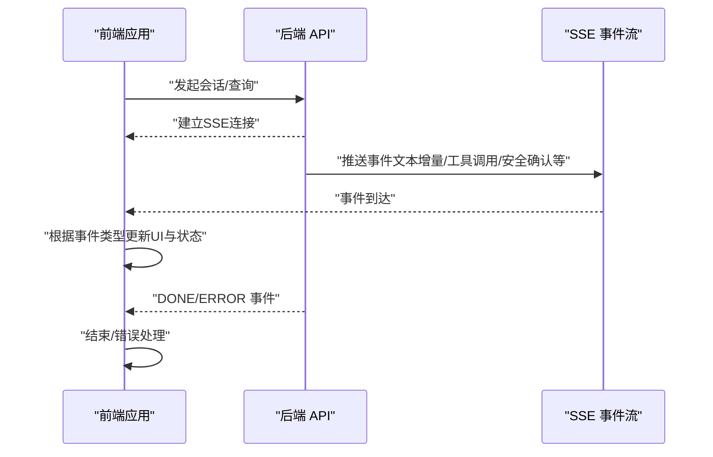
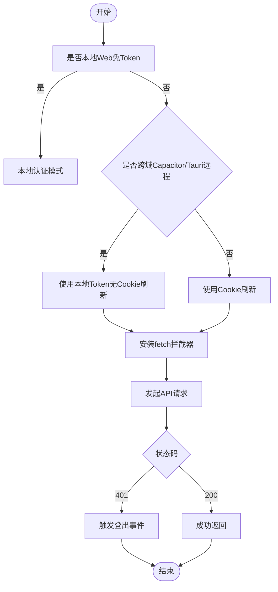
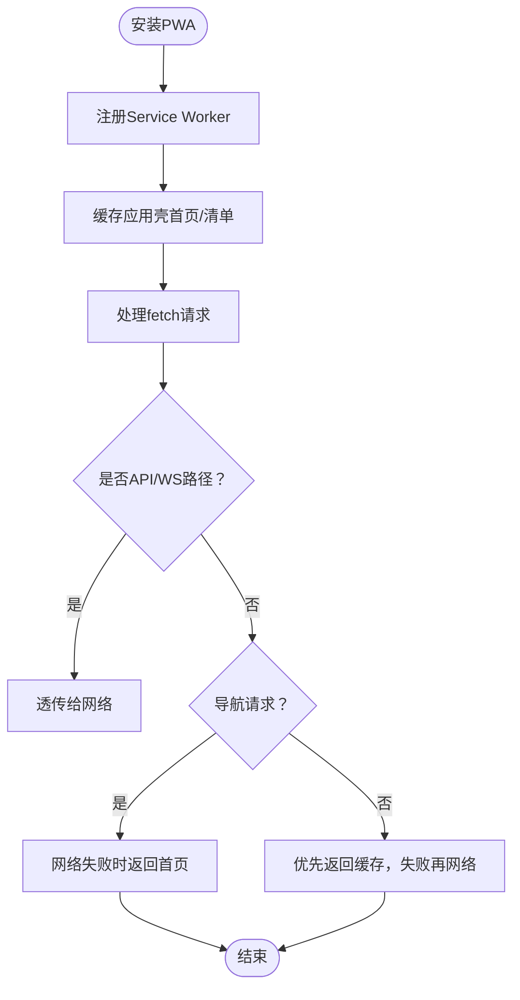
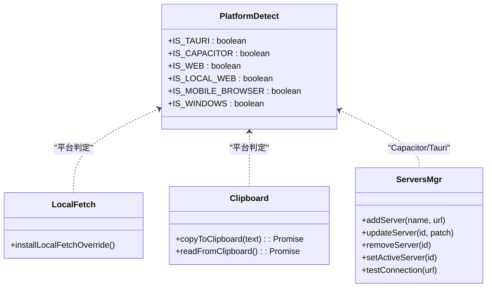

# Web和移动应用开发

<cite>
**本文引用的文件**
- [apps/setup-center/package.json](file://apps/setup-center/package.json)
- [apps/setup-center/vite.config.ts](file://apps/setup-center/vite.config.ts)
- [apps/setup-center/capacitor.config.ts](file://apps/setup-center/capacitor.config.ts)
- [apps/setup-center/src/main.tsx](file://apps/setup-center/src/main.tsx)
- [apps/setup-center/public/sw.js](file://apps/setup-center/public/sw.js)
- [apps/setup-center/public/manifest.json](file://apps/setup-center/public/manifest.json)
- [apps/setup-center/src/App.tsx](file://apps/setup-center/src/App.tsx)
- [apps/setup-center/src/AppContext.tsx](file://apps/setup-center/src/AppContext.tsx)
- [apps/setup-center/src/streamEvents.ts](file://apps/setup-center/src/streamEvents.ts)
- [apps/setup-center/src/localFetch.ts](file://apps/setup-center/src/localFetch.ts)
- [apps/setup-center/src/platform/detect.ts](file://apps/setup-center/src/platform/detect.ts)
- [apps/setup-center/src/utils/clipboard.ts](file://apps/setup-center/src/utils/clipboard.ts)
- [apps/setup-center/src/platform/auth.ts](file://apps/setup-center/src/platform/auth.ts)
- [apps/setup-center/src/platform/servers.ts](file://apps/setup-center/src/platform/servers.ts)
- [src/synapse/events.py](file://src/synapse/events.py)
</cite>

## 目录
1. [引言](#引言)
2. [项目结构](#项目结构)
3. [核心组件](#核心组件)
4. [架构总览](#架构总览)
5. [详细组件分析](#详细组件分析)
6. [依赖关系分析](#依赖关系分析)
7. [性能考虑](#性能考虑)
8. [故障排查指南](#故障排查指南)
9. [结论](#结论)
10. [附录](#附录)

## 引言
本文件面向Web与移动应用开发团队，系统化梳理本项目的前端架构、响应式与移动端适配策略、实时通信（SSE/WS）、离线支持（PWA）、跨设备同步机制以及开发配置、构建与部署流程。文档以实际源码为依据，辅以图示帮助不同背景读者快速理解与落地。

## 项目结构
本项目采用多包/多目标的混合架构：
- 前端应用位于 apps/setup-center，基于React + Vite，支持三种构建目标：桌面（Tauri）、Web（浏览器）、移动端（Capacitor）。
- 后端服务由Python模块 src/synapse 提供，前端通过HTTP API与SSE流进行交互。
- 移动端通过Capacitor桥接到Web资源，同时支持Tauri桌面端能力。
- PWA通过Service Worker与Manifest实现离线缓存与安装体验。

图表来源
- [apps/setup-center/src/main.tsx:1-377](file://apps/setup-center/src/main.tsx#L1-L377)
- [apps/setup-center/src/App.tsx:1-800](file://apps/setup-center/src/App.tsx#L1-L800)
- [apps/setup-center/vite.config.ts:1-89](file://apps/setup-center/vite.config.ts#L1-L89)
- [apps/setup-center/capacitor.config.ts:1-25](file://apps/setup-center/capacitor.config.ts#L1-L25)
- [apps/setup-center/public/sw.js:1-56](file://apps/setup-center/public/sw.js#L1-L56)
- [apps/setup-center/public/manifest.json:1-27](file://apps/setup-center/public/manifest.json#L1-L27)
- [src/synapse/events.py:1-119](file://src/synapse/events.py#L1-L119)

章节来源
- [apps/setup-center/package.json:1-86](file://apps/setup-center/package.json#L1-L86)
- [apps/setup-center/vite.config.ts:1-89](file://apps/setup-center/vite.config.ts#L1-L89)
- [apps/setup-center/capacitor.config.ts:1-25](file://apps/setup-center/capacitor.config.ts#L1-L25)
- [apps/setup-center/src/main.tsx:1-377](file://apps/setup-center/src/main.tsx#L1-L377)
- [apps/setup-center/public/sw.js:1-56](file://apps/setup-center/public/sw.js#L1-L56)
- [apps/setup-center/public/manifest.json:1-27](file://apps/setup-center/public/manifest.json#L1-L27)
- [apps/setup-center/src/App.tsx:1-800](file://apps/setup-center/src/App.tsx#L1-L800)
- [src/synapse/events.py:1-119](file://src/synapse/events.py#L1-L119)

## 核心组件
- 构建与运行时目标
  - Vite多目标：通过环境变量选择构建目标，分别输出Tauri、Web、Capacitor产物。
  - Tauri Stub插件：在远程构建（Web/Cap）时，对@tauri-apps相关API进行占位，避免打包错误。
- 平台检测与运行时行为
  - 平台常量：IS_TAURI、IS_CAPACITOR、IS_WEB、IS_LOCAL_WEB、IS_MOBILE_BROWSER、IS_WINDOWS。
  - 不同平台采用差异化登录鉴权、网络访问与UI行为。
- 应用入口与错误边界
  - 全局错误捕获与React ErrorBoundary，保障白屏兜底与用户可恢复。
  - 自定义右键菜单、外链拦截、PWA注册等增强桌面体验。
- 实时通信与事件协议
  - 前后端统一的SSE事件类型定义，确保协议一致性与扩展性。
- 离线支持与跨设备同步
  - PWA清单与Service Worker缓存策略，支持standalone安装与离线导航。
  - 多服务器管理（Capacitor），本地存储记录连接历史与活动服务器。

章节来源
- [apps/setup-center/vite.config.ts:1-89](file://apps/setup-center/vite.config.ts#L1-L89)
- [apps/setup-center/src/platform/detect.ts:1-39](file://apps/setup-center/src/platform/detect.ts#L1-L39)
- [apps/setup-center/src/main.tsx:1-377](file://apps/setup-center/src/main.tsx#L1-L377)
- [apps/setup-center/src/streamEvents.ts:1-58](file://apps/setup-center/src/streamEvents.ts#L1-L58)
- [src/synapse/events.py:1-119](file://src/synapse/events.py#L1-L119)
- [apps/setup-center/public/sw.js:1-56](file://apps/setup-center/public/sw.js#L1-L56)
- [apps/setup-center/src/platform/servers.ts:1-116](file://apps/setup-center/src/platform/servers.ts#L1-L116)

## 架构总览
整体架构围绕“前端（Web/Capacitor/Tauri）—后端（Python服务）—SSE/HTTP API”的双向通道展开。前端通过统一的事件协议消费后端流式输出，同时通过HTTP API进行配置、认证、状态查询与控制。

图表来源
- [apps/setup-center/vite.config.ts:1-89](file://apps/setup-center/vite.config.ts#L1-L89)
- [apps/setup-center/src/main.tsx:338-342](file://apps/setup-center/src/main.tsx#L338-L342)
- [apps/setup-center/public/sw.js:1-56](file://apps/setup-center/public/sw.js#L1-L56)
- [apps/setup-center/src/streamEvents.ts:1-58](file://apps/setup-center/src/streamEvents.ts#L1-L58)
- [src/synapse/events.py:1-119](file://src/synapse/events.py#L1-L119)

## 详细组件分析

### 组件A：实时通信与事件协议
- 设计要点
  - 前后端共享的事件类型枚举，保证协议一致性与扩展性。
  - 事件标准化函数对字段别名与默认值进行归一化，便于前端消费。
- 数据流
  - 后端生成SSE事件，前端按事件类型更新UI与状态。
- 性能与可靠性
  - 协议版本号与事件元数据，便于灰度与兼容。
  - 错误事件与心跳事件，支撑断线重连与健康监测。

图表来源
- [apps/setup-center/src/streamEvents.ts:1-58](file://apps/setup-center/src/streamEvents.ts#L1-L58)
- [src/synapse/events.py:1-119](file://src/synapse/events.py#L1-L119)

章节来源
- [apps/setup-center/src/streamEvents.ts:1-58](file://apps/setup-center/src/streamEvents.ts#L1-L58)
- [src/synapse/events.py:65-119](file://src/synapse/events.py#L65-L119)

### 组件B：鉴权与跨域访问
- 设计要点
  - 本地Web（127.0.0.1/localhost）免Token登录，后台按IP放行。
  - Capacitor/Tauri远程模式下，使用本地存储令牌，不依赖httpOnly Cookie刷新。
  - 全局fetch拦截器自动注入Authorization头，401时触发登出与重定向。
- 流程图
  - 登录/校验/刷新/拦截的完整链路，覆盖本地与跨域场景。

图表来源
- [apps/setup-center/src/platform/auth.ts:1-330](file://apps/setup-center/src/platform/auth.ts#L1-L330)
- [apps/setup-center/src/platform/detect.ts:1-39](file://apps/setup-center/src/platform/detect.ts#L1-L39)

章节来源
- [apps/setup-center/src/platform/auth.ts:1-330](file://apps/setup-center/src/platform/auth.ts#L1-L330)
- [apps/setup-center/src/platform/detect.ts:1-39](file://apps/setup-center/src/platform/detect.ts#L1-L39)

### 组件C：PWA离线与跨设备同步
- 设计要点
  - Service Worker缓存首页与关键静态资源，支持standalone安装。
  - Manifest定义应用名称、图标、显示模式与作用域。
  - 多服务器管理（Capacitor），记录添加时间与最近连接时间，便于跨设备复用。
- 流程图
  - PWA安装与离线导航、缓存命中与回退策略。

图表来源
- [apps/setup-center/public/sw.js:1-56](file://apps/setup-center/public/sw.js#L1-L56)
- [apps/setup-center/public/manifest.json:1-27](file://apps/setup-center/public/manifest.json#L1-L27)
- [apps/setup-center/src/platform/servers.ts:1-116](file://apps/setup-center/src/platform/servers.ts#L1-L116)

章节来源
- [apps/setup-center/public/sw.js:1-56](file://apps/setup-center/public/sw.js#L1-L56)
- [apps/setup-center/public/manifest.json:1-27](file://apps/setup-center/public/manifest.json#L1-L27)
- [apps/setup-center/src/platform/servers.ts:1-116](file://apps/setup-center/src/platform/servers.ts#L1-L116)

### 组件D：桌面与移动端适配
- 设计要点
  - Tauri桌面端：自定义标题栏、右键菜单、外链拦截、本地代理绕过。
  - Capacitor移动端：多服务器管理、本地存储连接配置、允许明文HTTP与混合内容调试。
  - Web端：代理后端API与WS，支持本地开发联调。
- 关键实现
  - Tauri本地fetch覆盖：解决系统代理导致的本地回环请求问题，保持SSE语义。
  - 视口高度监听：移动端键盘弹起时动态调整布局。
  - 剪贴板跨平台：优先使用原生插件，回退至浏览器API或execCommand。

图表来源
- [apps/setup-center/src/platform/detect.ts:1-39](file://apps/setup-center/src/platform/detect.ts#L1-L39)
- [apps/setup-center/src/localFetch.ts:1-159](file://apps/setup-center/src/localFetch.ts#L1-L159)
- [apps/setup-center/src/utils/clipboard.ts:1-78](file://apps/setup-center/src/utils/clipboard.ts#L1-L78)
- [apps/setup-center/src/platform/servers.ts:1-116](file://apps/setup-center/src/platform/servers.ts#L1-L116)

章节来源
- [apps/setup-center/src/platform/detect.ts:1-39](file://apps/setup-center/src/platform/detect.ts#L1-L39)
- [apps/setup-center/src/localFetch.ts:1-159](file://apps/setup-center/src/localFetch.ts#L1-L159)
- [apps/setup-center/src/utils/clipboard.ts:1-78](file://apps/setup-center/src/utils/clipboard.ts#L1-L78)
- [apps/setup-center/src/platform/servers.ts:1-116](file://apps/setup-center/src/platform/servers.ts#L1-L116)
- [apps/setup-center/src/main.tsx:237-254](file://apps/setup-center/src/main.tsx#L237-L254)

## 依赖关系分析
- 构建期依赖
  - Vite插件链：React、TailwindCSS、Tauri Stub（远程构建时启用）。
  - 别名与去重：@指向src，three去重以减少体积。
- 运行期依赖
  - 平台检测决定鉴权与网络策略。
  - PWA与多服务器管理增强跨设备体验。
  - 事件协议与SSE流驱动前后端实时协作。

图表来源
- [apps/setup-center/vite.config.ts:1-89](file://apps/setup-center/vite.config.ts#L1-L89)
- [apps/setup-center/src/platform/detect.ts:1-39](file://apps/setup-center/src/platform/detect.ts#L1-L39)
- [apps/setup-center/src/platform/auth.ts:1-330](file://apps/setup-center/src/platform/auth.ts#L1-L330)
- [apps/setup-center/public/sw.js:1-56](file://apps/setup-center/public/sw.js#L1-L56)

章节来源
- [apps/setup-center/vite.config.ts:1-89](file://apps/setup-center/vite.config.ts#L1-L89)

## 性能考虑
- 体积与加载
  - 依赖去重（如three）与按需懒加载视图，降低首屏体积。
  - Tauri Stub在远程构建时移除不必要的原生API，避免打包错误与冗余依赖。
- 网络与实时
  - 本地Web免Token登录，减少握手往返。
  - Tauri本地fetch覆盖避免系统代理导致的回环失败，提升稳定性。
- PWA缓存
  - 首屏与清单缓存，导航请求失败回退首页，提升弱网可用性。
- 移动端体验
  - 视觉视口监听与键盘适配，避免输入法遮挡与布局抖动。
  - 右键菜单与外链拦截，减少误操作与跳出。

## 故障排查指南
- 本地Web登录闪烁或超时
  - 症状：本地访问出现登录页闪烁或超时。
  - 原因：本地Web免Token模式，后台按IP放行。
  - 处理：确认使用127.0.0.1/localhost访问，避免跨域或代理干扰。
- Capacitor/Tauri远程登录失败
  - 症状：跨域模式下401频繁。
  - 原因：跨域不支持Cookie刷新，依赖本地Token。
  - 处理：检查后端登录接口与Token存储，必要时重新登录。
- Service Worker未生效或缓存异常
  - 症状：PWA安装后仍无法离线访问。
  - 处理：检查sw.js注册路径与作用域，清理旧缓存并重试。
- Tauri本地fetch失败
  - 症状：本地回环请求被系统代理劫持。
  - 处理：确认installLocalFetchOverride已执行，检查后端URL与端口。
- 移动端键盘遮挡输入框
  - 处理：确认视觉视口监听与动态CSS变量已生效，避免固定定位被键盘顶起。

章节来源
- [apps/setup-center/src/platform/auth.ts:286-330](file://apps/setup-center/src/platform/auth.ts#L286-L330)
- [apps/setup-center/src/platform/servers.ts:90-116](file://apps/setup-center/src/platform/servers.ts#L90-L116)
- [apps/setup-center/public/sw.js:1-56](file://apps/setup-center/public/sw.js#L1-L56)
- [apps/setup-center/src/localFetch.ts:30-159](file://apps/setup-center/src/localFetch.ts#L30-L159)
- [apps/setup-center/src/main.tsx:237-254](file://apps/setup-center/src/main.tsx#L237-L254)

## 结论
本项目通过统一的事件协议与多目标构建，实现了Web、移动端与桌面端的一致体验。鉴权策略针对不同平台做了精细化处理，PWA与SSE共同提供了良好的离线与实时性保障。建议在后续迭代中持续完善协议扩展、错误上报与性能监控，以进一步提升跨设备协同与用户体验。

## 附录
- 开发与构建
  - 脚本命令：dev、dev:web、build、build:web、build:cap、preview、tauri、cap:sync、cap:android、cap:ios。
  - 构建目标：通过VITE_BUILD_TARGET切换（tauri/web/capacitor）。
- 部署策略
  - Web：将dist-web部署至静态服务器，配置反向代理转发/api与/ws。
  - Capacitor：构建后同步到原生工程，按平台配置签名与权限。
  - Tauri：打包为多平台安装包，配置图标与权限。
- 最佳实践
  - 事件协议版本化与标准化，确保前后端一致。
  - 对移动端与弱网场景进行充分测试，关注SSE断线重连与PWA缓存策略。
  - 使用全局错误边界与日志上报，提升可观测性与可维护性。

章节来源
- [apps/setup-center/package.json:6-18](file://apps/setup-center/package.json#L6-L18)
- [apps/setup-center/vite.config.ts:6-14](file://apps/setup-center/vite.config.ts#L6-L14)
- [apps/setup-center/capacitor.config.ts:3-22](file://apps/setup-center/capacitor.config.ts#L3-L22)