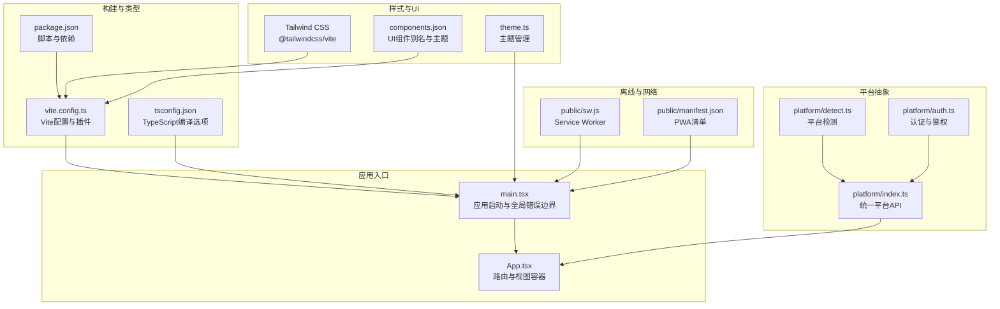
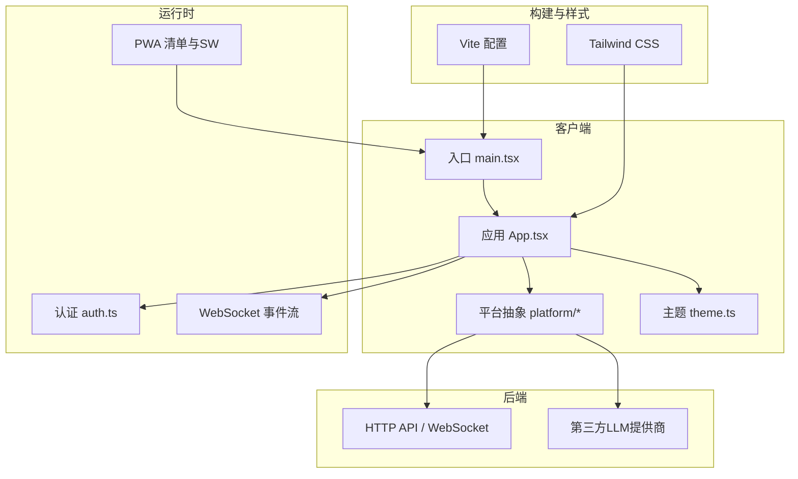
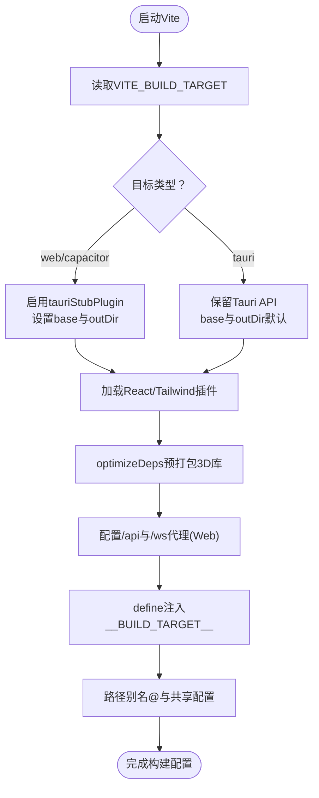
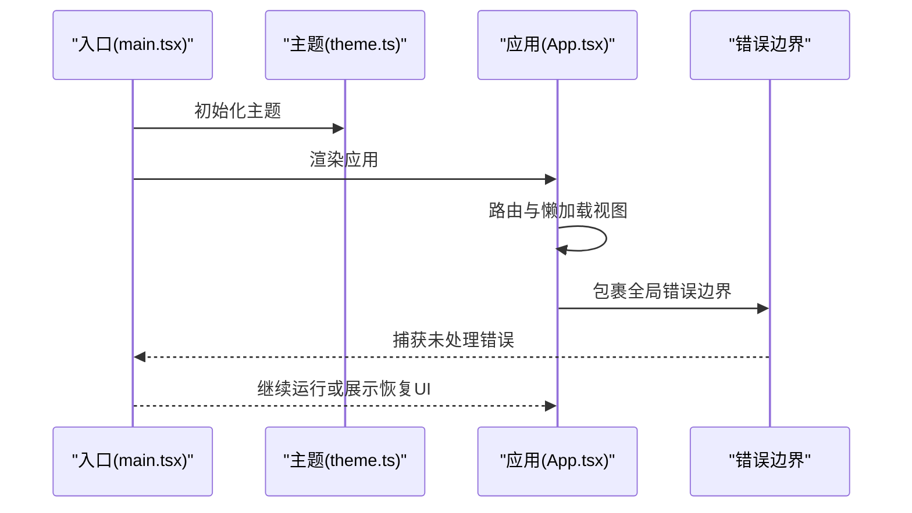
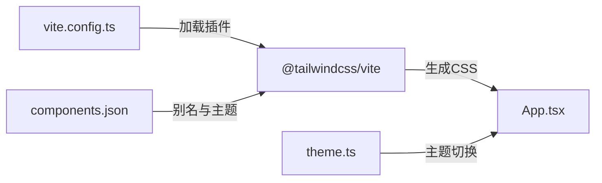
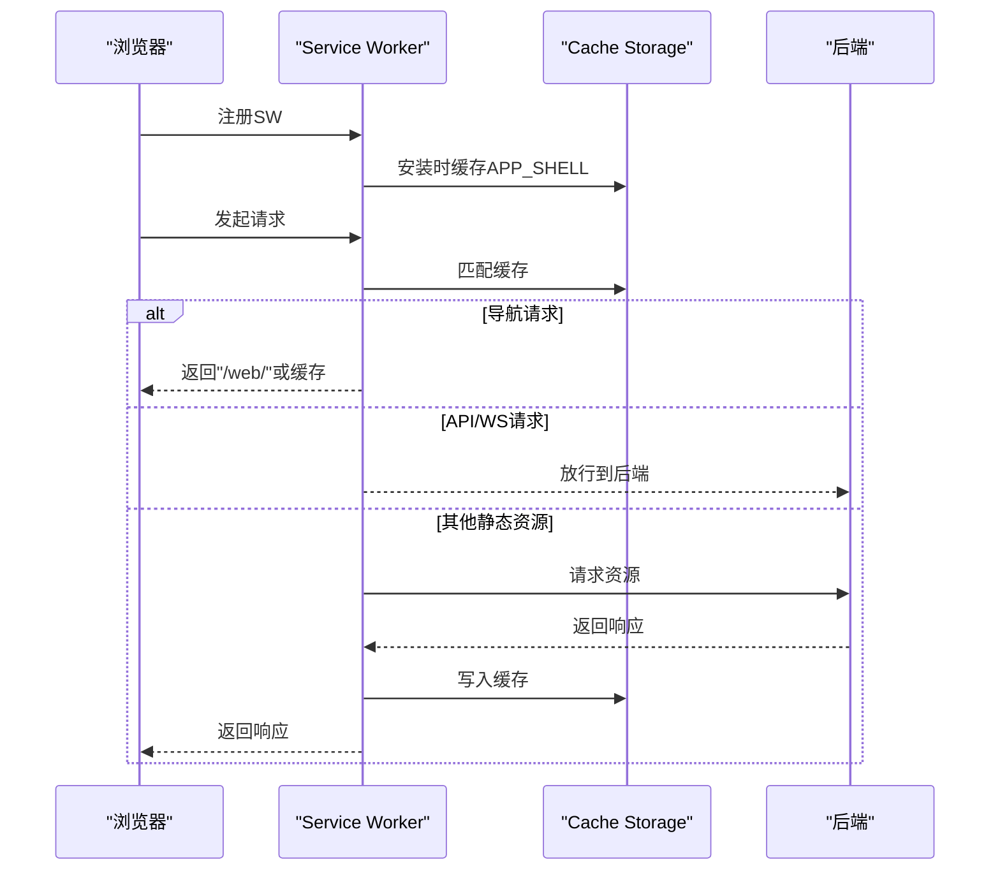
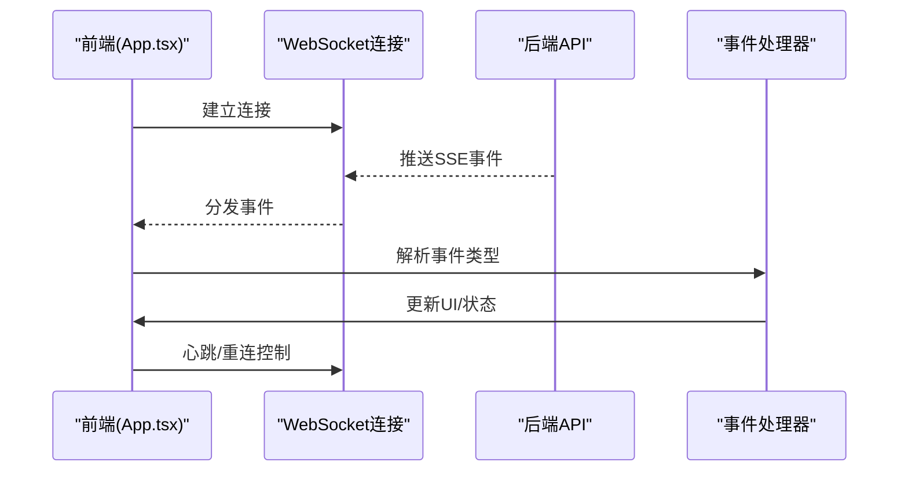
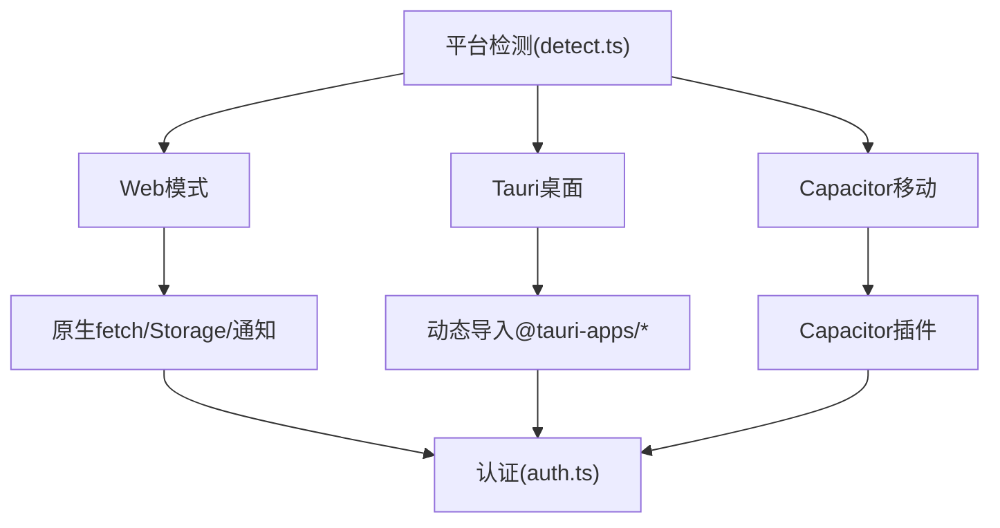
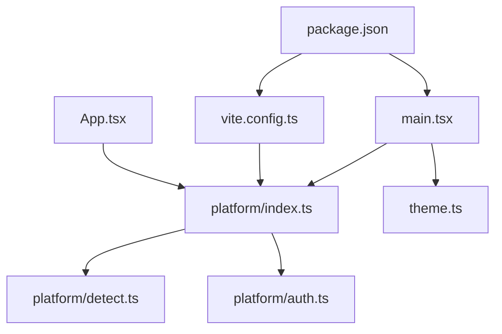

# Web应用开发

<cite>
**本文引用的文件**
- [vite.config.ts](file://apps/setup-center/vite.config.ts)
- [package.json](file://apps/setup-center/package.json)
- [tsconfig.json](file://apps/setup-center/tsconfig.json)
- [capacitor.config.ts](file://apps/setup-center/capacitor.config.ts)
- [manifest.json](file://apps/setup-center/public/manifest.json)
- [sw.js](file://apps/setup-center/public/sw.js)
- [main.tsx](file://apps/setup-center/src/main.tsx)
- [App.tsx](file://apps/setup-center/src/App.tsx)
- [providers.ts](file://apps/setup-center/src/providers.ts)
- [streamEvents.ts](file://apps/setup-center/src/streamEvents.ts)
- [components.json](file://apps/setup-center/components.json)
- [theme.ts](file://apps/setup-center/src/theme.ts)
- [detect.ts](file://apps/setup-center/src/platform/detect.ts)
- [auth.ts](file://apps/setup-center/src/platform/auth.ts)
- [index.ts](file://apps/setup-center/src/platform/index.ts)
</cite>

## 目录
1. [引言](#引言)
2. [项目结构](#项目结构)
3. [核心组件](#核心组件)
4. [架构总览](#架构总览)
5. [详细组件分析](#详细组件分析)
6. [依赖关系分析](#依赖关系分析)
7. [性能考虑](#性能考虑)
8. [故障排查指南](#故障排查指南)
9. [结论](#结论)
10. [附录](#附录)

## 引言
本技术文档面向Web应用开发，围绕Vite构建系统、React 18 + TypeScript开发环境、Tailwind CSS样式体系进行深入解析，并结合项目中的PWA离线支持、WebSocket实时通信、跨浏览器兼容性、响应式设计、性能优化与安全防护等方面，提供从开发到部署的完整流程指导。文档同时给出关键配置与实现路径，便于读者快速落地。

## 项目结构
该Web应用位于 apps/setup-center 目录，采用Vite作为构建工具，React 18 + TypeScript作为前端框架，Tailwind CSS提供样式基础，Capacitor用于移动端集成，PWA通过Service Worker实现离线缓存。核心入口为 main.tsx，应用主体逻辑集中在 App.tsx 中，平台抽象层位于 src/platform 下，提供统一的桌面/Web能力接口。

图表来源
- [main.tsx:1-377](file://apps/setup-center/src/main.tsx#L1-L377)
- [App.tsx:1-800](file://apps/setup-center/src/App.tsx#L1-L800)
- [vite.config.ts:1-89](file://apps/setup-center/vite.config.ts#L1-L89)
- [package.json:1-86](file://apps/setup-center/package.json#L1-L86)
- [tsconfig.json:1-24](file://apps/setup-center/tsconfig.json#L1-L24)
- [components.json:1-22](file://apps/setup-center/components.json#L1-L22)
- [theme.ts:1-95](file://apps/setup-center/src/theme.ts#L1-L95)
- [detect.ts:1-39](file://apps/setup-center/src/platform/detect.ts#L1-L39)
- [auth.ts:1-330](file://apps/setup-center/src/platform/auth.ts#L1-L330)
- [index.ts:1-507](file://apps/setup-center/src/platform/index.ts#L1-L507)
- [sw.js:1-56](file://apps/setup-center/public/sw.js#L1-L56)
- [manifest.json:1-27](file://apps/setup-center/public/manifest.json#L1-L27)

章节来源
- [vite.config.ts:1-89](file://apps/setup-center/vite.config.ts#L1-L89)
- [package.json:1-86](file://apps/setup-center/package.json#L1-L86)
- [tsconfig.json:1-24](file://apps/setup-center/tsconfig.json#L1-L24)
- [components.json:1-22](file://apps/setup-center/components.json#L1-L22)
- [theme.ts:1-95](file://apps/setup-center/src/theme.ts#L1-L95)
- [detect.ts:1-39](file://apps/setup-center/src/platform/detect.ts#L1-L39)
- [auth.ts:1-330](file://apps/setup-center/src/platform/auth.ts#L1-L330)
- [index.ts:1-507](file://apps/setup-center/src/platform/index.ts#L1-L507)
- [sw.js:1-56](file://apps/setup-center/public/sw.js#L1-L56)
- [manifest.json:1-27](file://apps/setup-center/public/manifest.json#L1-L27)

## 核心组件
- 构建系统与优化
  - Vite配置通过 define、alias、optimizeDeps、proxy、base 等参数适配多目标构建（桌面、Web、Capacitor），并注入构建目标常量供运行时判断。
  - 通过 tauriStubPlugin 在远程构建中替换 Tauri API，避免打包错误。
  - 依赖预优化 include 了大量3D/可视化相关库，减少首屏加载抖动。
- 开发环境
  - TypeScript启用严格模式、ESNext模块、Bundler解析器，配合路径别名与类型声明，提升开发体验与类型安全。
  - React 18 使用严格模式与 Suspense 代码分割，优化首屏与懒加载。
- 样式系统
  - Tailwind CSS 与 @tailwindcss/vite 集成，组件别名通过 components.json 统一，主题通过 theme.ts 管理。
- 平台抽象
  - platform 层封装 Tauri/Web/Capacitor 能力差异，提供统一的 invoke/listen、文件操作、HTTP代理、拖拽、通知、弹窗等接口。
- 认证与安全
  - auth.ts 提供 JWT 生命周期管理、跨域/本地认证模式、自动刷新与拦截器、登录/登出、会话恢复等。
- 实时通信
  - streamEvents.ts 定义SSE事件类型，App.tsx 与平台层协作处理心跳、文本增量、工具调用、安全确认等事件流。
- 离线支持
  - PWA清单与Service Worker在Web构建下启用，SW缓存关键资源，提供离线兜底与API/WS旁路。

章节来源
- [vite.config.ts:1-89](file://apps/setup-center/vite.config.ts#L1-L89)
- [tsconfig.json:1-24](file://apps/setup-center/tsconfig.json#L1-L24)
- [components.json:1-22](file://apps/setup-center/components.json#L1-L22)
- [theme.ts:1-95](file://apps/setup-center/src/theme.ts#L1-L95)
- [index.ts:1-507](file://apps/setup-center/src/platform/index.ts#L1-L507)
- [auth.ts:1-330](file://apps/setup-center/src/platform/auth.ts#L1-L330)
- [streamEvents.ts:1-58](file://apps/setup-center/src/streamEvents.ts#L1-L58)
- [sw.js:1-56](file://apps/setup-center/public/sw.js#L1-L56)
- [manifest.json:1-27](file://apps/setup-center/public/manifest.json#L1-L27)

## 架构总览
应用采用“入口 -> 应用主体 -> 平台抽象 -> 外部服务”的分层架构。入口负责全局错误边界、主题初始化、Service Worker注册与平台能力检测；应用主体负责路由、视图懒加载、认证门禁与数据模式切换；平台抽象屏蔽桌面/浏览器差异；外部服务包括后端API、WebSocket、第三方提供商。

图表来源
- [main.tsx:1-377](file://apps/setup-center/src/main.tsx#L1-L377)
- [App.tsx:1-800](file://apps/setup-center/src/App.tsx#L1-L800)
- [index.ts:1-507](file://apps/setup-center/src/platform/index.ts#L1-L507)
- [auth.ts:1-330](file://apps/setup-center/src/platform/auth.ts#L1-L330)
- [streamEvents.ts:1-58](file://apps/setup-center/src/streamEvents.ts#L1-L58)
- [vite.config.ts:1-89](file://apps/setup-center/vite.config.ts#L1-L89)
- [theme.ts:1-95](file://apps/setup-center/src/theme.ts#L1-L95)
- [sw.js:1-56](file://apps/setup-center/public/sw.js#L1-L56)
- [manifest.json:1-27](file://apps/setup-center/public/manifest.json#L1-L27)

## 详细组件分析

### Vite构建系统与优化策略
- 多目标构建
  - 通过环境变量 VITE_BUILD_TARGET 控制构建目标（web/capacitor/tauri），动态注入 __BUILD_TARGET__ 常量，影响运行时行为（如本地Fetch覆盖、Service Worker注册）。
  - 远程构建（web/capacitor）启用 tauriStubPlugin 替换 @tauri-apps/* 模块，避免打包期报错。
- 代理与开发服务器
  - Web模式下配置 /api 与 /ws 代理至本地后端，便于前后端联调。
- 依赖优化
  - optimizeDeps.include 预打包 3D/可视化相关库，降低冷启动时间。
- 输出与基路径
  - 远程构建输出到 dist-web，base 根据目标设置为 "/web/" 或 "./"，保证静态资源正确加载。
- 插件与别名
  - React与Tailwind插件按需启用；路径别名 @ 指向 src，共享配置指向后端提供者注册表。

图表来源
- [vite.config.ts:1-89](file://apps/setup-center/vite.config.ts#L1-L89)

章节来源
- [vite.config.ts:1-89](file://apps/setup-center/vite.config.ts#L1-L89)

### React 18 + TypeScript开发环境
- 严格类型与模块解析
  - tsconfig.json 启用严格模式、ESNext模块、Bundler解析器，路径别名与类型声明确保类型安全。
- 懒加载与代码分割
  - App.tsx 对多个视图使用 React.lazy 与 Suspense，降低首屏体积。
- 全局错误边界
  - main.tsx 注册全局错误捕获与 React ErrorBoundary，防止白屏并提供可操作的恢复UI。
- 主题初始化
  - 启动阶段初始化主题，监听系统主题变化，支持多种主题变体与预览。

图表来源
- [main.tsx:1-377](file://apps/setup-center/src/main.tsx#L1-L377)
- [theme.ts:1-95](file://apps/setup-center/src/theme.ts#L1-L95)
- [App.tsx:1-800](file://apps/setup-center/src/App.tsx#L1-L800)

章节来源
- [tsconfig.json:1-24](file://apps/setup-center/tsconfig.json#L1-L24)
- [main.tsx:1-377](file://apps/setup-center/src/main.tsx#L1-L377)
- [App.tsx:1-800](file://apps/setup-center/src/App.tsx#L1-L800)
- [theme.ts:1-95](file://apps/setup-center/src/theme.ts#L1-L95)

### Tailwind CSS样式系统集成
- Tailwind与Vite集成
  - 通过 @tailwindcss/vite 插件启用，构建时生成所需CSS。
- 组件别名与主题
  - components.json 定义样式别名与主题变量，配合 theme.ts 的主题切换逻辑，实现深浅色与无障碍主题支持。
- 全局样式
  - main.tsx 导入全局样式与第三方UI库样式，确保一致性。

图表来源
- [vite.config.ts:1-89](file://apps/setup-center/vite.config.ts#L1-L89)
- [components.json:1-22](file://apps/setup-center/components.json#L1-L22)
- [theme.ts:1-95](file://apps/setup-center/src/theme.ts#L1-L95)

章节来源
- [vite.config.ts:1-89](file://apps/setup-center/vite.config.ts#L1-L89)
- [components.json:1-22](file://apps/setup-center/components.json#L1-L22)
- [theme.ts:1-95](file://apps/setup-center/src/theme.ts#L1-L95)

### PWA离线支持实现机制
- 清单与注册
  - manifest.json 定义应用名称、图标、显示模式与作用域，Web构建下在入口注册 Service Worker。
- Service Worker策略
  - sw.js 缓存应用壳资源，拦截导航请求与静态资源，优先返回缓存并在后台更新；对 /api 与 /ws 请求放行，确保实时性与后端交互。

图表来源
- [sw.js:1-56](file://apps/setup-center/public/sw.js#L1-L56)
- [manifest.json:1-27](file://apps/setup-center/public/manifest.json#L1-L27)
- [main.tsx:338-342](file://apps/setup-center/src/main.tsx#L338-L342)

章节来源
- [sw.js:1-56](file://apps/setup-center/public/sw.js#L1-L56)
- [manifest.json:1-27](file://apps/setup-center/public/manifest.json#L1-L27)
- [main.tsx:338-342](file://apps/setup-center/src/main.tsx#L338-L342)

### WebSocket实时通信数据流处理
- 事件类型定义
  - streamEvents.ts 定义完整的SSE事件类型集合，涵盖生命周期、思考/推理、文本输出、工具执行、上下文压缩、安全确认、待办/计划、代理调度等。
- 事件处理
  - App.tsx 与平台层协作，订阅/监听事件，按事件类型更新UI与状态；对心跳、文本增量、工具调用等进行聚合与渲染。
- 断线重连
  - 平台层提供重连机制，保障长连接稳定性。

图表来源
- [streamEvents.ts:1-58](file://apps/setup-center/src/streamEvents.ts#L1-L58)
- [App.tsx:1-800](file://apps/setup-center/src/App.tsx#L1-L800)
- [index.ts:1-507](file://apps/setup-center/src/platform/index.ts#L1-L507)

章节来源
- [streamEvents.ts:1-58](file://apps/setup-center/src/streamEvents.ts#L1-L58)
- [App.tsx:1-800](file://apps/setup-center/src/App.tsx#L1-L800)
- [index.ts:1-507](file://apps/setup-center/src/platform/index.ts#L1-L507)

### 跨浏览器兼容性解决方案
- 平台检测与降级
  - detect.ts 提供 IS_TAURI、IS_CAPACITOR、IS_WEB、IS_LOCAL_WEB、IS_MOBILE_BROWSER、IS_WINDOWS 等常量，驱动不同平台的行为差异。
- 功能适配
  - index.ts 将 Tauri API 以动态导入方式封装，Web/Capacitor下提供对应降级实现（如下载、对话框、通知、弹窗等）。
- 认证模式
  - auth.ts 支持本地IP豁免、跨域模式与静默刷新，适配不同运行环境的安全策略。

图表来源
- [detect.ts:1-39](file://apps/setup-center/src/platform/detect.ts#L1-L39)
- [index.ts:1-507](file://apps/setup-center/src/platform/index.ts#L1-L507)
- [auth.ts:1-330](file://apps/setup-center/src/platform/auth.ts#L1-L330)

章节来源
- [detect.ts:1-39](file://apps/setup-center/src/platform/detect.ts#L1-L39)
- [index.ts:1-507](file://apps/setup-center/src/platform/index.ts#L1-L507)
- [auth.ts:1-330](file://apps/setup-center/src/platform/auth.ts#L1-L330)

### 响应式设计最佳实践
- 视口与键盘适配
  - App.tsx 监听 visualViewport，动态设置 CSS 变量，确保移动端键盘弹起时布局稳定。
- 主题与无障碍
  - theme.ts 支持系统/浅色/深色/色盲友好/高对比度主题，入口初始化时应用并监听系统偏好。
- UI组件
  - components.json 配置主题与别名，结合 Tailwind 类实现响应式布局与可访问性。

章节来源
- [App.tsx:237-254](file://apps/setup-center/src/App.tsx#L237-L254)
- [theme.ts:1-95](file://apps/setup-center/src/theme.ts#L1-L95)
- [components.json:1-22](file://apps/setup-center/components.json#L1-L22)

### 性能优化策略
- 代码分割与懒加载
  - App.tsx 对多个视图使用 lazy 与 Suspense，减少首屏包体。
- 依赖预优化
  - vite.config.ts optimizeDeps.include 预打包 3D/可视化库，缩短冷启动时间。
- 构建目标与输出
  - 远程构建输出到 dist-web，base 路径按目标设置，避免资源404与二次请求。
- 缓存与离线
  - PWA SW 缓存关键资源，导航与静态资源优先命中缓存，提升离线可用性。

章节来源
- [App.tsx:10-30](file://apps/setup-center/src/App.tsx#L10-L30)
- [vite.config.ts:55-63](file://apps/setup-center/vite.config.ts#L55-L63)
- [vite.config.ts:64-67](file://apps/setup-center/vite.config.ts#L64-L67)
- [sw.js:1-56](file://apps/setup-center/public/sw.js#L1-L56)

### 安全防护措施
- 认证与授权
  - auth.ts 提供 JWT 生命周期管理、自动刷新、跨域/本地认证模式、登录/登出与会话恢复；对401错误触发重定向。
- Fetch拦截
  - installFetchInterceptor 自动为同源API请求添加Authorization头，避免遗漏。
- 本地/远程模式
  - detect.ts 识别本地Web（IP豁免）、桌面、移动端，驱动不同的安全策略与UI行为。
- 错误处理
  - main.tsx 全局捕获未处理异常与Promise拒绝，记录日志并提供恢复UI，防止崩溃白屏。

章节来源
- [auth.ts:1-330](file://apps/setup-center/src/platform/auth.ts#L1-L330)
- [index.ts:241-267](file://apps/setup-center/src/platform/index.ts#L241-L267)
- [detect.ts:1-39](file://apps/setup-center/src/platform/detect.ts#L1-L39)
- [main.tsx:35-52](file://apps/setup-center/src/main.tsx#L35-L52)

## 依赖关系分析
- 组件耦合与内聚
  - App.tsx 作为视图容器，依赖平台抽象与认证模块；平台模块进一步依赖 detect.ts 与 auth.ts，形成清晰的分层。
- 外部依赖
  - Vite、React、Tailwind、Capacitor、Ant Design、Monaco Editor、Three.js 等，通过 package.json 管理版本与脚本。
- 运行时依赖
  - main.tsx 在不同构建目标下启用或禁用某些功能（如Service Worker、本地Fetch覆盖），体现构建期与运行时的解耦。

图表来源
- [App.tsx:1-800](file://apps/setup-center/src/App.tsx#L1-L800)
- [index.ts:1-507](file://apps/setup-center/src/platform/index.ts#L1-L507)
- [detect.ts:1-39](file://apps/setup-center/src/platform/detect.ts#L1-L39)
- [auth.ts:1-330](file://apps/setup-center/src/platform/auth.ts#L1-L330)
- [main.tsx:1-377](file://apps/setup-center/src/main.tsx#L1-L377)
- [vite.config.ts:1-89](file://apps/setup-center/vite.config.ts#L1-L89)
- [package.json:1-86](file://apps/setup-center/package.json#L1-L86)

章节来源
- [App.tsx:1-800](file://apps/setup-center/src/App.tsx#L1-L800)
- [index.ts:1-507](file://apps/setup-center/src/platform/index.ts#L1-L507)
- [detect.ts:1-39](file://apps/setup-center/src/platform/detect.ts#L1-L39)
- [auth.ts:1-330](file://apps/setup-center/src/platform/auth.ts#L1-L330)
- [main.tsx:1-377](file://apps/setup-center/src/main.tsx#L1-L377)
- [vite.config.ts:1-89](file://apps/setup-center/vite.config.ts#L1-L89)
- [package.json:1-86](file://apps/setup-center/package.json#L1-L86)

## 性能考虑
- 首屏优化
  - 代码分割与懒加载显著降低首屏体积；optimizeDeps预打包常用库减少首次渲染抖动。
- 资源加载
  - 远程构建设置正确的 base 与 outDir，避免静态资源404；PWA缓存关键资源提升离线体验。
- 实时性
  - WebSocket事件流按类型聚合，避免频繁重渲染；心跳与重连策略降低连接中断影响。
- 移动端体验
  - 监听 visualViewport，动态调整布局；移动端浏览器的连接与后台挂起行为通过平台检测与降级策略适配。

[本节为通用建议，无需特定文件引用]

## 故障排查指南
- 构建问题
  - 若远程构建出现 Tauri API 相关报错，确认 VITE_BUILD_TARGET 与 tauriStubPlugin 是否生效。
  - optimizeDeps 预打包失败时，检查 include 列表与依赖版本。
- 运行时错误
  - 全局错误边界会捕获未处理异常与Promise拒绝，查看日志并提供“复制错误”与“重新加载”按钮。
  - Service Worker 注册失败时，检查 manifest 与 SW 路径，确认Web构建目标。
- 认证问题
  - 401错误触发自动刷新或重定向登录；跨域模式下无法静默刷新，需重新登录。
  - 本地IP豁免模式下无需令牌，但需确认主机名匹配。
- WebSocket问题
  - 断线重连策略与事件类型解析异常时，检查后端事件流与前端事件处理器映射。

章节来源
- [vite.config.ts:1-89](file://apps/setup-center/vite.config.ts#L1-L89)
- [main.tsx:35-52](file://apps/setup-center/src/main.tsx#L35-L52)
- [auth.ts:85-118](file://apps/setup-center/src/platform/auth.ts#L85-L118)
- [sw.js:1-56](file://apps/setup-center/public/sw.js#L1-L56)

## 结论
本项目通过Vite多目标构建、React 18 + TypeScript的强类型开发、Tailwind CSS的样式体系、PWA离线支持与WebSocket实时通信，以及完善的平台抽象与安全机制，形成了一个可扩展、高性能、跨平台的Web应用骨架。遵循本文档的配置与实现路径，可在开发、测试与生产环境中获得一致的用户体验与稳定的运行表现。

[本节为总结，无需特定文件引用]

## 附录
- 关键配置模板与路径
  - Vite配置：[vite.config.ts](file://apps/setup-center/vite.config.ts)
  - 依赖与脚本：[package.json](file://apps/setup-center/package.json)
  - TypeScript编译选项：[tsconfig.json](file://apps/setup-center/tsconfig.json)
  - Capacitor配置：[capacitor.config.ts](file://apps/setup-center/capacitor.config.ts)
  - PWA清单：[manifest.json](file://apps/setup-center/public/manifest.json)
  - Service Worker：[sw.js](file://apps/setup-center/public/sw.js)
  - 应用入口：[main.tsx](file://apps/setup-center/src/main.tsx)
  - 应用主体：[App.tsx](file://apps/setup-center/src/App.tsx)
  - 平台抽象：[platform/index.ts](file://apps/setup-center/src/platform/index.ts)
  - 认证模块：[platform/auth.ts](file://apps/setup-center/src/platform/auth.ts)
  - 平台检测：[platform/detect.ts](file://apps/setup-center/src/platform/detect.ts)
  - 事件类型：[streamEvents.ts](file://apps/setup-center/src/streamEvents.ts)
  - 主题管理：[theme.ts](file://apps/setup-center/src/theme.ts)
  - UI组件配置：[components.json](file://apps/setup-center/components.json)

[本节为索引，无需特定文件引用]