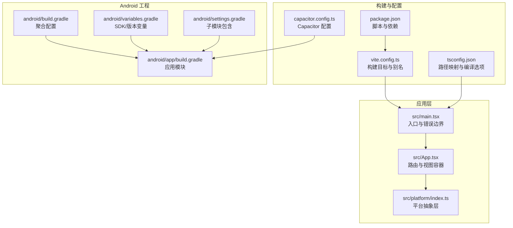
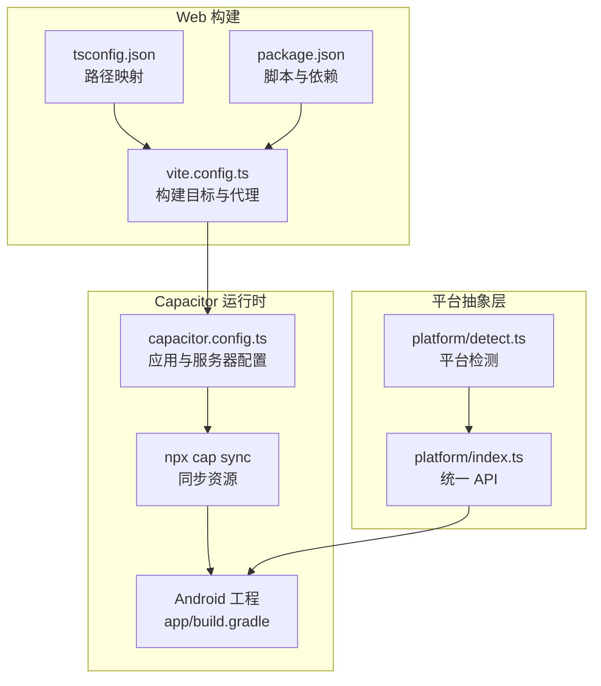
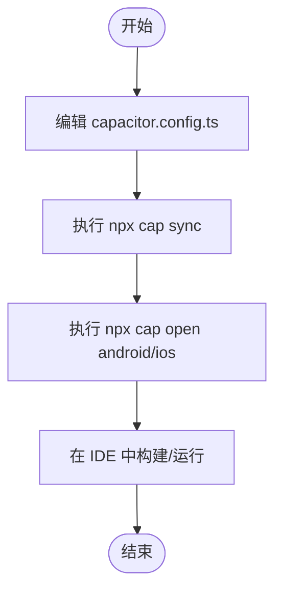
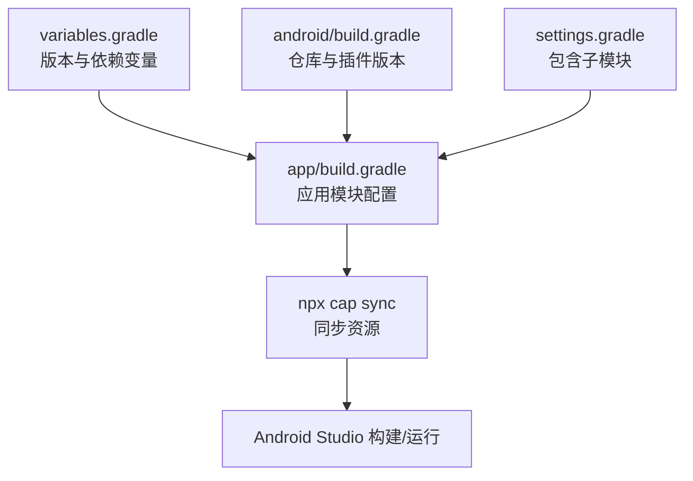
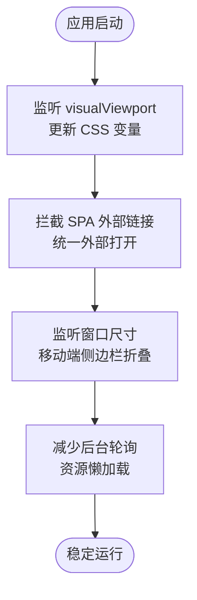
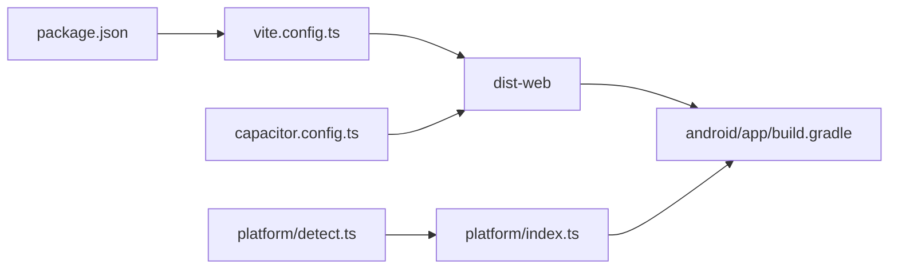

# 移动应用开发

<cite>
**本文引用的文件**
- [apps/setup-center/capacitor.config.ts](file://apps/setup-center/capacitor.config.ts)
- [apps/setup-center/package.json](file://apps/setup-center/package.json)
- [apps/setup-center/android/build.gradle](file://apps/setup-center/android/build.gradle)
- [apps/setup-center/android/app/build.gradle](file://apps/setup-center/android/app/build.gradle)
- [apps/setup-center/android/variables.gradle](file://apps/setup-center/android/variables.gradle)
- [apps/setup-center/android/settings.gradle](file://apps/setup-center/android/settings.gradle)
- [apps/setup-center/vite.config.ts](file://apps/setup-center/vite.config.ts)
- [apps/setup-center/tsconfig.json](file://apps/setup-center/tsconfig.json)
- [apps/setup-center/src/main.tsx](file://apps/setup-center/src/main.tsx)
- [apps/setup-center/src/App.tsx](file://apps/setup-center/src/App.tsx)
- [apps/setup-center/src/platform/detect.ts](file://apps/setup-center/src/platform/detect.ts)
- [apps/setup-center/src/platform/index.ts](file://apps/setup-center/src/platform/index.ts)
</cite>

## 目录
1. [引言](#引言)
2. [项目结构](#项目结构)
3. [核心组件](#核心组件)
4. [架构总览](#架构总览)
5. [详细组件分析](#详细组件分析)
6. [依赖关系分析](#依赖关系分析)
7. [性能考量](#性能考量)
8. [故障排查指南](#故障排查指南)
9. [结论](#结论)
10. [附录](#附录)

## 引言
本技术文档面向移动应用开发团队，围绕基于 Capacitor 的跨平台应用进行系统化说明，覆盖以下主题：
- Capacitor 配置与使用要点
- Android 原生应用构建流程与 Gradle 配置
- iOS 应用签名与发布策略（基于现有 Android 配置推导）
- 移动端 UI 适配、触摸交互优化与电池续航考虑
- 原生插件集成方法与权限管理策略
- 应用商店发布流程与调试、性能监控、用户体验优化建议
- 从开发环境搭建到最终发布的完整流程

## 项目结构
该仓库采用多包/多应用结构，移动端相关代码集中在 apps/setup-center。其核心由以下部分组成：
- Capacitor 配置文件：定义应用标识、Web 目录、服务器参数、Android/iOS 行为以及内置插件启用情况
- 构建脚本与 Vite 配置：区分 web、capacitor、tauri 等目标，控制输出目录与代理
- Android 工程：Gradle 多模块、变量集中管理、依赖与混淆规则
- 平台抽象层：统一 Tauri/Capacitor/Web 的能力接口，便于按平台分支逻辑

**图表来源**
- [apps/setup-center/src/main.tsx:1-377](file://apps/setup-center/src/main.tsx#L1-L377)
- [apps/setup-center/src/App.tsx:1-800](file://apps/setup-center/src/App.tsx#L1-L800)
- [apps/setup-center/src/platform/index.ts:1-507](file://apps/setup-center/src/platform/index.ts#L1-L507)
- [apps/setup-center/vite.config.ts:1-89](file://apps/setup-center/vite.config.ts#L1-L89)
- [apps/setup-center/tsconfig.json:1-24](file://apps/setup-center/tsconfig.json#L1-L24)
- [apps/setup-center/package.json:1-86](file://apps/setup-center/package.json#L1-L86)
- [apps/setup-center/capacitor.config.ts:1-25](file://apps/setup-center/capacitor.config.ts#L1-L25)
- [apps/setup-center/android/build.gradle:1-30](file://apps/setup-center/android/build.gradle#L1-L30)
- [apps/setup-center/android/app/build.gradle:1-55](file://apps/setup-center/android/app/build.gradle#L1-L55)
- [apps/setup-center/android/variables.gradle:1-16](file://apps/setup-center/android/variables.gradle#L1-L16)
- [apps/setup-center/android/settings.gradle:1-5](file://apps/setup-center/android/settings.gradle#L1-L5)

**章节来源**
- [apps/setup-center/capacitor.config.ts:1-25](file://apps/setup-center/capacitor.config.ts#L1-L25)
- [apps/setup-center/package.json:1-86](file://apps/setup-center/package.json#L1-L86)
- [apps/setup-center/android/build.gradle:1-30](file://apps/setup-center/android/build.gradle#L1-L30)
- [apps/setup-center/android/app/build.gradle:1-55](file://apps/setup-center/android/app/build.gradle#L1-L55)
- [apps/setup-center/android/variables.gradle:1-16](file://apps/setup-center/android/variables.gradle#L1-L16)
- [apps/setup-center/android/settings.gradle:1-5](file://apps/setup-center/android/settings.gradle#L1-L5)
- [apps/setup-center/vite.config.ts:1-89](file://apps/setup-center/vite.config.ts#L1-L89)
- [apps/setup-center/tsconfig.json:1-24](file://apps/setup-center/tsconfig.json#L1-L24)

## 核心组件
- Capacitor 配置
  - 应用标识与名称、Web 输出目录、服务器参数（Android/iOS Scheme、允许导航、明文传输）、Android 混合内容与调试能力、内置 Cookie 插件启用
- 构建与运行脚本
  - 支持 dev、build、build:web、build:cap、preview、tauri、cap:sync、cap:android、cap:ios 等命令
  - Vite 根据环境变量区分构建目标，设置输出目录、代理、别名与依赖预优化
- 平台抽象层
  - 统一 invoke/listen/openExternalUrl/downloadFile 等 API，并根据平台动态导入 Tauri 插件，避免 web 构建打包无关模块
- 入口与错误边界
  - 注入全局错误捕获、未处理 Promise 拒绝监听、自定义上下文菜单、SPA 导航保护、Service Worker 注册（web）

**章节来源**
- [apps/setup-center/capacitor.config.ts:1-25](file://apps/setup-center/capacitor.config.ts#L1-L25)
- [apps/setup-center/package.json:6-18](file://apps/setup-center/package.json#L6-L18)
- [apps/setup-center/vite.config.ts:6-89](file://apps/setup-center/vite.config.ts#L6-L89)
- [apps/setup-center/src/platform/index.ts:1-507](file://apps/setup-center/src/platform/index.ts#L1-L507)
- [apps/setup-center/src/main.tsx:1-377](file://apps/setup-center/src/main.tsx#L1-L377)

## 架构总览
Capacitor 在本项目中的定位是移动端运行时，结合 Vite 构建生成 dist-web，再通过 npx cap sync 同步到原生工程。平台抽象层在运行时根据 IS_CAPACITOR/IS_TAURI/IS_WEB 分支调用不同能力。

**图表来源**
- [apps/setup-center/vite.config.ts:1-89](file://apps/setup-center/vite.config.ts#L1-L89)
- [apps/setup-center/tsconfig.json:1-24](file://apps/setup-center/tsconfig.json#L1-L24)
- [apps/setup-center/package.json:1-86](file://apps/setup-center/package.json#L1-L86)
- [apps/setup-center/capacitor.config.ts:1-25](file://apps/setup-center/capacitor.config.ts#L1-L25)
- [apps/setup-center/android/app/build.gradle:1-55](file://apps/setup-center/android/app/build.gradle#L1-L55)
- [apps/setup-center/src/platform/detect.ts:1-39](file://apps/setup-center/src/platform/detect.ts#L1-L39)
- [apps/setup-center/src/platform/index.ts:1-507](file://apps/setup-center/src/platform/index.ts#L1-L507)

## 详细组件分析

### Capacitor 配置与使用
- 关键点
  - 应用标识与名称：确保与 Android/iOS 包名一致
  - WebDir：dist-web 作为移动端 Web 资源输出目录
  - 服务器参数：Android/iOS Scheme、allowNavigation、cleartext 控制网络访问策略
  - Android：allowMixedContent、webContentsDebuggingEnabled 提升调试与混合内容兼容
  - 插件：启用 CapacitorCookies 以支持 Cookie 管理
- 使用流程
  - 修改配置后执行 npx cap sync 同步到原生工程
  - 通过 npx cap open android/ios 打开对应 IDE 进行构建与调试

**图表来源**
- [apps/setup-center/capacitor.config.ts:1-25](file://apps/setup-center/capacitor.config.ts#L1-L25)
- [apps/setup-center/package.json:16-18](file://apps/setup-center/package.json#L16-L18)

**章节来源**
- [apps/setup-center/capacitor.config.ts:1-25](file://apps/setup-center/capacitor.config.ts#L1-L25)
- [apps/setup-center/package.json:16-18](file://apps/setup-center/package.json#L16-L18)

### Android 原生应用构建流程
- Gradle 聚合配置
  - 顶层 build.gradle 配置 Google/Maven 仓库、AGP 与 Google Services 插件版本
  - 变量集中于 variables.gradle，统一 SDK 版本与第三方库版本
- 应用模块
  - applicationId、minSdk/targetSdk、版本号与版本名
  - 构建类型：release 关闭混淆（便于问题定位），保留 Cordova 插件支持
  - 仓库与依赖：引入 Capacitor Android 与 Cordova 插件模块
  - 尝试性应用 google-services 插件（若存在 google-services.json）
- 同步与构建
  - 通过 npx cap sync 将 dist-web 同步至原生工程
  - 在 Android Studio 中打开并构建

**图表来源**
- [apps/setup-center/android/build.gradle:1-30](file://apps/setup-center/android/build.gradle#L1-L30)
- [apps/setup-center/android/app/build.gradle:1-55](file://apps/setup-center/android/app/build.gradle#L1-L55)
- [apps/setup-center/android/variables.gradle:1-16](file://apps/setup-center/android/variables.gradle#L1-L16)
- [apps/setup-center/android/settings.gradle:1-5](file://apps/setup-center/android/settings.gradle#L1-L5)

**章节来源**
- [apps/setup-center/android/build.gradle:1-30](file://apps/setup-center/android/build.gradle#L1-L30)
- [apps/setup-center/android/app/build.gradle:1-55](file://apps/setup-center/android/app/build.gradle#L1-L55)
- [apps/setup-center/android/variables.gradle:1-16](file://apps/setup-center/android/variables.gradle#L1-L16)
- [apps/setup-center/android/settings.gradle:1-5](file://apps/setup-center/android/settings.gradle#L1-L5)

### iOS 应用签名与发布策略（基于 Android 配置推导）
- 证书与描述文件
  - 在 Apple Developer Portal 创建并下载 Team 证书与 Provisioning Profile
  - 在 Xcode 中配置 Team、Bundle Identifier 与 Provisioning Profile
- 签名与构建
  - 使用 Xcode 打开 ios/App/App.xcworkspace
  - 在 Signing & Capabilities 中设置 Team、Bundle Identifier、Capabilities（如 Background Modes、Push Notifications）
  - 选择 Release 构建并导出 IPA
- 发布
  - Transporter 或 TestFlight 提交审核
  - App Store Connect 配置元数据与截图

[本节为通用实践总结，不直接分析具体源码文件]

### 移动端 UI 适配、触摸交互优化与电池续航
- 视口与键盘适配
  - 使用 visualViewport 监听高度变化，动态设置 CSS 变量，保证输入法弹起时布局稳定
- 触摸交互
  - 阻止 Webview 导航离开 SPA，外部链接统一通过平台层打开系统浏览器
  - 在移动端根据窗口宽度自动折叠侧边栏，提升小屏体验
- 电池续航
  - 避免后台频繁轮询，合理使用心跳与节流
  - 减少不必要的重绘与大图资源，使用懒加载与分包策略

**图表来源**
- [apps/setup-center/src/App.tsx:237-254](file://apps/setup-center/src/App.tsx#L237-L254)
- [apps/setup-center/src/main.tsx:320-336](file://apps/setup-center/src/main.tsx#L320-L336)

**章节来源**
- [apps/setup-center/src/App.tsx:237-254](file://apps/setup-center/src/App.tsx#L237-L254)
- [apps/setup-center/src/main.tsx:320-336](file://apps/setup-center/src/main.tsx#L320-L336)

### 原生插件集成方法与权限管理策略
- 插件集成
  - 通过 @capacitor/cli 与 Capacitor Cookies 插件启用 Cookie 管理
  - 在 Android 工程中保留 Cordova 插件模块，便于扩展
- 权限管理
  - Android：在 AndroidManifest.xml 声明所需权限
  - iOS：在 Info.plist 中声明用途字符串（如相机、相册、位置）
  - 运行时申请敏感权限并通过平台层统一处理

**章节来源**
- [apps/setup-center/capacitor.config.ts:17-22](file://apps/setup-center/capacitor.config.ts#L17-L22)
- [apps/setup-center/android/app/build.gradle:40-43](file://apps/setup-center/android/app/build.gradle#L40-L43)

### 应用商店发布流程
- Android
  - 生成签名 APK/APK 签名校验
  - 上传至 Google Play Console，配置内购与隐私政策链接
- iOS
  - 在 App Store Connect 创建应用，上传 IPA
  - 配置元数据、截图与隐私清单

[本节为通用流程总结，不直接分析具体源码文件]

### 移动端调试技巧、性能监控与用户体验优化
- 调试
  - Android：启用 webContentsDebuggingEnabled，使用 Chrome DevTools 远程调试
  - iOS：使用 Safari Web Inspector 进行调试
- 性能监控
  - 使用平台层日志系统记录错误与异常
  - 对关键路径进行埋点与耗时统计
- 用户体验
  - 提供错误边界友好提示与一键复制错误信息
  - 保持最小可用首屏，配合懒加载与分包

**章节来源**
- [apps/setup-center/capacitor.config.ts:13-16](file://apps/setup-center/capacitor.config.ts#L13-L16)
- [apps/setup-center/src/main.tsx:35-52](file://apps/setup-center/src/main.tsx#L35-L52)
- [apps/setup-center/src/App.tsx:108-118](file://apps/setup-center/src/App.tsx#L108-L118)

## 依赖关系分析
- 构建链路
  - package.json 定义脚本与依赖，vite.config.ts 根据目标生成 dist-web
  - Capacitor 配置决定 Web 资源目录与服务器行为
  - Android 工程依赖 Capacitor 与 Cordova 插件模块
- 平台抽象
  - platform/detect.ts 提供 IS_CAPACITOR/IS_TAURI/IS_WEB 等常量
  - platform/index.ts 动态导入 Tauri 插件，屏蔽 web 构建差异

**图表来源**
- [apps/setup-center/package.json:1-86](file://apps/setup-center/package.json#L1-L86)
- [apps/setup-center/vite.config.ts:1-89](file://apps/setup-center/vite.config.ts#L1-L89)
- [apps/setup-center/capacitor.config.ts:1-25](file://apps/setup-center/capacitor.config.ts#L1-L25)
- [apps/setup-center/android/app/build.gradle:1-55](file://apps/setup-center/android/app/build.gradle#L1-L55)
- [apps/setup-center/src/platform/detect.ts:1-39](file://apps/setup-center/src/platform/detect.ts#L1-L39)
- [apps/setup-center/src/platform/index.ts:1-507](file://apps/setup-center/src/platform/index.ts#L1-L507)

**章节来源**
- [apps/setup-center/package.json:1-86](file://apps/setup-center/package.json#L1-L86)
- [apps/setup-center/vite.config.ts:1-89](file://apps/setup-center/vite.config.ts#L1-L89)
- [apps/setup-center/capacitor.config.ts:1-25](file://apps/setup-center/capacitor.config.ts#L1-L25)
- [apps/setup-center/android/app/build.gradle:1-55](file://apps/setup-center/android/app/build.gradle#L1-L55)
- [apps/setup-center/src/platform/detect.ts:1-39](file://apps/setup-center/src/platform/detect.ts#L1-L39)
- [apps/setup-center/src/platform/index.ts:1-507](file://apps/setup-center/src/platform/index.ts#L1-L507)

## 性能考量
- 构建与资源
  - 使用 optimizeDeps 预优化大型依赖（如 three、react-force-graph-3d）
  - 通过别名与路径映射减少解析成本
- 运行时
  - 避免在后台执行高负载任务，合理使用心跳与节流
  - 对图片与媒体资源进行压缩与懒加载

**章节来源**
- [apps/setup-center/vite.config.ts:55-63](file://apps/setup-center/vite.config.ts#L55-L63)
- [apps/setup-center/tsconfig.json:16-22](file://apps/setup-center/tsconfig.json#L16-L22)

## 故障排查指南
- 构建与同步
  - 若 Capacitor 同步失败，检查 capacitor.config.ts 中 webDir 与服务器配置
  - Android 构建报错时，核对 variables.gradle 中 SDK 版本与插件版本
- 运行时错误
  - 使用全局错误边界捕获渲染错误与未处理拒绝，提供复制错误信息能力
  - 在平台抽象层统一处理外部链接打开与文件下载等跨平台差异

**章节来源**
- [apps/setup-center/capacitor.config.ts:6-12](file://apps/setup-center/capacitor.config.ts#L6-L12)
- [apps/setup-center/android/variables.gradle:2-4](file://apps/setup-center/android/variables.gradle#L2-L4)
- [apps/setup-center/src/main.tsx:35-52](file://apps/setup-center/src/main.tsx#L35-L52)
- [apps/setup-center/src/platform/index.ts:89-96](file://apps/setup-center/src/platform/index.ts#L89-L96)

## 结论
本项目以 Capacitor 为核心，结合 Vite 构建与平台抽象层，实现了跨平台移动端运行时。通过清晰的配置与构建脚本、规范的 Android 工程组织以及完善的平台能力封装，能够快速迭代并稳定发布到移动平台。建议在后续开发中持续完善权限与安全策略、性能监控与用户体验优化，并在 CI/CD 中固化构建与发布流程。

## 附录
- 开发环境搭建
  - 安装 Node.js、Android Studio、Xcode
  - 安装 Capacitor CLI 与项目依赖
- 常用命令
  - 开发：npm run dev 或 npm run dev:web
  - 构建：npm run build 或 npm run build:cap
  - 同步与打开：npm run cap:sync、npm run cap:android、npm run cap:ios

[本节为通用指引，不直接分析具体源码文件]