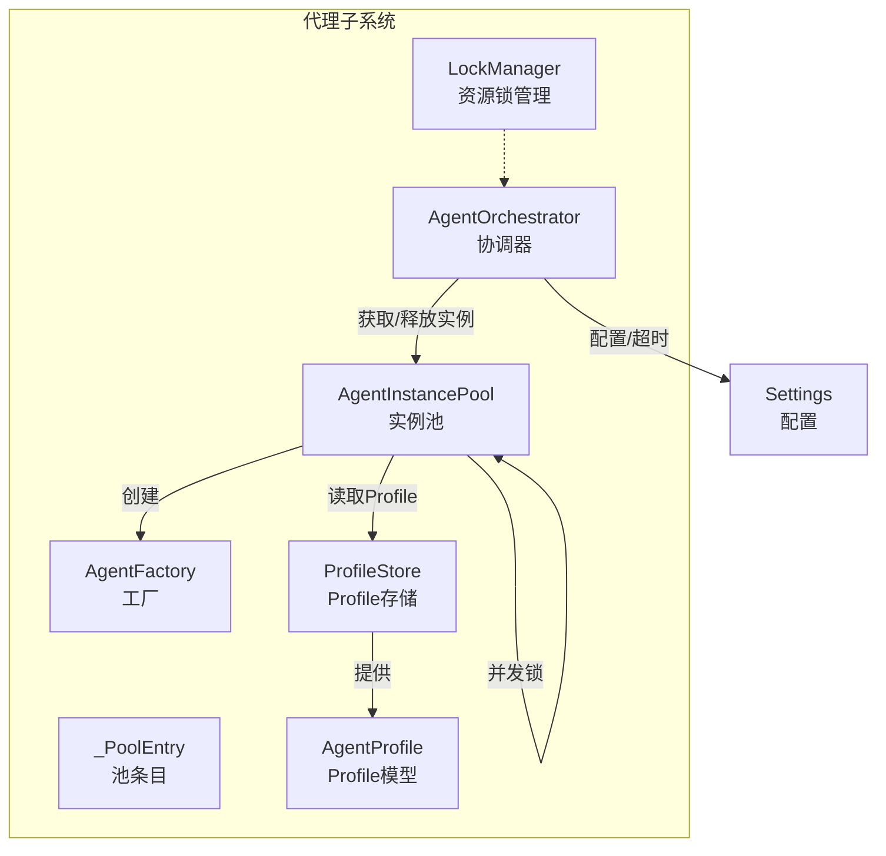
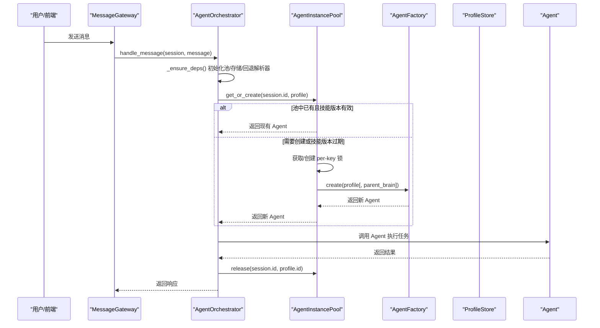
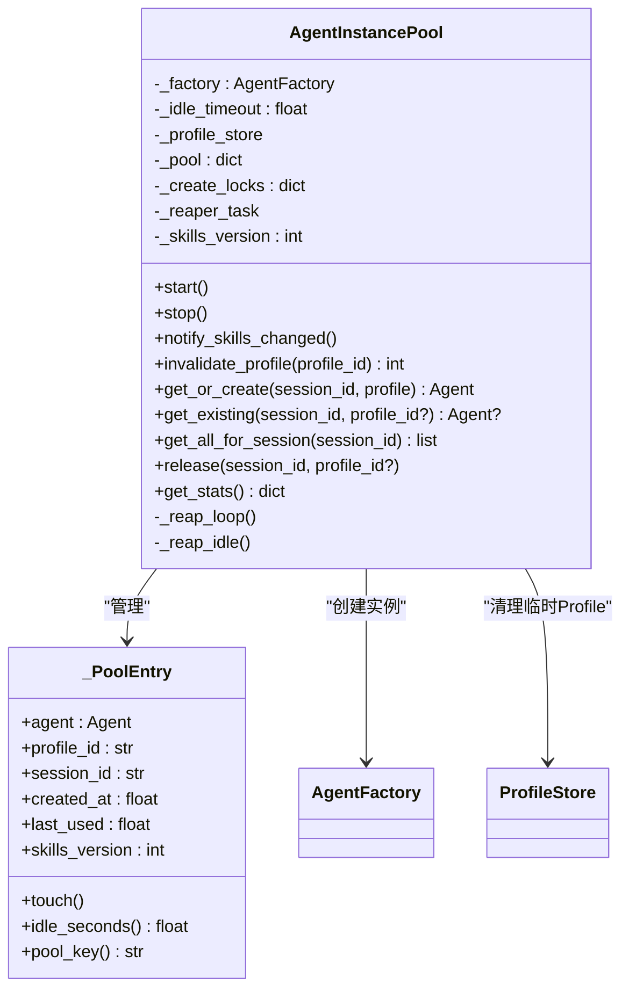
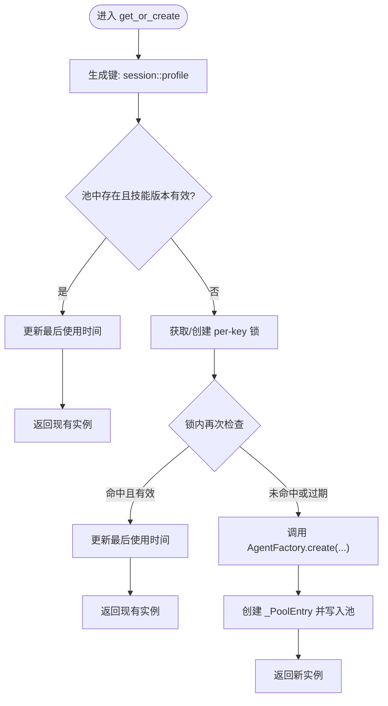
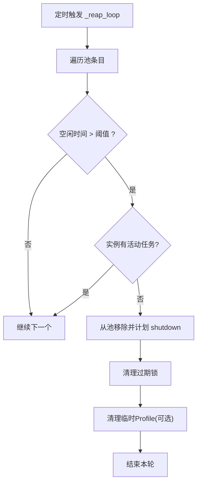
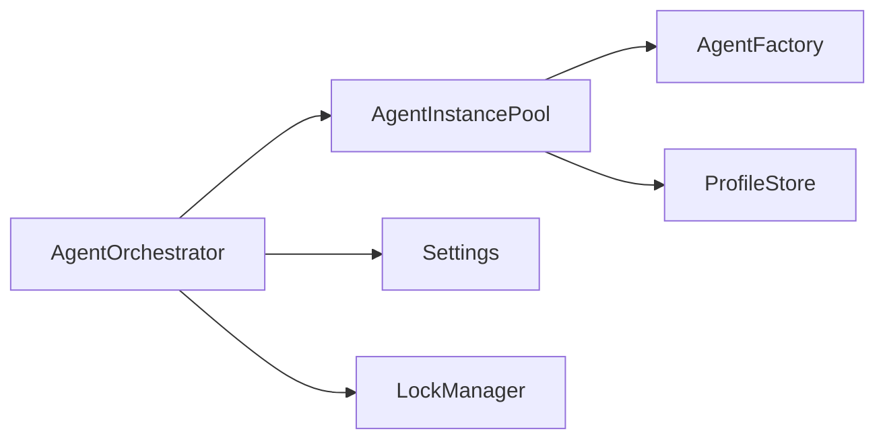

# 代理实例池

<cite>
**本文引用的文件**
- [factory.py](file://src/synapse/agents/factory.py)
- [profile.py](file://src/synapse/agents/profile.py)
- [lock_manager.py](file://src/synapse/agents/lock_manager.py)
- [orchestrator.py](file://src/synapse/agents/orchestrator.py)
- [config.py](file://src/synapse/config.py)
- [test_multi_agent.py](file://tests/unit/test_multi_agent.py)
</cite>

## 目录
1. [简介](#简介)
2. [项目结构](#项目结构)
3. [核心组件](#核心组件)
4. [架构总览](#架构总览)
5. [详细组件分析](#详细组件分析)
6. [依赖分析](#依赖分析)
7. [性能考量](#性能考量)
8. [故障排查指南](#故障排查指南)
9. [结论](#结论)
10. [附录](#附录)

## 简介
本文件面向“代理实例池（AgentInstancePool）”的技术文档，聚焦于以下目标：
- 解释 per-session + per-profile 实例管理机制
- 详解空闲回收、并发创建锁、技能版本管理等核心功能
- 说明池键格式、生命周期管理、性能优化策略与内存回收机制
- 提供与 AgentOrchestrator、ProfileStore、AgentFactory 等组件的关系说明
- 给出常见问题的解决方案与最佳实践

## 项目结构
围绕代理实例池的关键代码位于 agents 子系统中，主要文件如下：
- 工厂与池：src/synapse/agents/factory.py
- 配置与设置：src/synapse/config.py
- 协调器与使用方：src/synapse/agents/orchestrator.py
- 锁管理器：src/synapse/agents/lock_manager.py
- Profile 数据模型与存储：src/synapse/agents/profile.py
- 单元测试（验证并发、回收、统计等行为）：tests/unit/test_multi_agent.py

图表来源
- [factory.py:474-754](file://src/synapse/agents/factory.py#L474-L754)
- [orchestrator.py:250-279](file://src/synapse/agents/orchestrator.py#L250-L279)
- [profile.py:272-573](file://src/synapse/agents/profile.py#L272-L573)
- [config.py:56-67](file://src/synapse/config.py#L56-L67)

章节来源
- [factory.py:1-754](file://src/synapse/agents/factory.py#L1-L754)
- [orchestrator.py:250-279](file://src/synapse/agents/orchestrator.py#L250-L279)
- [profile.py:272-573](file://src/synapse/agents/profile.py#L272-L573)
- [config.py:56-67](file://src/synapse/config.py#L56-L67)

## 核心组件
- AgentInstancePool：按会话+Profile维度管理 Agent 实例，支持并发创建、空闲回收、技能版本感知重建。
- _PoolEntry：池内条目，记录实例、Profile、会话、创建/使用时间戳、技能版本号。
- AgentFactory：根据 AgentProfile 创建 Agent 实例，并应用技能/工具/MCP/插件/身份/记忆等过滤与隔离。
- AgentOrchestrator：多代理协调器，负责路由消息、委托、超时控制，并通过池获取/释放实例。
- ProfileStore/AgentProfile：Profile 的持久化与数据模型，支持 SYSTEM/自定义/临时 Profile。
- LockManager：细粒度资源锁管理，避免共享资源并发冲突。

章节来源
- [factory.py:474-754](file://src/synapse/agents/factory.py#L474-L754)
- [orchestrator.py:194-800](file://src/synapse/agents/orchestrator.py#L194-L800)
- [profile.py:92-244](file://src/synapse/agents/profile.py#L92-L244)
- [lock_manager.py:16-145](file://src/synapse/agents/lock_manager.py#L16-L145)

## 架构总览
代理实例池在多代理系统中的位置与交互如下：

图表来源
- [orchestrator.py:369-401](file://src/synapse/agents/orchestrator.py#L369-L401)
- [orchestrator.py:614-626](file://src/synapse/agents/orchestrator.py#L614-L626)
- [factory.py:557-623](file://src/synapse/agents/factory.py#L557-L623)

## 详细组件分析

### AgentInstancePool 类
- 池键格式：{session_id}::{profile_id}，支持同一会话下并行运行多个不同 Profile 的实例。
- 并发创建锁：每个复合键拥有独立 asyncio.Lock，保证同一键的并发创建只发生一次。
- 技能版本管理：维护全局技能版本号，若池中实例的技能版本落后，则在下次使用时重建。
- 空闲回收：后台任务周期扫描，超过空闲阈值且无活动任务的实例被回收。
- 生命周期管理：start/stop 控制回收循环；invalidate_profile 可按 Profile ID 清理池中实例。
- 与 ProfileStore 的集成：支持清理临时 Profile（ephemeral）。

图表来源
- [factory.py:474-754](file://src/synapse/agents/factory.py#L474-L754)

章节来源
- [factory.py:474-754](file://src/synapse/agents/factory.py#L474-L754)

### 并发创建与锁机制
- 每个池键（session_id::profile_id）对应一个 asyncio.Lock，避免多个协程同时创建同一实例。
- get_or_create 流程：
  1) 生成键并查找池中条目；
  2) 若条目存在且技能版本有效，直接返回；
  3) 否则获取/创建 per-key 锁；
  4) 再次检查条目（锁内二次检查），避免重复创建；
  5) 使用 AgentFactory 创建实例，写入池并返回。

图表来源
- [factory.py:557-623](file://src/synapse/agents/factory.py#L557-L623)

章节来源
- [factory.py:557-623](file://src/synapse/agents/factory.py#L557-L623)
- [test_multi_agent.py:1580-1607](file://tests/unit/test_multi_agent.py#L1580-L1607)

### 空闲回收机制
- 后台任务以固定间隔扫描池，计算每个条目的空闲时长；
- 忽略仍有活动任务的实例；
- 超过阈值的实例被移除并异步触发 shutdown；
- 清理过期的 per-key 锁；
- 对于临时 Profile，回收后尝试清理其持久化目录。

图表来源
- [factory.py:702-754](file://src/synapse/agents/factory.py#L702-L754)

章节来源
- [factory.py:702-754](file://src/synapse/agents/factory.py#L702-L754)
- [test_multi_agent.py:614-630](file://tests/unit/test_multi_agent.py#L614-L630)

### 技能版本管理
- 全局技能版本号由池维护，每次技能变更（如安装/卸载/启禁用）通过 notify_skills_changed 递增；
- 下次 get_or_create 时，若池中条目技能版本落后，则丢弃旧实例并重建，确保所有池实例与最新技能状态一致。

章节来源
- [factory.py:531-534](file://src/synapse/agents/factory.py#L531-L534)
- [factory.py:576-584](file://src/synapse/agents/factory.py#L576-L584)

### 与 AgentOrchestrator 的关系
- 协调器在处理消息时，通过池获取实例；实例执行完成后通过池 release；
- 协调器还负责“无进展超时”策略，结合池的空闲回收共同保障系统稳定性；
- 协调器在初始化时懒加载池与 ProfileStore。

章节来源
- [orchestrator.py:369-401](file://src/synapse/agents/orchestrator.py#L369-L401)
- [orchestrator.py:614-626](file://src/synapse/agents/orchestrator.py#L614-L626)
- [orchestrator.py:250-279](file://src/synapse/agents/orchestrator.py#L250-L279)

### 与 ProfileStore/AgentProfile 的关系
- 池通过 ProfileStore 获取/校验 Profile，支持 SYSTEM/自定义/临时 Profile；
- 临时 Profile 在回收时可被自动清理；
- 池键中的 profile_id 与 ProfileStore 中的 id 对应。

章节来源
- [profile.py:272-573](file://src/synapse/agents/profile.py#L272-L573)
- [factory.py:691-701](file://src/synapse/agents/factory.py#L691-L701)

### 与 AgentFactory 的关系
- 池负责实例生命周期与复用，Factory 负责根据 Profile 创建实例并应用过滤与隔离；
- 池在创建时可传递 parent_brain，以复用会话内的系统实例。

章节来源
- [factory.py:116-208](file://src/synapse/agents/factory.py#L116-L208)
- [factory.py:615-618](file://src/synapse/agents/factory.py#L615-L618)

### 与 LockManager 的关系
- LockManager 提供细粒度资源锁（如文件/工具/内存等），避免多实例并发访问共享资源；
- AgentInstancePool 专注于实例级并发控制，LockManager 用于资源级并发控制，两者互补。

章节来源
- [lock_manager.py:16-145](file://src/synapse/agents/lock_manager.py#L16-L145)

## 依赖分析
- 池对工厂的依赖：仅通过工厂接口创建实例，便于替换与测试。
- 池对 ProfileStore 的依赖：用于清理临时 Profile，以及在回收时尝试移除临时 Profile。
- 池对事件循环的依赖：使用 asyncio.Lock 与 asyncio.create_task 管理并发与后台任务。
- 协调器对池的依赖：通过池获取/释放实例，配合超时策略与回退解析器。

图表来源
- [orchestrator.py:250-279](file://src/synapse/agents/orchestrator.py#L250-L279)
- [factory.py:484-498](file://src/synapse/agents/factory.py#L484-L498)

章节来源
- [orchestrator.py:250-279](file://src/synapse/agents/orchestrator.py#L250-L279)
- [factory.py:484-498](file://src/synapse/agents/factory.py#L484-L498)

## 性能考量
- 并发创建锁：每个池键独立锁，避免全局阻塞，提高并发吞吐。
- 空闲回收：定期清理闲置实例，降低内存占用与上下文切换成本。
- 技能版本感知重建：避免因技能变更导致的实例状态不一致，减少运行时错误。
- 会话内父实例复用：在同一会话内优先复用系统实例的 brain，减少初始化开销。
- 超时策略：协调器采用“无进展超时”，结合池回收，避免僵尸实例长期占用资源。

章节来源
- [factory.py:586-588](file://src/synapse/agents/factory.py#L586-L588)
- [factory.py:604-613](file://src/synapse/agents/factory.py#L604-L613)
- [orchestrator.py:590-596](file://src/synapse/agents/orchestrator.py#L590-L596)

## 故障排查指南
- 并发创建异常
  - 现象：多个协程同时请求同一池键，出现重复创建或竞态。
  - 排查：确认 per-key 锁是否正确创建与释放；检查 get_or_create 的二次检查逻辑。
  - 参考：[factory.py:586-594](file://src/synapse/agents/factory.py#L586-L594)
- 空闲回收误杀
  - 现象：实例仍在执行但被回收。
  - 排查：确认实例是否仍处于活动任务状态；检查 has_active_task 标记。
  - 参考：[factory.py:722-728](file://src/synapse/agents/factory.py#L722-L728)
- 技能变更未生效
  - 现象：实例仍使用旧技能。
  - 排查：确认 notify_skills_changed 是否被调用；检查实例的 skills_version 是否落后。
  - 参考：[factory.py:531-534](file://src/synapse/agents/factory.py#L531-L534)
- 临时 Profile 未清理
  - 现象：回收后临时 Profile 仍存在于磁盘。
  - 排查：确认 ProfileStore 的 ephemeral 标记与清理逻辑。
  - 参考：[factory.py:742-754](file://src/synapse/agents/factory.py#L742-L754)
- 协调器超时误判
  - 现象：实例实际在运行却被判定为无进展。
  - 排查：检查 progress_timeout_seconds 与 hard_timeout_seconds 配置；确认指纹采集逻辑。
  - 参考：[config.py:56-67](file://src/synapse/config.py#L56-L67)
  - 参考：[orchestrator.py:682-750](file://src/synapse/agents/orchestrator.py#L682-L750)

章节来源
- [factory.py:531-534](file://src/synapse/agents/factory.py#L531-L534)
- [factory.py:586-594](file://src/synapse/agents/factory.py#L586-L594)
- [factory.py:722-754](file://src/synapse/agents/factory.py#L722-L754)
- [config.py:56-67](file://src/synapse/config.py#L56-L67)
- [orchestrator.py:682-750](file://src/synapse/agents/orchestrator.py#L682-L750)

## 结论
AgentInstancePool 通过 per-session + per-profile 的实例管理、并发创建锁、技能版本感知重建与空闲回收机制，实现了高效、稳定、可扩展的多代理实例生命周期管理。它与 AgentOrchestrator、AgentFactory、ProfileStore 等组件协同，支撑了复杂的多代理工作流与超时控制策略。合理配置空闲阈值与超时参数，配合池的回收与重建能力，可在保证稳定性的同时最大化资源利用率。

## 附录

### 配置选项与参数说明
- 空闲回收相关
  - 池空闲阈值：默认 30 分钟，可通过构造函数传入。
  - 回收检查间隔：默认 1 分钟。
  - 参考：[factory.py:23-24](file://src/synapse/agents/factory.py#L23-L24)
- 协调器超时相关
  - progress_timeout_seconds：无进展超时阈值（秒），默认 1200。
  - hard_timeout_seconds：硬超时上限（秒，0 表示禁用）。
  - 参考：[config.py:56-67](file://src/synapse/config.py#L56-L67)
- 池 API 一览
  - start()/stop()：启动/停止回收循环。
  - notify_skills_changed()：递增技能版本号。
  - invalidate_profile(profile_id)：按 Profile ID 清理池中实例。
  - get_or_create(session_id, profile)：获取或创建实例。
  - get_existing(session_id, profile_id?)：仅查询现有实例。
  - get_all_for_session(session_id)：查询会话下所有实例。
  - release(session_id, profile_id?)：标记实例进入空闲回收。
  - get_stats()：返回池统计信息。
  - 参考：[factory.py:517-689](file://src/synapse/agents/factory.py#L517-L689)

章节来源
- [factory.py:23-24](file://src/synapse/agents/factory.py#L23-L24)
- [config.py:56-67](file://src/synapse/config.py#L56-L67)
- [factory.py:517-689](file://src/synapse/agents/factory.py#L517-L689)