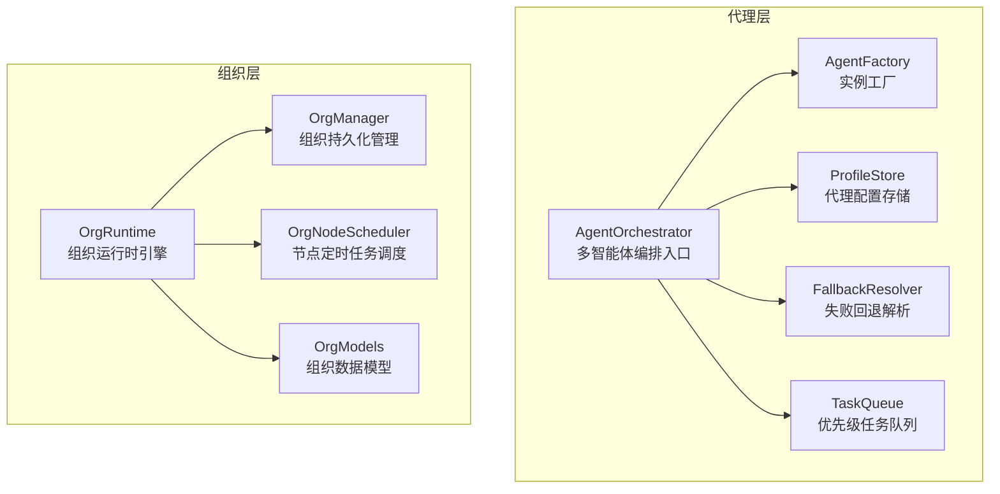
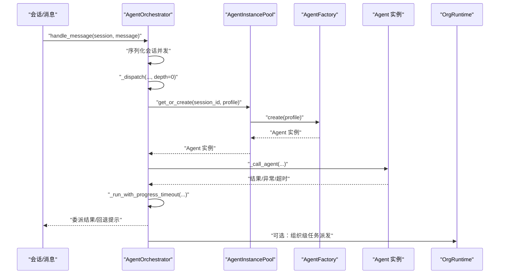
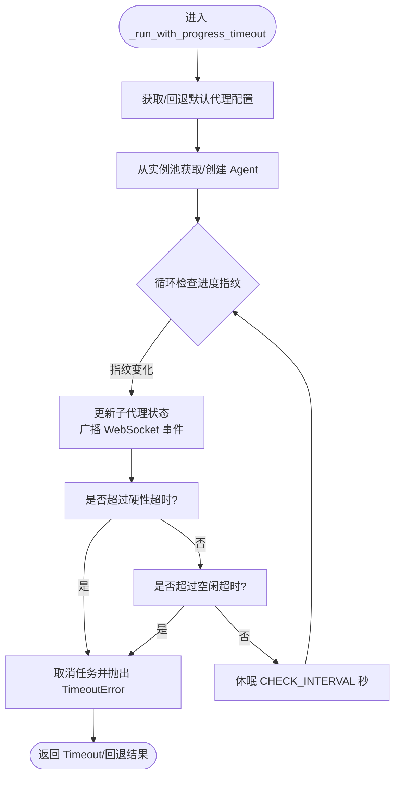
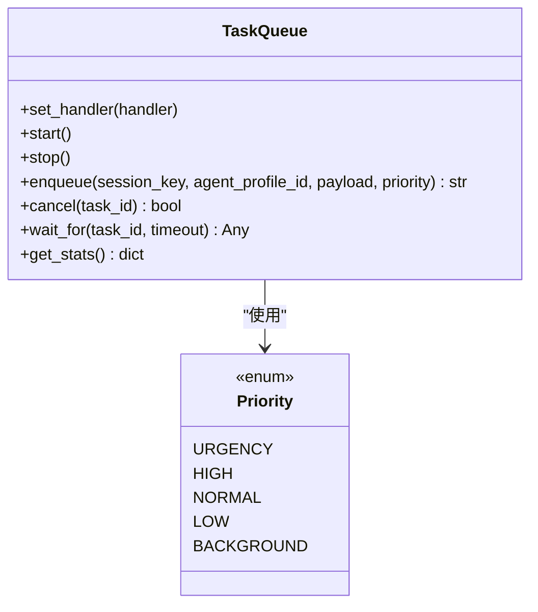
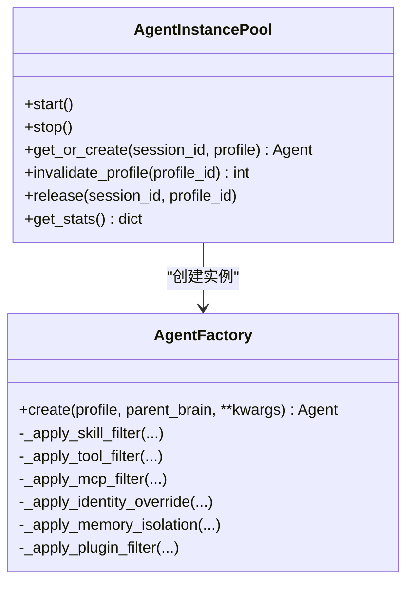
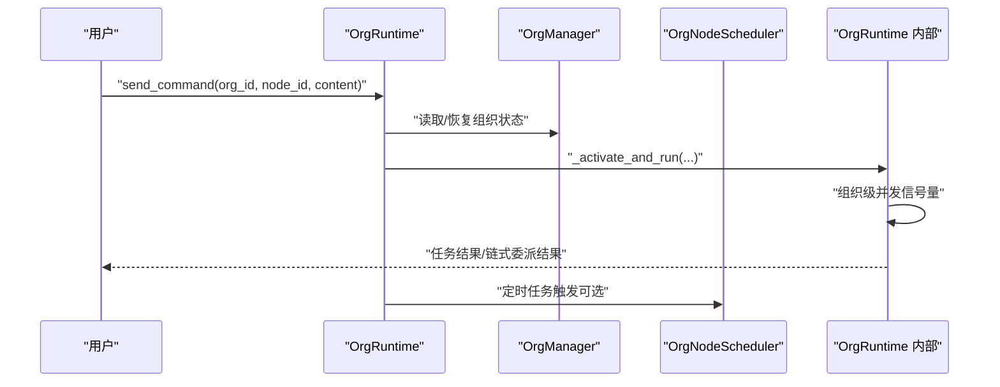
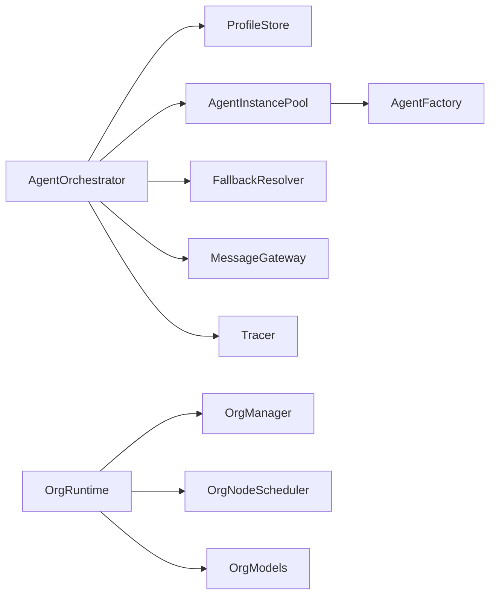

# 代理编排器

<cite>
**本文引用的文件**
- [orchestrator.py](file://src/synapse/agents/orchestrator.py)
- [task_queue.py](file://src/synapse/agents/task_queue.py)
- [factory.py](file://src/synapse/agents/factory.py)
- [profile.py](file://src/synapse/agents/profile.py)
- [fallback.py](file://src/synapse/agents/fallback.py)
- [runtime.py](file://src/synapse/orgs/runtime.py)
- [manager.py](file://src/synapse/orgs/manager.py)
- [node_scheduler.py](file://src/synapse/orgs/node_scheduler.py)
- [models.py](file://src/synapse/orgs/models.py)
</cite>

## 目录
1. [简介](#简介)
2. [项目结构](#项目结构)
3. [核心组件](#核心组件)
4. [架构总览](#架构总览)
5. [详细组件分析](#详细组件分析)
6. [依赖分析](#依赖分析)
7. [性能考虑](#性能考虑)
8. [故障排查指南](#故障排查指南)
9. [结论](#结论)
10. [附录](#附录)

## 简介
本文件面向“代理编排器”的技术文档，系统阐述多智能体任务协调、任务队列管理、智能体间通信机制、自动委派与失败回退策略、深度控制、生命周期与资源分配、负载均衡等核心能力。文档兼顾初学者与高级开发者，既提供概念性说明，又给出代码级定位与图示，帮助快速理解与落地实践。

## 项目结构
代理编排器位于 synapse 代码树中，围绕“代理编排”形成两条主线：
- 代理层：负责单会话内的代理实例创建、筛选、隔离、生命周期管理与委派执行。
- 组织层：负责组织维度的任务调度、节点并发控制、定时任务、心跳与监控等。

图表来源
- [orchestrator.py:194-244](file://src/synapse/agents/orchestrator.py#L194-L244)
- [factory.py:116-208](file://src/synapse/agents/factory.py#L116-L208)
- [profile.py:272-481](file://src/synapse/agents/profile.py#L272-L481)
- [fallback.py:59-117](file://src/synapse/agents/fallback.py#L59-L117)
- [task_queue.py:43-73](file://src/synapse/agents/task_queue.py#L43-L73)
- [runtime.py:81-140](file://src/synapse/orgs/runtime.py#L81-L140)
- [manager.py:29-40](file://src/synapse/orgs/manager.py#L29-L40)
- [node_scheduler.py:35-48](file://src/synapse/orgs/node_scheduler.py#L35-L48)
- [models.py:131-161](file://src/synapse/orgs/models.py#L131-L161)

章节来源
- [orchestrator.py:194-244](file://src/synapse/agents/orchestrator.py#L194-L244)
- [runtime.py:81-140](file://src/synapse/orgs/runtime.py#L81-L140)

## 核心组件
- 代理编排器（AgentOrchestrator）：多智能体编排入口，负责路由消息、委派执行、超时与失败回退、健康度统计与日志记录。
- 代理工厂（AgentFactory）与实例池（AgentInstancePool）：按配置创建/筛选/隔离代理实例，并进行空闲回收与版本感知重建。
- 代理配置（AgentProfile）与存储（ProfileStore）：定义代理角色、技能、工具、MCP、插件、权限、隔离策略等。
- 失败回退（FallbackResolver）：基于健康度与连续失败阈值自动降级到备用代理。
- 任务队列（TaskQueue）：异步优先级队列，支持并发上限、取消与统计。
- 组织运行时（OrgRuntime）：组织生命周期、节点并发控制、任务派发、取消与状态广播。
- 组织管理（OrgManager）：组织 CRUD、模板、状态持久化。
- 节点调度（OrgNodeScheduler）：节点级定时任务，具备智能调频与异常恢复。
- 组织模型（OrgModels）：组织、节点、边、消息、任务等核心数据结构。

章节来源
- [orchestrator.py:194-244](file://src/synapse/agents/orchestrator.py#L194-L244)
- [factory.py:474-534](file://src/synapse/agents/factory.py#L474-L534)
- [profile.py:272-481](file://src/synapse/agents/profile.py#L272-L481)
- [fallback.py:59-117](file://src/synapse/agents/fallback.py#L59-L117)
- [task_queue.py:43-73](file://src/synapse/agents/task_queue.py#L43-L73)
- [runtime.py:81-140](file://src/synapse/orgs/runtime.py#L81-L140)
- [manager.py:29-40](file://src/synapse/orgs/manager.py#L29-L40)
- [node_scheduler.py:35-48](file://src/synapse/orgs/node_scheduler.py#L35-L48)
- [models.py:131-161](file://src/synapse/orgs/models.py#L131-L161)

## 架构总览
代理编排器采用“会话级路由 + 组织级并发控制”的双层设计：
- 会话层：AgentOrchestrator 根据会话上下文选择代理配置（AgentProfile），通过 AgentInstancePool 获取/创建实例，执行并跟踪子代理状态。
- 组织层：OrgRuntime 控制组织内节点并发与任务派发，结合 OrgNodeScheduler 实现节点级定时任务与异常恢复。

图表来源
- [orchestrator.py:369-401](file://src/synapse/agents/orchestrator.py#L369-L401)
- [orchestrator.py:406-567](file://src/synapse/agents/orchestrator.py#L406-L567)
- [orchestrator.py:572-762](file://src/synapse/agents/orchestrator.py#L572-L762)
- [factory.py:557-623](file://src/synapse/agents/factory.py#L557-L623)
- [runtime.py:518-578](file://src/synapse/orgs/runtime.py#L518-L578)

## 详细组件分析

### 代理编排器（AgentOrchestrator）
- 主要职责
  - 会话级消息路由：依据 session.context.agent_profile_id 选择代理配置。
  - 委派执行：支持最大委派深度限制，记录委派链路与日志。
  - 超时与失败处理：基于“进度指纹”检测空闲无进展，结合硬性超时与软性超时策略。
  - 健康度统计：记录成功/失败次数、平均耗时、最近错误，支持回退策略。
  - 子代理状态广播：实时更新前端轮询所需的状态快照。
- 关键机制
  - 进度感知超时：通过“迭代轮次/状态/工具执行数”指纹判断是否停滞。
  - 委派日志：JSONL 日志按日期切分，便于审计与分析。
  - 会话级并发：使用信号量串行化同一会话的消息处理。
- 配置要点
  - settings.progress_timeout_seconds：空闲超时阈值。
  - settings.hard_timeout_seconds：硬性总时长上限。
  - profile.timeout_seconds：按代理配置覆盖硬性超时。
  - MAX_DELEGATION_DEPTH：委派深度上限。

图表来源
- [orchestrator.py:572-762](file://src/synapse/agents/orchestrator.py#L572-L762)

章节来源
- [orchestrator.py:194-244](file://src/synapse/agents/orchestrator.py#L194-L244)
- [orchestrator.py:369-401](file://src/synapse/agents/orchestrator.py#L369-L401)
- [orchestrator.py:406-567](file://src/synapse/agents/orchestrator.py#L406-L567)
- [orchestrator.py:572-762](file://src/synapse/agents/orchestrator.py#L572-L762)

### 任务队列（TaskQueue）
- 功能特性
  - 优先级调度：Priority 枚举定义 URGENT/HIGH/NORMAL/LOW/BACKGROUND。
  - 并发上限：max_concurrent 控制同时活跃任务数量。
  - 取消与等待：支持取消排队/执行中任务，等待结果并清理 Future。
  - 统计指标：记录入队、完成、失败、取消总数。
- 使用场景
  - 作为 AgentOrchestrator 的未来“委派队列迁移”承载者，目前仍处于预留状态。

图表来源
- [task_queue.py:43-73](file://src/synapse/agents/task_queue.py#L43-L73)
- [task_queue.py:113-134](file://src/synapse/agents/task_queue.py#L113-L134)
- [task_queue.py:165-214](file://src/synapse/agents/task_queue.py#L165-L214)

章节来源
- [task_queue.py:43-73](file://src/synapse/agents/task_queue.py#L43-L73)
- [task_queue.py:113-134](file://src/synapse/agents/task_queue.py#L113-L134)
- [task_queue.py:165-214](file://src/synapse/agents/task_queue.py#L165-L214)

### 代理工厂与实例池（AgentFactory / AgentInstancePool）
- 代理工厂（AgentFactory）
  - 技能过滤：INCLUSIVE/EXCLUSIVE 模式，保留基础设施技能集合。
  - 工具过滤：按类目/工具名过滤，保持必要系统工具。
  - MCP 过滤：克隆 MCP Catalog，限制可访问服务器。
  - 身份隔离：按 Profile 专属 identity 目录覆盖系统提示词。
  - 记忆隔离：可启用独立 MemoryManager，支持继承全局记忆。
  - 插件过滤：按 inclusive/exclusive 过滤插件并卸载无关插件。
- 实例池（AgentInstancePool）
  - per-session + per-profile 键控：同一会话可并行运行多个不同配置的代理。
  - 空闲回收：空闲超时回收，避免资源泄露。
  - 版本感知重建：全局技能版本变更时，旧实例在下次使用时重建。
  - 并发锁：针对同一键的创建过程加锁，避免重复创建。

图表来源
- [factory.py:116-208](file://src/synapse/agents/factory.py#L116-L208)
- [factory.py:294-450](file://src/synapse/agents/factory.py#L294-L450)
- [factory.py:474-534](file://src/synapse/agents/factory.py#L474-L534)
- [factory.py:557-623](file://src/synapse/agents/factory.py#L557-L623)

章节来源
- [factory.py:116-208](file://src/synapse/agents/factory.py#L116-L208)
- [factory.py:294-450](file://src/synapse/agents/factory.py#L294-L450)
- [factory.py:474-534](file://src/synapse/agents/factory.py#L474-L534)
- [factory.py:557-623](file://src/synapse/agents/factory.py#L557-L623)

### 代理配置与存储（AgentProfile / ProfileStore）
- AgentProfile
  - 定义代理类型、角色、技能/工具/MCP/插件策略、自定义提示词、图标颜色、回退代理、首选端点、权限规则、隔离模式、执行约束（最大轮次、超时秒数等）。
- ProfileStore
  - 持久化与内存混合存储，支持 SYSTEM 保护、临时 Profile、分类管理、目录初始化、原子写入。
  - 提供 get/update/save/delete/list 等接口，支持按会话/前缀清理临时 Profile。

章节来源
- [profile.py:92-244](file://src/synapse/agents/profile.py#L92-L244)
- [profile.py:272-481](file://src/synapse/agents/profile.py#L272-L481)

### 失败回退（FallbackResolver）
- 健康度窗口：5 分钟连续失败计数，超过阈值自动降级。
- 回退策略：若当前代理配置存在 fallback_profile_id 且有效，则切换到备用代理。
- 统计输出：提供健康度统计与回退建议文案，便于 IM/聊天界面提示。

章节来源
- [fallback.py:59-117](file://src/synapse/agents/fallback.py#L59-L117)

### 组织运行时（OrgRuntime）
- 生命周期与状态机：DORMANT/ACTIVE/RUNNING/PAUSED/ARCHIVED，严格的状态转换校验。
- 组织级并发：通过组织级信号量限制同时激活的节点数，避免资源争用。
- 任务派发：send_command 将用户命令发送至目标节点，支持链式委派与等待完成。
- 节点控制：cancel_node_task 支持取消节点任务、重置状态、广播事件。
- 自动启动：operation_mode=autonomous 时，启动核心业务并持续运行。
- 缓存与清理：节点 Agent 缓存与 TTL，异常恢复与自动清理。

图表来源
- [runtime.py:518-578](file://src/synapse/orgs/runtime.py#L518-L578)
- [runtime.py:706-800](file://src/synapse/orgs/runtime.py#L706-L800)
- [manager.py:95-158](file://src/synapse/orgs/manager.py#L95-L158)
- [node_scheduler.py:169-206](file://src/synapse/orgs/node_scheduler.py#L169-L206)

章节来源
- [runtime.py:81-140](file://src/synapse/orgs/runtime.py#L81-L140)
- [runtime.py:518-578](file://src/synapse/orgs/runtime.py#L518-L578)
- [runtime.py:706-800](file://src/synapse/orgs/runtime.py#L706-L800)
- [manager.py:95-158](file://src/synapse/orgs/manager.py#L95-L158)
- [node_scheduler.py:169-206](file://src/synapse/orgs/node_scheduler.py#L169-L206)

### 节点调度（OrgNodeScheduler）
- 支持一次性、固定间隔、Cron 三种模式。
- 智能调频：连续无异常时自动降频，发现异常立即恢复。
- 异常上报：按配置在异常时向指定对象汇报。

章节来源
- [node_scheduler.py:35-48](file://src/synapse/orgs/node_scheduler.py#L35-L48)
- [node_scheduler.py:108-168](file://src/synapse/orgs/node_scheduler.py#L108-L168)
- [node_scheduler.py:169-206](file://src/synapse/orgs/node_scheduler.py#L169-L206)

### 组织数据模型（OrgModels）
- Organization/OrgNode/OrgEdge/OrgMessage/OrgMemoryEntry/ProjectTask 等核心数据结构，支撑组织编排、任务追踪、消息流转与知识沉淀。

章节来源
- [models.py:131-161](file://src/synapse/orgs/models.py#L131-L161)
- [models.py:322-480](file://src/synapse/orgs/models.py#L322-L480)
- [models.py:534-576](file://src/synapse/orgs/models.py#L534-L576)
- [models.py:708-775](file://src/synapse/orgs/models.py#L708-L775)

## 依赖分析
- 组件耦合
  - AgentOrchestrator 依赖 ProfileStore、AgentInstancePool、FallbackResolver、MessageGateway（可选）、Tracer（可选）。
  - AgentInstancePool 依赖 AgentFactory 与 ProfileStore。
  - OrgRuntime 依赖 OrgManager、OrgNodeScheduler、OrgModels、OrgMessenger 等子系统。
- 外部依赖
  - 配置系统（settings）提供超时、硬性上限、数据目录等参数。
  - 日志与事件系统（JSONL 日志、WebSocket 广播）贯穿编排流程。

图表来源
- [orchestrator.py:250-279](file://src/synapse/agents/orchestrator.py#L250-L279)
- [factory.py:474-534](file://src/synapse/agents/factory.py#L474-L534)
- [runtime.py:81-140](file://src/synapse/orgs/runtime.py#L81-L140)
- [manager.py:29-40](file://src/synapse/orgs/manager.py#L29-L40)
- [node_scheduler.py:35-48](file://src/synapse/orgs/node_scheduler.py#L35-L48)

章节来源
- [orchestrator.py:250-279](file://src/synapse/agents/orchestrator.py#L250-L279)
- [factory.py:474-534](file://src/synapse/agents/factory.py#L474-L534)
- [runtime.py:81-140](file://src/synapse/orgs/runtime.py#L81-L140)

## 性能考虑
- 并发控制
  - 会话级并发：AgentOrchestrator 使用信号量串行化同一会话的消息处理，避免竞态。
  - 组织级并发：OrgRuntime 通过组织级信号量限制同时激活节点数，防止资源过载。
  - 实例池空闲回收：空闲超时回收实例，降低内存占用。
- 超时策略
  - 进度感知超时：避免“僵尸任务”，提升系统响应性。
  - 硬性超时：防止极端情况下的无限等待。
- I/O 与日志
  - 委派日志采用 JSONL 按天切分，定期轮转，避免日志膨胀。
- 资源隔离
  - 记忆隔离与身份隔离减少跨会话污染，提高稳定性。

## 故障排查指南
- 常见问题
  - 代理长时间无进展：检查 settings.progress_timeout_seconds 与 hard_timeout_seconds，确认是否存在网络/工具阻塞。
  - 委派深度超限：确认 MAX_DELEGATION_DEPTH 与链路长度，优化委派策略。
  - 代理失败频繁：查看 FallbackResolver 健康度统计，必要时切换到 fallback 代理。
  - 会话并发冲突：确认会话级信号量是否生效，避免并发写入共享资源。
  - 组织节点卡住：使用 cancel_node_task 取消任务并重置状态，检查节点状态广播。
- 定位手段
  - 委派日志：按日期文件检索，核对 dispatch_start/dispatch_ok/dispatch_timeout/dispatch_error。
  - 健康度统计：FallbackResolver 提供连续失败次数、失败率与降级状态。
  - 子代理状态：AgentOrchestrator 维护子代理状态字典，支持前端轮询。

章节来源
- [orchestrator.py:286-328](file://src/synapse/agents/orchestrator.py#L286-L328)
- [orchestrator.py:487-566](file://src/synapse/agents/orchestrator.py#L487-L566)
- [fallback.py:119-131](file://src/synapse/agents/fallback.py#L119-L131)
- [runtime.py:580-651](file://src/synapse/orgs/runtime.py#L580-L651)

## 结论
代理编排器通过“会话级委派 + 组织级并发控制”的双层设计，在保证稳定性的同时提供了强大的扩展性与可控性。借助进度感知超时、失败回退、健康度统计、实例池回收与隔离策略，系统能够在复杂多变的多智能体场景中高效运转。配合组织层的节点调度与运行时管理，整体架构实现了从“单会话任务”到“组织级自治”的平滑演进。

## 附录
- 配置项速查
  - settings.progress_timeout_seconds：空闲超时阈值（秒）
  - settings.hard_timeout_seconds：硬性总时长上限（秒）
  - profile.timeout_seconds：按代理配置覆盖硬性超时
  - MAX_DELEGATION_DEPTH：委派深度上限
  - OrgRuntime.max_concurrent_nodes_per_org：组织级并发上限
  - OrgNode.max_concurrent_tasks：节点并发上限
- 关键流程路径
  - 会话入口：[handle_message:369-401](file://src/synapse/agents/orchestrator.py#L369-L401)
  - 委派执行：[dispatch:406-567](file://src/synapse/agents/orchestrator.py#L406-L567)
  - 进度超时：[run_with_progress_timeout:572-762](file://src/synapse/agents/orchestrator.py#L572-L762)
  - 实例池获取：[get_or_create:557-623](file://src/synapse/agents/factory.py#L557-L623)
  - 组织派发：[send_command:518-578](file://src/synapse/orgs/runtime.py#L518-L578)
  - 节点取消：[cancel_node_task:580-651](file://src/synapse/orgs/runtime.py#L580-L651)