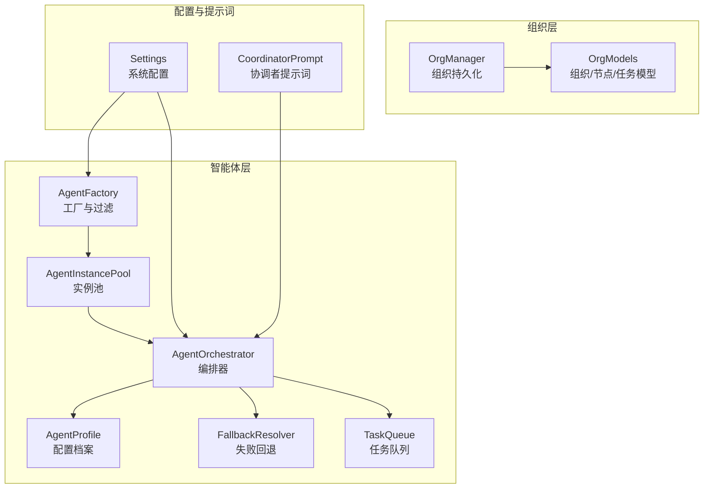
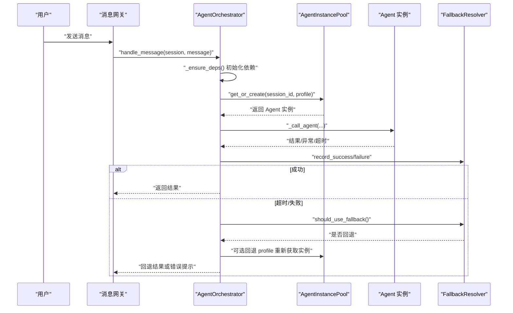
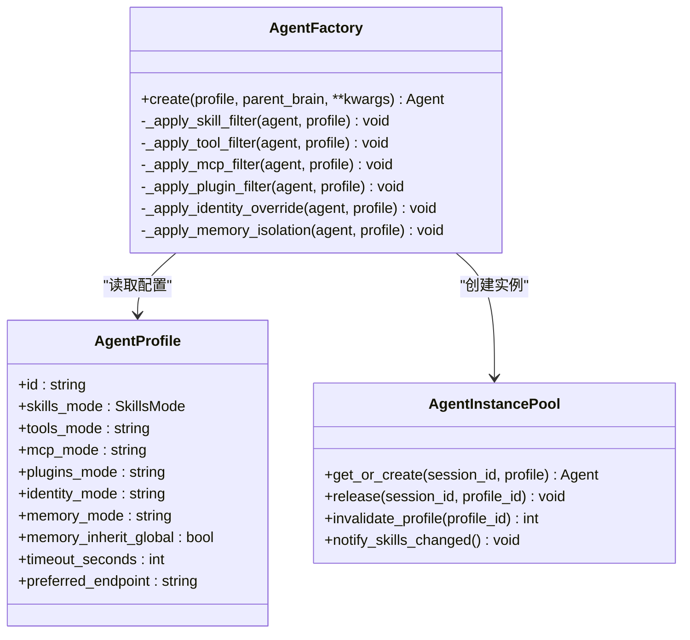
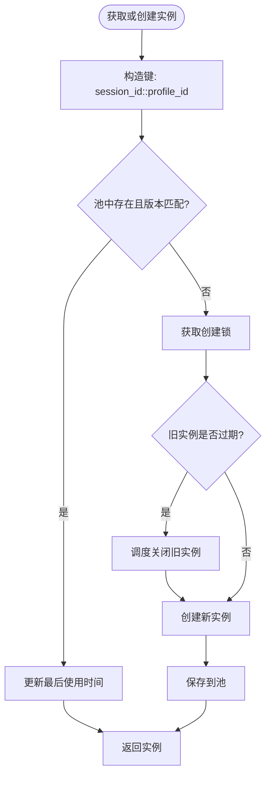
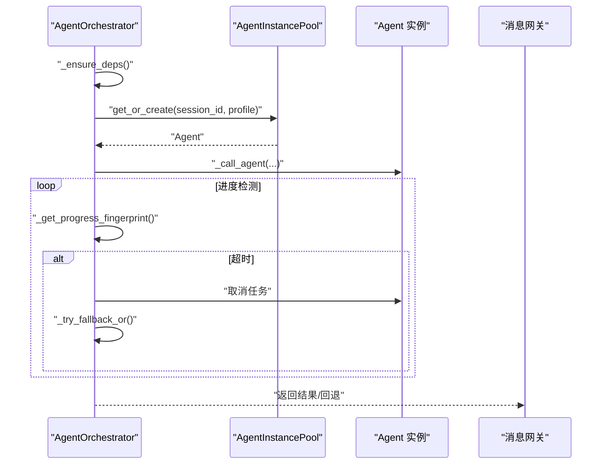
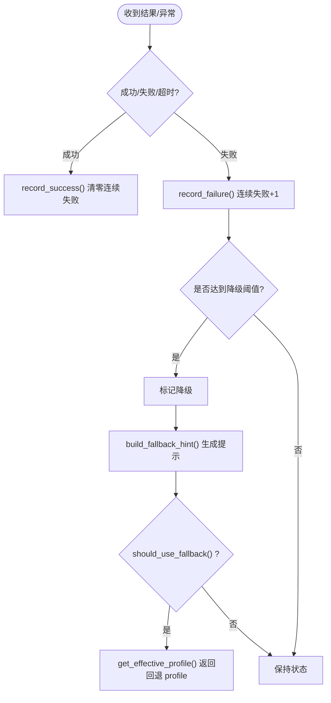
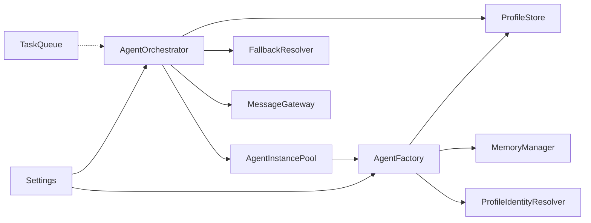
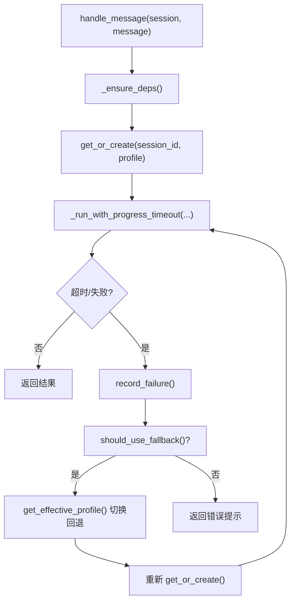

# 多智能体协作系统

<cite>
**本文引用的文件**
- [factory.py](file://src/synapse/agents/factory.py)
- [orchestrator.py](file://src/synapse/agents/orchestrator.py)
- [fallback.py](file://src/synapse/agents/fallback.py)
- [task_queue.py](file://src/synapse/agents/task_queue.py)
- [profile.py](file://src/synapse/agents/profile.py)
- [manifest.py](file://src/synapse/agents/manifest.py)
- [coordinator_prompt.py](file://src/synapse/agents/coordinator_prompt.py)
- [config.py](file://src/synapse/config.py)
- [manager.py](file://src/synapse/orgs/manager.py)
- [models.py](file://src/synapse/orgs/models.py)
</cite>

## 目录
1. [简介](#简介)
2. [项目结构](#项目结构)
3. [核心组件](#核心组件)
4. [架构总览](#架构总览)
5. [详细组件分析](#详细组件分析)
6. [依赖分析](#依赖分析)
7. [性能考量](#性能考量)
8. [故障排查指南](#故障排查指南)
9. [结论](#结论)
10. [附录](#附录)

## 简介
本技术文档围绕多智能体协作系统，系统性阐述智能体工厂（AgentFactory）、代理编排器（AgentOrchestrator）、自动委派机制、代理实例池管理、失败回退策略与深度控制等核心能力。文档既提供面向初学者的概念讲解，也为有经验的开发者提供代码级细节、配置选项与最佳实践。

## 项目结构
多智能体协作系统的关键模块分布如下：
- agents：智能体生命周期与编排
  - factory.py：智能体工厂与实例池
  - orchestrator.py：多智能体编排与委派
  - fallback.py：失败回退与健康度统计
  - task_queue.py：任务队列与并发控制
  - profile.py：智能体配置档案与存储
  - manifest.py：智能体包清单与校验
  - coordinator_prompt.py：协调者模式提示词
- orgs：组织编排与节点模型
  - manager.py：组织持久化管理
  - models.py：组织、节点、任务等数据模型
- config.py：系统配置与运行参数
- 其他：channels、core、memory、tools 等支撑模块

**图表来源**
- [factory.py:116-450](file://src/synapse/agents/factory.py#L116-L450)
- [orchestrator.py:194-800](file://src/synapse/agents/orchestrator.py#L194-L800)
- [fallback.py:59-143](file://src/synapse/agents/fallback.py#L59-L143)
- [task_queue.py:43-227](file://src/synapse/agents/task_queue.py#L43-L227)
- [profile.py:92-270](file://src/synapse/agents/profile.py#L92-L270)
- [manager.py:29-120](file://src/synapse/orgs/manager.py#L29-L120)
- [models.py:131-211](file://src/synapse/orgs/models.py#L131-L211)
- [config.py:17-120](file://src/synapse/config.py#L17-L120)
- [coordinator_prompt.py:11-128](file://src/synapse/agents/coordinator_prompt.py#L11-L128)

**章节来源**
- [factory.py:116-450](file://src/synapse/agents/factory.py#L116-L450)
- [orchestrator.py:194-800](file://src/synapse/agents/orchestrator.py#L194-L800)
- [fallback.py:59-143](file://src/synapse/agents/fallback.py#L59-L143)
- [task_queue.py:43-227](file://src/synapse/agents/task_queue.py#L43-L227)
- [profile.py:92-270](file://src/synapse/agents/profile.py#L92-L270)
- [manager.py:29-120](file://src/synapse/orgs/manager.py#L29-L120)
- [models.py:131-211](file://src/synapse/orgs/models.py#L131-L211)
- [config.py:17-120](file://src/synapse/config.py#L17-L120)
- [coordinator_prompt.py:11-128](file://src/synapse/agents/coordinator_prompt.py#L11-L128)

## 核心组件
- 智能体工厂（AgentFactory）
  - 负责根据 AgentProfile 构建 Agent 实例，应用技能/工具/MCP/插件过滤，注入身份与记忆隔离，注入自定义提示词与首选端点。
- 代理实例池（AgentInstancePool）
  - per-session + per-profile 绑定的实例池，支持空闲回收、并发创建锁、技能版本变更触发重建、临时 Profile 清理。
- 代理编排器（AgentOrchestrator）
  - 多智能体编排中心，基于会话路由到指定 Agent，支持委派链、进度感知超时、健康度统计、失败回退、前端状态广播。
- 失败回退（FallbackResolver）
  - 基于健康度统计的自动降级与回退策略，支持连续失败阈值与回退提示。
- 任务队列（TaskQueue）
  - 优先级任务队列，支持并发上限、取消、结果 Future 管理与统计。
- 配置档案（AgentProfile/ProfileStore）
  - 智能体配置蓝图与持久化存储，支持 SYSTEM 保护、临时 Profile、分类与权限规则。
- 协调者模式提示词（CoordinatorPrompt）
  - 为协调者模式提供系统提示词，指导委派、并行与失败处理。
- 系统配置（Settings）
  - 超时策略、工具护栏、并行工具、代理、日志、记忆、通道等全局配置。

**章节来源**
- [factory.py:116-450](file://src/synapse/agents/factory.py#L116-L450)
- [orchestrator.py:194-800](file://src/synapse/agents/orchestrator.py#L194-L800)
- [fallback.py:59-143](file://src/synapse/agents/fallback.py#L59-L143)
- [task_queue.py:43-227](file://src/synapse/agents/task_queue.py#L43-L227)
- [profile.py:92-270](file://src/synapse/agents/profile.py#L92-L270)
- [coordinator_prompt.py:11-128](file://src/synapse/agents/coordinator_prompt.py#L11-L128)
- [config.py:17-120](file://src/synapse/config.py#L17-L120)

## 架构总览
多智能体协作系统采用“配置驱动 + 实例池 + 编排器 + 回退策略”的架构：
- 配置驱动：AgentProfile 定义技能、工具、MCP、插件、身份、记忆、权限、超时等。
- 实例池：按会话与配置组合键缓存 Agent 实例，空闲回收与版本变更重建。
- 编排器：接收会话消息，路由到指定 Agent，支持委派链、进度感知超时、健康度统计与回退。
- 回退策略：基于健康度统计的自动降级，必要时切换到回退配置。
- 任务队列：为未来委派入队迁移提供基础，当前编排器直接调度。

**图表来源**
- [orchestrator.py:369-567](file://src/synapse/agents/orchestrator.py#L369-L567)
- [fallback.py:98-143](file://src/synapse/agents/fallback.py#L98-L143)
- [factory.py:557-624](file://src/synapse/agents/factory.py#L557-L624)

**章节来源**
- [orchestrator.py:369-567](file://src/synapse/agents/orchestrator.py#L369-L567)
- [fallback.py:98-143](file://src/synapse/agents/fallback.py#L98-L143)
- [factory.py:557-624](file://src/synapse/agents/factory.py#L557-L624)

## 详细组件分析

### 智能体工厂（AgentFactory）
- 职责
  - 根据 AgentProfile 应用技能过滤（INCLUSIVE/EXCLUSIVE/ALL）、工具过滤（类目/具体工具）、MCP 过滤、插件过滤。
  - 注入身份覆盖与记忆隔离（独立 MemoryManager），支持继承全局记忆。
  - 注入自定义提示词与首选端点，重建系统提示词以反映过滤后的目录。
  - 注入权限规则（OpenCode 风格）到工具执行器。
- 关键机制
  - 技能归一化与命名空间匹配，支持命名空间与短名回退。
  - 基础设施工具集合（ESSENTIAL_TOOL_NAMES/ESSENTIAL_SYSTEM_SKILLS）在 INCLUSIVE 模式下始终保留。
  - 工具目录与 MCP 目录的克隆过滤，限制可用范围。
  - 身份解析器与 MEMORY.md 覆盖，支持继承全局记忆的外部源。
- 性能与复杂度
  - 过滤操作为 O(N) 遍历技能/工具/MCP 列表。
  - 目录重建与系统提示词重建为轻量操作，按需触发。

**图表来源**
- [factory.py:116-450](file://src/synapse/agents/factory.py#L116-L450)
- [profile.py:92-170](file://src/synapse/agents/profile.py#L92-L170)

**章节来源**
- [factory.py:116-450](file://src/synapse/agents/factory.py#L116-L450)
- [profile.py:92-170](file://src/synapse/agents/profile.py#L92-L170)

### 代理实例池（AgentInstancePool）
- 职责
  - per-session + per-profile 绑定的实例缓存，支持空闲回收（默认 30 分钟）、并发创建锁、技能版本变更重建。
  - 支持释放标记、统计查询、临时 Profile 清理。
- 关键机制
  - 键格式：{session_id}::{profile_id}，同一会话可并行运行多个不同 profile 的实例。
  - 优先复用同一会话内的默认/系统 profile 作为父脑（parent_brain），降低资源消耗。
  - 空闲收割器定期清理无活动且非活跃任务的实例，同时清理临时 Profile。
- 性能与复杂度
  - 字典查找与更新为 O(1)，锁保护下的创建为 O(1)。
  - 空闲收割为 O(N) 遍历池。

**图表来源**
- [factory.py:557-624](file://src/synapse/agents/factory.py#L557-L624)
- [factory.py:702-754](file://src/synapse/agents/factory.py#L702-L754)

**章节来源**
- [factory.py:474-754](file://src/synapse/agents/factory.py#L474-L754)

### 代理编排器（AgentOrchestrator）
- 职责
  - 路由消息到指定 Agent，支持委派链（最大深度 5），进度感知超时（无进展超时 + 可选硬上限）。
  - 记录健康度指标（成功/失败/平均延迟/错误），广播子代理状态，支持回退提示。
  - 会话级并发控制（信号量），防止同一会话并发消息竞争。
- 关键机制
  - 进度指纹：迭代次数、任务状态、工具调用数，用于检测“无进展”。
  - 子代理状态：实时广播到前端，终端状态持久化。
  - 委派日志：JSONL 记录委派事件，支持按日期轮转。
- 配置与超时
  - 无进展超时与硬超时阈值来自配置（settings），支持按 Profile 覆盖。
  - 支持按 Profile 限制最大迭代步数（max_turns）。

**图表来源**
- [orchestrator.py:406-762](file://src/synapse/agents/orchestrator.py#L406-L762)
- [config.py:60-67](file://src/synapse/config.py#L60-L67)

**章节来源**
- [orchestrator.py:194-800](file://src/synapse/agents/orchestrator.py#L194-L800)
- [config.py:60-67](file://src/synapse/config.py#L60-L67)

### 失败回退（FallbackResolver）
- 职责
  - 基于 5 分钟窗口与连续失败阈值（默认 3 次）自动降级，记录健康度统计，提供回退提示文案。
  - 支持按 Profile 指定回退配置，若回退配置存在则切换到回退 Profile。
- 关键机制
  - 健康条目：累计请求、失败、连续失败、失败率、降级状态。
  - 线程安全：使用锁保护健康度统计。
- 使用场景
  - 编排器在超时/失败时调用 record_failure/record_success，并通过 should_use_fallback 判断是否回退。

**图表来源**
- [fallback.py:59-143](file://src/synapse/agents/fallback.py#L59-L143)

**章节来源**
- [fallback.py:59-143](file://src/synapse/agents/fallback.py#L59-L143)

### 任务队列（TaskQueue）
- 职责
  - 优先级任务队列，支持并发上限、任务取消、结果 Future 管理与统计。
- 关键机制
  - 基于堆的优先队列，支持按优先级出队。
  - 并发槽位控制，等待最早完成的任务释放。
- 与编排器的关系
  - 当前编排器直接调度，未来可迁移到队列统一调度。

**章节来源**
- [task_queue.py:43-227](file://src/synapse/agents/task_queue.py#L43-L227)

### 配置档案与清单（AgentProfile/ProfileStore/Manifest）
- AgentProfile
  - 定义智能体角色、技能模式、工具模式、MCP 模式、插件模式、身份/记忆隔离、权限规则、超时与首选端点等。
- ProfileStore
  - 持久化存储与临时内存存储，SYSTEM 保护、分类管理、原子写入、临时 Profile 清理。
- Manifest
  - 智能体包清单校验（ID、版本、作者、标签、外部技能引用等），安全文件检查。

**章节来源**
- [profile.py:92-270](file://src/synapse/agents/profile.py#L92-L270)
- [profile.py:272-573](file://src/synapse/agents/profile.py#L272-L573)
- [manifest.py:50-217](file://src/synapse/agents/manifest.py#L50-L217)

### 协调者模式提示词（CoordinatorPrompt）
- 职责
  - 为协调者模式提供系统提示词，指导委派、并行与失败处理，面向中文用户，控制长度以节省 token。
- 使用场景
  - 在 reasoning_engine 检测到 mode == "coordinator" 时注入系统提示词。

**章节来源**
- [coordinator_prompt.py:11-128](file://src/synapse/agents/coordinator_prompt.py#L11-L128)

### 组织编排（OrgManager/OrgModels）
- OrgManager
  - 组织的 CRUD、模板管理、节点日程管理、运行时状态读写、目录初始化。
- OrgModels
  - Organization、OrgNode、OrgEdge、OrgMessage、OrgMemoryEntry、InboxMessage、ProjectTask、OrgProject 等核心数据模型。

**章节来源**
- [manager.py:29-120](file://src/synapse/orgs/manager.py#L29-L120)
- [models.py:131-211](file://src/synapse/orgs/models.py#L131-L211)

## 依赖分析
- 组件耦合
  - AgentOrchestrator 依赖 AgentInstancePool、ProfileStore、FallbackResolver、MessageGateway。
  - AgentFactory 依赖 ProfileStore、MemoryManager、ProfileIdentityResolver、工具与 MCP 目录。
  - TaskQueue 与编排器解耦，当前编排器直接调度，未来可迁移至队列。
- 外部依赖
  - 配置模块（Settings）贯穿系统，影响超时、工具护栏、日志、通道等。
  - 组织层（OrgManager/OrgModels）为组织编排提供数据模型与持久化。

**图表来源**
- [orchestrator.py:250-279](file://src/synapse/agents/orchestrator.py#L250-L279)
- [factory.py:116-208](file://src/synapse/agents/factory.py#L116-L208)
- [task_queue.py:43-112](file://src/synapse/agents/task_queue.py#L43-L112)
- [config.py:17-120](file://src/synapse/config.py#L17-L120)

**章节来源**
- [orchestrator.py:250-279](file://src/synapse/agents/orchestrator.py#L250-L279)
- [factory.py:116-208](file://src/synapse/agents/factory.py#L116-L208)
- [task_queue.py:43-112](file://src/synapse/agents/task_queue.py#L43-L112)
- [config.py:17-120](file://src/synapse/config.py#L17-L120)

## 性能考量
- 实例池与空闲回收
  - 默认 30 分钟空闲回收，避免内存泄漏；空闲收割器每分钟检查一次，O(N) 清理。
- 并发与锁
  - 创建锁保证同一复合键的并发创建串行化；会话级信号量限制同一会话并发消息。
- 进度感知超时
  - 无进展超时（默认 1200 秒）避免卡死；硬超时（可配置）作为兜底。
- 过滤与重建
  - 技能/工具/MCP 过滤为 O(N)，系统提示词重建按需触发，避免频繁重建。
- 队列与并发
  - TaskQueue 支持并发上限与优先级，等待最早完成任务释放槽位，避免资源争用。

[本节为通用性能讨论，无需特定文件引用]

## 故障排查指南
- 常见问题与定位
  - 无进展超时：检查编排器日志与 delegation_logs，确认 progress 指纹是否变化。
  - 超时/失败：查看编排器日志与回退提示，确认是否触发自动降级。
  - 实例未回收：检查空闲时间与活跃任务状态，确认是否被其他会话复用。
  - 权限规则无效：确认 Profile 的 permission_rules 是否正确注入到工具执行器。
- 建议步骤
  - 启用 delegation_logs 并观察当日 JSONL 文件。
  - 使用 get_stats 查询实例池统计，确认空闲与会话分布。
  - 检查 ProfileStore 的临时 Profile 清理情况。
  - 核对 Settings 中超时与工具护栏配置。

**章节来源**
- [orchestrator.py:286-328](file://src/synapse/agents/orchestrator.py#L286-L328)
- [factory.py:702-754](file://src/synapse/agents/factory.py#L702-L754)
- [fallback.py:132-143](file://src/synapse/agents/fallback.py#L132-L143)
- [config.py:60-83](file://src/synapse/config.py#L60-L83)

## 结论
多智能体协作系统通过“配置驱动 + 实例池 + 编排器 + 回退策略”的架构实现了灵活、可控、可扩展的智能体编排。智能体工厂提供强大的过滤与隔离能力，实例池保障资源复用与回收，编排器以进度感知超时与健康度统计确保稳定性，回退策略在失败时提供自动恢复。配合任务队列与组织模型，系统既能满足初学者的易用性，也能满足高级用户的深度定制需求。

[本节为总结，无需特定文件引用]

## 附录

### 配置选项与参数说明（节选）
- 超时策略
  - progress_timeout_seconds：无进展超时阈值（秒）
  - hard_timeout_seconds：硬超时上限（秒，0=禁用）
- 工具护栏
  - force_tool_call_max_retries：未调用工具时追问次数
  - tool_max_parallel：单轮并行工具调用最大并发数
- 日志与追踪
  - log_level/log_dir/log_file_prefix：日志级别与输出
  - tracing_enabled/tracing_export_dir：追踪开关与导出目录
- 记忆与上下文
  - memory_mode：记忆模式（mode1/mode2/auto）
  - context_max_window/context_compression_ratio：上下文窗口与压缩比例
- 通道与多 Agent
  - multi_agent_enabled：多 Agent 模式开关
  - coordinator_mode_enabled：协调者模式开关

**章节来源**
- [config.py:56-120](file://src/synapse/config.py#L56-L120)
- [config.py:275-297](file://src/synapse/config.py#L275-L297)
- [config.py:555-561](file://src/synapse/config.py#L555-L561)

### 代码级流程图（自动委派与回退）

**图表来源**
- [orchestrator.py:369-567](file://src/synapse/agents/orchestrator.py#L369-L567)
- [fallback.py:98-143](file://src/synapse/agents/fallback.py#L98-L143)
- [factory.py:557-624](file://src/synapse/agents/factory.py#L557-L624)