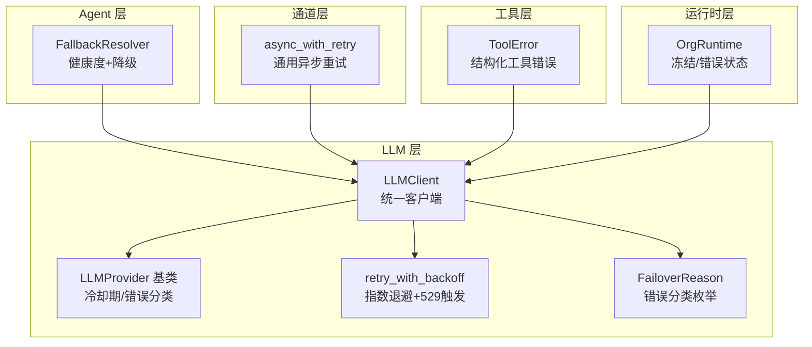
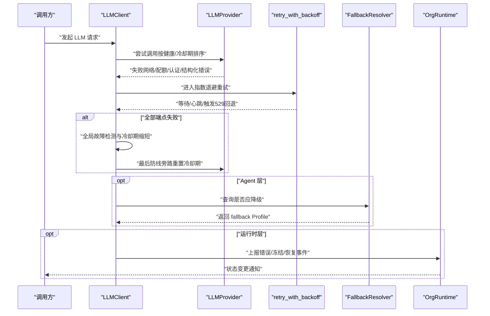
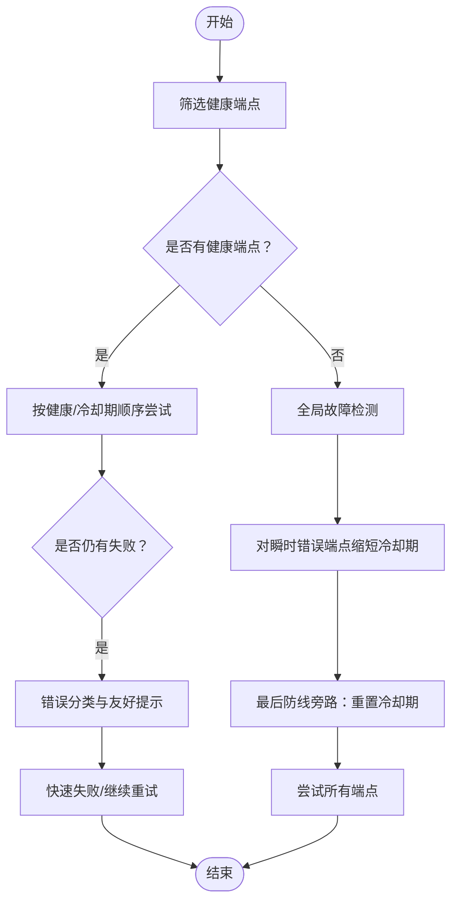
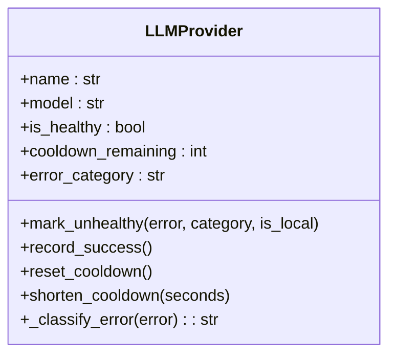
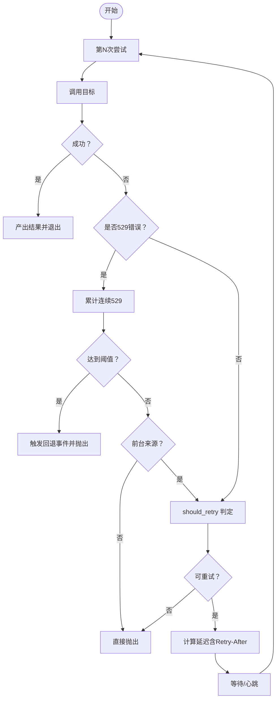
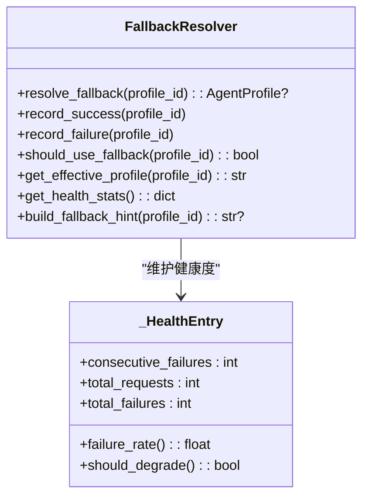
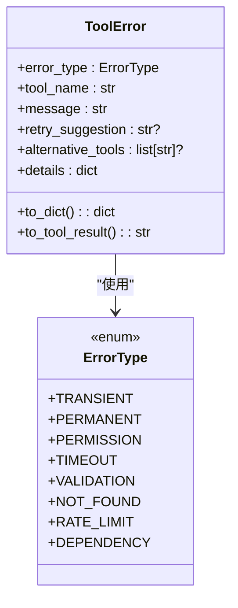
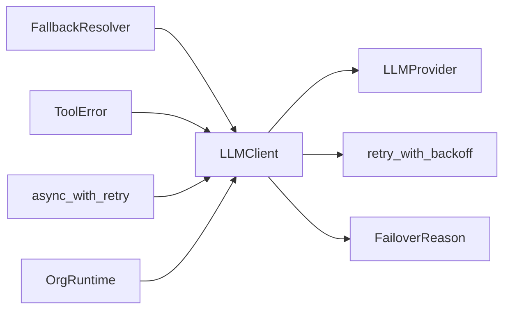

# 失败回退策略

<cite>
**本文档引用的文件**
- [src/synapse/agents/fallback.py](file://src/synapse/agents/fallback.py)
- [src/synapse/llm/retry.py](file://src/synapse/llm/retry.py)
- [src/synapse/llm/providers/base.py](file://src/synapse/llm/providers/base.py)
- [src/synapse/llm/client.py](file://src/synapse/llm/client.py)
- [src/synapse/llm/error_types.py](file://src/synapse/llm/error_types.py)
- [src/synapse/channels/retry.py](file://src/synapse/channels/retry.py)
- [src/synapse/tools/errors.py](file://src/synapse/tools/errors.py)
- [src/synapse/core/errors.py](file://src/synapse/core/errors.py)
- [src/synapse/orgs/runtime.py](file://src/synapse/orgs/runtime.py)
- [src/synapse/llm/providers/proxy_utils.py](file://src/synapse/llm/providers/proxy_utils.py)
</cite>

## 目录
1. [引言](#引言)
2. [项目结构](#项目结构)
3. [核心组件](#核心组件)
4. [架构总览](#架构总览)
5. [详细组件分析](#详细组件分析)
6. [依赖分析](#依赖分析)
7. [性能考虑](#性能考虑)
8. [故障排查指南](#故障排查指南)
9. [结论](#结论)
10. [附录](#附录)

## 引言
本文件系统性阐述本项目的失败回退策略，覆盖失败检测机制、回退触发条件、回退路径选择、多层回退策略、智能重试机制与错误恢复流程。文档聚焦以下关键场景：网络异常、模型调用失败、工具执行错误，并解释与各子系统的集成关系。内容兼顾初学者易懂与资深开发者所需的技术深度。

## 项目结构
围绕“失败回退”的核心代码主要分布在如下模块：
- LLM 层：统一客户端、Provider 基类、重试与退避、错误分类
- 工具层：结构化工具错误与分类
- Agent 层：基于健康度的降级与回退
- 通道层：通用异步重试工具
- 运行时层：节点状态冻结/错误处理与事件上报

图表来源
- [src/synapse/llm/client.py:146-200](file://src/synapse/llm/client.py#L146-L200)
- [src/synapse/llm/providers/base.py:91-137](file://src/synapse/llm/providers/base.py#L91-L137)
- [src/synapse/llm/retry.py:201-274](file://src/synapse/llm/retry.py#L201-L274)
- [src/synapse/llm/error_types.py:13-25](file://src/synapse/llm/error_types.py#L13-L25)
- [src/synapse/tools/errors.py:55-104](file://src/synapse/tools/errors.py#L55-L104)
- [src/synapse/agents/fallback.py:59-117](file://src/synapse/agents/fallback.py#L59-L117)
- [src/synapse/channels/retry.py:57-112](file://src/synapse/channels/retry.py#L57-L112)
- [src/synapse/orgs/runtime.py:823-852](file://src/synapse/orgs/runtime.py#L823-L852)

章节来源
- [src/synapse/llm/client.py:146-200](file://src/synapse/llm/client.py#L146-L200)
- [src/synapse/llm/providers/base.py:91-137](file://src/synapse/llm/providers/base.py#L91-L137)
- [src/synapse/llm/retry.py:201-274](file://src/synapse/llm/retry.py#L201-L274)
- [src/synapse/llm/error_types.py:13-25](file://src/synapse/llm/error_types.py#L13-L25)
- [src/synapse/tools/errors.py:55-104](file://src/synapse/tools/errors.py#L55-L104)
- [src/synapse/agents/fallback.py:59-117](file://src/synapse/agents/fallback.py#L59-L117)
- [src/synapse/channels/retry.py:57-112](file://src/synapse/channels/retry.py#L57-L112)
- [src/synapse/orgs/runtime.py:823-852](file://src/synapse/orgs/runtime.py#L823-L852)

## 核心组件
- LLMClient：统一调度与回退决策，负责多 Provider 轮询、冷却期评估、全局故障检测与“最后防线旁路”。
- LLMProvider 基类：端点健康状态管理、错误分类、渐进式冷却期、重置/缩短冷却期。
- retry_with_backoff：指数退避重试，支持 Retry-After、429/529 区分、持久模式心跳。
- FallbackResolver：基于 Agent 健康度的自动降级与回退策略。
- ToolError：结构化工具错误，便于 LLM 做出重试/换方案/报告用户的决策。
- async_with_retry：通用异步重试工具，适用于 IM 适配器等通道层。
- OrgRuntime：节点状态冻结/错误处理与事件上报，配合回退策略形成闭环。

章节来源
- [src/synapse/llm/client.py:146-200](file://src/synapse/llm/client.py#L146-L200)
- [src/synapse/llm/providers/base.py:91-137](file://src/synapse/llm/providers/base.py#L91-L137)
- [src/synapse/llm/retry.py:201-274](file://src/synapse/llm/retry.py#L201-L274)
- [src/synapse/agents/fallback.py:59-117](file://src/synapse/agents/fallback.py#L59-L117)
- [src/synapse/tools/errors.py:55-104](file://src/synapse/tools/errors.py#L55-L104)
- [src/synapse/channels/retry.py:57-112](file://src/synapse/channels/retry.py#L57-L112)
- [src/synapse/orgs/runtime.py:823-852](file://src/synapse/orgs/runtime.py#L823-L852)

## 架构总览
下图展示了从调用发起到回退决策与恢复的关键交互：

图表来源
- [src/synapse/llm/client.py:899-920](file://src/synapse/llm/client.py#L899-L920)
- [src/synapse/llm/client.py:1453-1482](file://src/synapse/llm/client.py#L1453-L1482)
- [src/synapse/llm/retry.py:201-274](file://src/synapse/llm/retry.py#L201-L274)
- [src/synapse/agents/fallback.py:59-117](file://src/synapse/agents/fallback.py#L59-L117)
- [src/synapse/orgs/runtime.py:823-852](file://src/synapse/orgs/runtime.py#L823-L852)

## 详细组件分析

### LLMClient：多层回退与全局故障检测
- 多 Provider 轮询：按健康状态与冷却期排序，优先尝试健康的端点。
- 错误分类与提示：根据失败端点的错误类别生成用户友好提示。
- 全局故障检测：当多数端点失败且以瞬时错误为主，缩短它们的冷却期，提升恢复概率。
- “最后防线旁路”：当没有健康目标时，绕过冷静期尝试所有端点，对齐 Portkey 设计。
- 回退路径选择：结合错误类别（配额/认证/结构化/瞬时/未知）与冷却期，决定是否快速失败或继续尝试。

图表来源
- [src/synapse/llm/client.py:899-920](file://src/synapse/llm/client.py#L899-L920)
- [src/synapse/llm/client.py:1453-1482](file://src/synapse/llm/client.py#L1453-L1482)

章节来源
- [src/synapse/llm/client.py:899-920](file://src/synapse/llm/client.py#L899-L920)
- [src/synapse/llm/client.py:1453-1482](file://src/synapse/llm/client.py#L1453-L1482)

### LLMProvider 基类：健康度与冷却期
- 健康状态：基于冷却期结束时间与最近一次错误自动刷新。
- 错误分类：quota/auth/structural/transient/unknown，优先级决定冷却时长。
- 渐进式冷却期：连续非结构性错误按步进序列延长冷却，上限保护。
- 本地端点特殊处理：本地 transient 错误不参与渐进升级。
- 冷却期缩短与重置：支持全局故障时缩短冷却期，或“最后防线旁路”重置冷却期。

图表来源
- [src/synapse/llm/providers/base.py:91-137](file://src/synapse/llm/providers/base.py#L91-L137)
- [src/synapse/llm/providers/base.py:167-262](file://src/synapse/llm/providers/base.py#L167-L262)
- [src/synapse/llm/providers/base.py:308-323](file://src/synapse/llm/providers/base.py#L308-L323)
- [src/synapse/llm/providers/base.py:324-405](file://src/synapse/llm/providers/base.py#L324-L405)

章节来源
- [src/synapse/llm/providers/base.py:91-137](file://src/synapse/llm/providers/base.py#L91-L137)
- [src/synapse/llm/providers/base.py:167-262](file://src/synapse/llm/providers/base.py#L167-L262)
- [src/synapse/llm/providers/base.py:308-323](file://src/synapse/llm/providers/base.py#L308-L323)
- [src/synapse/llm/providers/base.py:324-405](file://src/synapse/llm/providers/base.py#L324-L405)

### 智能重试与退避：retry_with_backoff
- 指数退避：基础延迟随尝试次数指数增长，上限保护，加入抖动。
- Retry-After 优先：若异常携带 Retry-After，则直接使用。
- 429/529 区分：连续 529 触发回退事件，前台来源限制 529 触发。
- 持久模式：长等待时输出心跳事件，便于 UI/日志感知。
- 上下文状态：记录连续 529 次数、总尝试次数、最后错误等。

图表来源
- [src/synapse/llm/retry.py:201-274](file://src/synapse/llm/retry.py#L201-L274)

章节来源
- [src/synapse/llm/retry.py:201-274](file://src/synapse/llm/retry.py#L201-L274)

### Agent 层回退：健康度与自动降级
- 失败窗口与阈值：5 分钟窗口内连续失败达到阈值即降级。
- 健康度指标：总请求数、失败数、连续失败数、失败率。
- 降级与回退：降级后自动切换到 fallback Profile，恢复后自动取消降级。
- 建议提示：为用户生成回退建议文案。

图表来源
- [src/synapse/agents/fallback.py:59-117](file://src/synapse/agents/fallback.py#L59-L117)
- [src/synapse/agents/fallback.py:25-57](file://src/synapse/agents/fallback.py#L25-L57)

章节来源
- [src/synapse/agents/fallback.py:59-117](file://src/synapse/agents/fallback.py#L59-L117)
- [src/synapse/agents/fallback.py:25-57](file://src/synapse/agents/fallback.py#L25-L57)

### 工具执行错误：结构化分类与回退
- 错误类型：transient、permanent、permission、timeout、validation、not_found、rate_limit、dependency。
- 自动分类：根据异常类型与消息关键字自动映射到结构化错误。
- 工具结果：序列化为 JSON，包含错误类型、提示、重试建议、替代工具等，便于 LLM 决策。

图表来源
- [src/synapse/tools/errors.py:29-52](file://src/synapse/tools/errors.py#L29-L52)
- [src/synapse/tools/errors.py:55-104](file://src/synapse/tools/errors.py#L55-L104)
- [src/synapse/tools/errors.py:107-201](file://src/synapse/tools/errors.py#L107-L201)

章节来源
- [src/synapse/tools/errors.py:29-52](file://src/synapse/tools/errors.py#L29-L52)
- [src/synapse/tools/errors.py:55-104](file://src/synapse/tools/errors.py#L55-L104)
- [src/synapse/tools/errors.py:107-201](file://src/synapse/tools/errors.py#L107-L201)

### 通道层重试：通用异步重试工具
- 默认重试判定：超时/连接错误/5xx/429 等。
- Retry-After 解析：从 429 响应头提取等待秒数。
- 指数退避与抖动：首次延迟、最大延迟、退避因子可配置。
- 操作命名：日志中标识操作名称，便于追踪。

章节来源
- [src/synapse/channels/retry.py:57-112](file://src/synapse/channels/retry.py#L57-L112)

### 运行时层：节点冻结/错误与事件上报
- 冻结与错误：连续失败触发节点冻结，异常情况下标记错误状态。
- 事件上报：广播节点状态变化，记录任务失败事件。
- 保存状态：确保状态持久化与一致性。

章节来源
- [src/synapse/orgs/runtime.py:823-852](file://src/synapse/orgs/runtime.py#L823-L852)

## 依赖分析
- LLMClient 依赖 LLMProvider 健康状态与错误分类，依赖 retry_with_backoff 实现智能重试。
- FallbackResolver 与 Agent Profile Store 协作，决定回退目标。
- ToolError 作为工具层统一错误契约，向上游 LLM 决策提供结构化信息。
- Channels 层的 async_with_retry 与 LLM 层 retry_with_backoff 设计理念一致，但适用范围不同。
- OrgRuntime 与 LLMClient 协同，形成“失败→冻结/错误→事件上报→恢复”的闭环。

图表来源
- [src/synapse/llm/client.py:146-200](file://src/synapse/llm/client.py#L146-L200)
- [src/synapse/llm/providers/base.py:91-137](file://src/synapse/llm/providers/base.py#L91-L137)
- [src/synapse/llm/retry.py:201-274](file://src/synapse/llm/retry.py#L201-L274)
- [src/synapse/llm/error_types.py:13-25](file://src/synapse/llm/error_types.py#L13-L25)
- [src/synapse/agents/fallback.py:59-117](file://src/synapse/agents/fallback.py#L59-L117)
- [src/synapse/tools/errors.py:55-104](file://src/synapse/tools/errors.py#L55-L104)
- [src/synapse/channels/retry.py:57-112](file://src/synapse/channels/retry.py#L57-L112)
- [src/synapse/orgs/runtime.py:823-852](file://src/synapse/orgs/runtime.py#L823-L852)

章节来源
- [src/synapse/llm/client.py:146-200](file://src/synapse/llm/client.py#L146-L200)
- [src/synapse/llm/providers/base.py:91-137](file://src/synapse/llm/providers/base.py#L91-L137)
- [src/synapse/llm/retry.py:201-274](file://src/synapse/llm/retry.py#L201-L274)
- [src/synapse/llm/error_types.py:13-25](file://src/synapse/llm/error_types.py#L13-L25)
- [src/synapse/agents/fallback.py:59-117](file://src/synapse/agents/fallback.py#L59-L117)
- [src/synapse/tools/errors.py:55-104](file://src/synapse/tools/errors.py#L55-L104)
- [src/synapse/channels/retry.py:57-112](file://src/synapse/channels/retry.py#L57-L112)
- [src/synapse/orgs/runtime.py:823-852](file://src/synapse/orgs/runtime.py#L823-L852)

## 性能考虑
- 指数退避上限与抖动：避免雪崩效应，平衡恢复速度与系统压力。
- Retry-After 优先：尊重上游限流策略，减少无效重试。
- 冷静期与渐进式退避：对持续失败的端点施加保护，防止连锁故障。
- 全局故障检测与冷却期缩短：在大规模瞬时错误时加速恢复。
- 并发控制：LLMClient 全局信号量限制并发，避免 event loop 被打爆。
- 本地端点特殊处理：避免对本地瞬时错误进行过度惩罚。

## 故障排查指南
- 网络异常/超时
  - 检查 retry_with_backoff 是否正确解析 Retry-After。
  - 观察 Provider 冷静期是否过长，必要时使用“最后防线旁路”重置冷却期。
  - 参考路径：[src/synapse/llm/retry.py:201-274](file://src/synapse/llm/retry.py#L201-L274)、[src/synapse/llm/providers/base.py:308-323](file://src/synapse/llm/providers/base.py#L308-L323)
- 模型调用失败（配额/认证/结构化）
  - 通过 LLMClient 的错误分类与友好提示定位问题类型。
  - 若全部端点失败且为配额/认证，快速失败；若是结构化错误，建议切换模型或修正请求。
  - 参考路径：[src/synapse/llm/client.py:54-83](file://src/synapse/llm/client.py#L54-L83)、[src/synapse/llm/providers/base.py:324-405](file://src/synapse/llm/providers/base.py#L324-L405)
- 工具执行错误
  - 使用 ToolError 的自动分类，结合重试建议与替代工具。
  - 对依赖缺失、权限不足、参数校验失败等进行针对性修复。
  - 参考路径：[src/synapse/tools/errors.py:107-201](file://src/synapse/tools/errors.py#L107-L201)
- Agent 回退
  - 检查 FallbackResolver 的健康度统计与降级阈值，确认 fallback Profile 配置。
  - 参考路径：[src/synapse/agents/fallback.py:59-117](file://src/synapse/agents/fallback.py#L59-L117)
- 通道层重试
  - 确认 default_should_retry 的判定逻辑是否覆盖目标平台的错误码。
  - 参考路径：[src/synapse/channels/retry.py:21-38](file://src/synapse/channels/retry.py#L21-L38)
- 运行时状态
  - 节点冻结/错误状态由 OrgRuntime 维护，关注事件上报与状态保存。
  - 参考路径：[src/synapse/orgs/runtime.py:823-852](file://src/synapse/orgs/runtime.py#L823-L852)
- 异常链提取
  - 对底层连接错误进行异常链遍历，提取真实错误信息。
  - 参考路径：[src/synapse/llm/providers/proxy_utils.py:333-362](file://src/synapse/llm/providers/proxy_utils.py#L333-L362)

章节来源
- [src/synapse/llm/retry.py:201-274](file://src/synapse/llm/retry.py#L201-L274)
- [src/synapse/llm/providers/base.py:308-323](file://src/synapse/llm/providers/base.py#L308-L323)
- [src/synapse/llm/client.py:54-83](file://src/synapse/llm/client.py#L54-L83)
- [src/synapse/llm/providers/base.py:324-405](file://src/synapse/llm/providers/base.py#L324-L405)
- [src/synapse/tools/errors.py:107-201](file://src/synapse/tools/errors.py#L107-L201)
- [src/synapse/agents/fallback.py:59-117](file://src/synapse/agents/fallback.py#L59-L117)
- [src/synapse/channels/retry.py:21-38](file://src/synapse/channels/retry.py#L21-L38)
- [src/synapse/orgs/runtime.py:823-852](file://src/synapse/orgs/runtime.py#L823-L852)
- [src/synapse/llm/providers/proxy_utils.py:333-362](file://src/synapse/llm/providers/proxy_utils.py#L333-L362)

## 结论
本项目的失败回退策略通过“健康度/冷却期 + 错误分类 + 智能重试 + 多层回退 + 全局故障检测 + 自动降级”的组合拳，实现了对网络异常、模型调用失败与工具执行错误的稳健应对。LLMClient 作为中枢协调各组件，Agent 层与运行时层提供闭环反馈，确保系统在复杂故障场景下仍能快速恢复与持续服务。

## 附录
- 配置与参数（节选）
  - 重试与退避
    - 基础延迟、最大延迟、抖动因子、最大重试次数、连续 529 回退阈值、持久模式心跳间隔
    - 参考路径：[src/synapse/llm/retry.py:23-33](file://src/synapse/llm/retry.py#L23-L33)
  - Provider 冷静期与时长
    - 认证/配额/结构性/瞬时/默认/全局故障冷却时长、渐进式退避步进序列
    - 参考路径：[src/synapse/llm/providers/base.py:72-88](file://src/synapse/llm/providers/base.py#L72-L88)
  - 工具错误类型
    - transient、permanent、permission、timeout、validation、not_found、rate_limit、dependency
    - 参考路径：[src/synapse/tools/errors.py:29-52](file://src/synapse/tools/errors.py#L29-L52)
  - Agent 回退阈值与窗口
    - 连续失败阈值、失败窗口秒数
    - 参考路径：[src/synapse/agents/fallback.py:21-22](file://src/synapse/agents/fallback.py#L21-L22)
  - 通道层重试
    - 最大重试次数、首次延迟、最大延迟、退避因子、操作名称
    - 参考路径：[src/synapse/channels/retry.py:60-66](file://src/synapse/channels/retry.py#L60-L66)