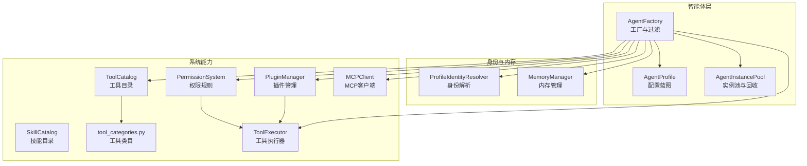
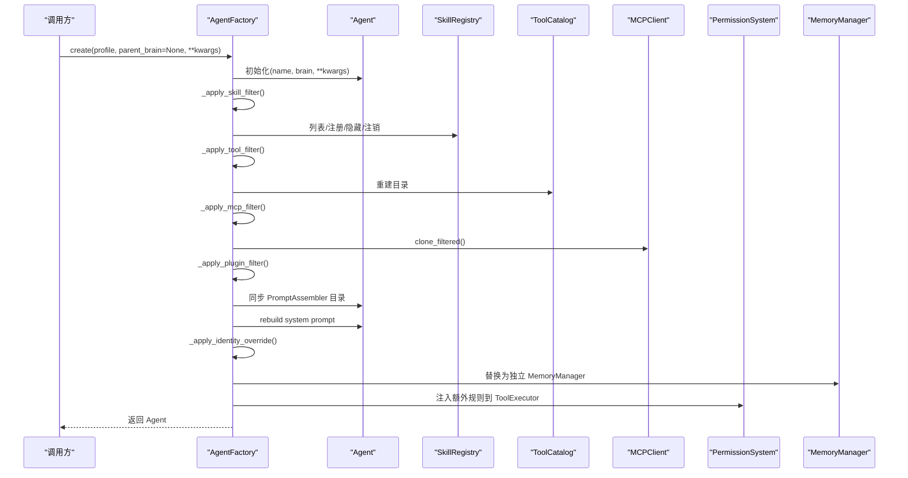
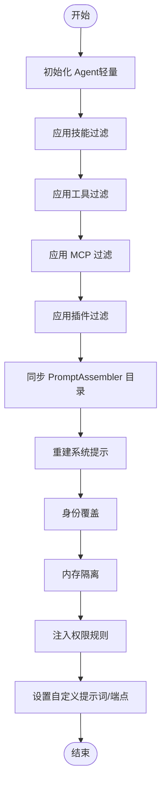
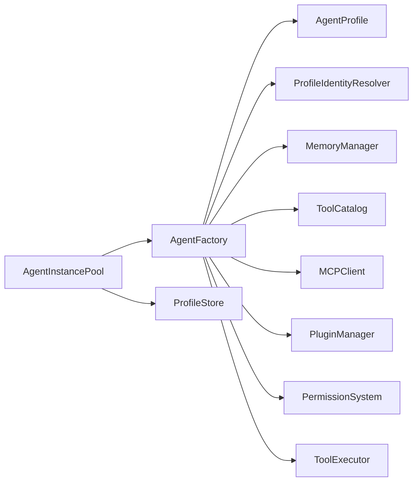

# 智能体工厂

<cite>
**本文引用的文件**
- [factory.py](file://src/synapse/agents/factory.py)
- [profile.py](file://src/synapse/agents/profile.py)
- [identity_resolver.py](file://src/synapse/agents/identity_resolver.py)
- [tool_categories.py](file://src/synapse/orgs/tool_categories.py)
- [catalog.py](file://src/synapse/tools/catalog.py)
- [mcp.py](file://src/synapse/tools/mcp.py)
- [permission.py](file://src/synapse/core/permission.py)
- [manager.py](file://src/synapse/plugins/manager.py)
- [tool_executor.py](file://src/synapse/core/tool_executor.py)
</cite>

## 目录
1. [简介](#简介)
2. [项目结构](#项目结构)
3. [核心组件](#核心组件)
4. [架构总览](#架构总览)
5. [详细组件分析](#详细组件分析)
6. [依赖分析](#依赖分析)
7. [性能考虑](#性能考虑)
8. [故障排查指南](#故障排查指南)
9. [结论](#结论)
10. [附录](#附录)

## 简介
本文件面向“智能体工厂”（AgentFactory）的实现进行系统化技术文档编写，重点解释：
- 如何基于 AgentProfile 创建差异化 Agent 实例
- 技能过滤器、工具过滤器、MCP 过滤器的工作原理
- 身份覆盖、内存隔离、权限规则注入等能力的实现细节
- 与系统其他组件（技能、工具、插件、权限、MCP、内存）的关系
- 常见问题与排障建议
- 配置选项与参数说明

目标是帮助初学者理解概念，同时为有经验的开发者提供足够的技术深度。

## 项目结构
围绕智能体工厂的关键文件与职责如下：
- 智能体工厂与实例池：负责按 Profile 构建 Agent、应用过滤与隔离、注入提示词与权限规则，并管理实例生命周期
- AgentProfile：描述智能体的类型、技能、工具、MCP、插件、权限规则、身份与内存隔离策略等
- 身份解析器：按 Profile 与全局目录解析身份文件，支持独立与继承两种模式
- 工具目录：管理工具清单与分级披露，支撑技能过滤后的 Catalog 生成
- 工具类目：将工具按功能域分组，支持混合类目与工具名的展开
- MCP 客户端：连接 MCP 服务器，提供工具、资源与提示词发现
- 权限系统：提供规则集、模式规则、策略引擎集成与统一决策
- 插件管理器：加载/卸载插件，暴露工具/钩子/通道等扩展能力
- 工具执行器：执行工具调用、并行/串行策略、互斥锁、截断守卫与错误处理

图表来源
- [factory.py:116-208](file://src/synapse/agents/factory.py#L116-L208)
- [profile.py:92-170](file://src/synapse/agents/profile.py#L92-L170)
- [identity_resolver.py:51-99](file://src/synapse/agents/identity_resolver.py#L51-L99)
- [catalog.py:66-122](file://src/synapse/tools/catalog.py#L66-L122)
- [tool_categories.py:10-25](file://src/synapse/orgs/tool_categories.py#L10-L25)
- [mcp.py:244-372](file://src/synapse/tools/mcp.py#L244-L372)
- [permission.py:103-124](file://src/synapse/core/permission.py#L103-L124)
- [manager.py:44-94](file://src/synapse/plugins/manager.py#L44-L94)
- [tool_executor.py:120-170](file://src/synapse/core/tool_executor.py#L120-L170)

章节来源
- [factory.py:116-208](file://src/synapse/agents/factory.py#L116-L208)
- [profile.py:92-170](file://src/synapse/agents/profile.py#L92-L170)

## 核心组件
- AgentFactory：根据 AgentProfile 应用技能/工具/MCP/插件过滤，注入身份与内存隔离，设置自定义提示词与首选端点，最终生成差异化 Agent 实例
- AgentInstancePool：按会话+Profile 维度的实例池，支持空闲回收、并发创建锁、技能版本变更触发重建
- AgentProfile：定义智能体的类型、技能模式、工具模式、MCP 模式、插件模式、权限规则、身份与内存隔离策略等
- ProfileIdentityResolver：解析 Profile 专属身份文件，支持独立文件与全局回退
- MemoryManager：可替换为独立实例，支持全局记忆继承与外部检索源
- ToolCatalog：生成工具清单与分级披露，支持高频工具直注入与延迟工具标注
- MCPClient：连接 MCP 服务器，发现工具/资源/提示词，支持多种传输协议
- PluginManager：加载/卸载插件，暴露工具/钩子/通道等扩展能力
- PermissionSystem：规则集、模式规则、策略引擎集成与统一决策
- ToolExecutor：工具执行引擎，支持并行/串行、互斥锁、截断守卫与错误处理

章节来源
- [factory.py:116-208](file://src/synapse/agents/factory.py#L116-L208)
- [factory.py:474-624](file://src/synapse/agents/factory.py#L474-L624)
- [profile.py:92-170](file://src/synapse/agents/profile.py#L92-L170)
- [identity_resolver.py:51-99](file://src/synapse/agents/identity_resolver.py#L51-L99)
- [catalog.py:66-122](file://src/synapse/tools/catalog.py#L66-L122)
- [mcp.py:244-372](file://src/synapse/tools/mcp.py#L244-L372)
- [manager.py:44-94](file://src/synapse/plugins/manager.py#L44-L94)
- [permission.py:103-124](file://src/synapse/core/permission.py#L103-L124)
- [tool_executor.py:120-170](file://src/synapse/core/tool_executor.py#L120-L170)

## 架构总览
智能体工厂在创建 Agent 时，按以下流程应用配置与能力：
- 初始化 Agent，轻量初始化与调度器关闭
- 应用技能过滤：INCLUSIVE/EXCLUSIVE/ALL 模式，保留基础设施技能
- 应用工具过滤：按类目与工具名展开，支持 INCLUSIVE/EXCLUSIVE
- 应用 MCP 过滤：克隆目录，限制可访问服务器
- 应用插件过滤：按模式卸载不应保留的插件
- 同步 PromptAssembler 目录引用，重建系统提示
- 身份覆盖：按 Profile 专属目录与全局目录解析身份文件
- 内存隔离：替换为独立 MemoryManager，可选继承全局记忆
- 权限规则注入：从配置构建规则集，注入到 ToolExecutor
- 设置自定义提示词与首选端点

图表来源
- [factory.py:125-208](file://src/synapse/agents/factory.py#L125-L208)
- [factory.py:246-449](file://src/synapse/agents/factory.py#L246-L449)
- [permission.py:189-206](file://src/synapse/core/permission.py#L189-L206)
- [tool_executor.py:168-169](file://src/synapse/core/tool_executor.py#L168-L169)

章节来源
- [factory.py:125-208](file://src/synapse/agents/factory.py#L125-L208)

## 详细组件分析

### AgentFactory：差异化 Agent 实例创建
- 轻量初始化与调度器关闭，避免不必要的资源占用
- 技能过滤：
  - INCLUSIVE：仅保留显式列出的技能，隐藏未列技能；对被禁用但显式选择的技能进行解禁
  - EXCLUSIVE：移除黑名单技能；保留基础设施技能
  - 基础设施技能集合固定，保证系统能力可用
- 工具过滤：
  - 支持类目与工具名混合；INCLUSIVE 保留基础设施工具；EXCLUSIVE 移除指定工具
  - 重建 ToolCatalog 并排序，确保稳定输出
- MCP 过滤：
  - 通过 clone_filtered 限制 Agent 可见的 MCP 服务器集合
- 插件过滤：
  - INCLUSIVE/EXCLUSIVE 模式卸载不应保留的插件，清理其钩子/工具/通道
- PromptAssembler 同步与系统提示重建：
  - 更新目录引用，按模式重建系统提示，确保 LLM 看到正确的披露范围
- 身份覆盖：
  - 解析 Profile 专属身份文件，覆盖 Agent.identity，并重建系统提示
- 内存隔离：
  - 替换为独立 MemoryManager，支持继承全局记忆与外部检索源
- 权限规则注入：
  - 从 Profile 构建规则集，注入到 ToolExecutor 的 _extra_permission_rules
- 自定义提示词与首选端点：
  - 设置自定义提示词后缀与首选 LLM 端点

图表来源
- [factory.py:125-208](file://src/synapse/agents/factory.py#L125-L208)
- [factory.py:246-449](file://src/synapse/agents/factory.py#L246-L449)

章节来源
- [factory.py:125-208](file://src/synapse/agents/factory.py#L125-L208)
- [factory.py:246-449](file://src/synapse/agents/factory.py#L246-L449)

### AgentProfile：配置蓝图与隔离策略
- 类型与角色：系统/自定义/动态，worker/coordinator
- 技能配置：skills、skills_mode（INCLUSIVE/EXCLUSIVE/ALL）
- 工具控制：tools、tools_mode（all/inclusive/exclusive）
- MCP 控制：mcp_servers、mcp_mode（all/inclusive/exclusive）
- 插件控制：plugins、plugins_mode（all/inclusive/exclusive）
- 自定义提示词与显示：custom_prompt、icon/color
- 能力边界：fallback_profile_id、preferred_endpoint
- 权限规则：permission_rules（OpenCode 风格）
- 隔离配置：identity_mode（shared/custom）、memory_mode（shared/isolated）、memory_inherit_global、user_profile_content
- 执行约束：max_turns、background、omit_system_context、timeout_seconds

章节来源
- [profile.py:92-170](file://src/synapse/agents/profile.py#L92-L170)

### ProfileIdentityResolver：身份文件解析与继承
- 独立文件：USER.md、MEMORY.md 始终来自 Profile 目录
- 继承文件：SOUL.md、AGENT.md 若 Profile 目录为空则回退到全局目录
- 构建 Identity：使用解析后的路径构造 Identity 实例

章节来源
- [identity_resolver.py:51-99](file://src/synapse/agents/identity_resolver.py#L51-L99)

### 工具目录与类目：渐进式披露与展开
- ToolCatalog：
  - 生成工具清单（分级披露 Level 1/2），支持高频工具直注入
  - 分类展示顺序与显示名映射，支持延迟工具标注
- tool_categories：
  - 工具类目定义与角色预设，支持混合类目与工具名展开

章节来源
- [catalog.py:66-122](file://src/synapse/tools/catalog.py#L66-L122)
- [catalog.py:183-382](file://src/synapse/tools/catalog.py#L183-L382)
- [tool_categories.py:10-25](file://src/synapse/orgs/tool_categories.py#L10-L25)
- [tool_categories.py:51-67](file://src/synapse/orgs/tool_categories.py#L51-L67)

### MCP 客户端：连接与能力发现
- 支持 stdio/streamable_http/SSE 三种传输协议
- 发现工具/资源/提示词，连接超时与错误处理
- 断开连接时的安全清理，避免 anyio 跨任务异常

章节来源
- [mcp.py:244-372](file://src/synapse/tools/mcp.py#L244-L372)
- [mcp.py:688-790](file://src/synapse/tools/mcp.py#L688-L790)

### 权限系统：规则集与统一决策
- 规则集构建：from_config 支持 OpenCode 风格
- 模式规则：plan/ask/coordinator 模式下的工具可用性
- 策略引擎：PolicyEngine 集成，fail-closed/fail-open 策略
- 统一决策：check_permission 统一路由至模式规则与策略引擎

章节来源
- [permission.py:189-206](file://src/synapse/core/permission.py#L189-L206)
- [permission.py:248-331](file://src/synapse/core/permission.py#L248-L331)
- [permission.py:334-380](file://src/synapse/core/permission.py#L334-L380)

### 插件管理器：加载/卸载与扩展
- 依赖拓扑排序、兼容性检查、冲突检测
- 加载/卸载超时、错误累积与自动禁用
- 暴露工具/钩子/通道等扩展能力，支持 MCP/技能插件

章节来源
- [manager.py:44-94](file://src/synapse/plugins/manager.py#L44-L94)
- [manager.py:165-247](file://src/synapse/plugins/manager.py#L165-L247)
- [manager.py:573-600](file://src/synapse/plugins/manager.py#L573-L600)

### 工具执行器：并行/串行与互斥锁
- 并行/串行策略：根据配置与中断检查决定
- 互斥锁：browser/desktop/mcp handler 默认互斥
- 截断守卫：通用输出截断与溢出文件保存
- 错误处理：结构化 ToolError 与 ToolSkipped

章节来源
- [tool_executor.py:120-170](file://src/synapse/core/tool_executor.py#L120-L170)
- [tool_executor.py:372-406](file://src/synapse/core/tool_executor.py#L372-L406)
- [tool_executor.py:538-800](file://src/synapse/core/tool_executor.py#L538-L800)

## 依赖分析
- AgentFactory 依赖：
  - 技能/工具/MCP/插件/权限/身份/内存等模块
  - 通过 Profile 的 skills_mode/tools_mode/mcp_mode/plugins_mode 控制差异
- AgentInstancePool 依赖：
  - AgentFactory（创建）、ProfileStore（清理临时 Profile）、异步锁（并发创建）
  - 空闲回收与技能版本变更触发重建

图表来源
- [factory.py:125-208](file://src/synapse/agents/factory.py#L125-L208)
- [factory.py:474-624](file://src/synapse/agents/factory.py#L474-L624)
- [profile.py:250-269](file://src/synapse/agents/profile.py#L250-L269)

章节来源
- [factory.py:474-624](file://src/synapse/agents/factory.py#L474-L624)

## 性能考虑
- 实例池空闲回收：默认 30 分钟空闲回收，每分钟检查一次，避免内存泄漏
- 技能版本变更：全局技能变更递增版本号，池中旧实例在下次使用时重建，确保一致性
- 工具过滤后重建目录：减少系统提示冗余，提升 Token 效率
- MCP 过滤：限制服务器集合，降低连接与发现成本
- 工具执行器并行策略：默认串行，高风险工具可启用沙箱与确认流程，避免阻塞

章节来源
- [factory.py:23-24](file://src/synapse/agents/factory.py#L23-L24)
- [factory.py:531-534](file://src/synapse/agents/factory.py#L531-L534)
- [factory.py:702-754](file://src/synapse/agents/factory.py#L702-L754)
- [tool_executor.py:571-577](file://src/synapse/core/tool_executor.py#L571-L577)

## 故障排查指南
- 工具执行被拒绝：
  - 检查 AgentProfile.permission_rules 与模式规则（plan/ask/coordinator）
  - 确认策略引擎可用性与 fail-closed/fail-open 行为
- 工具不可见或被隐藏：
  - 检查 skills_mode 与工具类目展开；INCLUSIVE 模式下隐藏未列技能
  - 确认 ToolCatalog 缓存是否失效并重建
- MCP 工具不可用：
  - 检查 mcp_mode 与 mcp_servers；确认 MCPClient 连接状态与超时
- 身份覆盖无效：
  - 确认 Profile 专属身份目录存在 USER.md/MEMORY.md；检查解析路径
- 内存隔离异常：
  - 确认 memory_mode/isolated 与 memory_inherit_global；检查独立 MemoryManager 初始化
- 插件卸载失败：
  - 查看插件管理器日志与超时；确认插件导出接口与依赖关系

章节来源
- [permission.py:248-331](file://src/synapse/core/permission.py#L248-L331)
- [catalog.py:585-587](file://src/synapse/tools/catalog.py#L585-L587)
- [mcp.py:314-372](file://src/synapse/tools/mcp.py#L314-L372)
- [identity_resolver.py:74-99](file://src/synapse/agents/identity_resolver.py#L74-L99)
- [factory.py:382-421](file://src/synapse/agents/factory.py#L382-L421)
- [manager.py:573-600](file://src/synapse/plugins/manager.py#L573-L600)

## 结论
智能体工厂通过 Profile 驱动的过滤与隔离机制，实现了高度可配置的差异化 Agent 实例创建。结合技能/工具/MCP/插件/权限/身份/内存等能力，既能满足复杂场景的精细化控制，又保持了良好的可维护性与可扩展性。配合实例池与版本化重建策略，进一步提升了系统的稳定性与一致性。

## 附录

### 配置选项与参数说明（节选）
- AgentProfile 关键字段
  - skills/skills_mode：技能列表与模式（INCLUSIVE/EXCLUSIVE/ALL）
  - tools/tools_mode：工具类目/工具名与模式（all/inclusive/exclusive）
  - mcp_servers/mcp_mode：MCP 服务器列表与模式（all/inclusive/exclusive）
  - plugins/plugins_mode：插件 ID 列表与模式（all/inclusive/exclusive）
  - custom_prompt：自定义提示词后缀
  - preferred_endpoint：首选 LLM 端点
  - permission_rules：权限规则集（OpenCode 风格）
  - identity_mode/memory_mode/memory_inherit_global：身份与内存隔离策略
- AgentFactory 过滤与注入
  - 技能过滤：INCLUSIVE 保留显式技能并解禁；EXCLUSIVE 移除黑名单技能
  - 工具过滤：类目展开；INCLUSIVE 保留基础设施工具；EXCLUSIVE 移除指定工具
  - MCP 过滤：clone_filtered 限制服务器集合
  - 插件过滤：卸载不应保留的插件
  - 身份覆盖：Profile 专属身份文件解析与覆盖
  - 内存隔离：独立 MemoryManager，可选继承全局记忆
  - 权限规则注入：from_config 构建规则集，注入 ToolExecutor
  - 自定义提示词与端点：设置后缀与首选端点

章节来源
- [profile.py:92-170](file://src/synapse/agents/profile.py#L92-L170)
- [factory.py:125-208](file://src/synapse/agents/factory.py#L125-L208)
- [factory.py:246-449](file://src/synapse/agents/factory.py#L246-L449)
- [permission.py:189-206](file://src/synapse/core/permission.py#L189-L206)
- [tool_executor.py:168-169](file://src/synapse/core/tool_executor.py#L168-L169)