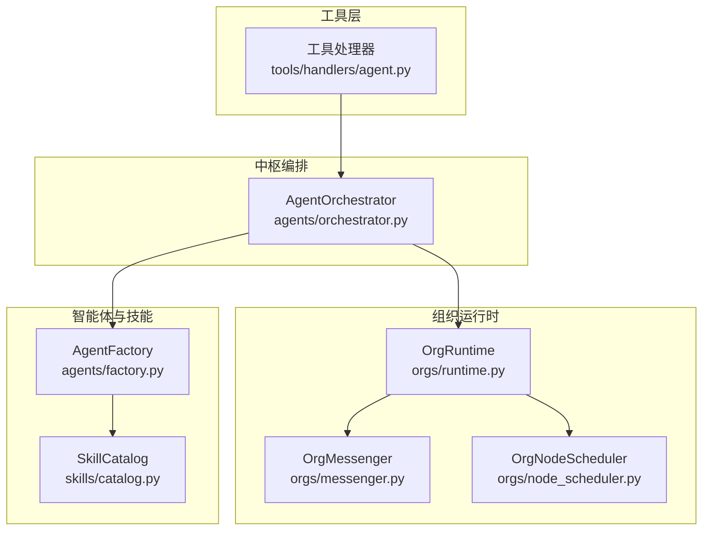
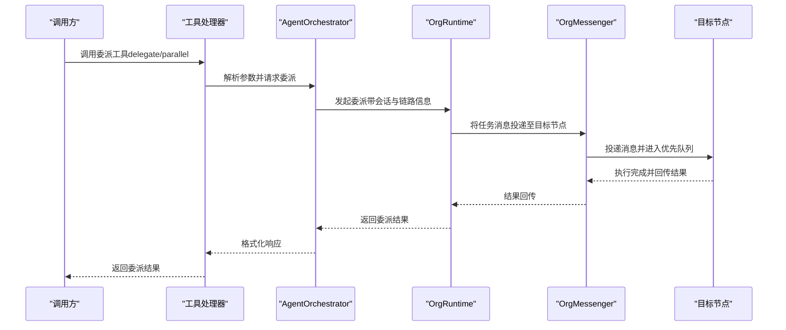
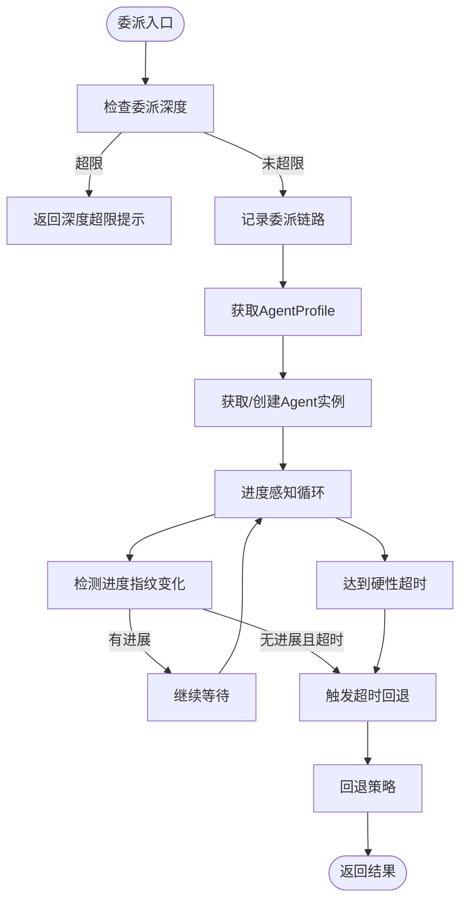
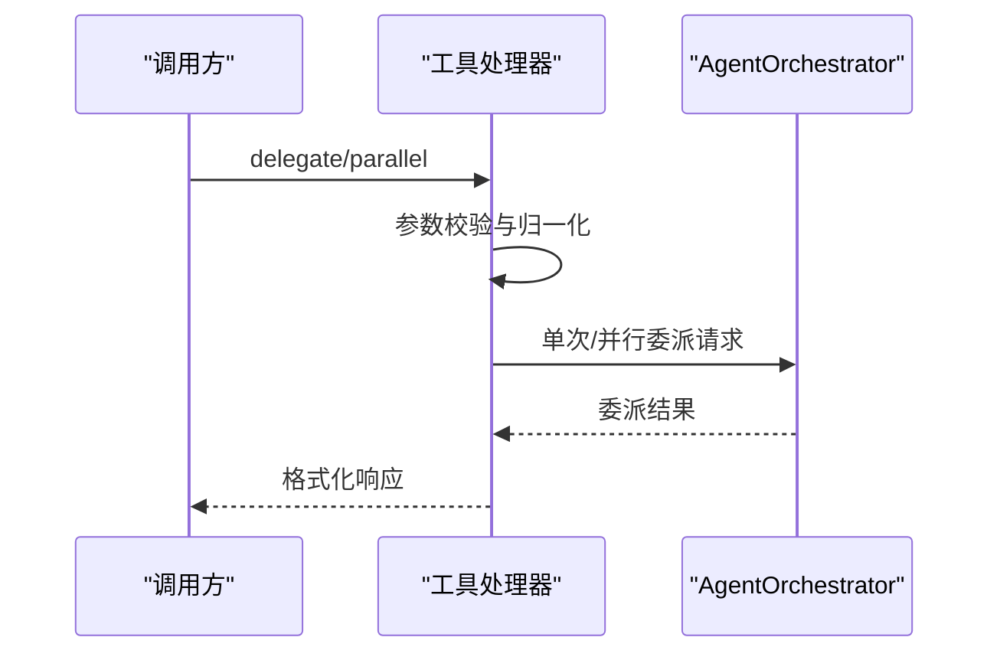
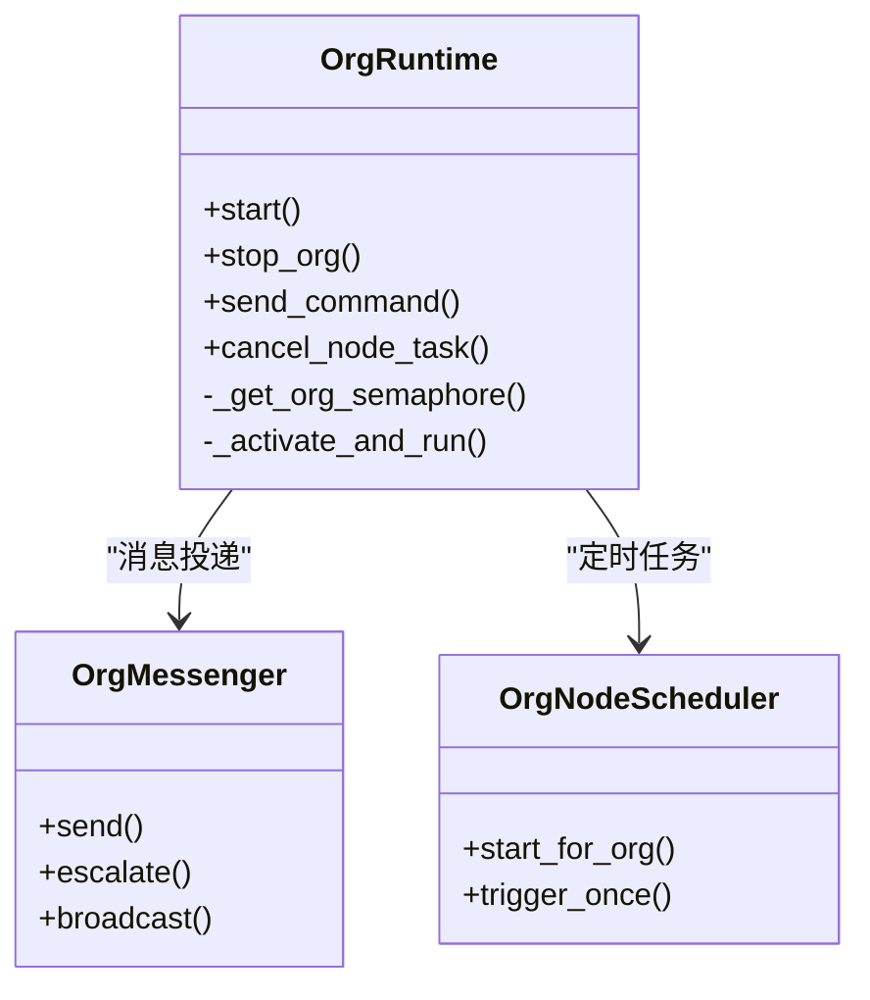
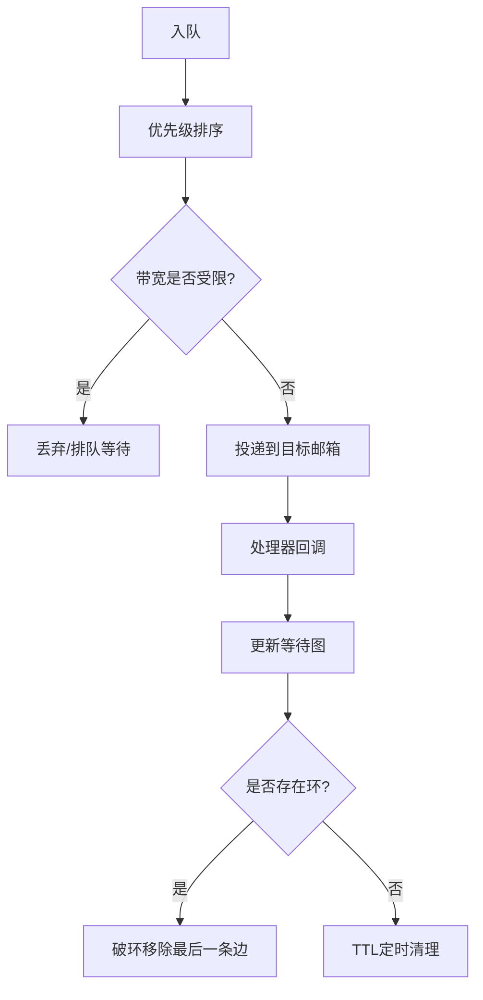
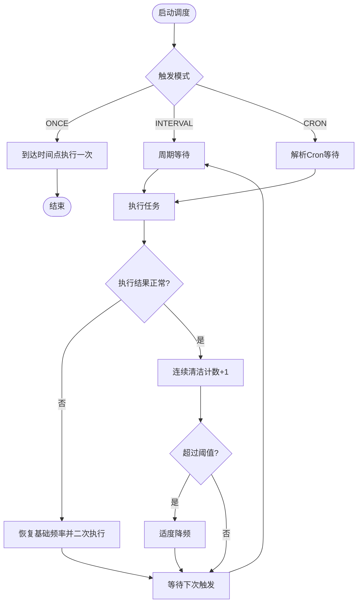
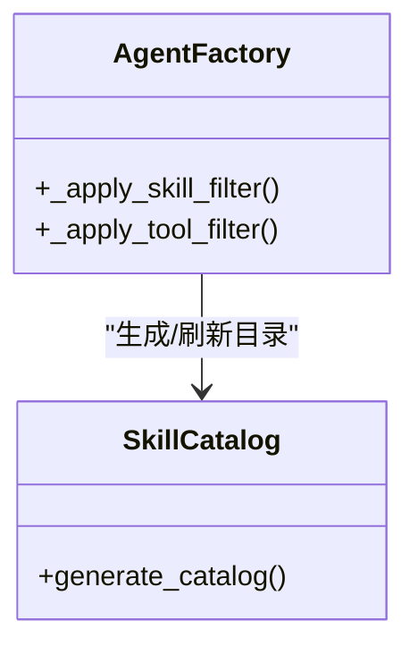
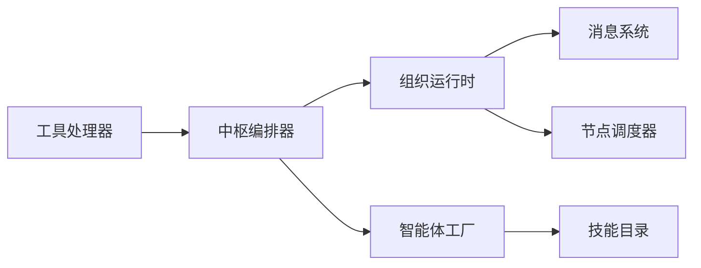

# 自动委派机制

<cite>
**本文引用的文件**
- [src/synapse/agents/orchestrator.py](file://src/synapse/agents/orchestrator.py)
- [src/synapse/tools/handlers/agent.py](file://src/synapse/tools/handlers/agent.py)
- [src/synapse/orgs/models.py](file://src/synapse/orgs/models.py)
- [src/synapse/orgs/messenger.py](file://src/synapse/orgs/messenger.py)
- [src/synapse/orgs/runtime.py](file://src/synapse/orgs/runtime.py)
- [src/synapse/orgs/node_scheduler.py](file://src/synapse/orgs/node_scheduler.py)
- [src/synapse/agents/factory.py](file://src/synapse/agents/factory.py)
- [src/synapse/skills/catalog.py](file://src/synapse/skills/catalog.py)
- [skills/superpowers-dispatching-agents/SKILL.md](file://skills/superpowers-dispatching-agents/SKILL.md)
</cite>

## 目录
1. [简介](#简介)
2. [项目结构](#项目结构)
3. [核心组件](#核心组件)
4. [架构总览](#架构总览)
5. [详细组件分析](#详细组件分析)
6. [依赖关系分析](#依赖关系分析)
7. [性能考量](#性能考量)
8. [故障排查指南](#故障排查指南)
9. [结论](#结论)
10. [附录](#附录)

## 简介
本文件系统性阐述“自动委派机制”的设计与实现，覆盖任务分析、智能体选择、委派策略、执行监控、算法与优先级排序、资源匹配与成功率评估等关键环节。文档面向不同层次读者：既提供清晰的概念与流程图，又给出代码级定位路径与参数说明，帮助初学者快速上手，也为资深开发者提供深入的技术细节与扩展建议。

## 项目结构
自动委派机制横跨多模块协同：
- 任务入口与委派工具：工具处理器提供委派接口（单次与并行），并调用中枢编排器
- 中枢编排器：负责委派调度、超时与回退、健康统计、日志记录
- 组织运行时：负责节点激活、并发控制、状态广播、链路跟踪
- 消息传递：组织内消息路由、优先级队列、死锁检测与TTL过期
- 节点调度：基于组织节点的定时任务调度与自适应调频
- 智能体工厂与技能目录：按配置过滤技能与工具，保障委派目标具备合适能力集

图表来源
- [src/synapse/tools/handlers/agent.py](file://src/synapse/tools/handlers/agent.py)
- [src/synapse/agents/orchestrator.py](file://src/synapse/agents/orchestrator.py)
- [src/synapse/orgs/runtime.py](file://src/synapse/orgs/runtime.py)
- [src/synapse/orgs/messenger.py](file://src/synapse/orgs/messenger.py)
- [src/synapse/orgs/node_scheduler.py](file://src/synapse/orgs/node_scheduler.py)
- [src/synapse/agents/factory.py](file://src/synapse/agents/factory.py)
- [src/synapse/skills/catalog.py](file://src/synapse/skills/catalog.py)

章节来源
- [src/synapse/tools/handlers/agent.py](file://src/synapse/tools/handlers/agent.py)
- [src/synapse/agents/orchestrator.py](file://src/synapse/agents/orchestrator.py)
- [src/synapse/orgs/runtime.py](file://src/synapse/orgs/runtime.py)
- [src/synapse/orgs/messenger.py](file://src/synapse/orgs/messenger.py)
- [src/synapse/orgs/node_scheduler.py](file://src/synapse/orgs/node_scheduler.py)
- [src/synapse/agents/factory.py](file://src/synapse/agents/factory.py)
- [src/synapse/skills/catalog.py](file://src/synapse/skills/catalog.py)

## 核心组件
- AgentOrchestrator：多智能体中枢编排器，负责委派调度、进度感知超时、健康统计、日志与回退
- OrgRuntime：组织运行时引擎，负责节点激活、并发控制、状态广播、链路跟踪
- OrgMessenger：组织内消息路由与冲突解决，支持优先级队列、死锁检测、TTL过期
- OrgNodeScheduler：节点级定时任务调度，具备智能调频与异常恢复
- AgentFactory/SkillCatalog：按配置过滤技能与工具，确保委派目标具备所需能力
- 工具处理器（agent.py）：对外暴露委派工具（单次与并行），并进行参数校验与去重处理

章节来源
- [src/synapse/agents/orchestrator.py](file://src/synapse/agents/orchestrator.py)
- [src/synapse/orgs/runtime.py](file://src/synapse/orgs/runtime.py)
- [src/synapse/orgs/messenger.py](file://src/synapse/orgs/messenger.py)
- [src/synapse/orgs/node_scheduler.py](file://src/synapse/orgs/node_scheduler.py)
- [src/synapse/agents/factory.py](file://src/synapse/agents/factory.py)
- [src/synapse/skills/catalog.py](file://src/synapse/skills/catalog.py)
- [src/synapse/tools/handlers/agent.py](file://src/synapse/tools/handlers/agent.py)

## 架构总览
自动委派从工具入口发起，经中枢编排器进行委派与监控，结合组织运行时的并发与状态管理，最终通过消息系统完成跨节点通信与结果回传。

图表来源
- [src/synapse/tools/handlers/agent.py](file://src/synapse/tools/handlers/agent.py)
- [src/synapse/agents/orchestrator.py](file://src/synapse/agents/orchestrator.py)
- [src/synapse/orgs/runtime.py](file://src/synapse/orgs/runtime.py)
- [src/synapse/orgs/messenger.py](file://src/synapse/orgs/messenger.py)

## 详细组件分析

### 组件A：AgentOrchestrator（中枢编排器）
- 职责
  - 接收消息并路由到指定智能体
  - 支持委派深度限制与链路记录
  - 进度感知超时（空闲超时与硬性上限）
  - 健康指标统计（成功/失败、平均延迟、错误）
  - 日志记录与回退策略触发
- 关键机制
  - 委派深度上限：避免无限委派循环
  - 进度指纹：迭代次数、状态、工具调用计数，用于判定空闲
  - 回退策略：失败/超时触发回退解析器
  - 委派日志：JSONL格式，按日期轮转，便于审计与分析
- 参数与配置
  - settings.progress_timeout_seconds：空闲超时阈值
  - settings.hard_timeout_seconds：硬性超时阈值
  - MAX_DELEGATION_DEPTH：委派深度上限
  - CHECK_INTERVAL：进度轮询间隔

图表来源
- [src/synapse/agents/orchestrator.py](file://src/synapse/agents/orchestrator.py)

章节来源
- [src/synapse/agents/orchestrator.py](file://src/synapse/agents/orchestrator.py)

### 组件B：工具处理器（delegate/parallel）
- 职责
  - 校验参数（agent_id、message等）
  - 单次委派与并行委派两种模式
  - 并行模式下检测重复agent_id并自动克隆以避免共享状态
  - 统一错误处理与结果格式化
- 关键机制
  - 参数归一化：兼容不同字段命名（如message/task）
  - 并行上限：最多5个并行任务
  - 去重与克隆：对重复agent_id自动创建临时克隆

图表来源
- [src/synapse/tools/handlers/agent.py](file://src/synapse/tools/handlers/agent.py)
- [src/synapse/agents/orchestrator.py](file://src/synapse/agents/orchestrator.py)

章节来源
- [src/synapse/tools/handlers/agent.py](file://src/synapse/tools/handlers/agent.py)

### 组件C：组织运行时（节点激活与并发控制）
- 职责
  - 组织生命周期管理（启动/暂停/停止/重置/删除）
  - 节点激活与缓存（含TTL）
  - 组织级并发控制（限制同时激活节点数）
  - 任务链路跟踪（chain_id）、状态广播、事件审计
- 关键机制
  - 组织级信号量：max_concurrent_nodes_per_org
  - 节点状态机：IDLE/BUSY/WAITING/ERROR/OFFLINE/FROZEN
  - 代理缓存：_CachedAgent，带TTL与清理

图表来源
- [src/synapse/orgs/runtime.py](file://src/synapse/orgs/runtime.py)
- [src/synapse/orgs/messenger.py](file://src/synapse/orgs/messenger.py)
- [src/synapse/orgs/node_scheduler.py](file://src/synapse/orgs/node_scheduler.py)

章节来源
- [src/synapse/orgs/runtime.py](file://src/synapse/orgs/runtime.py)

### 组件D：消息传递（优先级队列、死锁检测、TTL）
- 职责
  - 节点邮箱：优先级队列、暂停/恢复、处理计数
  - 消息路由：目标节点、边带宽限制、等待图（死锁检测）
  - TTL管理：默认与任务消息不同TTL，到期自动失效
- 关键机制
  - 优先级：按priority与时间戳排序
  - 带宽限制：基于时间窗口的消息计数
  - 死锁检测：DFS查找环，自动破环

图表来源
- [src/synapse/orgs/messenger.py](file://src/synapse/orgs/messenger.py)

章节来源
- [src/synapse/orgs/messenger.py](file://src/synapse/orgs/messenger.py)

### 组件E：节点调度（智能调频）
- 职责
  - 支持一次性、间隔、Cron三种触发方式
  - 异常时恢复、连续无异常时降频
  - 任务完成后记录结果摘要与事件
- 关键机制
  - 连续清洁计数：连续无异常时提升降频倍率
  - 异常时恢复：立即回到基础频率并二次执行

图表来源
- [src/synapse/orgs/node_scheduler.py](file://src/synapse/orgs/node_scheduler.py)

章节来源
- [src/synapse/orgs/node_scheduler.py](file://src/synapse/orgs/node_scheduler.py)

### 组件F：智能体工厂与技能目录（能力匹配）
- 职责
  - 按配置过滤技能（INCLUSIVE/EXCLUSIVE）
  - 按工具类别展开与过滤
  - 生成技能目录（L1目录隐藏、发现提示）
- 关键机制
  - INCLUSIVE：隐藏非目标技能，保留注册表项
  - EXCLUSIVE：完全移除黑名单技能
  - 工具过滤：支持类别与具体工具名混合

图表来源
- [src/synapse/agents/factory.py](file://src/synapse/agents/factory.py)
- [src/synapse/skills/catalog.py](file://src/synapse/skills/catalog.py)

章节来源
- [src/synapse/agents/factory.py](file://src/synapse/agents/factory.py)
- [src/synapse/skills/catalog.py](file://src/synapse/skills/catalog.py)

### 组件G：并行委派模式（超级能力）
- 能力概述
  - 面对多个独立任务时，按域分配给不同代理并行执行
  - 通过“独立域+明确约束+汇总集成”降低串行等待
- 关键原则
  - 任务必须相互独立、无共享状态
  - 每个代理聚焦单一域，输出可验证的修复摘要

章节来源
- [skills/superpowers-dispatching-agents/SKILL.md](file://skills/superpowers-dispatching-agents/SKILL.md)

## 依赖关系分析
- 工具处理器依赖中枢编排器进行委派
- 中枢编排器依赖组织运行时进行节点激活与并发控制
- 组织运行时依赖消息系统进行跨节点通信
- 智能体工厂与技能目录为委派目标提供能力保障
- 节点调度器为组织节点提供定时任务支撑

图表来源
- [src/synapse/tools/handlers/agent.py](file://src/synapse/tools/handlers/agent.py)
- [src/synapse/agents/orchestrator.py](file://src/synapse/agents/orchestrator.py)
- [src/synapse/orgs/runtime.py](file://src/synapse/orgs/runtime.py)
- [src/synapse/orgs/messenger.py](file://src/synapse/orgs/messenger.py)
- [src/synapse/agents/factory.py](file://src/synapse/agents/factory.py)
- [src/synapse/skills/catalog.py](file://src/synapse/skills/catalog.py)
- [src/synapse/orgs/node_scheduler.py](file://src/synapse/orgs/node_scheduler.py)

章节来源
- [src/synapse/tools/handlers/agent.py](file://src/synapse/tools/handlers/agent.py)
- [src/synapse/agents/orchestrator.py](file://src/synapse/agents/orchestrator.py)
- [src/synapse/orgs/runtime.py](file://src/synapse/orgs/runtime.py)
- [src/synapse/orgs/messenger.py](file://src/synapse/orgs/messenger.py)
- [src/synapse/agents/factory.py](file://src/synapse/agents/factory.py)
- [src/synapse/skills/catalog.py](file://src/synapse/skills/catalog.py)
- [src/synapse/orgs/node_scheduler.py](file://src/synapse/orgs/node_scheduler.py)

## 性能考量
- 委派深度限制：防止深度过大导致栈溢出与链路过长
- 进度感知超时：避免长时间空闲占用资源
- 组织级并发控制：限制同时激活节点数量，平衡吞吐与稳定性
- 智能调频：异常时恢复、稳定时降频，减少无效负载
- 代理缓存与TTL：避免频繁创建销毁，降低冷启动开销
- 带宽限制与优先级：防止边拥塞导致整体延迟上升

## 故障排查指南
- 委派深度超限
  - 现象：返回“委派深度超限”
  - 排查：检查委派链路与层级关系，必要时调整策略
  - 参考：[src/synapse/agents/orchestrator.py](file://src/synapse/agents/orchestrator.py)
- 超时与回退
  - 现象：长时间无进展触发超时，回退策略生效
  - 排查：检查目标节点健康、工具可用性、网络与外部服务
  - 参考：[src/synapse/agents/orchestrator.py](file://src/synapse/agents/orchestrator.py)
- 并行委派冲突
  - 现象：重复agent_id导致共享状态冲突
  - 处理：工具处理器自动克隆，确保隔离
  - 参考：[src/synapse/tools/handlers/agent.py](file://src/synapse/tools/handlers/agent.py)
- 死锁与消息积压
  - 现象：等待图出现环，消息长期滞留
  - 处理：死锁检测自动破环；检查带宽限制与处理器异常
  - 参考：[src/synapse/orgs/messenger.py](file://src/synapse/orgs/messenger.py)
- 节点调度异常
  - 现象：任务未按时执行或频繁恢复
  - 处理：检查触发条件、异常恢复逻辑与降频策略
  - 参考：[src/synapse/orgs/node_scheduler.py](file://src/synapse/orgs/node_scheduler.py)

章节来源
- [src/synapse/agents/orchestrator.py](file://src/synapse/agents/orchestrator.py)
- [src/synapse/tools/handlers/agent.py](file://src/synapse/tools/handlers/agent.py)
- [src/synapse/orgs/messenger.py](file://src/synapse/orgs/messenger.py)
- [src/synapse/orgs/node_scheduler.py](file://src/synapse/orgs/node_scheduler.py)

## 结论
自动委派机制通过“工具入口—中枢编排—组织运行时—消息系统—节点调度—能力匹配”的闭环，实现了对复杂任务的智能委派与高效执行。其关键在于：
- 明确的任务分析与独立域划分
- 委派深度与超时控制
- 健康统计与回退策略
- 并发与资源的动态平衡
- 能力匹配与技能目录的精细化治理

该机制既满足初学者的理解需求，也为高级用户提供了可扩展、可观测、可治理的实现路径。

## 附录
- 配置与参数参考
  - settings.progress_timeout_seconds：空闲超时（秒）
  - settings.hard_timeout_seconds：硬性超时（秒）
  - MAX_DELEGATION_DEPTH：委派深度上限
  - 组织级并发：max_concurrent_nodes_per_org
  - 节点调度：interval_s、cron、report_condition、max_tokens_per_run
- 数据模型要点
  - OrgNode：can_delegate/can_escalate/can_request_scaling、max_concurrent_tasks、timeout_s
  - ProjectTask：assignee_node_id、chain_id、status、depth
  - NodeSchedule：schedule_type、interval_s、cron、enabled、report_to、report_condition

章节来源
- [src/synapse/orgs/models.py](file://src/synapse/orgs/models.py)
- [src/synapse/orgs/node_scheduler.py](file://src/synapse/orgs/node_scheduler.py)
- [src/synapse/agents/orchestrator.py](file://src/synapse/agents/orchestrator.py)