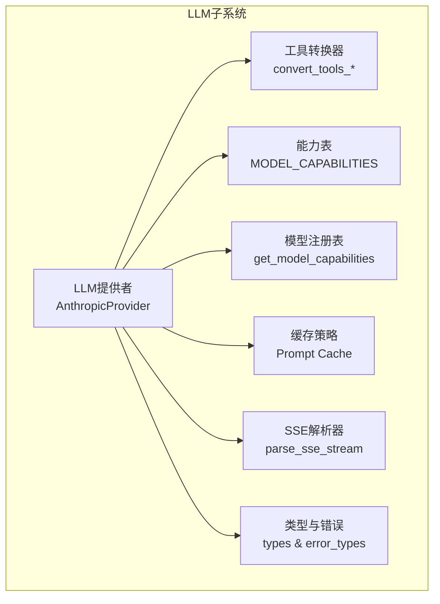
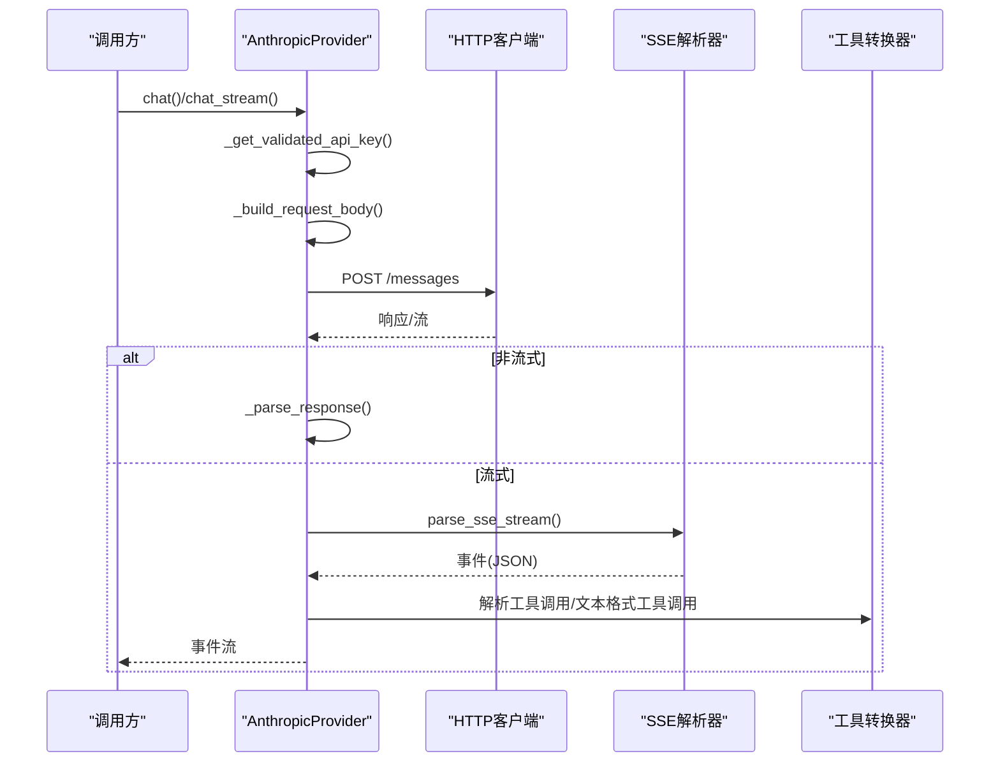
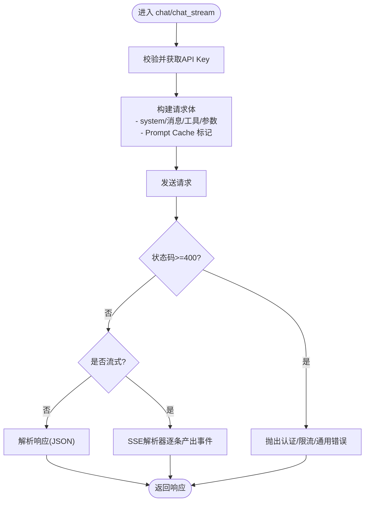
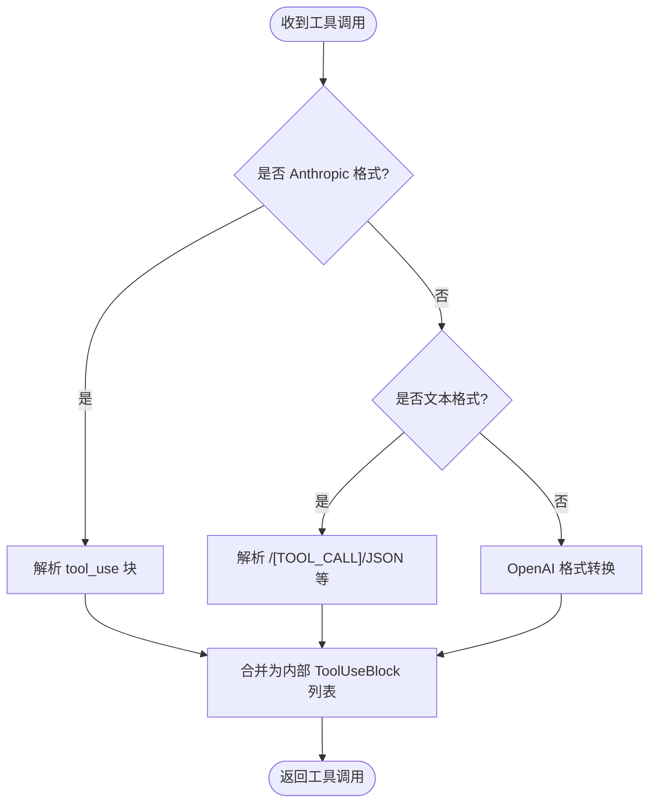
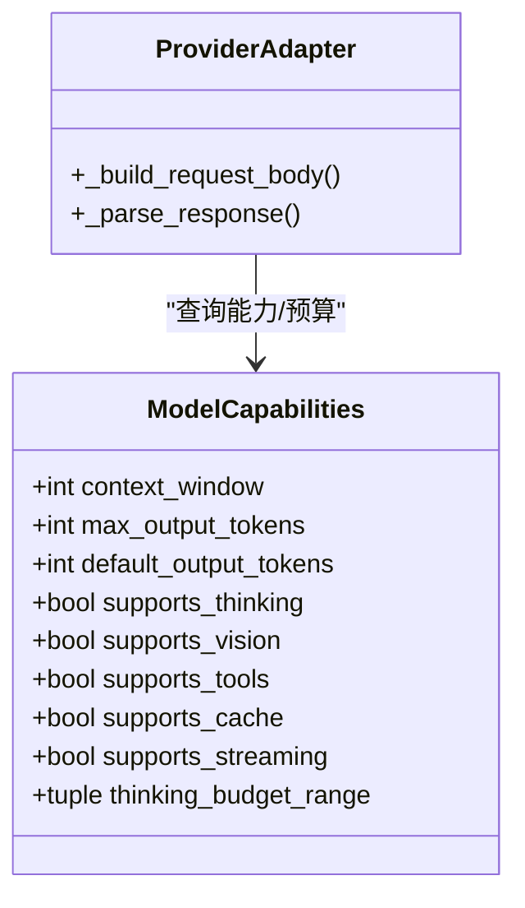
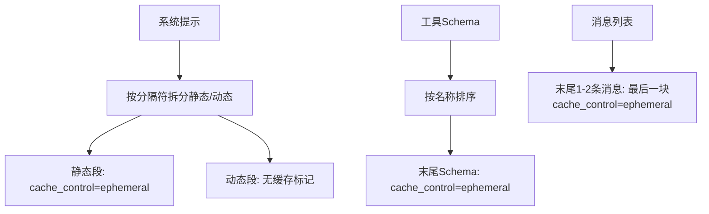
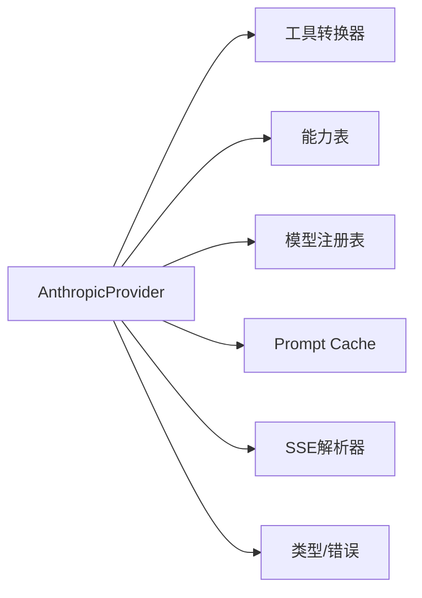

# Anthropic提供商

<cite>
**本文引用的文件**
- [anthropic.py](file://src/synapse/llm/providers/anthropic.py)
- [anthropic.py](file://src/synapse/llm/registries/anthropic.py)
- [tools.py](file://src/synapse/llm/converters/tools.py)
- [capabilities.py](file://src/synapse/llm/capabilities.py)
- [model_registry.py](file://src/synapse/llm/model_registry.py)
- [cache.py](file://src/synapse/llm/cache.py)
- [sse.py](file://src/synapse/llm/sse.py)
- [types.py](file://src/synapse/llm/types.py)
- [error_types.py](file://src/synapse/llm/error_types.py)
- [api-comparison-openai-anthropic.md](file://docs/api-comparison-openai-anthropic.md)
- [anthropic-best-practices.md](file://skills/superpowers-writing-skills/anthropic-best-practices.md)
- [wizard.py](file://src/synapse/setup/wizard.py)
</cite>

## 目录
1. [简介](#简介)
2. [项目结构](#项目结构)
3. [核心组件](#核心组件)
4. [架构总览](#架构总览)
5. [详细组件分析](#详细组件分析)
6. [依赖关系分析](#依赖关系分析)
7. [性能考量](#性能考量)
8. [故障排查指南](#故障排查指南)
9. [结论](#结论)
10. [附录](#附录)

## 简介
本文件面向在本项目中集成与使用 Anthropic（Claude）系列模型的开发者，系统阐述 Anthropic 适配器的实现方式、API 调用封装、消息格式转换、工具调用支持、认证流程、错误处理与响应解析机制，并提供实际使用示例与性能优化建议。文档同时结合项目内现有的能力表、模型注册表、缓存策略与 SSE 流解析器，帮助读者在工程层面高效落地与优化。

## 项目结构
与 Anthropic 适配相关的核心代码位于 LLM 子系统中，主要涉及：
- 适配器与提供者：LLM 提供者实现 Anthropic API 调用、请求体构建、响应解析与流式处理
- 工具调用转换：在内部格式与 Anthropic/OpenAI 之间进行工具定义与调用的双向转换
- 能力与模型注册：模型能力表与模型注册表，支撑上下文窗口、输出限制、思考预算等
- 缓存策略：系统提示分段缓存、工具 Schema 缓存、消息缓存断点
- 流式协议：标准 SSE 解析器，确保流式事件的可靠解析
- 类型与错误：统一的数据结构与错误分类，便于上层消费

**图表来源**
- [anthropic.py:44-505](file://src/synapse/llm/providers/anthropic.py#L44-L505)
- [tools.py:77-237](file://src/synapse/llm/converters/tools.py#L77-L237)
- [capabilities.py:17-140](file://src/synapse/llm/capabilities.py#L17-L140)
- [model_registry.py:168-244](file://src/synapse/llm/model_registry.py#L168-L244)
- [cache.py:25-162](file://src/synapse/llm/cache.py#L25-L162)
- [sse.py:20-75](file://src/synapse/llm/sse.py#L20-L75)
- [types.py:35-200](file://src/synapse/llm/types.py#L35-L200)
- [error_types.py:13-25](file://src/synapse/llm/error_types.py#L13-L25)

**章节来源**
- [anthropic.py:1-505](file://src/synapse/llm/providers/anthropic.py#L1-L505)
- [tools.py:1-800](file://src/synapse/llm/converters/tools.py#L1-L800)
- [capabilities.py:1-800](file://src/synapse/llm/capabilities.py#L1-L800)
- [model_registry.py:1-245](file://src/synapse/llm/model_registry.py#L1-L245)
- [cache.py:1-162](file://src/synapse/llm/cache.py#L1-L162)
- [sse.py:1-75](file://src/synapse/llm/sse.py#L1-L75)
- [types.py:1-200](file://src/synapse/llm/types.py#L1-L200)
- [error_types.py:1-25](file://src/synapse/llm/error_types.py#L1-L25)

## 核心组件
- AnthropicProvider：实现 Anthropic API 的请求构建、认证、流式与非流式调用、响应解析与错误处理
- 工具转换器：在内部格式与 Anthropic/OpenAI 之间转换工具定义与调用；支持文本格式工具调用解析
- 能力表与模型注册表：提供模型能力、上下文窗口、输出限制、思考预算范围等元数据
- Prompt Cache：系统提示分段缓存、工具 Schema 缓存、消息缓存断点，降低 token 成本
- SSE 解析器：标准 SSE 协议解析，支持事件类型与 [DONE] 终止信号
- 类型与错误：统一的响应结构、停止原因、内容类型与错误分类

**章节来源**
- [anthropic.py:44-505](file://src/synapse/llm/providers/anthropic.py#L44-L505)
- [tools.py:77-237](file://src/synapse/llm/converters/tools.py#L77-L237)
- [capabilities.py:17-140](file://src/synapse/llm/capabilities.py#L17-L140)
- [model_registry.py:168-244](file://src/synapse/llm/model_registry.py#L168-L244)
- [cache.py:25-162](file://src/synapse/llm/cache.py#L25-L162)
- [sse.py:20-75](file://src/synapse/llm/sse.py#L20-L75)
- [types.py:35-200](file://src/synapse/llm/types.py#L35-L200)
- [error_types.py:13-25](file://src/synapse/llm/error_types.py#L13-L25)

## 架构总览
下图展示 AnthropicProvider 的关键交互：请求构建、认证、网络调用、SSE 流解析、工具调用解析与响应组装。

**图表来源**
- [anthropic.py:166-261](file://src/synapse/llm/providers/anthropic.py#L166-L261)
- [sse.py:20-75](file://src/synapse/llm/sse.py#L20-L75)
- [tools.py:269-728](file://src/synapse/llm/converters/tools.py#L269-L728)

**章节来源**
- [anthropic.py:166-261](file://src/synapse/llm/providers/anthropic.py#L166-L261)
- [sse.py:20-75](file://src/synapse/llm/sse.py#L20-L75)
- [tools.py:269-728](file://src/synapse/llm/converters/tools.py#L269-L728)

## 详细组件分析

### AnthropicProvider 实现要点
- 认证与基础配置
  - 支持 x-api-key 与 Authorization: Bearer 双头，兼容官方与部分兼容网关
  - 本地端点（localhost/127.0.0.1）允许空 API Key（用于本地服务）
  - 事件循环感知的 httpx.AsyncClient 生命周期管理，避免跨循环资源泄漏
- 请求构建
  - messages URL 自动处理 /v1 重复拼接
  - system 与 messages 分离；当模型支持缓存时，system 拆分为静态/动态两段并标注 cache_control
  - tools 排序与缓存控制，消息末尾添加缓存断点
  - temperature、stop_sequences、extra_params 等参数透传
  - thinking 模式：动态调整 max_tokens 与禁用 temperature
- 流式与非流式
  - 非流式：解析 JSON 响应，映射停止原因与使用统计
  - 流式：使用标准 SSE 解析器，逐条产出事件，最终标记健康状态
- 错误处理
  - 401/429 明确分类为认证/限流错误，其他错误统一包装为 LLMError
  - 超时与网络异常分别记录健康状态并抛出对应错误

**图表来源**
- [anthropic.py:166-261](file://src/synapse/llm/providers/anthropic.py#L166-L261)
- [anthropic.py:392-498](file://src/synapse/llm/providers/anthropic.py#L392-L498)

**章节来源**
- [anthropic.py:54-165](file://src/synapse/llm/providers/anthropic.py#L54-L165)
- [anthropic.py:166-261](file://src/synapse/llm/providers/anthropic.py#L166-L261)
- [anthropic.py:293-356](file://src/synapse/llm/providers/anthropic.py#L293-L356)
- [anthropic.py:392-498](file://src/synapse/llm/providers/anthropic.py#L392-L498)

### 工具调用支持与格式转换
- 工具定义转换
  - 内部格式与 Anthropic 格式一致，直接序列化；OpenAI 格式转换为 Anthropic
- 工具调用解析
  - Anthropic tool_use 块直译为内部 ToolUseBlock
  - 文本格式工具调用解析（MiniMax 等兼容网关）：支持 <invoke>、[TOOL_CALL] 等多格式
  - JSON 截断修复：对被截断的 arguments 进行后缀补齐尝试与诊断落盘
- 工具结果互操作
  - OpenAI tool 消息与 Anthropic tool_result 的相互转换

**图表来源**
- [tools.py:77-237](file://src/synapse/llm/converters/tools.py#L77-L237)
- [tools.py:269-728](file://src/synapse/llm/converters/tools.py#L269-L728)

**章节来源**
- [tools.py:77-237](file://src/synapse/llm/converters/tools.py#L77-L237)
- [tools.py:269-728](file://src/synapse/llm/converters/tools.py#L269-L728)

### 模型能力与上下文长度限制
- 能力表覆盖 text/vision/tools/thinking/pdf 等能力，Anthropic Claude 3+/4.x 明确标注 PDF 原生输入
- 模型注册表提供上下文窗口、最大输出 token、默认输出 token、思考预算范围等
- 适配器在构建请求时读取模型能力，动态设置 max_tokens、启用 thinking 与缓存策略

**图表来源**
- [model_registry.py:21-34](file://src/synapse/llm/model_registry.py#L21-L34)
- [capabilities.py:17-140](file://src/synapse/llm/capabilities.py#L17-L140)
- [anthropic.py:293-356](file://src/synapse/llm/providers/anthropic.py#L293-L356)

**章节来源**
- [capabilities.py:17-140](file://src/synapse/llm/capabilities.py#L17-L140)
- [model_registry.py:168-244](file://src/synapse/llm/model_registry.py#L168-L244)
- [anthropic.py:293-356](file://src/synapse/llm/providers/anthropic.py#L293-L356)

### Prompt Cache 与消息缓存断点
- 系统提示分段缓存：以特定分隔符切分静态/动态部分，静态段标注 cache_control
- 工具 Schema 缓存：对工具列表末尾添加 cache_control，配合排序保证缓存稳定性
- 消息缓存断点：在最后 1-2 条消息的末尾内容块添加 cache_control，提升历史复用率

**图表来源**
- [cache.py:25-128](file://src/synapse/llm/cache.py#L25-L128)

**章节来源**
- [cache.py:25-128](file://src/synapse/llm/cache.py#L25-L128)
- [anthropic.py:318-340](file://src/synapse/llm/providers/anthropic.py#L318-L340)

### 流式事件解析与完整性
- SSE 解析器遵循规范：支持多行 data 拼接、event 类型、注释行与 [DONE] 终止信号
- 适配器在流式场景中逐条产出事件，最终关闭响应句柄，确保资源释放

**章节来源**
- [sse.py:20-75](file://src/synapse/llm/sse.py#L20-L75)
- [anthropic.py:206-261](file://src/synapse/llm/providers/anthropic.py#L206-L261)

### 认证流程与环境变量
- 默认环境变量建议：ANTHROPIC_API_KEY
- 本地端点允许空 API Key（值为 local），兼容本地服务
- 请求头同时携带 x-api-key 与 Authorization: Bearer，提升兼容性

**章节来源**
- [anthropic.py:54-95](file://src/synapse/llm/providers/anthropic.py#L54-L95)
- [anthropic.py:262-271](file://src/synapse/llm/providers/anthropic.py#L262-L271)

### 错误处理与健康状态
- 401 认证失败、429 速率限制、其他 HTTP 错误分别映射到 AuthenticationError、RateLimitError、LLMError
- 超时与网络异常记录健康状态并抛出对应错误
- 成功响应后标记健康状态

**章节来源**
- [anthropic.py:183-204](file://src/synapse/llm/providers/anthropic.py#L183-L204)
- [error_types.py:13-25](file://src/synapse/llm/error_types.py#L13-L25)

### 响应解析与停止原因
- content 块支持 text、tool_use、thinking 等类型
- 停止原因映射：end_turn/max_tokens/tool_use/stop_sequence
- usage 字段包含 input/output 以及缓存相关的统计

**章节来源**
- [anthropic.py:392-498](file://src/synapse/llm/providers/anthropic.py#L392-L498)
- [types.py:35-77](file://src/synapse/llm/types.py#L35-L77)

### 实际使用示例与最佳实践
- 设置端点与密钥：在向导或配置中设置 api_type=anthropic、base_url、api_key_env/值
- 模型选择：优先选择支持 PDF 输入的 Claude 3+/4.x 模型
- 工具调用：优先使用结构化工具定义；如遇兼容网关，系统会自动解析文本格式工具调用
- 思考模式：在支持的模型上启用 thinking，动态调整 max_tokens 并移除 temperature

**章节来源**
- [wizard.py:2102-2126](file://src/synapse/setup/wizard.py#L2102-L2126)
- [capabilities.py:74-140](file://src/synapse/llm/capabilities.py#L74-L140)
- [anthropic-best-practices.md:1-800](file://skills/superpowers-writing-skills/anthropic-best-practices.md#L1-L800)

## 依赖关系分析
- Provider 依赖
  - 工具转换器：用于工具定义与调用的双向转换
  - 能力表与模型注册表：用于上下文窗口、输出限制、思考预算与缓存能力判断
  - 缓存策略：用于系统提示、工具 Schema 与消息的缓存标记
  - SSE 解析器：用于流式事件解析
  - 类型与错误：统一数据结构与错误分类

**图表来源**
- [anthropic.py:13-39](file://src/synapse/llm/providers/anthropic.py#L13-L39)
- [tools.py:1-20](file://src/synapse/llm/converters/tools.py#L1-L20)
- [capabilities.py:1-20](file://src/synapse/llm/capabilities.py#L1-L20)
- [model_registry.py:1-20](file://src/synapse/llm/model_registry.py#L1-L20)
- [cache.py:1-20](file://src/synapse/llm/cache.py#L1-L20)
- [sse.py:1-10](file://src/synapse/llm/sse.py#L1-L10)
- [types.py:1-20](file://src/synapse/llm/types.py#L1-L20)
- [error_types.py:1-10](file://src/synapse/llm/error_types.py#L1-L10)

**章节来源**
- [anthropic.py:13-39](file://src/synapse/llm/providers/anthropic.py#L13-L39)
- [tools.py:1-20](file://src/synapse/llm/converters/tools.py#L1-L20)
- [capabilities.py:1-20](file://src/synapse/llm/capabilities.py#L1-L20)
- [model_registry.py:1-20](file://src/synapse/llm/model_registry.py#L1-L20)
- [cache.py:1-20](file://src/synapse/llm/cache.py#L1-L20)
- [sse.py:1-10](file://src/synapse/llm/sse.py#L1-L10)
- [types.py:1-20](file://src/synapse/llm/types.py#L1-L20)
- [error_types.py:1-10](file://src/synapse/llm/error_types.py#L1-L10)

## 性能考量
- Prompt Cache
  - 启用系统提示分段缓存与消息断点，显著降低重复输入 token
  - 工具 Schema 缓存与排序，减少重复传输
- 思考模式
  - 动态增加 max_tokens 并移除 temperature，避免不必要的采样开销
- 流式处理
  - 使用标准 SSE 解析器，及时产出中间结果，降低端到端延迟
- 事件循环与连接复用
  - 适配器按事件循环管理 httpx.AsyncClient，避免跨循环资源问题

**章节来源**
- [cache.py:25-128](file://src/synapse/llm/cache.py#L25-L128)
- [anthropic.py:342-355](file://src/synapse/llm/providers/anthropic.py#L342-L355)
- [sse.py:20-75](file://src/synapse/llm/sse.py#L20-L75)

## 故障排查指南
- 认证失败（401）
  - 检查 ANTHROPIC_API_KEY 环境变量或配置项
  - 本地端点使用 local 作为 API Key
- 速率限制（429）
  - 降低并发或等待冷却时间
- 工具调用参数截断
  - 系统会尝试修复并记录诊断文件，必要时缩短参数
- 文本格式工具调用
  - 兼容网关可能返回 <invoke> 或 [TOOL_CALL] 格式，系统会自动解析
- 流式解析异常
  - SSE 解析器对 JSON 解析失败进行告警但不中断，检查事件类型与数据片段

**章节来源**
- [anthropic.py:183-204](file://src/synapse/llm/providers/anthropic.py#L183-L204)
- [tools.py:26-72](file://src/synapse/llm/converters/tools.py#L26-L72)
- [tools.py:770-800](file://src/synapse/llm/converters/tools.py#L770-L800)
- [sse.py:52-60](file://src/synapse/llm/sse.py#L52-L60)

## 结论
本适配器围绕 Anthropic/Claude 的 API 特性进行了系统化封装：在请求构建阶段充分考虑缓存、工具与思考模式，在响应解析阶段兼容结构化与文本格式工具调用，并通过标准 SSE 解析器保障流式体验。结合能力表与模型注册表，能够动态适配不同模型的能力与预算，从而在功能完备与成本控制之间取得平衡。

## 附录
- OpenAI 与 Anthropic API 差异对比：涵盖消息格式、工具调用、多模态与响应格式等
- Anthropic 最佳实践：关于技能编写与提示设计的指导原则

**章节来源**
- [api-comparison-openai-anthropic.md:1-800](file://docs/api-comparison-openai-anthropic.md#L1-L800)
- [anthropic-best-practices.md:1-800](file://skills/superpowers-writing-skills/anthropic-best-practices.md#L1-L800)