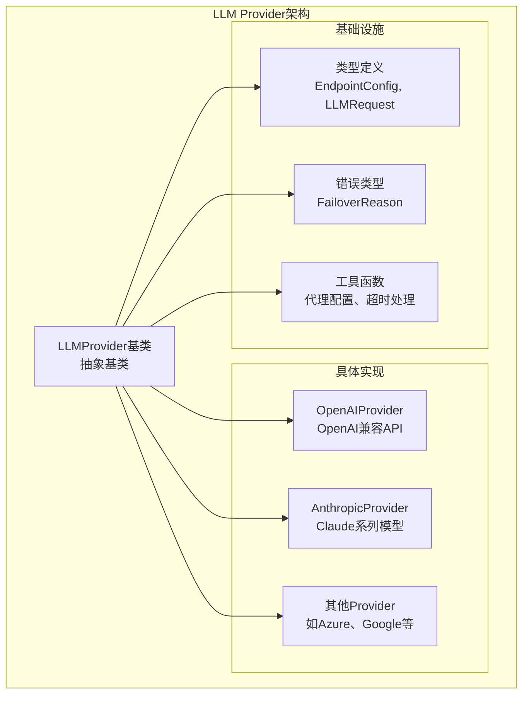
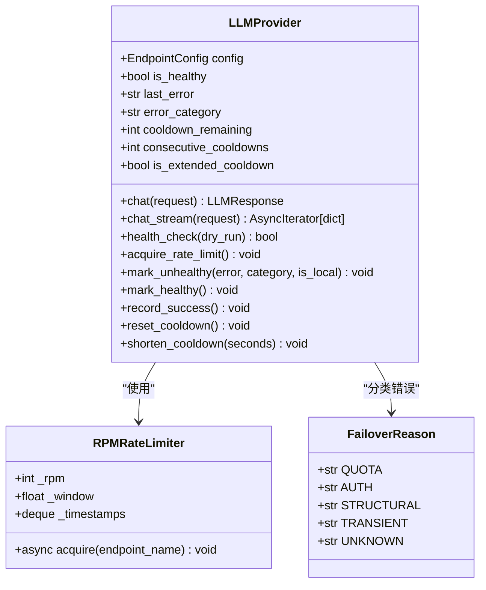
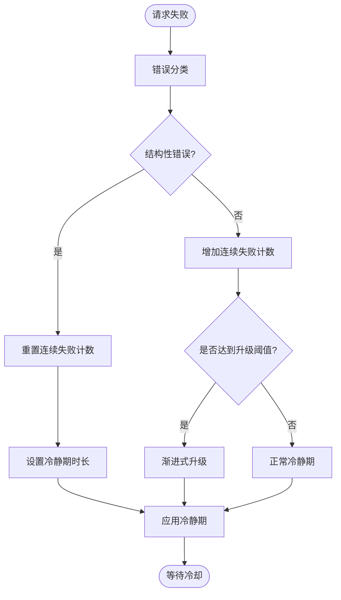
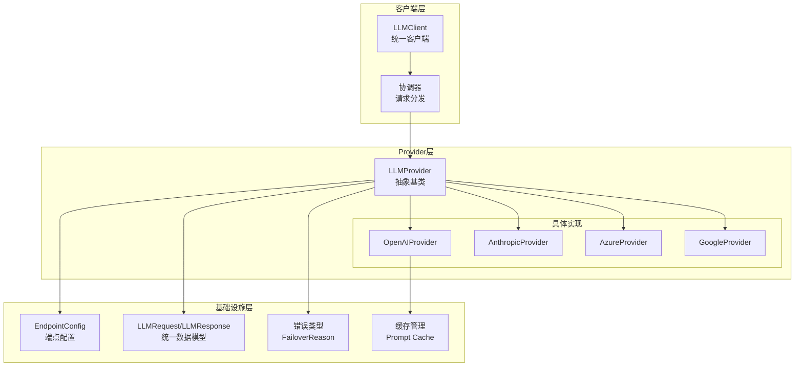
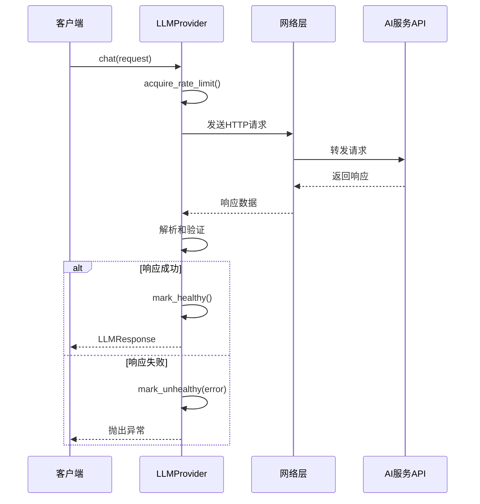
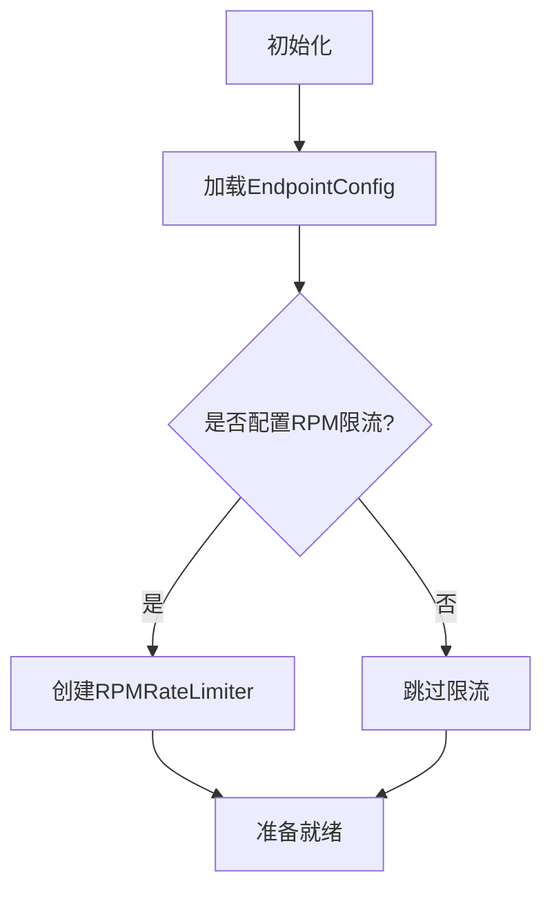
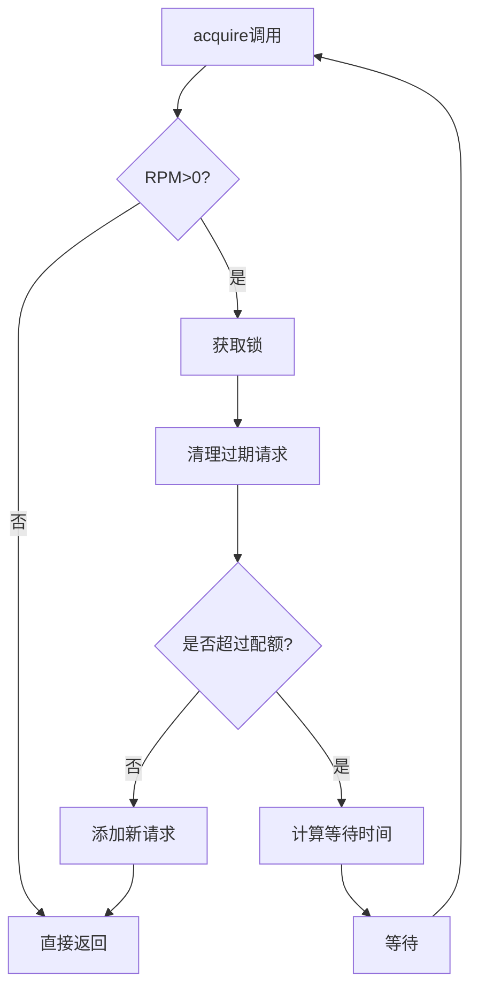
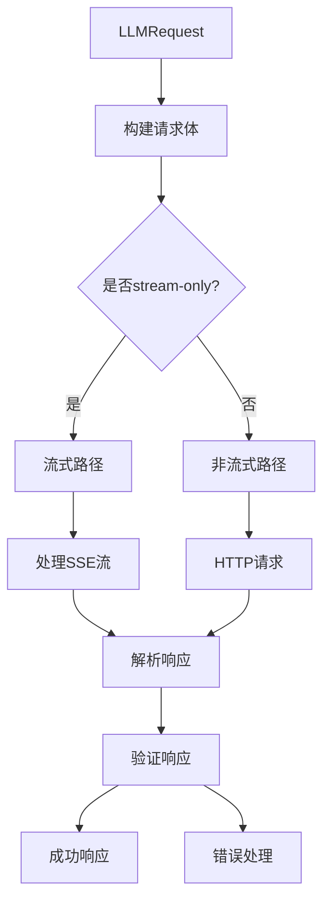
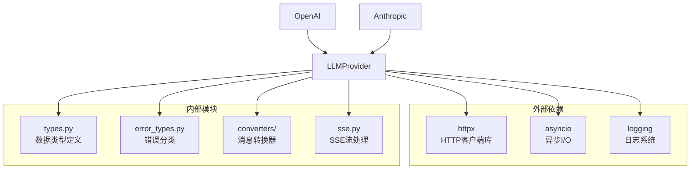
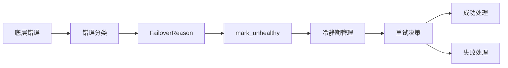

# BaseProvider基类

<cite>
**本文档引用的文件**
- [src/synapse/llm/providers/base.py](file://src/synapse/llm/providers/base.py)
- [src/synapse/llm/providers/openai.py](file://src/synapse/llm/providers/openai.py)
- [src/synapse/llm/providers/anthropic.py](file://src/synapse/llm/providers/anthropic.py)
- [src/synapse/llm/error_types.py](file://src/synapse/llm/error_types.py)
- [src/synapse/llm/types.py](file://src/synapse/llm/types.py)
</cite>

## 目录
1. [简介](#简介)
2. [项目结构](#项目结构)
3. [核心组件](#核心组件)
4. [架构概览](#架构概览)
5. [详细组件分析](#详细组件分析)
6. [依赖关系分析](#依赖关系分析)
7. [性能考虑](#性能考虑)
8. [故障排除指南](#故障排除指南)
9. [结论](#结论)

## 简介

BaseProvider基类是OpenAkita平台LLM服务提供商的核心抽象层，为各种AI模型服务提供商（如OpenAI、Anthropic等）提供了统一的接口规范和基础设施。该基类实现了完整的错误处理机制、超时控制、重试策略和健康检查功能，确保不同提供商之间的无缝集成和一致性体验。

该基类采用面向对象设计原则，通过抽象方法定义了标准化的API接口，同时提供了丰富的扩展点和最佳实践指导，使得开发者能够轻松地为新的AI服务提供商创建兼容的实现。

## 项目结构

LLM Provider体系采用模块化设计，主要包含以下关键组件：

**图表来源**
- [src/synapse/llm/providers/base.py:91-485](file://src/synapse/llm/providers/base.py#L91-L485)
- [src/synapse/llm/providers/openai.py:74-1051](file://src/synapse/llm/providers/openai.py#L74-L1051)
- [src/synapse/llm/providers/anthropic.py:44-505](file://src/synapse/llm/providers/anthropic.py#L44-L505)

**章节来源**
- [src/synapse/llm/providers/base.py:1-485](file://src/synapse/llm/providers/base.py#L1-L485)
- [src/synapse/llm/types.py:415-690](file://src/synapse/llm/types.py#L415-L690)

## 核心组件

### 抽象基类设计

LLMProvider基类作为所有AI服务提供商的抽象基类，定义了统一的接口规范和核心功能：

#### 主要职责
- **统一接口定义**：提供标准化的聊天和流式聊天接口
- **错误处理机制**：实现自动化的错误分类和处理策略
- **健康检查功能**：监控服务提供商的可用性和性能状态
- **限流控制**：支持RPM（每分钟请求数）限流机制
- **配置管理**：集中管理端点配置和能力检测

#### 核心属性和方法

**图表来源**
- [src/synapse/llm/providers/base.py:91-485](file://src/synapse/llm/providers/base.py#L91-L485)
- [src/synapse/llm/error_types.py:13-25](file://src/synapse/llm/error_types.py#L13-L25)

**章节来源**
- [src/synapse/llm/providers/base.py:91-485](file://src/synapse/llm/providers/base.py#L91-L485)

### 错误处理机制

BaseProvider实现了完整的错误分类和处理系统，支持多种错误类型的自动识别和相应的处理策略：

#### 错误分类体系

| 错误类型 | 分类代码 | 冷静期时长 | 处理策略 |
|---------|---------|-----------|----------|
| 配额耗尽 | quota | 5分钟 | 逐步升级冷静期，最多30分钟 |
| 认证失败 | auth | 1分钟 | 需要人工干预 |
| 结构性错误 | structural | 10秒 | 立即重试，不计入连续失败 |
| 瞬时错误 | transient | 5秒 | 渐进式冷静期，最多5分钟 |
| 默认错误 | unknown | 30秒 | 渐进式冷静期 |

#### 冷静期退避策略

**图表来源**
- [src/synapse/llm/providers/base.py:167-323](file://src/synapse/llm/providers/base.py#L167-L323)

**章节来源**
- [src/synapse/llm/providers/base.py:72-88](file://src/synapse/llm/providers/base.py#L72-L88)
- [src/synapse/llm/providers/base.py:167-323](file://src/synapse/llm/providers/base.py#L167-L323)

### 超时控制和重试策略

BaseProvider提供了灵活的超时控制和智能重试机制：

#### 超时控制机制

- **动态超时调整**：根据请求体大小和上下文长度自动调整超时时间
- **本地端点优化**：为本地推理引擎（如Ollama）提供更大的读取超时
- **代理支持**：透明支持HTTP代理配置和IPv4-only传输

#### 重试策略

- **指数退避**：连续失败时采用渐进式冷静期策略
- **错误感知重试**：根据错误类型选择合适的重试时机
- **健康状态监控**：自动跟踪和报告服务提供商的健康状况

**章节来源**
- [src/synapse/llm/providers/openai.py:182-220](file://src/synapse/llm/providers/openai.py#L182-L220)
- [src/synapse/llm/providers/openai.py:132-147](file://src/synapse/llm/providers/openai.py#L132-L147)

## 架构概览

### 整体架构设计

**图表来源**
- [src/synapse/llm/providers/base.py:91-104](file://src/synapse/llm/providers/base.py#L91-L104)
- [src/synapse/llm/types.py:491-516](file://src/synapse/llm/types.py#L491-L516)

### 数据流架构

**图表来源**
- [src/synapse/llm/providers/base.py:407-431](file://src/synapse/llm/providers/base.py#L407-L431)
- [src/synapse/llm/providers/openai.py:221-325](file://src/synapse/llm/providers/openai.py#L221-L325)

## 详细组件分析

### LLMProvider基类详解

#### 初始化和配置管理

LLMProvider的初始化过程包含了完整的配置验证和资源准备：

**图表来源**
- [src/synapse/llm/providers/base.py:94-104](file://src/synapse/llm/providers/base.py#L94-L104)

#### 健康检查机制

健康检查是BaseProvider的核心功能之一，提供了两种运行模式：

| 模式 | 功能描述 | 使用场景 |
|------|----------|----------|
| 正常模式 | 修改Provider状态，更新健康/不健康标记 | 后台定期检查 |
| Dry-run模式 | 仅测试连通性，不修改状态 | 用户手动诊断 |

**章节来源**
- [src/synapse/llm/providers/base.py:433-462](file://src/synapse/llm/providers/base.py#L433-L462)

### RPMRateLimiter限流器

RPMRateLimiter实现了高效的滑动窗口限流算法：

#### 核心特性
- **滑动窗口算法**：基于60秒时间窗口的精确限流控制
- **异步安全**：使用asyncio.Lock确保并发安全性
- **事件循环绑定**：自动适应不同的事件循环环境

#### 实现原理

**图表来源**
- [src/synapse/llm/providers/base.py:46-70](file://src/synapse/llm/providers/base.py#L46-L70)

**章节来源**
- [src/synapse/llm/providers/base.py:19-70](file://src/synapse/llm/providers/base.py#L19-L70)

### 具体Provider实现示例

#### OpenAIProvider实现要点

OpenAIProvider展示了如何正确继承和扩展BaseProvider：

##### 关键实现特征
- **流式支持**：自动检测和处理stream-only端点
- **动态超时**：根据请求复杂度调整超时设置
- **错误自愈**：智能识别和处理API特定的错误模式

##### 请求处理流程

**图表来源**
- [src/synapse/llm/providers/openai.py:221-514](file://src/synapse/llm/providers/openai.py#L221-L514)

**章节来源**
- [src/synapse/llm/providers/openai.py:74-1051](file://src/synapse/llm/providers/openai.py#L74-L1051)

#### AnthropicProvider实现特点

AnthropicProvider体现了高级错误处理和配置验证的重要性：

##### 核心优势
- **早期验证**：在请求前验证API密钥的有效性
- **重定向支持**：通过事件钩子处理跨主机重定向
- **本地优化**：针对本地端点进行特殊配置调整

**章节来源**
- [src/synapse/llm/providers/anthropic.py:44-505](file://src/synapse/llm/providers/anthropic.py#L44-L505)

## 依赖关系分析

### 核心依赖关系

**图表来源**
- [src/synapse/llm/providers/base.py:7-16](file://src/synapse/llm/providers/base.py#L7-L16)
- [src/synapse/llm/providers/openai.py:14-42](file://src/synapse/llm/providers/openai.py#L14-L42)

### 错误处理依赖链

**图表来源**
- [src/synapse/llm/providers/base.py:324-405](file://src/synapse/llm/providers/base.py#L324-L405)
- [src/synapse/llm/error_types.py:13-25](file://src/synapse/llm/error_types.py#L13-L25)

**章节来源**
- [src/synapse/llm/providers/base.py:324-405](file://src/synapse/llm/providers/base.py#L324-L405)
- [src/synapse/llm/error_types.py:13-25](file://src/synapse/llm/error_types.py#L13-L25)

## 性能考虑

### 限流和并发控制

BaseProvider的限流机制经过精心设计，平衡了性能和稳定性：

#### RPMRateLimiter性能特性
- **时间复杂度**：O(n)清理过期请求，n为窗口内的请求数
- **空间复杂度**：O(w)存储窗口内的请求时间戳，w为最大可能的并发请求数
- **内存效率**：使用deque高效管理时间戳队列

#### 异步性能优化
- **事件循环绑定**：避免跨循环的锁竞争
- **连接复用**：HTTP客户端连接池减少建立连接的开销
- **流式处理**：支持SSE流式响应，降低内存占用

### 错误处理性能影响

合理的错误处理策略对整体性能有积极影响：

- **快速失败**：及时识别和处理明显失败的请求
- **智能重试**：避免对不可用端点的无效重试
- **冷静期管理**：防止雪崩效应，保护上游服务

## 故障排除指南

### 常见问题诊断

#### 健康检查失败
1. **检查网络连接**：确认基础URL可达性
2. **验证API密钥**：确保密钥有效且具有相应权限
3. **检查限流配置**：确认RPM限制设置合理

#### 错误分类问题
- **配额错误误判**：检查错误消息中的关键词匹配
- **认证错误处理**：验证401/403状态码的正确处理
- **瞬时错误识别**：确认网络相关错误的准确分类

#### 性能问题排查
- **超时设置**：根据请求复杂度调整超时参数
- **连接池配置**：优化HTTP客户端连接池设置
- **缓存策略**：检查Prompt Cache的使用效果

### 调试技巧

1. **启用详细日志**：观察Provider的状态变化和错误处理过程
2. **监控冷静期**：跟踪端点的健康状态和恢复时间
3. **性能基准测试**：对比不同配置下的响应时间和成功率

**章节来源**
- [src/synapse/llm/providers/base.py:433-462](file://src/synapse/llm/providers/base.py#L433-L462)

## 结论

BaseProvider基类为OpenAkita平台的LLM服务提供商生态系统提供了坚实的基础架构。通过统一的接口规范、完善的错误处理机制和智能化的重试策略，该基类确保了不同AI服务提供商之间的无缝集成和一致性体验。

### 主要优势

1. **抽象层次清晰**：通过ABC定义明确的接口契约
2. **扩展性强**：支持新的AI服务提供商的快速集成
3. **可靠性高**：完善的错误处理和健康检查机制
4. **性能优化**：智能的限流和超时控制策略

### 最佳实践建议

1. **正确继承基类**：遵循抽象方法的实现要求
2. **合理配置限流**：根据服务提供商的SLA设置合适的RPM限制
3. **优化超时设置**：根据请求类型和网络环境调整超时参数
4. **实现健壮的错误处理**：利用基类提供的错误分类和处理机制
5. **监控和调试**：充分利用日志和健康检查功能进行问题诊断

通过遵循这些指导原则，开发者可以创建高质量的LLM服务提供商实现，为用户提供稳定可靠的AI服务体验。