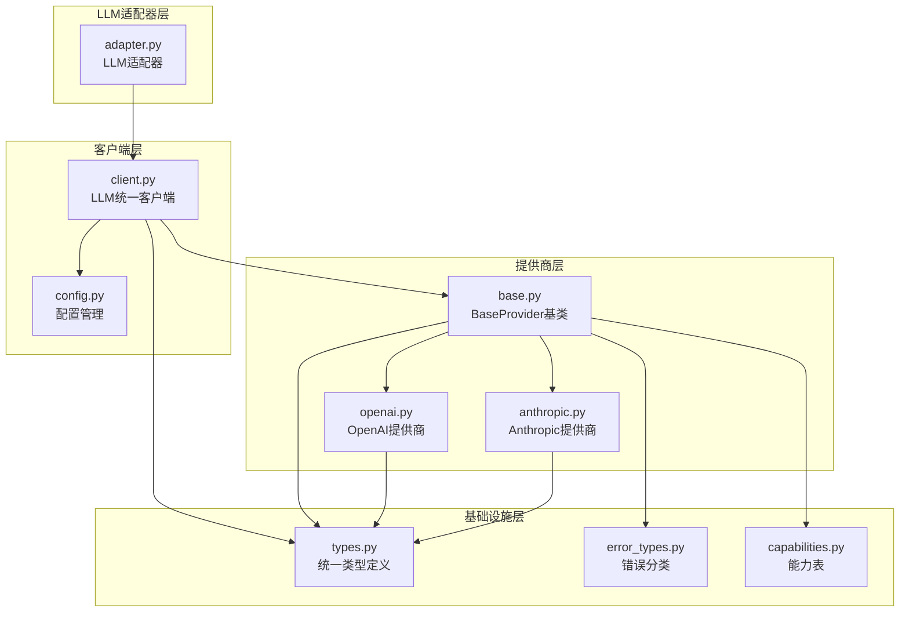
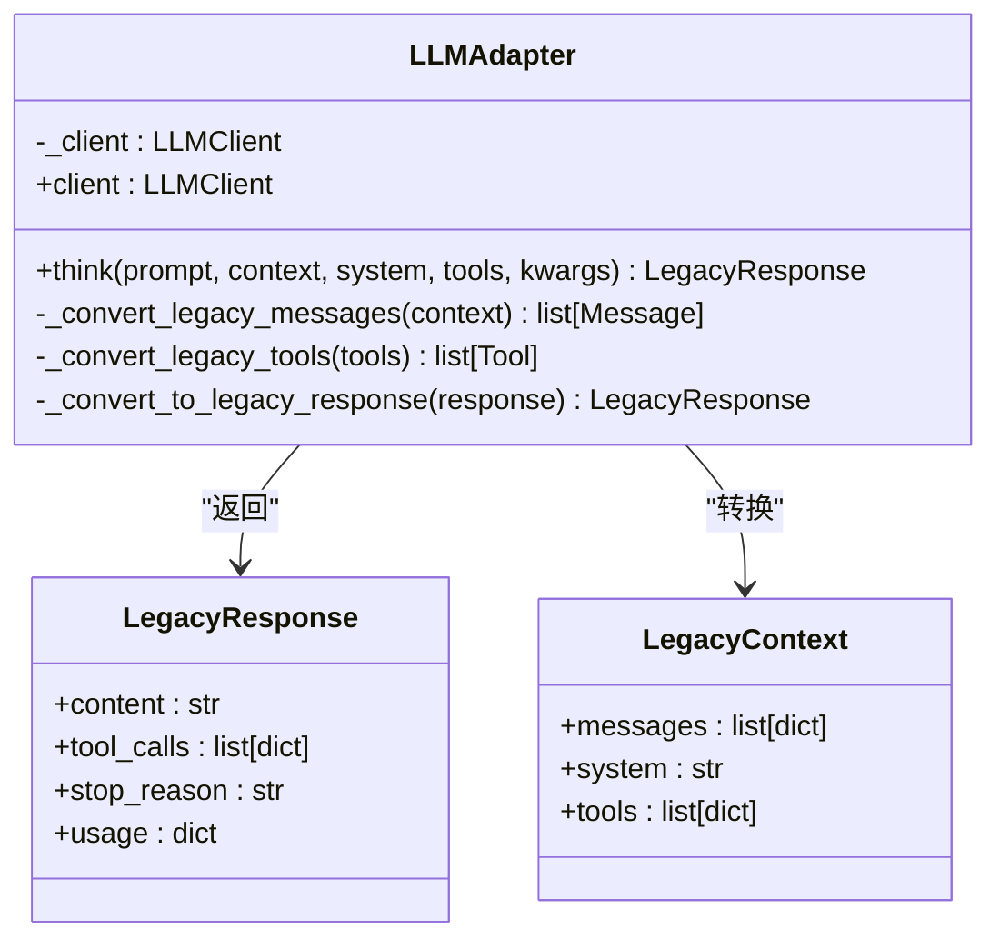
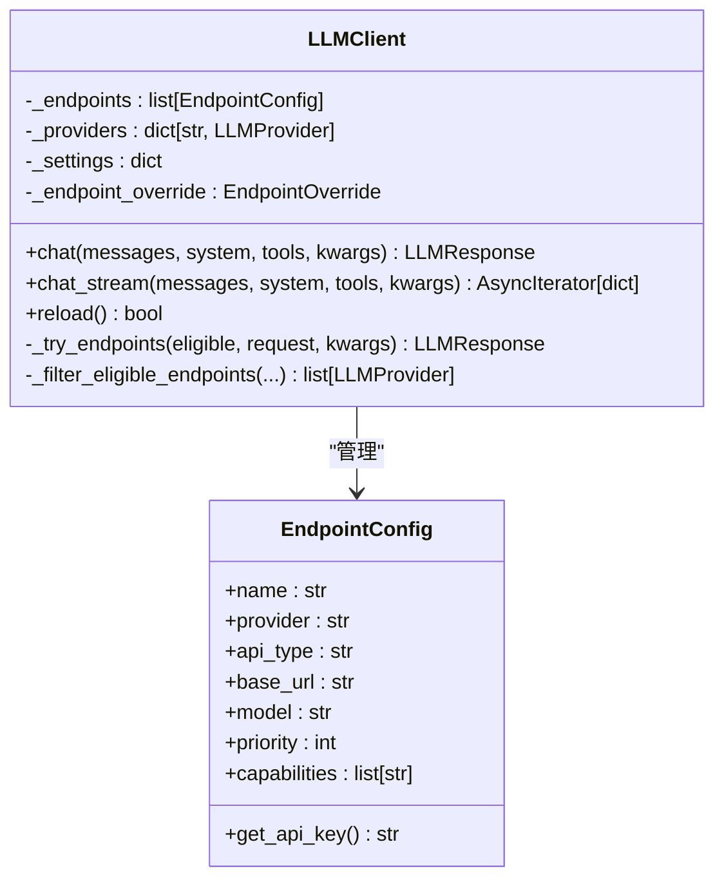
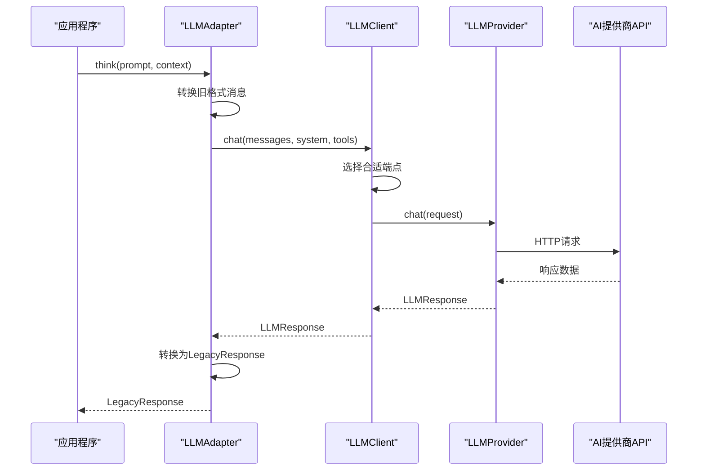
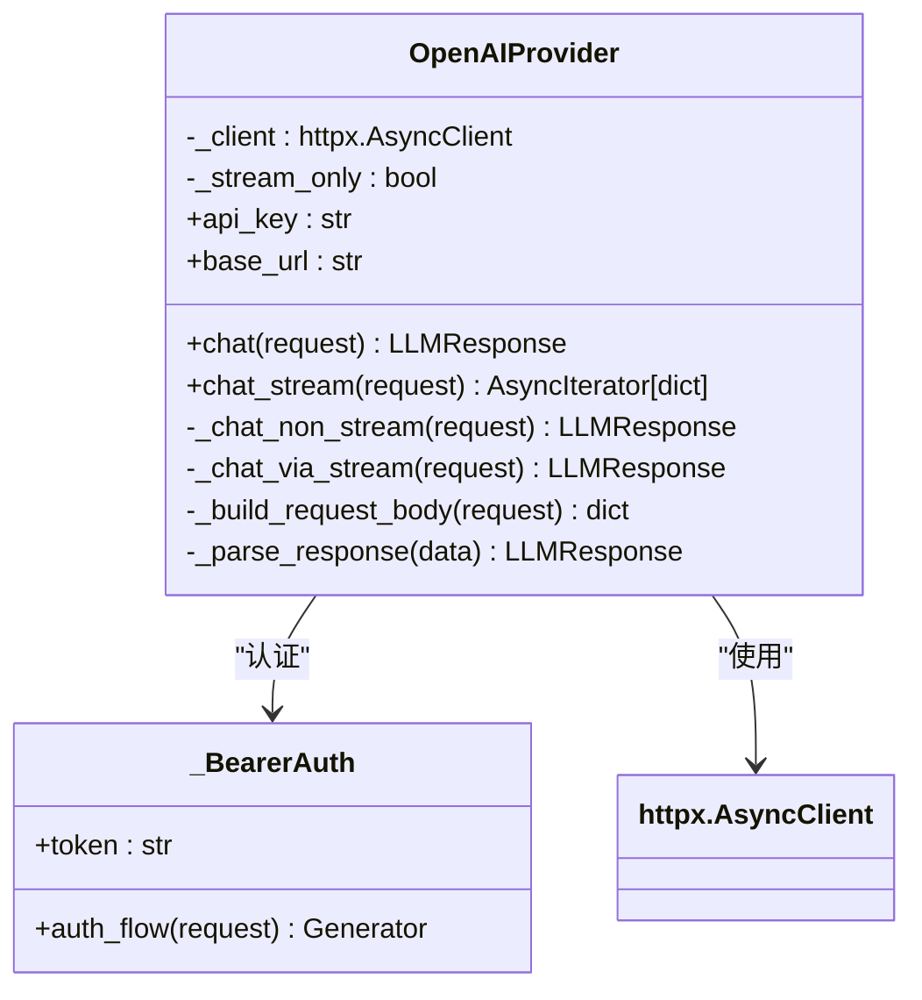
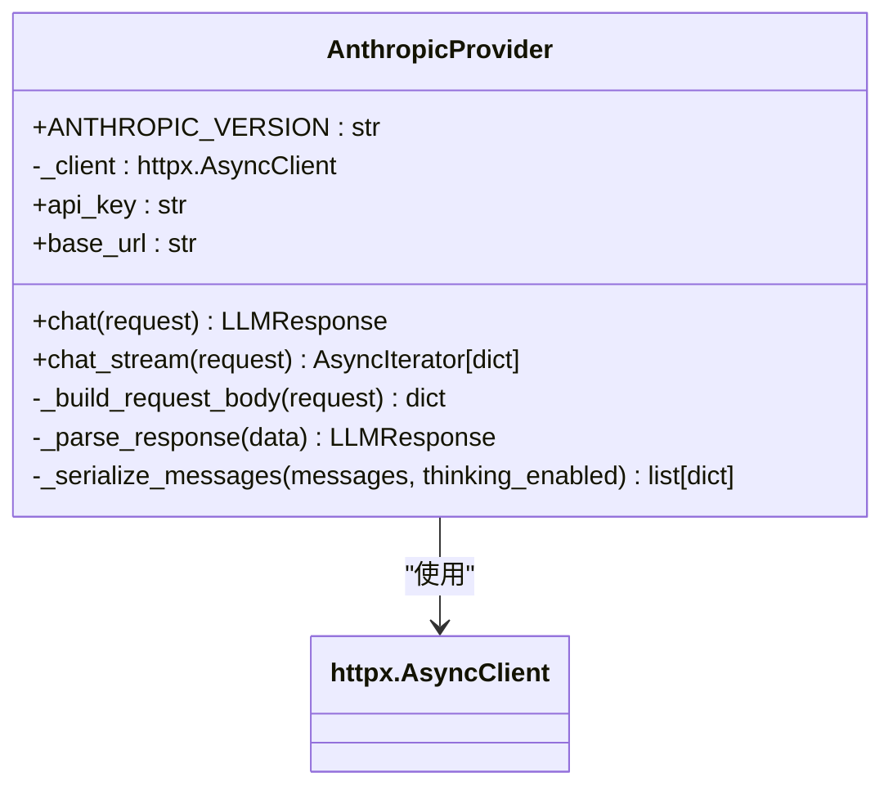
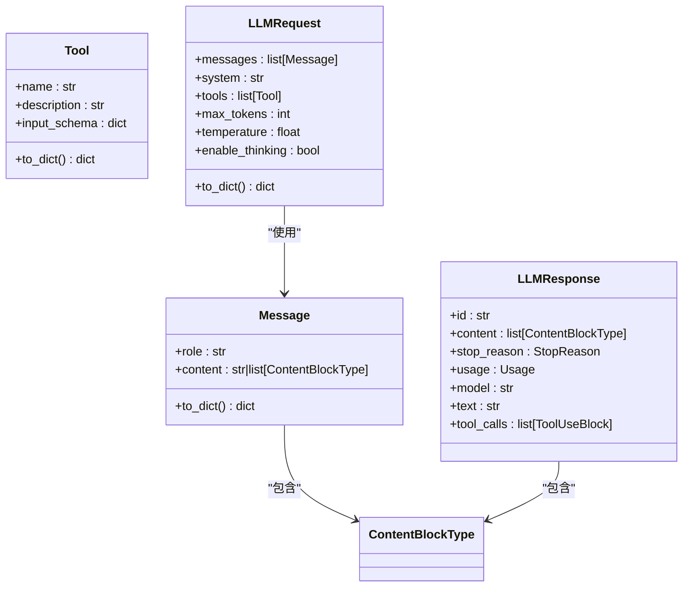
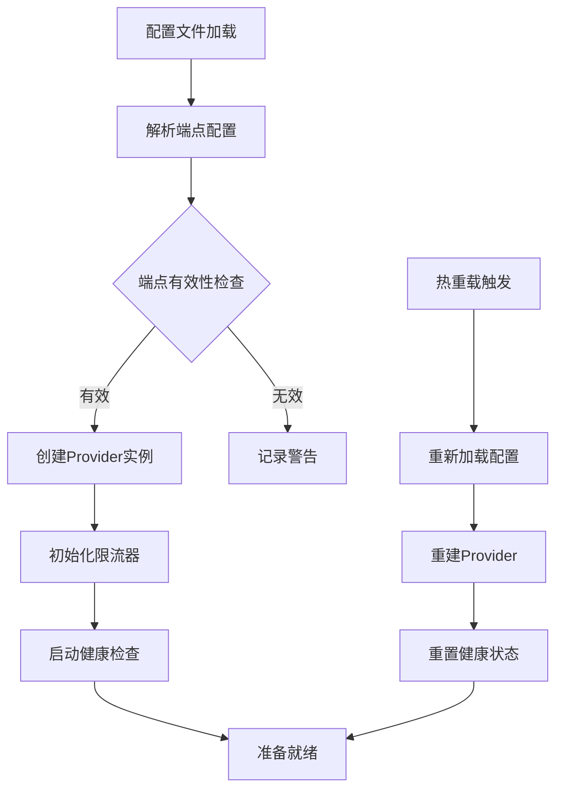
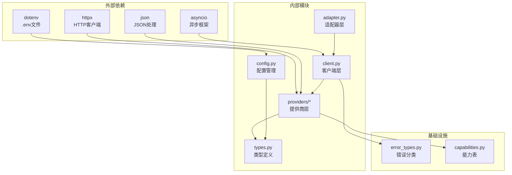
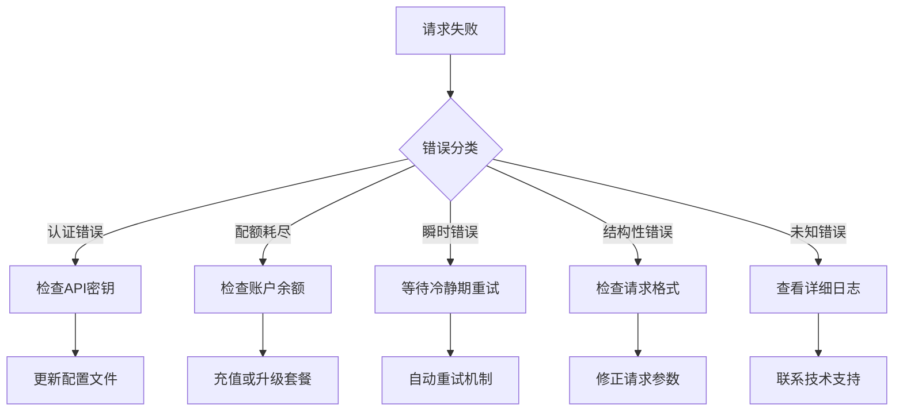

# LLM提供商适配器

<cite>
**本文档引用的文件**
- [adapter.py](file://src/synapse/llm/adapter.py)
- [client.py](file://src/synapse/llm/client.py)
- [base.py](file://src/synapse/llm/providers/base.py)
- [openai.py](file://src/synapse/llm/providers/openai.py)
- [anthropic.py](file://src/synapse/llm/providers/anthropic.py)
- [types.py](file://src/synapse/llm/types.py)
- [config.py](file://src/synapse/llm/config.py)
- [error_types.py](file://src/synapse/llm/error_types.py)
- [capabilities.py](file://src/synapse/llm/capabilities.py)
</cite>

## 目录
1. [简介](#简介)
2. [项目结构](#项目结构)
3. [核心组件](#核心组件)
4. [架构概览](#架构概览)
5. [详细组件分析](#详细组件分析)
6. [依赖关系分析](#依赖关系分析)
7. [性能考虑](#性能考虑)
8. [故障排除指南](#故障排除指南)
9. [结论](#结论)
10. [附录](#附录)

## 简介

LLM提供商适配器是OpenAkita平台的核心组件，负责统一管理和调度多个AI模型提供商的服务。该系统实现了高度模块化的架构设计，支持30+个主流AI提供商的无缝集成，包括OpenAI、Anthropic、DashScope、Google等。

该适配器系统的核心目标是：
- 提供统一的API接口，屏蔽不同提供商的差异
- 实现智能的故障转移和负载均衡
- 支持多模态内容处理（文本、图像、视频、音频）
- 提供完善的错误处理和重试机制
- 实现动态配置和热重载功能

## 项目结构

LLM提供商适配器位于`src/synapse/llm/`目录下，采用分层架构设计：



**图表来源**
- [adapter.py:1-237](file://src/synapse/llm/adapter.py#L1-L237)
- [client.py:1-800](file://src/synapse/llm/client.py#L1-L800)
- [base.py:1-485](file://src/synapse/llm/providers/base.py#L1-L485)

**章节来源**
- [adapter.py:1-237](file://src/synapse/llm/adapter.py#L1-L237)
- [client.py:1-800](file://src/synapse/llm/client.py#L1-L800)
- [base.py:1-485](file://src/synapse/llm/providers/base.py#L1-L485)

## 核心组件

### LLMAdapter适配器
LLMAdapter是向后兼容的适配器类，为旧版Brain类提供统一接口：



**图表来源**
- [adapter.py:44-237](file://src/synapse/llm/adapter.py#L44-L237)

### LLMClient统一客户端
LLMClient是系统的中央协调者，负责端点管理、故障转移和负载均衡：



**图表来源**
- [client.py:146-800](file://src/synapse/llm/client.py#L146-L800)

**章节来源**
- [adapter.py:44-237](file://src/synapse/llm/adapter.py#L44-L237)
- [client.py:146-800](file://src/synapse/llm/client.py#L146-L800)

## 架构概览

系统采用分层架构，实现了高度解耦的设计：



**图表来源**
- [adapter.py:68-120](file://src/synapse/llm/adapter.py#L68-L120)
- [client.py:351-408](file://src/synapse/llm/client.py#L351-L408)

### BaseProvider抽象机制

BaseProvider定义了所有提供商的统一接口和抽象机制：

```mermaid
classDiagram
class LLMProvider {
<<abstract>>
+config : EndpointConfig
+name : str
+model : str
+is_healthy : bool
+chat(request) LLMResponse
+chat_stream(request) AsyncIterator[dict]
+health_check(dry_run) bool
+supports_tools : bool
+supports_vision : bool
+supports_video : bool
+supports_thinking : bool
}
class RPMRateLimiter {
+acquire(endpoint_name) void
-_rpm : int
-_timestamps : deque
}
class LLMProvider <|-- OpenAIProvider
class LLMProvider <|-- AnthropicProvider
LLMProvider --> RPMRateLimiter : "使用"
```

**图表来源**
- [base.py:91-485](file://src/synapse/llm/providers/base.py#L91-L485)

**章节来源**
- [base.py:91-485](file://src/synapse/llm/providers/base.py#L91-L485)

## 详细组件分析

### OpenAI提供商实现

OpenAIProvider支持多种OpenAI兼容的提供商，包括官方OpenAI、DashScope、Kimi等：



**图表来源**
- [openai.py:74-1051](file://src/synapse/llm/providers/openai.py#L74-L1051)

#### OpenAI适配策略特点

1. **多提供商支持**：统一处理OpenAI官方、DashScope、Kimi、OpenRouter等
2. **智能流式检测**：自动检测仅支持流式的中转站
3. **跨域重定向处理**：解决API密钥在重定向时丢失的问题
4. **本地端点优化**：针对Ollama、LM Studio等本地推理引擎优化超时设置

**章节来源**
- [openai.py:74-1051](file://src/synapse/llm/providers/openai.py#L74-L1051)

### Anthropic提供商实现

AnthropicProvider专门处理Claude系列模型的API调用：



**图表来源**
- [anthropic.py:44-505](file://src/synapse/llm/providers/anthropic.py#L44-L505)

#### Anthropic适配策略特点

1. **Prompt缓存支持**：实现静态/动态内容分离的缓存机制
2. **思维链完整性**：支持MiniMax M2.1的交错思维模式
3. **工具调用解析**：支持文本格式工具调用的解析
4. **跨域认证处理**：解决重定向时的认证头问题

**章节来源**
- [anthropic.py:44-505](file://src/synapse/llm/providers/anthropic.py#L44-L505)

### 统一类型系统

系统采用统一的数据类型定义，确保不同提供商间的数据一致性：



**图表来源**
- [types.py:380-703](file://src/synapse/llm/types.py#L380-L703)

**章节来源**
- [types.py:380-703](file://src/synapse/llm/types.py#L380-L703)

### 配置管理系统

配置系统支持灵活的端点配置和动态管理：



**图表来源**
- [config.py:211-287](file://src/synapse/llm/config.py#L211-L287)

**章节来源**
- [config.py:211-287](file://src/synapse/llm/config.py#L211-L287)

## 依赖关系分析

系统采用松耦合设计，通过接口和抽象类实现模块间的解耦：



**图表来源**
- [client.py:25-49](file://src/synapse/llm/client.py#L25-L49)
- [openai.py:14-42](file://src/synapse/llm/providers/openai.py#L14-L42)

**章节来源**
- [client.py:25-49](file://src/synapse/llm/client.py#L25-L49)
- [openai.py:14-42](file://src/synapse/llm/providers/openai.py#L14-L42)

## 性能考虑

### 并发控制和限流

系统实现了多层次的性能优化机制：

1. **全局并发限制**：默认限制20个并发请求，防止事件循环过载
2. **RPM限流器**：基于滑动窗口的每分钟请求数限制
3. **智能重试退避**：指数退避结合随机抖动，避免雪崩效应
4. **流式处理优化**：支持SSE流式传输，减少内存占用

### 缓存和优化策略

1. **Prompt缓存**：Anthropic提供商支持静态/动态内容分离缓存
2. **工具调用缓存**：对工具定义进行缓存控制
3. **消息缓存断点**：对最近消息添加缓存控制标记
4. **成本优化**：基于阶梯定价的费用计算

## 故障排除指南

### 常见错误类型和处理



**图表来源**
- [base.py:167-286](file://src/synapse/llm/providers/base.py#L167-L286)

### 错误分类系统

系统使用统一的错误分类枚举：

| 错误类型 | 描述 | 处理策略 |
|---------|------|----------|
| QUOTA | 配额耗尽 | 需要充值或升级套餐 |
| AUTH | 认证失败 | 检查API密钥有效性 |
| TRANSIENT | 瞬时错误 | 等待后自动重试 |
| STRUCTURAL | 请求格式错误 | 修正请求参数 |
| UNKNOWN | 未知错误 | 查看详细日志 |

**章节来源**
- [error_types.py:13-25](file://src/synapse/llm/error_types.py#L13-L25)
- [base.py:167-286](file://src/synapse/llm/providers/base.py#L167-L286)

## 结论

LLM提供商适配器系统展现了优秀的软件工程实践：

1. **架构设计**：采用分层架构和抽象接口，实现了高度的模块化和可扩展性
2. **兼容性**：支持30+个主流AI提供商，提供统一的使用体验
3. **可靠性**：完善的错误处理、重试机制和健康检查
4. **性能**：多层次的性能优化，包括并发控制、缓存和流式处理
5. **易用性**：简洁的API设计和灵活的配置选项

该系统为AI应用的集成提供了坚实的基础，能够适应不断变化的AI生态和业务需求。

## 附录

### 新提供商接入最佳实践

1. **继承BaseProvider**：实现必需的抽象方法
2. **遵循统一类型**：使用系统定义的数据类型
3. **实现错误处理**：提供详细的错误分类和处理逻辑
4. **支持流式处理**：优先实现流式API调用
5. **配置能力表**：在capabilities.py中添加模型能力定义

### 配置示例

```json
{
    "endpoints": [
        {
            "name": "openai-gpt4",
            "provider": "openai",
            "api_type": "openai",
            "base_url": "https://api.openai.com",
            "api_key_env": "OPENAI_API_KEY",
            "model": "gpt-4",
            "priority": 1,
            "capabilities": ["text", "vision", "tools"],
            "timeout": 180
        }
    ],
    "settings": {
        "max_concurrent": 20,
        "retry_count": 2,
        "health_check_interval": 60
    }
}
```