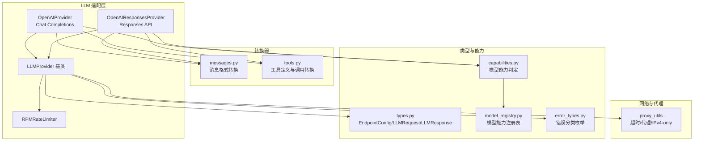
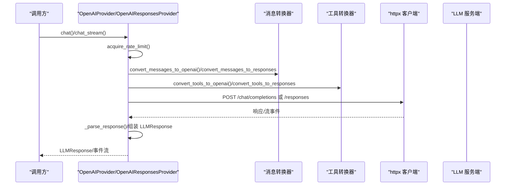
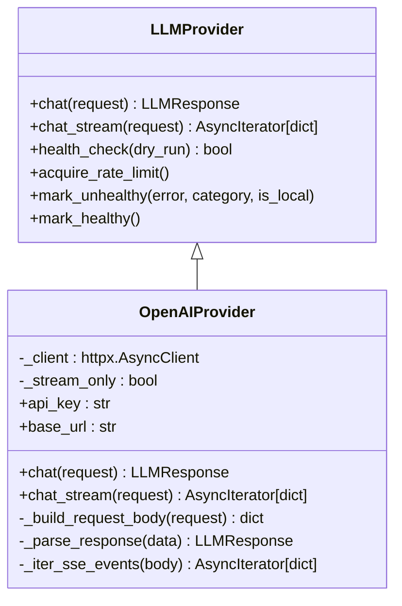
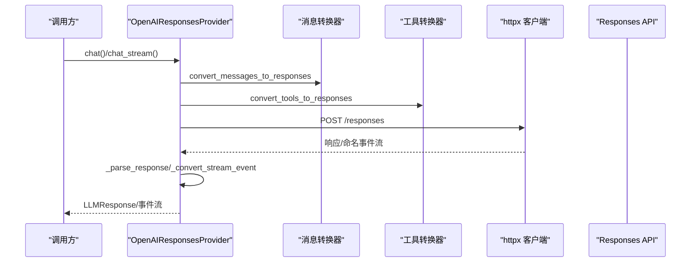
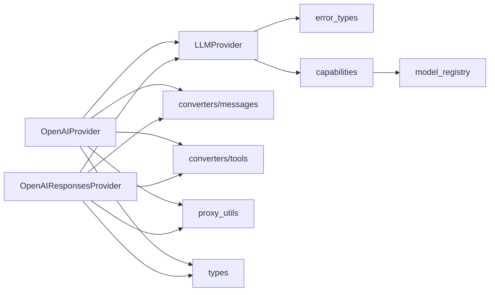

# OpenAI提供商

<cite>
**本文引用的文件**
- [openai.py](file://src/synapse/llm/providers/openai.py)
- [openai_responses.py](file://src/synapse/llm/providers/openai_responses.py)
- [base.py](file://src/synapse/llm/providers/base.py)
- [proxy_utils.py](file://src/synapse/llm/providers/proxy_utils.py)
- [messages.py](file://src/synapse/llm/converters/messages.py)
- [tools.py](file://src/synapse/llm/converters/tools.py)
- [types.py](file://src/synapse/llm/types.py)
- [error_types.py](file://src/synapse/llm/error_types.py)
- [model_registry.py](file://src/synapse/llm/model_registry.py)
- [capabilities.py](file://src/synapse/llm/capabilities.py)
</cite>

## 目录
1. [简介](#简介)
2. [项目结构](#项目结构)
3. [核心组件](#核心组件)
4. [架构总览](#架构总览)
5. [详细组件分析](#详细组件分析)
6. [依赖分析](#依赖分析)
7. [性能考虑](#性能考虑)
8. [故障排除指南](#故障排除指南)
9. [结论](#结论)
10. [附录](#附录)

## 简介
本文件面向OpenAI提供商适配器，系统性阐述其技术实现与工程细节，包括：
- 适配范围与认证机制
- 请求格式转换与参数映射
- GPT系列模型支持与能力判定
- 流式响应处理与错误码映射
- API密钥管理、速率限制与健康检查
- 配置示例与常见问题解答

该适配器支持多种OpenAI兼容端点（如OpenAI官方、DashScope、Kimi、OpenRouter、硅基流动、云雾API等），并提供Responses API适配器以覆盖更广泛的供应商生态。

## 项目结构
OpenAI适配器位于LLM子系统中，核心文件组织如下：
- 提供商适配器：OpenAIProvider（Chat Completions）、OpenAIResponsesProvider（Responses API）
- 基类与限流：LLMProvider、RPMRateLimiter
- 网络与代理：proxy_utils（超时、IPv4-only、代理可达性）
- 消息与工具转换：converters/messages、converters/tools
- 类型与能力：types、capabilities、model_registry
- 错误分类：error_types

图示来源
- [openai.py:74-100](file://src/synapse/llm/providers/openai.py#L74-L100)
- [openai_responses.py:42-63](file://src/synapse/llm/providers/openai_responses.py#L42-L63)
- [base.py:91-110](file://src/synapse/llm/providers/base.py#L91-L110)
- [proxy_utils.py:65-127](file://src/synapse/llm/providers/proxy_utils.py#L65-L127)
- [messages.py:49-92](file://src/synapse/llm/converters/messages.py#L49-L92)
- [tools.py:83-96](file://src/synapse/llm/converters/tools.py#L83-L96)
- [types.py:512-544](file://src/synapse/llm/types.py#L512-L544)
- [capabilities.py:998-1025](file://src/synapse/llm/capabilities.py#L998-L1025)
- [model_registry.py:168-203](file://src/synapse/llm/model_registry.py#L168-L203)
- [error_types.py:13-25](file://src/synapse/llm/error_types.py#L13-L25)

章节来源
- [openai.py:1-120](file://src/synapse/llm/providers/openai.py#L1-L120)
- [openai_responses.py:1-60](file://src/synapse/llm/providers/openai_responses.py#L1-L60)
- [base.py:19-485](file://src/synapse/llm/providers/base.py#L19-L485)
- [proxy_utils.py:1-388](file://src/synapse/llm/providers/proxy_utils.py#L1-L388)
- [messages.py:1-200](file://src/synapse/llm/converters/messages.py#L1-L200)
- [tools.py:1-200](file://src/synapse/llm/converters/tools.py#L1-L200)
- [types.py:1-200](file://src/synapse/llm/types.py#L1-L200)
- [error_types.py:1-25](file://src/synapse/llm/error_types.py#L1-L25)
- [model_registry.py:1-218](file://src/synapse/llm/model_registry.py#L1-L218)
- [capabilities.py:991-1025](file://src/synapse/llm/capabilities.py#L991-L1025)

## 核心组件
- OpenAIProvider：统一适配OpenAI风格API（Chat Completions），支持非流式与流式两种调用路径；内置stream-only自动检测与降级。
- OpenAIResponsesProvider：适配Responses API，覆盖输入/输出结构差异、命名事件流式解析与超时估算。
- LLMProvider/RPMRateLimiter：统一的健康检查、错误分类与RPM限流。
- proxy_utils：统一的超时构造、代理可达性检测、IPv4-only支持。
- 消息与工具转换器：将内部格式（Anthropic-like）转换为OpenAI/Responses所需格式，并处理工具调用与文本工具调用降级解析。
- 类型与能力：EndpointConfig、LLMRequest/LLMResponse、StopReason、Usage等；能力判定与模型注册表。

章节来源
- [openai.py:74-504](file://src/synapse/llm/providers/openai.py#L74-L504)
- [openai_responses.py:42-321](file://src/synapse/llm/providers/openai_responses.py#L42-L321)
- [base.py:91-485](file://src/synapse/llm/providers/base.py#L91-L485)
- [proxy_utils.py:65-331](file://src/synapse/llm/providers/proxy_utils.py#L65-L331)
- [messages.py:49-200](file://src/synapse/llm/converters/messages.py#L49-L200)
- [tools.py:83-200](file://src/synapse/llm/converters/tools.py#L83-L200)
- [types.py:35-200](file://src/synapse/llm/types.py#L35-L200)
- [capabilities.py:998-1025](file://src/synapse/llm/capabilities.py#L998-L1025)
- [model_registry.py:168-203](file://src/synapse/llm/model_registry.py#L168-L203)

## 架构总览
OpenAI适配器遵循“基类抽象 + 具体提供商 + 转换器 + 网络工具”的分层设计。调用流程概览：

图示来源
- [openai.py:221-316](file://src/synapse/llm/providers/openai.py#L221-L316)
- [openai.py:506-514](file://src/synapse/llm/providers/openai.py#L506-L514)
- [openai_responses.py:101-173](file://src/synapse/llm/providers/openai_responses.py#L101-L173)
- [openai_responses.py:512-519](file://src/synapse/llm/providers/openai_responses.py#L512-L519)
- [messages.py:49-92](file://src/synapse/llm/converters/messages.py#L49-L92)
- [tools.py:83-96](file://src/synapse/llm/converters/tools.py#L83-L96)

## 详细组件分析

### OpenAIProvider（Chat Completions）
- 认证与头部：支持Bearer Token认证；对跨域重定向场景使用httpx.Auth确保Authorization持久附加；OpenRouter特例添加HTTP-Referer与X-Title。
- 请求体构建：消息转换、工具定义、温度、停止序列、额外参数；针对不同服务商的思考模式参数差异化处理（enable_thinking、thinking、reasoning_effort、thinking_budget等）；对本地端点（Ollama/LM Studio）进行参数清理与兼容。
- 超时与动态调整：基于请求体字符估算上下文规模，按比例放大read超时，避免大上下文场景频繁超时；本地端点自动增加read超时。
- 非流式与流式：非流式路径解析choices；流式路径解析SSE事件，统一转换为内部事件格式；支持stream-only端点自动检测与降级。
- 健康检查与错误分类：统一的错误分类（配额、认证、结构性、瞬时、未知）；健康/冷静期管理；RPM限流。

图示来源
- [base.py:91-431](file://src/synapse/llm/providers/base.py#L91-L431)
- [openai.py:74-504](file://src/synapse/llm/providers/openai.py#L74-L504)

章节来源
- [openai.py:57-72](file://src/synapse/llm/providers/openai.py#L57-L72)
- [openai.py:98-180](file://src/synapse/llm/providers/openai.py#L98-L180)
- [openai.py:182-220](file://src/synapse/llm/providers/openai.py#L182-L220)
- [openai.py:221-316](file://src/synapse/llm/providers/openai.py#L221-L316)
- [openai.py:326-425](file://src/synapse/llm/providers/openai.py#L326-L425)
- [openai.py:426-504](file://src/synapse/llm/providers/openai.py#L426-L504)
- [openai.py:528-568](file://src/synapse/llm/providers/openai.py#L528-L568)
- [openai.py:570-797](file://src/synapse/llm/providers/openai.py#L570-L797)
- [openai.py:799-800](file://src/synapse/llm/providers/openai.py#L799-L800)

### OpenAIResponsesProvider（Responses API）
- 端点与请求体：/responses端点；input/items + instructions；max_output_tokens；store=false；reasoning（effort）。
- 响应解析：output.items（message、function_call）；失败状态与错误事件；Usage统计。
- 流式事件：命名事件（response.output_text.delta、response.function_call_arguments.delta等）转换为统一内部事件；错误事件统一上报。
- 超时估算：基于input items字符估算，适配Responses API的上下文结构。

图示来源
- [openai_responses.py:42-55](file://src/synapse/llm/providers/openai_responses.py#L42-L55)
- [openai_responses.py:64-99](file://src/synapse/llm/providers/openai_responses.py#L64-L99)
- [openai_responses.py:101-173](file://src/synapse/llm/providers/openai_responses.py#L101-L173)
- [openai_responses.py:189-256](file://src/synapse/llm/providers/openai_responses.py#L189-L256)
- [openai_responses.py:258-321](file://src/synapse/llm/providers/openai_responses.py#L258-L321)
- [openai_responses.py:323-404](file://src/synapse/llm/providers/openai_responses.py#L323-L404)
- [openai_responses.py:406-510](file://src/synapse/llm/providers/openai_responses.py#L406-L510)

章节来源
- [openai_responses.py:42-321](file://src/synapse/llm/providers/openai_responses.py#L42-L321)
- [openai_responses.py:323-404](file://src/synapse/llm/providers/openai_responses.py#L323-L404)
- [openai_responses.py:406-510](file://src/synapse/llm/providers/openai_responses.py#L406-L510)

### 认证与密钥管理
- Bearer Token：通过httpx.Auth或请求头注入；跨域重定向场景使用Auth确保凭证不丢失。
- 环境变量与明文密钥：优先使用环境变量名（api_key_env），不保存明文到配置；本地端点可使用“local”占位。
- OpenRouter特例：添加HTTP-Referer与X-Title头。

章节来源
- [openai.py:57-72](file://src/synapse/llm/providers/openai.py#L57-L72)
- [openai.py:528-568](file://src/synapse/llm/providers/openai.py#L528-L568)
- [openai.py:564-567](file://src/synapse/llm/providers/openai.py#L564-L567)

### 请求格式转换与参数映射
- 消息转换：将内部Message（含TextBlock/ImageBlock/VideoBlock/ToolUseBlock/ToolResultBlock等）转换为OpenAI/Responses格式；支持reasoning_content注入与清理。
- 工具转换：function工具定义与调用；文本工具调用降级解析（parse_text_tool_calls）。
- 参数映射：
  - Chat Completions：max_tokens/max_completion_tokens（o1/o3/o4推理模型使用后者）；temperature；stop；tools/tool_choice。
  - Responses API：max_output_tokens；store=false；reasoning.effort。
  - 思考模式：enable_thinking、thinking（enable/disable）、reasoning_effort、thinking_budget；不同服务商差异化处理。
- 本地端点清理：移除本地引擎不支持的参数（如thinking、thinking_budget、reasoning_effort）。

章节来源
- [messages.py:49-200](file://src/synapse/llm/converters/messages.py#L49-L200)
- [tools.py:83-200](file://src/synapse/llm/converters/tools.py#L83-L200)
- [openai.py:607-797](file://src/synapse/llm/providers/openai.py#L607-L797)
- [openai_responses.py:205-256](file://src/synapse/llm/providers/openai_responses.py#L205-L256)

### 流式响应处理
- SSE解析：逐行读取data:行，解析事件；OpenAI路径统一为content_block_delta/message_stop；Responses API路径将命名事件转换为统一格式。
- 错误处理：SSE中错误事件与HTTP错误统一转换为LLMError；空流响应标记为不健康。
- 流式选项：OpenAI路径默认include_usage；Responses API路径按命名事件处理。

章节来源
- [openai.py:326-425](file://src/synapse/llm/providers/openai.py#L326-L425)
- [openai.py:426-504](file://src/synapse/llm/providers/openai.py#L426-L504)
- [openai_responses.py:323-404](file://src/synapse/llm/providers/openai_responses.py#L323-L404)
- [openai_responses.py:406-510](file://src/synapse/llm/providers/openai_responses.py#L406-L510)

### 错误码映射与健康检查
- 错误分类：配额（quota）、认证（auth）、结构性（structural）、瞬时（transient）、未知（unknown）。
- 健康检查：发送简单请求；dry_run模式仅检测不修改状态。
- 冷静期：按错误类型与连续失败次数递增；支持扩展冷静期与重置。

章节来源
- [base.py:167-286](file://src/synapse/llm/providers/base.py#L167-L286)
- [base.py:324-405](file://src/synapse/llm/providers/base.py#L324-L405)
- [base.py:433-462](file://src/synapse/llm/providers/base.py#L433-L462)
- [error_types.py:13-25](file://src/synapse/llm/error_types.py#L13-L25)

### 速率限制与网络配置
- RPM限流：滑动窗口60秒，队列deque维护时间戳，acquire阻塞至配额可用。
- 超时构造：支持数值与字典两种形式；默认connect/read/write/pool合理分配。
- 代理与IPv4-only：统一代理检测与可达性验证；FORCE_IPV4启用IPv4-only传输；trust_env=False避免系统代理干扰。

章节来源
- [base.py:19-70](file://src/synapse/llm/providers/base.py#L19-L70)
- [proxy_utils.py:65-127](file://src/synapse/llm/providers/proxy_utils.py#L65-L127)
- [proxy_utils.py:204-247](file://src/synapse/llm/providers/proxy_utils.py#L204-L247)
- [proxy_utils.py:269-287](file://src/synapse/llm/providers/proxy_utils.py#L269-L287)

### GPT系列模型支持与能力判定
- 能力判定：优先用户配置capabilities，其次基于extra_params/model名推断；支持“思考模型”（thinking-only）与双模模型（enable_thinking）区分。
- 模型注册表：集中管理上下文窗口、最大输出、默认输出、思考预算范围等元数据；支持运行时注册。
- 推理模型特殊处理：o1/o3/o4系列模型拒绝max_tokens，使用max_completion_tokens；OpenAI原生推理模型支持reasoning_effort。

章节来源
- [capabilities.py:998-1025](file://src/synapse/llm/capabilities.py#L998-L1025)
- [model_registry.py:168-203](file://src/synapse/llm/model_registry.py#L168-L203)
- [openai.py:607-614](file://src/synapse/llm/providers/openai.py#L607-L614)

## 依赖分析
- 组件耦合：OpenAIProvider与OpenAIResponsesProvider均依赖LLMProvider基类、消息/工具转换器、proxy_utils与types。
- 外部依赖：httpx（异步HTTP客户端）、json（SSE事件解析）、asyncio（事件循环与锁）。
- 可能的循环依赖：未见直接循环导入；各模块职责清晰，通过类型与接口解耦。

图示来源
- [openai.py:21-42](file://src/synapse/llm/providers/openai.py#L21-L42)
- [openai_responses.py:19-37](file://src/synapse/llm/providers/openai_responses.py#L19-L37)
- [base.py:14-16](file://src/synapse/llm/providers/base.py#L14-L16)
- [error_types.py:10-11](file://src/synapse/llm/error_types.py#L10-L11)
- [capabilities.py:998-1025](file://src/synapse/llm/capabilities.py#L998-L1025)
- [model_registry.py:168-203](file://src/synapse/llm/model_registry.py#L168-L203)

章节来源
- [openai.py:21-42](file://src/synapse/llm/providers/openai.py#L21-L42)
- [openai_responses.py:19-37](file://src/synapse/llm/providers/openai_responses.py#L19-L37)
- [base.py:14-16](file://src/synapse/llm/providers/base.py#L14-L16)

## 性能考虑
- 大上下文超时：根据请求体字符估算token数量，按比例放大read超时，上限9分钟，避免频繁超时导致无效重试。
- 本地端点优化：本地推理（Ollama/LM Studio）自动增加read超时至300s，缓解CPU/GPU资源瓶颈。
- 流式优先：Responses API与stream-only端点通过流式传输降低首包延迟与内存占用。
- 限流与健康：RPM限流与健康检查减少无效请求，提升整体吞吐稳定性。

章节来源
- [openai.py:182-220](file://src/synapse/llm/providers/openai.py#L182-L220)
- [openai.py:132-147](file://src/synapse/llm/providers/openai.py#L132-L147)
- [openai_responses.py:64-99](file://src/synapse/llm/providers/openai_responses.py#L64-L99)

## 故障排除指南
- 认证失败（401/403）：检查api_key_env与环境变量是否设置；确认OpenRouter所需的HTTP-Referer/X-Title头是否正确。
- 速率限制（429）：启用RPM限流；观察冷静期日志；必要时降低并发或提高rpm_limit。
- 结构性错误（400/413）：检查请求体字段合法性（max_tokens/max_completion_tokens、stop、工具定义等）；本地端点清理不支持参数。
- 瞬时错误（超时/连接失败）：检查代理可达性；启用FORCE_IPV4；增大超时或重试策略。
- Responses API失败：确认output存在；检查reasoning.effort与store=false；关注命名事件错误。
- stream-only端点：自动检测并降级为流式；若持续失败，检查上游网关是否强制要求stream=true。

章节来源
- [openai.py:260-325](file://src/synapse/llm/providers/openai.py#L260-L325)
- [openai.py:415-424](file://src/synapse/llm/providers/openai.py#L415-L424)
- [openai_responses.py:123-187](file://src/synapse/llm/providers/openai_responses.py#L123-L187)
- [openai_responses.py:425-510](file://src/synapse/llm/providers/openai_responses.py#L425-L510)
- [proxy_utils.py:204-247](file://src/synapse/llm/providers/proxy_utils.py#L204-L247)

## 结论
OpenAI提供商适配器通过统一的基类抽象、完善的转换器体系与稳健的网络/限流/健康机制，实现了对多种OpenAI兼容端点的广泛支持。其对流式传输、大上下文、思考模式与工具调用的差异化处理，使其在复杂生产环境中具备良好的稳定性与可维护性。

## 附录

### 配置示例（要点）
- EndpointConfig关键字段
  - name/provider/base_url/model/priority
  - api_key_env/api_key（优先使用环境变量名）
  - max_tokens/context_window/timeout/rpm_limit
  - capabilities（如["text","tools","vision","thinking"]）
  - extra_params（服务商特定参数）
  - note/stream_only（仅流式端点）

章节来源
- [types.py:512-641](file://src/synapse/llm/types.py#L512-L641)

### 常见问题与解决方案
- 为什么Responses API返回空output？
  - 检查input/items与instructions是否正确；确认store=false；关注failed/incomplete状态。
- 为什么本地端点超时频繁？
  - 自动增加read超时至300s；检查CPU/GPU资源；必要时降低并发。
- 为什么工具调用参数被截断？
  - 使用JSON修复策略；缩短参数或拆分调用；查看data/llm_debug诊断文件。
- 如何启用思考模式？
  - 根据服务商选择enable_thinking/thinking/reasoning_effort/thinking_budget；注意本地端点与特定模型的限制。

章节来源
- [openai_responses.py:155-169](file://src/synapse/llm/providers/openai_responses.py#L155-L169)
- [openai.py:642-797](file://src/synapse/llm/providers/openai.py#L642-L797)
- [tools.py:26-72](file://src/synapse/llm/converters/tools.py#L26-L72)