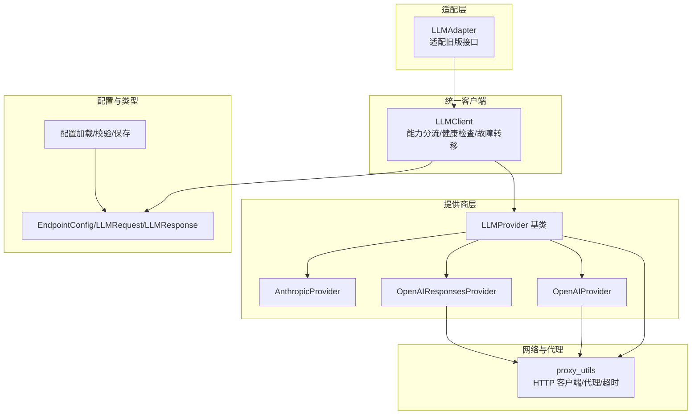
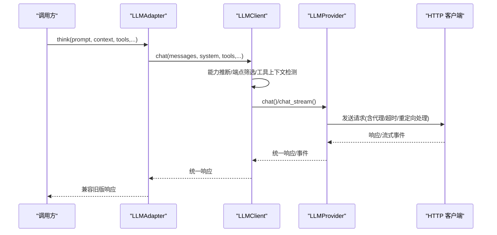
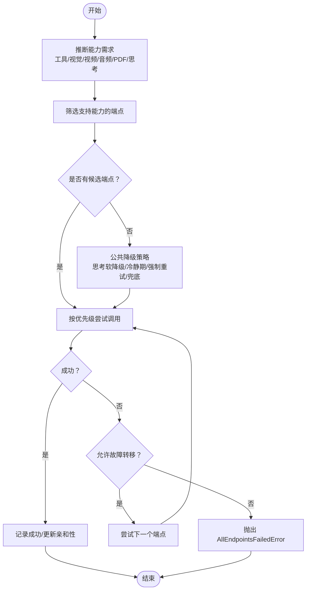
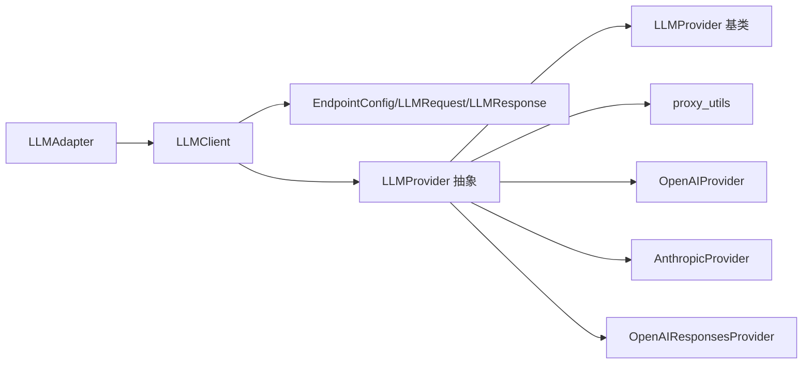

# 其他提供商

<cite>
**本文档引用的文件**
- [adapter.py](file://src/synapse/llm/adapter.py)
- [client.py](file://src/synapse/llm/client.py)
- [config.py](file://src/synapse/llm/config.py)
- [types.py](file://src/synapse/llm/types.py)
- [base.py](file://src/synapse/llm/providers/base.py)
- [anthropic.py](file://src/synapse/llm/providers/anthropic.py)
- [openai.py](file://src/synapse/llm/providers/openai.py)
- [openai_responses.py](file://src/synapse/llm/providers/openai_responses.py)
</cite>

## 目录
1. [简介](#简介)
2. [项目结构](#项目结构)
3. [核心组件](#核心组件)
4. [架构总览](#架构总览)
5. [详细组件分析](#详细组件分析)
6. [依赖分析](#依赖分析)
7. [性能考虑](#性能考虑)
8. [故障排查指南](#故障排查指南)
9. [结论](#结论)
10. [附录](#附录)

## 简介
本文件面向希望为其他 LLM 提供商（如 DashScope、DeepSeek、Kimi、MiniMax、OpenRouter、SiliconFlow、Volcengine、Zhipu 等）接入 Synapse 的开发者，系统性阐述统一适配层的设计与实现，涵盖：
- 适配器与客户端的整体架构
- 各提供商的特性差异与参数映射
- 认证方式与代理工具类的使用
- 统一配置管理与动态注册机制
- 新提供商接入的完整流程与最佳实践

## 项目结构
围绕 LLM 适配的核心模块如下：
- 适配层：对外提供统一接口，兼容旧版 Brain 类
- 客户端：统一调度、能力分流、健康检查与故障转移
- 提供商基类与具体实现：抽象统一接口，封装各平台差异
- 配置与类型：端点配置、能力标注、统一数据结构
- 代理工具：网络与代理配置、超时与重试

图示来源
- [adapter.py:1-237](file://src/synapse/llm/adapter.py#L1-L237)
- [client.py:146-513](file://src/synapse/llm/client.py#L146-L513)
- [base.py:91-485](file://src/synapse/llm/providers/base.py#L91-L485)
- [anthropic.py:44-505](file://src/synapse/llm/providers/anthropic.py#L44-L505)
- [openai.py:74-1051](file://src/synapse/llm/providers/openai.py#L74-L1051)
- [openai_responses.py:42-519](file://src/synapse/llm/providers/openai_responses.py#L42-L519)
- [config.py:211-287](file://src/synapse/llm/config.py#L211-L287)
- [types.py:491-661](file://src/synapse/llm/types.py#L491-L661)

章节来源
- [adapter.py:1-237](file://src/synapse/llm/adapter.py#L1-L237)
- [client.py:146-513](file://src/synapse/llm/client.py#L146-L513)
- [base.py:91-485](file://src/synapse/llm/providers/base.py#L91-L485)
- [config.py:211-287](file://src/synapse/llm/config.py#L211-L287)
- [types.py:491-661](file://src/synapse/llm/types.py#L491-L661)

## 核心组件
- LLMAdapter：为旧版 Brain 提供向后兼容接口，内部委托 LLMClient 完成统一调用
- LLMClient：统一入口，负责端点筛选、能力分流、健康检查、故障转移、并发控制与可观测性
- LLMProvider 基类：定义统一接口与健康/冷静期管理、RPM 限流、错误分类与自愈
- 具体提供商：Anthropic、OpenAI 兼容族（含 DashScope、Kimi、OpenRouter、SiliconFlow、Volcengine、Zhipu 等）
- 配置与类型：EndpointConfig、LLMRequest/LLMResponse、能力标注与统一数据结构
- 代理工具：HTTP 客户端、代理配置、IPv4 传输、超时与重定向处理

章节来源
- [adapter.py:44-237](file://src/synapse/llm/adapter.py#L44-L237)
- [client.py:146-800](file://src/synapse/llm/client.py#L146-L800)
- [base.py:91-485](file://src/synapse/llm/providers/base.py#L91-L485)
- [types.py:415-490](file://src/synapse/llm/types.py#L415-L490)

## 架构总览
统一客户端根据请求能力需求与端点能力进行筛选，并在失败时进行多级降级与冷却恢复。提供商层通过统一接口屏蔽差异，支持流式与非流式两种调用路径。

图示来源
- [adapter.py:68-120](file://src/synapse/llm/adapter.py#L68-L120)
- [client.py:351-513](file://src/synapse/llm/client.py#L351-L513)
- [base.py:407-431](file://src/synapse/llm/providers/base.py#L407-L431)

## 详细组件分析

### 适配层：LLMAdapter
- 职责：将旧版 Brain 接口转换为新式 LLMClient 调用，兼容消息/工具/响应格式
- 关键点：
  - 将旧版 LegacyContext/LegacyResponse 转换为新式 Message/Tool/LLMResponse
  - 通过 LLMClient.chat/chat_stream 完成统一调用
  - 保留 max_tokens、enable_thinking 等参数映射

章节来源
- [adapter.py:44-237](file://src/synapse/llm/adapter.py#L44-L237)

### 统一客户端：LLMClient
- 职责：端点管理、能力分流、健康检查、故障转移、并发控制、动态切换
- 关键点：
  - 端点筛选：根据工具、视觉、视频、音频、PDF、思考等能力需求过滤
  - 工具上下文检测：为保证思维链连续性，默认禁用跨端点故障转移
  - 公共降级策略：思考软降级、冷静期等待、强制重试、最终兜底
  - 并发控制：全局信号量限制同时请求数
  - 动态切换：临时覆盖端点，支持按对话隔离
  - 插件注册：通过 PLUGIN_PROVIDER_MAP 动态注册第三方提供商

图示来源
- [client.py:409-513](file://src/synapse/llm/client.py#L409-L513)
- [client.py:740-800](file://src/synapse/llm/client.py#L740-L800)

章节来源
- [client.py:146-800](file://src/synapse/llm/client.py#L146-L800)

### 提供商基类：LLMProvider
- 职责：定义统一接口，实现健康检查、错误分类、冷静期、RPM 限流与自愈
- 关键点：
  - 错误分类：配额、认证、结构性、瞬时、未知
  - 渐进式冷静期：连续失败按步长递增，支持配额/认证专用升级
  - RPM 限流：滑动窗口 + 事件循环绑定
  - 能力属性：supports_tools/vision/video/thinking

章节来源
- [base.py:91-485](file://src/synapse/llm/providers/base.py#L91-L485)

### Anthropic 提供商：AnthropicProvider
- 特色功能：
  - Prompt Cache：静态/动态系统提示分块，启用跨轮缓存
  - 思考增强：Extended Thinking，支持 budget_tokens 与温度调整
  - 流式 SSE：规范解析，资源清理
  - 文本格式工具调用：解析 <minimax:tool_call> 等兼容格式
- 认证与代理：支持本地端点与跨主机重定向的凭据重附
- 参数差异：
  - 思考：thinking: {"type": "enabled"/"disabled"} + budget_tokens
  - 系统提示：支持 cache_control 标记
  - 工具：按模型能力排序并缓存稳定

章节来源
- [anthropic.py:44-505](file://src/synapse/llm/providers/anthropic.py#L44-L505)

### OpenAI 兼容提供商：OpenAIProvider
- 支持范围：OpenAI、DashScope、Kimi、OpenRouter、SiliconFlow、Volcengine、Zhipu 等
- 特色功能：
  - 流式/非流式自动切换：检测 stream-only 端点并降级
  - 思考模式差异化：
    - DashScope：enable_thinking + thinking_budget
    - SiliconFlow：两类模型区分（双模/思考-only），分别处理 enable_thinking 与 thinking_budget
    - OpenRouter：reasoning: {"effort": ...}
    - 其他兼容端点：thinking: {"type": "enabled"/"disabled"} + reasoning_effort
  - 本地端点优化：Ollama 等本地推理引擎的超时与参数适配
- 认证与代理：Bearer Auth 重定向安全、代理显式管理、IPv4 传输
- 参数差异：
  - 推理模型（o1/o3/o4）：max_completion_tokens 替代 max_tokens
  - 工具：OpenAI 风格 tools/tool_choice，或服务商特定格式

章节来源
- [openai.py:74-1051](file://src/synapse/llm/providers/openai.py#L74-L1051)

### OpenAI Responses API：OpenAIResponsesProvider
- 适用场景：Responses API（非 chat/completions）
- 差异点：
  - 输入：input(items) + instructions
  - 输出：output(items) 而非 choices
  - 工具：internally-tagged，strict 默认开启
  - 流式事件：命名事件（response.output_text.delta 等）
- 适配策略：覆写端点、请求体、响应解析与流式事件转换

章节来源
- [openai_responses.py:42-519](file://src/synapse/llm/providers/openai_responses.py#L42-L519)

### 统一配置与类型
- EndpointConfig：端点名称、提供商标识、API 类型、base_url、API Key、模型、优先级、能力、额外参数、定价等
- LLMRequest/LLMResponse：统一消息、工具、内容块、停止原因、用量统计
- 配置加载：支持 .env 注入、默认路径发现、校验与保存

章节来源
- [types.py:415-490](file://src/synapse/llm/types.py#L415-L490)
- [types.py:491-661](file://src/synapse/llm/types.py#L491-L661)
- [config.py:211-287](file://src/synapse/llm/config.py#L211-L287)

## 依赖分析
- 组件耦合：
  - LLMAdapter 依赖 LLMClient
  - LLMClient 依赖 LLMProvider 抽象与 EndpointConfig
  - 具体提供商依赖代理工具与转换器
- 外部依赖：
  - HTTP 客户端（httpx）、SSE 解析、环境变量加载（python-dotenv）

图示来源
- [adapter.py:10-20](file://src/synapse/llm/adapter.py#L10-L20)
- [client.py:25-49](file://src/synapse/llm/client.py#L25-L49)
- [base.py:14](file://src/synapse/llm/providers/base.py#L14)
- [openai.py:39-42](file://src/synapse/llm/providers/openai.py#L39-L42)
- [anthropic.py:38-39](file://src/synapse/llm/providers/anthropic.py#L38-L39)
- [openai_responses.py:37](file://src/synapse/llm/providers/openai_responses.py#L37)

章节来源
- [adapter.py:10-20](file://src/synapse/llm/adapter.py#L10-L20)
- [client.py:25-49](file://src/synapse/llm/client.py#L25-L49)
- [base.py:14](file://src/synapse/llm/providers/base.py#L14)

## 性能考虑
- 并发控制：全局信号量限制同时请求数，避免并发风暴
- 冷静期与渐进退避：减少对故障端点的无效重试
- 流式传输：降低首字节延迟，提升交互体验
- 本地端点优化：延长读超时，避免误判为故障
- 请求体卫生检查：防止 extra_params 覆盖关键字段导致无效请求

## 故障排查指南
- 常见错误分类与提示：
  - 认证失败：检查 API Key 与环境变量
  - 配额耗尽：等待冷却或充值
  - 结构性错误：检查请求格式与模型兼容性
  - 瞬时错误：检查网络与代理设置
- 友好提示生成：根据失败端点错误类别汇总用户提示
- 健康检查：启动时对端点进行轻量健康检查，认证失败永久跳过直至重载

章节来源
- [client.py:54-83](file://src/synapse/llm/client.py#L54-L83)
- [client.py:271-307](file://src/synapse/llm/client.py#L271-L307)
- [base.py:324-405](file://src/synapse/llm/providers/base.py#L324-L405)

## 结论
通过统一适配层与客户端，Synapse 能够以最小成本接入多家提供商，同时保证一致性与可靠性。新提供商接入的关键在于：
- 实现 LLMProvider 接口，完善错误分类与健康状态
- 在配置中声明能力与额外参数，确保能力分流与参数映射正确
- 使用代理工具类与统一类型，减少网络与格式差异带来的复杂度
- 通过插件注册机制实现动态扩展

## 附录

### 为其他提供商接入的完整流程与最佳实践
- 第一步：定义端点配置
  - 在配置文件中新增 EndpointConfig，设置 provider、api_type、base_url、API Key、模型、优先级与能力
  - 如需思考/工具/视觉等能力，在 capabilities 中声明
- 第二步：实现提供商适配
  - 继承 LLMProvider，实现 chat 与 chat_stream
  - 在请求体构建中处理各平台参数差异（如思考模式、工具格式、最大输出等）
  - 在响应解析中统一为 LLMResponse
- 第三步：集成与测试
  - 将提供商注册到 LLMClient（可通过插件注册表或内置映射）
  - 启动健康检查，验证认证与网络连通性
  - 进行端到端测试，覆盖流式与非流式、工具调用、多模态等场景
- 第四步：上线与运维
  - 配置冷静期与重试策略，观察错误分类与恢复情况
  - 使用统一配置管理，支持热重载与动态切换
  - 监控并发与用量，结合 RPM 限流与配额策略

章节来源
- [config.py:211-287](file://src/synapse/llm/config.py#L211-L287)
- [client.py:309-340](file://src/synapse/llm/client.py#L309-L340)
- [base.py:407-431](file://src/synapse/llm/providers/base.py#L407-L431)