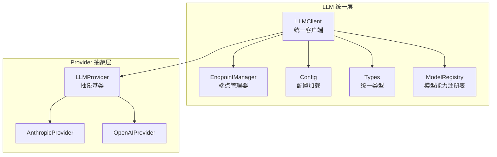
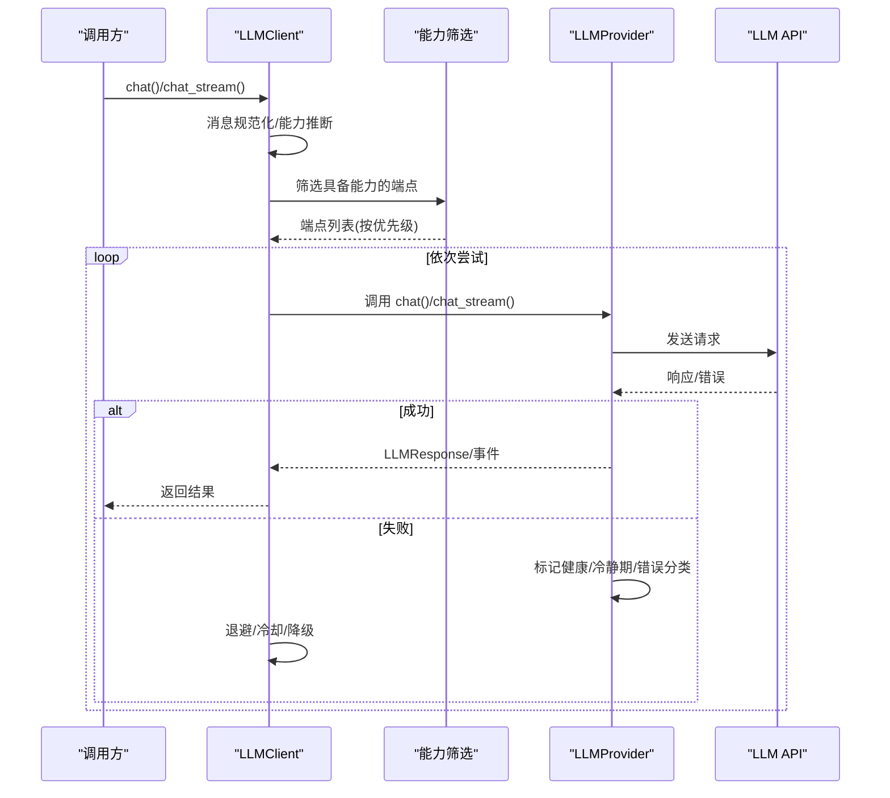
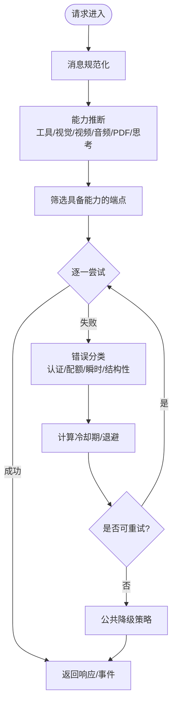
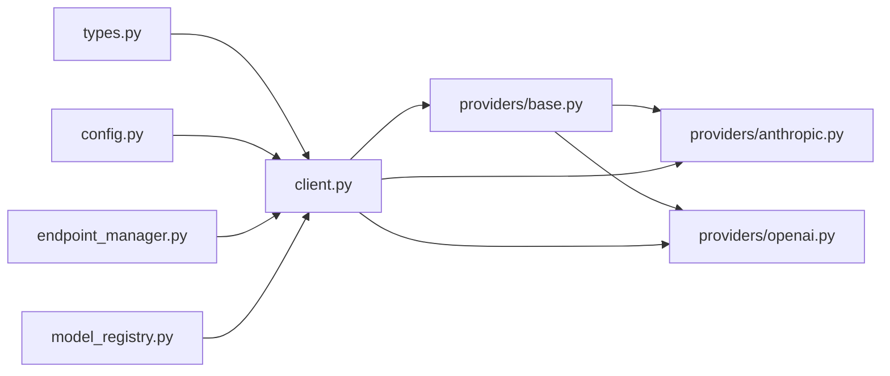

# 大语言模型集成

<cite>
**本文引用的文件**
- [src/synapse/llm/__init__.py](file://src/synapse/llm/__init__.py)
- [src/synapse/llm/client.py](file://src/synapse/llm/client.py)
- [src/synapse/llm/config.py](file://src/synapse/llm/config.py)
- [src/synapse/llm/model_registry.py](file://src/synapse/llm/model_registry.py)
- [src/synapse/llm/endpoint_manager.py](file://src/synapse/llm/endpoint_manager.py)
- [src/synapse/llm/providers/base.py](file://src/synapse/llm/providers/base.py)
- [src/synapse/llm/providers/anthropic.py](file://src/synapse/llm/providers/anthropic.py)
- [src/synapse/llm/providers/openai.py](file://src/synapse/llm/providers/openai.py)
- [src/synapse/llm/types.py](file://src/synapse/llm/types.py)
- [data/llm_endpoints.json.example](file://data/llm_endpoints.json.example)
</cite>

## 目录
1. [简介](#简介)
2. [项目结构](#项目结构)
3. [核心组件](#核心组件)
4. [架构总览](#架构总览)
5. [组件详解](#组件详解)
6. [依赖关系分析](#依赖关系分析)
7. [性能与成本优化](#性能与成本优化)
8. [故障排查指南](#故障排查指南)
9. [结论](#结论)
10. [附录](#附录)

## 简介
本技术文档围绕大语言模型（LLM）集成体系，系统阐述统一调用层的设计理念、多提供商支持策略、模型选择与能力分流机制、智能故障转移与降级流程、性能与成本优化手段，以及多模型并行使用的最佳实践与监控建议。文档以仓库中的 LLM 子系统为核心，结合端点配置、Provider 抽象、模型能力注册表与统一类型定义，形成从“配置—调用—可观测—优化”的完整闭环。

## 项目结构
LLM 子系统位于 src/synapse/llm 目录，采用“统一客户端 + Provider 抽象 + 配置与端点管理 + 类型与能力注册”的分层设计：
- 统一入口与延迟导出：通过包级 __init__.py 提供统一 API，避免导入即初始化。
- 统一客户端：负责端点筛选、能力分流、故障转移、并发控制、健康检查与降级策略。
- Provider 抽象：定义限流、冷静期、错误分类与健康状态管理的通用能力。
- 具体 Provider：针对 Anthropic 与 OpenAI 兼容生态（含 DashScope、OpenRouter、SiliconFlow 等）进行协议适配与特性增强。
- 配置与端点管理：支持 .env 与 llm_endpoints.json 的安全读写、版本化与冲突检测。
- 类型与能力：统一消息、内容块、请求/响应与端点配置类型，配合模型能力注册表实现精确的上下文与输出预算管理。

图示来源
- [src/synapse/llm/client.py:146-513](file://src/synapse/llm/client.py#L146-L513)
- [src/synapse/llm/providers/base.py:91-485](file://src/synapse/llm/providers/base.py#L91-L485)
- [src/synapse/llm/providers/anthropic.py:44-505](file://src/synapse/llm/providers/anthropic.py#L44-L505)
- [src/synapse/llm/providers/openai.py:74-1051](file://src/synapse/llm/providers/openai.py#L74-L1051)
- [src/synapse/llm/config.py:211-287](file://src/synapse/llm/config.py#L211-L287)
- [src/synapse/llm/endpoint_manager.py:132-465](file://src/synapse/llm/endpoint_manager.py#L132-L465)
- [src/synapse/llm/types.py:491-661](file://src/synapse/llm/types.py#L491-L661)
- [src/synapse/llm/model_registry.py:21-245](file://src/synapse/llm/model_registry.py#L21-L245)

章节来源
- [src/synapse/llm/__init__.py:58-102](file://src/synapse/llm/__init__.py#L58-L102)
- [src/synapse/llm/client.py:146-513](file://src/synapse/llm/client.py#L146-L513)
- [src/synapse/llm/config.py:211-287](file://src/synapse/llm/config.py#L211-L287)
- [src/synapse/llm/endpoint_manager.py:132-465](file://src/synapse/llm/endpoint_manager.py#L132-L465)
- [src/synapse/llm/types.py:491-661](file://src/synapse/llm/types.py#L491-L661)
- [src/synapse/llm/model_registry.py:21-245](file://src/synapse/llm/model_registry.py#L21-L245)

## 核心组件
- 统一客户端 LLMClient：负责消息规范化、能力推断、端点筛选、并发控制、健康检查、故障转移与降级策略（含思考模式软降级、413 自适应降噪、冷却期与强制重试）。
- Provider 抽象 LLMProvider：定义健康状态、错误分类、冷静期退避、RPM 限流、健康检查与能力属性（工具、视觉、视频、音频、PDF、思考）。
- 具体 Provider：AnthropicProvider 与 OpenAIProvider，分别适配 Claude 与 OpenAI 兼容生态，支持 SSE 规范解析、Prompt Cache、工具调用解析与多厂商思考模式差异处理。
- 配置与端点管理：EndpointManager 提供原子写、备份、冲突检测、.env 合并与端点状态查询；config.py 提供默认路径发现、.env 加载、配置校验与保存。
- 类型与能力：types.py 定义统一消息/内容块/请求/响应与端点配置；model_registry.py 提供模型能力注册与预算查询。
- 统一入口：llm/__init__.py 采用延迟导出，避免导入即初始化。

章节来源
- [src/synapse/llm/client.py:351-737](file://src/synapse/llm/client.py#L351-L737)
- [src/synapse/llm/providers/base.py:91-485](file://src/synapse/llm/providers/base.py#L91-L485)
- [src/synapse/llm/providers/anthropic.py:44-505](file://src/synapse/llm/providers/anthropic.py#L44-L505)
- [src/synapse/llm/providers/openai.py:74-1051](file://src/synapse/llm/providers/openai.py#L74-L1051)
- [src/synapse/llm/endpoint_manager.py:132-465](file://src/synapse/llm/endpoint_manager.py#L132-L465)
- [src/synapse/llm/config.py:211-287](file://src/synapse/llm/config.py#L211-L287)
- [src/synapse/llm/types.py:491-661](file://src/synapse/llm/types.py#L491-L661)
- [src/synapse/llm/model_registry.py:21-245](file://src/synapse/llm/model_registry.py#L21-L245)
- [src/synapse/llm/__init__.py:58-102](file://src/synapse/llm/__init__.py#L58-L102)

## 架构总览
统一客户端在收到请求后，先进行消息规范化与能力推断，再根据工具/视觉/视频/音频/PDF/思考等需求筛选具备相应能力的端点，按优先级逐一尝试；遇到瞬时错误或限流时采用指数退避与冷却期策略；当端点不可用时触发公共降级策略（思考软降级、等待冷静期、强制重试、最终兜底遍历）。Provider 层负责具体协议适配与错误分类，结合模型能力注册表与端点配置实现精细化参数与预算控制。

图示来源
- [src/synapse/llm/client.py:351-737](file://src/synapse/llm/client.py#L351-L737)
- [src/synapse/llm/providers/base.py:167-323](file://src/synapse/llm/providers/base.py#L167-L323)
- [src/synapse/llm/providers/anthropic.py:166-261](file://src/synapse/llm/providers/anthropic.py#L166-L261)
- [src/synapse/llm/providers/openai.py:221-514](file://src/synapse/llm/providers/openai.py#L221-L514)

## 组件详解

### 统一客户端 LLMClient
- 能力分流与端点筛选：根据工具、视觉、视频、音频、PDF、思考等需求筛选端点，支持对话上下文下的端点亲和性（避免 failover 后回切到高优先级故障端点）。
- 故障转移与降级：支持思考软降级、413 自适应降噪、冷却期与强制重试、最终兜底遍历；流式场景在已产出事件后禁止切换端点。
- 并发控制：全局信号量限制同时在飞请求数，提供并发统计接口。
- 健康检查：启动时对所有端点进行轻量健康检查，认证失败端点永久跳过直至重载配置。
- 动态切换：支持端点临时覆盖与会话级覆盖，便于运维与故障隔离。

图示来源
- [src/synapse/llm/client.py:409-513](file://src/synapse/llm/client.py#L409-L513)
- [src/synapse/llm/providers/base.py:167-323](file://src/synapse/llm/providers/base.py#L167-L323)

章节来源
- [src/synapse/llm/client.py:351-737](file://src/synapse/llm/client.py#L351-L737)

### Provider 抽象 LLMProvider
- 健康与冷静期：提供统一的健康状态、错误分类（认证/配额/瞬时/结构性）、渐进式冷却期与扩展冷静期（全局故障旁路）。
- 限流：RPM 滑动窗口限流器，支持并发安全与事件循环绑定。
- 能力属性：工具、视觉、视频、音频、PDF、思考等能力查询。
- 健康检查：默认实现为轻量请求测试，dry_run 模式不修改状态。

章节来源
- [src/synapse/llm/providers/base.py:91-485](file://src/synapse/llm/providers/base.py#L91-L485)

### Anthropic Provider
- 协议适配：支持 Claude API，自动处理跨域重定向的认证头重附着，构建 messages API URL。
- SSE 规范解析：使用规范的 SSE 解析器，确保事件完整性。
- Prompt Cache：对系统提示与消息进行缓存断点与工具缓存控制，显著降低 token 成本。
- 思考模式：支持 Extended Thinking，按模型能力与深度计算预算，兼容 MiniMax M2.1 的交错思考与文本格式工具调用解析。

章节来源
- [src/synapse/llm/providers/anthropic.py:44-505](file://src/synapse/llm/providers/anthropic.py#L44-L505)

### OpenAI Provider
- 兼容生态：覆盖 OpenAI、DashScope、Kimi、OpenRouter、SiliconFlow、云雾 API 等多家兼容 API。
- 流式与非流式：自动检测 stream-only 端点并切换传输路径；支持 SSE 事件解析与同步响应适配。
- 思考模式差异化：针对不同提供商（DashScope、SiliconFlow、OpenRouter、本地端点）采用不同的参数与能力开关，避免参数冲突。
- 大上下文超时自适应：根据请求体大小动态放大读超时，减少无效重试。
- 错误处理：对“仅流式”等特殊错误进行自愈与降级。

章节来源
- [src/synapse/llm/providers/openai.py:74-1051](file://src/synapse/llm/providers/openai.py#L74-L1051)

### 配置与端点管理
- EndpointManager：提供端点与 .env 的原子写入、备份、冲突检测（乐观锁版本号）、合并更新与线程安全；支持端点状态查询与 API Key 环境变量命名策略。
- config.py：默认配置路径发现、.env 加载（含 BOM 与编码容错）、配置校验、保存与创建默认配置；支持主端点、编译器端点与 STT 端点三类配置。

章节来源
- [src/synapse/llm/endpoint_manager.py:132-465](file://src/synapse/llm/endpoint_manager.py#L132-L465)
- [src/synapse/llm/config.py:211-287](file://src/synapse/llm/config.py#L211-L287)

### 类型与模型能力
- 统一类型：Message、ContentBlock（Text/Thinking/ToolUse/ToolResult/Image/Video/Audio/Document）、LLMRequest/LLMResponse、EndpointConfig、Usage、StopReason 等。
- 能力判定：EndpointConfig 支持显式 capabilities 与模型名/extra_params 推断；has_capability 优先级明确。
- 模型能力注册表：提供上下文窗口、最大输出、默认输出、思考预算范围等元数据，支持精确预算与动态注册。

章节来源
- [src/synapse/llm/types.py:491-661](file://src/synapse/llm/types.py#L491-L661)
- [src/synapse/llm/model_registry.py:21-245](file://src/synapse/llm/model_registry.py#L21-L245)

## 依赖关系分析
- 统一客户端依赖 Provider 抽象与配置加载模块；Provider 抽象依赖类型定义与错误分类；EndpointManager 与 config.py 为配置层提供持久化与加载能力；模型能力注册表为 Provider 与客户端提供预算与能力查询。
- Provider 与具体生态（Anthropic、OpenAI 兼容）之间为多态关系，通过 api_type 与 provider 字段解耦。

图示来源
- [src/synapse/llm/client.py:25-49](file://src/synapse/llm/client.py#L25-L49)
- [src/synapse/llm/providers/base.py:14-48](file://src/synapse/llm/providers/base.py#L14-L48)
- [src/synapse/llm/providers/anthropic.py:25-39](file://src/synapse/llm/providers/anthropic.py#L25-L39)
- [src/synapse/llm/providers/openai.py:28-42](file://src/synapse/llm/providers/openai.py#L28-L42)
- [src/synapse/llm/types.py:491-661](file://src/synapse/llm/types.py#L491-L661)
- [src/synapse/llm/model_registry.py:21-36](file://src/synapse/llm/model_registry.py#L21-L36)

章节来源
- [src/synapse/llm/client.py:25-49](file://src/synapse/llm/client.py#L25-L49)
- [src/synapse/llm/providers/base.py:14-48](file://src/synapse/llm/providers/base.py#L14-L48)
- [src/synapse/llm/providers/anthropic.py:25-39](file://src/synapse/llm/providers/anthropic.py#L25-L39)
- [src/synapse/llm/providers/openai.py:28-42](file://src/synapse/llm/providers/openai.py#L28-L42)
- [src/synapse/llm/types.py:491-661](file://src/synapse/llm/types.py#L491-L661)
- [src/synapse/llm/model_registry.py:21-36](file://src/synapse/llm/model_registry.py#L21-L36)

## 性能与成本优化
- 并发与限流
  - 全局信号量限制同时在飞请求数，避免并发风暴；Provider 层提供 RPM 滑动窗口限流，按端点维度生效。
  - 章节来源
    - [src/synapse/llm/client.py:163-188](file://src/synapse/llm/client.py#L163-L188)
    - [src/synapse/llm/providers/base.py:19-70](file://src/synapse/llm/providers/base.py#L19-L70)

- 冷却期与退避
  - 针对认证/配额/瞬时/结构性错误采用不同冷却时长与渐进式退避；支持全局故障旁路重置冷静期。
  - 章节来源
    - [src/synapse/llm/providers/base.py:72-101](file://src/synapse/llm/providers/base.py#L72-L101)
    - [src/synapse/llm/providers/base.py:167-323](file://src/synapse/llm/providers/base.py#L167-L323)

- 思考模式预算
  - 按模型与深度查询思考预算，避免过度消耗输出 token；Anthropic 与 OpenAI 生态对思考模式参数存在差异，Provider 已做适配。
  - 章节来源
    - [src/synapse/llm/model_registry.py:227-245](file://src/synapse/llm/model_registry.py#L227-L245)
    - [src/synapse/llm/providers/anthropic.py:342-356](file://src/synapse/llm/providers/anthropic.py#L342-L356)
    - [src/synapse/llm/providers/openai.py:570-797](file://src/synapse/llm/providers/openai.py#L570-L797)

- Prompt Cache 与缓存断点
  - AnthropicProvider 对系统提示与消息进行缓存断点与工具缓存控制，显著降低 token 成本。
  - 章节来源
    - [src/synapse/llm/providers/anthropic.py:273-356](file://src/synapse/llm/providers/anthropic.py#L273-L356)

- 大上下文超时自适应
  - OpenAIProvider 根据请求体大小动态放大读超时，减少无效重试。
  - 章节来源
    - [src/synapse/llm/providers/openai.py:182-220](file://src/synapse/llm/providers/openai.py#L182-L220)

- 成本控制
  - EndpointConfig 支持阶梯定价与按输入/输出/缓存读取 token 计费，便于成本核算与预算控制。
  - 章节来源
    - [src/synapse/llm/types.py:569-602](file://src/synapse/llm/types.py#L569-L602)

## 故障排查指南
- 常见错误分类与提示
  - 认证失败：提示检查 API Key 与环境变量；认证失败端点在进程生命周期内永久跳过，需重载配置恢复。
  - 配额耗尽：提示充值或升级套餐；支持配额专用退避与扩展冷静期。
  - 瞬时错误：提示检查网络与代理；支持渐进式退避。
  - 结构性错误：提示请求格式问题，通常无法通过重试解决。
  - 章节来源
    - [src/synapse/llm/client.py:54-83](file://src/synapse/llm/client.py#L54-L83)
    - [src/synapse/llm/providers/base.py:324-405](file://src/synapse/llm/providers/base.py#L324-L405)

- 端点健康检查
  - 启动时对所有端点进行轻量健康检查；dry_run 模式可用于桌面端手动检测而不影响状态。
  - 章节来源
    - [src/synapse/llm/client.py:271-307](file://src/synapse/llm/client.py#L271-L307)
    - [src/synapse/llm/providers/base.py:433-461](file://src/synapse/llm/providers/base.py#L433-L461)

- 流式场景注意事项
  - 一旦开始产出事件，中途失败不再切换端点，避免混合响应；413 错误自动减半 max_tokens 重试。
  - 章节来源
    - [src/synapse/llm/client.py:515-737](file://src/synapse/llm/client.py#L515-L737)

- 配置与密钥管理
  - 使用 EndpointManager 保存端点与 .env，支持冲突检测与备份；.env 加载具备 BOM 与编码容错。
  - 章节来源
    - [src/synapse/llm/endpoint_manager.py:155-222](file://src/synapse/llm/endpoint_manager.py#L155-L222)
    - [src/synapse/llm/config.py:100-143](file://src/synapse/llm/config.py#L100-L143)

## 结论
本 LLM 集成体系通过统一客户端与 Provider 抽象实现了多提供商、多协议、多能力的统一调度；借助模型能力注册表与端点配置，达成精确的预算与参数控制；通过智能冷却期、渐进退避与公共降级策略，保障高可用与稳定性；配合并发控制、SSE 规范解析与 Prompt Cache 等技术手段，兼顾性能与成本。建议在生产环境中结合端点健康检查、成本预算与监控告警，持续优化端点优先级与参数配置。

## 附录

### 提供商与能力支持概览
- Anthropic：Claude 系列，支持工具、视觉、思考、Prompt Cache。
- OpenAI 兼容：OpenAI、DashScope、Kimi、OpenRouter、SiliconFlow、云雾 API 等，支持工具、视觉、视频、音频、PDF、思考（参数与能力因提供商而异）。
- 章节来源
  - [src/synapse/llm/providers/anthropic.py:44-505](file://src/synapse/llm/providers/anthropic.py#L44-L505)
  - [src/synapse/llm/providers/openai.py:74-1051](file://src/synapse/llm/providers/openai.py#L74-L1051)

### 端点配置与 API 密钥管理
- 配置文件：复制示例文件为 llm_endpoints.json，支持主端点、编译器端点与 STT 端点三类配置；settings 控制重试、健康检查与 failover 策略。
- API 密钥：通过 .env 管理，EndpointManager 自动分配唯一环境变量名并合并更新；保存端点时优先写入 .env 再更新配置文件。
- 章节来源
  - [data/llm_endpoints.json.example:1-110](file://data/llm_endpoints.json.example#L1-L110)
  - [src/synapse/llm/config.py:211-287](file://src/synapse/llm/config.py#L211-L287)
  - [src/synapse/llm/endpoint_manager.py:155-222](file://src/synapse/llm/endpoint_manager.py#L155-L222)

### 模型参数调优与最佳实践
- 思考模式：按模型与深度设置思考预算；DashScope、SiliconFlow、OpenRouter、本地端点参数存在差异，Provider 已做适配。
- 输出预算：优先使用模型注册表提供的默认输出与最大输出，避免过大的 max_tokens 导致成本上升。
- 多模型并行：通过端点优先级与能力分流实现并行；在工具上下文下默认禁用 failover，避免思维链中断；可通过配置显式开启“同协议内 failover”。
- 章节来源
  - [src/synapse/llm/model_registry.py:227-245](file://src/synapse/llm/model_registry.py#L227-L245)
  - [src/synapse/llm/providers/openai.py:570-797](file://src/synapse/llm/providers/openai.py#L570-L797)
  - [src/synapse/llm/client.py:453-492](file://src/synapse/llm/client.py#L453-L492)

### 性能监控与可观测性
- 并发统计：提供当前在飞请求数与最大并发值，便于容量规划与告警阈值设定。
- 章节来源
  - [src/synapse/llm/client.py:182-188](file://src/synapse/llm/client.py#L182-L188)