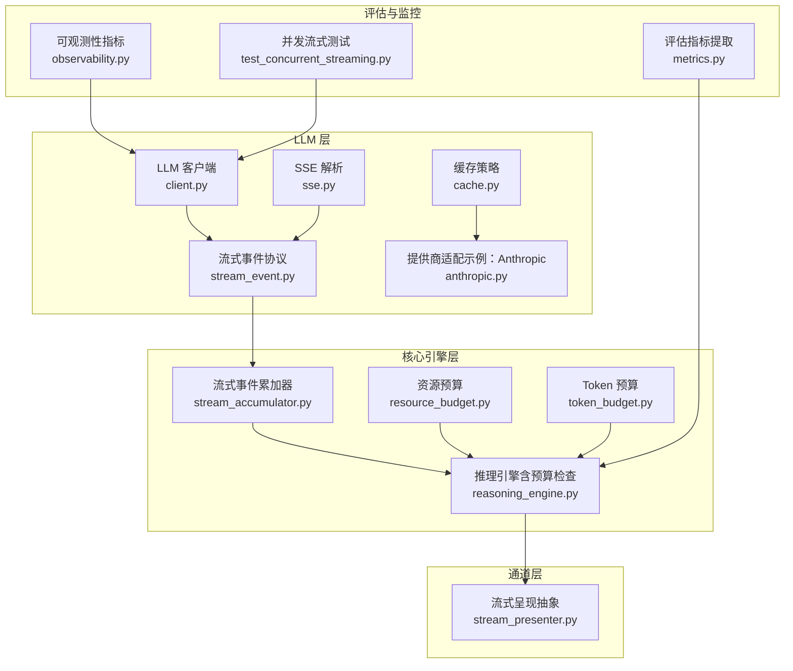
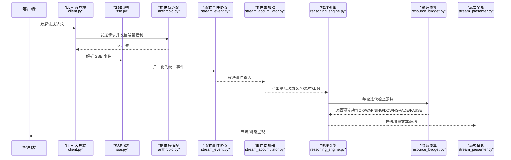
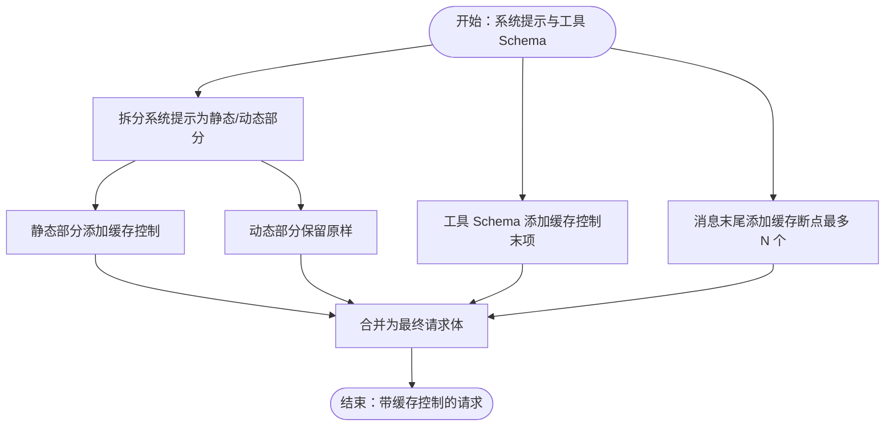
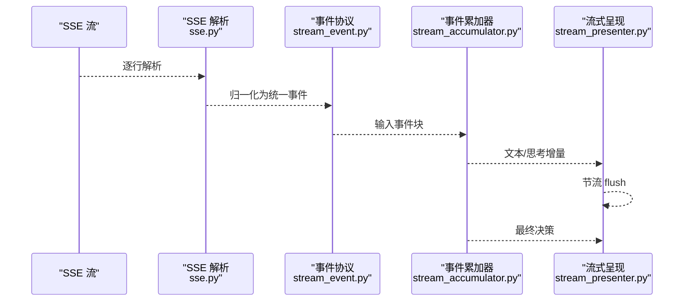
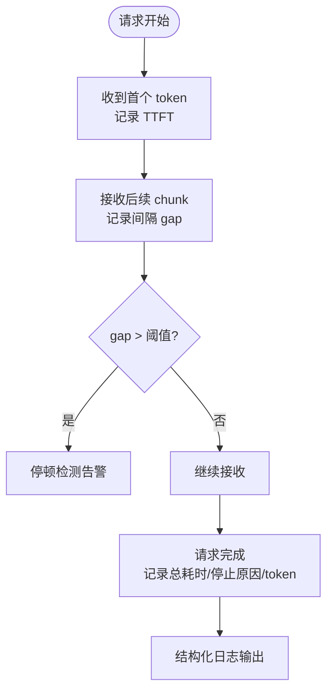
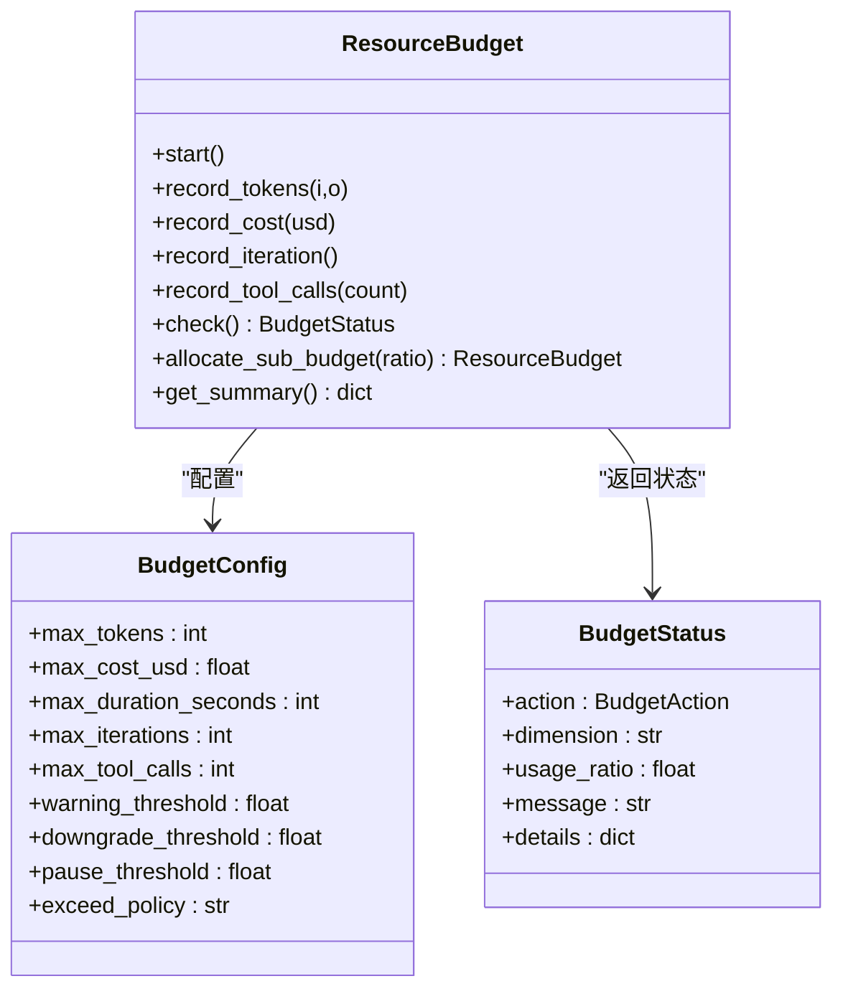
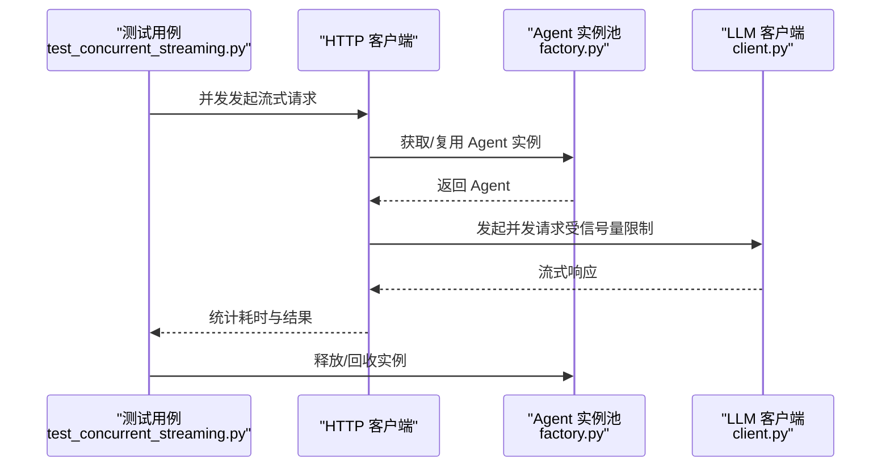
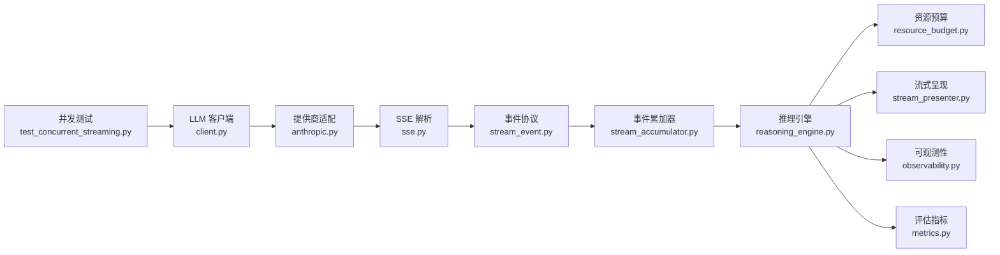

# 性能优化

<cite>
**本文引用的文件**
- [observability.py](file://src/synapse/llm/observability.py)
- [cache.py](file://src/synapse/llm/cache.py)
- [stream_event.py](file://src/synapse/llm/stream_event.py)
- [stream_accumulator.py](file://src/synapse/core/stream_accumulator.py)
- [stream_presenter.py](file://src/synapse/channels/stream_presenter.py)
- [sse.py](file://src/synapse/llm/sse.py)
- [resource_budget.py](file://src/synapse/core/resource_budget.py)
- [token_budget.py](file://src/synapse/core/token_budget.py)
- [reasoning_engine.py](file://src/synapse/core/reasoning_engine.py)
- [client.py](file://src/synapse/llm/client.py)
- [factory.py](file://src/synapse/agents/factory.py)
- [test_concurrent_streaming.py](file://tests/test_concurrent_streaming.py)
- [metrics.py](file://src/synapse/evaluation/metrics.py)
- [anthropic.py](file://src/synapse/llm/providers/anthropic.py)
- [mock_llm.py](file://tests/fixtures/mock_llm.py)
</cite>

## 目录
1. [引言](#引言)
2. [项目结构](#项目结构)
3. [核心组件](#核心组件)
4. [架构总览](#架构总览)
5. [详细组件分析](#详细组件分析)
6. [依赖分析](#依赖分析)
7. [性能考量](#性能考量)
8. [故障排查指南](#故障排查指南)
9. [结论](#结论)
10. [附录](#附录)

## 引言
本技术文档聚焦于大型语言模型（LLM）在本项目中的性能优化实践，围绕以下关键主题展开：
- 缓存策略：Prompt Cache 的实现与落地，包括系统提示分段缓存、工具 Schema 缓存标记、消息缓存断点与工具 Schema LRU 缓存。
- 消息流式传输：统一流式事件协议、SSE 解析、流式事件累加器、IM 平台流式呈现层的节流与降级策略。
- 可观测性：TTFT（首次 token 时间）检测、停顿检测（stall）、结构化指标记录与日志输出。
- 并发控制与资源预算：全局并发信号量、Agent 实例池、任务级资源预算与 Token 预算、迭代预算检查与暂停/降级策略。
- 基准测试与瓶颈分析：并发流式传输测试用例、性能指标采集与评估框架。

## 项目结构
本项目的性能优化涉及多个层次：
- LLM 层：缓存、流式事件协议、SSE 解析、客户端并发控制。
- 核心引擎层：流式事件累加器、资源预算、Token 预算、推理引擎循环与预算检查。
- 通道层：IM 平台流式呈现抽象与节流。
- 评估与监控：可观测性指标、评估指标提取与聚合、并发流式测试。

**图表来源**
- [client.py:156-186](file://src/synapse/llm/client.py#L156-L186)
- [stream_event.py:1-198](file://src/synapse/llm/stream_event.py#L1-L198)
- [sse.py:1-75](file://src/synapse/llm/sse.py#L1-L75)
- [cache.py:1-162](file://src/synapse/llm/cache.py#L1-L162)
- [anthropic.py:276-308](file://src/synapse/llm/providers/anthropic.py#L276-L308)
- [stream_accumulator.py:1-392](file://src/synapse/core/stream_accumulator.py#L1-L392)
- [resource_budget.py:1-363](file://src/synapse/core/resource_budget.py#L1-L363)
- [token_budget.py:1-98](file://src/synapse/core/token_budget.py#L1-L98)
- [reasoning_engine.py:2336-2366](file://src/synapse/core/reasoning_engine.py#L2336-L2366)
- [stream_presenter.py:1-177](file://src/synapse/channels/stream_presenter.py#L1-L177)
- [observability.py:1-181](file://src/synapse/llm/observability.py#L1-L181)
- [metrics.py:1-81](file://src/synapse/evaluation/metrics.py#L1-L81)
- [test_concurrent_streaming.py:219-615](file://tests/test_concurrent_streaming.py#L219-L615)

**章节来源**
- [client.py:156-186](file://src/synapse/llm/client.py#L156-L186)
- [stream_event.py:1-198](file://src/synapse/llm/stream_event.py#L1-L198)
- [sse.py:1-75](file://src/synapse/llm/sse.py#L1-L75)
- [cache.py:1-162](file://src/synapse/llm/cache.py#L1-L162)
- [anthropic.py:276-308](file://src/synapse/llm/providers/anthropic.py#L276-L308)
- [stream_accumulator.py:1-392](file://src/synapse/core/stream_accumulator.py#L1-L392)
- [resource_budget.py:1-363](file://src/synapse/core/resource_budget.py#L1-L363)
- [token_budget.py:1-98](file://src/synapse/core/token_budget.py#L1-L98)
- [reasoning_engine.py:2336-2366](file://src/synapse/core/reasoning_engine.py#L2336-L2366)
- [stream_presenter.py:1-177](file://src/synapse/channels/stream_presenter.py#L1-L177)
- [observability.py:1-181](file://src/synapse/llm/observability.py#L1-L181)
- [metrics.py:1-81](file://src/synapse/evaluation/metrics.py#L1-L81)
- [test_concurrent_streaming.py:219-615](file://tests/test_concurrent_streaming.py#L219-L615)

## 核心组件
- 缓存策略：通过系统提示分段缓存、工具 Schema 缓存标记、消息缓存断点与工具 Schema LRU 缓存，减少重复 token 消耗与往返延迟。
- 流式传输：统一流式事件协议，SSE 解析，流式事件累加器，IM 平台流式呈现层节流与降级。
- 可观测性：TTFT 检测、停顿检测、结构化指标记录与日志输出。
- 并发控制与资源预算：全局并发信号量、Agent 实例池、任务级资源预算与 Token 预算、迭代预算检查与暂停/降级策略。
- 基准测试：并发流式传输测试用例，覆盖健康检查、实例隔离、并发重叠、压力测试等场景。

**章节来源**
- [cache.py:25-162](file://src/synapse/llm/cache.py#L25-L162)
- [stream_event.py:27-198](file://src/synapse/llm/stream_event.py#L27-L198)
- [sse.py:20-75](file://src/synapse/llm/sse.py#L20-L75)
- [stream_accumulator.py:22-392](file://src/synapse/core/stream_accumulator.py#L22-L392)
- [stream_presenter.py:26-177](file://src/synapse/channels/stream_presenter.py#L26-L177)
- [observability.py:24-181](file://src/synapse/llm/observability.py#L24-L181)
- [resource_budget.py:91-363](file://src/synapse/core/resource_budget.py#L91-L363)
- [token_budget.py:19-98](file://src/synapse/core/token_budget.py#L19-L98)
- [client.py:163-186](file://src/synapse/llm/client.py#L163-L186)
- [factory.py:634-672](file://src/synapse/agents/factory.py#L634-L672)
- [test_concurrent_streaming.py:219-615](file://tests/test_concurrent_streaming.py#L219-L615)

## 架构总览
下图展示从 LLM 请求到流式响应、事件归一化、预算检查与呈现的全链路：

**图表来源**
- [client.py:163-186](file://src/synapse/llm/client.py#L163-L186)
- [sse.py:20-75](file://src/synapse/llm/sse.py#L20-L75)
- [anthropic.py:276-308](file://src/synapse/llm/providers/anthropic.py#L276-L308)
- [stream_event.py:27-198](file://src/synapse/llm/stream_event.py#L27-L198)
- [stream_accumulator.py:50-314](file://src/synapse/core/stream_accumulator.py#L50-L314)
- [reasoning_engine.py:2336-2366](file://src/synapse/core/reasoning_engine.py#L2336-L2366)
- [resource_budget.py:192-345](file://src/synapse/core/resource_budget.py#L192-L345)
- [stream_presenter.py:85-144](file://src/synapse/channels/stream_presenter.py#L85-L144)

## 详细组件分析

### 缓存策略
- 系统提示分段缓存：将包含动态边界的系统提示拆分为静态与动态两部分，并对静态部分添加缓存控制，提升跨轮次提示复用率。
- 工具 Schema 缓存标记：对工具列表的最后一个工具添加缓存控制，使整个工具 Schema 可被缓存；同时提供 LRU 缓存以避免重复序列化。
- 消息缓存断点：在对话历史末尾的若干条消息上添加断点，使近期消息可被缓存复用，降低 token 成本。
- 提供商适配：示例中展示了如何在提供商层面对系统提示进行分段与缓存控制，以充分利用平台的 Prompt Cache 能力。

**图表来源**
- [cache.py:25-129](file://src/synapse/llm/cache.py#L25-L129)
- [anthropic.py:276-308](file://src/synapse/llm/providers/anthropic.py#L276-L308)

**章节来源**
- [cache.py:25-162](file://src/synapse/llm/cache.py#L25-L162)
- [anthropic.py:276-308](file://src/synapse/llm/providers/anthropic.py#L276-L308)

### 消息流式传输
- 统一流式事件协议：将不同提供商的原始事件（如 Anthropic 的 message_start/content_block_* / OpenAI 的 content_block_delta/message_stop）统一为高层事件类型，便于上层处理。
- SSE 解析：严格遵循 SSE 规范，支持多行 data 拼接、事件类型、[DONE] 终止信号与容错处理。
- 流式事件累加器：按内容块索引或工具调用 ID 累积文本、思考与工具调用输入，即时产出文本/思考增量，流结束后构建完整决策对象。
- IM 平台流式呈现：抽象统一的 start/update/finalize 生命周期，内置最小更新间隔节流，不支持流式的平台自动降级为“正在思考…”占位再替换。

**图表来源**
- [sse.py:20-75](file://src/synapse/llm/sse.py#L20-L75)
- [stream_event.py:27-198](file://src/synapse/llm/stream_event.py#L27-L198)
- [stream_accumulator.py:50-314](file://src/synapse/core/stream_accumulator.py#L50-L314)
- [stream_presenter.py:85-144](file://src/synapse/channels/stream_presenter.py#L85-L144)

**章节来源**
- [stream_event.py:1-198](file://src/synapse/llm/stream_event.py#L1-L198)
- [sse.py:1-75](file://src/synapse/llm/sse.py#L1-L75)
- [stream_accumulator.py:1-392](file://src/synapse/core/stream_accumulator.py#L1-L392)
- [stream_presenter.py:1-177](file://src/synapse/channels/stream_presenter.py#L1-L177)

### 可观测性与指标
- TTFT 检测：首次 token 到达时记录 TTFT（毫秒），用于首包延迟分析。
- 停顿检测：记录相邻 chunk 到达的时间间隔，超过阈值（例如 30 秒）判定为停顿并发出告警。
- 结构化指标：记录请求级唯一 ID、端点、模型、是否流式、尝试次数、停止原因、token 统计、缓存读取/创建 token 等。
- 日志输出：在请求开始、首次 token、停顿检测、请求结束、错误等关键节点输出结构化日志。

**图表来源**
- [observability.py:24-122](file://src/synapse/llm/observability.py#L24-L122)

**章节来源**
- [observability.py:1-181](file://src/synapse/llm/observability.py#L1-L181)

### 并发控制与资源预算
- 全局并发信号量：基于事件循环绑定的全局信号量，限制同一时刻的在飞请求数量，配合统计接口暴露并发状态。
- Agent 实例池：按会话与 profile 维度缓存 Agent 实例，支持获取、释放与统计，保障上下文复用与隔离。
- 任务级资源预算：支持 token、成本、时长、迭代次数、工具调用次数等多维预算，按阈值分级（警告、降级、暂停），并在推理循环中每轮检查。
- Token 预算：从用户消息中解析 +k/+m 预算指令，达到阈值时注入提示，超出时优雅终止。

**图表来源**
- [resource_budget.py:50-345](file://src/synapse/core/resource_budget.py#L50-L345)

**章节来源**
- [client.py:163-186](file://src/synapse/llm/client.py#L163-L186)
- [factory.py:634-672](file://src/synapse/agents/factory.py#L634-L672)
- [resource_budget.py:1-363](file://src/synapse/core/resource_budget.py#L1-L363)
- [token_budget.py:1-98](file://src/synapse/core/token_budget.py#L1-L98)
- [reasoning_engine.py:2336-2366](file://src/synapse/core/reasoning_engine.py#L2336-L2366)

### 性能基准测试与瓶颈分析
- 并发流式传输测试：覆盖健康检查、实例池启用、单会话基线、实例隔离、两会话并发重叠、三会话并发、取消/跳过/插入隔离、上下文保持/隔离、同会话复用 Agent、Profile 参数传递、空消息边界、无 conv_id 自动生成、Cancel/Insert 不存在会话、子任务端点、五会话并发压力、压力后池完整性等场景。
- 方法论：通过墙钟时间与串行估计时间对比判断并发是否生效；通过池状态统计确认实例隔离与回收；通过日志与指标定位瓶颈。

**图表来源**
- [test_concurrent_streaming.py:219-615](file://tests/test_concurrent_streaming.py#L219-L615)
- [factory.py:634-672](file://src/synapse/agents/factory.py#L634-L672)
- [client.py:163-186](file://src/synapse/llm/client.py#L163-L186)

**章节来源**
- [test_concurrent_streaming.py:219-615](file://tests/test_concurrent_streaming.py#L219-L615)
- [factory.py:634-672](file://src/synapse/agents/factory.py#L634-L672)
- [client.py:163-186](file://src/synapse/llm/client.py#L163-L186)

### 评估与监控指标
- Trace 指标：从一次 Trace 中提取总迭代次数、LLM/工具调用次数、输入/输出 token、总耗时、任务完成情况、工具错误、循环检测、回滚次数、上下文压缩次数、工具使用列表与去重数量等。
- 评估框架：基于 TraceMetrics 的聚合与分析，生成优化动作（记忆、工具、提示、技能等方向），并支持每日评估流程。

**章节来源**
- [metrics.py:16-81](file://src/synapse/evaluation/metrics.py#L16-L81)

## 依赖分析
- LLM 客户端与提供商：LLM 客户端负责并发控制与在飞统计，提供商适配负责将系统提示与工具 Schema 转换为带缓存控制的请求体。
- 流式链路：SSE 解析 → 事件协议 → 事件累加器 → 推理引擎 → 预算检查 → 流式呈现。
- 预算与引擎：推理引擎在每轮迭代调用预算检查，根据动作采取暂停/降级等策略。
- 测试与监控：并发测试用例驱动链路验证，可观测性与评估指标提供性能度量与优化依据。

**图表来源**
- [client.py:163-186](file://src/synapse/llm/client.py#L163-L186)
- [anthropic.py:276-308](file://src/synapse/llm/providers/anthropic.py#L276-L308)
- [sse.py:20-75](file://src/synapse/llm/sse.py#L20-L75)
- [stream_event.py:27-198](file://src/synapse/llm/stream_event.py#L27-L198)
- [stream_accumulator.py:50-314](file://src/synapse/core/stream_accumulator.py#L50-L314)
- [reasoning_engine.py:2336-2366](file://src/synapse/core/reasoning_engine.py#L2336-L2366)
- [resource_budget.py:192-345](file://src/synapse/core/resource_budget.py#L192-L345)
- [stream_presenter.py:85-144](file://src/synapse/channels/stream_presenter.py#L85-L144)
- [observability.py:24-122](file://src/synapse/llm/observability.py#L24-L122)
- [metrics.py:16-81](file://src/synapse/evaluation/metrics.py#L16-L81)
- [test_concurrent_streaming.py:219-615](file://tests/test_concurrent_streaming.py#L219-L615)

**章节来源**
- [client.py:163-186](file://src/synapse/llm/client.py#L163-L186)
- [anthropic.py:276-308](file://src/synapse/llm/providers/anthropic.py#L276-L308)
- [sse.py:1-75](file://src/synapse/llm/sse.py#L1-L75)
- [stream_event.py:1-198](file://src/synapse/llm/stream_event.py#L1-L198)
- [stream_accumulator.py:1-392](file://src/synapse/core/stream_accumulator.py#L1-L392)
- [reasoning_engine.py:2336-2366](file://src/synapse/core/reasoning_engine.py#L2336-L2366)
- [resource_budget.py:1-363](file://src/synapse/core/resource_budget.py#L1-L363)
- [stream_presenter.py:1-177](file://src/synapse/channels/stream_presenter.py#L1-L177)
- [observability.py:1-181](file://src/synapse/llm/observability.py#L1-L181)
- [metrics.py:1-81](file://src/synapse/evaluation/metrics.py#L1-L81)
- [test_concurrent_streaming.py:219-615](file://tests/test_concurrent_streaming.py#L219-L615)

## 性能考量
- 缓存收益：通过系统提示分段缓存与消息断点，显著降低重复 token 消耗；工具 Schema 缓存减少序列化开销。
- 流式体验：统一事件协议与累加器确保跨提供商的一致性；Presenter 的节流避免平台限流与抖动；不支持流式的平台采用占位消息降级。
- 并发与稳定性：全局信号量限制在飞请求数；Agent 实例池提升上下文复用与隔离；预算检查在早期阶段阻断超支风险。
- 可观测性：TTFT 与停顿检测帮助快速定位网络/服务端问题；结构化指标便于趋势分析与告警。

## 故障排查指南
- TTFT 异常：检查网络连通性、提供商可用性、请求体构造（缓存控制是否正确）。
- 停顿检测告警：关注 gap 是否持续超过阈值，排查上游服务稳定性与 SSE 事件完整性。
- 预算触发：若频繁出现警告/降级/暂停，应调整预算阈值或优化任务策略；检查工具调用次数与迭代次数。
- 并发问题：通过并发统计接口与池状态确认是否存在过度并发或实例未回收；结合测试用例验证隔离与重叠行为。
- 评估与回归：利用评估指标提取与每日评估流程，识别任务完成率下降、工具准确率降低、循环率上升等问题。

**章节来源**
- [observability.py:124-181](file://src/synapse/llm/observability.py#L124-L181)
- [resource_budget.py:192-345](file://src/synapse/core/resource_budget.py#L192-L345)
- [client.py:182-186](file://src/synapse/llm/client.py#L182-L186)
- [factory.py:666-672](file://src/synapse/agents/factory.py#L666-L672)
- [metrics.py:16-81](file://src/synapse/evaluation/metrics.py#L16-L81)

## 结论
本项目的性能优化以“缓存优先、流式统一、预算前置、可观测贯穿”为核心策略。通过 Prompt Cache 与消息断点降低 token 成本，通过统一流式协议与累加器提升跨提供商一致性，通过资源预算与 Token 预算在早期阻断风险，通过 TTFT 与停顿检测快速定位问题。配合并发流式测试与评估指标体系，形成闭环的性能治理路径。

## 附录
- 配置调优建议
  - 缓存：合理设置系统提示动态边界与消息断点数量，平衡复用率与动态性。
  - 并发：根据下游服务 QPS 与资源容量调整全局信号量上限；结合池状态监控动态扩容。
  - 预算：根据业务 SLA 调整预算阈值与策略（警告/降级/暂停）；定期回顾预算触发频率。
  - 观测：开启 TTFT 与停顿检测日志，设置合理的阈值与告警级别；定期审查评估指标。
- 基准测试清单
  - 健康检查、实例池启用、单/多会话并发、上下文隔离、取消/跳过/插入隔离、压力测试、池完整性校验。