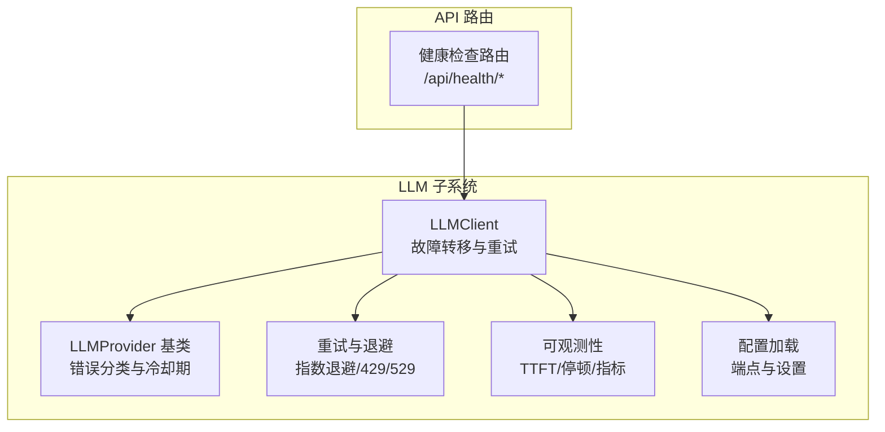
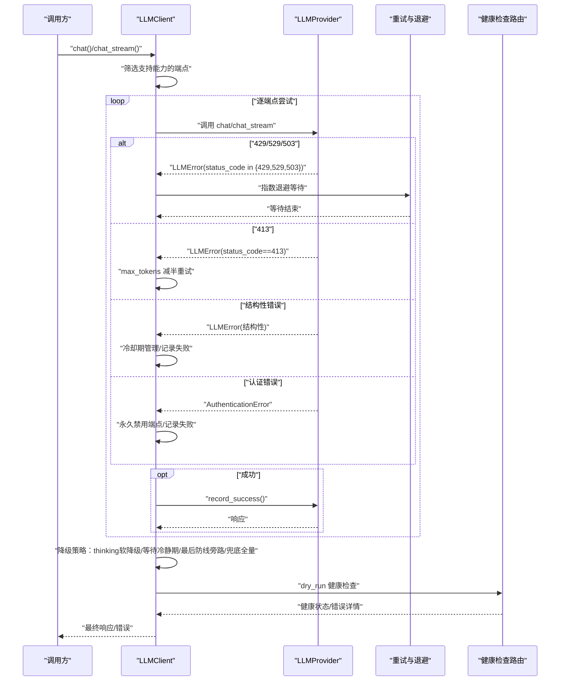
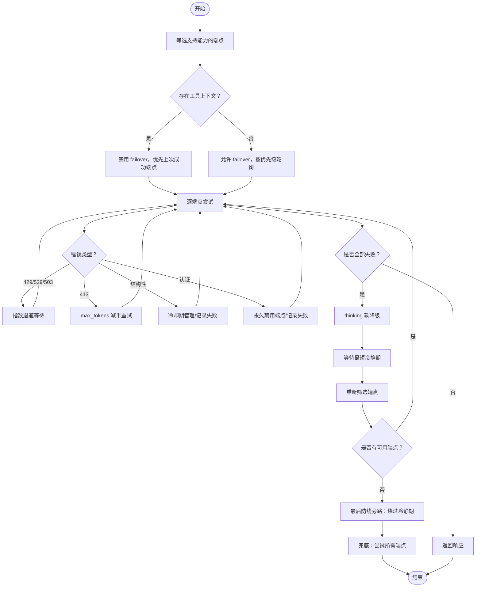
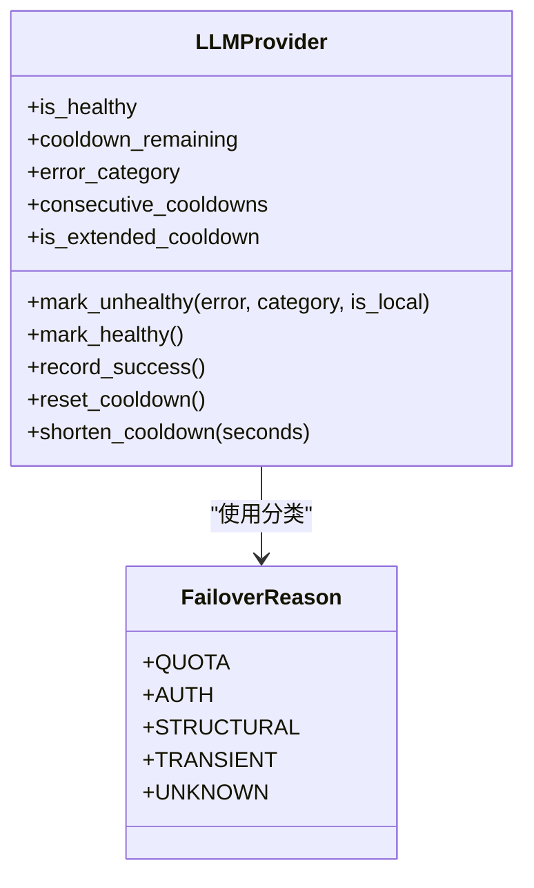
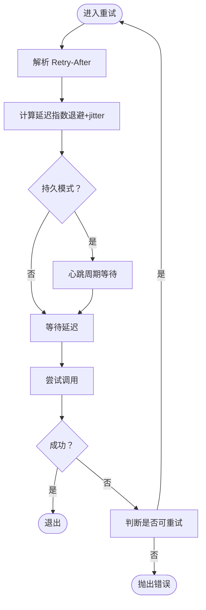
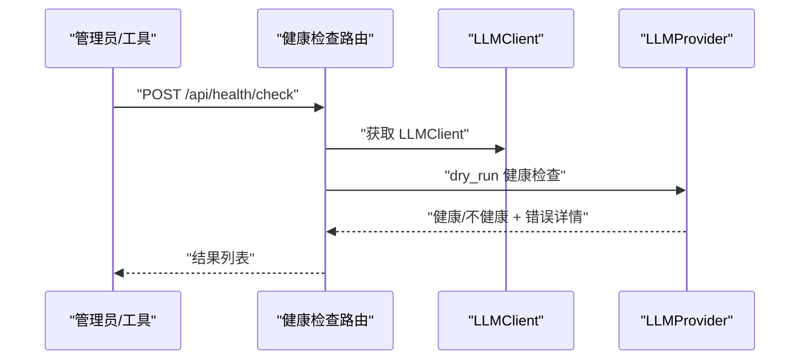
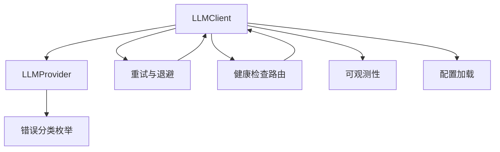

# 故障转移机制

<cite>
**本文档引用的文件**
- [client.py](file://src/synapse/llm/client.py)
- [base.py](file://src/synapse/llm/providers/base.py)
- [retry.py](file://src/synapse/llm/retry.py)
- [error_types.py](file://src/synapse/llm/error_types.py)
- [health.py](file://src/synapse/api/routes/health.py)
- [observability.py](file://src/synapse/llm/observability.py)
- [config.py](file://src/synapse/llm/config.py)
</cite>

## 目录
1. [简介](#简介)
2. [项目结构](#项目结构)
3. [核心组件](#核心组件)
4. [架构总览](#架构总览)
5. [详细组件分析](#详细组件分析)
6. [依赖关系分析](#依赖关系分析)
7. [性能考虑](#性能考虑)
8. [故障排查指南](#故障排查指南)
9. [结论](#结论)
10. [附录](#附录)

## 简介
本文件系统性阐述本项目的 LLM 故障转移机制，涵盖智能故障转移算法设计、错误分类与冷却期管理策略、指数退避重试、429/529 状态码处理、结构化错误恢复、故障检测逻辑、端点健康检查、临时覆盖机制，以及故障转移配置参数、监控指标与调试方法。文档旨在帮助开发者与运维人员快速理解并高效使用该机制。

## 项目结构
围绕故障转移的关键代码主要分布在以下模块：
- LLM 统一客户端：负责端点筛选、故障转移策略、重试与冷却期管理、临时覆盖与模型切换
- Provider 基类：定义错误分类、冷却期计算、健康状态与重置逻辑
- 重试与退避：统一的指数退避、Retry-After 解析、429/529 区分与持久模式
- 健康检查路由：提供端点只读健康检查、并发统计与诊断接口
- 可观测性：请求级指标采集（TTFT、停顿检测、结构化日志）
- 配置加载：端点配置解析、默认配置与校验

**图表来源**
- [client.py:146-2097](file://src/synapse/llm/client.py#L146-L2097)
- [base.py:91-485](file://src/synapse/llm/providers/base.py#L91-L485)
- [retry.py:201-275](file://src/synapse/llm/retry.py#L201-L275)
- [health.py:128-424](file://src/synapse/api/routes/health.py#L128-L424)
- [observability.py:24-181](file://src/synapse/llm/observability.py#L24-L181)
- [config.py:211-287](file://src/synapse/llm/config.py#L211-L287)

**章节来源**
- [client.py:1-200](file://src/synapse/llm/client.py#L1-L200)
- [base.py:1-120](file://src/synapse/llm/providers/base.py#L1-L120)
- [retry.py:1-120](file://src/synapse/llm/retry.py#L1-L120)
- [health.py:1-120](file://src/synapse/api/routes/health.py#L1-L120)
- [observability.py:1-120](file://src/synapse/llm/observability.py#L1-L120)
- [config.py:1-120](file://src/synapse/llm/config.py#L1-L120)

## 核心组件
- LLMClient：统一入口，负责端点筛选、工具上下文感知的 failover 控制、冷却期等待与最终兜底、临时覆盖与模型切换、并发控制与取消事件集成
- LLMProvider：抽象基类，定义错误分类（配额/认证/结构性/瞬时/未知）、冷却期计算与渐进退避、健康状态与重置、限流器
- 重试与退避：指数退避 + jitter、Retry-After 优先、429/529 区分、持久模式心跳、上下文溢出自愈
- 健康检查：只读健康检查（dry_run）避免干扰运行中 Agent、并发统计、诊断接口
- 可观测性：请求级指标（TTFT、停顿检测、令牌用量、停止原因、错误）、结构化日志输出
- 配置加载：端点配置解析、默认配置生成、校验与保存

**章节来源**
- [client.py:146-513](file://src/synapse/llm/client.py#L146-L513)
- [base.py:91-485](file://src/synapse/llm/providers/base.py#L91-L485)
- [retry.py:201-275](file://src/synapse/llm/retry.py#L201-L275)
- [health.py:166-424](file://src/synapse/api/routes/health.py#L166-L424)
- [observability.py:24-181](file://src/synapse/llm/observability.py#L24-L181)
- [config.py:211-287](file://src/synapse/llm/config.py#L211-L287)

## 架构总览
下图展示了故障转移的整体流程：端点筛选 → 能力匹配 → 逐端点重试与冷却期管理 → 降级策略（thinking 软降级、等待冷静期、最后防线旁路、兜底全量尝试）→ 临时覆盖与模型切换 → 健康检查与可观测性。

**图表来源**
- [client.py:409-513](file://src/synapse/llm/client.py#L409-L513)
- [client.py:740-953](file://src/synapse/llm/client.py#L740-L953)
- [client.py:1242-1503](file://src/synapse/llm/client.py#L1242-L1503)
- [retry.py:201-275](file://src/synapse/llm/retry.py#L201-L275)
- [health.py:166-216](file://src/synapse/api/routes/health.py#L166-L216)

**章节来源**
- [client.py:351-513](file://src/synapse/llm/client.py#L351-L513)
- [client.py:740-953](file://src/synapse/llm/client.py#L740-L953)
- [client.py:1242-1503](file://src/synapse/llm/client.py#L1242-L1503)
- [retry.py:201-275](file://src/synapse/llm/retry.py#L201-L275)
- [health.py:166-216](file://src/synapse/api/routes/health.py#L166-L216)

## 详细组件分析

### 智能故障转移算法设计
- 端点筛选与能力匹配：根据请求的工具、视觉、视频、音频、PDF、思考模式等需求筛选支持的端点，并考虑端点亲和性（工具上下文场景优先上次成功端点）
- 工具上下文感知的 failover 控制：检测消息中是否包含工具调用上下文，若存在则默认禁用 failover，避免跨端点的工具链不兼容
- 逐端点重试策略：支持同端点优先重试与最大重试次数配置，结合取消事件与并发信号量控制
- 降级策略分层：
  - thinking 软降级：当需要思考模式但无端点支持时，降级为非思考模式
  - 等待冷静期恢复：若存在瞬时错误且冷却时间较短，等待最短冷静期后重新筛选
  - 最后防线旁路：当无健康端点时，绕过冷静期尝试所有端点（Portkey 风格）
  - 兜底全量尝试：当能力完全不匹配时，尝试所有端点作为最后手段

**图表来源**
- [client.py:409-513](file://src/synapse/llm/client.py#L409-L513)
- [client.py:740-953](file://src/synapse/llm/client.py#L740-L953)
- [client.py:1242-1503](file://src/synapse/llm/client.py#L1242-L1503)

**章节来源**
- [client.py:409-513](file://src/synapse/llm/client.py#L409-L513)
- [client.py:740-953](file://src/synapse/llm/client.py#L740-L953)
- [client.py:1242-1503](file://src/synapse/llm/client.py#L1242-L1503)

### 错误分类机制与冷却期管理策略
- 错误分类：统一使用枚举 FailoverReason（配额/认证/结构性/瞬时/未知），自动分类逻辑覆盖关键字匹配与优先级
- 冷却期策略：
  - 固定时长：认证（1 分钟）、配额（5 分钟）、结构性（10 秒）、瞬时（5 秒）、默认（30 秒）
  - 渐进退避：连续失败时按步进序列递增（5s → 10s → 20s → 60s），本地端点瞬时错误不参与渐进升级
  - 全局故障检测：当多数端点为瞬时错误且处于扩展冷静期时，缩短冷却期至 10 秒以加速恢复
  - 冷静期重置与缩短：支持强制重置（reset_cooldown）与缩短（shorten_cooldown），并同步处理扩展冷静期标志

**图表来源**
- [base.py:91-485](file://src/synapse/llm/providers/base.py#L91-L485)
- [error_types.py:13-25](file://src/synapse/llm/error_types.py#L13-L25)

**章节来源**
- [base.py:72-253](file://src/synapse/llm/providers/base.py#L72-L253)
- [base.py:324-405](file://src/synapse/llm/providers/base.py#L324-L405)
- [error_types.py:13-25](file://src/synapse/llm/error_types.py#L13-L25)

### 指数退避重试与 429/529 状态码处理
- 指数退避：基础延迟 500ms，上限 32s，加入 25% 随机抖动
- Retry-After 优先：若响应头包含 Retry-After，则直接使用
- 429/529 区分：连续 529 达到阈值触发 fallback
- 持久模式：长等待 + 心跳事件，适合后台任务
- 上下文溢出自愈：从错误中提取建议的 max_tokens 并自动调整

**图表来源**
- [retry.py:57-158](file://src/synapse/llm/retry.py#L57-L158)
- [retry.py:201-275](file://src/synapse/llm/retry.py#L201-L275)

**章节来源**
- [retry.py:57-158](file://src/synapse/llm/retry.py#L57-L158)
- [retry.py:201-275](file://src/synapse/llm/retry.py#L201-L275)

### 结构化错误恢复
- reasoning_content 缺失：自动启用思考模式并重试
- 思考参数被拒绝：自动禁用思考模式与深度参数并重试
- 413 Payload Too Large：自动将 max_tokens 减半并重试一次
- 认证错误：永久禁用端点，避免后续尝试
- 结构性错误：不计入连续失败，不参与渐进退避，记录为内容级错误但不冷却端点

**章节来源**
- [client.py:1505-1551](file://src/synapse/llm/client.py#L1505-L1551)
- [client.py:1193-1240](file://src/synapse/llm/client.py#L1193-L1240)
- [client.py:1323-1440](file://src/synapse/llm/client.py#L1323-L1440)

### 故障检测逻辑与端点健康检查
- 只读健康检查（dry_run）：发送测试请求但不修改端点健康/冷静期状态，避免干扰运行中 Agent
- 并发统计与事件循环健康：暴露 LLM 并发统计与事件循环延迟
- 诊断接口：返回运行时环境、包完整性等诊断信息

**图表来源**
- [health.py:356-387](file://src/synapse/api/routes/health.py#L356-L387)
- [health.py:166-216](file://src/synapse/api/routes/health.py#L166-L216)

**章节来源**
- [health.py:166-216](file://src/synapse/api/routes/health.py#L166-L216)
- [health.py:356-424](file://src/synapse/api/routes/health.py#L356-L424)

### 临时覆盖机制与模型切换
- 临时覆盖：支持全局与会话级覆盖，覆盖端点在健康时优先使用，过期自动清理
- 模型切换：重置目标端点冷静期后进行切换，支持设置有效期与原因
- 恢复默认：清除覆盖并恢复到默认优先级最高且健康的端点

**章节来源**
- [client.py:89-144](file://src/synapse/llm/client.py#L89-L144)
- [client.py:1769-1845](file://src/synapse/llm/client.py#L1769-L1845)
- [client.py:1847-1940](file://src/synapse/llm/client.py#L1847-L1940)

## 依赖关系分析
- LLMClient 依赖 Provider 基类进行错误分类与冷却期管理，依赖重试模块进行指数退避与 429/529 处理，依赖健康检查路由进行只读检测
- Provider 基类依赖错误分类枚举与冷却期常量，内部维护健康状态与连续失败计数
- 重试模块独立于具体 Provider，提供通用的退避与持久模式支持
- 健康检查路由依赖 LLMClient 获取 Provider 并执行 dry_run 检查
- 可观测性模块与 LLMClient 解耦，提供指标采集与日志输出
- 配置模块负责端点配置的加载、校验与保存

**图表来源**
- [client.py:146-2097](file://src/synapse/llm/client.py#L146-L2097)
- [base.py:91-485](file://src/synapse/llm/providers/base.py#L91-L485)
- [retry.py:201-275](file://src/synapse/llm/retry.py#L201-L275)
- [health.py:128-424](file://src/synapse/api/routes/health.py#L128-L424)
- [observability.py:124-181](file://src/synapse/llm/observability.py#L124-L181)
- [config.py:211-287](file://src/synapse/llm/config.py#L211-L287)

**章节来源**
- [client.py:146-2097](file://src/synapse/llm/client.py#L146-L2097)
- [base.py:91-485](file://src/synapse/llm/providers/base.py#L91-L485)
- [retry.py:201-275](file://src/synapse/llm/retry.py#L201-L275)
- [health.py:128-424](file://src/synapse/api/routes/health.py#L128-L424)
- [observability.py:124-181](file://src/synapse/llm/observability.py#L124-L181)
- [config.py:211-287](file://src/synapse/llm/config.py#L211-L287)

## 性能考虑
- 并发控制：全局信号量限制同时在飞请求数，防止并发风暴
- 冷静期与渐进退避：减少对故障端点的无效重试，加速整体恢复
- 只读健康检查：避免干扰运行中调用，降低额外开销
- 指数退避 + jitter：平衡恢复速度与负载压力
- 流式传输的中途失败保护：一旦开始产出事件，中途失败不再切换端点，避免混合响应

[本节为通用指导，无需列出具体文件来源]

## 故障排查指南
- 使用只读健康检查定位问题：POST /api/health/check，查看端点状态、错误详情、连续失败次数与剩余冷静期
- 查看并发与事件循环健康：GET /api/health/loop，关注 LLM 并发统计与事件循环延迟
- 检查可观测性指标：确认 TTFT、停顿检测、令牌用量、停止原因与错误日志
- 临时覆盖与模型切换：确认覆盖是否过期、目标端点是否健康、是否需要重置冷静期
- 配置校验：验证端点配置、API Key、URL 与能力声明

**章节来源**
- [health.py:356-424](file://src/synapse/api/routes/health.py#L356-L424)
- [observability.py:24-181](file://src/synapse/llm/observability.py#L24-L181)
- [client.py:1688-1729](file://src/synapse/llm/client.py#L1688-L1729)
- [config.py:373-416](file://src/synapse/llm/config.py#L373-L416)

## 结论
本项目的故障转移机制通过“能力匹配 + 工具上下文感知 + 分层降级 + 冷静期管理 + 指数退避 + 临时覆盖”的组合，实现了高可用与高性能的 LLM 调用体验。配合只读健康检查、可观测性与配置校验，能够快速定位问题并恢复服务。

[本节为总结性内容，无需列出具体文件来源]

## 附录

### 故障转移配置参数
- 端点配置文件字段与默认设置：端点列表、编译器端点、STT 端点、settings.retry_count、settings.retry_delay_seconds、settings.health_check_interval、settings.fallback_on_error
- 端点能力声明：text、vision、tools、thinking、audio、video、pdf
- 临时覆盖有效期：默认 12 小时，支持会话级覆盖

**章节来源**
- [config.py:322-327](file://src/synapse/llm/config.py#L322-L327)
- [client.py:89-144](file://src/synapse/llm/client.py#L89-L144)

### 监控指标与可观测性
- 请求级指标：请求 ID、端点/模型、查询来源、是否流式、首次 token 时间（TTFT）、总耗时、输入/输出令牌、缓存读取/创建令牌、停止原因、错误
- 停顿检测：流式传输中检测长时间无数据到达
- 日志输出：结构化日志，便于审计与问题定位

**章节来源**
- [observability.py:24-181](file://src/synapse/llm/observability.py#L24-L181)