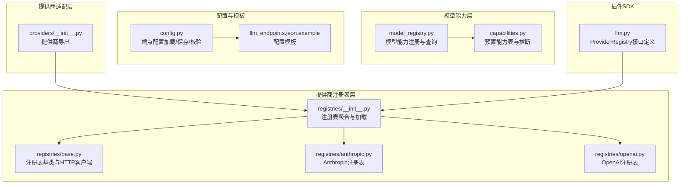
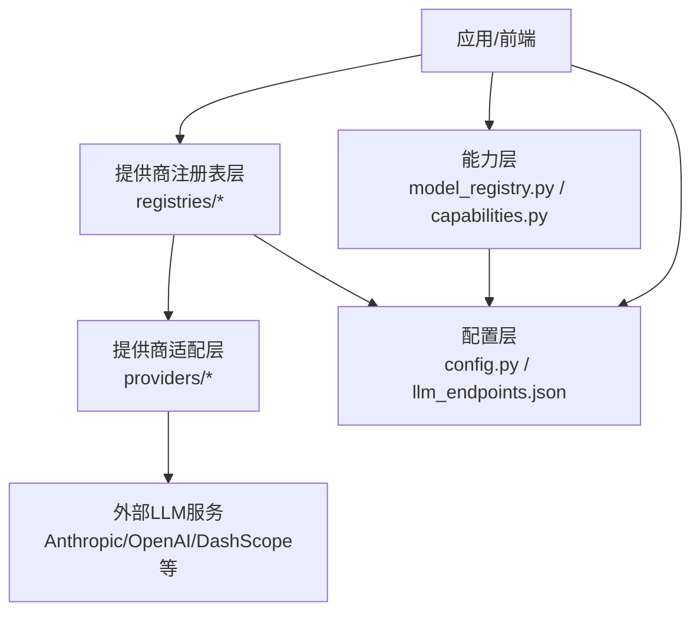
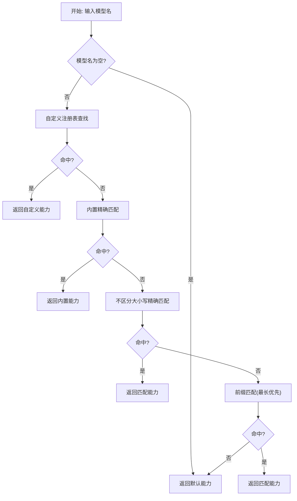
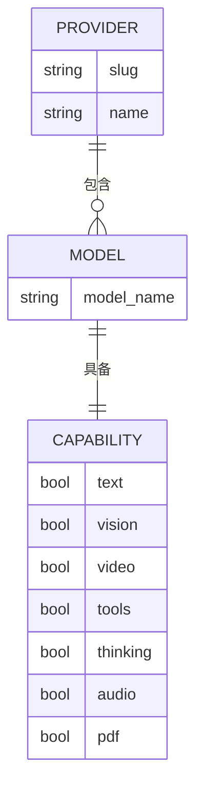
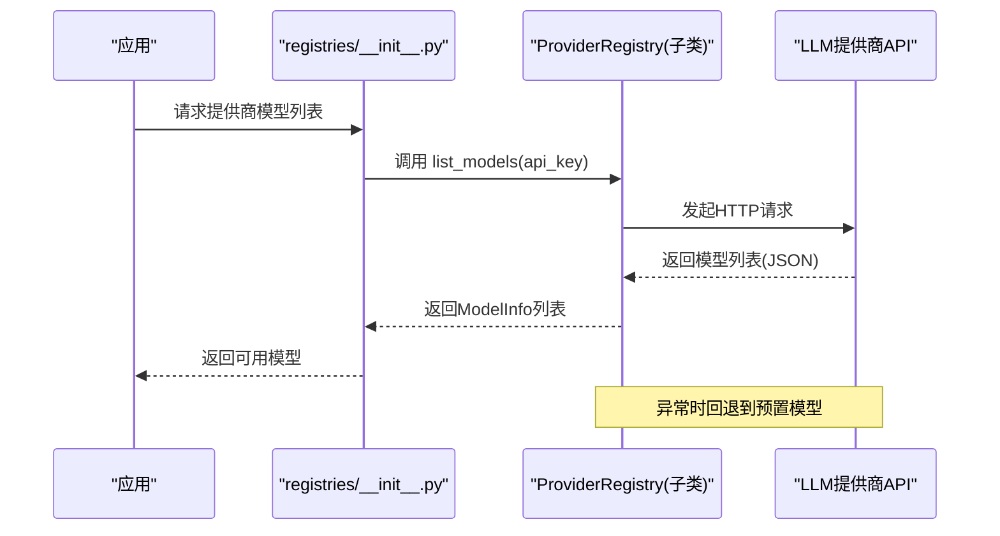
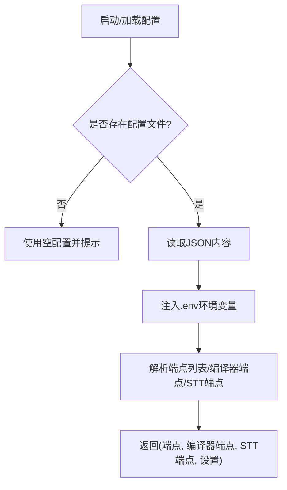
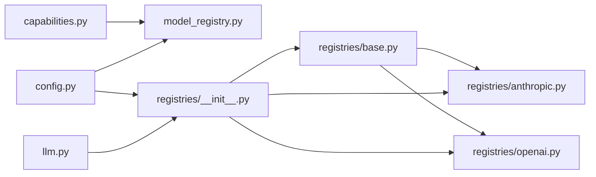

# 模型注册中心

<cite>
**本文引用的文件**
- [model_registry.py](file://src/synapse/llm/model_registry.py)
- [capabilities.py](file://src/synapse/llm/capabilities.py)
- [registries/__init__.py](file://src/synapse/llm/registries/__init__.py)
- [registries/base.py](file://src/synapse/llm/registries/base.py)
- [registries/anthropic.py](file://src/synapse/llm/registries/anthropic.py)
- [registries/openai.py](file://src/synapse/llm/registries/openai.py)
- [providers/__init__.py](file://src/synapse/llm/providers/__init__.py)
- [config.py](file://src/synapse/llm/config.py)
- [llm_endpoints.json.example](file://data/llm_endpoints.json.example)
- [llm.py](file://synapse-plugin-sdk/src/synapse_plugin_sdk/llm.py)
</cite>

## 目录
1. [简介](#简介)
2. [项目结构](#项目结构)
3. [核心组件](#核心组件)
4. [架构总览](#架构总览)
5. [详细组件分析](#详细组件分析)
6. [依赖关系分析](#依赖关系分析)
7. [性能考量](#性能考量)
8. [故障排查指南](#故障排查指南)
9. [结论](#结论)
10. [附录](#附录)

## 简介
本技术文档面向“LLM 模型注册中心”，系统化阐述模型注册机制、提供商映射表、模型能力查询体系，深入解析模型发现流程、版本管理策略与兼容性检查机制，并提供模型配置模板、注册流程、查询接口与管理工具的使用方法。目标读者既包括需要快速上手的使用者，也包括希望深入理解实现细节的工程师。

## 项目结构
围绕模型注册中心的关键模块主要位于以下路径：
- 模型能力注册与查询：src/synapse/llm/model_registry.py
- 预置模型能力表与推断逻辑：src/synapse/llm/capabilities.py
- 提供商注册表与发现：src/synapse/llm/registries/*
- 提供商适配层：src/synapse/llm/providers/*
- 端点配置与加载：src/synapse/llm/config.py
- 示例配置模板：data/llm_endpoints.json.example
- 插件SDK中的注册表接口：synapse-plugin-sdk/src/synapse_plugin_sdk/llm.py

**图表来源**
- [model_registry.py:1-245](file://src/synapse/llm/model_registry.py#L1-L245)
- [capabilities.py:1-800](file://src/synapse/llm/capabilities.py#L1-L800)
- [registries/__init__.py:1-232](file://src/synapse/llm/registries/__init__.py#L1-L232)
- [registries/base.py:1-92](file://src/synapse/llm/registries/base.py#L1-L92)
- [registries/anthropic.py:1-71](file://src/synapse/llm/registries/anthropic.py#L1-L71)
- [registries/openai.py:1-76](file://src/synapse/llm/registries/openai.py#L1-L76)
- [providers/__init__.py:1-18](file://src/synapse/llm/providers/__init__.py#L1-L18)
- [config.py:1-417](file://src/synapse/llm/config.py#L1-L417)
- [llm_endpoints.json.example:1-110](file://data/llm_endpoints.json.example#L1-L110)
- [llm.py:39-70](file://synapse-plugin-sdk/src/synapse_plugin_sdk/llm.py#L39-L70)

**章节来源**
- [model_registry.py:1-245](file://src/synapse/llm/model_registry.py#L1-L245)
- [capabilities.py:1-800](file://src/synapse/llm/capabilities.py#L1-L800)
- [registries/__init__.py:1-232](file://src/synapse/llm/registries/__init__.py#L1-L232)
- [registries/base.py:1-92](file://src/synapse/llm/registries/base.py#L1-L92)
- [registries/anthropic.py:1-71](file://src/synapse/llm/registries/anthropic.py#L1-L71)
- [registries/openai.py:1-76](file://src/synapse/llm/registries/openai.py#L1-L76)
- [providers/__init__.py:1-18](file://src/synapse/llm/providers/__init__.py#L1-L18)
- [config.py:1-417](file://src/synapse/llm/config.py#L1-L417)
- [llm_endpoints.json.example:1-110](file://data/llm_endpoints.json.example#L1-L110)
- [llm.py:39-70](file://synapse-plugin-sdk/src/synapse_plugin_sdk/llm.py#L39-L70)

## 核心组件
- 模型能力注册与查询：集中管理模型的上下文窗口、输出限制、能力特征等元数据，支持精确匹配、前缀匹配与默认值三级查找，并允许运行时动态注册自定义模型。
- 预置模型能力表与推断：以多维能力维度（文本、视觉、工具、思考、音频、PDF、视频）描述模型能力，结合提供商与模型名称进行能力推断。
- 提供商注册表：聚合内置与用户自定义提供商，支持按 slug 动态构建注册表实例，提供模型列表发现与能力查询。
- 提供商适配层：封装 Anthropic 与 OpenAI 等提供商的差异，统一对外接口。
- 端点配置与模板：提供 llm_endpoints.json 的完整字段说明与示例，支持优先级、超时、能力标记、额外参数等配置项。
- 插件SDK接口：定义 ProviderRegistry 与 ProviderRegistryInfo，便于第三方插件实现自定义提供商注册表。

**章节来源**
- [model_registry.py:168-245](file://src/synapse/llm/model_registry.py#L168-L245)
- [capabilities.py:1-15](file://src/synapse/llm/capabilities.py#L1-L15)
- [registries/__init__.py:121-232](file://src/synapse/llm/registries/__init__.py#L121-L232)
- [providers/__init__.py:1-18](file://src/synapse/llm/providers/__init__.py#L1-L18)
- [config.py:335-417](file://src/synapse/llm/config.py#L335-L417)
- [llm_endpoints.json.example:1-110](file://data/llm_endpoints.json.example#L1-L110)
- [llm.py:39-70](file://synapse-plugin-sdk/src/synapse_plugin_sdk/llm.py#L39-L70)

## 架构总览
模型注册中心由“能力层—注册表层—适配层—配置层”四层构成，形成从“能力描述—提供商发现—适配调用—配置落地”的闭环。

**图表来源**
- [registries/__init__.py:172-232](file://src/synapse/llm/registries/__init__.py#L172-L232)
- [providers/__init__.py:1-18](file://src/synapse/llm/providers/__init__.py#L1-L18)
- [model_registry.py:1-245](file://src/synapse/llm/model_registry.py#L1-L245)
- [capabilities.py:1-800](file://src/synapse/llm/capabilities.py#L1-L800)
- [config.py:211-288](file://src/synapse/llm/config.py#L211-L288)
- [llm_endpoints.json.example:1-110](file://data/llm_endpoints.json.example#L1-L110)

## 详细组件分析

### 模型能力注册与查询（model_registry.py）
- 能力数据结构：通过冻结的数据类集中管理上下文窗口、最大/默认输出 token、思考预算范围、能力开关等。
- 查找策略：自定义注册 → 精确匹配（区分大小写）→ 不区分大小写的精确匹配 → 前缀匹配（最长优先）→ 默认值。
- 运行时注册：支持在运行时动态注册自定义模型能力，便于扩展未知模型或临时覆盖。
- 查询便捷函数：提供上下文窗口、最大输出 token、默认输出 token、思考预算等常用查询入口。

**图表来源**
- [model_registry.py:168-203](file://src/synapse/llm/model_registry.py#L168-L203)

**章节来源**
- [model_registry.py:21-36](file://src/synapse/llm/model_registry.py#L21-L36)
- [model_registry.py:168-245](file://src/synapse/llm/model_registry.py#L168-L245)

### 预置模型能力表与推断（capabilities.py）
- 能力维度：text、vision、video、tools、thinking、audio、pdf。
- 结构组织：以“提供商 slug → 模型名 → 能力字典”的二维映射维护预置能力。
- 推断策略：当注册表无法从 API 获取能力时，回退至预置表；若仍不可得，则使用默认能力。
- 兼容性：同一模型在不同提供商可能能力不同，需按提供商 slug 与模型名分别维护。

**图表来源**
- [capabilities.py:17-800](file://src/synapse/llm/capabilities.py#L17-L800)

**章节来源**
- [capabilities.py:1-15](file://src/synapse/llm/capabilities.py#L1-L15)
- [capabilities.py:17-800](file://src/synapse/llm/capabilities.py#L17-L800)

### 提供商注册表与发现（registries/*）
- 聚合策略：内置 providers.json 与工作区 custom_providers.json 合并，slug 覆盖、新增追加。
- 动态构建：根据 registry_class 映射到具体实现类，构造 ProviderRegistry 实例。
- HTTP 客户端：共享 AsyncClient，连接池复用，降低开销。
- 模型发现：各提供商注册表实现 list_models，优先调用远端 API，失败时回退至预置模型列表。
- 能力查询：统一通过 ProviderRegistry.get_model_capabilities，优先 API 返回，其次预置表，最后默认值。

**图表来源**
- [registries/__init__.py:172-182](file://src/synapse/llm/registries/__init__.py#L172-L182)
- [registries/anthropic.py:22-50](file://src/synapse/llm/registries/anthropic.py#L22-L50)
- [registries/openai.py:22-48](file://src/synapse/llm/registries/openai.py#L22-L48)

**章节来源**
- [registries/__init__.py:1-232](file://src/synapse/llm/registries/__init__.py#L1-L232)
- [registries/base.py:15-92](file://src/synapse/llm/registries/base.py#L15-L92)
- [registries/anthropic.py:1-71](file://src/synapse/llm/registries/anthropic.py#L1-L71)
- [registries/openai.py:1-76](file://src/synapse/llm/registries/openai.py#L1-L76)

### 提供商适配层（providers/*）
- 导出统一接口：LLMProvider、AnthropicProvider、OpenAIProvider。
- 适配差异：针对不同提供商的认证头、默认 base_url、模型列表端点等差异进行封装。
- 与注册表协作：注册表负责发现与能力推断，适配层负责具体协议转换与调用。

**章节来源**
- [providers/__init__.py:1-18](file://src/synapse/llm/providers/__init__.py#L1-L18)

### 端点配置与模板（config.py / llm_endpoints.json.example）
- 配置加载：支持从多个位置查找默认配置文件，读取 .env 注入环境变量，解析端点列表、编译器端点、STT 端点与全局设置。
- 配置保存：支持保存端点列表、编译器端点、STT 端点与设置。
- 配置校验：验证 API Key、api_type、base_url 等关键字段。
- 模板说明：提供完整的字段说明与示例，涵盖 OpenAI、DashScope、智谱等主流提供商。

**图表来源**
- [config.py:211-288](file://src/synapse/llm/config.py#L211-L288)
- [llm_endpoints.json.example:1-110](file://data/llm_endpoints.json.example#L1-L110)

**章节来源**
- [config.py:1-417](file://src/synapse/llm/config.py#L1-L417)
- [llm_endpoints.json.example:1-110](file://data/llm_endpoints.json.example#L1-L110)

### 插件SDK接口（synapse-plugin-sdk/llm.py）
- ProviderRegistryInfo：定义 slug、name、api_type、默认 base_url、API Key 环境变量等基础信息。
- ProviderRegistry：定义 list_models 抽象接口，供插件作者实现自定义提供商注册表。
- 与主框架集成：通过 api.register_llm_registry 将插件注册表接入主系统。

**章节来源**
- [llm.py:39-70](file://synapse-plugin-sdk/src/synapse_plugin_sdk/llm.py#L39-L70)

## 依赖关系分析
- 能力层对预置表的依赖：能力查询依赖预置表作为回退来源。
- 注册表层对适配层的依赖：注册表通过 ProviderRegistry 统一接口与提供商交互。
- 配置层对能力层与注册表层的依赖：配置文件决定端点与能力，影响能力查询与模型发现。
- 插件SDK对注册表层的依赖：插件通过 SDK 接口扩展注册表能力。

**图表来源**
- [capabilities.py:1-800](file://src/synapse/llm/capabilities.py#L1-L800)
- [model_registry.py:1-245](file://src/synapse/llm/model_registry.py#L1-L245)
- [registries/base.py:1-92](file://src/synapse/llm/registries/base.py#L1-L92)
- [registries/anthropic.py:1-71](file://src/synapse/llm/registries/anthropic.py#L1-L71)
- [registries/openai.py:1-76](file://src/synapse/llm/registries/openai.py#L1-L76)
- [registries/__init__.py:1-232](file://src/synapse/llm/registries/__init__.py#L1-L232)
- [config.py:1-417](file://src/synapse/llm/config.py#L1-L417)
- [llm.py:39-70](file://synapse-plugin-sdk/src/synapse_plugin_sdk/llm.py#L39-L70)

**章节来源**
- [capabilities.py:1-800](file://src/synapse/llm/capabilities.py#L1-L800)
- [model_registry.py:1-245](file://src/synapse/llm/model_registry.py#L1-L245)
- [registries/__init__.py:1-232](file://src/synapse/llm/registries/__init__.py#L1-L232)
- [registries/base.py:1-92](file://src/synapse/llm/registries/base.py#L1-L92)
- [registries/anthropic.py:1-71](file://src/synapse/llm/registries/anthropic.py#L1-L71)
- [registries/openai.py:1-76](file://src/synapse/llm/registries/openai.py#L1-L76)
- [config.py:1-417](file://src/synapse/llm/config.py#L1-L417)
- [llm.py:39-70](file://synapse-plugin-sdk/src/synapse_plugin_sdk/llm.py#L39-L70)

## 性能考量
- HTTP 客户端复用：注册表层使用共享 AsyncClient 并配置连接池上限与 keepalive，减少连接建立开销。
- 查找策略优化：能力查询采用“自定义 → 精确 → 前缀 → 默认”的顺序，前缀匹配按长度优先，避免全量扫描。
- 配置加载健壮性：支持 BOM 剥离、编码回退、.env 注入，提升跨平台稳定性。
- 回退机制：模型发现失败时回退到预置列表，保证系统可用性。

**章节来源**
- [registries/base.py:15-26](file://src/synapse/llm/registries/base.py#L15-L26)
- [model_registry.py:168-203](file://src/synapse/llm/model_registry.py#L168-L203)
- [config.py:21-44](file://src/synapse/llm/config.py#L21-L44)

## 故障排查指南
- 配置文件无效：检查 JSON 格式与必填字段，使用 validate_config 进行校验。
- API Key 未设置：确认 .env 中对应环境变量已正确注入，或在配置文件中直接提供。
- 模型不可用：检查端点优先级与健康状态，必要时启用故障转移设置。
- 能力查询异常：确认提供商 slug 与模型名拼写一致，若为新模型可运行时注册自定义能力。
- 注册表加载失败：查看日志中关于 registry_class 未注册或模块导入失败的警告。

**章节来源**
- [config.py:373-417](file://src/synapse/llm/config.py#L373-L417)
- [registries/__init__.py:190-206](file://src/synapse/llm/registries/__init__.py#L190-L206)

## 结论
模型注册中心通过“能力层—注册表层—适配层—配置层”的分层设计，实现了模型能力的集中管理、提供商的灵活扩展与配置的稳定落地。其查找与回退策略兼顾了准确性与可用性，HTTP 客户端复用与健壮的配置加载机制保障了性能与可靠性。配合 SDK 接口，第三方插件可无缝接入模型注册体系，满足多样化的业务场景需求。

## 附录

### 模型配置模板与字段说明
- 字段清单与示例：参见 llm_endpoints.json.example，涵盖端点名称、提供商标识、API 类型、base_url、API Key 环境变量、模型、优先级、最大输出 token、超时、能力标记、额外参数与备注。
- 使用建议：优先配置主端点（priority=1），并为关键提供商准备备份端点；开启思考模式时在 extra_params 中设置相应开关。

**章节来源**
- [llm_endpoints.json.example:1-110](file://data/llm_endpoints.json.example#L1-L110)

### 注册流程（开发者）
- 实现 ProviderRegistry 子类：定义 info 与 list_models，必要时提供预置模型回退。
- 注册到系统：通过 api.register_llm_registry 将实例注册到 slug。
- 配置提供商：在 custom_providers.json 中声明 registry_class 与覆盖项，或在内置 providers.json 中新增条目。
- 验证与发布：使用 reload_registries 重载注册表，验证模型列表与能力查询结果。

**章节来源**
- [llm.py:57-70](file://synapse-plugin-sdk/src/synapse_plugin_sdk/llm.py#L57-L70)
- [registries/__init__.py:190-206](file://src/synapse/llm/registries/__init__.py#L190-L206)

### 查询接口与使用方法
- 能力查询：get_model_capabilities(model)、get_context_window(model)、get_max_output_tokens(model)、get_default_output_tokens(model)、get_thinking_budget(model, depth)。
- 提供商查询：list_providers() 获取所有支持的服务商；get_registry(slug) 获取指定注册表实例。
- 端点配置：load_endpoints_config()/save_endpoints_config()/validate_config()。

**章节来源**
- [model_registry.py:168-245](file://src/synapse/llm/model_registry.py#L168-L245)
- [registries/__init__.py:216-228](file://src/synapse/llm/registries/__init__.py#L216-L228)
- [config.py:211-288](file://src/synapse/llm/config.py#L211-L288)