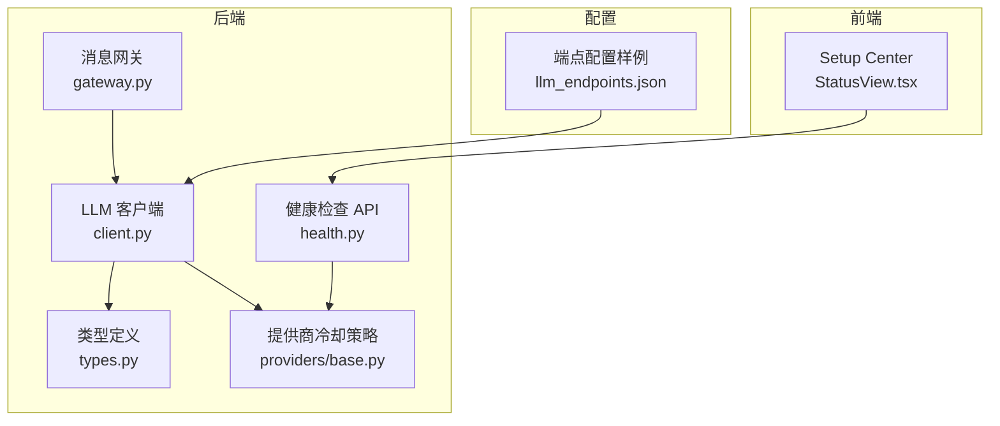
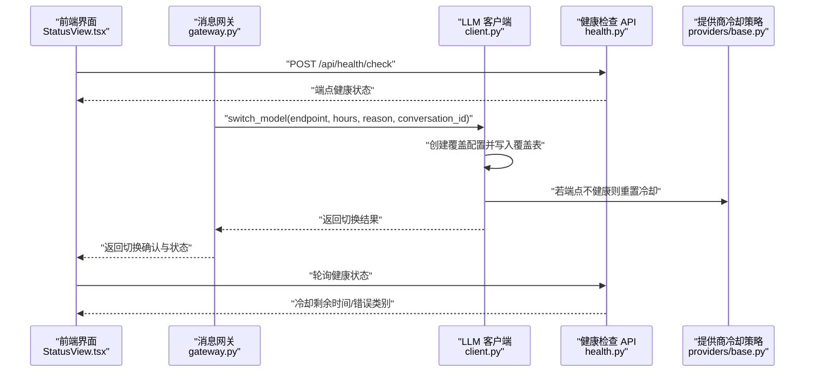
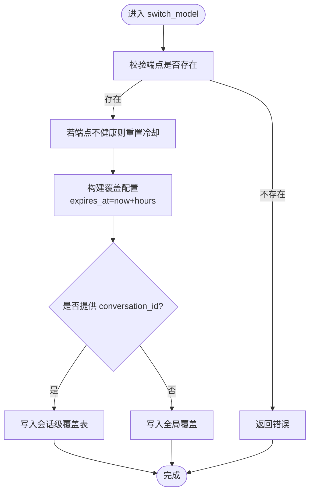
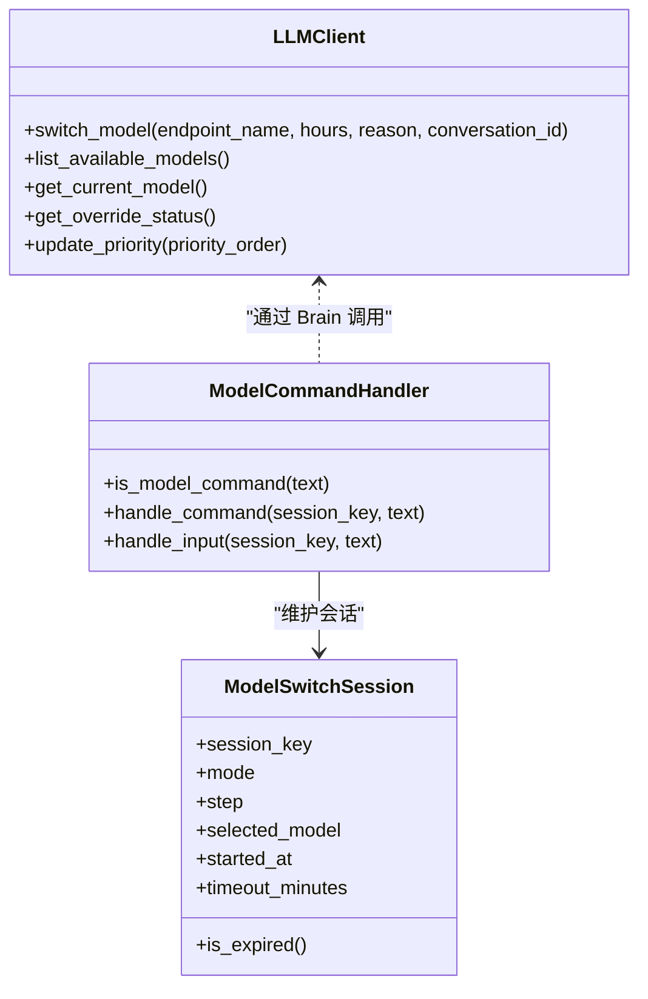
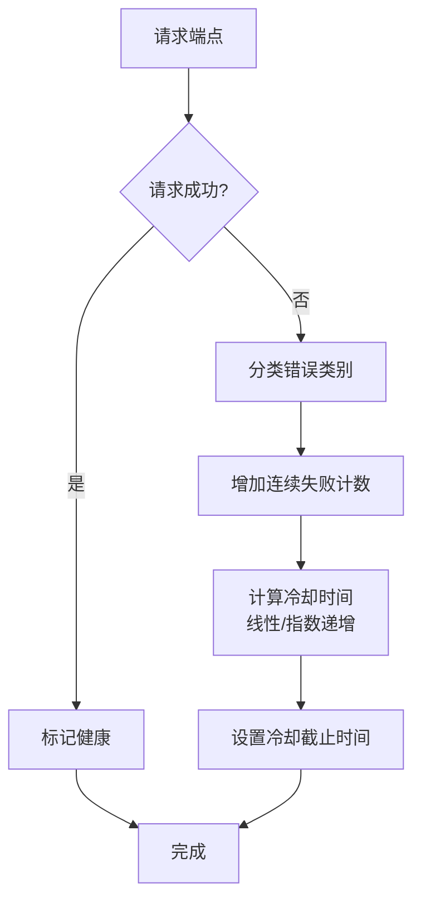
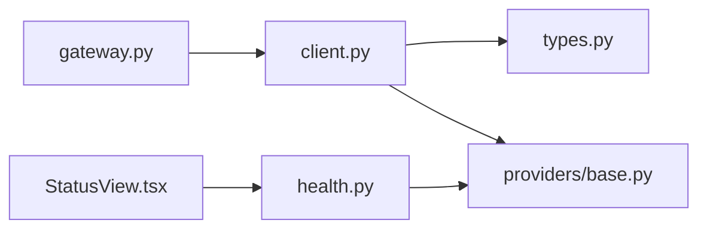

# 动态切换

<cite>
**本文引用的文件**
- [client.py](file://src/synapse/llm/client.py)
- [types.py](file://src/synapse/llm/types.py)
- [gateway.py](file://src/synapse/channels/gateway.py)
- [llm_endpoints.json](file://data/llm_endpoints.json)
- [test_model_switch.py](file://scripts/test_model_switch.py)
- [base.py](file://src/synapse/llm/providers/base.py)
- [health.py](file://src/synapse/api/routes/health.py)
- [StatusView.tsx](file://apps/setup-center/src/views/StatusView.tsx)
</cite>

## 目录
1. [简介](#简介)
2. [项目结构](#项目结构)
3. [核心组件](#核心组件)
4. [架构总览](#架构总览)
5. [详细组件分析](#详细组件分析)
6. [依赖分析](#依赖分析)
7. [性能考虑](#性能考虑)
8. [故障排查指南](#故障排查指南)
9. [结论](#结论)
10. [附录](#附录)

## 简介
本技术文档围绕“LLM 动态切换系统”展开，聚焦以下关键主题：
- 端点临时覆盖机制与生命周期管理
- 模型切换策略（永久/会话级/全局）
- 切换配置结构、过期时间处理、切换原因记录
- 切换策略优化与故障恢复机制
- 前端可视化与健康检查联动

文档旨在帮助开发者与运维人员快速理解并正确使用动态切换能力，同时提供可视化图示与实操建议。

## 项目结构
动态切换涉及的核心代码分布在如下模块：
- LLM 客户端与端点管理：src/synapse/llm/client.py
- 端点与模型类型定义：src/synapse/llm/types.py
- 消息网关与命令处理：src/synapse/channels/gateway.py
- 端点配置样例：data/llm_endpoints.json
- 测试脚本：scripts/test_model_switch.py
- 提供商健康与冷却策略：src/synapse/llm/providers/base.py
- 健康检查 API 与前端状态页：src/synapse/api/routes/health.py、apps/setup-center/src/views/StatusView.tsx

**图表来源**
- [gateway.py:102-400](file://src/synapse/channels/gateway.py#L102-L400)
- [client.py:975-1018](file://src/synapse/llm/client.py#L975-L1018)
- [types.py:492-661](file://src/synapse/llm/types.py#L492-L661)
- [base.py:224-255](file://src/synapse/llm/providers/base.py#L224-L255)
- [health.py:166-200](file://src/synapse/api/routes/health.py#L166-L200)
- [llm_endpoints.json:1-70](file://data/llm_endpoints.json#L1-L70)
- [StatusView.tsx:349-443](file://apps/setup-center/src/views/StatusView.tsx#L349-L443)

**章节来源**
- [client.py:975-1018](file://src/synapse/llm/client.py#L975-L1018)
- [types.py:492-661](file://src/synapse/llm/types.py#L492-L661)
- [gateway.py:102-400](file://src/synapse/channels/gateway.py#L102-L400)
- [llm_endpoints.json:1-70](file://data/llm_endpoints.json#L1-L70)
- [base.py:224-255](file://src/synapse/llm/providers/base.py#L224-L255)
- [health.py:166-200](file://src/synapse/api/routes/health.py#L166-L200)
- [StatusView.tsx:349-443](file://apps/setup-center/src/views/StatusView.tsx#L349-L443)

## 核心组件
- LLM 客户端（LLMClient）
  - 提供端点覆盖、优先级查询、当前模型选择、覆盖状态查询与恢复默认等能力
  - 支持会话级覆盖（conversation_id）与全局覆盖
- 端点配置（EndpointConfig）
  - 描述端点名称、提供商、API 类型、基础地址、密钥、模型、优先级、能力、超时、定价等
- 模型切换命令处理器（ModelCommandHandler）
  - 支持 /model、/switch、/priority、/restore、/cancel 等命令
  - 维护交互会话（ModelSwitchSession），包含超时控制
- 健康检查与冷却策略
  - 提供商根据错误类别与连续失败次数动态延长冷却时间
  - 健康检查 API 返回端点状态、冷却剩余时间等

**章节来源**
- [client.py:1771-1815](file://src/synapse/llm/client.py#L1771-L1815)
- [client.py:1942-1984](file://src/synapse/llm/client.py#L1942-L1984)
- [client.py:1985-2004](file://src/synapse/llm/client.py#L1985-L2004)
- [types.py:492-661](file://src/synapse/llm/types.py#L492-L661)
- [gateway.py:102-400](file://src/synapse/channels/gateway.py#L102-L400)
- [base.py:224-255](file://src/synapse/llm/providers/base.py#L224-L255)
- [health.py:166-200](file://src/synapse/api/routes/health.py#L166-L200)

## 架构总览
动态切换的端到端流程包括：前端命令触发、网关解析与会话管理、客户端执行覆盖、健康检查与冷却策略协同、以及前端状态刷新。

**图表来源**
- [gateway.py:102-400](file://src/synapse/channels/gateway.py#L102-L400)
- [client.py:1771-1815](file://src/synapse/llm/client.py#L1771-L1815)
- [client.py:975-1018](file://src/synapse/llm/client.py#L975-L1018)
- [base.py:224-255](file://src/synapse/llm/providers/base.py#L224-L255)
- [health.py:166-200](file://src/synapse/api/routes/health.py#L166-L200)
- [StatusView.tsx:349-443](file://apps/setup-center/src/views/StatusView.tsx#L349-L443)

## 详细组件分析

### 端点临时覆盖机制与生命周期
- 覆盖创建
  - 调用 switch_model(endpoint_name, hours, reason, conversation_id)
  - 若指定 conversation_id，则写入会话级覆盖表；否则写入全局覆盖
  - 覆盖包含到期时间 expires_at 与原因 reason
- 覆盖生效与清理
  - 选择当前模型时，优先检查会话级覆盖，再检查全局覆盖
  - 每次调用会清理过期覆盖（会话级与全局分别处理）
  - 当会话级覆盖数量超过阈值时，定期批量清理过期会话覆盖，避免内存泄漏
- 覆盖状态查询
  - get_override_status 返回覆盖端点名、剩余小时、到期时间与原因

**图表来源**
- [client.py:1771-1815](file://src/synapse/llm/client.py#L1771-L1815)
- [client.py:975-1018](file://src/synapse/llm/client.py#L975-L1018)

**章节来源**
- [client.py:1771-1815](file://src/synapse/llm/client.py#L1771-L1815)
- [client.py:975-1018](file://src/synapse/llm/client.py#L975-L1018)
- [client.py:1985-2004](file://src/synapse/llm/client.py#L1985-L2004)

### 模型切换策略与覆盖范围
- 会话级切换（Conversation Override）
  - 通过 conversation_id 指定，仅影响该会话内的后续请求
  - 适合临时调试、特定对话场景或 A/B 对比
- 全局切换（Global Override）
  - 不提供 conversation_id，影响当前进程内所有未被会话级覆盖屏蔽的请求
  - 适合紧急切换、临时策略变更
- 永久切换
  - 通过调整端点优先级（update_priority）实现“永久”效果
  - 与覆盖不同，覆盖带有明确的过期时间，而优先级调整是持久的端点排序

**图表来源**
- [client.py:1771-1815](file://src/synapse/llm/client.py#L1771-L1815)
- [client.py:1942-1984](file://src/synapse/llm/client.py#L1942-L1984)
- [gateway.py:84-100](file://src/synapse/channels/gateway.py#L84-L100)
- [gateway.py:102-400](file://src/synapse/channels/gateway.py#L102-L400)

**章节来源**
- [client.py:1771-1815](file://src/synapse/llm/client.py#L1771-L1815)
- [client.py:2006-2018](file://src/synapse/llm/client.py#L2006-L2018)
- [gateway.py:102-400](file://src/synapse/channels/gateway.py#L102-L400)

### 切换配置结构与过期时间处理
- EndpointConfig 字段要点
  - name/provider/api_type/base_url/api_key_env/api_key/model/priority/max_tokens/context_window/timeout/capabilities/extra_params/note/rpm_limit/pricing_tiers/price_currency/enabled/stream_only
- 过期时间与原因
  - 覆盖对象包含 expires_at 与 reason，用于记录到期时间与切换原因
  - 覆盖清理逻辑会在必要时自动移除过期条目，并在会话级覆盖数量较多时批量清理

**章节来源**
- [types.py:492-661](file://src/synapse/llm/types.py#L492-L661)
- [client.py:1771-1815](file://src/synapse/llm/client.py#L1771-L1815)
- [client.py:975-1018](file://src/synapse/llm/client.py#L975-L1018)

### 健康检查与冷却策略
- 冷却策略
  - 根据错误类别与连续失败次数递增冷却时间
  - 连续失败达到一定阈值后，逐步延长冷却步长
- 健康检查 API
  - 返回端点状态、延迟、错误信息、连续失败次数、冷却剩余时间、是否扩展冷却、最近检查时间
- 前端状态页
  - 支持全量健康检查与单端点检查，展示冷却剩余时间与错误类别

**图表来源**
- [base.py:224-255](file://src/synapse/llm/providers/base.py#L224-L255)
- [health.py:166-200](file://src/synapse/api/routes/health.py#L166-L200)
- [StatusView.tsx:349-443](file://apps/setup-center/src/views/StatusView.tsx#L349-L443)

**章节来源**
- [base.py:224-255](file://src/synapse/llm/providers/base.py#L224-L255)
- [health.py:166-200](file://src/synapse/api/routes/health.py#L166-L200)
- [StatusView.tsx:349-443](file://apps/setup-center/src/views/StatusView.tsx#L349-L443)

### 前端命令与会话管理
- 命令识别与处理
  - /model：查看当前模型与可用列表，显示覆盖剩余时间
  - /switch：启动切换会话，支持选择模型、确认切换
  - /priority：调整端点优先级（永久）
  - /restore：恢复默认模型
  - /cancel：取消当前操作
- 会话超时
  - 交互会话默认 5 分钟超时，超时自动清理

**章节来源**
- [gateway.py:102-400](file://src/synapse/channels/gateway.py#L102-L400)

## 依赖分析
- LLMClient 依赖
  - EndpointConfig：端点配置与能力描述
  - Provider 冷却策略：健康状态与冷却时间
  - 会话键（conversation_id）：区分会话级覆盖
- 命令处理器依赖
  - Brain（通过 LLMClient）：提供模型列表与切换能力
  - 会话管理：ModelSwitchSession 生命周期

**图表来源**
- [gateway.py:102-400](file://src/synapse/channels/gateway.py#L102-L400)
- [client.py:1771-1815](file://src/synapse/llm/client.py#L1771-L1815)
- [types.py:492-661](file://src/synapse/llm/types.py#L492-L661)
- [base.py:224-255](file://src/synapse/llm/providers/base.py#L224-L255)
- [health.py:166-200](file://src/synapse/api/routes/health.py#L166-L200)
- [StatusView.tsx:349-443](file://apps/setup-center/src/views/StatusView.tsx#L349-L443)

**章节来源**
- [gateway.py:102-400](file://src/synapse/channels/gateway.py#L102-L400)
- [client.py:1771-1815](file://src/synapse/llm/client.py#L1771-L1815)
- [types.py:492-661](file://src/synapse/llm/types.py#L492-L661)
- [base.py:224-255](file://src/synapse/llm/providers/base.py#L224-L255)
- [health.py:166-200](file://src/synapse/api/routes/health.py#L166-L200)
- [StatusView.tsx:349-443](file://apps/setup-center/src/views/StatusView.tsx#L349-L443)

## 性能考虑
- 覆盖清理策略
  - 会话级覆盖在数量超过阈值时批量清理，避免每次调用遍历全表带来的开销
- 优先级与健康筛选
  - 优先返回健康端点，减少失败重试与冷却等待
- 健康检查频率
  - 建议前端按需轮询，避免频繁请求造成压力

[本节为通用指导，无需具体文件引用]

## 故障排查指南
- 切换未生效
  - 检查覆盖是否过期（get_override_status）
  - 确认 conversation_id 是否正确传递
  - 查看当前模型是否被更高优先级健康端点覆盖
- 端点不可用
  - 查看健康检查 API 返回的冷却剩余时间与错误类别
  - 若为配额/认证错误，快速失败策略会阻止重试
- 会话超时
  - 交互会话默认 5 分钟超时，超时后会话会被自动清理
- 端点配置问题
  - 使用 llm_endpoints.json 样例核对字段（name、provider、api_type、base_url、api_key_env、model、priority、capabilities、timeout、enabled）

**章节来源**
- [client.py:1985-2004](file://src/synapse/llm/client.py#L1985-L2004)
- [client.py:975-1018](file://src/synapse/llm/client.py#L975-L1018)
- [health.py:166-200](file://src/synapse/api/routes/health.py#L166-L200)
- [llm_endpoints.json:1-70](file://data/llm_endpoints.json#L1-L70)
- [gateway.py:102-400](file://src/synapse/channels/gateway.py#L102-L400)

## 结论
动态切换系统通过“覆盖 + 优先级 + 健康检查”的组合，实现了灵活、可控且可观测的模型切换能力。会话级覆盖满足临时需求，全局覆盖用于紧急处置，优先级调整提供“永久”策略。配合冷却与健康检查，系统能在异常情况下自动恢复并保持稳定性。前端状态页与命令处理器进一步提升了可操作性与可观测性。

[本节为总结，无需具体文件引用]

## 附录

### 切换配置示例（来自样例配置）
- 端点列表包含 primary 与 iwhalecloud-claude-4.5-sonnet
- 编译器端点 compiler-iwhalecloud-gpt-4o-mini
- 设置项包含重试次数、重试延迟、健康检查间隔、失败回退开关

**章节来源**
- [llm_endpoints.json:1-70](file://data/llm_endpoints.json#L1-L70)

### 测试脚本要点（验证覆盖、命令处理、集成）
- LLMClient 覆盖机制与优先级更新
- Tool Context 检测（工具调用/结果）
- ModelCommandHandler 命令识别与会话管理
- 集成测试（真实配置文件存在时）

**章节来源**
- [test_model_switch.py:1-574](file://scripts/test_model_switch.py#L1-L574)