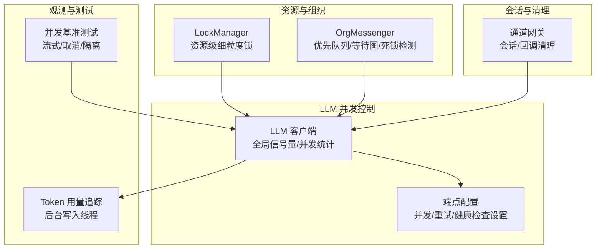
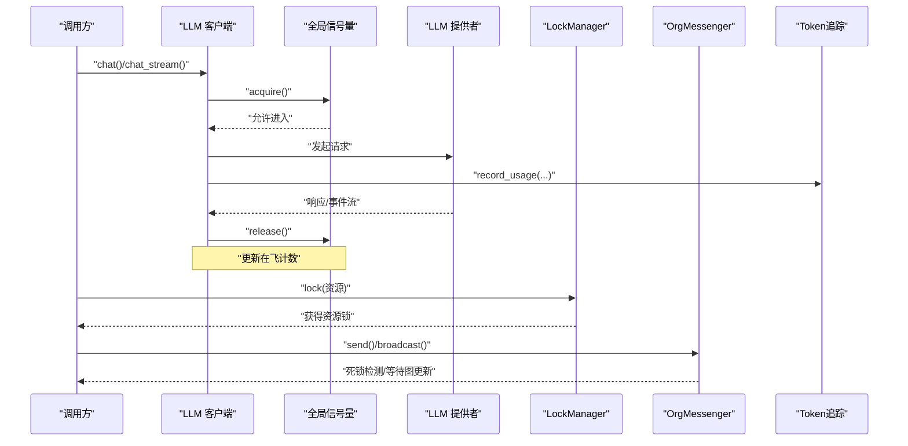
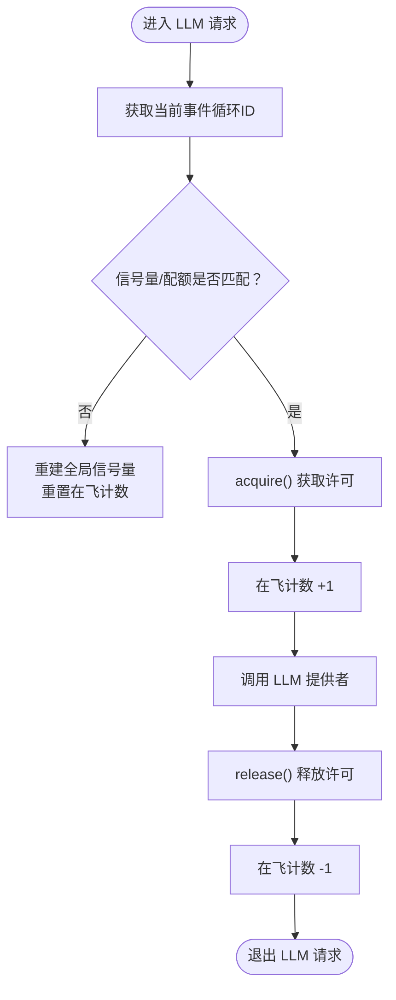
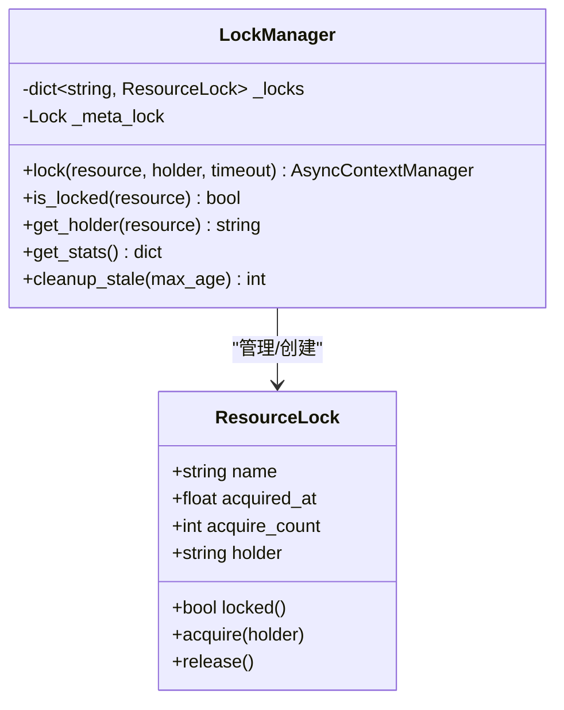
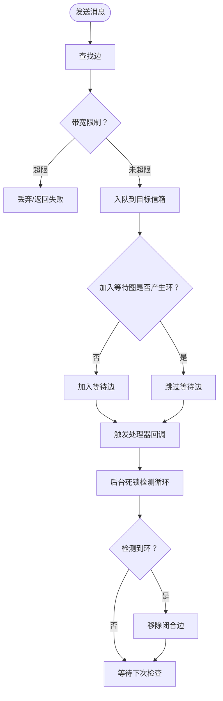
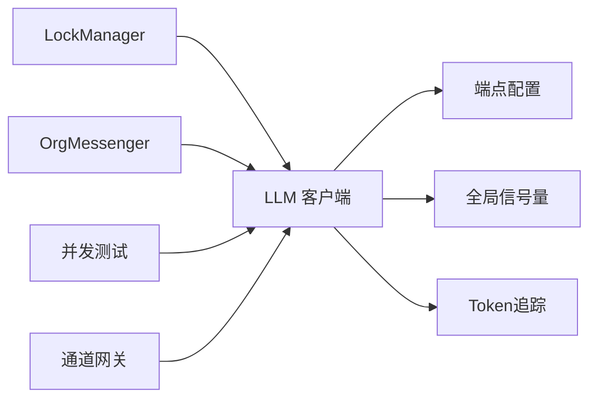

# 并发控制

<cite>
**本文引用的文件**
- [src/synapse/llm/client.py](file://src/synapse/llm/client.py)
- [src/synapse/agents/lock_manager.py](file://src/synapse/agents/lock_manager.py)
- [src/synapse/orgs/messenger.py](file://src/synapse/orgs/messenger.py)
- [src/synapse/llm/config.py](file://src/synapse/llm/config.py)
- [src/synapse/core/token_tracking.py](file://src/synapse/core/token_tracking.py)
- [tests/test_concurrent_streaming.py](file://tests/test_concurrent_streaming.py)
- [src/synapse/channels/gateway.py](file://src/synapse/channels/gateway.py)
</cite>

## 目录
1. [简介](#简介)
2. [项目结构](#项目结构)
3. [核心组件](#核心组件)
4. [架构总览](#架构总览)
5. [详细组件分析](#详细组件分析)
6. [依赖分析](#依赖分析)
7. [性能考量](#性能考量)
8. [故障排查指南](#故障排查指南)
9. [结论](#结论)
10. [附录](#附录)

## 简介
本技术文档聚焦于系统中的LLM并发控制系统，围绕以下目标展开：全局并发信号量机制、事件循环绑定策略、并发请求统计；最大并发数配置、请求队列管理、资源竞争处理；并发性能监控、死锁预防机制、资源泄漏防护；并发调优参数、性能基准测试与故障诊断方法。文档以代码为依据，结合可视化图示，帮助读者快速理解并安全地扩展与优化并发控制能力。

## 项目结构
并发控制相关的关键模块分布如下：
- LLM客户端与全局并发信号量：位于 LLM 客户端中，采用基于事件循环的全局信号量，限制同时在飞请求数量，并提供并发统计。
- 资源级细粒度锁：LockManager 提供按资源标识的异步锁，避免多实例并发访问共享资源。
- 组织内消息路由与死锁检测：OrgMessenger 使用优先队列与等待图，周期性检测并打破潜在死锁，保障消息流转稳定。
- 端点配置与并发参数：端点配置文件支持全局设置项，包括并发、重试、健康检查等参数。
- Token用量追踪：后台线程异步写入数据库，记录并发场景下的用量与成本，辅助性能分析。
- 并发基准测试：集成测试覆盖并发流式、取消隔离、上下文保持等关键行为。
- 会话清理与资源回收：通道网关清理过期会话与回调，防止资源泄漏。

**图表来源**
- [src/synapse/llm/client.py](file://src/synapse/llm/client.py)
- [src/synapse/llm/config.py](file://src/synapse/llm/config.py)
- [src/synapse/agents/lock_manager.py](file://src/synapse/agents/lock_manager.py)
- [src/synapse/orgs/messenger.py](file://src/synapse/orgs/messenger.py)
- [src/synapse/core/token_tracking.py](file://src/synapse/core/token_tracking.py)
- [tests/test_concurrent_streaming.py](file://tests/test_concurrent_streaming.py)
- [src/synapse/channels/gateway.py](file://src/synapse/channels/gateway.py)

**章节来源**
- [src/synapse/llm/client.py](file://src/synapse/llm/client.py)
- [src/synapse/llm/config.py](file://src/synapse/llm/config.py)
- [src/synapse/agents/lock_manager.py](file://src/synapse/agents/lock_manager.py)
- [src/synapse/orgs/messenger.py](file://src/synapse/orgs/messenger.py)
- [src/synapse/core/token_tracking.py](file://src/synapse/core/token_tracking.py)
- [tests/test_concurrent_streaming.py](file://tests/test_concurrent_streaming.py)
- [src/synapse/channels/gateway.py](file://src/synapse/channels/gateway.py)

## 核心组件
- 全局并发信号量与统计
  - LLMClient 使用基于事件循环的全局信号量，限制同时在飞请求数量，避免并发风暴。
  - 提供并发统计接口，返回当前在飞请求数与最大并发配额，便于健康监控。
- 资源级细粒度锁
  - LockManager 提供 per-resource 异步锁，支持超时与持有者标记，防止多实例并发访问共享资源。
- 组织内消息路由与死锁检测
  - OrgMessenger 使用优先队列承载节点间消息，维护等待图并在后台周期检测死锁，必要时移除边以打破循环。
- 端点配置与并发参数
  - 端点配置文件支持全局设置项，包括并发上限、重试次数、健康检查间隔等。
- Token用量追踪
  - 后台线程异步写入数据库，记录输入/输出/缓存/上下文等Token用量与成本，辅助并发性能分析。
- 并发基准测试
  - 集成测试覆盖并发流式、取消隔离、上下文保持等关键行为，验证并发池的稳定性与隔离性。
- 会话清理与资源回收
  - 通道网关定期清理过期会话、中断回调、进度缓冲与任务，防止资源泄漏。

**章节来源**
- [src/synapse/llm/client.py](file://src/synapse/llm/client.py)
- [src/synapse/agents/lock_manager.py](file://src/synapse/agents/lock_manager.py)
- [src/synapse/orgs/messenger.py](file://src/synapse/orgs/messenger.py)
- [src/synapse/llm/config.py](file://src/synapse/llm/config.py)
- [src/synapse/core/token_tracking.py](file://src/synapse/core/token_tracking.py)
- [tests/test_concurrent_streaming.py](file://tests/test_concurrent_streaming.py)
- [src/synapse/channels/gateway.py](file://src/synapse/channels/gateway.py)

## 架构总览
下图展示了并发控制在系统中的关键交互：LLM 客户端通过全局信号量限制并发，LockManager 保护共享资源，OrgMessenger 保障消息流转与死锁预防，Token追踪记录用量，测试验证并发行为，网关清理资源。

**图表来源**
- [src/synapse/llm/client.py](file://src/synapse/llm/client.py)
- [src/synapse/agents/lock_manager.py](file://src/synapse/agents/lock_manager.py)
- [src/synapse/orgs/messenger.py](file://src/synapse/orgs/messenger.py)
- [src/synapse/core/token_tracking.py](file://src/synapse/core/token_tracking.py)

## 详细组件分析

### LLM 全局并发信号量与统计
- 事件循环绑定策略
  - 全局信号量与事件循环ID绑定，确保每个事件循环拥有独立的并发配额与计数。
  - 当事件循环变更或最大并发配额变化时，自动重建信号量并重置在飞计数。
- 并发统计
  - 提供并发统计接口，返回当前在飞请求数与最大并发配额，用于健康监控与告警。
- 请求生命周期
  - 在进入请求处理前后分别增加/减少在飞计数，保证统计准确。

**图表来源**
- [src/synapse/llm/client.py](file://src/synapse/llm/client.py)

**章节来源**
- [src/synapse/llm/client.py](file://src/synapse/llm/client.py)

### 资源级细粒度锁（LockManager）
- 设计要点
  - 每个资源标识对应一个异步锁，支持超时获取与持有者标记。
  - 提供统计接口，查看总锁数、活动锁数与持有者信息。
  - 提供清理过期锁与回收无用锁条目的能力，防止内存增长。
- 使用建议
  - 将共享资源标识规范化（如 file:/path、memory:agent_id、tool:browser），避免锁粒度过粗导致不必要的串行。

**图表来源**
- [src/synapse/agents/lock_manager.py](file://src/synapse/agents/lock_manager.py)

**章节来源**
- [src/synapse/agents/lock_manager.py](file://src/synapse/agents/lock_manager.py)

### 组织内消息路由与死锁检测（OrgMessenger）
- 优先队列与信箱
  - 每个节点拥有独立的异步优先队列信箱，支持暂停/恢复、处理计数与phantom去重。
- 等待图与死锁检测
  - 维护等待图，周期性DFS检测环路；检测到环时移除“闭合边”以打破循环。
- TTL与广播
  - 支持消息TTL过期清理，以及按部门/全组织广播。
- 任务亲和性
  - 将任务链绑定到特定节点，确保后续消息沿同一克隆链路流转。

**图表来源**
- [src/synapse/orgs/messenger.py](file://src/synapse/orgs/messenger.py)

**章节来源**
- [src/synapse/orgs/messenger.py](file://src/synapse/orgs/messenger.py)

### 端点配置与并发参数
- 配置加载
  - 支持从JSON文件加载端点配置，解析主端点、编译器端点、STT端点与全局设置。
- 全局设置项
  - 包含重试次数、重试延迟、健康检查间隔、失败回退等，直接影响并发稳定性与恢复能力。
- 最大并发数
  - LLM 客户端默认最大并发值可在设置中覆盖，信号量按事件循环与配额动态重建。

**章节来源**
- [src/synapse/llm/config.py](file://src/synapse/llm/config.py)
- [src/synapse/llm/client.py](file://src/synapse/llm/client.py)

### Token 用量追踪与并发监控
- 上下文与写入线程
  - 通过 contextvars 设置调用上下文，后台写入线程批量写入数据库，记录输入/输出/缓存/上下文Token用量与成本。
- 并发关联
  - 结合并发统计与Token用量，可评估并发对吞吐与成本的影响，指导调优。

**章节来源**
- [src/synapse/core/token_tracking.py](file://src/synapse/core/token_tracking.py)
- [src/synapse/llm/client.py](file://src/synapse/llm/client.py)

### 并发基准测试与行为验证
- 测试覆盖
  - 包括服务健康检查、并发池启用、单/多会话并发、取消隔离、上下文保持、压力测试等。
- 关键指标
  - 并发重叠时间、会话隔离、上下文一致性、池完整性等，用于判断并发控制有效性。

**章节来源**
- [tests/test_concurrent_streaming.py](file://tests/test_concurrent_streaming.py)

### 会话清理与资源回收
- 清理范围
  - 清理非活跃处理会话、中断回调、进度缓冲、进度刷新任务、会话任务等，防止资源泄漏。
- 与并发的关系
  - 及时清理可避免会话堆积导致的内存与句柄压力，间接提升并发稳定性。

**章节来源**
- [src/synapse/channels/gateway.py](file://src/synapse/channels/gateway.py)

## 依赖分析
- 组件耦合
  - LLM 客户端依赖事件循环与全局信号量，受端点配置影响并发上限。
  - LockManager 独立于LLM，但常被业务逻辑用于保护共享资源。
  - OrgMessenger 与消息处理流程耦合，死锁检测与TTL清理为后台任务。
  - Token追踪与LLM调用强关联，用于并发场景下的用量与成本统计。
- 外部依赖
  - asyncio 事件循环与并发原语（Semaphore/Lock/Queue）。
  - sqlite3 后台写入线程（Token追踪）。

**图表来源**
- [src/synapse/llm/client.py](file://src/synapse/llm/client.py)
- [src/synapse/llm/config.py](file://src/synapse/llm/config.py)
- [src/synapse/agents/lock_manager.py](file://src/synapse/agents/lock_manager.py)
- [src/synapse/orgs/messenger.py](file://src/synapse/orgs/messenger.py)
- [src/synapse/core/token_tracking.py](file://src/synapse/core/token_tracking.py)
- [tests/test_concurrent_streaming.py](file://tests/test_concurrent_streaming.py)
- [src/synapse/channels/gateway.py](file://src/synapse/channels/gateway.py)

**章节来源**
- [src/synapse/llm/client.py](file://src/synapse/llm/client.py)
- [src/synapse/llm/config.py](file://src/synapse/llm/config.py)
- [src/synapse/agents/lock_manager.py](file://src/synapse/agents/lock_manager.py)
- [src/synapse/orgs/messenger.py](file://src/synapse/orgs/messenger.py)
- [src/synapse/core/token_tracking.py](file://src/synapse/core/token_tracking.py)
- [tests/test_concurrent_streaming.py](file://tests/test_concurrent_streaming.py)
- [src/synapse/channels/gateway.py](file://src/synapse/channels/gateway.py)

## 性能考量
- 并发上限与事件循环
  - 建议根据CPU/IO与外部API限速合理设置最大并发，避免事件循环被大量阻塞任务拖垮。
- 信号量重建与统计
  - 配额变更或事件循环切换时会重建信号量，应避免频繁切换以降低开销。
- 资源锁粒度
  - 锁粒度过粗会导致不必要的串行，建议按最小共享单元划分资源标识。
- 死锁预防
  - 保持等待图简洁，避免长链路依赖；必要时引入超时或随机抖动打破僵局。
- Token追踪
  - 后台写入批量化，注意数据库I/O瓶颈；在高并发场景下可考虑调整批大小或落库频率。

[本节为通用指导，无需特定文件引用]

## 故障排查指南
- 并发过高导致的阻塞
  - 现象：事件循环卡顿、请求超时。
  - 排查：检查并发统计与在飞计数，确认最大并发配额是否过低；观察Token用量与成本是否异常升高。
- 资源竞争与死锁
  - 现象：消息长时间停滞、节点冻结。
  - 排查：查看等待图与死锁检测日志；确认是否存在环路；检查LockManager持有的锁与超时配置。
- 会话泄漏
  - 现象：内存持续增长、句柄占用上升。
  - 排查：检查通道网关清理逻辑是否生效；确认取消/中断回调是否及时清理。
- 认证失败与端点跳过
  - 现象：部分端点不可用。
  - 排查：查看健康检查日志与认证失败集合；确认配置重载后端点状态。

**章节来源**
- [src/synapse/llm/client.py](file://src/synapse/llm/client.py)
- [src/synapse/agents/lock_manager.py](file://src/synapse/agents/lock_manager.py)
- [src/synapse/orgs/messenger.py](file://src/synapse/orgs/messenger.py)
- [src/synapse/channels/gateway.py](file://src/synapse/channels/gateway.py)

## 结论
本系统通过“事件循环绑定的全局信号量 + 资源级细粒度锁 + 组织内消息死锁检测 + Token用量追踪 + 并发基准测试 + 会话清理”的组合，构建了稳健的LLM并发控制体系。实践中应结合业务负载与外部API限速，合理设置并发上限与重试策略，并持续通过监控与测试验证并发行为的正确性与稳定性。

[本节为总结，无需特定文件引用]

## 附录
- 并发调优参数建议
  - 最大并发：根据事件循环与外部API限速设定，逐步压测确定最优值。
  - 重试次数与延迟：平衡失败恢复与请求积压，避免雪崩。
  - 健康检查间隔：兼顾探测及时性与系统开销。
  - 资源锁超时：避免长尾阻塞，结合业务特性设置合理阈值。
- 性能基准测试清单
  - 单/多会话并发、取消隔离、上下文保持、压力测试、池完整性校验。
- 故障诊断清单
  - 并发统计与在飞计数、等待图与死锁日志、LockManager持有者与超时、通道网关清理状态、认证失败端点集合。

[本节为通用指导，无需特定文件引用]