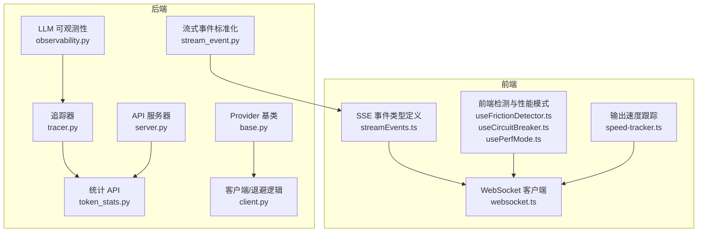
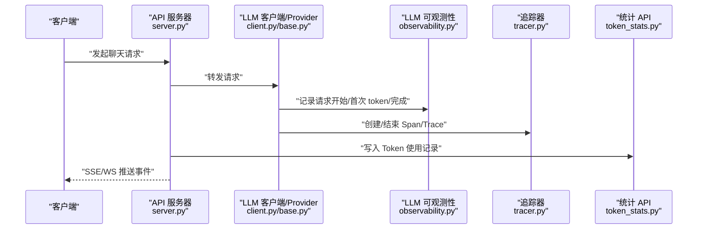
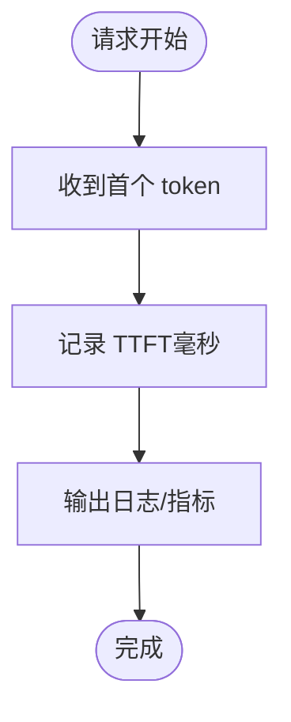
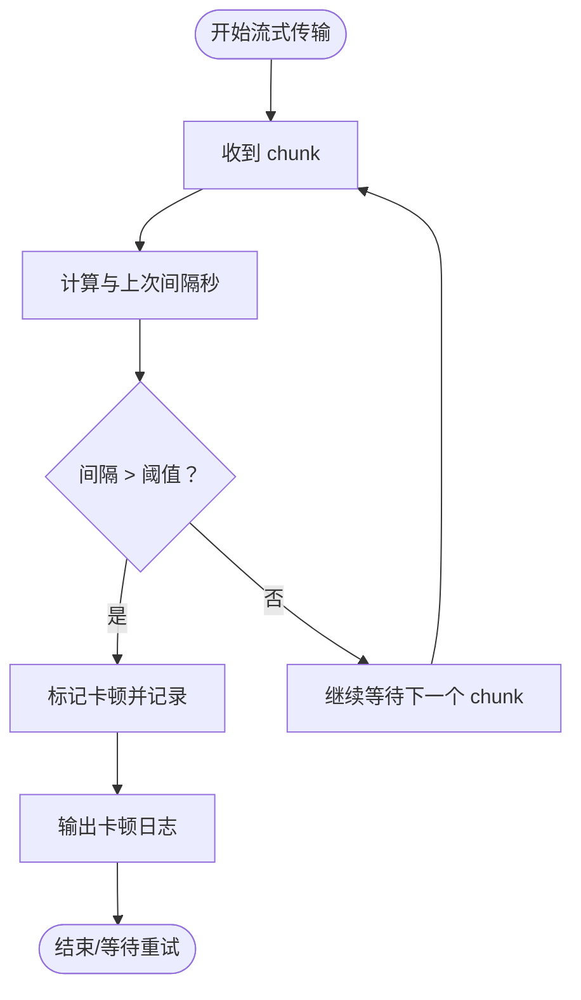
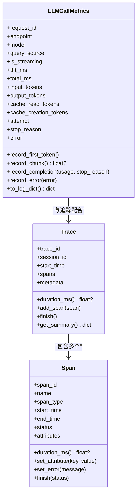
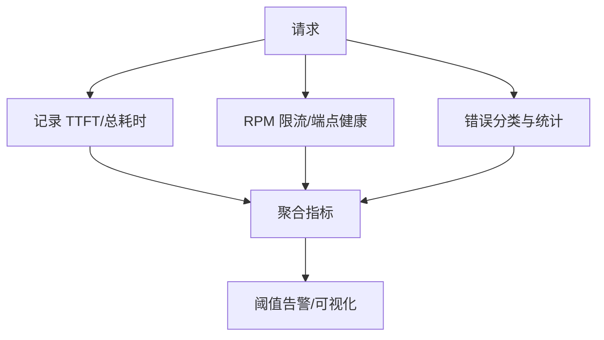
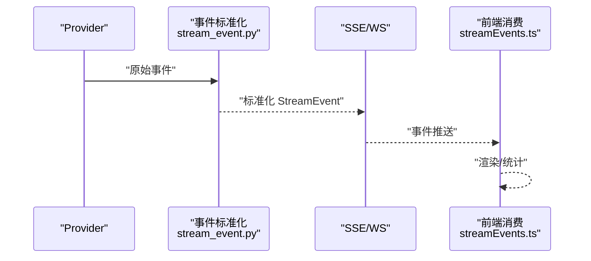
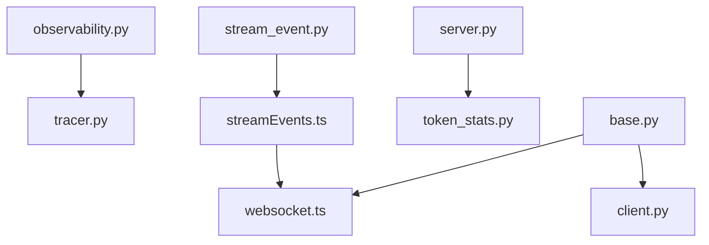

# 性能监控

<cite>
**本文档引用的文件**
- [observability.py](file://src/synapse/llm/observability.py)
- [tracer.py](file://src/synapse/tracing/tracer.py)
- [stream_event.py](file://src/synapse/llm/stream_event.py)
- [token_stats.py](file://src/synapse/api/routes/token_stats.py)
- [sop_tracking.py](file://src/synapse/core/sop_tracking.py)
- [base.py](file://src/synapse/llm/providers/base.py)
- [client.py](file://src/synapse/llm/client.py)
- [server.py](file://src/synapse/api/server.py)
- [events.py](file://src/synapse/events.py)
- [streamEvents.ts](file://apps/setup-center/src/streamEvents.ts)
- [websocket.ts](file://apps/setup-center/src/platform/websocket.ts)
- [useFrictionDetector.ts](file://apps/setup-center/src/views/chat/hooks/useFrictionDetector.ts)
- [useCircuitBreaker.ts](file://apps/setup-center/src/views/chat/hooks/useCircuitBreaker.ts)
- [usePerfMode.ts](file://apps/setup-center/src/hooks/usePerfMode.ts)
- [metrics.py](file://src/synapse/evaluation/metrics.py)
- [optimizer.py](file://src/synapse/evaluation/optimizer.py)
- [errors.py](file://src/synapse/utils/errors.py)
- [speed-tracker.ts](file://apps/setup-center/src-tauri/resources/claude-code-init/.claude/plugins/marketplaces/claude-hud/src/speed-tracker.ts)
</cite>

## 目录
1. [简介](#简介)
2. [项目结构](#项目结构)
3. [核心组件](#核心组件)
4. [架构总览](#架构总览)
5. [详细组件分析](#详细组件分析)
6. [依赖分析](#依赖分析)
7. [性能考量](#性能考量)
8. [故障排查指南](#故障排查指南)
9. [结论](#结论)
10. [附录](#附录)

## 简介
本文件面向 LLM 性能监控系统，围绕以下关键能力进行技术文档化：
- TTFT（首字节时间）检测与记录
- 流式卡顿（stall）检测机制
- 结构化指标采集与上报
- 请求延迟监控、吞吐量统计、错误率追踪
- 性能指标可视化与告警阈值配置
- 性能瓶颈分析与调优建议
- 监控仪表板配置与故障诊断方法

该系统由后端可观测性基础设施、前端事件协议与可视化组件、以及 API 层统计接口共同构成，覆盖从请求发起、流式传输、指标采集到可视化呈现的全链路。

## 项目结构
本项目的性能监控相关代码主要分布在如下模块：
- 后端可观测性与追踪：LLM 调用指标、Span/Trace 追踪、流式事件标准化
- API 层统计：Token 使用统计、时间线与汇总接口
- 前端事件协议与可视化：SSE/WS 事件类型、图表组件、性能模式开关
- 错误分类与退避策略：端点健康检查与冷静期管理



**图示来源**
- [observability.py:1-181](file://src/synapse/llm/observability.py#L1-L181)
- [tracer.py:1-507](file://src/synapse/tracing/tracer.py#L1-L507)
- [stream_event.py:1-198](file://src/synapse/llm/stream_event.py#L1-L198)
- [token_stats.py:1-279](file://src/synapse/api/routes/token_stats.py#L1-L279)
- [base.py:1-485](file://src/synapse/llm/providers/base.py#L1-L485)
- [client.py:899-920](file://src/synapse/llm/client.py#L899-L920)
- [server.py:1-712](file://src/synapse/api/server.py#L1-L712)
- [streamEvents.ts:1-57](file://apps/setup-center/src/streamEvents.ts#L1-L57)
- [websocket.ts:1-98](file://apps/setup-center/src/platform/websocket.ts#L1-L98)
- [useFrictionDetector.ts:1-72](file://apps/setup-center/src/views/chat/hooks/useFrictionDetector.ts#L1-L72)
- [useCircuitBreaker.ts:1-42](file://apps/setup-center/src/views/chat/hooks/useCircuitBreaker.ts#L1-L42)
- [usePerfMode.ts:1-41](file://apps/setup-center/src/hooks/usePerfMode.ts#L1-L41)
- [speed-tracker.ts:56-78](file://apps/setup-center/src-tauri/resources/claude-code-init/.claude/plugins/marketplaces/claude-hud/src/speed-tracker.ts#L56-L78)

**章节来源**
- [server.py:210-556](file://src/synapse/api/server.py#L210-L556)
- [token_stats.py:1-279](file://src/synapse/api/routes/token_stats.py#L1-L279)

## 核心组件
- LLM 调用可观测性（TTFT、stall、结构化指标）
- 追踪与 Span/Trace 数据模型
- 统一流式事件协议（SSE/WS）
- Token 使用统计 API
- Provider 冷静期与退避策略
- 前端事件协议与可视化组件

**章节来源**
- [observability.py:24-122](file://src/synapse/llm/observability.py#L24-L122)
- [tracer.py:19-176](file://src/synapse/tracing/tracer.py#L19-L176)
- [stream_event.py:15-198](file://src/synapse/llm/stream_event.py#L15-L198)
- [token_stats.py:96-279](file://src/synapse/api/routes/token_stats.py#L96-L279)
- [base.py:91-485](file://src/synapse/llm/providers/base.py#L91-L485)
- [streamEvents.ts:10-57](file://apps/setup-center/src/streamEvents.ts#L10-L57)
- [websocket.ts:26-98](file://apps/setup-center/src/platform/websocket.ts#L26-L98)

## 架构总览
下图展示了从请求发起到指标采集与可视化的整体流程，涵盖后端可观测性、流式事件标准化、API 统计与前端事件消费。



**图示来源**
- [server.py:385-401](file://src/synapse/api/server.py#L385-L401)
- [client.py:899-920](file://src/synapse/llm/client.py#L899-L920)
- [base.py:433-462](file://src/synapse/llm/providers/base.py#L433-L462)
- [observability.py:54-93](file://src/synapse/llm/observability.py#L54-L93)
- [tracer.py:178-284](file://src/synapse/tracing/tracer.py#L178-L284)
- [token_stats.py:111-144](file://src/synapse/api/routes/token_stats.py#L111-L144)

## 详细组件分析

### TTFT（首字节时间）检测
- 后端通过 LLMCallMetrics 记录首次 token 到达时间，并在 observer 中输出日志。
- 前端通过 SSE/WS 事件类型与流式事件标准化模块，确保不同 Provider 的事件格式一致，便于前端统计与展示。



**图示来源**
- [observability.py:54-59](file://src/synapse/llm/observability.py#L54-L59)
- [stream_event.py:38-110](file://src/synapse/llm/stream_event.py#L38-L110)
- [events.py:16-48](file://src/synapse/events.py#L16-L48)
- [streamEvents.ts:10-57](file://apps/setup-center/src/streamEvents.ts#L10-L57)

**章节来源**
- [observability.py:54-59](file://src/synapse/llm/observability.py#L54-L59)
- [stream_event.py:38-110](file://src/synapse/llm/stream_event.py#L38-L110)
- [events.py:16-48](file://src/synapse/events.py#L16-L48)
- [streamEvents.ts:10-57](file://apps/setup-center/src/streamEvents.ts#L10-L57)

### Stall（流式卡顿）检测机制
- 后端在记录每个 chunk 到达时，计算与上次到达的时间差；超过阈值（默认 30 秒）即判定为卡顿。
- observer 在检测到卡顿时输出警告日志，便于定位网络或上游服务异常。



**图示来源**
- [observability.py:61-69](file://src/synapse/llm/observability.py#L61-L69)
- [observability.py:145-151](file://src/synapse/llm/observability.py#L145-L151)

**章节来源**
- [observability.py:21-21](file://src/synapse/llm/observability.py#L21-L21)
- [observability.py:61-69](file://src/synapse/llm/observability.py#L61-L69)
- [observability.py:145-151](file://src/synapse/llm/observability.py#L145-L151)

### 结构化指标采集
- LLMCallMetrics 收集请求级指标（请求 ID、端点、模型、是否流式、TTFT、总耗时、Token 统计、停止原因、错误）。
- 追踪器 Span/Trace 提供细粒度的调用链路与维度统计（LLM 调用次数、工具调用次数、上下文压缩次数、推理迭代次数、Token 输入/输出等）。
- SOP 跟踪将 Token 使用写入数据库，支持按端点、操作类型、会话等维度聚合与时间序列统计。



**图示来源**
- [observability.py:24-122](file://src/synapse/llm/observability.py#L24-L122)
- [tracer.py:45-176](file://src/synapse/tracing/tracer.py#L45-L176)

**章节来源**
- [observability.py:24-122](file://src/synapse/llm/observability.py#L24-L122)
- [tracer.py:45-176](file://src/synapse/tracing/tracer.py#L45-L176)
- [sop_tracking.py:117-142](file://src/synapse/core/sop_tracking.py#L117-L142)

### 请求延迟监控、吞吐量统计、错误率追踪
- 请求延迟：TTFT 与总耗时（total_ms）直接反映端到端性能。
- 吞吐量：结合 RPM 限流器与端点健康状态，控制并发与速率，避免下游过载。
- 错误率：基于错误分类（认证、配额、结构性、瞬时、未知），统计错误比例与趋势。



**图示来源**
- [observability.py:71-93](file://src/synapse/llm/observability.py#L71-L93)
- [base.py:19-70](file://src/synapse/llm/providers/base.py#L19-L70)
- [base.py:324-405](file://src/synapse/llm/providers/base.py#L324-L405)
- [errors.py:13-40](file://src/synapse/utils/errors.py#L13-L40)

**章节来源**
- [observability.py:71-93](file://src/synapse/llm/observability.py#L71-L93)
- [base.py:19-70](file://src/synapse/llm/providers/base.py#L19-L70)
- [base.py:324-405](file://src/synapse/llm/providers/base.py#L324-L405)
- [errors.py:13-40](file://src/synapse/utils/errors.py#L13-L40)

### 统一流式事件协议与前端消费
- 后端将不同 Provider 的原始事件标准化为统一 StreamEvent，前端通过事件类型常量与 WebSocket/SSE 接收并渲染。
- 前端还提供摩擦检测与电路断路器钩子，辅助用户体验与稳定性。



**图示来源**
- [stream_event.py:38-198](file://src/synapse/llm/stream_event.py#L38-L198)
- [events.py:16-48](file://src/synapse/events.py#L16-L48)
- [streamEvents.ts:10-57](file://apps/setup-center/src/streamEvents.ts#L10-L57)
- [websocket.ts:50-98](file://apps/setup-center/src/platform/websocket.ts#L50-L98)

**章节来源**
- [stream_event.py:15-198](file://src/synapse/llm/stream_event.py#L15-L198)
- [events.py:16-48](file://src/synapse/events.py#L16-L48)
- [streamEvents.ts:10-57](file://apps/setup-center/src/streamEvents.ts#L10-L57)
- [websocket.ts:50-98](file://apps/setup-center/src/platform/websocket.ts#L50-L98)

### Token 使用统计与可视化
- API 提供按端点、操作类型、会话、场景等维度的汇总与时间序列接口，支持时间范围查询与分页。
- 前端组件负责展示图表与指标卡片，支持性能模式切换与趋势比较。

```mermaid
graph LR
DB["数据库"] <- --> API["Token 统计 API<br/>token_stats.py"]
API --> FE["前端组件<br/>图表/卡片"]
FE --> UI["仪表板"]
```

**图示来源**
- [token_stats.py:96-279](file://src/synapse/api/routes/token_stats.py#L96-L279)
- [sop_tracking.py:117-142](file://src/synapse/core/sop_tracking.py#L117-L142)

**章节来源**
- [token_stats.py:96-279](file://src/synapse/api/routes/token_stats.py#L96-L279)
- [sop_tracking.py:117-142](file://src/synapse/core/sop_tracking.py#L117-L142)

### 前端性能模式与摩擦检测
- 性能模式开关可降低渲染开销，便于在高负载场景下维持交互流畅。
- 摩擦检测与电路断路器帮助识别重复错误、长时间无活动等异常模式，提升用户体验。

**章节来源**
- [usePerfMode.ts:1-41](file://apps/setup-center/src/hooks/usePerfMode.ts#L1-L41)
- [useFrictionDetector.ts:1-72](file://apps/setup-center/src/views/chat/hooks/useFrictionDetector.ts#L1-L72)
- [useCircuitBreaker.ts:1-42](file://apps/setup-center/src/views/chat/hooks/useCircuitBreaker.ts#L1-L42)

## 依赖分析
- LLM 可观测性与追踪：LLMCallMetrics 与 Span/Trace 彼此独立又互补，前者聚焦请求级指标，后者聚焦调用链路。
- Provider 与客户端：Provider 基类提供健康检查、错误分类与冷静期策略，客户端在失败时依据策略进行退避或“最后防线旁路”。
- API 服务器：挂载统计路由与 WebSocket 路由，统一对外提供监控数据与事件通道。
- 前端：事件类型与消费逻辑与后端保持一致，确保跨端一致性。



**图示来源**
- [observability.py:124-181](file://src/synapse/llm/observability.py#L124-L181)
- [tracer.py:178-507](file://src/synapse/tracing/tracer.py#L178-L507)
- [base.py:91-485](file://src/synapse/llm/providers/base.py#L91-L485)
- [client.py:899-920](file://src/synapse/llm/client.py#L899-L920)
- [server.py:385-401](file://src/synapse/api/server.py#L385-L401)
- [token_stats.py:96-279](file://src/synapse/api/routes/token_stats.py#L96-L279)
- [streamEvents.ts:10-57](file://apps/setup-center/src/streamEvents.ts#L10-L57)
- [websocket.ts:26-98](file://apps/setup-center/src/platform/websocket.ts#L26-L98)
- [stream_event.py:38-198](file://src/synapse/llm/stream_event.py#L38-L198)

**章节来源**
- [server.py:385-401](file://src/synapse/api/server.py#L385-L401)
- [base.py:91-485](file://src/synapse/llm/providers/base.py#L91-L485)
- [client.py:899-920](file://src/synapse/llm/client.py#L899-L920)

## 性能考量
- TTFT 优化：减少上游排队与网络抖动，合理配置端点与缓存策略。
- stall 检测：结合阈值与上下文（如网络波动、上游限流）进行动态调整。
- 吞吐量控制：RPM 限流与端点健康状态联动，避免过载导致的尾延迟与错误率上升。
- 错误分类与退避：针对认证、配额、结构性与瞬时错误采用差异化策略，提升恢复效率。
- 可视化与告警：基于时间序列与聚合指标设置阈值，结合前端性能模式与摩擦检测提升可观测性。

[本节为通用指导，无需特定文件引用]

## 故障排查指南
- 卡顿与延迟异常
  - 检查后端 observer 日志中的 stall 检测记录与 TTFT 指标。
  - 对比上游 Provider 的健康状态与冷静期剩余时间。
- 错误率上升
  - 查看错误分类分布，确认是否集中于认证/配额/结构性错误。
  - 检查 Provider 的 mark_unhealthy 与冷却策略是否触发。
- 事件消费异常
  - 确认前端事件类型与后端定义一致，检查 WebSocket/SSE 连接状态与重连逻辑。
- 性能模式与用户体验
  - 切换前端性能模式，观察渲染与交互是否改善。
  - 使用摩擦检测与断路器钩子识别重复错误与长时间无活动。

**章节来源**
- [observability.py:145-151](file://src/synapse/llm/observability.py#L145-L151)
- [base.py:167-323](file://src/synapse/llm/providers/base.py#L167-L323)
- [errors.py:25-40](file://src/synapse/utils/errors.py#L25-L40)
- [websocket.ts:50-98](file://apps/setup-center/src/platform/websocket.ts#L50-L98)
- [usePerfMode.ts:1-41](file://apps/setup-center/src/hooks/usePerfMode.ts#L1-L41)
- [useFrictionDetector.ts:1-72](file://apps/setup-center/src/views/chat/hooks/useFrictionDetector.ts#L1-L72)
- [useCircuitBreaker.ts:1-42](file://apps/setup-center/src/views/chat/hooks/useCircuitBreaker.ts#L1-L42)

## 结论
本性能监控体系通过后端可观测性与追踪、统一流式事件协议、Token 统计 API 与前端可视化组件，实现了对 TTFT、stall、延迟、吞吐量与错误率的全链路监控。结合 Provider 的冷静期与退避策略、前端性能模式与摩擦检测，能够有效支撑生产环境的稳定性与可运维性。建议在实际部署中结合业务场景设定阈值与告警策略，并持续优化端点与限流参数以获得最佳性能。

[本节为总结性内容，无需特定文件引用]

## 附录
- 监控仪表板配置建议
  - 指标面板：TTFT 分位数、总耗时、stall 比例、Token 使用总量与趋势、错误率与分类分布。
  - 告警阈值：TTFT 超过 P95 或平均值一定比例；stall 比例异常升高；错误率突增；吞吐量显著下降。
  - 维度：按端点、模型、操作类型、会话、使用场景分组查看。
- 性能调优建议
  - 优化上游端点与缓存命中率，减少 TTFT。
  - 合理设置 RPM 限流与 Provider 冷静期，避免过载。
  - 使用前端性能模式在高负载场景下降低渲染压力。
- 故障诊断清单
  - 检查 observer 日志与 stall 检测记录。
  - 核对 Provider 健康状态与错误分类。
  - 验证前后端事件类型一致性与连接状态。
  - 使用摩擦检测与断路器钩子定位异常模式。

[本节为通用指导，无需特定文件引用]