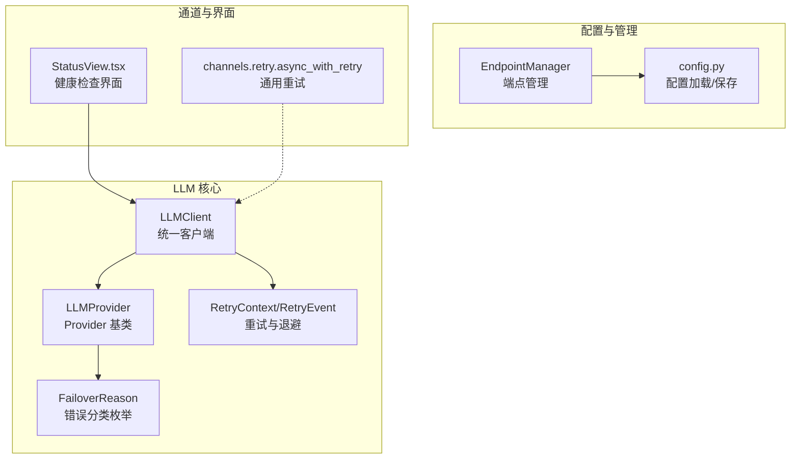
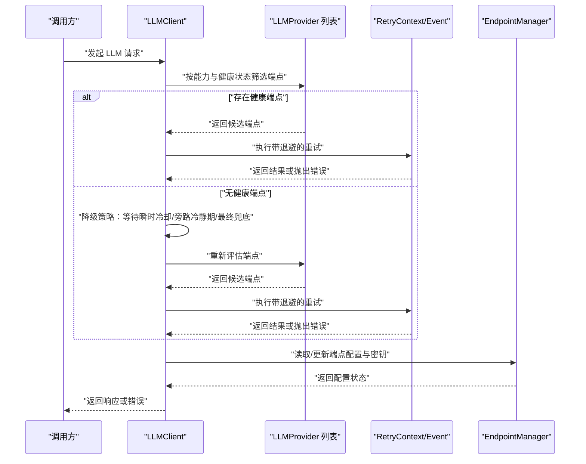
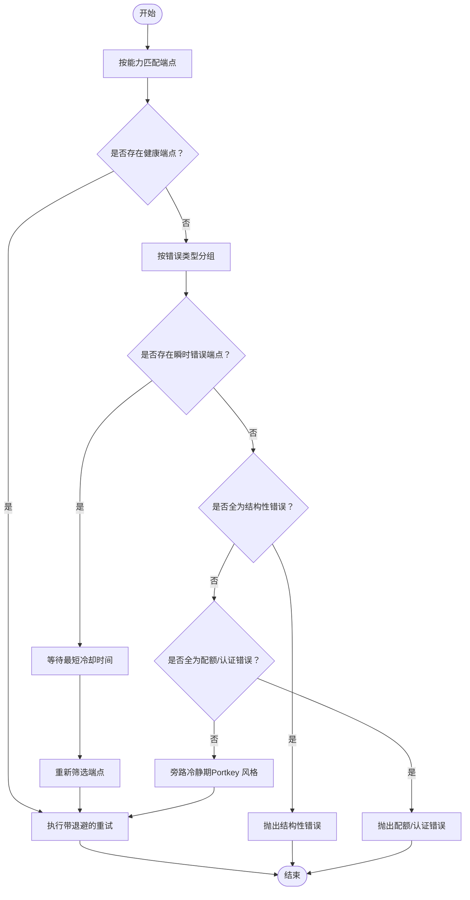
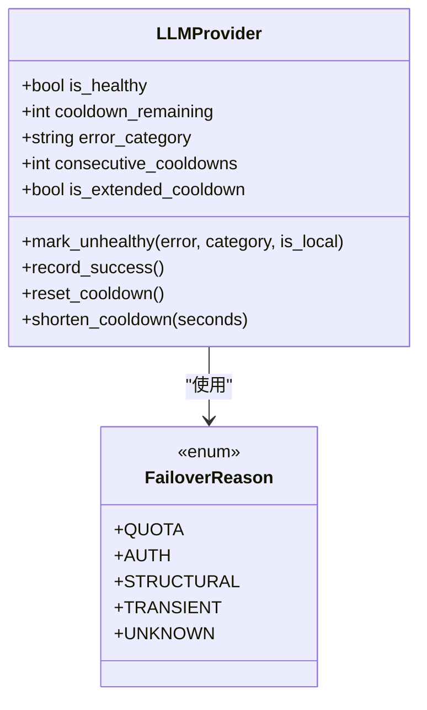
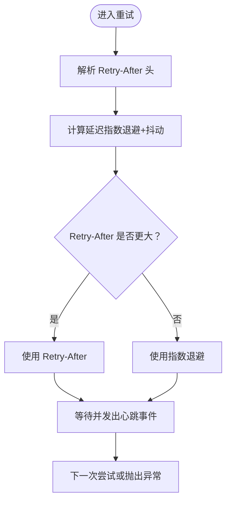
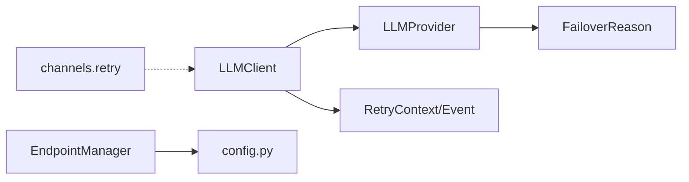

# 故障转移机制

<cite>
**本文档引用的文件**
- [client.py](file://src/synapse/llm/client.py)
- [retry.py](file://src/synapse/llm/retry.py)
- [base.py](file://src/synapse/llm/providers/base.py)
- [error_types.py](file://src/synapse/llm/error_types.py)
- [endpoint_manager.py](file://src/synapse/llm/endpoint_manager.py)
- [config.py](file://src/synapse/llm/config.py)
- [retry.py](file://src/synapse/channels/retry.py)
- [StatusView.tsx](file://apps/setup-center/src/views/StatusView.tsx)
</cite>

## 目录
1. [简介](#简介)
2. [项目结构](#项目结构)
3. [核心组件](#核心组件)
4. [架构总览](#架构总览)
5. [详细组件分析](#详细组件分析)
6. [依赖分析](#依赖分析)
7. [性能考虑](#性能考虑)
8. [故障排查指南](#故障排查指南)
9. [结论](#结论)
10. [附录](#附录)

## 简介
本文件系统性阐述 LLM 故障转移机制的设计与实现，涵盖智能故障转移算法、端点选择策略、失败原因分类机制、指数退避重试策略、Retry-After 头处理、429/529 状态码处理、故障检测阈值、端点健康评分与动态端点切换逻辑，并提供配置选项、性能优化建议与调试技巧。内容基于仓库中的 LLM 客户端、Provider 基类、重试与退避模块、端点管理与配置加载等核心代码进行深度分析。

## 项目结构
围绕故障转移机制的关键模块分布如下：
- LLM 统一客户端：负责端点选择、能力匹配、健康状态评估与故障转移决策
- Provider 基类：定义端点健康状态、冷却期、错误分类与渐进退避策略
- 重试与退避：提供指数退避、Retry-After 解析、429/529 区分与持久模式心跳
- 端点管理与配置：端点配置加载、环境变量注入、原子写入与备份
- 通道重试工具：IM 适配器通用异步重试（HTTP 请求）
- 健康检查界面：可视化端点健康状态、冷却剩余时间与错误类别

**图表来源**
- [client.py:146-200](file://src/synapse/llm/client.py#L146-L200)
- [base.py:91-104](file://src/synapse/llm/providers/base.py#L91-L104)
- [retry.py:36-55](file://src/synapse/llm/retry.py#L36-L55)
- [error_types.py:13-25](file://src/synapse/llm/error_types.py#L13-L25)
- [endpoint_manager.py:132-143](file://src/synapse/llm/endpoint_manager.py#L132-L143)
- [config.py:211-287](file://src/synapse/llm/config.py#L211-L287)
- [retry.py:57-113](file://src/synapse/channels/retry.py#L57-L113)
- [StatusView.tsx:349-443](file://apps/setup-center/src/views/StatusView.tsx#L349-L443)

**章节来源**
- [client.py:1-200](file://src/synapse/llm/client.py#L1-L200)
- [base.py:1-120](file://src/synapse/llm/providers/base.py#L1-L120)
- [retry.py:1-120](file://src/synapse/llm/retry.py#L1-L120)
- [endpoint_manager.py:132-170](file://src/synapse/llm/endpoint_manager.py#L132-L170)
- [config.py:211-287](file://src/synapse/llm/config.py#L211-L287)
- [retry.py:1-60](file://src/synapse/channels/retry.py#L1-L60)
- [StatusView.tsx:349-443](file://apps/setup-center/src/views/StatusView.tsx#L349-L443)

## 核心组件
- LLMClient：统一 LLM 客户端，负责端点能力匹配、健康状态筛选、故障转移降级策略与最终兜底尝试
- LLMProvider：Provider 基类，维护端点健康状态、冷却期、错误分类、渐进退避与速率限制
- RetryContext/RetryEvent：重试上下文与事件，支持指数退避、Retry-After 解析、429/529 连续计数与持久模式心跳
- FailoverReason：错误分类枚举，统一 quota/auth/structural/transient/unknown 分类
- EndpointManager：端点配置唯一管理者，提供原子写入、备份、版本冲突检测与环境变量解析
- channels.retry.async_with_retry：IM 适配器通用异步重试，支持 Retry-After 与指数退避

**章节来源**
- [client.py:146-200](file://src/synapse/llm/client.py#L146-L200)
- [base.py:91-104](file://src/synapse/llm/providers/base.py#L91-L104)
- [retry.py:36-55](file://src/synapse/llm/retry.py#L36-L55)
- [error_types.py:13-25](file://src/synapse/llm/error_types.py#L13-L25)
- [endpoint_manager.py:132-170](file://src/synapse/llm/endpoint_manager.py#L132-L170)
- [retry.py:57-113](file://src/synapse/channels/retry.py#L57-L113)

## 架构总览
下图展示了故障转移的端到端流程：请求进入 LLMClient 后，按能力与健康状态筛选端点；若无健康端点，则按降级策略逐步放宽限制，直至最终兜底尝试所有端点；Provider 负责错误分类与冷却期管理；RetryContext 负责指数退避与 429/529 特殊处理；EndpointManager 负责配置与密钥管理。

**图表来源**
- [client.py:800-953](file://src/synapse/llm/client.py#L800-L953)
- [retry.py:201-275](file://src/synapse/llm/retry.py#L201-L275)
- [base.py:167-286](file://src/synapse/llm/providers/base.py#L167-L286)
- [endpoint_manager.py:156-222](file://src/synapse/llm/endpoint_manager.py#L156-L222)

## 详细组件分析

### 智能故障转移算法与端点选择策略
- 能力匹配与软降级：根据工具、视觉、音频、视频、PDF 等能力需求筛选端点；若不满足，进行软降级（移除不支持的模态），并记录降级提示
- 健康状态优先：优先选择健康端点；若全部不健康，按错误类型分组并执行降级策略
- 降级策略四层：
  1) 等待瞬时冷静期恢复：若存在瞬时错误端点且冷却时间较短，等待其恢复
  2) 全部结构性错误：直接报错，重试无意义
  3) “最后防线旁路”：绕过冷静期尝试所有端点（排除配额/认证错误）
  4) 最终兜底：尝试所有端点
- 思维模式降级：当全部端点处于冷静期时，禁用思维模式以降低复杂度

**图表来源**
- [client.py:800-953](file://src/synapse/llm/client.py#L800-L953)

**章节来源**
- [client.py:800-953](file://src/synapse/llm/client.py#L800-L953)

### 失败原因分类机制与健康评分
- 错误分类枚举：quota/auth/structural/transient/unknown，统一分类入口，消除字符串拼写风险
- Provider 健康状态：由 is_healthy、cooldown_remaining、error_category、consecutive_cooldowns 等属性构成健康评分与冷却期
- 渐进退避：连续失败端点按退避序列增加冷静期，上限 5 分钟；配额错误按阶梯增加冷静期，最高 30 分钟
- 本地端点特殊处理：本地端点瞬时错误不参与渐进升级，避免资源不足场景的误判

**图表来源**
- [base.py:91-104](file://src/synapse/llm/providers/base.py#L91-L104)
- [base.py:167-286](file://src/synapse/llm/providers/base.py#L167-L286)
- [error_types.py:13-25](file://src/synapse/llm/error_types.py#L13-L25)

**章节来源**
- [base.py:72-88](file://src/synapse/llm/providers/base.py#L72-L88)
- [base.py:167-286](file://src/synapse/llm/providers/base.py#L167-L286)
- [error_types.py:13-25](file://src/synapse/llm/error_types.py#L13-L25)

### 指数退避重试策略与 Retry-After 处理
- 指数退避：基础延迟 500ms，最大 32s，加入 25% 随机抖动
- Retry-After 优先：若异常包含 retry_after_seconds 或响应头包含 Retry-After/x-ratelimit-reset-requests，则使用该值
- 429/529 区分：连续 529 达到阈值触发回退模型；前台来源（main_loop/repl_main_thread）不受此限制
- 持久模式：长等待 + 心跳事件，便于 UI/日志感知

**图表来源**
- [retry.py:57-78](file://src/synapse/llm/retry.py#L57-L78)
- [retry.py:81-103](file://src/synapse/llm/retry.py#L81-L103)
- [retry.py:201-275](file://src/synapse/llm/retry.py#L201-L275)

**章节来源**
- [retry.py:23-31](file://src/synapse/llm/retry.py#L23-L31)
- [retry.py:57-78](file://src/synapse/llm/retry.py#L57-L78)
- [retry.py:81-103](file://src/synapse/llm/retry.py#L81-L103)
- [retry.py:201-275](file://src/synapse/llm/retry.py#L201-L275)

### 429/529 状态码处理与回退模型
- 429：通用限流，遵循 Retry-After 与指数退避
- 529：服务过载，连续达到阈值触发回退模型（fallback），前台来源例外
- 上层 UI/日志：通过 RetryEvent 接收“回退触发”事件，便于用户感知

**章节来源**
- [retry.py:161-164](file://src/synapse/llm/retry.py#L161-L164)
- [retry.py:231-244](file://src/synapse/llm/retry.py#L231-L244)
- [retry.py:253-257](file://src/synapse/llm/retry.py#L253-L257)

### 故障检测阈值与动态端点切换逻辑
- 全局故障检测：当失败端点中瞬时错误占比超过阈值，缩短其冷静期，加速恢复
- 旁路冷静期：当无健康端点时，对非配额/认证错误端点重置冷静期，实现“最后防线旁路”
- 临时覆盖：支持对话级与全局端点覆盖，过期后自动清理，防止内存泄漏

**章节来源**
- [client.py:1472-1482](file://src/synapse/llm/client.py#L1472-L1482)
- [client.py:919-945](file://src/synapse/llm/client.py#L919-L945)
- [client.py:976-994](file://src/synapse/llm/client.py#L976-L994)

### 端点健康检查与可视化
- 健康检查接口：支持全量与单端点检查，返回状态、延迟、错误、错误类别、连续失败次数、冷却剩余时间等
- 界面集成：Setup Center StatusView 展示端点健康状态，支持一键检查与刷新

**章节来源**
- [StatusView.tsx:349-443](file://apps/setup-center/src/views/StatusView.tsx#L349-L443)

## 依赖分析
- LLMClient 依赖 LLMProvider 健康状态与错误分类，以及 RetryContext 的重试策略
- Provider 基类依赖错误分类枚举与速率限制器
- EndpointManager 与 config.py 协作，确保配置与密钥的安全读写与版本一致性
- channels.retry 为 IM 适配器提供通用重试能力，与 LLM 重试策略互补

**图表来源**
- [client.py:146-200](file://src/synapse/llm/client.py#L146-L200)
- [base.py:91-104](file://src/synapse/llm/providers/base.py#L91-L104)
- [retry.py:36-55](file://src/synapse/llm/retry.py#L36-L55)
- [error_types.py:13-25](file://src/synapse/llm/error_types.py#L13-L25)
- [endpoint_manager.py:132-170](file://src/synapse/llm/endpoint_manager.py#L132-L170)
- [config.py:211-287](file://src/synapse/llm/config.py#L211-L287)
- [retry.py:57-113](file://src/synapse/channels/retry.py#L57-L113)

**章节来源**
- [client.py:146-200](file://src/synapse/llm/client.py#L146-L200)
- [base.py:91-104](file://src/synapse/llm/providers/base.py#L91-L104)
- [retry.py:36-55](file://src/synapse/llm/retry.py#L36-L55)
- [error_types.py:13-25](file://src/synapse/llm/error_types.py#L13-L25)
- [endpoint_manager.py:132-170](file://src/synapse/llm/endpoint_manager.py#L132-L170)
- [config.py:211-287](file://src/synapse/llm/config.py#L211-L287)
- [retry.py:57-113](file://src/synapse/channels/retry.py#L57-L113)

## 性能考虑
- 并发控制：全局与组织级信号量限制并发，避免事件循环过载
- 速率限制：RPM 滑动窗口限流，保障端点稳定
- 冷静期退避：渐进式冷静期减少无效重试，提高整体吞吐
- 持久模式：长等待时的心跳事件，避免 UI 卡顿
- 配置原子写入：端点配置写入采用原子替换与备份，减少 IO 开销与数据损坏风险

[本节为通用指导，不直接分析具体文件]

## 故障排查指南
- 端点健康检查：通过 Setup Center StatusView 观察端点状态、冷却剩余时间与错误类别
- 错误分类定位：根据错误类别（quota/auth/structural/transient/unknown）快速定位问题来源
- 重试策略验证：确认 Retry-After 头是否正确传递，指数退避是否生效
- 配置一致性：检查 .env 与 llm_endpoints.json 的版本与冲突，必要时使用备份恢复
- 通道重试：IM 适配器可使用 channels.retry.async_with_retry 进行 HTTP 请求重试

**章节来源**
- [StatusView.tsx:349-443](file://apps/setup-center/src/views/StatusView.tsx#L349-L443)
- [base.py:324-405](file://src/synapse/llm/providers/base.py#L324-L405)
- [retry.py:81-103](file://src/synapse/llm/retry.py#L81-L103)
- [endpoint_manager.py:328-390](file://src/synapse/llm/endpoint_manager.py#L328-L390)
- [retry.py:57-113](file://src/synapse/channels/retry.py#L57-L113)

## 结论
本机制通过“能力匹配 + 健康状态评估 + 四层降级策略 + 渐进退避 + Retry-After 优先”的组合，实现了高鲁棒性的 LLM 故障转移。Provider 健康评分与错误分类确保了精准的故障定位与恢复；RetryContext 的指数退避与 429/529 特殊处理提升了系统的稳定性；EndpointManager 的原子写入与备份保障了配置变更的安全性。结合 Setup Center 的可视化健康检查，开发者可以高效诊断与优化故障转移效果。

[本节为总结性内容，不直接分析具体文件]

## 附录

### 故障转移配置选项
- 端点配置文件：支持主端点、编译器端点、STT 端点与全局设置
- 环境变量注入：.env 文件加载与覆盖，支持 UTF-8 BOM 处理与编码回退
- 端点管理：原子写入、备份、版本冲突检测、密钥共享与去重

**章节来源**
- [config.py:211-287](file://src/synapse/llm/config.py#L211-L287)
- [config.py:100-143](file://src/synapse/llm/config.py#L100-L143)
- [endpoint_manager.py:156-222](file://src/synapse/llm/endpoint_manager.py#L156-L222)
- [endpoint_manager.py:328-390](file://src/synapse/llm/endpoint_manager.py#L328-L390)

### 调试技巧
- 使用 Setup Center StatusView 进行端点健康检查与单端点诊断
- 在 LLMClient 中启用详细日志，观察端点切换与降级路径
- 检查 Retry-After 头与指数退避延迟，确认限流策略是否生效
- 验证 .env 与 llm_endpoints.json 的一致性，避免配置冲突

**章节来源**
- [StatusView.tsx:349-443](file://apps/setup-center/src/views/StatusView.tsx#L349-L443)
- [client.py:800-953](file://src/synapse/llm/client.py#L800-L953)
- [retry.py:81-103](file://src/synapse/llm/retry.py#L81-L103)
- [endpoint_manager.py:328-390](file://src/synapse/llm/endpoint_manager.py#L328-L390)