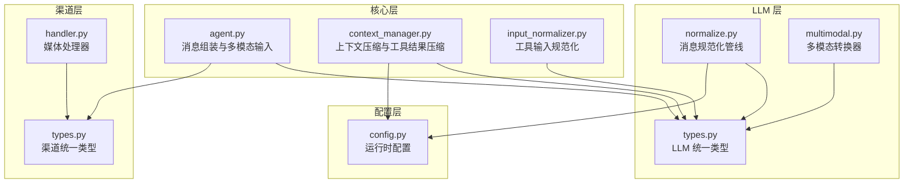
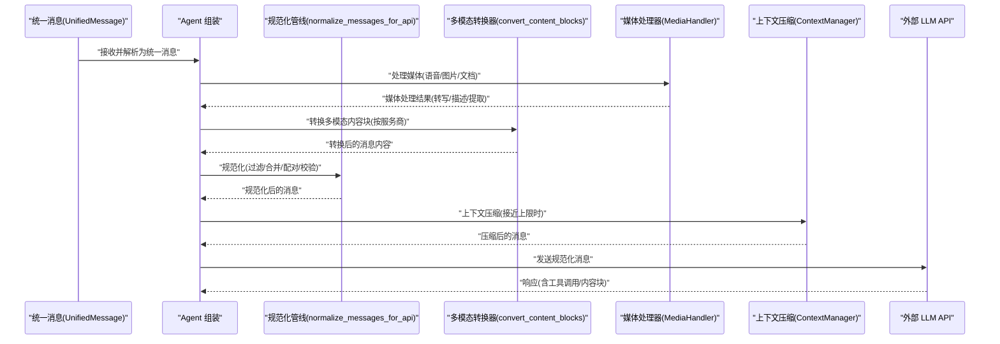
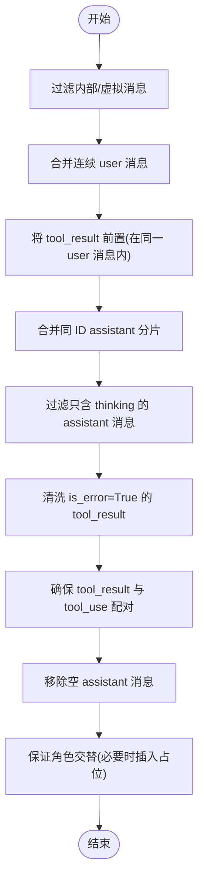
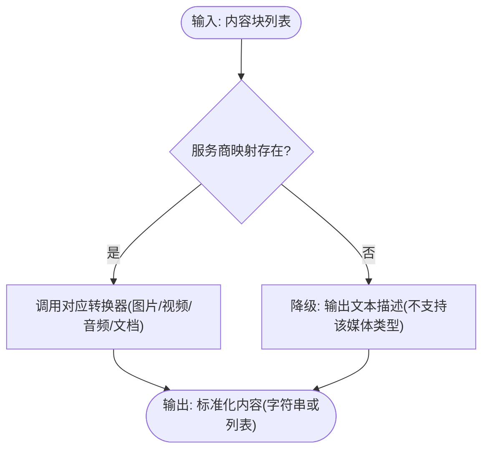
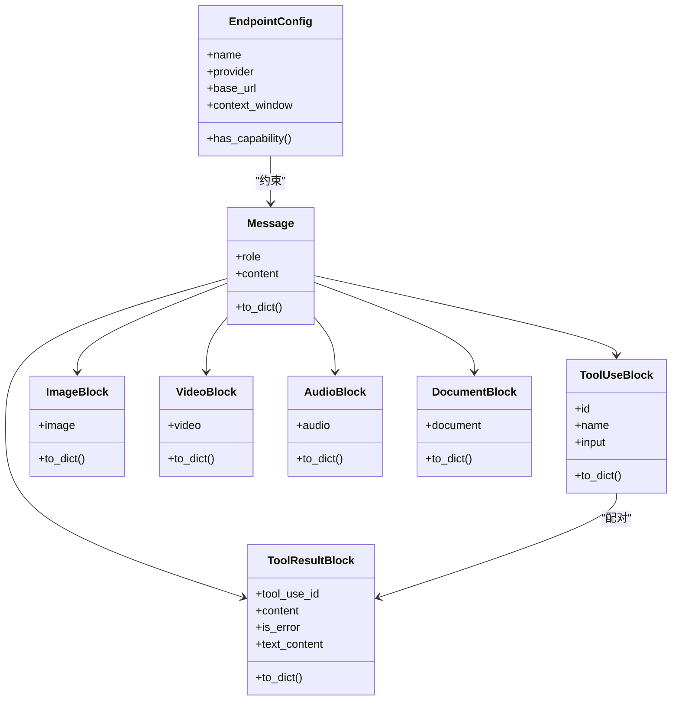
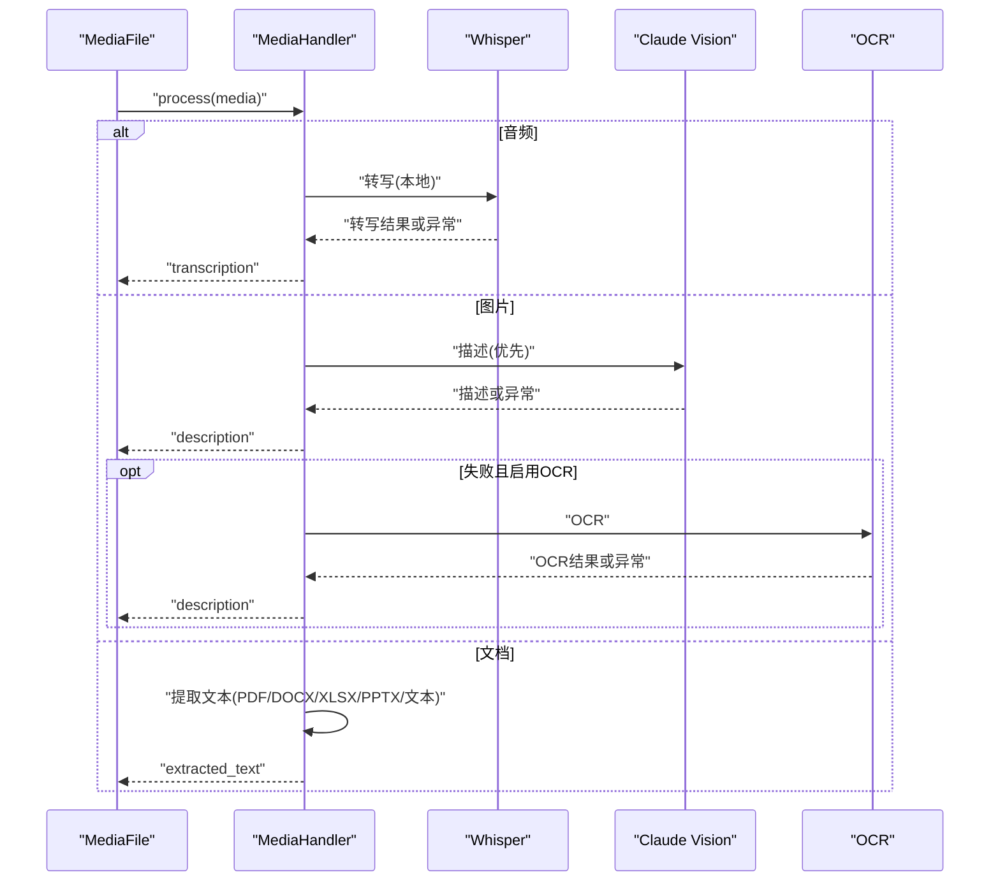
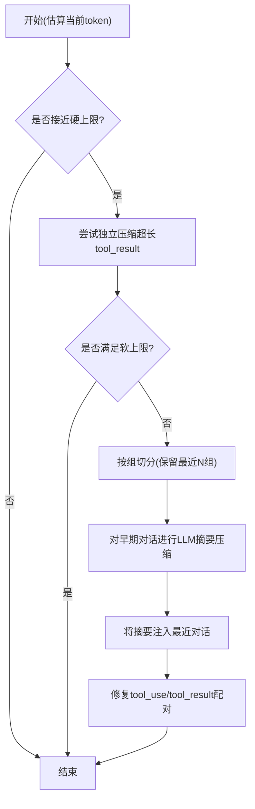
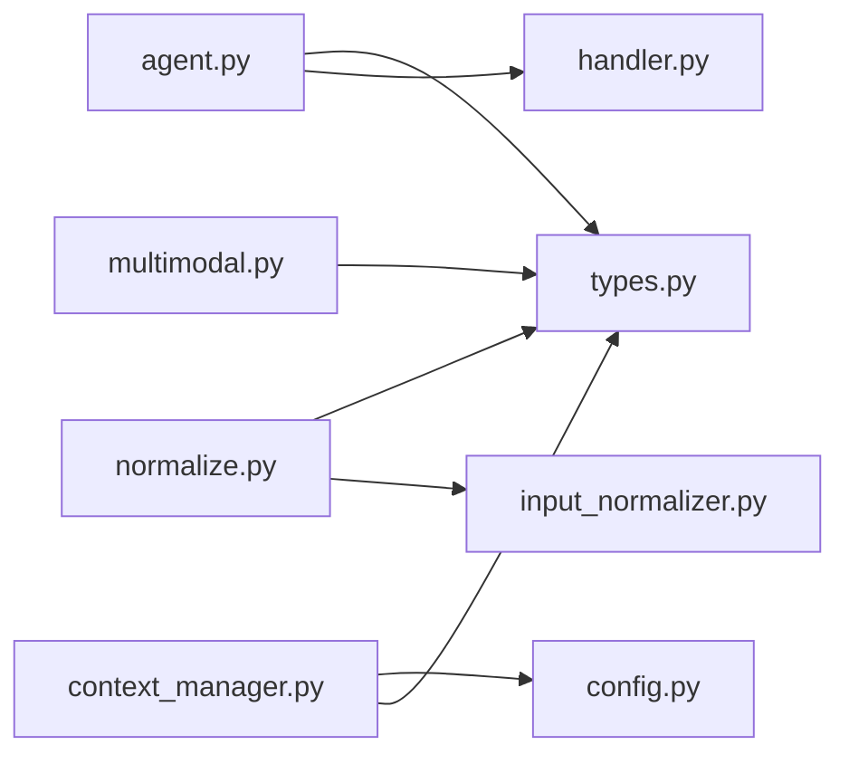

# 消息规范化

<cite>
**本文引用的文件**
- [normalize.py](file://src/synapse/llm/normalize.py)
- [multimodal.py](file://src/synapse/llm/converters/multimodal.py)
- [types.py](file://src/synapse/llm/types.py)
- [types.py](file://src/synapse/channels/types.py)
- [handler.py](file://src/synapse/channels/media/handler.py)
- [agent.py](file://src/synapse/core/agent.py)
- [context_manager.py](file://src/synapse/core/context_manager.py)
- [input_normalizer.py](file://src/synapse/tools/input_normalizer.py)
- [config.py](file://src/synapse/config.py)
</cite>

## 目录
1. [简介](#简介)
2. [项目结构](#项目结构)
3. [核心组件](#核心组件)
4. [架构总览](#架构总览)
5. [详细组件分析](#详细组件分析)
6. [依赖分析](#依赖分析)
7. [性能考虑](#性能考虑)
8. [故障排查指南](#故障排查指南)
9. [结论](#结论)
10. [附录](#附录)

## 简介
本文件面向“LLM消息规范化系统”，系统性阐述消息格式标准化流程、多模态内容处理、消息类型转换机制，以及工具调用消息的格式化。文档还涵盖消息验证规则、内容压缩策略、兼容性处理方案，并提供消息规范化配置、调试工具与性能优化建议，帮助开发者与运维人员快速理解与高效使用该系统。

## 项目结构
消息规范化系统主要分布在以下模块：
- LLM 层：消息规范化管线、多模态内容转换器、统一类型定义
- 渠道层：统一消息类型、媒体文件类型与处理
- 核心层：上下文压缩与工具调用输入规范化
- 配置层：运行时配置与日志、代理、上下文压缩等参数

图表来源
- [normalize.py:1-237](file://src/synapse/llm/normalize.py#L1-L237)
- [multimodal.py:1-474](file://src/synapse/llm/converters/multimodal.py#L1-L474)
- [types.py:1-703](file://src/synapse/llm/types.py#L1-L703)
- [types.py:1-615](file://src/synapse/channels/types.py#L1-L615)
- [handler.py:1-434](file://src/synapse/channels/media/handler.py#L1-L434)
- [agent.py:2929-3827](file://src/synapse/core/agent.py#L2929-L3827)
- [context_manager.py:328-1036](file://src/synapse/core/context_manager.py#L328-L1036)
- [input_normalizer.py:1-115](file://src/synapse/tools/input_normalizer.py#L1-L115)
- [config.py:509-538](file://src/synapse/config.py#L509-L538)

章节来源
- [normalize.py:1-237](file://src/synapse/llm/normalize.py#L1-L237)
- [multimodal.py:1-474](file://src/synapse/llm/converters/multimodal.py#L1-L474)
- [types.py:1-703](file://src/synapse/llm/types.py#L1-L703)
- [types.py:1-615](file://src/synapse/channels/types.py#L1-L615)
- [handler.py:1-434](file://src/synapse/channels/media/handler.py#L1-L434)
- [agent.py:2929-3827](file://src/synapse/core/agent.py#L2929-L3827)
- [context_manager.py:328-1036](file://src/synapse/core/context_manager.py#L328-L1036)
- [input_normalizer.py:1-115](file://src/synapse/tools/input_normalizer.py#L1-L115)
- [config.py:509-538](file://src/synapse/config.py#L509-L538)

## 核心组件
- 消息规范化管线：对消息进行过滤、合并、排序、配对与校验，确保符合外部 API 的角色交替与内容块规范。
- 多模态转换器：将内部内容块转换为不同服务商所需的格式，并在不支持的端点上进行优雅降级。
- 统一类型系统：以 Anthropic 格式为内部标准，统一文本、工具调用、多模态内容块与消息结构。
- 媒体处理器：统一处理语音转写、图片理解/OCR、文档内容提取，并维护媒体状态与元数据。
- 上下文压缩与工具结果压缩：在接近上下文窗口上限时，对早期对话与超长工具结果进行压缩，保障对话连贯性。
- 工具输入规范化：依据 JSON Schema 对工具输入进行解析与规范化，提升稳定性与一致性。

章节来源
- [normalize.py:26-49](file://src/synapse/llm/normalize.py#L26-L49)
- [multimodal.py:365-431](file://src/synapse/llm/converters/multimodal.py#L365-L431)
- [types.py:380-496](file://src/synapse/llm/types.py#L380-L496)
- [handler.py:104-133](file://src/synapse/channels/media/handler.py#L104-L133)
- [context_manager.py:390-417](file://src/synapse/core/context_manager.py#L390-L417)
- [input_normalizer.py:14-24](file://src/synapse/tools/input_normalizer.py#L14-L24)

## 架构总览
消息规范化系统的关键流程如下：
- 输入消息经统一类型封装，进入规范化管线；
- 多模态内容块根据目标服务商进行格式转换；
- 媒体内容在发送前完成处理（语音转写、图片理解、文档提取）；
- 上下文压缩与工具结果压缩在接近窗口上限时触发；
- 工具调用参数依据 JSON Schema 规范化；
- 输出符合外部 API 的消息列表。

图表来源
- [agent.py:3797-3827](file://src/synapse/core/agent.py#L3797-L3827)
- [normalize.py:26-49](file://src/synapse/llm/normalize.py#L26-L49)
- [multimodal.py:365-431](file://src/synapse/llm/converters/multimodal.py#L365-L431)
- [handler.py:104-133](file://src/synapse/channels/media/handler.py#L104-L133)
- [context_manager.py:390-417](file://src/synapse/core/context_manager.py#L390-L417)

## 详细组件分析

### 消息规范化管线
- 功能要点
  - 过滤内部/虚拟消息，避免发送至外部 API
  - 合并连续 user/assistant 消息，满足 API 角色交替要求
  - 将 user 消息中的 tool_result 块前置，确保与 assistant 的 tool_use 对齐
  - 合并同 ID 的 assistant 分片，消除重复
  - 过滤只含 thinking 的 assistant 消息，避免 API 报错或混淆
  - 清洗 is_error=True 的 tool_result，仅保留文本内容
  - 确保每个 tool_result 都有对应的 tool_use，移除孤儿配对
  - 移除空 assistant 消息
  - 保证消息角色严格交替，必要时插入占位消息

图表来源
- [normalize.py:52-227](file://src/synapse/llm/normalize.py#L52-L227)

章节来源
- [normalize.py:26-49](file://src/synapse/llm/normalize.py#L26-L49)

### 多模态内容转换器
- 功能要点
  - 图片：统一转换为 OpenAI 的 image_url 格式
  - 视频：按服务商映射为 video_url 或 data URL；超过服务商限制时降级为文本提示
  - 音频：按服务商映射为 input_audio/audio_url/image_url；超过限制时降级为文本提示
  - 文档：按服务商映射为 document/base64 data URL；不支持时降级为文本提示
  - 降级策略：对不支持的媒体类型输出明确的文本提示，避免 API 报错
  - 工具函数：检测媒体类型、提取媒体、判断是否存在某类媒体

图表来源
- [multimodal.py:365-431](file://src/synapse/llm/converters/multimodal.py#L365-L431)

章节来源
- [multimodal.py:1-474](file://src/synapse/llm/converters/multimodal.py#L1-L474)

### 统一类型系统
- LLM 统一类型
  - 内部标准：以 Anthropic 格式为核心，消息包含 role 与 content（字符串或内容块列表）
  - 内容块类型：text、tool_use、tool_result、image、video、audio、document、thinking
  - 工具调用：ToolUseBlock 在构造时自动进行输入规范化
  - 工具结果：ToolResultBlock 支持纯文本或多模态内容列表，并提供纯文本提取
  - EndpointConfig：统一端点配置，包含能力标注、上下文窗口、超时、定价等

图表来源
- [types.py:380-496](file://src/synapse/llm/types.py#L380-L496)
- [types.py:226-364](file://src/synapse/llm/types.py#L226-L364)
- [types.py:492-661](file://src/synapse/llm/types.py#L492-L661)

章节来源
- [types.py:1-703](file://src/synapse/llm/types.py#L1-L703)

### 媒体处理器
- 功能要点
  - 语音转写：优先使用本地 Whisper，失败时回退为文本描述
  - 图片理解：优先使用 Claude Vision，失败时回退 OCR；可配置是否启用 OCR
  - 文档提取：支持 PDF、DOCX、XLSX、PPTX、文本文件等；失败时回退为提示信息
  - 媒体状态：统一管理 PENDING/DOWNLOADING/READY/FAILED/PROCESSED
  - 延迟加载：Whisper 与 OCR 模型按需加载，避免启动时阻塞

图表来源
- [handler.py:104-133](file://src/synapse/channels/media/handler.py#L104-L133)
- [handler.py:135-197](file://src/synapse/channels/media/handler.py#L135-L197)
- [handler.py:199-291](file://src/synapse/channels/media/handler.py#L199-L291)
- [handler.py:293-433](file://src/synapse/channels/media/handler.py#L293-L433)

章节来源
- [handler.py:1-434](file://src/synapse/channels/media/handler.py#L1-L434)

### 上下文压缩与工具结果压缩
- 功能要点
  - 触发条件：当前 token 数接近硬上限（由软/硬阈值与配置决定）
  - 压缩策略：先对单条过大的 tool_result 独立压缩；再按组切分，对早期对话进行 LLM 压缩；最后注入摘要到最近对话
  - 工具配对修复：压缩后修复 tool_use 与 tool_result 的配对关系，避免 API 400
  - 配置项：压缩比例、阈值、是否启用工具结果压缩、大工具阈值等

图表来源
- [context_manager.py:390-417](file://src/synapse/core/context_manager.py#L390-L417)
- [context_manager.py:686-713](file://src/synapse/core/context_manager.py#L686-L713)
- [context_manager.py:1007-1028](file://src/synapse/core/context_manager.py#L1007-L1028)
- [context_manager.py:1030-1036](file://src/synapse/core/context_manager.py#L1030-L1036)

章节来源
- [context_manager.py:328-1036](file://src/synapse/core/context_manager.py#L328-L1036)
- [config.py:509-538](file://src/synapse/config.py#L509-L538)

### 工具输入规范化
- 功能要点
  - 基于 JSON Schema 对工具输入进行规范化
  - 支持对象与数组类型的解析与校验
  - 对字符串化的对象/数组进行安全解析
  - 在 ToolUseBlock 构造时自动调用规范化器

章节来源
- [input_normalizer.py:14-24](file://src/synapse/tools/input_normalizer.py#L14-L24)
- [types.py:236-240](file://src/synapse/llm/types.py#L236-L240)

## 依赖分析
- 组件耦合
  - Agent 组装依赖统一类型与媒体处理器，产出多模态消息
  - 规范化管线依赖统一类型与工具输入规范化
  - 多模态转换器依赖统一类型与服务商映射
  - 上下文压缩依赖配置与 LLM 压缩能力
- 外部依赖
  - Whisper、PyTesseract、PyMuPDF/docx/openpyxl/pptx 等第三方库
  - LLM 提供商的 API（Anthropic/OpenAI/Gemini/DashScope 等）

图表来源
- [agent.py:3797-3827](file://src/synapse/core/agent.py#L3797-L3827)
- [normalize.py:26-49](file://src/synapse/llm/normalize.py#L26-L49)
- [multimodal.py:365-431](file://src/synapse/llm/converters/multimodal.py#L365-L431)
- [handler.py:104-133](file://src/synapse/channels/media/handler.py#L104-L133)
- [context_manager.py:390-417](file://src/synapse/core/context_manager.py#L390-L417)
- [input_normalizer.py:14-24](file://src/synapse/tools/input_normalizer.py#L14-L24)
- [config.py:509-538](file://src/synapse/config.py#L509-L538)

## 性能考虑
- 媒体处理
  - 语音转写优先使用本地 Whisper，失败回退文本描述，减少网络依赖
  - 图片理解优先使用 Vision，失败回退 OCR，避免空内容
  - 文档提取按需加载第三方库，失败回退提示
- 多模态转换
  - 视频/音频 data URL 超限时降级为文本，避免超大负载
  - 仅在必要时进行格式转换，减少不必要的编码
- 上下文压缩
  - 先独立压缩超长工具结果，再进行整体压缩，提升命中率
  - 保留最近对话组，确保上下文连贯性
- 工具输入规范化
  - 依据 JSON Schema 进行解析，避免无效参数导致的重试与失败

[本节为通用指导，无需列出章节来源]

## 故障排查指南
- 编码问题
  - 现象：消息中中文字符被替换为问号
  - 原因：编码未正确处理或上游未设置 UTF-8
  - 建议：检查系统编码、文件读写与传输层编码设置
- 语音转写失败
  - 现象：语音消息转写为空或失败标记
  - 建议：确认 Whisper 是否可用、模型是否加载成功、音频格式是否兼容
- 工具调用配对错误
  - 现象：API 返回 400，提示 tool_use 与 tool_result 未配对
  - 建议：使用规范化管线确保配对完整；必要时启用上下文压缩后的配对修复
- 上下文超限
  - 现象：请求被拒绝或截断严重
  - 建议：调整压缩阈值与比例，启用工具结果压缩，合理设置最近对话组数

章节来源
- [normalize.py:170-198](file://src/synapse/llm/normalize.py#L170-L198)
- [context_manager.py:390-417](file://src/synapse/core/context_manager.py#L390-L417)
- [handler.py:135-197](file://src/synapse/channels/media/handler.py#L135-L197)

## 结论
消息规范化系统通过统一类型、规范化管线、多模态转换与上下文压缩等机制，实现了跨平台、跨服务商的一致性消息输出。结合媒体处理与工具输入规范化，系统在保证稳定性的同时提升了性能与兼容性。建议在生产环境中结合配置参数与监控日志，持续优化上下文压缩策略与媒体处理链路。

[本节为总结性内容，无需列出章节来源]

## 附录

### 消息规范化配置清单
- 上下文压缩相关
  - context_max_window：全局上下文最大输入长度
  - context_compression_ratio：压缩目标比例
  - context_compression_threshold：触发压缩的软限比例
  - context_enable_tool_compression：是否启用工具结果独立压缩
  - context_large_tool_threshold：触发独立压缩的 token 阈值
- 日志与代理
  - log_level/log_dir/log_file_prefix 等日志配置
  - http_proxy/https_proxy/all_proxy 代理配置
- 其他
  - whisper_enabled/whisper_model/whisper_language 语音识别配置

章节来源
- [config.py:509-538](file://src/synapse/config.py#L509-L538)
- [config.py:149-177](file://src/synapse/config.py#L149-L177)