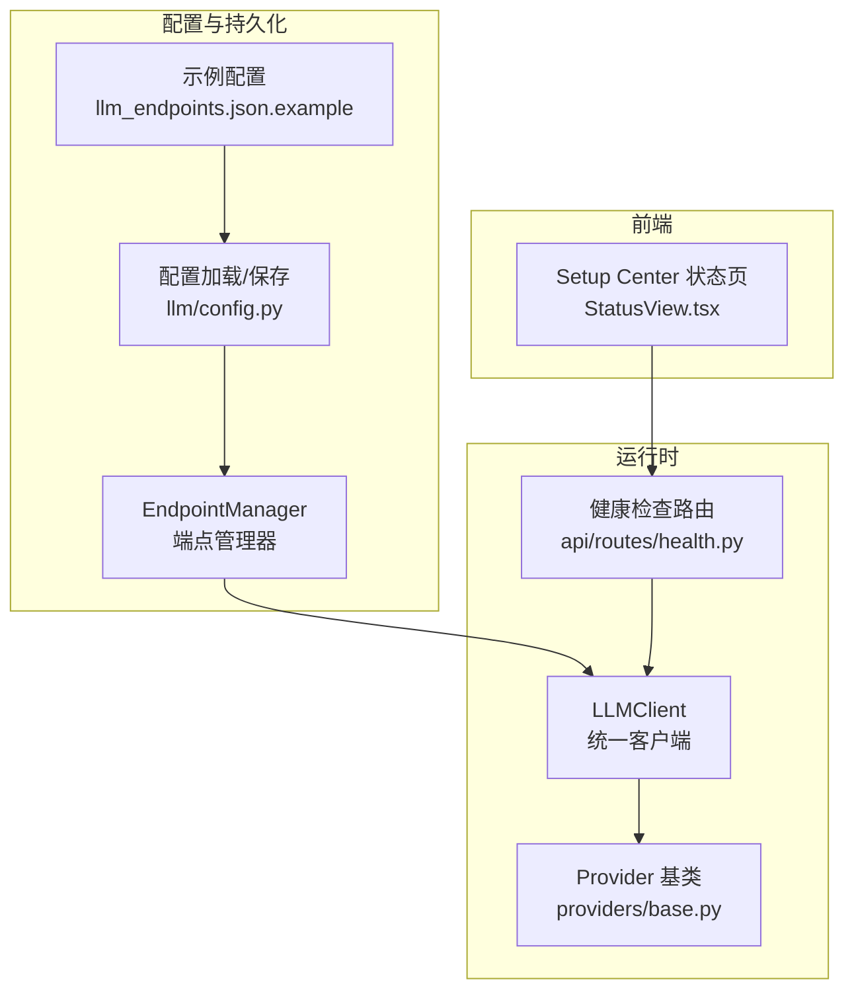
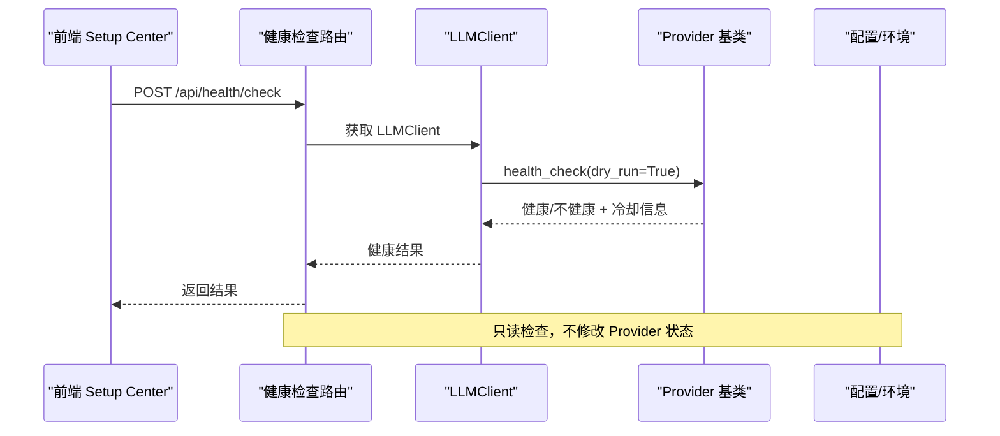
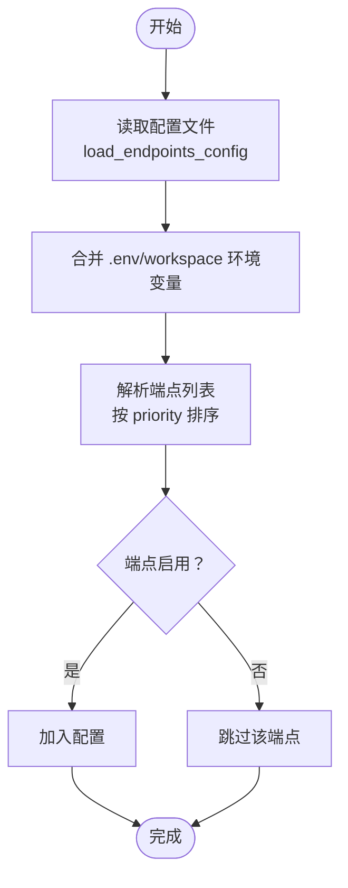
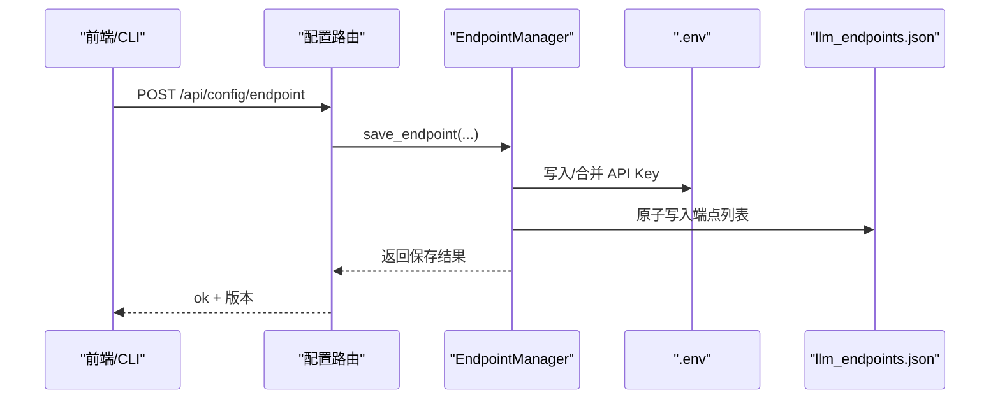
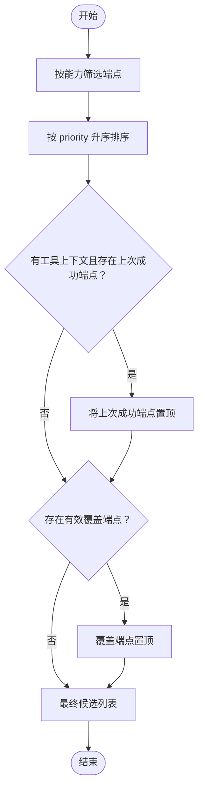
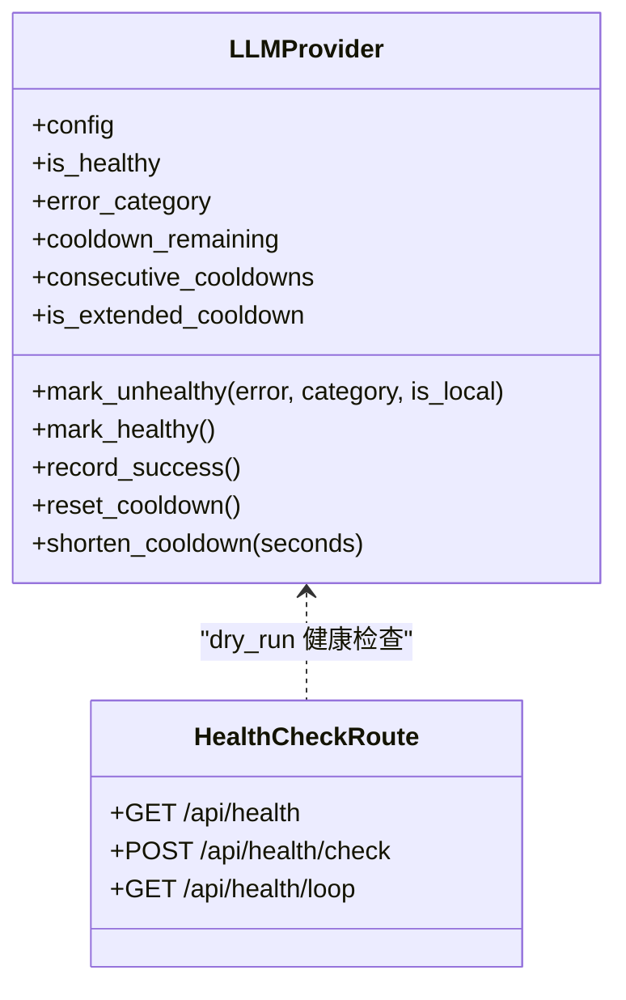
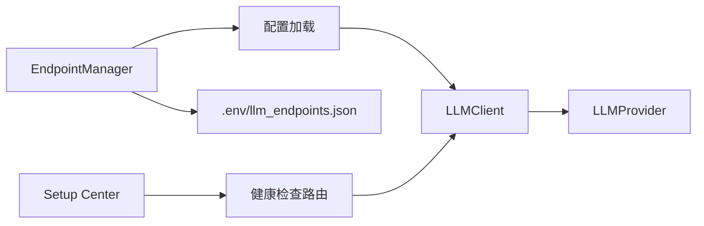

# 端点管理

<cite>
**本文档引用的文件**
- [endpoint_manager.py](file://src/synapse/llm/endpoint_manager.py)
- [llm_endpoints.json.example](file://data/llm_endpoints.json.example)
- [config.py](file://src/synapse/api/routes/config.py)
- [health.py](file://src/synapse/api/routes/health.py)
- [client.py](file://src/synapse/llm/client.py)
- [base.py](file://src/synapse/llm/providers/base.py)
- [config.py](file://src/synapse/llm/config.py)
- [types.py](file://src/synapse/llm/types.py)
- [wizard.py](file://src/synapse/setup/wizard.py)
- [StatusView.tsx](file://apps/setup-center/src/views/StatusView.tsx)
</cite>

## 目录
1. [简介](#简介)
2. [项目结构](#项目结构)
3. [核心组件](#核心组件)
4. [架构总览](#架构总览)
5. [详细组件分析](#详细组件分析)
6. [依赖分析](#依赖分析)
7. [性能考虑](#性能考虑)
8. [故障排除指南](#故障排除指南)
9. [结论](#结论)
10. [附录](#附录)

## 简介
本文件系统性阐述 LLM 端点管理系统的配置结构、发现机制、生命周期管理、优先级排序、健康检查与亲和性策略，并提供配置文件格式、动态增删、状态监控与故障检测、最佳实践与排障指南。目标读者既包括一线工程师，也包括对技术细节感兴趣的非专业用户。

## 项目结构
围绕端点管理的关键代码分布在以下模块：
- 端点配置与持久化：endpoint_manager.py、llm_endpoints.json.example、config.py（配置加载/保存）
- 端点生命周期与动态变更：endpoint_manager.py、api/routes/config.py
- 端点健康检查与状态监控：api/routes/health.py、providers/base.py、client.py、apps/setup-center/src/views/StatusView.tsx
- 端点亲和性与优先级排序：client.py、providers/base.py
- 端点配置示例与向导：llm_endpoints.json.example、setup/wizard.py

**图表来源**
- [endpoint_manager.py:132-465](file://src/synapse/llm/endpoint_manager.py#L132-L465)
- [config.py:211-287](file://src/synapse/llm/config.py#L211-L287)
- [client.py:146-2097](file://src/synapse/llm/client.py#L146-L2097)
- [base.py:91-485](file://src/synapse/llm/providers/base.py#L91-L485)
- [health.py:356-387](file://src/synapse/api/routes/health.py#L356-L387)
- [StatusView.tsx:349-443](file://apps/setup-center/src/views/StatusView.tsx#L349-L443)

**章节来源**
- [endpoint_manager.py:132-465](file://src/synapse/llm/endpoint_manager.py#L132-L465)
- [config.py:211-287](file://src/synapse/llm/config.py#L211-L287)
- [client.py:146-2097](file://src/synapse/llm/client.py#L146-L2097)
- [base.py:91-485](file://src/synapse/llm/providers/base.py#L91-L485)
- [health.py:356-387](file://src/synapse/api/routes/health.py#L356-L387)
- [StatusView.tsx:349-443](file://apps/setup-center/src/views/StatusView.tsx#L349-L443)

## 核心组件
- 端点管理器（EndpointManager）：负责 llm_endpoints.json 与 .env 的原子写入、版本校验、冲突检测、环境变量命名与去重、端点状态查询。
- LLM 客户端（LLMClient）：负责端点筛选、能力匹配、优先级排序、亲和性策略、临时覆盖、健康状态与冷却期、故障转移与降级。
- Provider 基类（LLMProvider）：定义健康状态、错误分类、冷却期策略、渐进退避、限流器。
- 健康检查路由（/api/health/check）：提供只读健康检查，支持单端点与全量并发检查。
- 配置加载（load_endpoints_config）：解析配置文件、注入环境变量、校验基础字段、按优先级排序。
- 示例配置（llm_endpoints.json.example）：提供字段说明、示例端点与 STT 端点配置、全局设置项。

**章节来源**
- [endpoint_manager.py:132-465](file://src/synapse/llm/endpoint_manager.py#L132-L465)
- [client.py:146-2097](file://src/synapse/llm/client.py#L146-L2097)
- [base.py:91-485](file://src/synapse/llm/providers/base.py#L91-L485)
- [health.py:356-387](file://src/synapse/api/routes/health.py#L356-L387)
- [config.py:211-287](file://src/synapse/llm/config.py#L211-L287)
- [llm_endpoints.json.example:1-110](file://data/llm_endpoints.json.example#L1-L110)

## 架构总览
端点管理贯穿“配置加载 → 运行时选择 → 健康检查 → 故障转移”的闭环流程。配置文件与 .env 通过端点管理器进行受控写入；运行时由 LLM 客户端根据能力需求与优先级选择端点；Provider 基类维护健康状态与冷却期；健康检查路由提供只读探测，避免干扰正在进行的调用。

**图表来源**
- [health.py:356-387](file://src/synapse/api/routes/health.py#L356-L387)
- [client.py:146-2097](file://src/synapse/llm/client.py#L146-L2097)
- [base.py:91-485](file://src/synapse/llm/providers/base.py#L91-L485)

**章节来源**
- [health.py:356-387](file://src/synapse/api/routes/health.py#L356-L387)
- [client.py:146-2097](file://src/synapse/llm/client.py#L146-L2097)
- [base.py:91-485](file://src/synapse/llm/providers/base.py#L91-L485)

## 详细组件分析

### 端点配置结构与发现机制
- 配置文件结构
  - 根节点包含 endpoints、compiler_endpoints、stt_endpoints 三类端点列表与 settings 全局设置。
  - 示例配置提供字段说明与多供应商示例，涵盖主端点、备份端点、思考模式开关等。
- 发现与加载
  - 默认配置路径可通过环境变量或多级搜索确定；加载时会合并 .env/workspace 环境变量，注入到端点配置对象。
  - 端点按 priority 升序排序，优先级数值越小优先级越高。
  - 支持禁用端点（enabled=false）跳过加载。
- 端点状态查询
  - 管理器提供 get_endpoint_status，汇总每个端点的 key 环境变量是否存在、是否启用等关键状态。

**图表来源**
- [config.py:211-287](file://src/synapse/llm/config.py#L211-L287)
- [endpoint_manager.py:277-298](file://src/synapse/llm/endpoint_manager.py#L277-L298)

**章节来源**
- [config.py:211-287](file://src/synapse/llm/config.py#L211-L287)
- [llm_endpoints.json.example:1-110](file://data/llm_endpoints.json.example#L1-L110)
- [endpoint_manager.py:277-298](file://src/synapse/llm/endpoint_manager.py#L277-L298)

### 端点生命周期管理与动态变更
- 动态新增/更新
  - 通过 API 路由保存端点，管理器确保 .env 与配置文件的原子写入，支持乐观锁版本校验，避免并发冲突。
  - 若多个端点共享同一 API Key 环境变量且值不同，会分配唯一变量名以避免互相覆盖。
- 动态删除
  - 删除端点时，若该端点的 API Key 未被其他端点复用，则清理 .env 中对应的键。
- 版本与冲突
  - 保存时携带期望版本号，若与当前版本不一致，抛出冲突错误，提示刷新后重试。
- 端点状态监控
  - 提供 get_endpoint_status，返回每个端点的 key 存在性、启用状态等。

**图表来源**
- [config.py:378-402](file://src/synapse/api/routes/config.py#L378-L402)
- [endpoint_manager.py:156-222](file://src/synapse/llm/endpoint_manager.py#L156-L222)

**章节来源**
- [config.py:378-402](file://src/synapse/api/routes/config.py#L378-L402)
- [endpoint_manager.py:156-222](file://src/synapse/llm/endpoint_manager.py#L156-L222)
- [endpoint_manager.py:224-261](file://src/synapse/llm/endpoint_manager.py#L224-L261)
- [endpoint_manager.py:277-298](file://src/synapse/llm/endpoint_manager.py#L277-L298)

### 端点优先级排序算法
- 排序依据
  - 以端点配置的 priority 字段升序排列，数值越小优先级越高。
  - 在能力筛选后，再次按 priority 排序，确保高优先级端点优先尝试。
- 亲和性策略
  - 工具上下文场景下，优先使用上次成功使用的端点（亲和性），提升连续任务的稳定性。
  - 临时覆盖（override）优先于亲和性，若覆盖端点能力满足，直接置于队首。
  - 若用户选择的覆盖端点缺少能力，仅在缺失能力仅为 thinking 时追加为后备，避免不必要的 API 失败。

**图表来源**
- [client.py:957-1102](file://src/synapse/llm/client.py#L957-L1102)

**章节来源**
- [client.py:957-1102](file://src/synapse/llm/client.py#L957-L1102)

### 端点健康检查机制
- 只读健康检查
  - /api/health/check 使用 dry_run=True 执行测试请求，不修改 Provider 的健康状态与冷却计数，避免干扰正在进行的 Agent 调用。
  - 支持单端点与全量并发检查，每个端点带独立超时控制。
- 健康状态与冷却
  - Provider 维护健康标志、错误分类、连续冷却次数、扩展冷却状态、冷却剩余时间等。
  - 错误分类驱动不同冷却策略：配额/认证/结构性/瞬时/未知。
  - 渐进式冷却：连续失败时按步进序列延长冷却时间，上限固定。
- 前端监控
  - Setup Center 状态页通过 /api/health/check 获取各端点健康结果，展示状态、延迟、错误类别、连续失败次数、冷却剩余等。

**图表来源**
- [base.py:91-485](file://src/synapse/llm/providers/base.py#L91-L485)
- [health.py:128-424](file://src/synapse/api/routes/health.py#L128-L424)

**章节来源**
- [health.py:356-387](file://src/synapse/api/routes/health.py#L356-L387)
- [base.py:91-485](file://src/synapse/llm/providers/base.py#L91-L485)
- [StatusView.tsx:349-443](file://apps/setup-center/src/views/StatusView.tsx#L349-L443)

### 端点亲和性策略
- 工具上下文亲和性
  - 在存在工具调用上下文时，优先使用上次成功调用的端点，减少跨端点的消息格式差异带来的失败风险。
- 覆盖优先级
  - 临时覆盖端点优先于亲和性；若覆盖端点能力不足，仅在缺失能力仅为 thinking 时追加为后备。
- 协议一致性
  - 工具上下文场景下，允许失败转移的前提是所有候选端点的 api_type 一致，避免跨协议（如 OpenAI/Anthropic）的消息格式不兼容。

**章节来源**
- [client.py:464-492](file://src/synapse/llm/client.py#L464-L492)
- [client.py:1051-1102](file://src/synapse/llm/client.py#L1051-L1102)

### 端点配置文件格式
- 字段说明（节选）
  - name：端点名称（唯一标识）
  - provider：供应商标识（如 anthropic、openai、dashscope 等）
  - api_type：API 协议类型（anthropic 或 openai）
  - base_url：API 基地址
  - api_key_env：API Key 对应的环境变量名
  - model：模型名称
  - priority：优先级（数字越小优先级越高）
  - max_tokens、timeout：请求参数
  - capabilities：模型能力集合（text、vision、video、tools、thinking、audio、pdf）
  - extra_params：额外参数（如 enable_thinking）
  - note：备注说明
- 全局设置（settings）
  - retry_count、retry_delay_seconds、health_check_interval、fallback_on_error、allow_failover_with_tool_context

**章节来源**
- [llm_endpoints.json.example:1-110](file://data/llm_endpoints.json.example#L1-L110)
- [config.py:322-327](file://src/synapse/llm/config.py#L322-L327)

### 动态端点添加/删除与状态监控
- 添加/更新
  - 通过 /api/config/endpoint 接口保存端点，管理器确保 .env 与配置文件原子写入，返回当前版本号。
- 删除
  - 通过 /api/config/endpoint/{name} 删除端点，若 API Key 未被其他端点复用则清理 .env。
- 状态监控
  - 通过 /api/health/check 获取单端点或全量健康检查结果，前端 Setup Center 实时展示健康状态与错误信息。

**章节来源**
- [config.py:378-417](file://src/synapse/api/routes/config.py#L378-L417)
- [endpoint_manager.py:224-261](file://src/synapse/llm/endpoint_manager.py#L224-L261)
- [health.py:356-387](file://src/synapse/api/routes/health.py#L356-L387)
- [StatusView.tsx:349-443](file://apps/setup-center/src/views/StatusView.tsx#L349-L443)

### 端点配置示例与最佳实践
- 示例参考
  - 示例配置文件提供了主端点、备份端点、思考模式端点与 STT 端点的配置模板，便于快速上手。
- 最佳实践
  - 为每个端点设置明确的 priority，主端点优先级高于备份端点。
  - 为不同供应商分配独立的 API Key 环境变量，避免共享导致的覆盖风险。
  - 在工具上下文场景下谨慎启用 allow_failover_with_tool_context，确保 api_type 一致。
  - 定期通过 /api/health/check 监控端点健康，关注连续失败次数与冷却剩余时间。

**章节来源**
- [llm_endpoints.json.example:1-110](file://data/llm_endpoints.json.example#L1-L110)
- [client.py:475-492](file://src/synapse/llm/client.py#L475-L492)

## 依赖分析
- 端点管理器依赖配置加载模块与环境变量解析，负责原子写入与版本校验。
- LLM 客户端依赖端点配置与 Provider 基类，负责能力筛选、排序与亲和性。
- 健康检查路由依赖 LLM 客户端与 Provider 基类，提供只读健康检查。
- 前端 Setup Center 依赖健康检查路由，实时展示端点状态。

**图表来源**
- [endpoint_manager.py:132-465](file://src/synapse/llm/endpoint_manager.py#L132-L465)
- [config.py:211-287](file://src/synapse/llm/config.py#L211-L287)
- [client.py:146-2097](file://src/synapse/llm/client.py#L146-L2097)
- [base.py:91-485](file://src/synapse/llm/providers/base.py#L91-L485)
- [health.py:356-387](file://src/synapse/api/routes/health.py#L356-L387)
- [StatusView.tsx:349-443](file://apps/setup-center/src/views/StatusView.tsx#L349-L443)

**章节来源**
- [endpoint_manager.py:132-465](file://src/synapse/llm/endpoint_manager.py#L132-L465)
- [config.py:211-287](file://src/synapse/llm/config.py#L211-L287)
- [client.py:146-2097](file://src/synapse/llm/client.py#L146-L2097)
- [base.py:91-485](file://src/synapse/llm/providers/base.py#L91-L485)
- [health.py:356-387](file://src/synapse/api/routes/health.py#L356-L387)
- [StatusView.tsx:349-443](file://apps/setup-center/src/views/StatusView.tsx#L349-L443)

## 性能考虑
- 并发与限流
  - LLMClient 使用全局信号量限制并发，避免事件循环过载。
  - Provider 基类提供 RPM 限流器，基于滑动窗口实现请求配额控制。
- 健康检查
  - 健康检查采用只读模式，避免修改 Provider 状态，降低对生产流量的影响。
  - 支持单端点与全量并发检查，结合 per-endpoint 超时控制。
- 优先级与亲和性
  - 通过优先级与亲和性减少失败重试与跨端点切换成本，提升整体吞吐。

**章节来源**
- [client.py:163-188](file://src/synapse/llm/client.py#L163-L188)
- [base.py:19-70](file://src/synapse/llm/providers/base.py#L19-L70)
- [health.py:203-217](file://src/synapse/api/routes/health.py#L203-L217)

## 故障排除指南
- 常见错误与定位
  - 配额/认证错误：冷却时间较长，需充值或检查密钥有效性。
  - 结构性错误：请求格式不兼容，需调整模型或参数。
  - 瞬时错误：网络波动或上游不稳定，等待冷却或切换端点。
- 健康检查与诊断
  - 使用 /api/health/check 获取端点健康状态与错误类别，结合 Setup Center 界面查看延迟、连续失败次数与冷却剩余。
  - 若出现全部端点失败，检查是否为结构性错误或配额/认证错误，前者快速报错，后者需人工干预。
- 端点覆盖与回退
  - 通过临时覆盖端点快速切换，观察是否为特定端点的问题。
  - 在工具上下文场景下，确认 api_type 一致性，避免跨协议失败。

**章节来源**
- [base.py:324-400](file://src/synapse/llm/providers/base.py#L324-L400)
- [health.py:166-201](file://src/synapse/api/routes/health.py#L166-L201)
- [client.py:899-918](file://src/synapse/llm/client.py#L899-L918)
- [StatusView.tsx:349-443](file://apps/setup-center/src/views/StatusView.tsx#L349-L443)

## 结论
本系统通过“受控持久化 + 运行时智能选择 + 健康检查与冷却”的闭环设计，实现了端点配置的高可靠与高可用。优先级与亲和性策略在保证稳定性的同时兼顾性能；只读健康检查与渐进冷却机制降低了对生产流量的干扰。配合示例配置与前端监控，用户可以高效地完成端点配置、动态变更与故障排查。

## 附录
- 端点配置示例字段与全局设置参考：[llm_endpoints.json.example:1-110](file://data/llm_endpoints.json.example#L1-L110)
- 端点管理器 API：[endpoint_manager.py:156-261](file://src/synapse/llm/endpoint_manager.py#L156-L261)
- 健康检查路由：[health.py:356-387](file://src/synapse/api/routes/health.py#L356-L387)
- LLM 客户端能力筛选与亲和性：[client.py:957-1102](file://src/synapse/llm/client.py#L957-L1102)
- Provider 健康与冷却策略：[base.py:91-485](file://src/synapse/llm/providers/base.py#L91-L485)
- 配置加载与默认路径：[config.py:211-287](file://src/synapse/llm/config.py#L211-L287)
- Setup Wizard 端点配置流程：[wizard.py:396-429](file://src/synapse/setup/wizard.py#L396-L429)