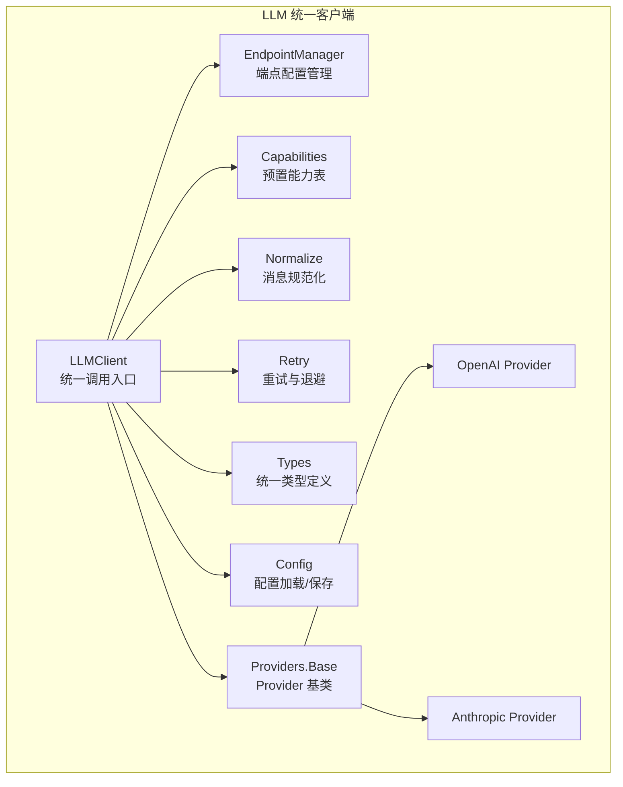
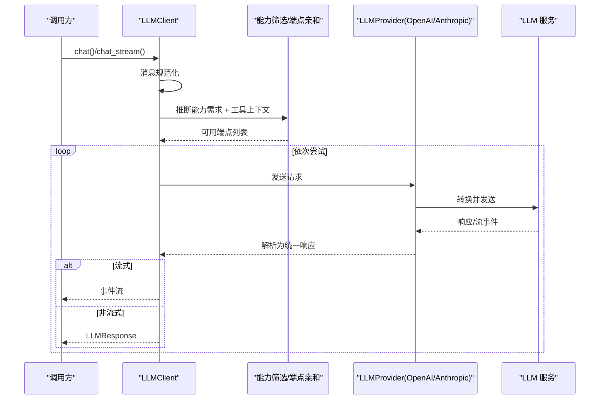
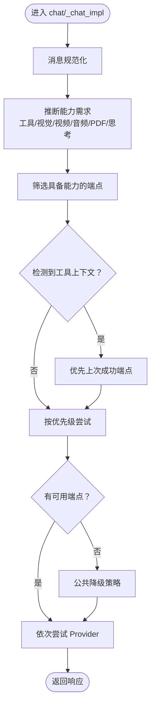
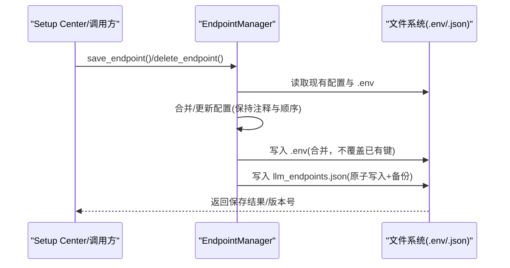
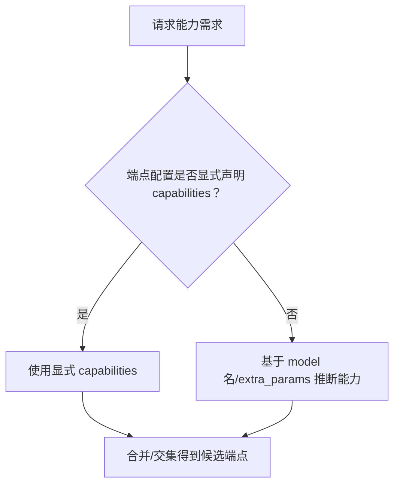
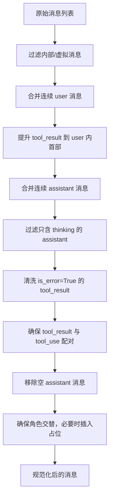
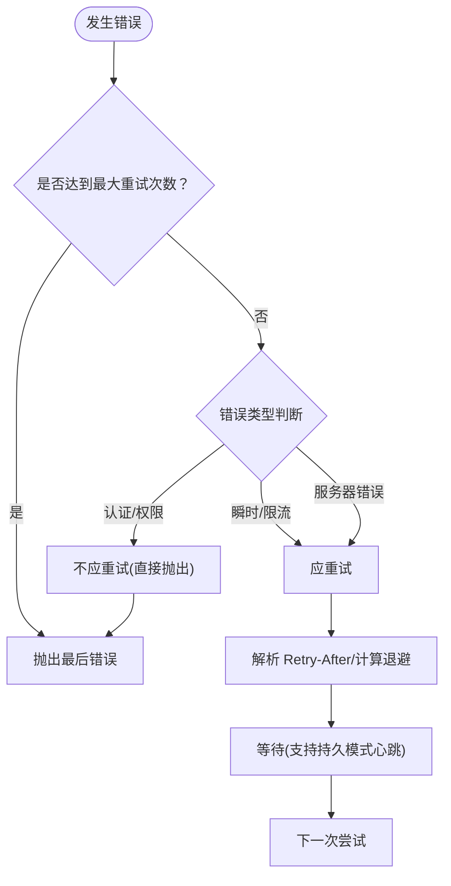
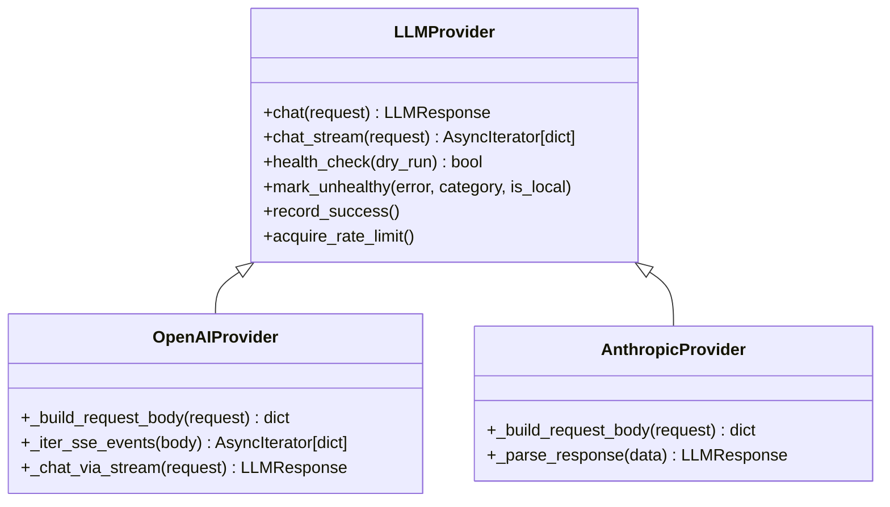
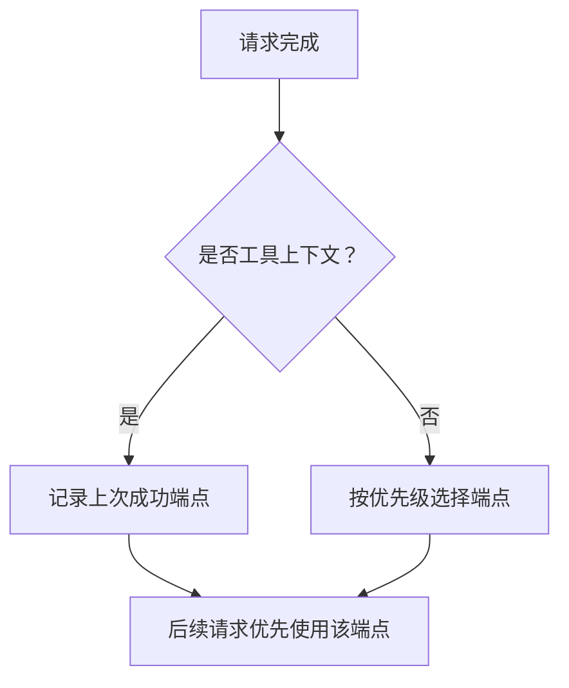
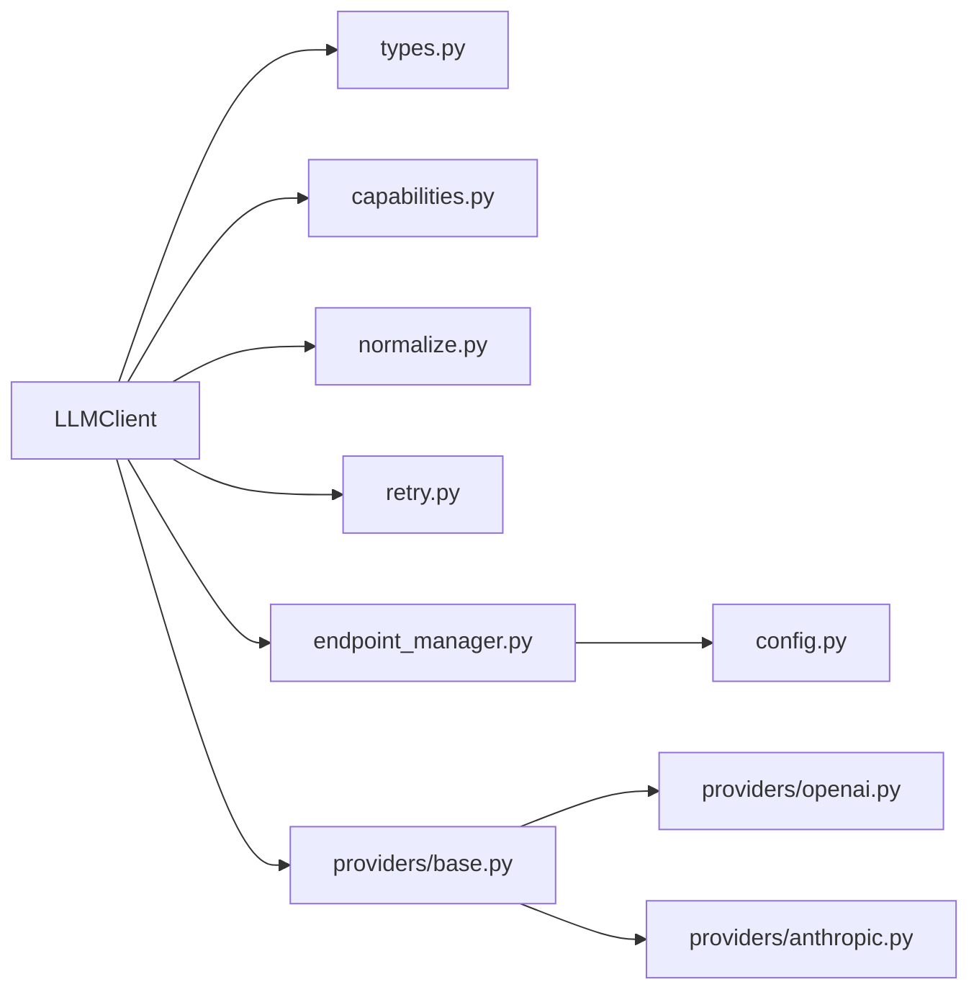

# 统一客户端

<cite>
**本文引用的文件**
- [client.py](file://src/synapse/llm/client.py)
- [endpoint_manager.py](file://src/synapse/llm/endpoint_manager.py)
- [capabilities.py](file://src/synapse/llm/capabilities.py)
- [normalize.py](file://src/synapse/llm/normalize.py)
- [retry.py](file://src/synapse/llm/retry.py)
- [types.py](file://src/synapse/llm/types.py)
- [config.py](file://src/synapse/llm/config.py)
- [base.py](file://src/synapse/llm/providers/base.py)
- [openai.py](file://src/synapse/llm/providers/openai.py)
- [anthropic.py](file://src/synapse/llm/providers/anthropic.py)
</cite>

## 目录
1. [简介](#简介)
2. [项目结构](#项目结构)
3. [核心组件](#核心组件)
4. [架构总览](#架构总览)
5. [详细组件分析](#详细组件分析)
6. [依赖分析](#依赖分析)
7. [性能考虑](#性能考虑)
8. [故障排查指南](#故障排查指南)
9. [结论](#结论)
10. [附录](#附录)

## 简介
本文件为统一 LLM 客户端的技术文档，聚焦以下主题：
- 核心架构设计：统一请求入口、端点管理、Provider 抽象、可观测性与降级策略
- 端点管理机制：配置加载、写入保护、版本与冲突检测
- 能力检测算法：基于预置能力表与端点配置的综合能力判定
- 智能故障转移：按能力筛选、工具上下文感知、冷却期与渐进退避
- 端点亲和性策略：对话级亲和、失败后锁定、恢复机制
- 动态模型切换机制：临时覆盖、会话隔离、过期与恢复
- 消息规范化流程：多步规范化、工具调用配对、空消息过滤
- 并发控制策略：全局信号量、并发统计、流式与非流式一致性
- 性能监控指标：并发在途、冷却剩余、错误分类统计
- 客户端配置选项、使用示例与最佳实践

## 项目结构
统一 LLM 客户端位于 src/synapse/llm 目录，围绕 LLMClient 为核心，配合端点配置、Provider 抽象、能力表、消息规范化、重试与退避、可观测性等模块协同工作。

图表来源
- [client.py](file://src/synapse/llm/client.py)
- [endpoint_manager.py](file://src/synapse/llm/endpoint_manager.py)
- [capabilities.py](file://src/synapse/llm/capabilities.py)
- [normalize.py](file://src/synapse/llm/normalize.py)
- [retry.py](file://src/synapse/llm/retry.py)
- [types.py](file://src/synapse/llm/types.py)
- [config.py](file://src/synapse/llm/config.py)
- [base.py](file://src/synapse/llm/providers/base.py)
- [openai.py](file://src/synapse/llm/providers/openai.py)
- [anthropic.py](file://src/synapse/llm/providers/anthropic.py)

章节来源
- [client.py](file://src/synapse/llm/client.py)
- [endpoint_manager.py](file://src/synapse/llm/endpoint_manager.py)
- [capabilities.py](file://src/synapse/llm/capabilities.py)
- [normalize.py](file://src/synapse/llm/normalize.py)
- [retry.py](file://src/synapse/llm/retry.py)
- [types.py](file://src/synapse/llm/types.py)
- [config.py](file://src/synapse/llm/config.py)
- [base.py](file://src/synapse/llm/providers/base.py)
- [openai.py](file://src/synapse/llm/providers/openai.py)
- [anthropic.py](file://src/synapse/llm/providers/anthropic.py)

## 核心组件
- LLMClient：统一聊天与流式接口，负责能力检测、端点筛选、故障转移、动态切换、并发控制、可观测性
- EndpointManager：端点配置的唯一写入入口，提供原子写入、备份、线程锁、版本冲突检测
- Provider 抽象：LLMProvider 基类定义统一接口与健康/冷却管理，OpenAIProvider/AnthropicProvider 实现具体协议
- 能力表：MODEL_CAPABILITIES 提供预置能力映射，结合端点配置进行能力判定
- 消息规范化：normalize_messages_for_api 将内部消息格式规范化为 API 可接受的格式
- 重试与退避：calculate_retry_delay、should_retry、is_529_error 等实现指数退避与 429/529 区分
- 类型系统：EndpointConfig、LLMRequest、LLMResponse 等统一数据结构与错误类型

章节来源
- [client.py](file://src/synapse/llm/client.py)
- [endpoint_manager.py](file://src/synapse/llm/endpoint_manager.py)
- [capabilities.py](file://src/synapse/llm/capabilities.py)
- [normalize.py](file://src/synapse/llm/normalize.py)
- [retry.py](file://src/synapse/llm/retry.py)
- [types.py](file://src/synapse/llm/types.py)
- [config.py](file://src/synapse/llm/config.py)
- [base.py](file://src/synapse/llm/providers/base.py)
- [openai.py](file://src/synapse/llm/providers/openai.py)
- [anthropic.py](file://src/synapse/llm/providers/anthropic.py)

## 架构总览
统一 LLM 客户端通过 LLMClient 聚合多端点与多提供商，依据请求能力需求与工具上下文进行端点筛选与故障转移，并通过 Provider 抽象屏蔽不同 API 的差异。消息在发送前经规范化处理，响应在 Provider 层解析后统一为 LLMResponse。

图表来源
- [client.py](file://src/synapse/llm/client.py)
- [openai.py](file://src/synapse/llm/providers/openai.py)
- [anthropic.py](file://src/synapse/llm/providers/anthropic.py)

## 详细组件分析

### LLMClient：统一调用与智能故障转移
- 统一接口：chat() 与 chat_stream()，均通过全局信号量限制并发，记录在途请求数用于监控
- 能力检测：根据消息中的工具、视觉、视频、音频、PDF、思考模式等需求，筛选具备相应能力的端点
- 工具上下文感知：当检测到工具上下文时，默认禁用跨端点/跨协议的故障转移，避免思维链与元数据中断
- 故障转移策略：按优先级尝试端点；遇到 413 自动降低 max_tokens 重试；遇到 429/529/503 等瞬时错误按退避等待；流式场景中途失败禁止切换
- 动态模型切换：支持 EndpointOverride 临时覆盖，按会话隔离，过期后自动恢复
- 端点亲和性：记录上次成功端点，优先复用，提升工具链连续性
- 启动健康检查：对所有端点进行轻量认证与网络探测，认证失败永久跳过，直至 reload

图表来源
- [client.py](file://src/synapse/llm/client.py)

章节来源
- [client.py](file://src/synapse/llm/client.py)

### EndpointManager：端点配置唯一写入入口
- 原子写入与备份：写入 llm_endpoints.json 与 .env 时采用临时文件 + 重命名，失败回滚至 .bak
- 线程锁保护：多线程并发写入时保证一致性
- 版本冲突检测：基于内容哈希的版本号，支持乐观锁检测并发修改
- 环境变量管理：自动分配唯一 env var 名称，避免不同端点共享密钥时的覆盖风险
- 端点状态查询：遍历 endpoints/compiler_endpoints/stt_endpoints，返回 key 存在状态

图表来源
- [endpoint_manager.py](file://src/synapse/llm/endpoint_manager.py)

章节来源
- [endpoint_manager.py](file://src/synapse/llm/endpoint_manager.py)

### 能力检测算法：预置能力表与端点配置融合
- 预置能力表：MODEL_CAPABILITIES 提供各提供商/模型的能力映射，涵盖 text/vision/video/tools/thinking/audio/pdf
- 端点配置能力：EndpointConfig.has_capability() 优先使用显式配置的 capabilities 列表；若为空则基于 extra_params/model 名进行兼容推断
- 兼容性兜底：当 capabilities 仅为默认 ["text"] 时，根据 model 名与 provider slug 推断能力，避免遗漏

图表来源
- [capabilities.py](file://src/synapse/llm/capabilities.py)
- [types.py](file://src/synapse/llm/types.py)

章节来源
- [capabilities.py](file://src/synapse/llm/capabilities.py)
- [types.py](file://src/synapse/llm/types.py)

### 消息规范化流程：多步规范化与工具调用配对
- 规范化步骤：过滤内部消息、合并连续 user 消息、提升 tool_result、合并 assistant 分片、过滤 orphaned thinking-only、清洗错误 tool_result、确保 tool_result 与 tool_use 配对、移除空 assistant、确保角色交替
- 工具调用配对：收集 assistant 中 tool_use 的 id，过滤 user 中不属于任一 id 的 tool_result
- 适用范围：所有 Provider 前的统一消息格式，确保不同 API 的兼容性

图表来源
- [normalize.py](file://src/synapse/llm/normalize.py)

章节来源
- [normalize.py](file://src/synapse/llm/normalize.py)

### 重试与退避策略：指数退避与 429/529 区分
- 指数退避：BASE_DELAY * 2^(attempt-1)，上限 32s，加 25% 随机抖动
- Retry-After 优先：优先使用服务器返回的 Retry-After
- 429/529 区分：连续 529 达到阈值触发 fallback 模型
- 持久模式：长等待 + 心跳事件，适合后台任务
- 上下文溢出自愈：从错误信息中提取建议 max_tokens 并自动调整

图表来源
- [retry.py](file://src/synapse/llm/retry.py)

章节来源
- [retry.py](file://src/synapse/llm/retry.py)

### Provider 抽象与具体实现
- LLMProvider 基类：定义统一接口 chat()/chat_stream()，提供健康检查、冷却期管理、RPM 限流、错误分类与渐进退避
- OpenAIProvider：支持 OpenAI/DashScope/Kimi/OpenRouter/SiliconFlow 等兼容 API，自动检测 stream-only 端点，按提供商特性注入思考参数，处理空 choices/错误响应体等边界情况
- AnthropicProvider：支持 SSE 规范解析、Prompt Cache、Interleaved Thinking、文本格式工具调用解析，增强流式稳定性与缓存效率

图表来源
- [base.py](file://src/synapse/llm/providers/base.py)
- [openai.py](file://src/synapse/llm/providers/openai.py)
- [anthropic.py](file://src/synapse/llm/providers/anthropic.py)

章节来源
- [base.py](file://src/synapse/llm/providers/base.py)
- [openai.py](file://src/synapse/llm/providers/openai.py)
- [anthropic.py](file://src/synapse/llm/providers/anthropic.py)

### 端点亲和性策略与动态模型切换
- 端点亲和性：记录上次成功端点名称，在工具上下文场景下优先复用，避免 failover 后又回到高优先级但已故障的端点
- 临时覆盖：EndpointOverride 支持按会话隔离的临时覆盖，过期后自动恢复；全局覆盖支持永久切换
- 过期与恢复：过期时间到达后自动清理覆盖状态；reload 时清空认证失败记录与亲和性

图表来源
- [client.py](file://src/synapse/llm/client.py)

章节来源
- [client.py](file://src/synapse/llm/client.py)

### 并发控制与性能监控
- 全局信号量：限制同时在飞请求数，防止并发风暴；支持按会话隔离的临时覆盖
- 并发统计：暴露在途请求数与最大并发值，便于健康监控 API 使用
- 流式与非流式一致性：两者均受全局信号量保护，确保事件循环稳定

章节来源
- [client.py](file://src/synapse/llm/client.py)

## 依赖分析
- LLMClient 依赖 EndpointManager（配置加载/写入）、capabilities（能力判定）、normalize（消息规范化）、retry（重试策略）、types（统一类型）
- Provider 抽象依赖 base（健康/冷却/RPM 限流），OpenAIProvider/AnthropicProvider 依赖各自的转换器与 SSE 解析器
- EndpointManager 依赖 .env 与 llm_endpoints.json 的原子写入与备份机制

图表来源
- [client.py](file://src/synapse/llm/client.py)
- [endpoint_manager.py](file://src/synapse/llm/endpoint_manager.py)
- [capabilities.py](file://src/synapse/llm/capabilities.py)
- [normalize.py](file://src/synapse/llm/normalize.py)
- [retry.py](file://src/synapse/llm/retry.py)
- [types.py](file://src/synapse/llm/types.py)
- [config.py](file://src/synapse/llm/config.py)
- [base.py](file://src/synapse/llm/providers/base.py)
- [openai.py](file://src/synapse/llm/providers/openai.py)
- [anthropic.py](file://src/synapse/llm/providers/anthropic.py)

章节来源
- [client.py](file://src/synapse/llm/client.py)
- [endpoint_manager.py](file://src/synapse/llm/endpoint_manager.py)
- [capabilities.py](file://src/synapse/llm/capabilities.py)
- [normalize.py](file://src/synapse/llm/normalize.py)
- [retry.py](file://src/synapse/llm/retry.py)
- [types.py](file://src/synapse/llm/types.py)
- [config.py](file://src/synapse/llm/config.py)
- [base.py](file://src/synapse/llm/providers/base.py)
- [openai.py](file://src/synapse/llm/providers/openai.py)
- [anthropic.py](file://src/synapse/llm/providers/anthropic.py)

## 性能考虑
- 并发限制：通过全局信号量控制最大并发，避免 event loop 被大量请求淹没
- 冷却期与渐进退避：对瞬时错误采用渐进式冷静期，减少无效重试；对配额/认证错误采用较长冷静期
- 流式优化：SSE 解析与事件转换在 Provider 层完成，减少上层负担；流式场景中途失败禁止切换，避免混合响应
- 大上下文超时自适应：根据请求体大小动态放大读超时，避免频繁超时导致的无效重试
- 缓存与提示词优化：Anthropic Provider 支持 Prompt Cache 与缓存断点，降低 token 成本

## 故障排查指南
- 认证失败：检查 .env 中 API Key 是否正确设置；认证失败端点会被永久跳过，需 reload 恢复
- 429/529/503：查看冷却剩余时间；可在公共降级策略中等待冷静期或强制重试
- 413：自动降低 max_tokens 重试；若仍失败，检查上下文长度与模型上下文窗口
- 结构性错误：检查请求格式与能力匹配；错误分类为 STRUCTURAL，不计入连续失败
- 流式中途失败：流式场景一旦开始产出事件，中途失败将禁止切换端点，避免混合响应
- 配置冲突：EndpointManager 支持版本冲突检测，出现冲突时根据当前版本号提示刷新

章节来源
- [client.py](file://src/synapse/llm/client.py)
- [base.py](file://src/synapse/llm/providers/base.py)
- [endpoint_manager.py](file://src/synapse/llm/endpoint_manager.py)

## 结论
统一 LLM 客户端通过标准化的消息格式、能力检测、智能故障转移与端点亲和性策略，实现了多提供商、多模型的统一接入与高可用调用。配合完善的配置管理、重试与退避、并发控制与可观测性，能够在复杂网络环境下稳定地提供高质量的 LLM 服务。

## 附录

### 客户端配置选项
- 端点配置项：name/provider/api_type/base_url/api_key_env/api_key/model/priority/max_tokens/context_window/timeout/capabilities/extra_params/note/rpm_limit/pricing_tiers/price_currency/enabled/stream_only
- 全局设置：retry_count、retry_delay_seconds、health_check_interval、fallback_on_error
- 环境变量：通过 .env 管理 API Key，EndpointManager 自动分配唯一 env var 名称

章节来源
- [types.py](file://src/synapse/llm/types.py)
- [config.py](file://src/synapse/llm/config.py)
- [endpoint_manager.py](file://src/synapse/llm/endpoint_manager.py)

### 使用示例与最佳实践
- 使用示例：调用 chat()/chat_stream()，传入 messages/system/tools/max_tokens/temperature/enable_thinking/thinking_depth 等参数
- 最佳实践：
  - 为每个端点明确声明 capabilities，避免基于模型名的推断误差
  - 工具上下文场景下谨慎开启跨协议 failover，优先保证思维链连续性
  - 合理设置 max_concurrent，避免并发风暴
  - 使用 EndpointManager 进行端点配置的增删改，避免直接编辑文件导致的不一致
  - 遇到 429/529 时利用冷却期策略，不要盲目提高并发

章节来源
- [client.py](file://src/synapse/llm/client.py)
- [endpoint_manager.py](file://src/synapse/llm/endpoint_manager.py)
- [types.py](file://src/synapse/llm/types.py)