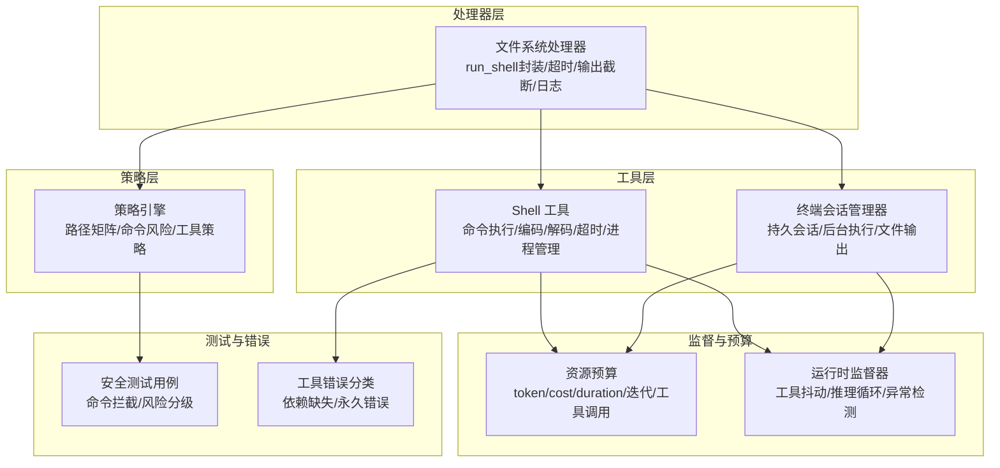
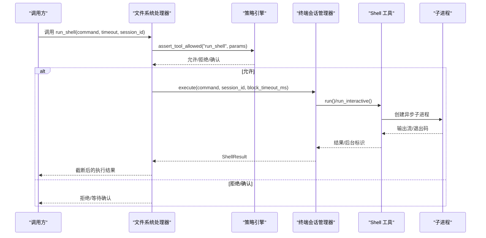
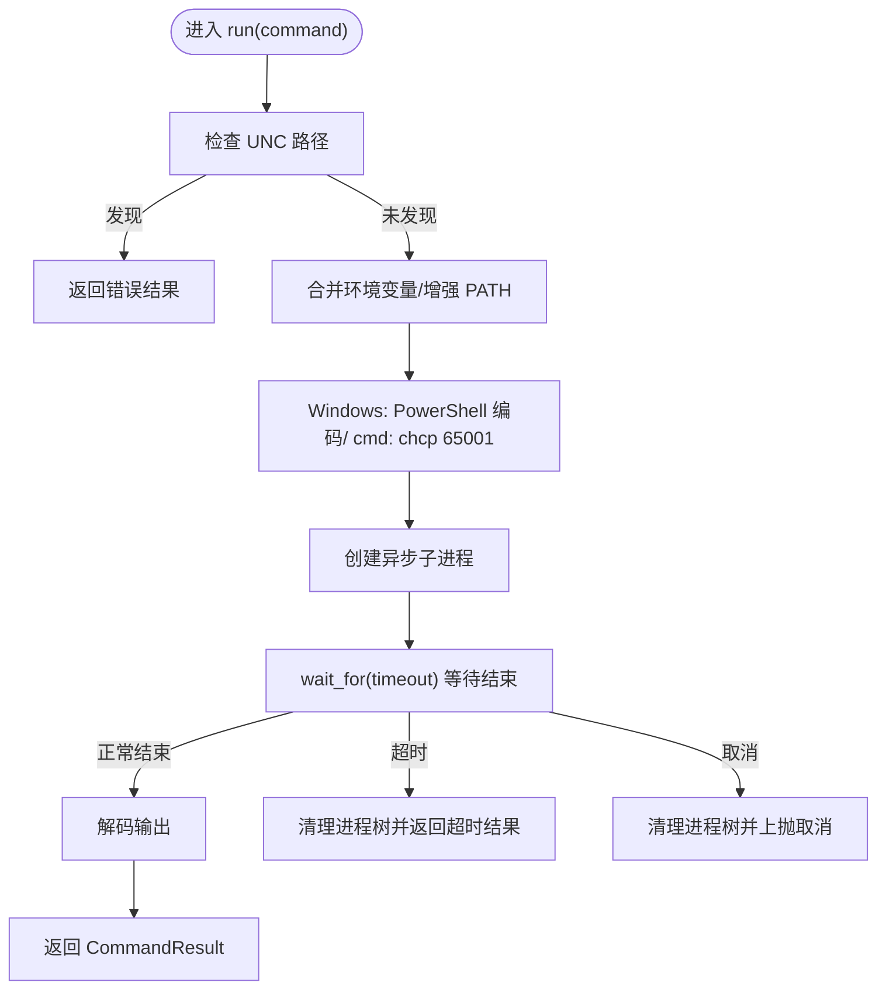
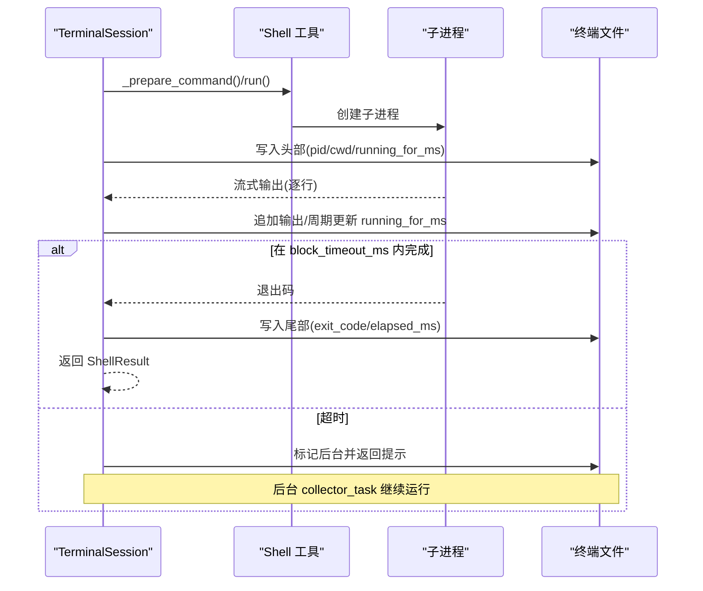
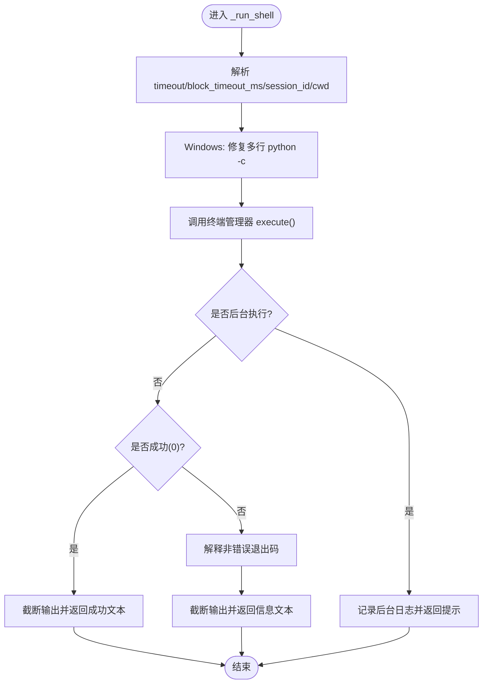
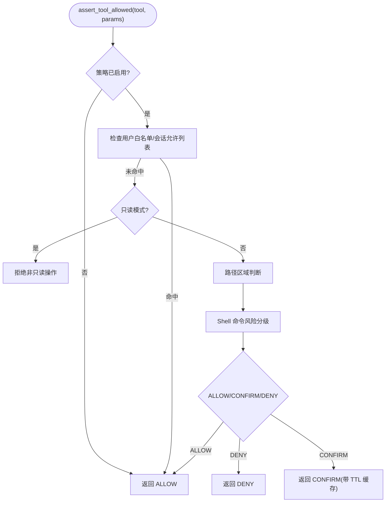
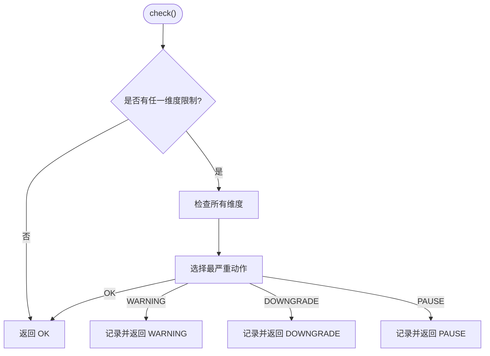
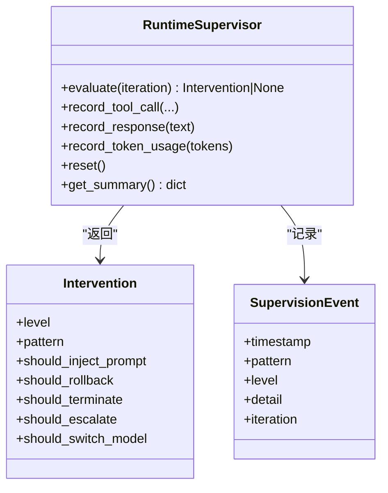
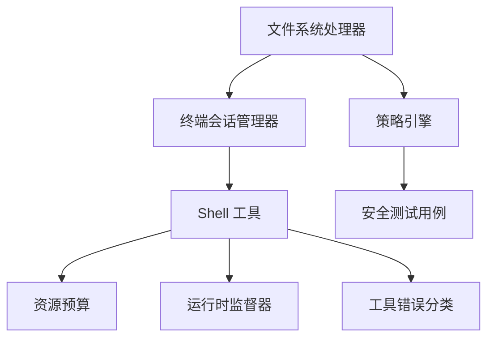

# 命令拦截机制

<cite>
**本文档引用的文件**
- [src/synapse/tools/shell.py](file://src/synapse/tools/shell.py)
- [src/synapse/tools/terminal.py](file://src/synapse/tools/terminal.py)
- [src/synapse/tools/handlers/filesystem.py](file://src/synapse/tools/handlers/filesystem.py)
- [src/synapse/core/policy.py](file://src/synapse/core/policy.py)
- [src/synapse/core/resource_budget.py](file://src/synapse/core/resource_budget.py)
- [src/synapse/core/supervisor.py](file://src/synapse/core/supervisor.py)
- [src/synapse/tools/errors.py](file://src/synapse/tools/errors.py)
- [tests/unit/test_security.py](file://tests/unit/test_security.py)
</cite>

## 目录
1. [简介](#简介)
2. [项目结构](#项目结构)
3. [核心组件](#核心组件)
4. [架构总览](#架构总览)
5. [详细组件分析](#详细组件分析)
6. [依赖关系分析](#依赖关系分析)
7. [性能考虑](#性能考虑)
8. [故障排查指南](#故障排查指南)
9. [结论](#结论)

## 简介
本文件系统化阐述命令拦截机制的设计与实现，覆盖命令预处理、执行前验证、实时监控、超时控制、进程管理、资源限制策略、异步执行模型、错误处理与结果收集，并提供性能优化建议、监控指标与故障排查方法。文档面向不同执行环境（Windows/macOS/Linux）的行为差异与配置调整进行说明，帮助读者在保证安全与稳定性的前提下高效使用命令执行能力。

## 项目结构
围绕命令拦截机制的关键模块包括：
- 工具层：Shell 工具与终端会话管理，负责命令执行、编码处理、输出解码与后台执行
- 处理器层：文件系统处理器，封装 run_shell 的调用流程、超时与输出截断、日志记录
- 策略层：集中策略引擎，提供路径区域矩阵、Shell 命令风险分级与工具策略
- 监督与预算：运行时监督器与资源预算，保障执行稳定性与成本控制
- 测试与错误：安全测试用例与工具错误分类，辅助验证与排障

**图表来源**
- [src/synapse/tools/shell.py:121-617](file://src/synapse/tools/shell.py#L121-L617)
- [src/synapse/tools/terminal.py:130-351](file://src/synapse/tools/terminal.py#L130-L351)
- [src/synapse/tools/handlers/filesystem.py:227-367](file://src/synapse/tools/handlers/filesystem.py#L227-L367)
- [src/synapse/core/policy.py:526-800](file://src/synapse/core/policy.py#L526-L800)
- [src/synapse/core/resource_budget.py:91-363](file://src/synapse/core/resource_budget.py#L91-L363)
- [src/synapse/core/supervisor.py:115-685](file://src/synapse/core/supervisor.py#L115-L685)
- [src/synapse/tools/errors.py:184-200](file://src/synapse/tools/errors.py#L184-L200)
- [tests/unit/test_security.py:190-222](file://tests/unit/test_security.py#L190-L222)

**章节来源**
- [src/synapse/tools/shell.py:121-617](file://src/synapse/tools/shell.py#L121-L617)
- [src/synapse/tools/terminal.py:130-351](file://src/synapse/tools/terminal.py#L130-L351)
- [src/synapse/tools/handlers/filesystem.py:227-367](file://src/synapse/tools/handlers/filesystem.py#L227-L367)
- [src/synapse/core/policy.py:526-800](file://src/synapse/core/policy.py#L526-L800)
- [src/synapse/core/resource_budget.py:91-363](file://src/synapse/core/resource_budget.py#L91-L363)
- [src/synapse/core/supervisor.py:115-685](file://src/synapse/core/supervisor.py#L115-L685)
- [src/synapse/tools/errors.py:184-200](file://src/synapse/tools/errors.py#L184-L200)
- [tests/unit/test_security.py:190-222](file://tests/unit/test_security.py#L190-L222)

## 核心组件
- Shell 工具：负责命令执行、Windows PowerShell 编码、输出解码、超时与取消处理、进程树清理
- 终端会话管理器：提供持久会话、阻塞超时控制、后台执行与文件输出流
- 文件系统处理器：run_shell 的高层封装，处理超时、输出截断、日志记录与错误解释
- 策略引擎：路径区域矩阵、Shell 命令风险分级、工具策略与确认门
- 资源预算：任务级预算管理，多维阈值与分级动作
- 运行时监督器：工具抖动、编辑抖动、推理循环、Token 异常、计划偏离等模式检测与干预
- 错误分类与安全测试：工具错误类型与命令拦截测试用例

**章节来源**
- [src/synapse/tools/shell.py:121-617](file://src/synapse/tools/shell.py#L121-L617)
- [src/synapse/tools/terminal.py:130-351](file://src/synapse/tools/terminal.py#L130-L351)
- [src/synapse/tools/handlers/filesystem.py:227-367](file://src/synapse/tools/handlers/filesystem.py#L227-L367)
- [src/synapse/core/policy.py:526-800](file://src/synapse/core/policy.py#L526-L800)
- [src/synapse/core/resource_budget.py:91-363](file://src/synapse/core/resource_budget.py#L91-L363)
- [src/synapse/core/supervisor.py:115-685](file://src/synapse/core/supervisor.py#L115-L685)
- [src/synapse/tools/errors.py:184-200](file://src/synapse/tools/errors.py#L184-L200)
- [tests/unit/test_security.py:190-222](file://tests/unit/test_security.py#L190-L222)

## 架构总览
命令拦截机制采用“策略前置 + 执行隔离 + 监督反馈”的设计：
- 策略前置：在工具执行前进行路径与命令风险评估，必要时要求确认
- 执行隔离：通过异步子进程与会话文件输出，避免阻塞与数据丢失
- 监督反馈：结合资源预算与运行时监督器，动态调整执行策略与干预级别

**图表来源**
- [src/synapse/tools/handlers/filesystem.py:227-367](file://src/synapse/tools/handlers/filesystem.py#L227-L367)
- [src/synapse/core/policy.py:759-800](file://src/synapse/core/policy.py#L759-L800)
- [src/synapse/tools/terminal.py:130-275](file://src/synapse/tools/terminal.py#L130-L275)
- [src/synapse/tools/shell.py:367-497](file://src/synapse/tools/shell.py#L367-L497)

## 详细组件分析

### Shell 工具：命令执行与进程管理
- 命令预处理
  - Windows PowerShell 自动编码：使用 -EncodedCommand 避免引号与转义问题，统一 UTF-8 输出
  - Windows cmd 编码：强制 chcp 65001，解决中文路径/文件名乱码
  - UNC 路径安全检查：阻止 UNC 路径以避免 NTLM 凭证泄漏
- 执行与监控
  - 异步子进程创建，分离 stdout/stderr 管道
  - 超时控制：wait_for(timeout) + 超时后进程树清理
  - 取消处理：CancelledError 时立即杀掉进程树并上抛
  - 输出解码：优先 UTF-8，回退到系统 OEM 代码页
- 进程管理
  - Windows：taskkill /T /F 杀死进程树，随后 wait() 防止无限阻塞
  - 非 Windows：直接 kill()，回退到 wait()

**图表来源**
- [src/synapse/tools/shell.py:367-497](file://src/synapse/tools/shell.py#L367-L497)

**章节来源**
- [src/synapse/tools/shell.py:121-617](file://src/synapse/tools/shell.py#L121-L617)

### 终端会话管理器：持久会话与后台执行
- 会话持久化：跨多次 run_shell 调用维持 cwd/env，支持后台执行
- 阻塞超时控制：block_timeout_ms 控制前台执行时长，超时后自动后台化
- 输出流：实时写入 data/terminals/{id}.txt，包含头部（pid/cwd/running_for_ms）、正文与尾部（exit_code/elapsed_ms）
- 后台执行：collector_task 使用 shield 防止被 wait_for 取消，确保数据不丢失
- 进程清理：超时/取消时 kill 子进程并等待退出

**图表来源**
- [src/synapse/tools/terminal.py:130-275](file://src/synapse/tools/terminal.py#L130-L275)

**章节来源**
- [src/synapse/tools/terminal.py:130-351](file://src/synapse/tools/terminal.py#L130-L351)

### 文件系统处理器：run_shell 封装与输出管理
- 超时与会话：从参数解析 block_timeout_ms 或转换 timeout，交由终端管理器执行
- Windows 特殊处理：修复多行 python -c 命令在 Windows 下的换行问题
- 输出截断：超过阈值时保存溢出文件并通过提示引导用户分页读取
- 日志记录：根据执行结果级别写入会话日志缓冲
- 退出码语义：对 grep/find/where 等常见命令的非错误退出码进行人性化解释

**图表来源**
- [src/synapse/tools/handlers/filesystem.py:227-367](file://src/synapse/tools/handlers/filesystem.py#L227-L367)

**章节来源**
- [src/synapse/tools/handlers/filesystem.py:227-367](file://src/synapse/tools/handlers/filesystem.py#L227-L367)

### 策略引擎：执行前验证与风险控制
- 路径区域矩阵：Workspace/Controlled/Protected/Forbidden 四区与读写/创建/覆盖/删除等操作类型的许可矩阵
- Shell 命令风险分级：Critical/High/Medium/Low，结合平台差异与黑名单命令
- 工具策略：run_shell/run_powershell 的危险模式与确认需求
- 确认门：超时、默认策略与 TTL 缓存，支持用户确认与自动确认模式
- 自保护：死亡开关与审计记录，防止连续拒绝导致只读模式

**图表来源**
- [src/synapse/core/policy.py:526-800](file://src/synapse/core/policy.py#L526-L800)

**章节来源**
- [src/synapse/core/policy.py:526-800](file://src/synapse/core/policy.py#L526-L800)
- [tests/unit/test_security.py:190-222](file://tests/unit/test_security.py#L190-L222)

### 资源预算：多维预算与分级动作
- 预算维度：max_tokens、max_cost_usd、max_duration_seconds、max_iterations、max_tool_calls
- 分级动作：WARNING(80%)、DOWNGRADE(90%)、PAUSE(100%)
- 父子预算：allocate_sub_budget 支持委派任务预算分配
- 决策追踪：通过追踪器记录预算检查决策

**图表来源**
- [src/synapse/core/resource_budget.py:192-346](file://src/synapse/core/resource_budget.py#L192-L346)

**章节来源**
- [src/synapse/core/resource_budget.py:91-363](file://src/synapse/core/resource_budget.py#L91-L363)

### 运行时监督器：行为模式检测与干预
- 检测能力：工具抖动、编辑抖动、推理死循环、Token 异常、计划偏离、签名重复、极端迭代、空转循环
- 干预策略：NUDGE、StrategySwitch、ModelSwitch、Escalate、Terminate
- 不注入对话：Token 异常等事件仅记录日志，不向对话注入消息

**图表来源**
- [src/synapse/core/supervisor.py:115-685](file://src/synapse/core/supervisor.py#L115-L685)

**章节来源**
- [src/synapse/core/supervisor.py:115-685](file://src/synapse/core/supervisor.py#L115-L685)

### 错误处理与工具错误分类
- 依赖缺失：命令未找到/未识别，建议安装所需工具
- 永久性错误：默认错误类型，需人工介入
- run_shell 输出截断：超长输出保存溢出文件，提供分页读取指引

**章节来源**
- [src/synapse/tools/errors.py:184-200](file://src/synapse/tools/errors.py#L184-L200)
- [src/synapse/tools/handlers/filesystem.py:368-386](file://src/synapse/tools/handlers/filesystem.py#L368-L386)

## 依赖关系分析
- 文件系统处理器依赖终端会话管理器与策略引擎，负责 run_shell 的高层封装与输出管理
- Shell 工具与终端会话管理器共同构成执行层，分别承担命令执行与会话/后台管理职责
- 资源预算与运行时监督器作为执行保障层，分别从成本与行为模式角度约束执行
- 策略引擎贯穿执行前验证，与安全测试用例配合形成闭环

**图表来源**
- [src/synapse/tools/handlers/filesystem.py:227-367](file://src/synapse/tools/handlers/filesystem.py#L227-L367)
- [src/synapse/tools/terminal.py:130-351](file://src/synapse/tools/terminal.py#L130-L351)
- [src/synapse/tools/shell.py:121-617](file://src/synapse/tools/shell.py#L121-L617)
- [src/synapse/core/policy.py:526-800](file://src/synapse/core/policy.py#L526-L800)
- [src/synapse/core/resource_budget.py:91-363](file://src/synapse/core/resource_budget.py#L91-L363)
- [src/synapse/core/supervisor.py:115-685](file://src/synapse/core/supervisor.py#L115-L685)
- [src/synapse/tools/errors.py:184-200](file://src/synapse/tools/errors.py#L184-L200)
- [tests/unit/test_security.py:190-222](file://tests/unit/test_security.py#L190-L222)

**章节来源**
- [src/synapse/tools/handlers/filesystem.py:227-367](file://src/synapse/tools/handlers/filesystem.py#L227-L367)
- [src/synapse/tools/terminal.py:130-351](file://src/synapse/tools/terminal.py#L130-L351)
- [src/synapse/tools/shell.py:121-617](file://src/synapse/tools/shell.py#L121-L617)
- [src/synapse/core/policy.py:526-800](file://src/synapse/core/policy.py#L526-L800)
- [src/synapse/core/resource_budget.py:91-363](file://src/synapse/core/resource_budget.py#L91-L363)
- [src/synapse/core/supervisor.py:115-685](file://src/synapse/core/supervisor.py#L115-L685)
- [src/synapse/tools/errors.py:184-200](file://src/synapse/tools/errors.py#L184-L200)
- [tests/unit/test_security.py:190-222](file://tests/unit/test_security.py#L190-L222)

## 性能考虑
- 异步 I/O 与流式输出：避免 communicate() 导致的超时取消与数据丢失，使用流式读取与 shield 保护
- 超时与后台化：合理设置 block_timeout_ms，长任务自动后台化并写入文件，降低前台阻塞
- 输出截断与溢出：对超长输出进行截断并保存溢出文件，避免内存与传输压力
- 编码与解码：统一 UTF-8 编码与 OEM 代码页回退，减少乱码与解码开销
- 进程树清理：Windows 使用 taskkill /T /F，避免孤儿进程占用资源

[本节为通用指导，无需特定文件引用]

## 故障排查指南
- 命令未找到/未识别
  - 现象：Windows 9009，stdout/stderr 为空
  - 处理：检查 PATH，安装所需工具；run_shell 提供安装建议
- UNC 路径被阻止
  - 现象：UNC 路径触发 NTLM 自动认证风险
  - 处理：使用本地路径或映射驱动器
- 超时与取消
  - 现象：长时间运行任务被中断或后台化
  - 处理：增大超时或改为后台执行；使用 read_file 读取终端文件
- 退出码语义
  - 现象：某些命令返回非零但非错误
  - 处理：处理器对 grep/find/where 等进行语义解释，避免误判
- 策略拒绝
  - 现象：run_shell 被策略拒绝或需要确认
  - 处理：检查路径区域、命令风险与工具策略；必要时进行用户确认

**章节来源**
- [src/synapse/tools/handlers/filesystem.py:324-366](file://src/synapse/tools/handlers/filesystem.py#L324-L366)
- [src/synapse/tools/errors.py:184-200](file://src/synapse/tools/errors.py#L184-L200)
- [src/synapse/core/policy.py:759-800](file://src/synapse/core/policy.py#L759-L800)
- [tests/unit/test_security.py:190-222](file://tests/unit/test_security.py#L190-L222)

## 结论
命令拦截机制通过“策略前置 + 执行隔离 + 监督反馈”实现了安全、可控、可观测的命令执行体系。Shell 工具与终端会话管理器提供了稳健的执行与监控能力，策略引擎与运行时监督器保障了安全与稳定性，资源预算与错误分类完善了成本控制与排障手段。在不同执行环境下，编码处理与 UNC 检查进一步增强了跨平台一致性与安全性。