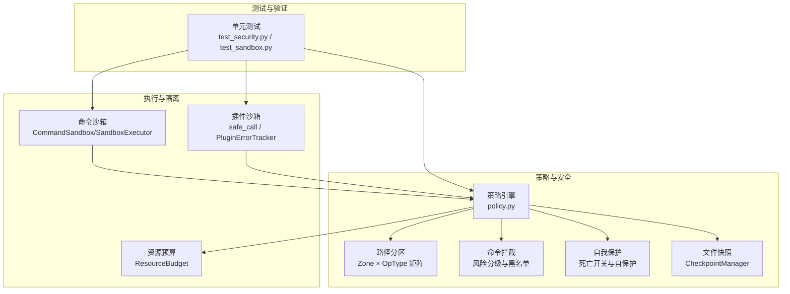
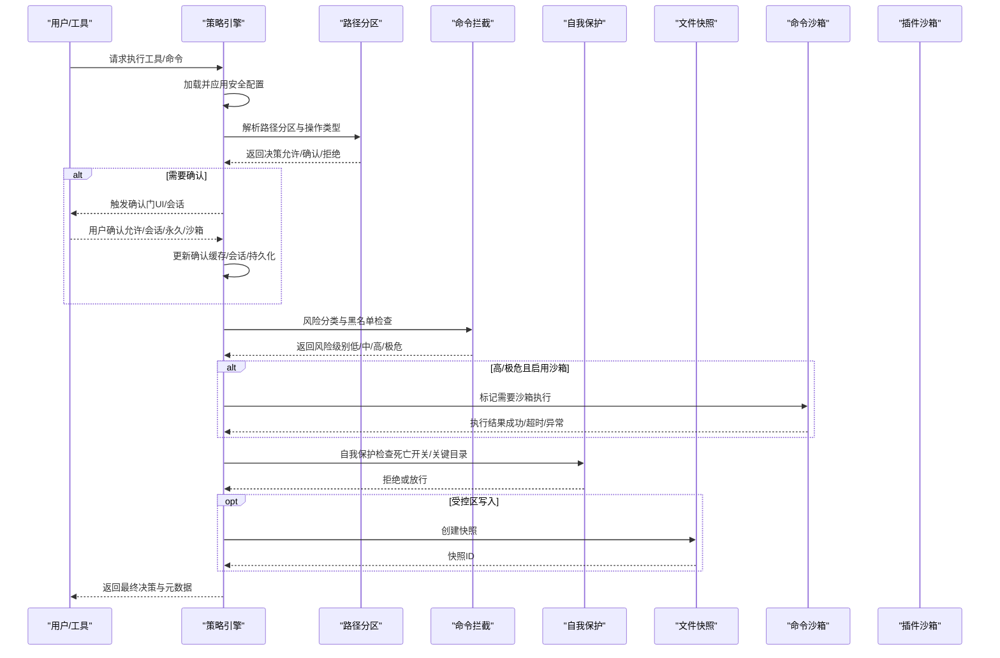
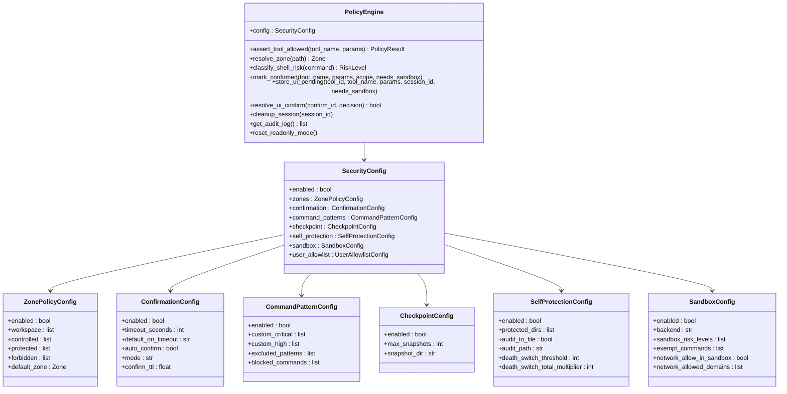
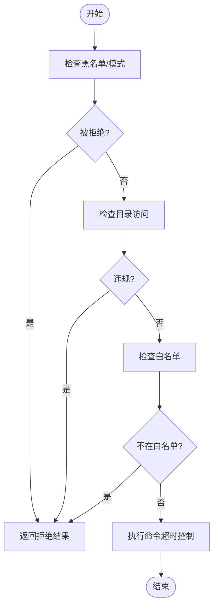
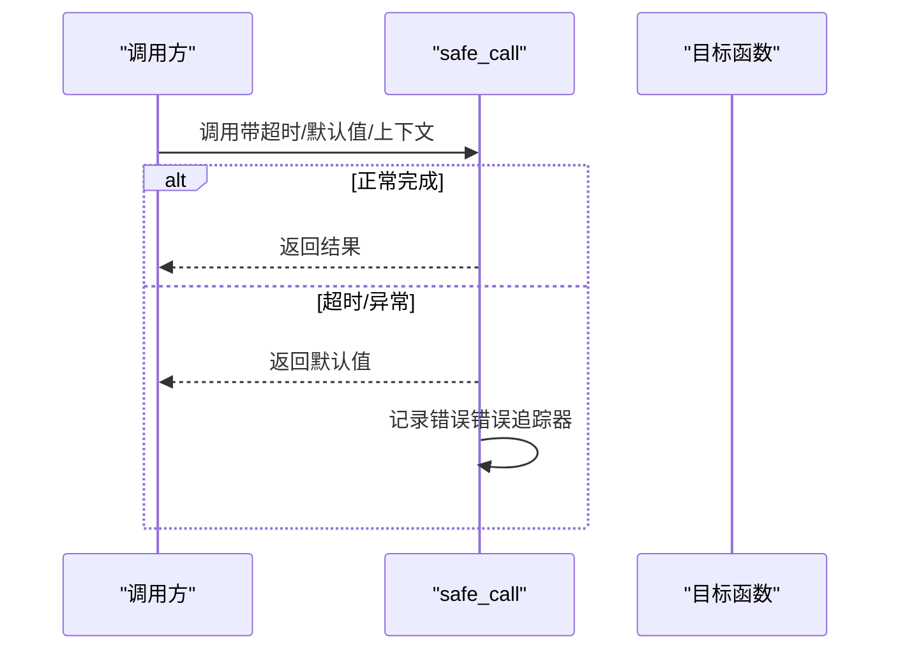
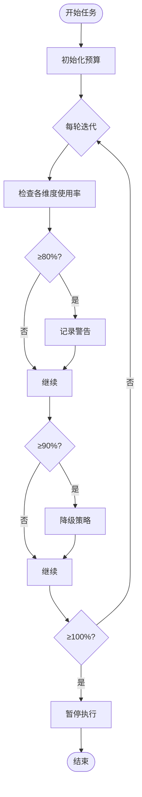
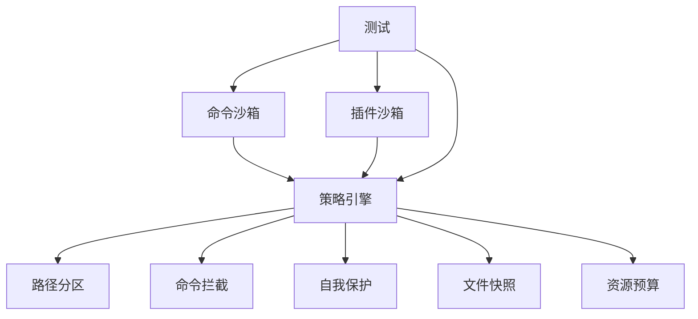

# 安全沙箱系统

<cite>
**本文档引用的文件**
- [sandbox.py](file://src/synapse/core/sandbox.py)
- [policy.py](file://src/synapse/core/policy.py)
- [sandbox.py](file://src/synapse/plugins/sandbox.py)
- [resource_budget.py](file://src/synapse/core/resource_budget.py)
- [test_sandbox.py](file://tests/unit/test_plugins/test_sandbox.py)
- [test_security.py](file://tests/unit/test_security.py)
</cite>

## 目录
1. [简介](#简介)
2. [项目结构](#项目结构)
3. [核心组件](#核心组件)
4. [架构总览](#架构总览)
5. [详细组件分析](#详细组件分析)
6. [依赖关系分析](#依赖关系分析)
7. [性能考虑](#性能考虑)
8. [故障排查指南](#故障排查指南)
9. [结论](#结论)
10. [附录](#附录)

## 简介
本文件面向安全沙箱系统的使用者与维护者，系统性阐述六层安全防护设计、路径分区管理、确认门策略、命令拦截规则、文件快照回滚机制、自我保护与数据锁定、操作系统级沙箱的平台差异、策略引擎配置方法、资源预算限制机制，并提供最佳实践、威胁模型分析与应急响应指导。内容基于仓库中的核心实现进行提炼与可视化呈现，帮助读者快速理解并正确部署与运维该系统。

## 项目结构
围绕安全沙箱系统的关键代码主要分布在以下模块：
- 核心策略引擎：集中式决策层，负责六层安全策略的解析与执行
- 命令沙箱：对命令执行进行前置校验与隔离执行
- 插件沙箱：对插件调用进行超时、异常捕获与自动降级
- 资源预算：任务级资源预算与分级处置
- 测试用例：覆盖策略引擎、快照回滚、确认门等关键流程

图示来源
- [policy.py:526-1569](file://src/synapse/core/policy.py#L526-L1569)
- [sandbox.py:72-262](file://src/synapse/core/sandbox.py#L72-L262)
- [sandbox.py:66-127](file://src/synapse/plugins/sandbox.py#L66-L127)
- [resource_budget.py:91-363](file://src/synapse/core/resource_budget.py#L91-L363)
- [test_security.py:1-724](file://tests/unit/test_security.py#L1-L724)
- [test_sandbox.py:1-175](file://tests/unit/test_plugins/test_sandbox.py#L1-L175)

章节来源
- [policy.py:1-1569](file://src/synapse/core/policy.py#L1-L1569)
- [sandbox.py:1-262](file://src/synapse/core/sandbox.py#L1-L262)
- [sandbox.py:1-127](file://src/synapse/plugins/sandbox.py#L1-L127)
- [resource_budget.py:1-363](file://src/synapse/core/resource_budget.py#L1-L363)
- [test_security.py:1-724](file://tests/unit/test_security.py#L1-L724)
- [test_sandbox.py:1-175](file://tests/unit/test_plugins/test_sandbox.py#L1-L175)

## 核心组件
- 策略引擎（PolicyEngine）
  - 六层安全防护的集中决策层，支持路径分区（L1）、平台差异化风险（L3）、确认门（L4）、自我保护（L5）、快照回滚（L4）、沙箱联动（L6）、用户白名单（L4）等能力
  - 提供 YAML 加载、审计日志、会话清理、UI 确认流转等功能
- 命令沙箱（CommandSandbox / SandboxExecutor）
  - 对命令执行进行预检（黑名单/模式匹配/目录访问），并在允许后以超时与隔离方式执行
- 插件沙箱（safe_call / PluginErrorTracker）
  - 对插件异步/同步调用进行超时与异常捕获，支持错误统计与自动降级
- 资源预算（ResourceBudget）
  - 任务级资源预算管理，支持多维阈值与分级处置（警告/降级/暂停）

章节来源
- [policy.py:526-1569](file://src/synapse/core/policy.py#L526-L1569)
- [sandbox.py:72-262](file://src/synapse/core/sandbox.py#L72-L262)
- [sandbox.py:66-127](file://src/synapse/plugins/sandbox.py#L66-L127)
- [resource_budget.py:91-363](file://src/synapse/core/resource_budget.py#L91-L363)

## 架构总览
下图展示策略引擎与各子系统的交互关系，以及关键决策点（确认门、自我保护、快照、沙箱）如何协同工作：

图示来源
- [policy.py:759-1100](file://src/synapse/core/policy.py#L759-L1100)
- [sandbox.py:195-251](file://src/synapse/core/sandbox.py#L195-L251)
- [sandbox.py:66-127](file://src/synapse/plugins/sandbox.py#L66-L127)

## 详细组件分析

### 策略引擎（PolicyEngine）
- 六层安全防护
  - L1：路径分区 × 操作类型矩阵，决定读/写/删等操作在不同区域的许可
  - L3：跨平台 Shell 命令风险分级（极危/高/中/低），结合黑名单与排除模式
  - L4：确认门（TTL/会话/持久化）与 UI 确认流转
  - L5：自我保护（死亡开关、关键目录保护）
  - L6：沙箱联动（根据风险级别与配置决定是否启用沙箱）
  - L7：技能临时授权（仅在特定上下文有效）
- 关键能力
  - 路径解析与匹配（支持通配符与大小写不敏感）
  - 风险分类与拦截（正则模式匹配，含平台差异）
  - 确认门与持久化白名单（支持命令模式与工具名）
  - 自我保护与死亡开关（连续/累计阈值）
  - 审计日志与追踪记录
  - YAML 配置加载（新格式与旧格式兼容）

图示来源
- [policy.py:381-394](file://src/synapse/core/policy.py#L381-L394)
- [policy.py:526-1569](file://src/synapse/core/policy.py#L526-L1569)

章节来源
- [policy.py:526-1569](file://src/synapse/core/policy.py#L526-L1569)

### 命令沙箱（CommandSandbox / SandboxExecutor）
- 预检规则
  - 黑名单精确匹配与通配符匹配
  - 危险模式正则匹配（管道执行、写入设备等）
  - 目录访问检查（禁止访问受保护路径）
  - 白名单模式（若配置了允许命令，则仅允许白名单内命令）
- 执行与隔离
  - 异步子进程执行，带超时控制
  - 与策略引擎风险级别联动，必要时启用沙箱
  - 统一结果封装，包含输出、返回码与后端信息

图示来源
- [sandbox.py:90-128](file://src/synapse/core/sandbox.py#L90-L128)
- [sandbox.py:195-251](file://src/synapse/core/sandbox.py#L195-L251)

章节来源
- [sandbox.py:72-262](file://src/synapse/core/sandbox.py#L72-L262)

### 插件沙箱（safe_call / PluginErrorTracker）
- 功能
  - 异步/同步调用超时与异常捕获，失败时返回默认值
  - 错误统计与自动降级（超过阈值自动禁用插件）
  - 回调钩子用于插件清理
- 使用场景
  - 将第三方插件调用包裹在安全边界内，避免阻塞与崩溃影响主流程

图示来源
- [sandbox.py:66-127](file://src/synapse/plugins/sandbox.py#L66-L127)

章节来源
- [sandbox.py:1-127](file://src/synapse/plugins/sandbox.py#L1-L127)
- [test_sandbox.py:1-175](file://tests/unit/test_plugins/test_sandbox.py#L1-L175)

### 资源预算（ResourceBudget）
- 维度与阈值
  - token、成本、时长、迭代次数、工具调用次数
  - 分级阈值：警告（80%）、降级（90%）、暂停（100%）
- 行为
  - 任务开始时初始化，每轮迭代检查
  - 支持父子预算分配与汇总
  - 超限时触发暂停并记录决策轨迹

图示来源
- [resource_budget.py:192-345](file://src/synapse/core/resource_budget.py#L192-L345)

章节来源
- [resource_budget.py:1-363](file://src/synapse/core/resource_budget.py#L1-L363)

## 依赖关系分析
- 策略引擎依赖
  - 路径解析与匹配（正则/通配符/大小写不敏感）
  - 风险模式库（跨平台）
  - 审计日志与追踪
  - YAML 配置加载（新/旧格式）
- 命令沙箱依赖
  - 策略引擎的风险级别与确认门元数据
  - 子进程执行与超时控制
- 插件沙箱依赖
  - 错误追踪器与回调钩子
- 资源预算依赖
  - 设置项与追踪器

图示来源
- [policy.py:526-1569](file://src/synapse/core/policy.py#L526-L1569)
- [sandbox.py:72-262](file://src/synapse/core/sandbox.py#L72-L262)
- [sandbox.py:66-127](file://src/synapse/plugins/sandbox.py#L66-L127)
- [resource_budget.py:91-363](file://src/synapse/core/resource_budget.py#L91-L363)
- [test_security.py:1-724](file://tests/unit/test_security.py#L1-L724)
- [test_sandbox.py:1-175](file://tests/unit/test_plugins/test_sandbox.py#L1-L175)

章节来源
- [policy.py:526-1569](file://src/synapse/core/policy.py#L526-L1569)
- [sandbox.py:72-262](file://src/synapse/core/sandbox.py#L72-L262)
- [sandbox.py:66-127](file://src/synapse/plugins/sandbox.py#L66-L127)
- [resource_budget.py:91-363](file://src/synapse/core/resource_budget.py#L91-L363)
- [test_security.py:1-724](file://tests/unit/test_security.py#L1-L724)
- [test_sandbox.py:1-175](file://tests/unit/test_plugins/test_sandbox.py#L1-L175)

## 性能考虑
- 策略引擎
  - 路径匹配采用预编译与规范化，减少重复计算
  - 风险模式匹配使用正则缓存与排除列表，避免无效匹配
  - TTL 缓存与会话白名单降低重复确认开销
- 命令沙箱
  - 异步子进程与超时控制避免阻塞
  - 仅在必要时启用沙箱，减少隔离成本
- 插件沙箱
  - 超时与异常捕获避免长时间挂起
  - 错误追踪器窗口化统计，降低内存占用
- 资源预算
  - 多维阈值统一检查，避免多次遍历
  - 父子预算聚合，便于整体控制

## 故障排查指南
- 策略引擎
  - 审计日志定位拒绝原因与策略名称
  - 检查 YAML 配置加载是否成功
  - 确认确认门 TTL 是否过期
  - 死亡开关触发后需手动重置只读模式
- 命令沙箱
  - 检查黑名单/模式匹配是否误伤
  - 确认目录访问是否命中受保护路径
  - 调整超时与沙箱配置
- 插件沙箱
  - 查看错误追踪器统计，确认是否达到自动降级阈值
  - 检查回调钩子是否抛出异常
- 资源预算
  - 检查阈值配置与当前使用量
  - 关注暂停/降级触发原因

章节来源
- [policy.py:1484-1534](file://src/synapse/core/policy.py#L1484-L1534)
- [sandbox.py:233-251](file://src/synapse/core/sandbox.py#L233-L251)
- [sandbox.py:20-64](file://src/synapse/plugins/sandbox.py#L20-L64)
- [resource_budget.py:192-345](file://src/synapse/core/resource_budget.py#L192-L345)

## 结论
该安全沙箱系统通过“策略引擎 + 多层确认 + 自我保护 + 快照回滚 + 沙箱隔离 + 资源预算”的组合，构建了从路径分区到命令风险的全链路安全防线。其配置灵活、可扩展性强，既适用于开发调试环境，也可满足生产级安全需求。建议在上线前完成策略配置演练、确认门模式选择与快照策略评估，并建立完善的审计与应急响应流程。

## 附录

### 六层安全防护与确认门
- L1：路径分区 × 操作类型矩阵
  - 工作区：读/写/删等操作通常允许
  - 受控区：写/删需确认，编辑需快照
  - 受保护区：写/删/覆盖严格限制
  - 禁止访问区：全部拒绝
- L3：跨平台 Shell 命令风险分级
  - 极危：破坏性高、不可逆
  - 高：可能造成系统变更或数据丢失
  - 中：常规运维/安装类命令
  - 低：常规查询/查看类命令
- L4：确认门
  - TTL 缓存（短期）、会话白名单（会话内）、持久化白名单（长期）
  - UI 确认支持“允许一次/会话/永久/沙箱”
- L5：自我保护
  - 死亡开关（连续/累计阈值）触发只读模式
  - 关键目录保护（如 data/src/logs 等）
- L6：沙箱联动
  - 根据风险级别与配置决定是否启用沙箱
- L7：技能临时授权
  - 仅在特定技能上下文有效，仍受关键保护约束

章节来源
- [policy.py:77-110](file://src/synapse/core/policy.py#L77-L110)
- [policy.py:116-201](file://src/synapse/core/policy.py#L116-L201)
- [policy.py:278-394](file://src/synapse/core/policy.py#L278-L394)
- [policy.py:526-1569](file://src/synapse/core/policy.py#L526-L1569)

### 命令拦截规则与文件快照回滚
- 命令拦截
  - 黑名单命令（如 regedit/bcdedit/shutdown 等）
  - 危险模式（管道执行 bash/sh、写入系统设备等）
  - 排除模式（可绕过某些规则）
- 文件快照
  - 受控区写入前自动创建快照
  - 支持回滚至指定快照 ID
  - 最大快照数量限制

章节来源
- [policy.py:203-214](file://src/synapse/core/policy.py#L203-L214)
- [policy.py:116-201](file://src/synapse/core/policy.py#L116-L201)
- [test_security.py:288-354](file://tests/unit/test_security.py#L288-L354)

### 自我保护与数据锁定
- 死亡开关
  - 连续拒绝阈值与累计拒绝倍数可配置
  - 触发后进入只读模式，仅允许读取
- 自保护目录
  - 默认保护 data/、identity/、logs/、src/ 等关键目录
  - 禁止对这些目录及其子路径执行高危命令或删除

章节来源
- [policy.py:343-354](file://src/synapse/core/policy.py#L343-L354)
- [policy.py:1182-1218](file://src/synapse/core/policy.py#L1182-L1218)
- [policy.py:1101-1137](file://src/synapse/core/policy.py#L1101-L1137)

### 操作系统级沙箱与平台差异
- 平台差异
  - Windows：磁盘格式化、diskpart、bcdedit、cipher 等
  - Linux/macOS：rm -rf、chmod/chown -R、mkfs、/dev/sd* 等
- 实际隔离
  - 当前实现为规则引擎与 subprocess 隔离
  - 可扩展为 Docker/seatbelt/landlock 等后端

章节来源
- [policy.py:116-134](file://src/synapse/core/policy.py#L116-L134)
- [sandbox.py:10-11](file://src/synapse/core/sandbox.py#L10-L11)

### 策略引擎配置方法
- 新格式（推荐）
  - zones：工作区/受控区/受保护区/禁止区路径与默认区域
  - confirmation：确认门模式（谨慎/智能/放任）、超时与 TTL
  - command_patterns：黑名单命令、自定义高危/极危模式、排除模式
  - checkpoint：快照开关、最大数量、存储目录
  - self_protection：关键目录、审计文件、死亡开关阈值与倍数
  - sandbox：沙箱开关、后端、风险级别、豁免命令、网络策略
  - user_allowlist：持久化白名单（命令模式/工具名）
- 旧格式兼容
  - tool_policies、scope_policy、auto_confirm 等字段映射

章节来源
- [policy.py:595-756](file://src/synapse/core/policy.py#L595-L756)
- [policy.py:757-854](file://src/synapse/core/policy.py#L757-L854)

### 资源预算限制机制
- 预算维度
  - max_tokens、max_cost_usd、max_duration_seconds、max_iterations、max_tool_calls
- 处置策略
  - 警告（80%）、降级（90%）、暂停（100%）
- 父子预算
  - 子任务按比例分配预算，便于委派与协作

章节来源
- [resource_budget.py:50-90](file://src/synapse/core/resource_budget.py#L50-L90)
- [resource_budget.py:168-191](file://src/synapse/core/resource_budget.py#L168-L191)
- [resource_budget.py:192-345](file://src/synapse/core/resource_budget.py#L192-L345)

### 最佳实践
- 配置建议
  - zones：明确划分工作区与受控区，受保护区默认包含系统路径
  - confirmation：生产环境建议“谨慎”或“智能”，开发环境可选“放任”
  - command_patterns：保留默认黑名单，按团队规范添加自定义模式
  - checkpoint：开启受控区写入快照，合理设置最大快照数
  - self_protection：保持关键目录保护，默认开启审计
  - sandbox：对高/极危命令启用沙箱，限制网络访问
- 运维建议
  - 定期审查审计日志与确认门记录
  - 监控死亡开关触发频率，及时干预
  - 对插件错误进行统计与根因分析
  - 资源预算阈值应结合业务负载动态调整

### 威胁模型分析
- 内部威胁
  - 误操作导致系统破坏（rm -rf、格式化、权限篡改）
  - 滥用工具进行数据泄露或破坏
- 外部威胁
  - 通过命令注入或恶意脚本执行
  - 伪装成合法工具的攻击
- 防护重点
  - 路径分区与操作类型矩阵
  - 风险分级与确认门
  - 自我保护与死亡开关
  - 沙箱与资源预算

### 应急响应指导
- 立即处置
  - 触发死亡开关：进入只读模式，仅允许读取
  - 撤销会话白名单与 TTL 缓存，清理 UI 待确认
- 恢复流程
  - 审核拒绝原因与策略配置
  - 调整确认门模式与沙箱策略
  - 重置只读模式后逐步恢复
- 预防措施
  - 建立策略评审与变更流程
  - 定期演练确认门与快照回滚
  - 强化插件错误监控与自动降级