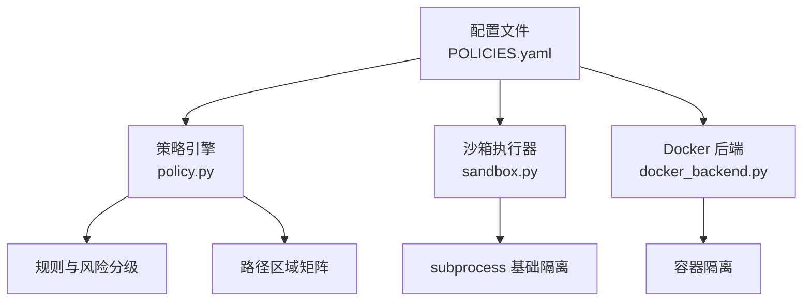
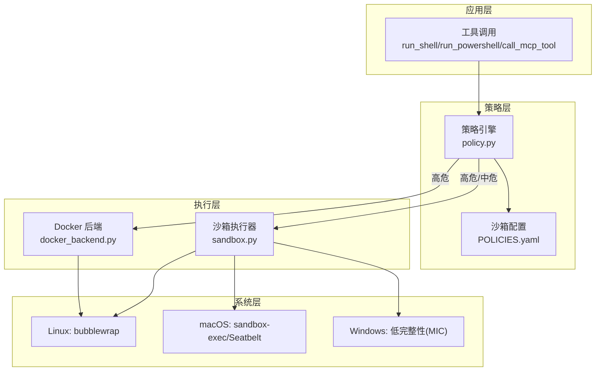
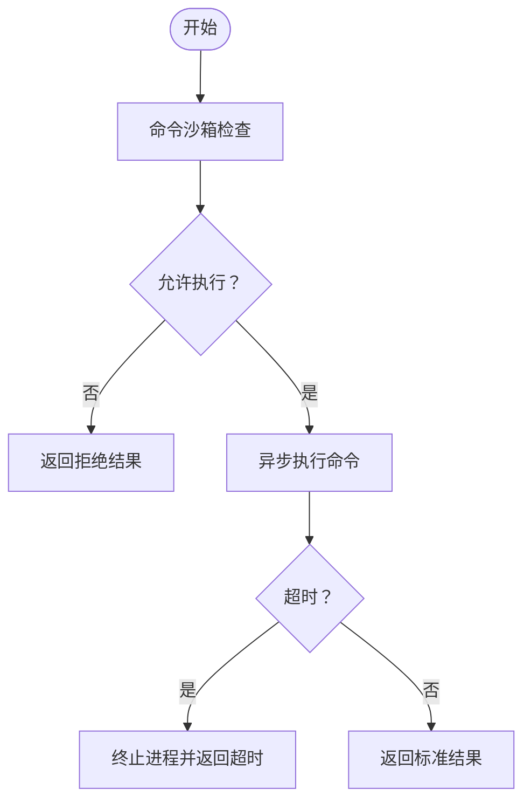
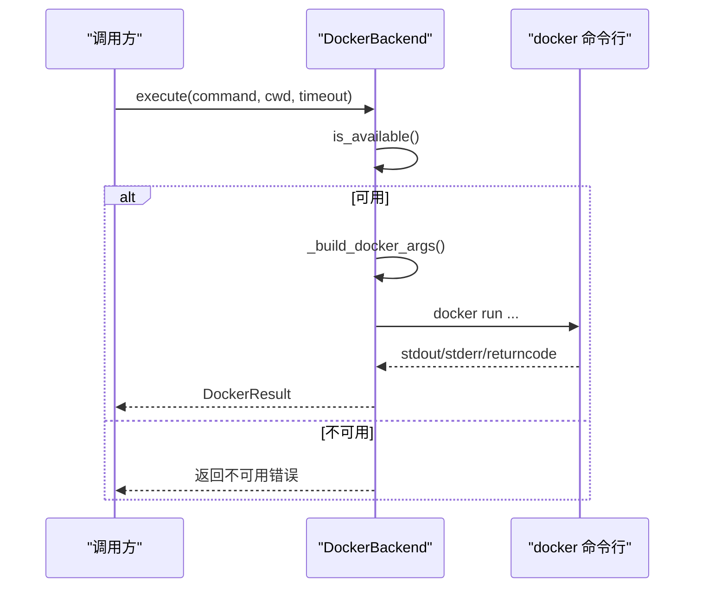
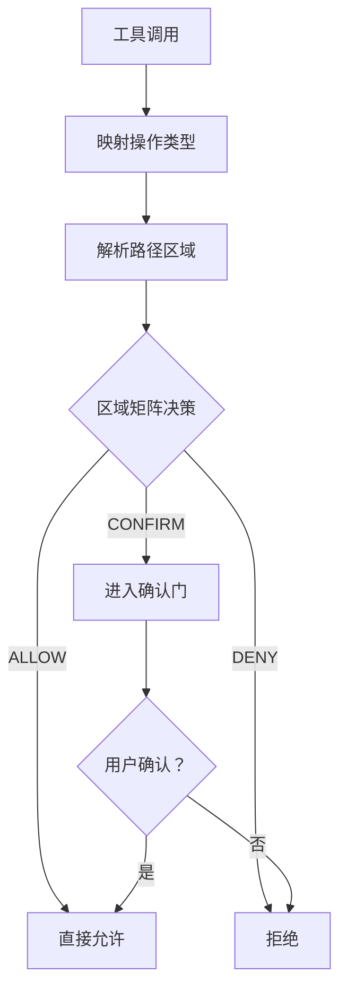
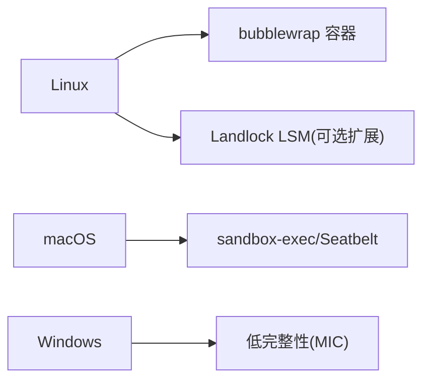
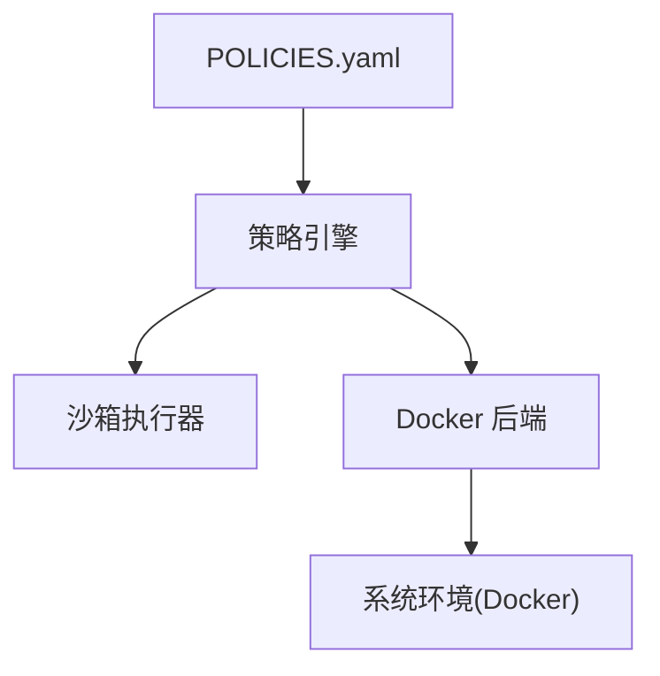

# 操作系统级沙箱

<cite>
**本文档引用的文件**
- [sandbox.py](file://src/synapse/core/sandbox.py)
- [docker_backend.py](file://src/synapse/core/docker_backend.py)
- [policy.py](file://src/synapse/core/policy.py)
- [POLICIES.yaml](file://identity/POLICIES.yaml)
- [README.md](file://README.md)
- [test_security.py](file://tests/unit/test_security.py)
- [report-ai-comprehensive-security-20260403.md](file://tests/e2e/report-ai-comprehensive-security-20260403.md)
- [path_helper.py](file://src/synapse/utils/path_helper.py)
</cite>

## 目录
1. [简介](#简介)
2. [项目结构](#项目结构)
3. [核心组件](#核心组件)
4. [架构总览](#架构总览)
5. [详细组件分析](#详细组件分析)
6. [依赖关系分析](#依赖关系分析)
7. [性能考量](#性能考量)
8. [故障排除指南](#故障排除指南)
9. [结论](#结论)
10. [附录](#附录)

## 简介
本文件面向操作系统级沙箱的实现与运维，聚焦以下目标：
- 对比 Linux、Windows、macOS 三大平台的沙箱实现差异与适用机制
- 深入解析 Docker 容器隔离、Seatbelt 进程限制、Landlock 内核安全模块的应用现状与扩展路径
- 提供平台兼容性、性能开销与配置复杂度的横向对比
- 给出部署指南、最佳实践与故障排除方法
- 明确定义安全边界、逃逸检测与升级路径

## 项目结构
围绕“六层安全”模型，沙箱相关能力主要分布在以下模块：
- 规则引擎与策略：集中策略引擎负责路径分区、命令风险分级与工具策略
- 基础沙箱执行器：基于 subprocess 的轻量隔离与超时控制
- Docker 后端：提供更强隔离与资源限制
- 配置文件：POLICIES.yaml 定义安全域、确认机制、命令模式、自保护与沙箱开关

**图表来源**
- [policy.py:1-200](file://src/synapse/core/policy.py#L1-L200)
- [sandbox.py:1-262](file://src/synapse/core/sandbox.py#L1-L262)
- [docker_backend.py:1-178](file://src/synapse/core/docker_backend.py#L1-L178)
- [POLICIES.yaml:1-81](file://identity/POLICIES.yaml#L1-L81)

**章节来源**
- [README.md:442-474](file://README.md#L442-L474)
- [POLICIES.yaml:1-81](file://identity/POLICIES.yaml#L1-L81)

## 核心组件
- 命令沙箱与执行器
  - 命令沙箱：提供策略校验（命令黑白名单、路径访问限制、危险模式匹配），返回允许/拒绝与原因
  - 执行器：在满足策略的前提下，以异步方式执行命令，并设置超时与错误处理
- Docker 后端
  - 提供容器化执行，具备 capability drop、no-new-privileges、PID 限制、内存限制、tmpfs 等加固选项
- 策略引擎
  - 将工具调用映射为操作类型，结合路径区域矩阵与命令风险模式进行决策
  - 支持“确认门”与“自保护”等机制，防止高危操作直接生效
- 配置中心
  - POLICIES.yaml 统一声明安全域、确认策略、命令模式、自保护、沙箱开关与网络策略

**章节来源**
- [sandbox.py:27-127](file://src/synapse/core/sandbox.py#L27-L127)
- [sandbox.py:186-261](file://src/synapse/core/sandbox.py#L186-L261)
- [docker_backend.py:29-177](file://src/synapse/core/docker_backend.py#L29-L177)
- [policy.py:64-110](file://src/synapse/core/policy.py#L64-L110)
- [policy.py:112-201](file://src/synapse/core/policy.py#L112-L201)
- [POLICIES.yaml:1-81](file://identity/POLICIES.yaml#L1-L81)

## 架构总览
整体安全模型采用“六层纵深防御”，其中操作系统级沙箱位于第六层，作为最终防线：
- L1：路径分区（workspace/controlled/protected/forbidden）
- L2：确认门（危险操作需用户确认）
- L3：命令拦截（阻断高危命令模式）
- L4：文件快照（写入前自动快照，支持回滚）
- L5：自保护（锁定关键目录，死亡开关）
- L6：OS 级沙箱（Linux bwrap、macOS seatbelt、Windows MIC）

**图表来源**
- [README.md:442-474](file://README.md#L442-L474)
- [policy.py:112-201](file://src/synapse/core/policy.py#L112-L201)
- [sandbox.py:186-261](file://src/synapse/core/sandbox.py#L186-L261)
- [docker_backend.py:50-177](file://src/synapse/core/docker_backend.py#L50-L177)

## 详细组件分析

### 命令沙箱与执行器
- 功能要点
  - 策略校验：精确匹配与通配符匹配的命令黑名单；正则匹配危险模式；路径访问限制；可选命令白名单
  - 执行器：异步执行、超时控制、异常捕获、统一结果封装
- 关键数据结构
  - SandboxPolicy：定义允许/拒绝目录、允许/拒绝命令、危险模式正则、最大执行时间、网络许可、可写目录
  - SandboxVerdict：返回允许/拒绝与原因
  - SandboxResult：封装输出、错误、返回码与后端标识
- 执行流程
  - 执行器先调用沙箱检查，若拒绝则直接返回；否则按有效超时创建子进程执行

**图表来源**
- [sandbox.py:90-127](file://src/synapse/core/sandbox.py#L90-L127)
- [sandbox.py:195-250](file://src/synapse/core/sandbox.py#L195-L250)

**章节来源**
- [sandbox.py:27-127](file://src/synapse/core/sandbox.py#L27-L127)
- [sandbox.py:176-261](file://src/synapse/core/sandbox.py#L176-L261)

### Docker 后端
- 功能要点
  - 可用性探测：检测 docker 命令与 docker info
  - 参数构建：capability drop、no-new-privileges、PID 限制、内存限制、tmpfs、网络模式、工作区挂载
  - 执行与回收：超时与异常处理，返回标准化结果
- 关键配置
  - image、network、memory_limit、pids_limit、timeout、workspace_mount、extra_volumes

**图表来源**
- [docker_backend.py:57-177](file://src/synapse/core/docker_backend.py#L57-L177)

**章节来源**
- [docker_backend.py:29-177](file://src/synapse/core/docker_backend.py#L29-L177)

### 策略引擎与安全域
- 路径区域矩阵：根据路径所属区域与操作类型决定允许/拒绝/确认
- 命令风险分级：针对 Windows、macOS、Linux 的通用与平台特有高危模式进行识别
- 自保护与确认门：对高危命令触发确认流程，对关键目录进行保护
- 配置入口：POLICIES.yaml 提供 zones、confirmation、command_patterns、self_protection、sandbox 等配置

**图表来源**
- [policy.py:77-110](file://src/synapse/core/policy.py#L77-L110)
- [POLICIES.yaml:3-38](file://identity/POLICIES.yaml#L3-L38)

**章节来源**
- [policy.py:64-110](file://src/synapse/core/policy.py#L64-L110)
- [policy.py:112-201](file://src/synapse/core/policy.py#L112-L201)
- [POLICIES.yaml:1-81](file://identity/POLICIES.yaml#L1-L81)

### 平台差异与实现现状
- Linux
  - 当前实现：subprocess 基础隔离；可扩展为 bubblewrap（bwrap）容器
  - 配置：POLICIES.yaml 中 sandbox.backend 可设为 auto 或指定后端
- macOS
  - 当前实现：subprocess 基础隔离；可扩展为 sandbox-exec（Seatbelt）系统沙箱
  - 注意：登录 shell PATH 解析用于解决 GUI 应用环境变量问题
- Windows
  - 当前实现：subprocess 基础隔离；可扩展为低完整性（MIC）进程隔离
- Landlock
  - 当前仓库未直接实现，但可在 Linux 后端扩展为内核态 LSM 阶段的访问控制

**图表来源**
- [README.md:459-463](file://README.md#L459-L463)
- [path_helper.py:22-45](file://src/synapse/utils/path_helper.py#L22-L45)

**章节来源**
- [README.md:442-474](file://README.md#L442-L474)
- [path_helper.py:1-150](file://src/synapse/utils/path_helper.py#L1-L150)

## 依赖关系分析
- 模块耦合
  - 策略引擎依赖配置中心（POLICIES.yaml）与工具调用语义
  - 沙箱执行器与 Docker 后端均依赖策略引擎的风险分级结果
  - Docker 后端对系统环境存在外部依赖（docker 命令）
- 外部依赖
  - Docker：docker 命令与守护进程
  - 平台工具：macOS 登录 shell PATH 解析

**图表来源**
- [POLICIES.yaml:1-81](file://identity/POLICIES.yaml#L1-L81)
- [policy.py:682-712](file://src/synapse/core/policy.py#L682-L712)
- [docker_backend.py:57-76](file://src/synapse/core/docker_backend.py#L57-L76)

**章节来源**
- [policy.py:682-712](file://src/synapse/core/policy.py#L682-L712)
- [docker_backend.py:57-76](file://src/synapse/core/docker_backend.py#L57-L76)

## 性能考量
- subprocess 基础隔离
  - 优点：零外部依赖、启动开销低
  - 成本：隔离强度有限，适合低风险命令
- Docker 容器隔离
  - 优点：强隔离、资源限制明确、可重复性好
  - 成本：镜像拉取/构建、容器启动、网络与卷挂载带来额外开销
- Landlock（内核态）
  - 优点：内核级访问控制，进程启动前后即可生效
  - 成本：内核版本要求、策略编写与维护成本较高
- 性能优化建议
  - 优先使用 subprocess 执行低风险命令
  - 高风险命令统一走 Docker 后端
  - 对频繁执行的命令考虑复用容器或镜像缓存
  - 在 Linux 上评估引入 Landlock 以减少用户态开销

[本节为通用指导，无需具体文件分析]

## 故障排除指南
- run_powershell 未受命令拦截
  - 现象：AI 使用 run_powershell 执行 reg 查询，未被拦截
  - 根因：策略引擎仅对 run_shell 进行命令模式拦截与风险分级
  - 修复：扩展工具映射与检查逻辑，覆盖 run_powershell
- Docker 不可用
  - 现象：Docker 后端返回不可用错误
  - 排查：确认 docker 命令存在、docker 服务可达、权限正确
- 超时与异常
  - 现象：执行超时或异常返回
  - 排查：调整超时阈值、检查资源限制、查看容器日志
- macOS PATH 异常
  - 现象：GUI 应用找不到工具
  - 排查：使用登录 shell PATH 解析工具进行回退

**章节来源**
- [report-ai-comprehensive-security-20260403.md:47-79](file://tests/e2e/report-ai-comprehensive-security-20260403.md#L47-L79)
- [docker_backend.py:57-76](file://src/synapse/core/docker_backend.py#L57-L76)
- [path_helper.py:22-45](file://src/synapse/utils/path_helper.py#L22-L45)

## 结论
- 本项目在“六层安全”模型下，提供了从路径分区到 OS 级沙箱的完整能力谱系
- 当前 Linux、macOS、Windows 均以 subprocess 为基础隔离，Linux 可扩展为 bubblewrap，macOS 可扩展为 Seatbelt，Windows 可扩展为 MIC
- Docker 后端提供强隔离与资源限制，适合高风险命令
- Landlock 作为内核级 LSM 的扩展方向，可进一步降低用户态开销并提升安全性
- 建议在生产中优先启用 Docker 后端与确认门，并结合自保护与快照机制形成闭环

[本节为总结，无需具体文件分析]

## 附录

### 平台部署指南与最佳实践
- Linux
  - 安装 bubblewrap 或使用 Docker 后端
  - 在 POLICIES.yaml 中启用 sandbox.backend 为 auto 或指定后端
  - 对高风险命令强制走 Docker 后端
- macOS
  - 确保登录 shell PATH 解析可用，避免 GUI 应用环境缺失
  - 可扩展为 sandbox-exec/Seatbelt 策略文件
- Windows
  - 使用低完整性（MIC）策略，限制进程权限
  - 对高风险命令强制走 Docker 后端

**章节来源**
- [README.md:459-463](file://README.md#L459-L463)
- [POLICIES.yaml:69-77](file://identity/POLICIES.yaml#L69-L77)
- [path_helper.py:22-45](file://src/synapse/utils/path_helper.py#L22-L45)

### 安全边界与逃逸检测
- 边界定义
  - L1-L5 为应用与系统层边界；L6（OS 级沙箱）为最终边界
- 逃逸检测
  - 通过审计日志与策略决策记录追踪异常行为
  - 对未覆盖工具（如 run_powershell）进行补丁与回归测试
- 升级路径
  - 逐步引入 Docker 后端与 Landlock（Linux）
  - 完善平台特定沙箱策略（macOS Seatbelt、Windows MIC）
  - 强化确认门与自保护阈值

**章节来源**
- [README.md:442-474](file://README.md#L442-L474)
- [report-ai-comprehensive-security-20260403.md:60-74](file://tests/e2e/report-ai-comprehensive-security-20260403.md#L60-L74)