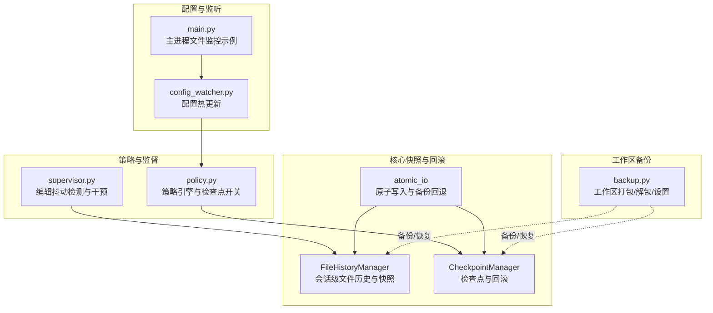
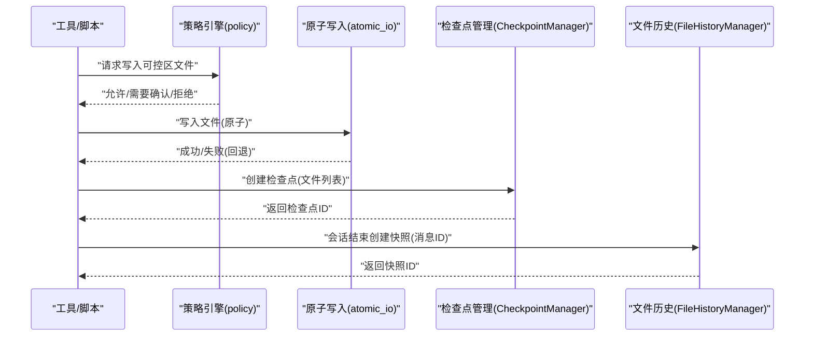
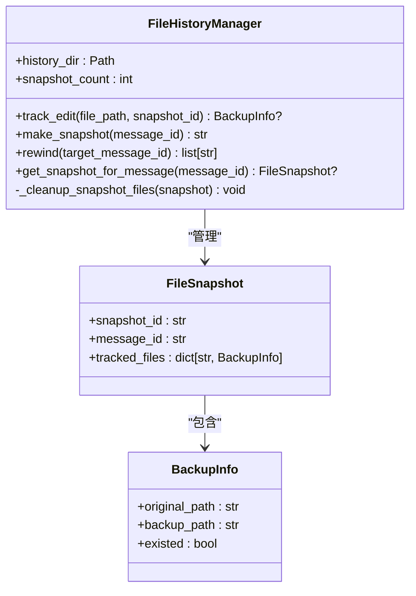
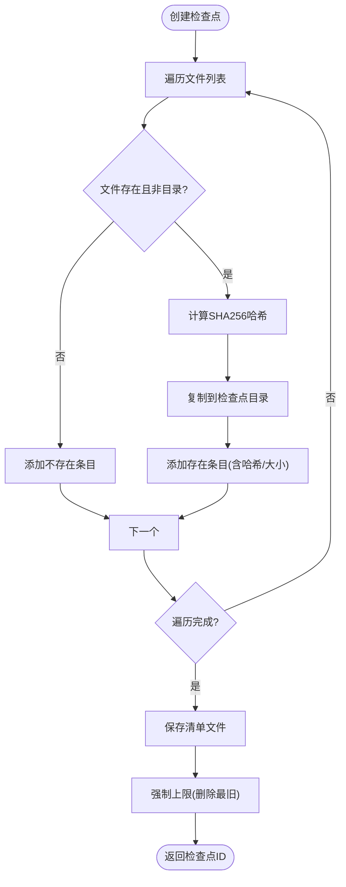
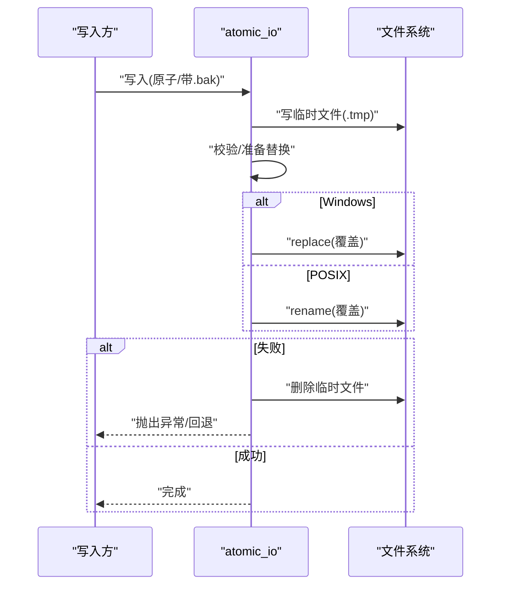
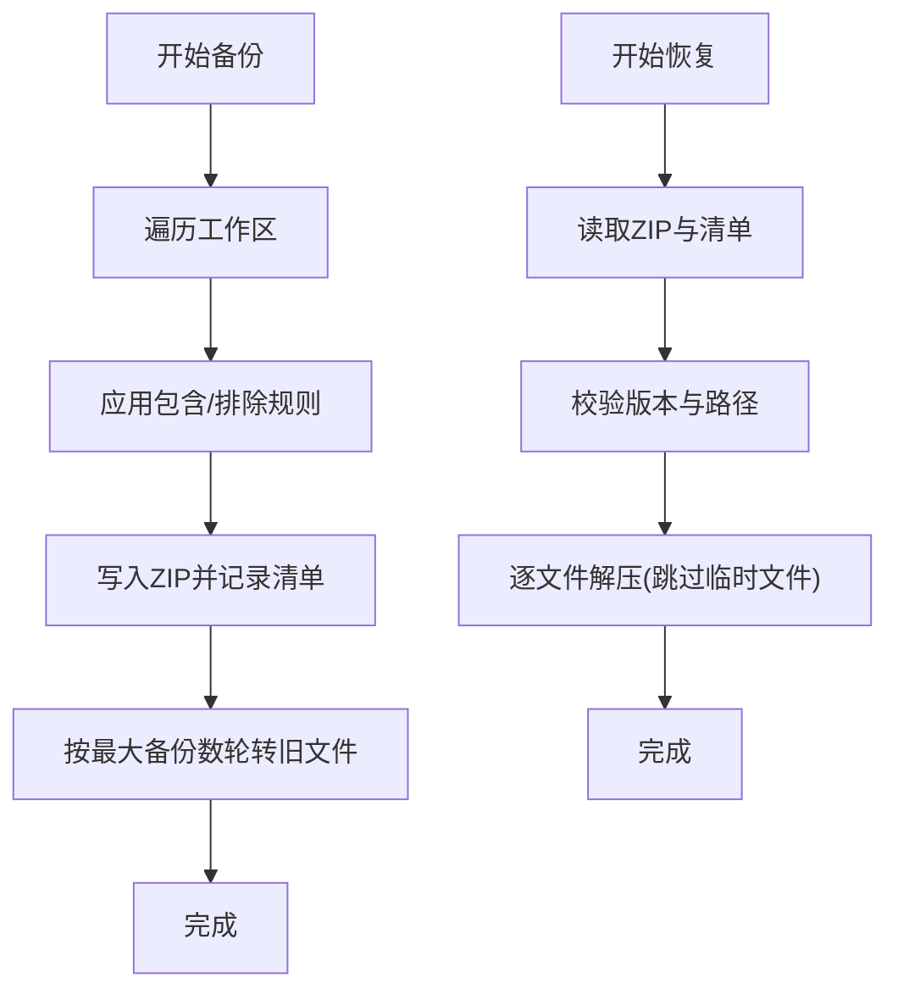
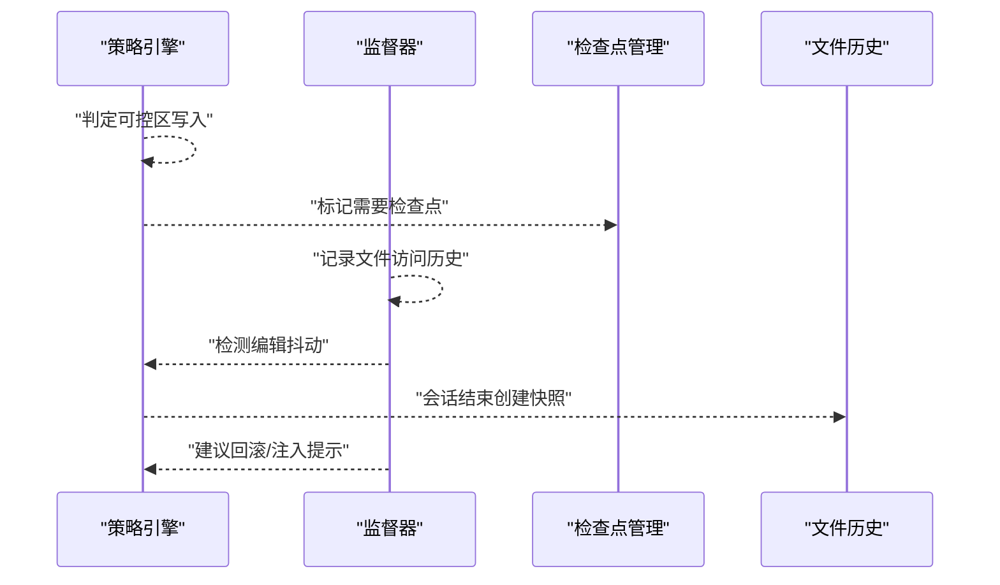
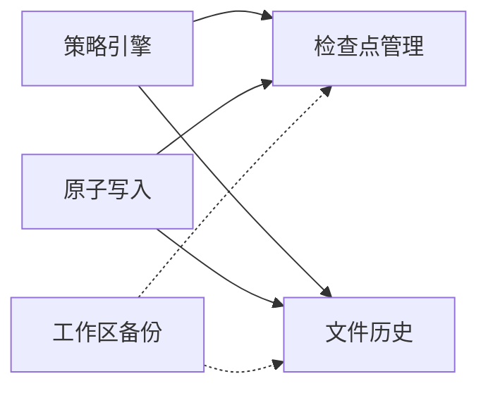

# 文件快照与回滚

<cite>
**本文引用的文件**
- [file_history.py](file://src/synapse/core/file_history.py)
- [checkpoint.py](file://src/synapse/core/checkpoint.py)
- [atomic_io.py](file://src/synapse/utils/atomic_io.py)
- [backup.py](file://src/synapse/workspace/backup.py)
- [policy.py](file://src/synapse/core/policy.py)
- [supervisor.py](file://src/synapse/core/supervisor.py)
- [config_watcher.py](file://src/synapse/core/config_watcher.py)
- [main.py](file://src/synapse/main.py)
</cite>

## 目录
1. [简介](#简介)
2. [项目结构](#项目结构)
3. [核心组件](#核心组件)
4. [架构总览](#架构总览)
5. [详细组件分析](#详细组件分析)
6. [依赖关系分析](#依赖关系分析)
7. [性能考量](#性能考量)
8. [故障排查指南](#故障排查指南)
9. [结论](#结论)
10. [附录](#附录)

## 简介
本文件面向“文件快照与回滚”子系统，系统性阐述以下方面：
- 快照创建时机与触发条件：包括可控区文件修改前的自动快照、会话级文件历史快照、以及工作区整体备份。
- 存储机制与版本管理：快照目录布局、清单文件、最大数量限制与清理策略。
- 版本管理策略：按消息 ID 的批量回滚、按检查点 ID 的精确回滚。
- 变更检测与原子写入：文件写入采用原子写入与备份回退策略，降低崩溃与权限问题带来的数据损坏风险。
- 回滚触发条件：策略引擎判定、编辑抖动检测、异常干预等场景下的回滚触发。
- 数据结构与复杂度：快照条目、清单、历史快照链的数据结构与时间/空间复杂度。
- 增量备份与存储优化：当前实现以全量备份为主，结合清单与清理策略进行容量控制。
- 配置项与性能影响：可配置的快照目录、最大快照数、备份设置等。
- 恢复流程指导：从检查点回滚、从会话历史回滚、从工作区备份恢复。
- 一致性保证、并发控制与异常处理：原子写入、文件锁、轮询监听、错误日志与回退。

## 项目结构
围绕文件快照与回滚的关键模块如下：
- 核心快照与回滚
  - 会话级文件历史与快照：[file_history.py](file://src/synapse/core/file_history.py)
  - 工具/可控区文件检查点：[checkpoint.py](file://src/synapse/core/checkpoint.py)
  - 原子写入与备份回退：[atomic_io.py](file://src/synapse/utils/atomic_io.py)
- 工作区备份与恢复
  - 备份与恢复工具：[backup.py](file://src/synapse/workspace/backup.py)
- 安全策略与监督
  - 策略引擎与检查点开关：[policy.py](file://src/synapse/core/policy.py)
  - 运行时监督与编辑抖动检测：[supervisor.py](file://src/synapse/core/supervisor.py)
- 配置与文件监听
  - 配置热更新与文件监听：[config_watcher.py](file://src/synapse/core/config_watcher.py)
  - 主进程文件监控示例：[main.py](file://src/synapse/main.py)

图表来源
- [file_history.py:1-210](file://src/synapse/core/file_history.py#L1-L210)
- [checkpoint.py:1-258](file://src/synapse/core/checkpoint.py#L1-L258)
- [atomic_io.py:1-155](file://src/synapse/utils/atomic_io.py#L1-L155)
- [backup.py:1-405](file://src/synapse/workspace/backup.py#L1-L405)
- [policy.py:924-959](file://src/synapse/core/policy.py#L924-L959)
- [supervisor.py:467-497](file://src/synapse/core/supervisor.py#L467-L497)
- [config_watcher.py:1-88](file://src/synapse/core/config_watcher.py#L1-L88)
- [main.py:2128-2159](file://src/synapse/main.py#L2128-L2159)

章节来源
- [file_history.py:1-210](file://src/synapse/core/file_history.py#L1-L210)
- [checkpoint.py:1-258](file://src/synapse/core/checkpoint.py#L1-L258)
- [atomic_io.py:1-155](file://src/synapse/utils/atomic_io.py#L1-L155)
- [backup.py:1-405](file://src/synapse/workspace/backup.py#L1-L405)
- [policy.py:924-959](file://src/synapse/core/policy.py#L924-L959)
- [supervisor.py:467-497](file://src/synapse/core/supervisor.py#L467-L497)
- [config_watcher.py:1-88](file://src/synapse/core/config_watcher.py#L1-L88)
- [main.py:2128-2159](file://src/synapse/main.py#L2128-L2159)

## 核心组件
- 会话级文件历史与快照（FileHistoryManager）
  - 功能：在文件编辑前按会话目录备份，每轮对话结束创建快照点，支持按消息 ID 批量回滚。
  - 关键点：同一快照内同文件仅备份一次；最多保留固定数量快照，超出则清理最早快照关联的备份文件。
- 工具/可控区文件检查点（CheckpointManager）
  - 功能：在可控区文件修改前自动创建检查点，记录文件哈希、大小、存在性等元信息，支持按检查点 ID 回滚。
  - 关键点：清单文件维护检查点列表；达到上限后删除最旧检查点目录与清单项。
- 原子写入与备份回退（atomic_io）
  - 功能：提供 JSON/文本原子写入（临时文件+替换），失败时清理临时文件；支持 .bak 备份与读取回退。
  - 关键点：Windows 下通过 replace 实现覆盖；PermissionError 重试与降级写入。
- 工作区备份与恢复（backup）
  - 功能：按规则打包工作区为 zip，支持设置 include_userdata/include_media 等；恢复时校验清单与路径安全性。
  - 关键点：内置包含/排除规则、SQLite 临时文件跳过、备份轮转。
- 策略引擎与监督（policy/supervisor）
  - 功能：策略引擎决定是否需要检查点；监督器检测编辑抖动并建议回滚或注入提示。
  - 关键点：可控区编辑/覆写在启用检查点时触发；编辑抖动阈值可配置。

章节来源
- [file_history.py:43-210](file://src/synapse/core/file_history.py#L43-L210)
- [checkpoint.py:48-258](file://src/synapse/core/checkpoint.py#L48-L258)
- [atomic_io.py:18-155](file://src/synapse/utils/atomic_io.py#L18-L155)
- [backup.py:1-405](file://src/synapse/workspace/backup.py#L1-L405)
- [policy.py:924-959](file://src/synapse/core/policy.py#L924-L959)
- [supervisor.py:467-497](file://src/synapse/core/supervisor.py#L467-L497)

## 架构总览
文件快照与回滚系统由“写入路径”和“回滚路径”两条主线构成：
- 写入路径：策略引擎判定→可控区写入→原子写入→检查点创建→清单更新。
- 回滚路径：用户/系统触发→定位目标检查点/快照→逐文件恢复→清理后续快照/检查点。

图表来源
- [policy.py:924-959](file://src/synapse/core/policy.py#L924-L959)
- [atomic_io.py:18-106](file://src/synapse/utils/atomic_io.py#L18-L106)
- [checkpoint.py:102-177](file://src/synapse/core/checkpoint.py#L102-L177)
- [file_history.py:108-141](file://src/synapse/core/file_history.py#L108-L141)

## 详细组件分析

### 会话级文件历史与快照（FileHistoryManager）
- 数据结构
  - BackupInfo：记录原始路径、备份路径、是否存在。
  - FileSnapshot：包含快照 ID、消息 ID、跟踪的文件映射。
- 创建时机
  - 文件编辑前：track_edit 将文件复制到 data/file-history/{session_id}/，避免重复备份。
  - 会话结束：make_snapshot 将当前跟踪集合固化为快照，并清理超出上限的历史备份文件。
- 回滚策略
  - rewind 按消息 ID 查找目标快照，逆序恢复其后的所有快照中的文件，最后裁剪快照列表。
- 存储与清理
  - 最大快照数限制；超过上限时删除最早快照对应的备份文件并移除该快照。
- 并发与一致性
  - 同一快照内同一文件仅备份一次；回滚过程按逆序恢复，避免中间态破坏。

图表来源
- [file_history.py:25-210](file://src/synapse/core/file_history.py#L25-L210)

章节来源
- [file_history.py:43-210](file://src/synapse/core/file_history.py#L43-L210)

### 工具/可控区文件检查点（CheckpointManager）
- 数据结构
  - CheckpointEntry：记录原始路径、备份路径、文件哈希、大小、是否存在。
  - Checkpoint：包含检查点 ID、时间戳、工具名、描述、条目列表。
- 创建流程
  - 遍历文件列表：若文件存在且非目录，则计算哈希、生成备份文件名、复制到检查点目录。
  - 若全部失败则删除空目录并返回 None。
  - 写入清单文件，限制最大数量，删除最旧检查点目录与清单项。
- 回滚流程
  - 按检查点 ID 定位；对不存在的文件尝试删除目标路径；对存在的文件从备份复制回原路径。
- 性能与复杂度
  - 创建：O(n) 文件遍历，每个文件 O(1) 哈希与复制，整体 O(n)。
  - 回滚：O(m) 条目遍历，整体 O(m)。
  - 清理：O(k) 删除最旧目录，k 为超出上限数量。

图表来源
- [checkpoint.py:102-177](file://src/synapse/core/checkpoint.py#L102-L177)
- [checkpoint.py:230-238](file://src/synapse/core/checkpoint.py#L230-L238)

章节来源
- [checkpoint.py:48-258](file://src/synapse/core/checkpoint.py#L48-L258)

### 原子写入与备份回退（atomic_io）
- 原子写入（JSON/文本）
  - 临时文件写入→校验通过→替换目标文件；失败清理临时文件。
  - Windows 使用 replace 替代 rename，避免覆盖已存在文件。
- 备份与回退
  - 写前可选备份 .bak；读取失败时回退到 .bak 并恢复主文件。
- 错误处理
  - PermissionError 重试与降级写入；日志记录失败原因。

图表来源
- [atomic_io.py:18-106](file://src/synapse/utils/atomic_io.py#L18-L106)
- [atomic_io.py:121-155](file://src/synapse/utils/atomic_io.py#L121-L155)

章节来源
- [atomic_io.py:1-155](file://src/synapse/utils/atomic_io.py#L1-L155)

### 工作区备份与恢复（backup）
- 备份
  - 遍历工作区，按包含/排除规则筛选；写入 zip 并生成清单；按最大数量轮转旧备份。
- 恢复
  - 校验清单版本与路径安全性；跳过 SQLite 临时文件；逐文件解压并记录跳过项。
- 设置
  - 支持启用开关、定时计划、备份路径、最大备份数、是否包含用户数据/媒体等。

图表来源
- [backup.py:204-273](file://src/synapse/workspace/backup.py#L204-L273)
- [backup.py:295-366](file://src/synapse/workspace/backup.py#L295-L366)
- [backup.py:119-139](file://src/synapse/workspace/backup.py#L119-L139)

章节来源
- [backup.py:1-405](file://src/synapse/workspace/backup.py#L1-L405)

### 策略引擎与监督（policy/supervisor）
- 策略引擎
  - 控制区编辑/覆写在启用检查点时标记“需要检查点”，用于后续自动创建。
- 监督器
  - 检测编辑抖动（同一文件反复读写），达到阈值时建议回滚并注入提示。

图表来源
- [policy.py:924-959](file://src/synapse/core/policy.py#L924-L959)
- [supervisor.py:467-497](file://src/synapse/core/supervisor.py#L467-L497)
- [file_history.py:108-141](file://src/synapse/core/file_history.py#L108-L141)

章节来源
- [policy.py:924-959](file://src/synapse/core/policy.py#L924-L959)
- [supervisor.py:467-497](file://src/synapse/core/supervisor.py#L467-L497)

## 依赖关系分析
- 组件耦合
  - CheckpointManager 依赖策略引擎配置（可选）以决定快照目录与上限。
  - FileHistoryManager 与 CheckpointManager 分别独立管理各自存储，互不依赖。
  - atomic_io 为通用工具，被策略/写入路径复用。
  - backup 与快照系统互补：工作区级全量备份，快照系统针对可控区文件与会话历史。
- 外部依赖
  - 文件系统操作（复制/删除/重命名）、JSON 序列化、哈希计算。
  - 日志记录与异常捕获。

图表来源
- [checkpoint.py:244-257](file://src/synapse/core/checkpoint.py#L244-L257)
- [policy.py:924-959](file://src/synapse/core/policy.py#L924-L959)
- [atomic_io.py:18-106](file://src/synapse/utils/atomic_io.py#L18-L106)
- [backup.py:1-405](file://src/synapse/workspace/backup.py#L1-L405)

章节来源
- [checkpoint.py:244-257](file://src/synapse/core/checkpoint.py#L244-L257)
- [policy.py:924-959](file://src/synapse/core/policy.py#L924-L959)
- [atomic_io.py:1-155](file://src/synapse/utils/atomic_io.py#L1-L155)
- [backup.py:1-405](file://src/synapse/workspace/backup.py#L1-L405)

## 性能考量
- 时间复杂度
  - 检查点创建：O(n)，n 为文件数；哈希计算为 O(size)。
  - 检查点回滚：O(m)，m 为条目数。
  - 文件历史快照：O(k)，k 为当前快照内文件数；回滚时逆序恢复 O(k)。
- 空间复杂度
  - 检查点：每个文件复制一份备份，空间约为 Σ(size)；清单 JSON 占用较小。
  - 文件历史：每个文件仅备份一次，空间约为 Σ(size)。
  - 备份：zip 包含选择性文件，受 include_userdata/include_media 影响。
- 优化建议
  - 增量备份：当前未实现，可在 Checkpoint 中引入差异哈希/块级去重。
  - 并行写入：在原子写入阶段对不同文件并行复制，注意替换顺序与冲突。
  - 压缩与去重：对重复内容进行去重与压缩，减少磁盘占用。
  - 清理策略：定期清理旧快照与备份，避免无限增长。

## 故障排查指南
- 检查点创建失败
  - 症状：返回 None 或日志警告。
  - 排查：确认文件存在且非目录；检查磁盘空间与权限；查看哈希计算与复制异常。
- 回滚失败
  - 症状：部分文件未恢复或报错。
  - 排查：确认备份文件存在；检查目标路径权限；Windows 下确认无占用导致替换失败。
- 原子写入失败
  - 症状：临时文件残留或写入中断。
  - 排查：查看 PermissionError 重试次数；必要时禁用原子写入降级为普通写入。
- 文件历史回滚不完整
  - 症状：部分文件未恢复。
  - 排查：确认目标消息 ID 存在；检查回滚范围内的快照是否被清理；查看日志警告。
- 备份/恢复异常
  - 症状：备份缺失清单、恢复跳过文件、版本不兼容。
  - 排查：确认清单存在且格式正确；检查路径安全性与 SQLite 临时文件跳过；核对备份轮转策略。

章节来源
- [checkpoint.py:154-162](file://src/synapse/core/checkpoint.py#L154-L162)
- [checkpoint.py:209-215](file://src/synapse/core/checkpoint.py#L209-L215)
- [atomic_io.py:82-97](file://src/synapse/utils/atomic_io.py#L82-L97)
- [file_history.py:160-191](file://src/synapse/core/file_history.py#L160-L191)
- [backup.py:306-366](file://src/synapse/workspace/backup.py#L306-L366)

## 结论
本系统通过“可控区文件检查点 + 会话级文件历史 + 工作区备份”的三层保障，实现了对关键文件的可靠快照与回滚能力。配合原子写入与策略/监督机制，显著降低了写入风险与异常行为的影响。未来可在增量备份、并行处理与压缩去重等方面进一步优化，以提升性能与存储效率。

## 附录

### 快照配置选项
- 检查点管理（CheckpointManager）
  - 快照目录：data/checkpoints（可通过策略引擎配置覆盖）
  - 最大快照数：默认 50（可通过策略引擎配置覆盖）
- 文件历史（FileHistoryManager）
  - 最大快照数：默认 100
  - 历史目录：data/file-history/{session_id}
- 工作区备份（backup）
  - 启用开关、定时计划、备份路径、最大备份数
  - include_userdata、include_media 开关
  - 内置包含/排除规则

章节来源
- [checkpoint.py:51-59](file://src/synapse/core/checkpoint.py#L51-L59)
- [checkpoint.py:244-257](file://src/synapse/core/checkpoint.py#L244-L257)
- [file_history.py:21-22](file://src/synapse/core/file_history.py#L21-L22)
- [backup.py:29-36](file://src/synapse/workspace/backup.py#L29-L36)
- [backup.py:119-139](file://src/synapse/workspace/backup.py#L119-L139)

### 回滚触发条件
- 策略引擎判定：可控区编辑/覆写在启用检查点时触发检查点创建。
- 监督器干预：检测到编辑抖动达到阈值时建议回滚。
- 用户/管理员手动触发：通过检查点 ID 或消息 ID 回滚。

章节来源
- [policy.py:924-959](file://src/synapse/core/policy.py#L924-L959)
- [supervisor.py:467-497](file://src/synapse/core/supervisor.py#L467-L497)
- [file_history.py:143-192](file://src/synapse/core/file_history.py#L143-L192)
- [checkpoint.py:179-215](file://src/synapse/core/checkpoint.py#L179-L215)

### 恢复流程指导
- 从检查点回滚
  - 获取检查点 ID → 调用回滚接口 → 等待日志确认恢复数量。
- 从会话历史回滚
  - 获取目标消息 ID → 调用回滚接口 → 等待日志确认恢复文件列表。
- 从工作区备份恢复
  - 选择备份文件 → 调用恢复接口 → 查看返回的统计信息与跳过文件列表。

章节来源
- [checkpoint.py:179-215](file://src/synapse/core/checkpoint.py#L179-L215)
- [file_history.py:143-192](file://src/synapse/core/file_history.py#L143-L192)
- [backup.py:295-366](file://src/synapse/workspace/backup.py#L295-L366)