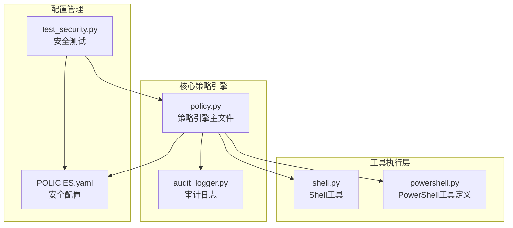
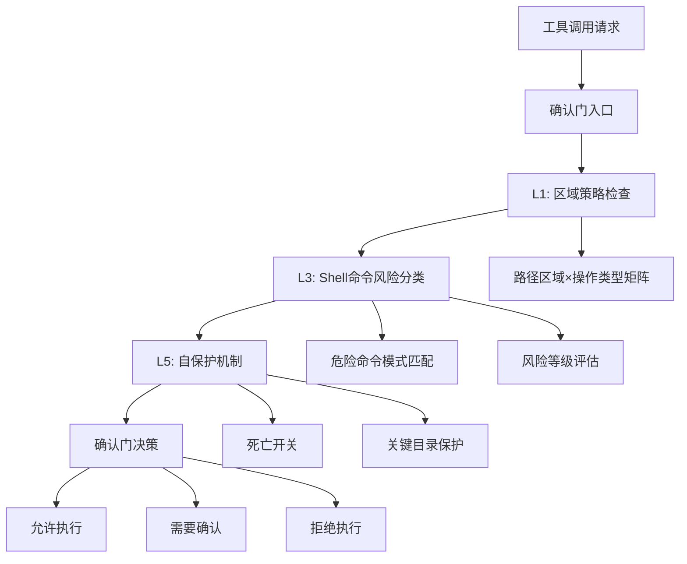
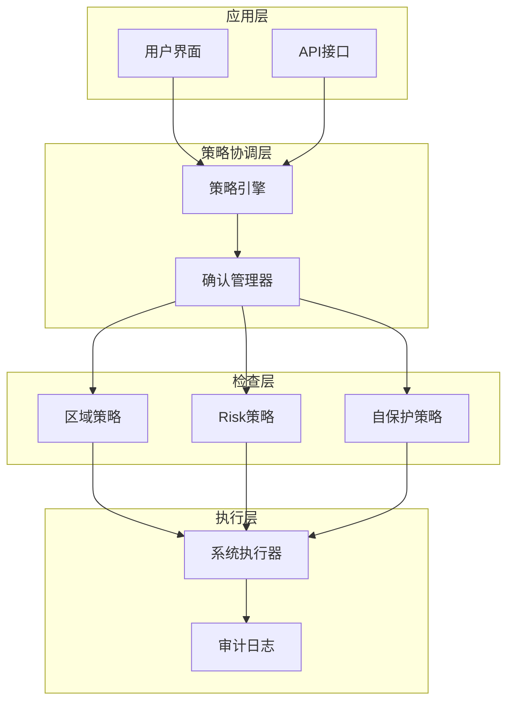
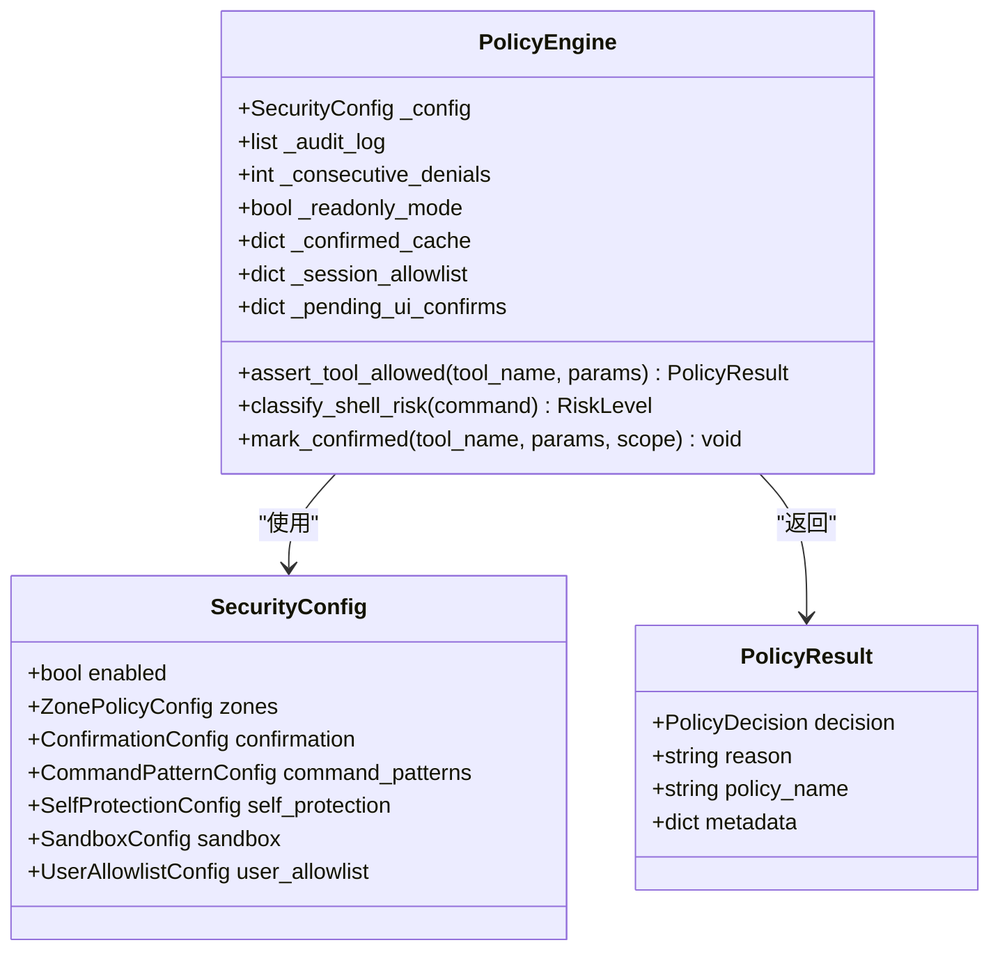
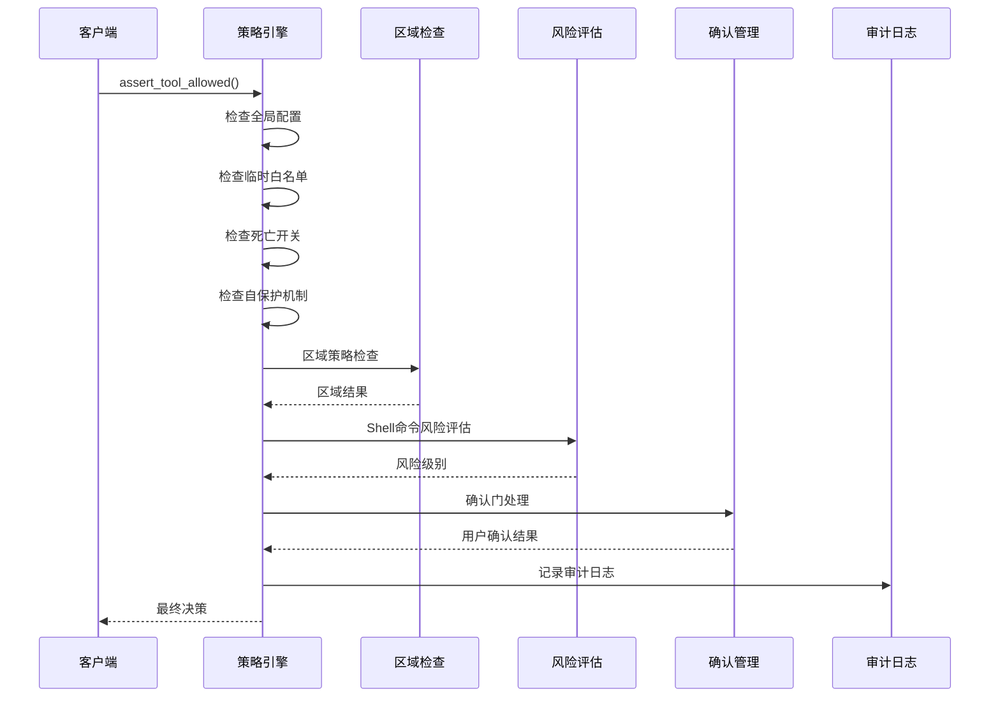
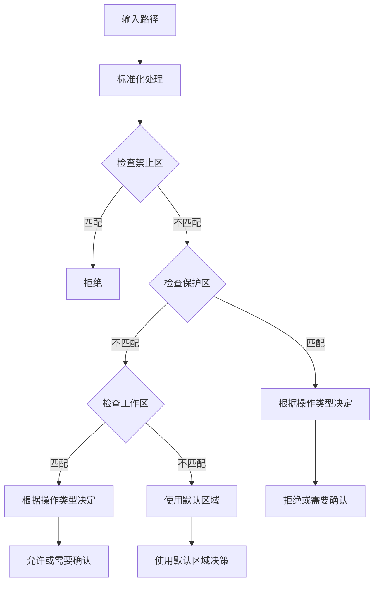
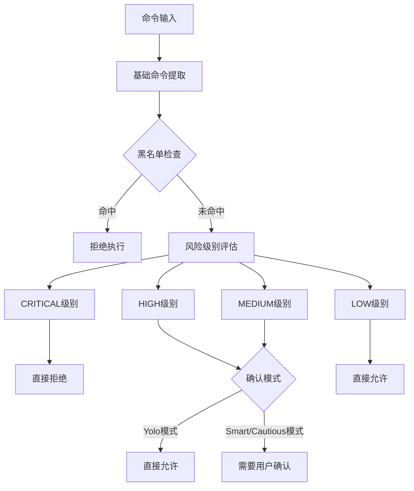
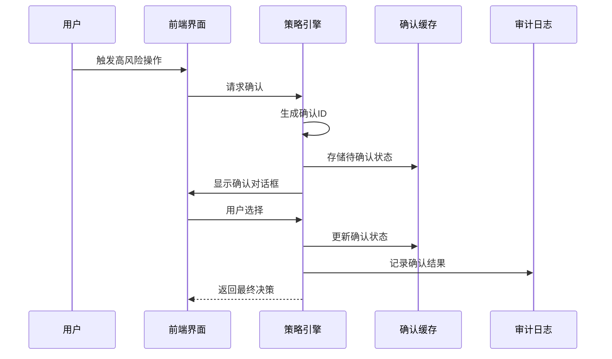
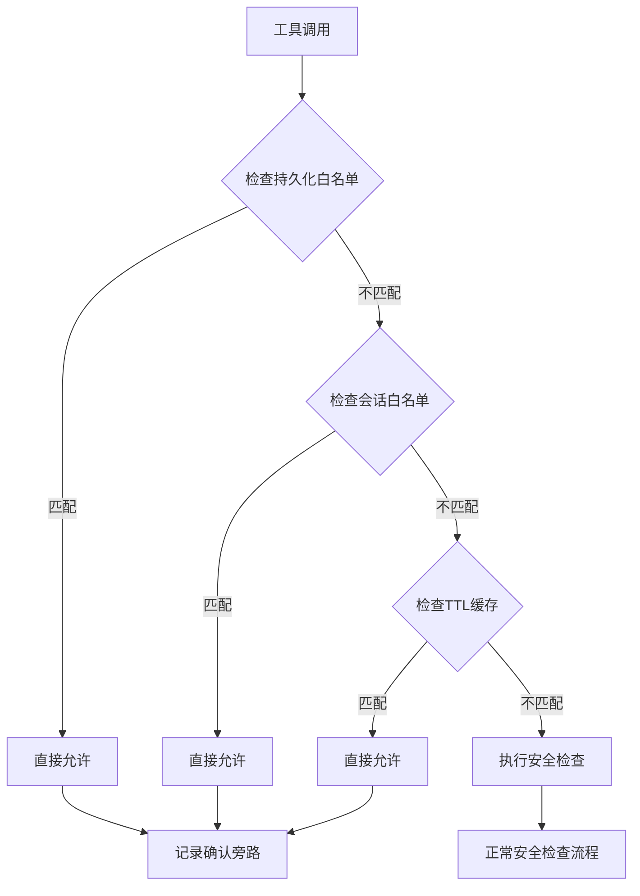
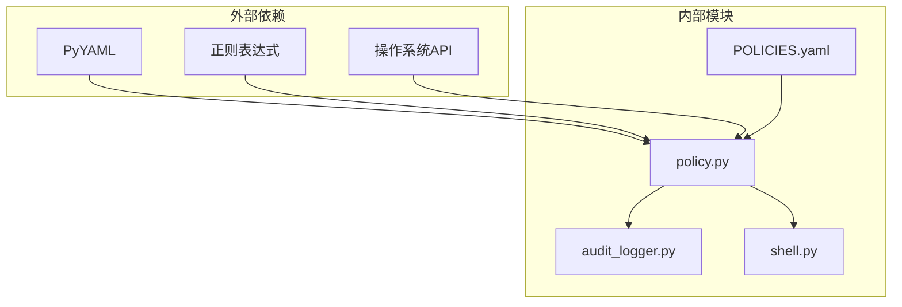

# 确认门安全策略

<cite>
**本文档引用的文件**
- [policy.py](file://src/synapse/core/policy.py)
- [shell.py](file://src/synapse/tools/shell.py)
- [audit_logger.py](file://src/synapse/core/audit_logger.py)
- [POLICIES.yaml](file://identity/POLICIES.yaml)
- [test_security.py](file://tests/unit/test_security.py)
- [powershell.py](file://src/synapse/tools/definitions/powershell.py)
</cite>

## 目录
1. [简介](#简介)
2. [项目结构](#项目结构)
3. [核心组件](#核心组件)
4. [架构概览](#架构概览)
5. [详细组件分析](#详细组件分析)
6. [依赖关系分析](#依赖关系分析)
7. [性能考虑](#性能考虑)
8. [故障排除指南](#故障排除指南)
9. [结论](#结论)
10. [附录](#附录)

## 简介

确认门安全策略是 OpenAkita 平台六层安全防护体系中的核心组件，负责在工具执行前进行多层次的安全检查和风险评估。该策略系统采用"确认门"机制，通过严格的命令执行前安全检查、策略评估算法和风险等级判定，确保系统安全性和可控性。

系统主要功能包括：
- 命令执行前的安全检查流程
- 多层次策略评估算法
- 动态风险等级判定
- 白名单/黑名单机制
- 正则表达式模式匹配
- 系统调用拦截
- 恶意模式检测
- 审计日志记录

## 项目结构

确认门安全策略涉及以下关键文件和模块：



**图表来源**
- [policy.py:1-1569](file://src/synapse/core/policy.py#L1-L1569)
- [shell.py:1-617](file://src/synapse/tools/shell.py#L1-L617)
- [audit_logger.py:1-111](file://src/synapse/core/audit_logger.py#L1-L111)

**章节来源**
- [policy.py:1-1569](file://src/synapse/core/policy.py#L1-L1569)
- [POLICIES.yaml:1-81](file://identity/POLICIES.yaml#L1-L81)

## 核心组件

确认门安全策略由六个核心层次组成，形成完整的安全防护体系：

### 层级架构



**图表来源**
- [policy.py:759-854](file://src/synapse/core/policy.py#L759-L854)

### 主要组件功能

1. **策略引擎核心**：负责整体策略协调和决策
2. **区域策略层**：基于路径区域的访问控制
3. **Shell命令风险层**：危险命令识别和风险评估
4. **自保护层**：防止系统自我破坏
5. **确认门机制**：用户交互确认流程
6. **审计日志层**：完整的安全事件记录

**章节来源**
- [policy.py:526-553](file://src/synapse/core/policy.py#L526-L553)

## 架构概览

确认门安全策略采用分层设计，每层都有明确的职责和边界：



**图表来源**
- [policy.py:759-854](file://src/synapse/core/policy.py#L759-L854)
- [audit_logger.py:54-111](file://src/synapse/core/audit_logger.py#L54-L111)

## 详细组件分析

### 策略引擎核心

策略引擎是确认门的核心，负责协调各个安全检查模块：

#### 数据结构设计



**图表来源**
- [policy.py:526-553](file://src/synapse/core/policy.py#L526-L553)
- [policy.py:381-394](file://src/synapse/core/policy.py#L381-L394)
- [policy.py:268-276](file://src/synapse/core/policy.py#L268-L276)

#### 核心决策流程



**图表来源**
- [policy.py:759-854](file://src/synapse/core/policy.py#L759-L854)
- [policy.py:1014-1100](file://src/synapse/core/policy.py#L1014-L1100)

**章节来源**
- [policy.py:526-854](file://src/synapse/core/policy.py#L526-L854)

### 区域策略系统

区域策略基于四区模型（工作区、受控区、保护区、禁止区）和操作类型矩阵：

#### 区域矩阵设计

| 操作类型 | 工作区 | 受控区 | 保护区 | 禁止区 |
|---------|--------|--------|--------|--------|
| 读取 | 允许 | 允许 | 允许 | 拒绝 |
| 创建 | 允许 | 允许 | 拒绝 | 拒绝 |
| 编辑 | 允许 | 允许 | 拒绝 | 拒绝 |
| 覆盖写入 | 允许 | 需确认 | 拒绝 | 拒绝 |
| 删除 | 需确认 | 需确认 | 拒绝 | 拒绝 |
| 批量删除 | 需确认 | 拒绝 | 拒绝 | 拒绝 |

#### 路径匹配算法



**图表来源**
- [policy.py:888-972](file://src/synapse/core/policy.py#L888-L972)

**章节来源**
- [policy.py:77-110](file://src/synapse/core/policy.py#L77-L110)
- [policy.py:888-972](file://src/synapse/core/policy.py#L888-L972)

### Shell命令风险评估

系统采用三层风险评估机制，针对不同平台提供专门的危险命令识别：

#### 危险模式识别



**图表来源**
- [policy.py:1014-1100](file://src/synapse/core/policy.py#L1014-L1100)

#### 平台特定模式

系统为不同操作系统维护专门的危险命令模式：

**Windows平台**：
- 系统分区格式化：`format\s+[a-zA-Z]:`
- 磁盘管理工具：`\bdiskpart\b`, `\bbcdedit\b`
- 注册表编辑：`\bregedit\b`

**Linux/macOS平台**：
- 系统根目录删除：`rm\s+-rf\s+/\s`, `rm\s+-rf\s+/\*`
- 权限修改：`chmod\s+-R\s+000\s+/`, `chown\s+-R\s+.*\s+/\s`
- 包管理器卸载：`apt\s+(remove|purge)`, `yum\s+(remove|erase)`

**跨平台模式**：
- 进程管理：`kill\s+`, `pkill\s+`
- 网络操作：`ssh\s+`, `curl\s+.*\|\s*(bash|sh)`
- 文件操作：`rm\s+-rf\s+`, `find\s+.*-delete`

**章节来源**
- [policy.py:116-214](file://src/synapse/core/policy.py#L116-L214)
- [policy.py:976-1012](file://src/synapse/core/policy.py#L976-L1012)

### 确认门机制

确认门提供三种确认模式，支持灵活的安全控制：

#### 确认模式对比

| 模式 | 描述 | 高风险处理 | 中风险处理 | 适用场景 |
|------|------|------------|------------|----------|
| Yolo模式 | 放松模式，自动允许高风险命令 | 直接允许 | 直接允许 | 开发环境、信任环境 |
| Smart模式 | 智能模式，后台自动处理中风险 | 需确认 | 自动允许 | 生产环境推荐 |
| Cautious模式 | 严格模式，需要用户确认 | 需确认 | 需确认 | 高风险环境 |

#### 确认流程



**图表来源**
- [policy.py:1406-1481](file://src/synapse/core/policy.py#L1406-L1481)

**章节来源**
- [policy.py:291-300](file://src/synapse/core/policy.py#L291-L300)
- [policy.py:1406-1481](file://src/synapse/core/policy.py#L1406-L1481)

### 白名单/黑名单机制

系统提供多层级的白名单和黑名单管理：

#### 允许列表层级



**图表来源**
- [policy.py:1364-1404](file://src/synapse/core/policy.py#L1364-L1404)

#### 持久化白名单存储

白名单条目支持两种类型：
- **命令模式**：使用通配符模式匹配命令
- **工具名称**：针对特定工具的永久授权

**章节来源**
- [policy.py:1343-1362](file://src/synapse/core/policy.py#L1343-L1362)
- [policy.py:1273-1301](file://src/synapse/core/policy.py#L1273-L1301)

### 审计日志系统

完整的审计日志系统确保所有安全决策都有据可查：

#### 审计日志结构

```mermaid
erDiagram
AUDIT_ENTRY {
timestamp float 时间戳
tool string 工具名称
decision string 决策结果
reason string 拒绝原因
policy string 策略名称
params string 参数摘要
meta json 元数据
}
POLICY_RESULT ||--|| AUDIT_ENTRY : "记录"
TOOL_CALL }|--|| AUDIT_ENTRY : "关联"
```

**图表来源**
- [audit_logger.py:61-84](file://src/synapse/core/audit_logger.py#L61-L84)

**章节来源**
- [audit_logger.py:54-111](file://src/synapse/core/audit_logger.py#L54-L111)

## 依赖关系分析

确认门安全策略的依赖关系相对简单，主要依赖于核心策略引擎：



**图表来源**
- [policy.py:603-622](file://src/synapse/core/policy.py#L603-L622)
- [audit_logger.py:10-15](file://src/synapse/core/audit_logger.py#L10-L15)

**章节来源**
- [policy.py:603-622](file://src/synapse/core/policy.py#L603-L622)

## 性能考虑

确认门安全策略在设计时充分考虑了性能影响：

### 缓存策略
- TTL确认缓存：120秒有效期，减少重复确认开销
- 会话白名单：支持会话级别的快速授权
- 持久化白名单：长期授权的高效匹配

### 正则表达式优化
- 模式预编译：避免重复编译正则表达式
- 模式排序：按匹配频率排序，提高匹配效率
- 排除模式：支持排除特定模式，减少误报

### 异步处理
- 异步I/O：避免阻塞主线程
- 并发控制：使用锁机制保护共享资源
- 超时控制：防止长时间阻塞

## 故障排除指南

### 常见问题诊断

#### 确认门不生效
1. 检查策略配置是否启用
2. 验证工具名称是否正确
3. 确认确认模式设置

#### 风险评估错误
1. 检查正则表达式语法
2. 验证平台特定模式
3. 确认排除模式配置

#### 审计日志缺失
1. 检查审计路径配置
2. 验证文件权限
3. 确认日志格式

**章节来源**
- [test_security.py:443-448](file://tests/unit/test_security.py#L443-L448)
- [test_security.py:581-589](file://tests/unit/test_security.py#L581-L589)

### 调试方法

#### 启用详细日志
```python
# 设置日志级别
import logging
logging.getLogger("synapse.core.policy").setLevel(logging.DEBUG)
```

#### 审计日志分析
```bash
# 查看最近的审计记录
tail -50 data/audit/policy_decisions.jsonl
```

#### 配置验证
```python
# 验证POLICIES.yaml配置
engine = PolicyEngine()
engine.load_from_yaml("identity/POLICIES.yaml")
print(engine.config)
```

## 结论

确认门安全策略通过六层安全防护体系，为OpenAkita平台提供了全面的安全保障。系统采用分层设计，每个层次都有明确的职责和边界，既保证了安全性，又保持了良好的性能和可维护性。

主要优势包括：
- **多层次防护**：从区域策略到命令风险评估的完整防护链
- **灵活配置**：支持多种确认模式和白名单机制
- **完整审计**：所有安全决策都有详细的日志记录
- **高性能**：通过缓存和异步处理保证系统性能
- **易于扩展**：模块化设计便于添加新的安全检查

建议在生产环境中使用Smart模式，并定期审查和更新危险命令模式，以适应不断变化的安全威胁。

## 附录

### 配置示例

#### 基础配置
```yaml
security:
  enabled: true
  confirmation:
    mode: smart
    confirm_ttl: 120.0
  zones:
    default_zone: protected
  sandbox:
    enabled: true
    sandbox_risk_levels: [HIGH]
```

#### 高级配置
```yaml
security:
  confirmation:
    mode: cautious
    timeout_seconds: 60
    default_on_timeout: deny
  command_patterns:
    custom_critical:
      - r"my_custom_hazardous_pattern"
    excluded_patterns:
      - r"safe_command_pattern"
  user_allowlist:
    commands:
      - pattern: "npm install*"
        added_at: "2026-01-01T00:00:00Z"
        needs_sandbox: false
```

### 安全最佳实践

1. **最小权限原则**：为工具分配必要的最小权限
2. **定期审查**：定期审查和更新安全配置
3. **监控告警**：建立安全事件监控和告警机制
4. **备份恢复**：定期备份安全配置和审计日志
5. **培训教育**：对用户进行安全意识培训