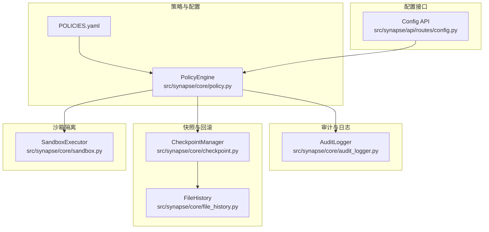
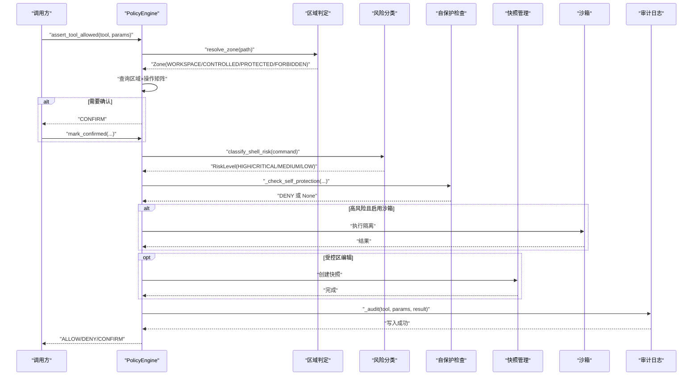
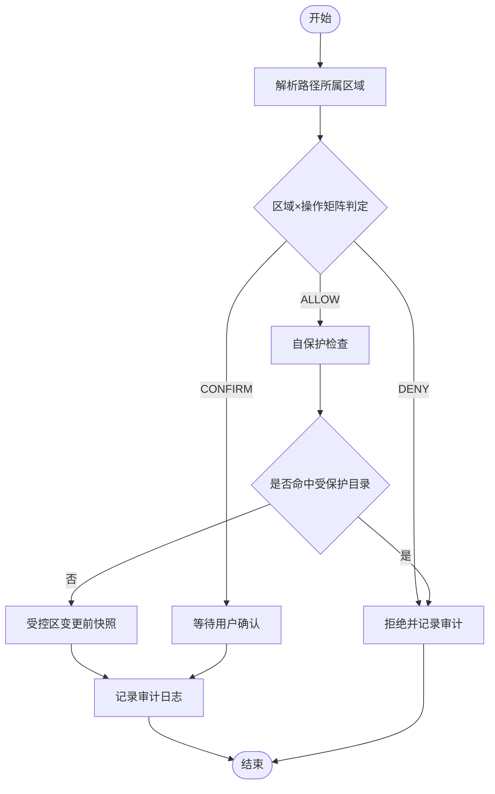
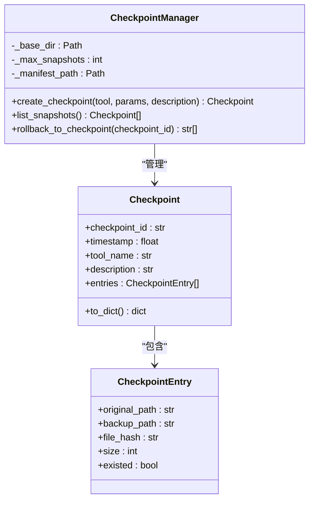
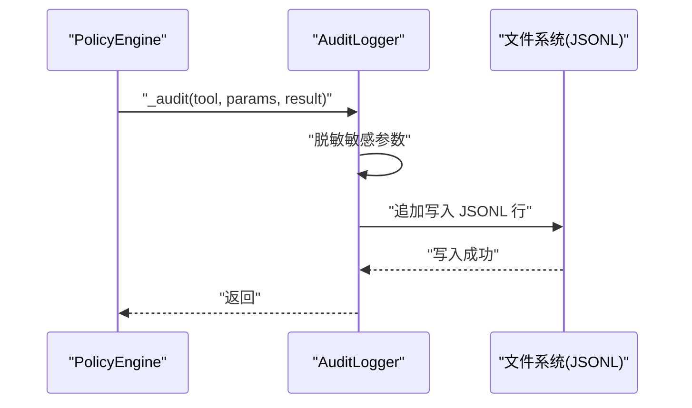
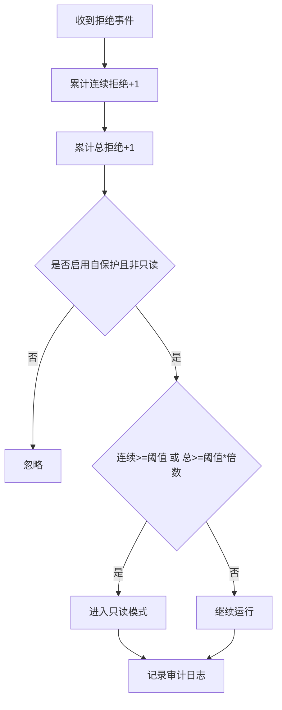
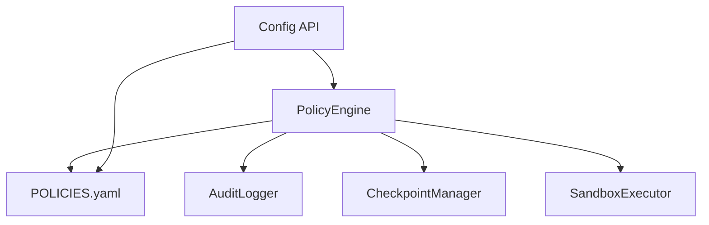

# 自我保护机制

<cite>
**本文档引用的文件**
- [POLICIES.yaml](file://identity/POLICIES.yaml)
- [policy.py](file://src/synapse/core/policy.py)
- [audit_logger.py](file://src/synapse/core/audit_logger.py)
- [config.py](file://src/synapse/api/routes/config.py)
- [checkpoint.py](file://src/synapse/core/checkpoint.py)
- [file_history.py](file://src/synapse/core/file_history.py)
- [sandbox.py](file://src/synapse/core/sandbox.py)
- [test_security.py](file://tests/unit/test_security.py)
</cite>

## 目录
1. [简介](#简介)
2. [项目结构](#项目结构)
3. [核心组件](#核心组件)
4. [架构概览](#架构概览)
5. [详细组件分析](#详细组件分析)
6. [依赖关系分析](#依赖关系分析)
7. [性能考虑](#性能考虑)
8. [故障排除指南](#故障排除指南)
9. [结论](#结论)
10. [附录](#附录)

## 简介
本文件系统性阐述 OpenAkita 平台的自我保护机制，围绕数据锁定与系统完整性维护展开，重点覆盖以下方面：
- 数据锁定与关键数据保护：通过四区模型（工作区/受控区/受保护区/禁入区）与操作类型矩阵，实现对文件系统的精细控制；结合自保护策略，阻止对 Agent 关键目录的破坏性操作。
- 系统完整性维护：利用快照与回滚（L4 层）保障受控区变更的可逆性；通过死亡开关（只读模式）在异常情况下强制系统进入安全状态。
- 防篡改机制：审计日志持久化（JSONL），对敏感参数进行脱敏处理；确认缓存与持久化白名单降低误判与绕过风险。
- 威胁检测与自动响应：基于 Shell 命令的风险分类（极高/高/中/低）与模式匹配，自动触发确认或沙箱隔离；在连续拒绝阈值触发时自动进入只读模式。
- 安全事件处理：提供配置 API 实时调整策略；支持手动重置只读模式；提供证据收集与系统恢复指导。

## 项目结构
自我保护机制相关代码主要分布在以下模块：
- 策略引擎与配置：src/synapse/core/policy.py（六层安全体系核心）、identity/POLICIES.yaml（默认策略配置）
- 审计日志：src/synapse/core/audit_logger.py（JSONL 持久化与敏感信息脱敏）
- 快照与回滚：src/synapse/core/checkpoint.py、src/synapse/core/file_history.py
- 沙箱隔离：src/synapse/core/sandbox.py
- 配置 API：src/synapse/api/routes/config.py（安全配置的读取与更新）
- 单元测试：tests/unit/test_security.py（验证死亡开关、自保护、YAML 加载等）

**图表来源**
- [policy.py:1-200](file://src/synapse/core/policy.py#L1-L200)
- [audit_logger.py:1-110](file://src/synapse/core/audit_logger.py#L1-L110)
- [checkpoint.py:1-59](file://src/synapse/core/checkpoint.py#L1-L59)
- [file_history.py:166-200](file://src/synapse/core/file_history.py#L166-L200)
- [sandbox.py:151-198](file://src/synapse/core/sandbox.py#L151-L198)
- [config.py:853-890](file://src/synapse/api/routes/config.py#L853-L890)

**章节来源**
- [policy.py:1-200](file://src/synapse/core/policy.py#L1-L200)
- [POLICIES.yaml:1-81](file://identity/POLICIES.yaml#L1-L81)
- [config.py:853-890](file://src/synapse/api/routes/config.py#L853-L890)

## 核心组件
- 策略引擎（PolicyEngine）：实现六层安全体系，包含 L1 区域×操作矩阵、L3 Shell 命令风险分类、L4 快照回滚、L5 自保护与死亡开关、确认缓存与持久化白名单。
- 审计日志（AuditLogger）：将策略决策以 JSONL 形式追加写入文件，支持敏感参数脱敏，确保进程崩溃也不丢失审计记录。
- 快照与回滚（CheckpointManager/FileHistory）：在受控区文件修改前自动创建快照，支持按消息 ID 回滚，保留最近 N 份快照。
- 沙箱（SandboxExecutor）：对高风险命令执行进行隔离，限制路径访问与资源使用。
- 配置 API：提供安全配置的读取与更新接口，支持热重载策略引擎。

**章节来源**
- [policy.py:1101-1159](file://src/synapse/core/policy.py#L1101-L1159)
- [audit_logger.py:1-110](file://src/synapse/core/audit_logger.py#L1-L110)
- [checkpoint.py:1-59](file://src/synapse/core/checkpoint.py#L1-L59)
- [file_history.py:166-200](file://src/synapse/core/file_history.py#L166-L200)
- [sandbox.py:151-198](file://src/synapse/core/sandbox.py#L151-L198)
- [config.py:1211-1271](file://src/synapse/api/routes/config.py#L1211-L1271)

## 架构概览
自我保护机制采用“分层防护 + 自动响应”的设计：
- L1：四区模型 + 操作类型矩阵，决定是否允许或需要确认。
- L3：Shell 命令风险分类与模式匹配，自动拦截极高风险命令，对高/中风险命令触发确认或沙箱。
- L4：受控区变更前快照，支持回滚。
- L5：自保护策略 + 死亡开关，防止对关键目录的破坏，并在异常情况下进入只读模式。
- 审计：所有策略决策均记录到 JSONL 文件，含敏感信息脱敏。

**图表来源**
- [policy.py:888-959](file://src/synapse/core/policy.py#L888-L959)
- [policy.py:976-1100](file://src/synapse/core/policy.py#L976-L1100)
- [policy.py:1103-1137](file://src/synapse/core/policy.py#L1103-L1137)
- [policy.py:1184-1212](file://src/synapse/core/policy.py#L1184-L1212)
- [audit_logger.py:54-95](file://src/synapse/core/audit_logger.py#L54-L95)

**章节来源**
- [policy.py:888-1159](file://src/synapse/core/policy.py#L888-L1159)
- [audit_logger.py:54-95](file://src/synapse/core/audit_logger.py#L54-L95)

## 详细组件分析

### 数据锁定与关键数据保护
- 四区模型与操作矩阵
  - 工作区：读/创建/编辑/覆盖/删除需要确认。
  - 受控区：读/创建/编辑需要确认，覆盖/递归删除需要确认或拒绝。
  - 受保护区：除读外全部拒绝。
  - 禁入区：全部拒绝。
  - 默认区域为受保护区，未匹配任何规则时按受保护区处理。
- 自保护策略
  - 阻止对配置中受保护目录的写入、编辑、删除操作。
  - 对高风险 Shell 命令（如格式化磁盘、rm -rf /）进行拦截。
  - 支持对受控区的覆盖/删除操作进行快照，便于回滚。

**图表来源**
- [policy.py:888-959](file://src/synapse/core/policy.py#L888-L959)
- [policy.py:1103-1137](file://src/synapse/core/policy.py#L1103-L1137)

**章节来源**
- [policy.py:77-110](file://src/synapse/core/policy.py#L77-L110)
- [policy.py:888-959](file://src/synapse/core/policy.py#L888-L959)
- [policy.py:1103-1137](file://src/synapse/core/policy.py#L1103-L1137)

### 系统完整性维护与快照回滚
- 快照管理
  - 在受控区文件编辑/覆盖前创建快照，记录原始文件哈希、大小与存在性。
  - 最多保留 N 份快照，新快照生成后清理最旧的快照。
- 回滚机制
  - 支持按消息 ID 获取快照并回滚，恢复被覆盖/删除的文件。
  - 回滚过程中对失败项进行告警，避免部分回滚导致的数据不一致。

**图表来源**
- [checkpoint.py:23-59](file://src/synapse/core/checkpoint.py#L23-L59)
- [file_history.py:166-200](file://src/synapse/core/file_history.py#L166-L200)

**章节来源**
- [checkpoint.py:1-59](file://src/synapse/core/checkpoint.py#L1-L59)
- [file_history.py:166-200](file://src/synapse/core/file_history.py#L166-L200)

### 防篡改机制与审计日志
- 审计日志
  - 以 JSONL 追加写入，记录策略决策、原因、元数据。
  - 对包含敏感关键字的参数进行脱敏处理，避免泄露密钥、密码等。
  - 全局审计日志器从策略引擎配置中读取审计路径，若不可用则使用默认路径。
- 敏感信息脱敏
  - 关键字集合包含常见敏感字段，采用正则替换方式将值替换为掩码。

**图表来源**
- [audit_logger.py:1-110](file://src/synapse/core/audit_logger.py#L1-L110)
- [policy.py:1184-1212](file://src/synapse/core/policy.py#L1184-L1212)

**章节来源**
- [audit_logger.py:1-110](file://src/synapse/core/audit_logger.py#L1-L110)
- [policy.py:1184-1212](file://src/synapse/core/policy.py#L1184-L1212)

### 威胁检测与自动响应
- Shell 命令风险分类
  - 极高风险：直接拦截（如格式化磁盘、rm -rf / 等）。
  - 高风险：根据确认模式（谨慎/智能/信任）决定是否需要确认或直接放行。
  - 中风险：在智能模式下自动放行，其他模式需要确认。
  - 低风险：无需确认。
- 确认模式与缓存
  - 支持三种模式：谨慎（需要确认）、智能（中风险自动放行）、信任（自动放行）。
  - 提供一次性确认缓存、会话级确认缓存与持久化白名单。
- 死亡开关（只读模式）
  - 连续拒绝次数达到阈值或累计拒绝次数超过阈值（阈值×倍数）时，进入只读模式。
  - 只读模式下仅允许读取类操作，其他写入/删除/覆盖均被拒绝。
  - 可通过 API 或手动重置只读模式。

**图表来源**
- [policy.py:1184-1212](file://src/synapse/core/policy.py#L1184-L1212)

**章节来源**
- [policy.py:976-1100](file://src/synapse/core/policy.py#L976-L1100)
- [policy.py:1184-1212](file://src/synapse/core/policy.py#L1184-L1212)
- [config.py:1211-1271](file://src/synapse/api/routes/config.py#L1211-L1271)

### 保护策略配置与监控
- 配置项（来自 POLICIES.yaml）
  - zones：工作区/受控区/受保护区/禁入区路径列表，默认区域。
  - confirmation：确认模式（谨慎/智能/信任）、超时、默认超时策略、确认 TTL。
  - command_patterns：阻断命令列表、自定义高危/严重模式、排除模式。
  - checkpoint：启用快照、最大快照数、快照目录。
  - self_protection：启用自保护、受保护目录列表、审计文件路径、死亡开关阈值与倍数。
  - sandbox：启用沙箱、后端、风险等级阈值、豁免命令、网络策略。
  - user_allowlist：持久化工具/命令白名单。
- 配置 API
  - 读取与更新安全配置，支持热重载策略引擎。
  - 提供只读模式状态查询与更新。

**章节来源**
- [POLICIES.yaml:1-81](file://identity/POLICIES.yaml#L1-L81)
- [config.py:876-890](file://src/synapse/api/routes/config.py#L876-L890)
- [config.py:1178-1204](file://src/synapse/api/routes/config.py#L1178-L1204)
- [config.py:1211-1271](file://src/synapse/api/routes/config.py#L1211-L1271)

### 异常行为告警与应急响应
- 异常行为识别
  - 连续拒绝触发死亡开关进入只读模式。
  - 高风险命令自动拦截或需要确认。
  - 自保护策略拦截对关键目录的破坏性操作。
- 应急响应流程
  - 立即启用只读模式，阻止进一步破坏。
  - 记录审计日志，保留证据。
  - 通过配置 API 调整策略或手动重置只读模式。
  - 使用快照回滚恢复受控区文件。
  - 结合日志与证据文件进行根因分析与修复。

**章节来源**
- [policy.py:1184-1212](file://src/synapse/core/policy.py#L1184-L1212)
- [audit_logger.py:54-95](file://src/synapse/core/audit_logger.py#L54-L95)
- [checkpoint.py:1-59](file://src/synapse/core/checkpoint.py#L1-L59)
- [config.py:1211-1271](file://src/synapse/api/routes/config.py#L1211-L1271)

## 依赖关系分析
- PolicyEngine 依赖
  - 审计日志：在每次允许/拒绝后写入 JSONL。
  - 快照管理：在受控区覆盖/编辑前创建快照。
  - 沙箱：对高风险命令执行隔离。
  - 配置：从 POLICIES.yaml 加载策略，支持热重载。
- 配置 API 依赖
  - 读写 POLICIES.yaml，更新后重置策略引擎。
  - 提供只读模式状态查询与更新。

**图表来源**
- [policy.py:1184-1212](file://src/synapse/core/policy.py#L1184-L1212)
- [checkpoint.py:1-59](file://src/synapse/core/checkpoint.py#L1-L59)
- [sandbox.py:151-198](file://src/synapse/core/sandbox.py#L151-L198)
- [config.py:856-873](file://src/synapse/api/routes/config.py#L856-L873)

**章节来源**
- [policy.py:1184-1212](file://src/synapse/core/policy.py#L1184-L1212)
- [config.py:856-873](file://src/synapse/api/routes/config.py#L856-L873)

## 性能考虑
- 审计日志
  - JSONL 追加写入，避免频繁重写；建议将审计路径置于高性能磁盘。
  - 脱敏处理使用正则，复杂度与参数长度线性相关，建议控制参数大小。
- 快照管理
  - 哈希计算与文件复制成本与文件大小相关；建议限制快照数量与快照目录容量。
  - 回滚时逐文件恢复，建议批量操作时合并为更少的快照。
- 确认缓存
  - TTL 缓存与会话白名单减少重复确认开销；持久化白名单写入需注意 I/O 延迟。

## 故障排除指南
- 配置写入失败
  - 现象：写入 POLICIES.yaml 返回错误，提示拒绝写入以防止数据丢失。
  - 处理：先读取配置确认文件可读，再进行修改；确保目标路径存在且有写权限。
- 死亡开关误触发
  - 现象：系统进入只读模式，无法执行写入/删除/覆盖。
  - 处理：通过配置 API 查询只读模式状态，确认无误后手动重置只读模式。
- 审计日志缺失
  - 现象：策略决策未记录到 JSONL。
  - 处理：检查审计路径是否存在，确认策略引擎初始化成功；必要时降级使用默认路径。
- 快照回滚失败
  - 现象：回滚后部分文件未恢复。
  - 处理：查看回滚日志中的告警信息，确认目标文件是否存在备份；必要时重新创建快照。

**章节来源**
- [config.py:856-873](file://src/synapse/api/routes/config.py#L856-L873)
- [policy.py:1213-1217](file://src/synapse/core/policy.py#L1213-L1217)
- [audit_logger.py:54-95](file://src/synapse/core/audit_logger.py#L54-L95)
- [file_history.py:166-200](file://src/synapse/core/file_history.py#L166-L200)

## 结论
自我保护机制通过“四区矩阵 + 风险分类 + 快照回滚 + 自保护 + 死亡开关 + 审计日志”构建了完整的数据锁定与系统完整性保障体系。该机制在保证灵活性的同时，提供了强大的防篡改能力与自动响应能力，适用于复杂场景下的安全运营与应急处置。

## 附录

### 保护级别设置与监控配置指南
- 保护级别
  - zones：合理划分工作区/受控区/受保护区/禁入区，确保最小权限原则。
  - self_protection：明确受保护目录清单，避免误伤业务数据。
  - confirmation：根据团队安全文化选择模式（谨慎/智能/信任），并设置合理的超时与 TTL。
- 监控配置
  - 开启审计日志并定期轮转；关注只读模式触发频率与原因分布。
  - 设置快照上限与清理策略，避免磁盘占用过高。

**章节来源**
- [POLICIES.yaml:1-81](file://identity/POLICIES.yaml#L1-L81)
- [config.py:1178-1204](file://src/synapse/api/routes/config.py#L1178-L1204)

### 安全事件处理与证据保全
- 事件处理
  - 记录策略决策与原因，保留 JSONL 审计文件。
  - 对高风险命令执行沙箱隔离，记录沙箱结果。
- 证据保全
  - 保存 POLICIES.yaml、审计日志、快照目录与回滚记录。
  - 结合日志与证据文件进行根因分析与修复。

**章节来源**
- [audit_logger.py:54-95](file://src/synapse/core/audit_logger.py#L54-L95)
- [checkpoint.py:1-59](file://src/synapse/core/checkpoint.py#L1-L59)
- [sandbox.py:151-198](file://src/synapse/core/sandbox.py#L151-L198)

### 系统恢复指导
- 恢复步骤
  - 确认只读模式状态，必要时手动重置。
  - 使用快照回滚恢复受控区文件。
  - 通过配置 API 调整策略，逐步恢复功能。
  - 持续监控审计日志与只读模式触发情况。

**章节来源**
- [policy.py:1213-1217](file://src/synapse/core/policy.py#L1213-L1217)
- [file_history.py:166-200](file://src/synapse/core/file_history.py#L166-L200)
- [config.py:1211-1271](file://src/synapse/api/routes/config.py#L1211-L1271)