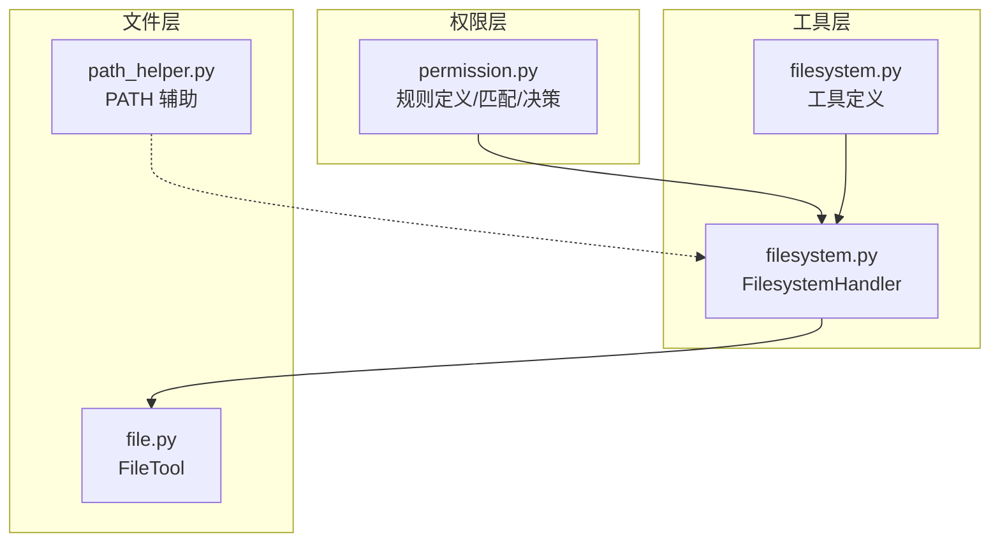
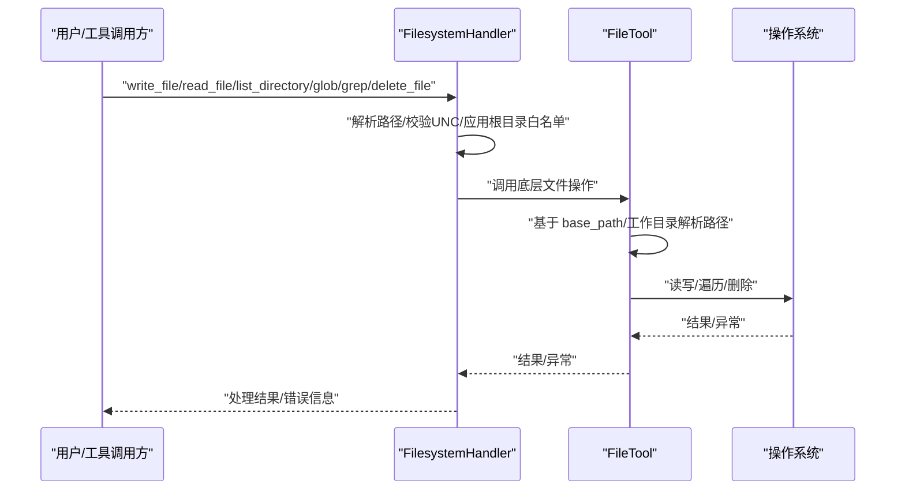
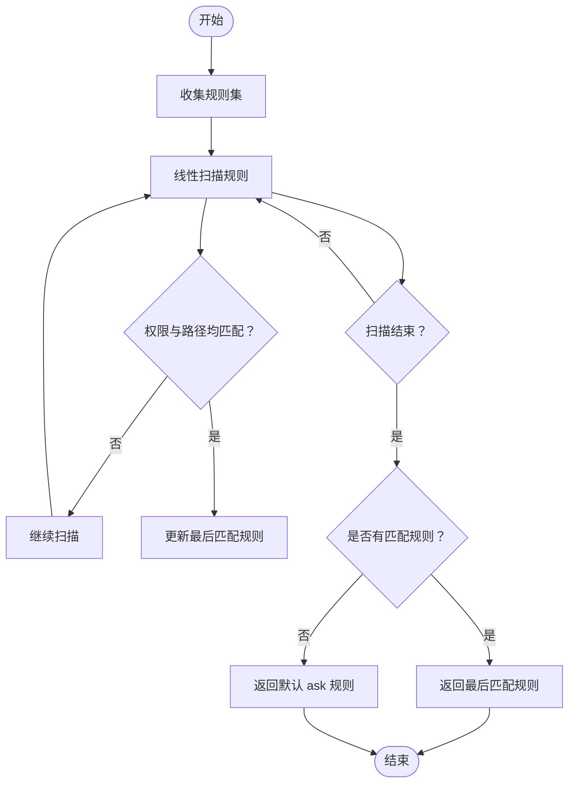
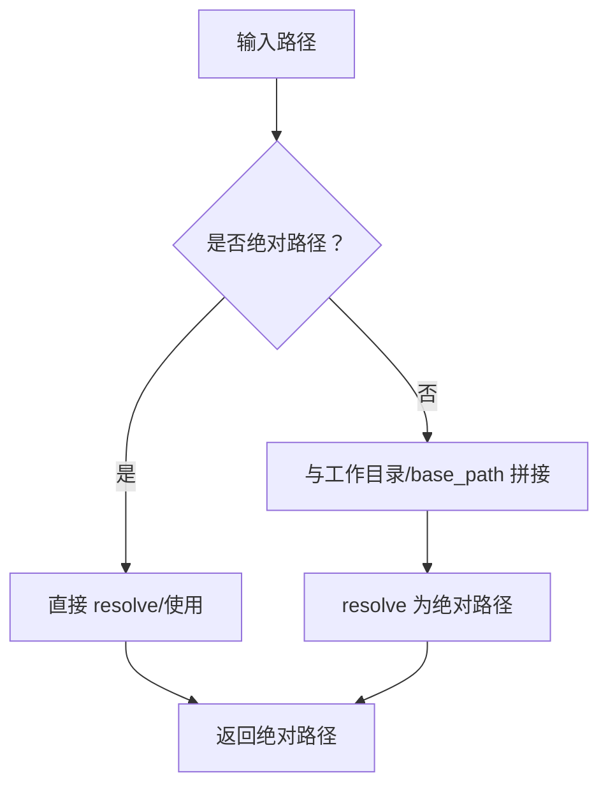
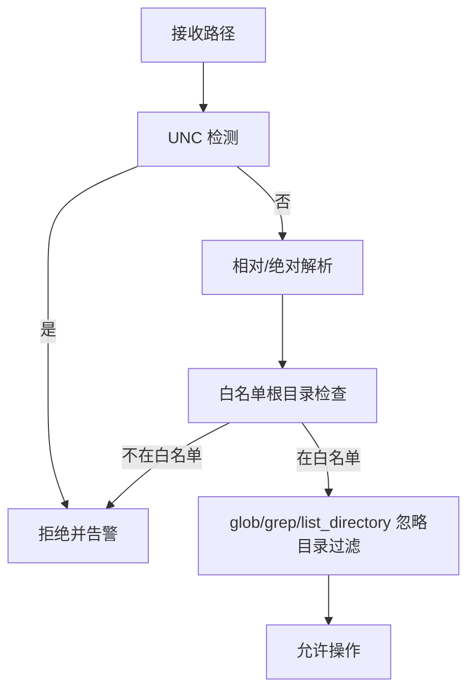
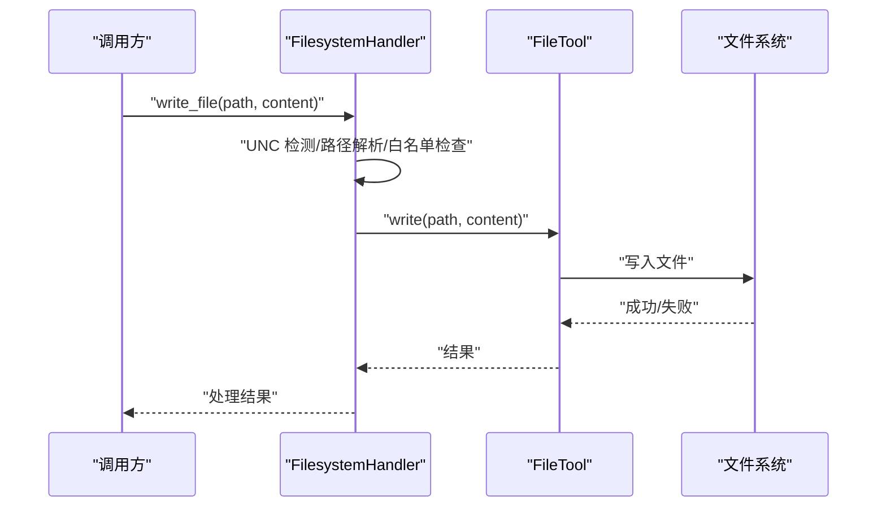
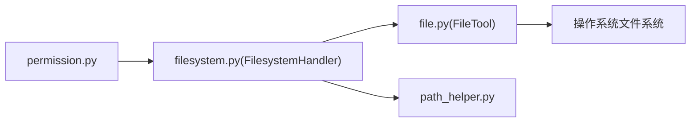

# 路径分区管理

<cite>
**本文引用的文件**
- [permission.py](file://src/synapse/core/permission.py)
- [filesystem.py](file://src/synapse/tools/handlers/filesystem.py)
- [filesystem.py](file://src/synapse/tools/definitions/filesystem.py)
- [file.py](file://src/synapse/tools/file.py)
- [path_helper.py](file://src/synapse/utils/path_helper.py)
</cite>

## 目录
1. [简介](#简介)
2. [项目结构](#项目结构)
3. [核心组件](#核心组件)
4. [架构总览](#架构总览)
5. [详细组件分析](#详细组件分析)
6. [依赖分析](#依赖分析)
7. [性能考量](#性能考量)
8. [故障排查指南](#故障排查指南)
9. [结论](#结论)
10. [附录](#附录)

## 简介
本文件面向“路径分区管理”主题，系统性阐述 Synapse 中基于规则的路径访问控制实现，包括：
- 允许目录与拒绝目录的配置策略
- 路径解析算法、绝对路径转换、相对路径与工作目录的关系
- 路径匹配规则、通配符支持与匹配顺序
- 路径遍历攻击防护（UNC 路径拦截、相对路径越界、隐藏目录过滤）
- 配置示例、最佳实践与常见问题解决方案
- 不同操作系统下的路径处理差异与兼容性考虑

## 项目结构
围绕路径分区管理的核心代码分布在以下模块：
- 权限系统：规则定义、匹配与决策
- 文件系统处理器：工具调用入口、路径解析与安全校验
- 文件工具：底层路径解析、目录遍历与忽略规则
- 路径辅助：跨平台 PATH 解析与命令查找

**图表来源**
- [permission.py](file://src/synapse/core/permission.py)
- [filesystem.py](file://src/synapse/tools/handlers/filesystem.py)
- [filesystem.py](file://src/synapse/tools/definitions/filesystem.py)
- [file.py](file://src/synapse/tools/file.py)
- [path_helper.py](file://src/synapse/utils/path_helper.py)

**章节来源**
- [permission.py](file://src/synapse/core/permission.py)
- [filesystem.py](file://src/synapse/tools/handlers/filesystem.py)
- [filesystem.py](file://src/synapse/tools/definitions/filesystem.py)
- [file.py](file://src/synapse/tools/file.py)
- [path_helper.py](file://src/synapse/utils/path_helper.py)

## 核心组件
- 权限规则与匹配
  - 规则三元组：权限类别/资源模式/动作（allow/deny/ask）
  - 匹配采用通配符（fnmatch）与“最后一条匹配规则获胜”的语义
  - 支持按工具映射到“编辑/读取”类别，或直接以工具名为权限类别
- 文件系统处理器
  - 统一处理 run_shell、write_file、read_file、edit_file、list_directory、grep、glob、delete_file
  - 路径解析：相对路径基于工作目录（cwd）拼接并 resolve 为绝对路径
  - 安全校验：UNC 路径拦截、根目录白名单限制、自动修复策略
- 文件工具
  - 底层路径解析：绝对路径直接使用，相对路径基于 base_path
  - 目录遍历：支持 rglob/glob，内置忽略目录集合
- 跨平台 PATH 辅助
  - macOS 下通过 login shell 与 path_helper 获取完整 PATH，提升命令发现成功率

**章节来源**
- [permission.py](file://src/synapse/core/permission.py)
- [filesystem.py](file://src/synapse/tools/handlers/filesystem.py)
- [file.py](file://src/synapse/tools/file.py)
- [path_helper.py](file://src/synapse/utils/path_helper.py)

## 架构总览
路径分区管理贯穿“权限规则 → 工具调用 → 路径解析 → 文件系统操作”的链路。

**图表来源**
- [filesystem.py](file://src/synapse/tools/handlers/filesystem.py)
- [file.py](file://src/synapse/tools/file.py)

## 详细组件分析

### 权限规则与路径匹配
- 规则结构
  - 权限类别：工具名、分类（edit/read/bash）、通配符“*”
  - 资源模式：路径 glob 模式（如 data/plans/*.md），通配符“*”
  - 动作：allow/deny/ask
- 匹配逻辑
  - 逐条规则扫描，同时满足权限与路径模式时记录为“最后匹配”
  - 若无匹配，返回默认“ask”
- 工具到权限映射
  - 编辑类工具（write_file、edit_file、replace_in_file、create_file、delete_file、rename_file）映射为“edit”
  - 读取类工具（read_file、list_directory、search_files、web_search、news_search）映射为“read”
  - 其他工具以其工具名为权限类别
- 模式规则集
  - plan/ask/agent/coordinator 模式下分别预置规则集，限制工具可用性与路径范围

**图表来源**
- [permission.py](file://src/synapse/core/permission.py)

**章节来源**
- [permission.py](file://src/synapse/core/permission.py)

### 路径解析与绝对路径转换
- 文件系统处理器
  - 相对路径：以当前工作目录（cwd）为基准拼接后 resolve 为绝对路径
  - 绝对路径：直接 resolve
- 文件工具
  - 相对路径：以 base_path 为基准拼接
  - 绝对路径：直接使用
- glob/grep/list_directory
  - glob：自动在非“**/”开头的模式前添加“**/”，实现递归搜索
  - grep/list_directory：使用 rglob/glob 遍历，结合忽略目录集合与隐藏目录过滤

**图表来源**
- [filesystem.py](file://src/synapse/tools/handlers/filesystem.py)
- [file.py](file://src/synapse/tools/file.py)

**章节来源**
- [filesystem.py](file://src/synapse/tools/handlers/filesystem.py)
- [file.py](file://src/synapse/tools/file.py)

### 路径匹配规则与通配符支持
- 权限层
  - 权限与路径均使用 fnmatch 风格通配符匹配
  - “*” 表示任意值
- 文件系统层
  - glob 模式：支持“**/”递归、“*”单层通配、“?”单字符通配
  - 默认忽略目录集合：.git、node_modules、__pycache__、.venv、dist/build 等
  - 隐藏目录过滤：除 .github/.vscode/.cursor 外，上层出现“.”开头的隐藏目录将被跳过
- 匹配顺序
  - 权限层：最后一条匹配规则获胜
  - 文件系统层：先按规则匹配，再进行忽略与过滤

**章节来源**
- [permission.py](file://src/synapse/core/permission.py)
- [file.py](file://src/synapse/tools/file.py)

### 路径遍历攻击防护
- UNC 路径拦截
  - 拦截以“\\\\”开头的网络路径，避免 NTLM 凭据泄露
- 相对路径越界
  - 绝对路径化后，结合“根目录白名单”判断是否位于允许范围内
  - 文件系统处理器在写入/读取/编辑/删除前，可基于策略限制目标路径必须位于指定根目录之一
- 隐藏目录与忽略目录
  - 默认忽略 .git、node_modules、__pycache__ 等
  - 隐藏目录（上层出现“.”开头）默认跳过，除非显式列入白名单
- 跨平台 PATH 修复（macOS）
  - Finder/Dock 启动的 .app 仅继承有限 PATH，通过 login shell 与 path_helper 获取完整 PATH，提升命令发现成功率

**图表来源**
- [filesystem.py](file://src/synapse/tools/handlers/filesystem.py)
- [file.py](file://src/synapse/tools/file.py)
- [path_helper.py](file://src/synapse/utils/path_helper.py)

**章节来源**
- [filesystem.py](file://src/synapse/tools/handlers/filesystem.py)
- [file.py](file://src/synapse/tools/file.py)
- [path_helper.py](file://src/synapse/utils/path_helper.py)

### 工具调用与路径控制流程
- write_file/read_file/edit_file/list_directory/glob/grep/delete_file
  - 调用前进行 UNC 拦截与根目录白名单校验
  - 文件系统处理器内部使用 FileTool 执行具体操作
  - glob/grep/list_directory 支持分页与结果截断，避免大输出

**图表来源**
- [filesystem.py](file://src/synapse/tools/handlers/filesystem.py)
- [file.py](file://src/synapse/tools/file.py)

**章节来源**
- [filesystem.py](file://src/synapse/tools/handlers/filesystem.py)
- [file.py](file://src/synapse/tools/file.py)

## 依赖分析
- 权限系统依赖
  - 工具到权限映射：编辑类/读取类工具分类
  - 模式规则集：plan/ask/coordinator/agent 模式下的工具可用性与路径限制
- 文件系统处理器依赖
  - FileTool：路径解析、文件读写、遍历、搜索、删除
  - 跨平台 PATH 辅助：macOS 下命令查找增强
- 文件工具依赖
  - 默认忽略目录集合：减少无关文件遍历
  - glob/grep/list_directory：递归与过滤逻辑

**图表来源**
- [permission.py](file://src/synapse/core/permission.py)
- [filesystem.py](file://src/synapse/tools/handlers/filesystem.py)
- [file.py](file://src/synapse/tools/file.py)
- [path_helper.py](file://src/synapse/utils/path_helper.py)

**章节来源**
- [permission.py](file://src/synapse/core/permission.py)
- [filesystem.py](file://src/synapse/tools/handlers/filesystem.py)
- [file.py](file://src/synapse/tools/file.py)
- [path_helper.py](file://src/synapse/utils/path_helper.py)

## 性能考量
- 遍历与过滤
  - glob/grep/list_directory 默认忽略大量目录，减少 IO 与 CPU 开销
  - glob 自动添加“**/”前缀，递归搜索可能带来指数级增长，建议配合更具体的模式
- 输出截断
  - run_shell/grep 等大输出自动截断，并将完整内容保存至溢出文件，便于后续分页读取
- 并发与批处理
  - 建议批量调用相关工具，减少重复解析与 IO

[本节为通用性能讨论，不直接分析具体文件]

## 故障排查指南
- UNC 路径被拒绝
  - 现象：返回“UNC 路径检测到...”
  - 处理：改用本地路径或映射盘符
- 路径不在白名单根目录
  - 现象：写入/读取/编辑/删除被拒绝
  - 处理：将目标路径调整到策略允许的根目录内，或更新策略
- glob/grep 结果为空
  - 现象：未找到匹配文件
  - 排查：确认模式是否以“**/”开头（glob 自动补全），检查忽略目录与隐藏目录过滤
- macOS 命令未找到
  - 现象：which_command/shell 执行失败
  - 处理：使用 get_macos_enriched_env 构建带完整 PATH 的环境，或手动指定额外 PATH

**章节来源**
- [filesystem.py](file://src/synapse/tools/handlers/filesystem.py)
- [file.py](file://src/synapse/tools/file.py)
- [path_helper.py](file://src/synapse/utils/path_helper.py)

## 结论
路径分区管理通过“规则驱动 + 工具层校验 + 文件层解析”的分层设计，实现了灵活而安全的路径访问控制：
- 规则层提供细粒度的路径与工具维度控制
- 工具层在运行时进行路径解析与安全校验
- 文件层提供高效的遍历与过滤能力
- 跨平台 PATH 辅助提升了命令发现的可靠性

## 附录

### 配置示例与最佳实践
- 配置示例（来自规则构建函数）
  - 全局默认：所有权限与路径默认允许
  - 指定权限类别：如“edit”下对 data/plans/*.md 允许，其余拒绝
  - 工具名直接作为权限类别：如 read、question 等
- 最佳实践
  - 优先使用“允许白名单”而非“拒绝黑名单”
  - 对编辑类工具，尽量限定到具体目录或文件模式
  - 使用 glob 模式时，尽量具体，避免“**/*”过度递归
  - macOS 环境下，确保 PATH 完整，必要时使用 get_macos_enriched_env

**章节来源**
- [permission.py](file://src/synapse/core/permission.py)

### 不同操作系统下的路径处理差异
- macOS
  - Finder/Dock 启动的应用仅继承有限 PATH，可能导致命令不可用
  - 通过 login shell 与 path_helper 获取完整 PATH，提升命令发现成功率
- Windows
  - run_shell 对多行 python -c 做自动修复，避免 cmd.exe 对换行符的处理问题
  - UNC 路径拦截，避免凭据泄露风险

**章节来源**
- [path_helper.py](file://src/synapse/utils/path_helper.py)
- [filesystem.py](file://src/synapse/tools/handlers/filesystem.py)