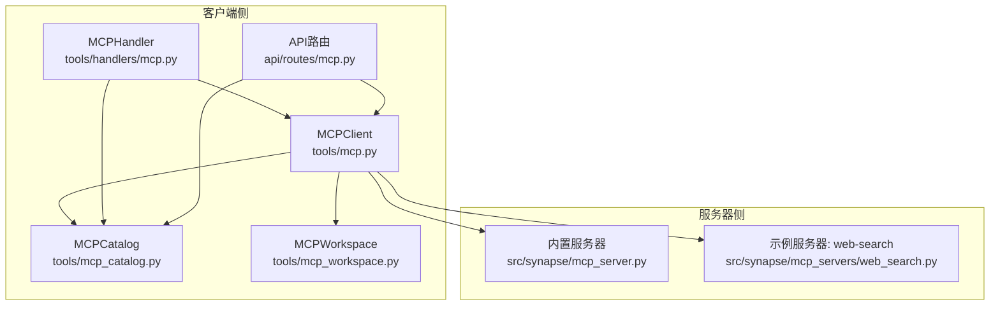
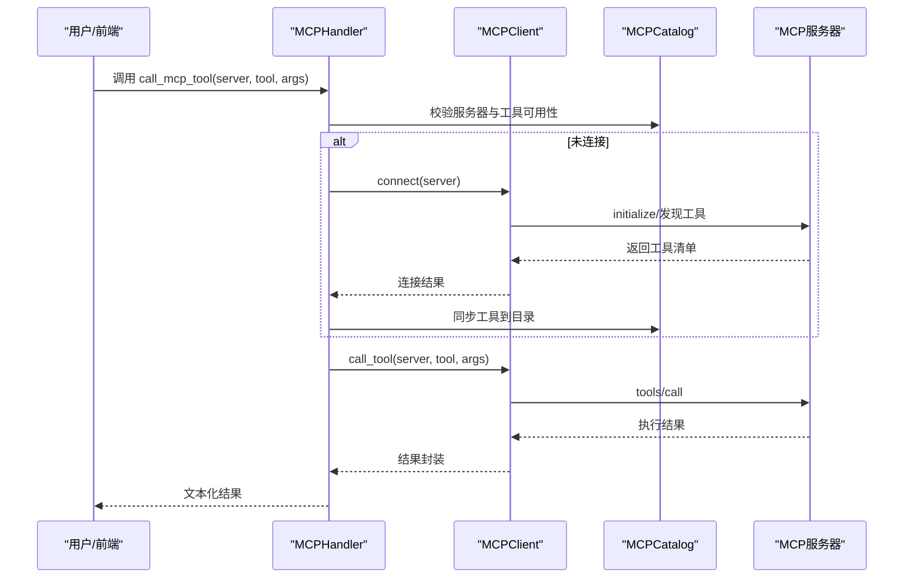
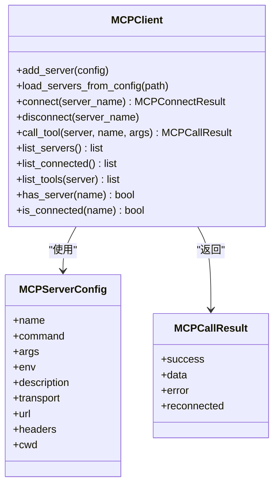
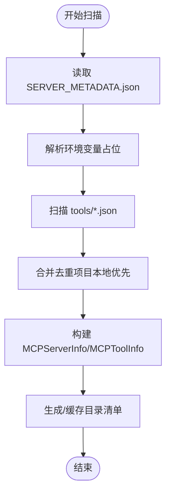
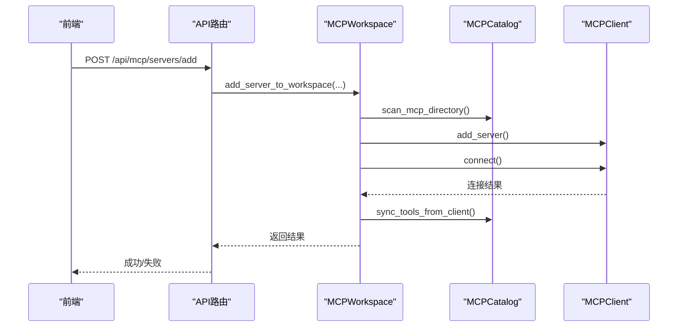
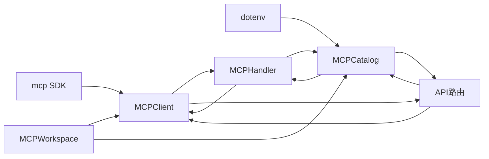

# MCP工具

<cite>
**本文引用的文件**
- [mcp_server.py](file://src/synapse/mcp_server.py)
- [mcp.py](file://src/synapse/tools/mcp.py)
- [mcp_catalog.py](file://src/synapse/tools/mcp_catalog.py)
- [mcp_workspace.py](file://src/synapse/tools/mcp_workspace.py)
- [mcp.py（处理器）](file://src/synapse/tools/handlers/mcp.py)
- [mcp.py（API路由）](file://src/synapse/api/routes/mcp.py)
- [web_search.py](file://src/synapse/mcp_servers/web_search.py)
- [mcp-integration.md](file://docs/mcp-integration.md)
- [README.md（MCP配置目录）](file://mcps/README.md)
- [SERVER_METADATA.json（web-search）](file://mcps/web-search/SERVER_METADATA.json)
- [SERVER_METADATA.json（chrome-devtools）](file://mcps/chrome-devtools/SERVER_METADATA.json)
- [config.py](file://src/synapse/config.py)
</cite>

## 目录
1. [简介](#简介)
2. [项目结构](#项目结构)
3. [核心组件](#核心组件)
4. [架构总览](#架构总览)
5. [详细组件分析](#详细组件分析)
6. [依赖关系分析](#依赖关系分析)
7. [性能考量](#性能考量)
8. [故障排查指南](#故障排查指南)
9. [结论](#结论)
10. [附录](#附录)

## 简介
本文件面向MCP（Model Context Protocol）工具的使用者与集成者，系统性阐述MCP客户端实现、MCP协议集成方式、工具发现与注册机制、MCP服务器连接流程、工具调用流程、工作空间管理与批量操作支持，并覆盖MCP服务器配置、认证机制、错误处理与性能监控。文末提供使用示例、集成指南与最佳实践。

## 项目结构
围绕MCP的关键代码分布在如下模块：
- 客户端与协议集成：tools/mcp.py（MCPClient）、tools/mcp_catalog.py（目录与清单）、tools/mcp_workspace.py（工作区与批量操作）
- 服务器侧：mcp_server.py（内置服务器）、mcp_servers/web_search.py（示例服务器）
- 系统技能与API：tools/handlers/mcp.py（系统技能）、api/routes/mcp.py（HTTP API）
- 配置与规范：docs/mcp-integration.md、mcps/README.md、各SERVER_METADATA.json

**图表来源**
- [mcp.py:244-800](file://src/synapse/tools/mcp.py#L244-L800)
- [mcp_catalog.py:151-604](file://src/synapse/tools/mcp_catalog.py#L151-L604)
- [mcp_workspace.py:106-271](file://src/synapse/tools/mcp_workspace.py#L106-L271)
- [mcp.py（处理器）:31-338](file://src/synapse/tools/handlers/mcp.py#L31-L338)
- [mcp.py（API路由）:71-403](file://src/synapse/api/routes/mcp.py#L71-L403)
- [mcp_server.py:66-225](file://src/synapse/mcp_server.py#L66-L225)
- [web_search.py:21-162](file://src/synapse/mcp_servers/web_search.py#L21-L162)

**章节来源**
- [mcp.py:1-800](file://src/synapse/tools/mcp.py#L1-L800)
- [mcp_catalog.py:1-604](file://src/synapse/tools/mcp_catalog.py#L1-L604)
- [mcp_workspace.py:1-271](file://src/synapse/tools/mcp_workspace.py#L1-L271)
- [mcp.py（处理器）:1-338](file://src/synapse/tools/handlers/mcp.py#L1-L338)
- [mcp.py（API路由）:1-403](file://src/synapse/api/routes/mcp.py#L1-L403)
- [mcp_server.py:1-225](file://src/synapse/mcp_server.py#L1-L225)
- [web_search.py:1-162](file://src/synapse/mcp_servers/web_search.py#L1-L162)

## 核心组件
- MCPClient：负责连接MCP服务器（stdio/streamable_http/sse）、发现工具、调用工具、断开连接与清理。
- MCPCatalog：扫描MCP配置目录，构建服务器与工具清单，支持按服务器过滤、指令加载与schema解析。
- MCPWorkspace：工作区管理（增删改查服务器配置、自动连接、工具同步、批量重载）。
- MCPHandler：系统技能入口，统一调度MCP调用、连接、断开、列表与指令获取。
- API路由：提供HTTP接口，供前端管理MCP服务器与工具。
- 内置/示例服务器：mcp_server.py（内置工具集）、web_search.py（示例搜索服务器）。

**章节来源**
- [mcp.py:244-800](file://src/synapse/tools/mcp.py#L244-L800)
- [mcp_catalog.py:151-604](file://src/synapse/tools/mcp_catalog.py#L151-L604)
- [mcp_workspace.py:106-271](file://src/synapse/tools/mcp_workspace.py#L106-L271)
- [mcp.py（处理器）:31-338](file://src/synapse/tools/handlers/mcp.py#L31-L338)
- [mcp.py（API路由）:71-403](file://src/synapse/api/routes/mcp.py#L71-L403)
- [mcp_server.py:66-225](file://src/synapse/mcp_server.py#L66-L225)
- [web_search.py:21-162](file://src/synapse/mcp_servers/web_search.py#L21-L162)

## 架构总览
MCP客户端通过MCP SDK（mcp）以三种传输协议接入MCP服务器：stdio（默认，适合本地Python模块）、streamable_http（HTTP流式）、sse（兼容旧版）。MCPCatalog负责扫描工作区与内置的mcps目录，生成系统提示可用的工具清单；MCPWorkspace负责持久化配置与批量操作；MCPHandler与API路由提供统一的调用入口与前端管理接口。

**图表来源**
- [mcp.py（处理器）:78-112](file://src/synapse/tools/handlers/mcp.py#L78-L112)
- [mcp.py:314-790](file://src/synapse/tools/mcp.py#L314-L790)
- [mcp_catalog.py:521-560](file://src/synapse/tools/mcp_catalog.py#L521-L560)

**章节来源**
- [mcp.py（处理器）:31-338](file://src/synapse/tools/handlers/mcp.py#L31-L338)
- [mcp.py:314-800](file://src/synapse/tools/mcp.py#L314-L800)
- [mcp_catalog.py:521-560](file://src/synapse/tools/mcp_catalog.py#L521-L560)

## 详细组件分析

### MCPClient（MCP客户端）
- 功能要点
  - 支持三种传输：stdio、streamable_http、sse。
  - 连接前命令解析与环境适配（macOS PATH增强、Windows打包环境兼容）。
  - 能力发现：list_tools/list_resources/list_prompts。
  - 调用封装：call_tool，返回统一结构（success/data/error/reconnected）。
  - 断开与清理：分离stdio子进程终止与CM清理，避免跨任务取消异常。
  - 超时控制：连接超时与调用超时可从配置读取。
- 关键流程
  - 连接：根据transport选择对应连接方法，进入ClientSession并initialize。
  - 发现：list_tools后写入本地工具索引。
  - 调用：tools/call，捕获异常并返回标准化错误。
  - 断开：必要时终止子进程，后台task清理CM并屏蔽异常。

**图表来源**
- [mcp.py:210-243](file://src/synapse/tools/mcp.py#L210-L243)
- [mcp.py:244-800](file://src/synapse/tools/mcp.py#L244-L800)

**章节来源**
- [mcp.py:244-800](file://src/synapse/tools/mcp.py#L244-L800)

### MCPCatalog（MCP目录与清单）
- 功能要点
  - 扫描mcps目录（含工作区与内置），合并去重，支持SERVER_METADATA.json与tools/*.json。
  - 解析configSchema，支持环境变量占位与条件显示。
  - 生成系统提示可用的目录清单，支持按服务器过滤与指令加载。
  - 运行时工具同步：连接后将服务器动态发现的工具写回目录缓存。
- 关键流程
  - 扫描：遍历目录，读取SERVER_METADATA.json与tools/*.json，构造MCPServerInfo/MCPToolInfo。
  - 指令：INSTRUCTIONS.md按Level 3加载。
  - 同步：连接后将服务器返回的工具写入目录，刷新缓存。

**图表来源**
- [mcp_catalog.py:201-421](file://src/synapse/tools/mcp_catalog.py#L201-L421)

**章节来源**
- [mcp_catalog.py:151-604](file://src/synapse/tools/mcp_catalog.py#L151-L604)

### MCPWorkspace（工作区与批量操作）
- 功能要点
  - 添加服务器：创建配置目录、写入SERVER_METADATA.json与INSTRUCTIONS.md，注册到客户端与目录。
  - 连接前置处理：如chrome-devtools自动注入浏览器参数。
  - 同步工具：连接后将运行时工具同步至目录。
  - 删除服务器：断开连接、删除目录、从客户端与目录移除。
  - 批量重载：断开所有、清空状态、重新扫描与注册。
- 关键流程
  - add_server_to_workspace：写配置、注册、可选自动连接与同步。
  - remove_server_from_workspace：断开、删除、清理索引。
  - reload_all_servers：多目录扫描、重建注册表。

**图表来源**
- [mcp.py（API路由）:295-341](file://src/synapse/api/routes/mcp.py#L295-L341)
- [mcp_workspace.py:106-188](file://src/synapse/tools/mcp_workspace.py#L106-L188)

**章节来源**
- [mcp_workspace.py:106-271](file://src/synapse/tools/mcp_workspace.py#L106-L271)
- [mcp.py（API路由）:295-403](file://src/synapse/api/routes/mcp.py#L295-L403)

### MCPHandler（系统技能）
- 功能要点
  - 统一入口：call_mcp_tool、list_mcp_servers、get_mcp_instructions、connect/disconnect/reload/add/remove。
  - 安全与隔离：MCP开关控制、服务器范围校验、连接后同步目录。
  - 自动连接：调用前若未连接，自动准备参数并连接。
- 关键流程
  - _call_tool：校验、自动连接、调用、同步目录、返回结果。
  - _list_servers/_get_instructions/_connect_server/_disconnect_server/_reload_servers/_add_server/_remove_server：分别处理对应任务。

**章节来源**
- [mcp.py（处理器）:31-338](file://src/synapse/tools/handlers/mcp.py#L31-L338)

### 内置与示例MCP服务器
- 内置服务器（mcp_server.py）
  - 通过stdio暴露若干工具：synapse_chat、synapse_memory_search、synapse_list_skills等。
  - 实现initialize/notifications/initialized/tools/list/tools/call等标准方法。
- 示例服务器（web_search.py）
  - 基于FastMCP，提供web_search/news_search工具，使用DuckDuckGo搜索。
  - 通过SERVER_METADATA.json声明command/args等。

**章节来源**
- [mcp_server.py:66-225](file://src/synapse/mcp_server.py#L66-L225)
- [web_search.py:21-162](file://src/synapse/mcp_servers/web_search.py#L21-L162)
- [SERVER_METADATA.json（web-search）:1-8](file://mcps/web-search/SERVER_METADATA.json#L1-L8)

## 依赖关系分析
- MCPClient依赖MCP SDK（mcp），支持stdio/streamable_http/sse三类传输。
- MCPCatalog依赖dotenv解析环境变量，支持configSchema与INSTRUCTIONS.md。
- MCPWorkspace依赖MCPClient与MCPCatalog，提供工作区持久化与批量操作。
- MCPHandler与API路由依赖Agent上下文中的mcp_client与mcp_catalog。
- 内置/示例服务器通过SERVER_METADATA.json与tools目录提供工具定义。

**图表来源**
- [mcp.py:49-176](file://src/synapse/tools/mcp.py#L49-L176)
- [mcp_catalog.py:72-126](file://src/synapse/tools/mcp_catalog.py#L72-L126)
- [mcp_workspace.py:16-17](file://src/synapse/tools/mcp_workspace.py#L16-L17)
- [mcp.py（处理器）:45-74](file://src/synapse/tools/handlers/mcp.py#L45-L74)
- [mcp.py（API路由）:74-94](file://src/synapse/api/routes/mcp.py#L74-L94)

**章节来源**
- [mcp.py:49-176](file://src/synapse/tools/mcp.py#L49-L176)
- [mcp_catalog.py:72-126](file://src/synapse/tools/mcp_catalog.py#L72-L126)
- [mcp_workspace.py:16-17](file://src/synapse/tools/mcp_workspace.py#L16-L17)
- [mcp.py（处理器）:45-74](file://src/synapse/tools/handlers/mcp.py#L45-L74)
- [mcp.py（API路由）:74-94](file://src/synapse/api/routes/mcp.py#L74-L94)

## 性能考量
- 连接复用：尽量复用MCP连接，避免频繁建立/销毁。
- 超时配置：通过settings.mcp_connect_timeout与settings.mcp_timeout控制连接与调用超时。
- 并发与批处理：系统支持工具并行执行（tool_max_parallel），结合MCP工具调用可提升吞吐。
- 缓存与懒加载：MCPCatalog缓存目录清单，MCPClient缓存工具与连接状态。
- 传输选择：stdio适合本地Python模块，streamable_http/sse适合远程或兼容场景。

**章节来源**
- [config.py:244-246](file://src/synapse/config.py#L244-L246)
- [mcp.py:441-452](file://src/synapse/tools/mcp.py#L441-L452)
- [mcp.py（处理器）:8-12](file://src/synapse/tools/handlers/mcp.py#L8-L12)

## 故障排查指南
- MCP开关未开启
  - 现象：系统技能返回MCP已禁用。
  - 处理：在环境变量中设置MCP_ENABLED=true。
- 连接超时
  - 现象：stdio/streamable_http/sse连接超时。
  - 处理：增大MCP_CONNECT_TIMEOUT；检查命令/URL可达性；stdio模式检查PATH与cwd。
- 工具未发现
  - 现象：连接成功但工具列表为空。
  - 处理：确认服务器已正确实现tools/list；检查MCPClient能力发现流程。
- 断开异常
  - 现象：断开时出现跨任务取消错误。
  - 处理：使用MCPClient.disconnect，内部已隔离清理逻辑。
- chrome-devtools连接失败
  - 现象：未检测到浏览器端口。
  - 处理：自动注入--browser-url参数；或手动设置--browserUrl/--wsEndpoint。

**章节来源**
- [mcp.py（API路由）:133-136](file://src/synapse/api/routes/mcp.py#L133-L136)
- [mcp.py:536-555](file://src/synapse/tools/mcp.py#L536-L555)
- [mcp_workspace.py:28-70](file://src/synapse/tools/mcp_workspace.py#L28-L70)

## 结论
MCP工具体系通过MCPClient与MCPCatalog实现协议集成与工具发现，配合MCPWorkspace提供工作区持久化与批量操作，MCPHandler与API路由提供统一调用入口。内置与示例服务器展示了标准实现方式。通过合理的超时配置、连接复用与并行策略，可在保证稳定性的同时提升性能。

## 附录

### 使用示例
- 添加并连接MCP服务器
  - 通过API：POST /api/mcp/servers/add，填写name、transport、command/url、auto_connect等。
  - 通过系统技能：调用add_mcp_server，随后connect_mcp_server。
- 调用MCP工具
  - 通过系统技能：call_mcp_tool(server, tool_name, arguments)。
  - 通过API：GET /api/mcp/tools?server=xxx 查询工具；POST /api/mcp/connect 连接后调用。
- 查看与管理
  - GET /api/mcp/servers 列出服务器与状态。
  - GET /api/mcp/instructions/{server_name} 获取使用说明。
  - DELETE /api/mcp/servers/{server_name} 删除工作区服务器。

**章节来源**
- [mcp.py（API路由）:123-188](file://src/synapse/api/routes/mcp.py#L123-L188)
- [mcp.py（API路由）:295-341](file://src/synapse/api/routes/mcp.py#L295-L341)
- [mcp.py（API路由）:384-403](file://src/synapse/api/routes/mcp.py#L384-L403)
- [mcp.py（处理器）:78-112](file://src/synapse/tools/handlers/mcp.py#L78-L112)

### 集成指南
- 配置MCP目录
  - 在项目根目录创建mcps/，参考mcps/README.md与各SERVER_METADATA.json示例。
- 启用MCP
  - 设置MCP_ENABLED=true；可调整MCP_TIMEOUT与MCP_CONNECT_TIMEOUT。
- 自定义服务器
  - 参考web_search.py与SERVER_METADATA.json，实现tools/list与tools/call。
- 前端集成
  - 使用API路由提供的接口进行服务器管理与工具调用。

**章节来源**
- [README.md（MCP配置目录）:1-59](file://mcps/README.md#L1-L59)
- [SERVER_METADATA.json（web-search）:1-8](file://mcps/web-search/SERVER_METADATA.json#L1-L8)
- [SERVER_METADATA.json（chrome-devtools）:1-9](file://mcps/chrome-devtools/SERVER_METADATA.json#L1-L9)
- [web_search.py:21-162](file://src/synapse/mcp_servers/web_search.py#L21-L162)
- [mcp-integration.md:1-192](file://docs/mcp-integration.md#L1-L192)
- [config.py:244-246](file://src/synapse/config.py#L244-L246)

### 最佳实践
- 安全
  - 限制工具权限与输入校验；对远程服务器使用只读账户与白名单域名。
- 性能
  - 复用连接、合理设置超时、缓存常用数据。
- 可靠性
  - 断开时隔离清理，避免跨任务取消；连接失败时记录stderr提示。
- 可维护性
  - 使用INSTRUCTIONS.md提供清晰使用说明；通过configSchema管理环境变量。

**章节来源**
- [mcp.py（API路由）:218-224](file://src/synapse/api/routes/mcp.py#L218-L224)
- [mcp.py:731-790](file://src/synapse/tools/mcp.py#L731-L790)
- [mcp-integration.md:135-157](file://docs/mcp-integration.md#L135-L157)