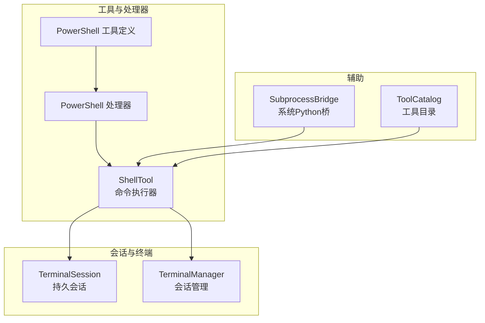
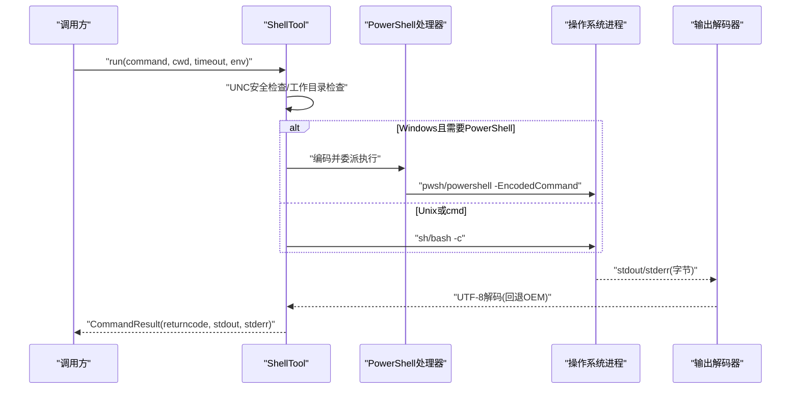
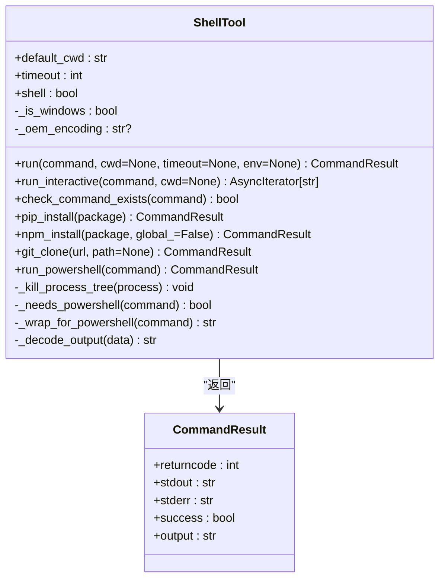
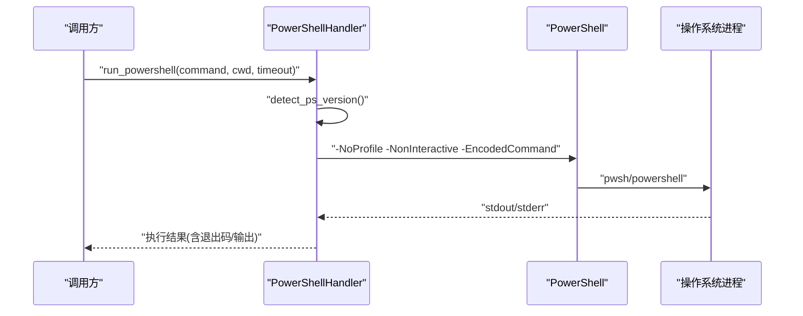
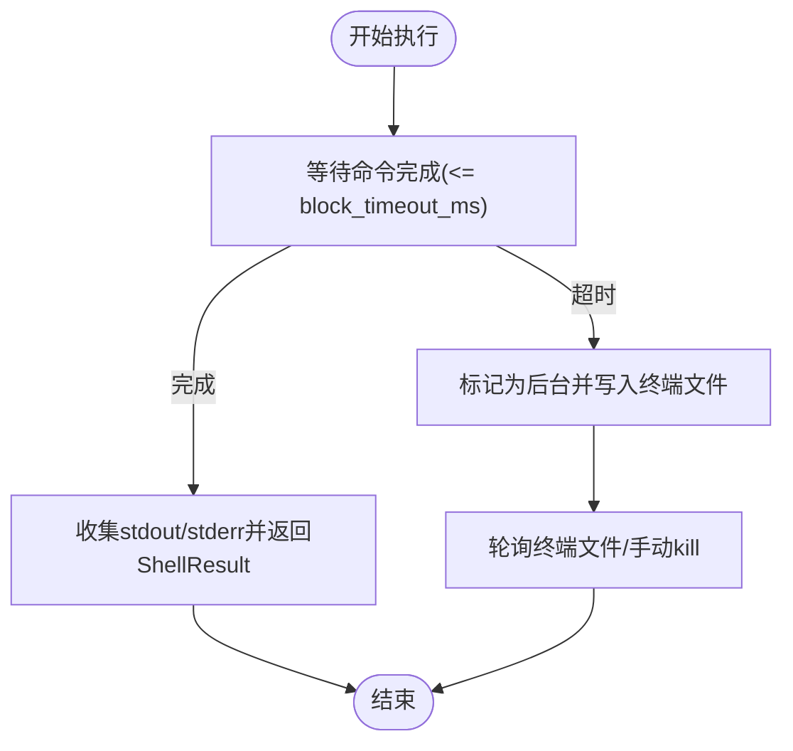
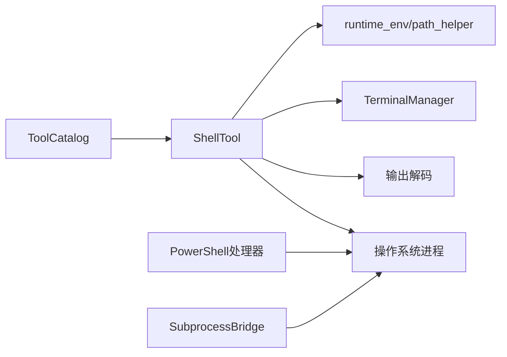

# Shell工具

<cite>
**本文引用的文件**
- [shell.py](file://src/synapse/tools/shell.py)
- [powershell.py](file://src/synapse/tools/definitions/powershell.py)
- [powershell.py](file://src/synapse/tools/handlers/powershell.py)
- [shell_tests.py](file://src/synapse/testing/cases/tools/shell_tests.py)
- [terminal.py](file://src/synapse/tools/terminal.py)
- [filesystem.py](file://src/synapse/tools/handlers/filesystem.py)
- [subprocess_bridge.py](file://src/synapse/tools/subprocess_bridge.py)
- [catalog.py](file://src/synapse/tools/catalog.py)
</cite>

## 目录
1. [简介](#简介)
2. [项目结构](#项目结构)
3. [核心组件](#核心组件)
4. [架构总览](#架构总览)
5. [详细组件分析](#详细组件分析)
6. [依赖分析](#依赖分析)
7. [性能考量](#性能考量)
8. [故障排查指南](#故障排查指南)
9. [结论](#结论)
10. [附录](#附录)

## 简介
本文件面向Shell工具的技术文档，围绕ShellTool类展开，系统阐述其命令执行原理、安全机制、参数校验与跨平台差异，以及进程管理、超时控制、输出捕获与错误处理。同时给出Windows与Unix系统在命令执行、编码处理、路径安全等方面的差异策略，并提供使用示例、性能优化建议与安全配置指导。

## 项目结构
Shell工具相关代码主要分布在以下模块：
- 执行器与工具定义
  - ShellTool类：命令执行、编码处理、进程管理、超时控制、输出解码与错误处理
  - PowerShell专用工具定义与处理器：版本检测、只读命令识别、EncodedCommand沙箱执行
- 会话与终端管理
  - TerminalSession与TerminalManager：持久会话、后台任务、超时自动挂起与输出落盘
- 辅助能力
  - SubprocessBridge：在打包环境下通过系统Python执行可选依赖
  - 工具目录：工具清单与Schema管理

**图表来源**
- [shell.py](file://src/synapse/tools/shell.py)
- [powershell.py](file://src/synapse/tools/definitions/powershell.py)
- [powershell.py](file://src/synapse/tools/handlers/powershell.py)
- [terminal.py](file://src/synapse/tools/terminal.py)
- [subprocess_bridge.py](file://src/synapse/tools/subprocess_bridge.py)
- [catalog.py](file://src/synapse/tools/catalog.py)

**章节来源**
- [shell.py](file://src/synapse/tools/shell.py)
- [powershell.py](file://src/synapse/tools/definitions/powershell.py)
- [powershell.py](file://src/synapse/tools/handlers/powershell.py)
- [terminal.py](file://src/synapse/tools/terminal.py)
- [subprocess_bridge.py](file://src/synapse/tools/subprocess_bridge.py)
- [catalog.py](file://src/synapse/tools/catalog.py)

## 核心组件
- ShellTool：跨平台命令执行器，负责命令预处理、Windows PowerShell自动编码、UTF-8输出解码、进程树安全终止、超时与取消处理、UNC路径安全拦截、macOS PATH增强、打包模式下Python解释器注入。
- PowerShell工具定义与处理器：提供Windows平台首选的PowerShell执行路径，自动检测pwsh/powershell版本，注入UTF-8输出前缀，识别只读命令，执行EncodedCommand沙箱。
- TerminalSession/Manager：持久会话与后台任务支持，长命令超时自动挂起至数据文件，支持轮询监控与手动终止。
- SubprocessBridge：在打包环境中通过系统Python执行需要可选依赖的任务，避免导入失败。
- 工具目录：管理工具Schema与分级披露，高频工具（如run_shell）直接注入LLM工具参数。

**章节来源**
- [shell.py](file://src/synapse/tools/shell.py)
- [powershell.py](file://src/synapse/tools/definitions/powershell.py)
- [powershell.py](file://src/synapse/tools/handlers/powershell.py)
- [terminal.py](file://src/synapse/tools/terminal.py)
- [subprocess_bridge.py](file://src/synapse/tools/subprocess_bridge.py)
- [catalog.py](file://src/synapse/tools/catalog.py)

## 架构总览
Shell工具整体架构由“命令执行器”“PowerShell专用路径”“会话与终端”“辅助桥接”四部分组成，形成“输入参数校验→命令预处理→进程创建→输出解码→结果封装”的闭环，并在Windows平台引入PowerShell编码沙箱与UNC路径安全检查，在Unix平台沿用标准shell执行。

**图表来源**
- [shell.py](file://src/synapse/tools/shell.py)
- [powershell.py](file://src/synapse/tools/handlers/powershell.py)

**章节来源**
- [shell.py](file://src/synapse/tools/shell.py)
- [powershell.py](file://src/synapse/tools/handlers/powershell.py)

## 详细组件分析

### ShellTool类
- 功能职责
  - 命令执行：支持同步与交互式执行，捕获stdout/stderr，返回标准化结果对象。
  - 跨平台适配：Windows自动检测PowerShell需求，Unix使用标准shell；Windows强制UTF-8输出，回退OEM编码。
  - 安全控制：UNC路径检测与拦截；macOS PATH增强；打包模式注入Python解释器；取消与超时安全终止。
  - 工具方法：pip/npm/git等常用命令封装。
- 关键实现点
  - UNC路径安全：命令与工作目录均进行检查，遇UNC直接返回错误。
  - PowerShell自动编码：对cmdlet与显式powershell/pwsh命令进行-EncodedCommand包装，避免转义与引号问题。
  - 进程树安全终止：Windows使用taskkill /T /F，随后wait()带超时，防止僵尸进程与管道阻塞。
  - 输出解码：优先UTF-8，失败则按Windows OEM编码回退，确保中文显示正确。
  - macOS PATH增强：通过登录shell缓存的PATH提升Homebrew/NVM等工具可见性。
  - 打包模式兼容：在冻结环境下将外部Python目录前置到PATH，保证python脚本可执行。
  - 交互式执行：实时流式输出，便于长时间任务监控。
  - 工具方法：pip_install、npm_install、git_clone等，兼容打包环境。

**图表来源**
- [shell.py](file://src/synapse/tools/shell.py)

**章节来源**
- [shell.py](file://src/synapse/tools/shell.py)

### PowerShell工具定义与处理器
- 工具定义（Windows平台）
  - 名称：run_powershell
  - 描述：Windows通用命令执行工具，基于PowerShell，使用-EncodedCommand避免转义问题，输出强制UTF-8。
  - 输入参数：command、working_directory、timeout。
  - 使用场景：PowerShell cmdlet、.NET类型、WMI/CIM查询、注册表、COM对象、管道操作等。
- 处理器
  - 版本检测：优先pwsh，其次powershell，缓存检测结果，注入语法指导。
  - 只读命令识别：基于前缀与精确匹配，便于安全策略判定。
  - EncodedCommand沙箱：UTF-8前缀+Base64 UTF-16LE，跨平台执行。
  - 超时与错误处理：超时kill进程并等待退出，异常记录日志。

**图表来源**
- [powershell.py](file://src/synapse/tools/definitions/powershell.py)
- [powershell.py](file://src/synapse/tools/handlers/powershell.py)

**章节来源**
- [powershell.py](file://src/synapse/tools/definitions/powershell.py)
- [powershell.py](file://src/synapse/tools/handlers/powershell.py)

### 会话与终端管理
- TerminalSession/Manager
  - 持久会话：同一session_id内的命令共享cwd与环境变量，支持链式命令。
  - 超时策略：block_timeout_ms内未完成的命令自动后台运行，输出写入数据文件，支持轮询与手动终止。
  - 后台任务：保护collector_task，避免CancelledError导致的输出丢失。
  - Windows多行python -c修复：检测并写入临时文件执行，规避cmd.exe换行问题。
  - 退出码语义：对grep/egrep/rg/find等常见命令的非错误退出码进行人性化解释。

**图表来源**
- [terminal.py](file://src/synapse/tools/terminal.py)
- [filesystem.py](file://src/synapse/tools/handlers/filesystem.py)

**章节来源**
- [terminal.py](file://src/synapse/tools/terminal.py)
- [filesystem.py](file://src/synapse/tools/handlers/filesystem.py)

### SubprocessBridge（可选依赖桥接）
- 场景：打包环境下无法直接import某些重依赖（如playwright），通过系统Python子进程执行。
- 能力：检查包可用性、执行Python脚本/模块函数、启动Playwright CDP服务。
- 超时与错误：统一超时与异常处理，返回结构化结果。

**章节来源**
- [subprocess_bridge.py](file://src/synapse/tools/subprocess_bridge.py)

### 工具目录（Catalog）
- 作用：管理工具Schema与分级披露，高频工具（如run_shell）直接注入LLM工具参数。
- 影响：ShellTool与PowerShell工具在系统提示与LLM调用中呈现不同的Schema与使用说明。

**章节来源**
- [catalog.py](file://src/synapse/tools/catalog.py)

## 依赖分析
- ShellTool对外部依赖
  - asyncio/subprocess：异步进程创建与通信
  - base64/re：命令编码与正则匹配
  - os/sys/platform：平台判断与环境变量
  - logging：日志记录
  - runtime_env/path_helper：打包环境与PATH增强
- 组件耦合
  - ShellTool与TerminalSession/Manager：通过会话管理实现长命令后台化
  - PowerShell处理器与ShellTool：在Windows平台互为补充，前者专注PowerShell生态，后者提供通用shell执行
  - SubprocessBridge与ShellTool：在打包环境下协同，保障可选依赖可用性

**图表来源**
- [shell.py](file://src/synapse/tools/shell.py)
- [powershell.py](file://src/synapse/tools/handlers/powershell.py)
- [terminal.py](file://src/synapse/tools/terminal.py)
- [subprocess_bridge.py](file://src/synapse/tools/subprocess_bridge.py)
- [catalog.py](file://src/synapse/tools/catalog.py)

**章节来源**
- [shell.py](file://src/synapse/tools/shell.py)
- [powershell.py](file://src/synapse/tools/handlers/powershell.py)
- [terminal.py](file://src/synapse/tools/terminal.py)
- [subprocess_bridge.py](file://src/synapse/tools/subprocess_bridge.py)
- [catalog.py](file://src/synapse/tools/catalog.py)

## 性能考量
- I/O与解码
  - 采用UTF-8优先解码，失败回退Windows OEM编码，避免乱码与二次解码成本。
  - 交互式执行逐行yield，减少内存峰值，适合长时间任务。
- 进程管理
  - Windows进程树安全终止与超时等待，避免僵尸进程与管道阻塞。
  - 长命令自动后台化，避免主线程阻塞，输出落盘便于后续轮询。
- 打包兼容
  - 在冻结环境下将外部Python目录前置到PATH，减少子进程启动开销与失败率。
- 超时与取消
  - 统一超时与取消处理，及时回收资源，避免资源泄露。

[本节为通用性能建议，不直接分析具体文件]

## 故障排查指南
- 常见问题与定位
  - UNC路径被拦截：检查命令与工作目录是否为UNC形式，改用映射盘符。
  - Windows中文乱码：确认UTF-8输出前缀与编码回退逻辑是否生效。
  - PowerShell不可用：在非Windows平台或未安装pwsh时，处理器会返回提示。
  - 长命令卡住：启用会话后台化，读取终端文件或使用kill命令终止。
  - 打包环境导入失败：使用SubprocessBridge通过系统Python执行。
- 日志与调试
  - ShellTool与PowerShell处理器均记录关键事件与错误，便于定位问题。
  - 终端文件包含pid、运行时长与退出码，便于诊断。

**章节来源**
- [shell.py](file://src/synapse/tools/shell.py)
- [powershell.py](file://src/synapse/tools/handlers/powershell.py)
- [terminal.py](file://src/synapse/tools/terminal.py)
- [subprocess_bridge.py](file://src/synapse/tools/subprocess_bridge.py)

## 结论
Shell工具通过ShellTool与PowerShell专用路径实现了跨平台、安全、可控的命令执行能力。其在Windows平台引入PowerShell编码沙箱与UNC安全检查，在Unix平台保持简洁可靠；结合会话与终端管理，支持长时间任务的后台化与可观测性；在打包环境下通过SubprocessBridge保障可选依赖可用。整体设计兼顾安全性、稳定性与易用性。

[本节为总结性内容，不直接分析具体文件]

## 附录

### 命令执行安全机制
- UNC路径安全：命令与工作目录均进行检查，遇UNC直接拦截并返回错误。
- PowerShell编码沙箱：-EncodedCommand（UTF-16LE Base64）绕过多层转义与引号问题，强制UTF-8输出。
- 只读命令识别：PowerShell处理器对只读cmdlet进行识别，便于安全策略判定。
- 进程树安全终止：Windows使用taskkill /T /F，随后wait()带超时，防止僵尸进程。

**章节来源**
- [shell.py](file://src/synapse/tools/shell.py)
- [powershell.py](file://src/synapse/tools/handlers/powershell.py)

### 参数验证与输入规范
- ShellTool.run
  - command：必填，执行的命令字符串
  - cwd：可选，工作目录（若为UNC将被拦截）
  - timeout：可选，超时秒数（默认来自构造函数）
  - env：可选，环境变量覆盖
- PowerShell工具
  - command：必填，纯PowerShell语法（无需包裹powershell -Command）
  - working_directory：可选
  - timeout：默认120秒，上限600秒

**章节来源**
- [shell.py](file://src/synapse/tools/shell.py)
- [powershell.py](file://src/synapse/tools/definitions/powershell.py)

### Windows与Unix命令执行差异
- Windows
  - PowerShell自动编码：cmdlet与显式powershell/pwsh命令统一走-EncodedCommand
  - UTF-8输出：chcp 65001 + UTF-8前缀，回退OEM编码
  - Git Bash定位：SYNAPSE_GIT_BASH_PATH、常见路径、PATH查找
  - UNC路径拦截：命令与工作目录均检查
- Unix
  - 标准shell执行，遵循POSIX约定
  - macOS PATH增强：复用登录shell缓存的PATH

**章节来源**
- [shell.py](file://src/synapse/tools/shell.py)

### 进程管理与超时控制
- ShellTool
  - 超时：统一超时等待，失败时安全终止进程树并返回超时结果
  - 取消：CancelledError时立即终止进程树并重新抛出
- PowerShell处理器
  - 超时：超时后kill进程并等待退出
- 会话管理
  - 超时自动后台化，输出写入数据文件，支持轮询与手动终止

**章节来源**
- [shell.py](file://src/synapse/tools/shell.py)
- [powershell.py](file://src/synapse/tools/handlers/powershell.py)
- [terminal.py](file://src/synapse/tools/terminal.py)

### 输出捕获与错误处理
- 输出捕获
  - UTF-8优先解码，失败回退Windows OEM编码
  - 交互式执行逐行yield，适合长时间任务
- 错误处理
  - 统一返回CommandResult，包含returncode、stdout、stderr
  - UNC路径、超时、取消、异常均有明确处理与日志

**章节来源**
- [shell.py](file://src/synapse/tools/shell.py)

### 使用示例与最佳实践
- 基础命令
  - echo、pwd、ls、date、whoami
- 文件操作
  - touch、cat、head/tail、重定向
- Python与包管理
  - python --version、pip list、pip install、npm install
- Git操作
  - git --version、git clone
- 网络测试
  - curl返回HTTP状态码
- 最佳实践
  - 避免UNC路径，使用映射盘符
  - 长命令使用会话后台化，避免阻塞
  - 打包环境下优先使用ShellTool，避免直接import重依赖
  - PowerShell命令无需手动转义，交由编码沙箱处理

**章节来源**
- [shell_tests.py](file://src/synapse/testing/cases/tools/shell_tests.py)

### 安全配置指导
- UNC路径
  - 禁止UNC路径与UNC工作目录，改用本地路径或映射盘符
- PowerShell执行
  - 优先使用-EncodedCommand沙箱，避免手工转义
  - 识别只读命令，限制高风险操作
- 打包环境
  - 确保外部Python可执行文件路径在PATH中
- 日志与审计
  - 记录命令、工作目录、超时与取消事件，便于审计

**章节来源**
- [shell.py](file://src/synapse/tools/shell.py)
- [powershell.py](file://src/synapse/tools/handlers/powershell.py)