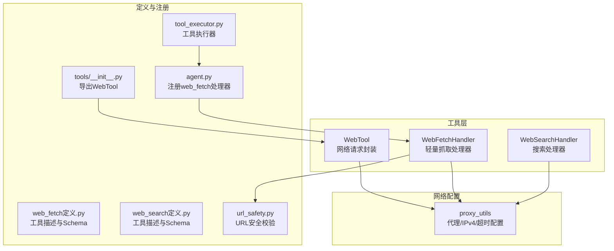
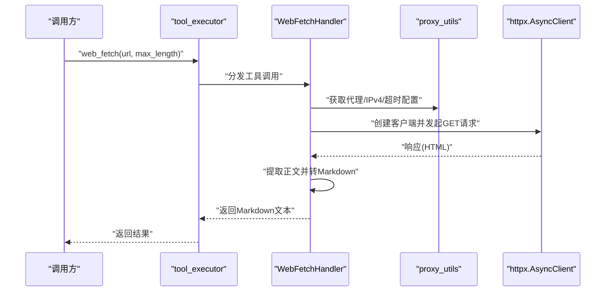
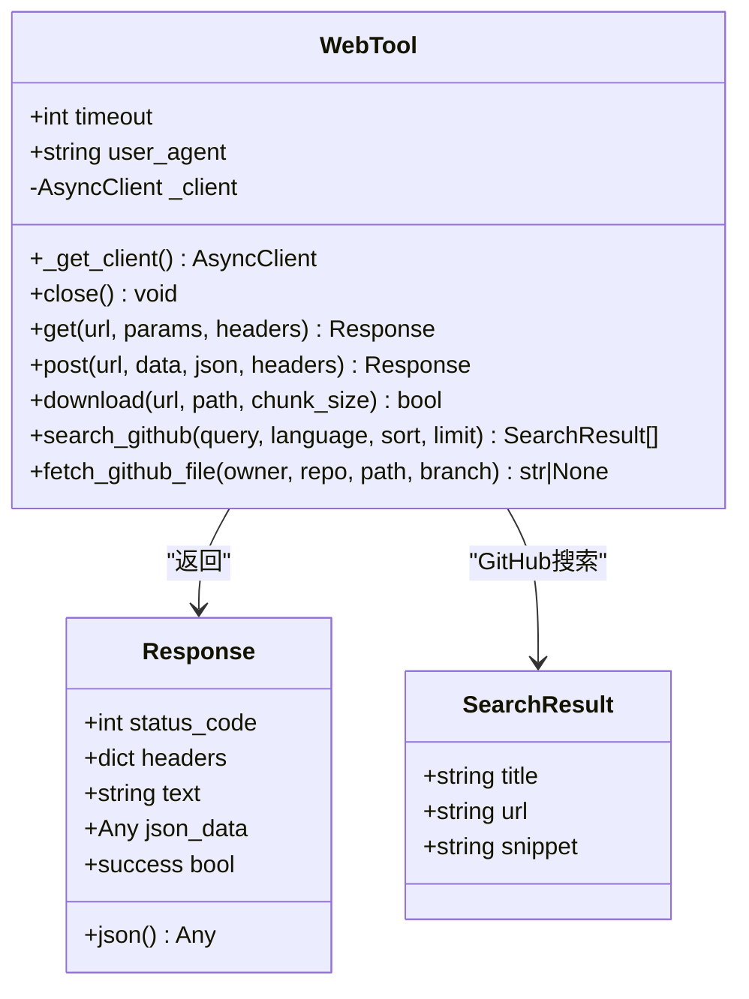
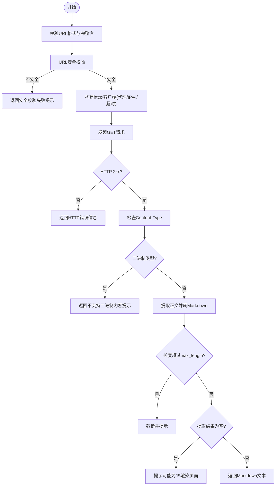
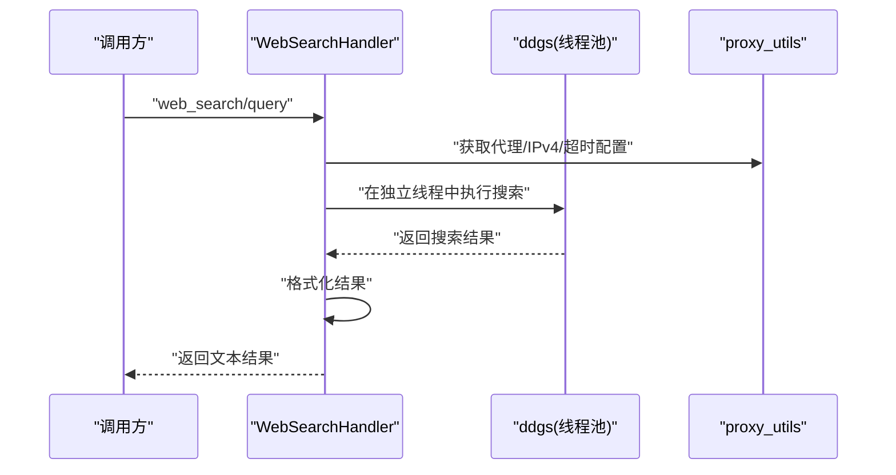
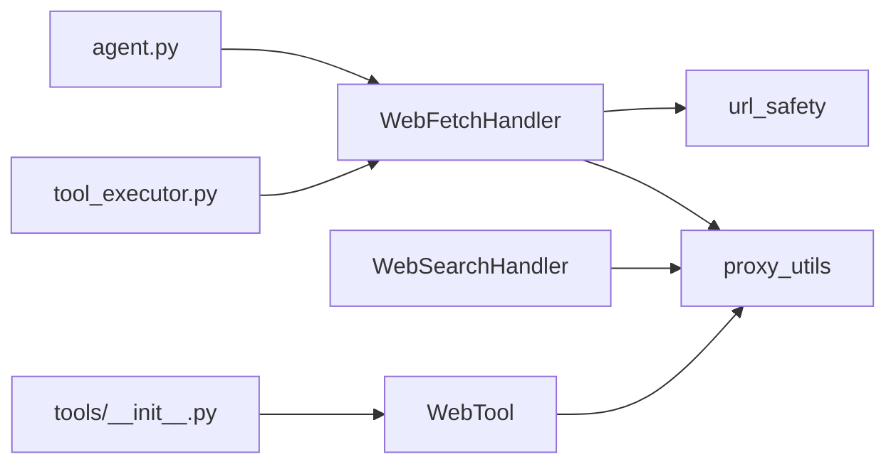

# Web工具

<cite>
**本文引用的文件**
- [web.py](file://src/synapse/tools/web.py)
- [web_fetch.py](file://src/synapse/tools/handlers/web_fetch.py)
- [web_search.py](file://src/synapse/tools/handlers/web_search.py)
- [proxy_utils.py](file://src/synapse/llm/providers/proxy_utils.py)
- [web_fetch定义.py](file://src/synapse/tools/definitions/web_fetch.py)
- [web_search定义.py](file://src/synapse/tools/definitions/web_search.py)
- [web_search测试.py](file://src/synapse/testing/cases/search/web_search.py)
- [tools/__init__.py](file://src/synapse/tools/__init__.py)
- [agent.py](file://src/synapse/core/agent.py)
- [tool_executor.py](file://src/synapse/core/tool_executor.py)
- [url_safety.py](file://src/synapse/utils/url_safety.py)
</cite>

## 目录
1. [简介](#简介)
2. [项目结构](#项目结构)
3. [核心组件](#核心组件)
4. [架构总览](#架构总览)
5. [详细组件分析](#详细组件分析)
6. [依赖分析](#依赖分析)
7. [性能考虑](#性能考虑)
8. [故障排除指南](#故障排除指南)
9. [结论](#结论)
10. [附录](#附录)

## 简介
本文件面向Web工具的使用者与维护者，系统性阐述Web工具的实现原理、HTTP请求处理、网页抓取与内容解析机制，并覆盖以下主题：
- 网页内容提取与Markdown转换
- API调用封装与数据格式转换
- 错误重试策略与代理配置
- 请求头设置、Cookie管理与反爬虫应对
- 使用示例、性能优化建议与稳定性保障措施

## 项目结构
Web工具相关代码主要分布在如下位置：
- 核心网络请求与工具封装：src/synapse/tools/web.py
- 轻量网页抓取处理器：src/synapse/tools/handlers/web_fetch.py
- 搜索处理器：src/synapse/tools/handlers/web_search.py
- 代理与网络配置工具：src/synapse/llm/providers/proxy_utils.py
- 工具定义与输入规范：src/synapse/tools/definitions/*.py
- 测试用例与使用示例：src/synapse/testing/cases/search/web_search.py
- 工具注册与集成入口：src/synapse/tools/__init__.py、src/synapse/core/agent.py、src/synapse/core/tool_executor.py
- URL安全校验：src/synapse/utils/url_safety.py

**图表来源**
- [web.py:1-270](file://src/synapse/tools/web.py#L1-L270)
- [web_fetch.py:1-144](file://src/synapse/tools/handlers/web_fetch.py#L1-L144)
- [web_search.py:1-175](file://src/synapse/tools/handlers/web_search.py#L1-L175)
- [proxy_utils.py:1-388](file://src/synapse/llm/providers/proxy_utils.py#L1-L388)
- [web_fetch定义.py:1-47](file://src/synapse/tools/definitions/web_fetch.py#L1-L47)
- [web_search定义.py:1-124](file://src/synapse/tools/definitions/web_search.py#L1-L124)
- [tools/__init__.py:1-88](file://src/synapse/tools/__init__.py#L1-L88)
- [agent.py:83](file://src/synapse/core/agent.py#L83)
- [agent.py:1281](file://src/synapse/core/agent.py#L1281)
- [tool_executor.py:175](file://src/synapse/core/tool_executor.py#L175)
- [url_safety.py](file://src/synapse/utils/url_safety.py)

**章节来源**
- [web.py:1-270](file://src/synapse/tools/web.py#L1-L270)
- [web_fetch.py:1-144](file://src/synapse/tools/handlers/web_fetch.py#L1-L144)
- [web_search.py:1-175](file://src/synapse/tools/handlers/web_search.py#L1-L175)
- [proxy_utils.py:1-388](file://src/synapse/llm/providers/proxy_utils.py#L1-L388)
- [web_fetch定义.py:1-47](file://src/synapse/tools/definitions/web_fetch.py#L1-L47)
- [web_search定义.py:1-124](file://src/synapse/tools/definitions/web_search.py#L1-L124)
- [tools/__init__.py:1-88](file://src/synapse/tools/__init__.py#L1-L88)
- [agent.py:83](file://src/synapse/core/agent.py#L83)
- [agent.py:1281](file://src/synapse/core/agent.py#L1281)
- [tool_executor.py:175](file://src/synapse/core/tool_executor.py#L175)
- [url_safety.py](file://src/synapse/utils/url_safety.py)

## 核心组件
- WebTool：基于httpx的异步HTTP客户端封装，提供GET/POST/下载、GitHub搜索与文件读取等能力；统一通过代理与网络配置工具进行连接建立。
- WebFetchHandler：轻量网页抓取处理器，直接HTTP请求目标URL，提取正文并转换为Markdown；内置URL安全校验与内容类型过滤。
- WebSearchHandler：基于ddgs库的网页与新闻搜索处理器，支持地区、安全搜索等级与时间范围等参数；通过线程池避免阻塞事件循环。
- 代理与网络配置：proxy_utils提供代理检测、可达性验证、IPv4-only模式、超时构建与错误链提取等能力，确保稳定连接。

**章节来源**
- [web.py:42-270](file://src/synapse/tools/web.py#L42-L270)
- [web_fetch.py:18-144](file://src/synapse/tools/handlers/web_fetch.py#L18-L144)
- [web_search.py:53-175](file://src/synapse/tools/handlers/web_search.py#L53-L175)
- [proxy_utils.py:204-330](file://src/synapse/llm/providers/proxy_utils.py#L204-L330)

## 架构总览
Web工具的调用链路如下：
- 工具注册：WebTool在tools/__init__.py中导出；web_fetch处理器在agent.py中注册。
- 执行流程：tool_executor根据工具名称分发到对应处理器；WebTool在web.py中封装HTTP请求。
- 网络配置：proxy_utils统一管理代理、IPv4-only与超时，WebTool与WebFetchHandler均复用该配置。

**图表来源**
- [web_fetch.py:24-95](file://src/synapse/tools/handlers/web_fetch.py#L24-L95)
- [proxy_utils.py:305-330](file://src/synapse/llm/providers/proxy_utils.py#L305-L330)
- [agent.py:1281](file://src/synapse/core/agent.py#L1281)
- [tool_executor.py:175](file://src/synapse/core/tool_executor.py#L175)

## 详细组件分析

### WebTool：网络请求与内容封装
- 功能要点
  - 异步HTTP客户端：统一通过proxy_utils构建httpx.AsyncClient，设置User-Agent、跟随重定向与信任环境开关。
  - GET/POST：自动尝试解析JSON，封装为Response对象，包含状态码、头部、文本与JSON数据。
  - 下载：流式下载文件，支持分块写入与目录自动创建。
  - GitHub搜索与文件读取：封装GitHub API查询与原始文件读取，便于知识检索与代码抓取。
- 数据结构
  - Response：包含状态码、headers、text、json_data与success属性。
  - SearchResult：用于GitHub搜索结果的标题、URL与摘要。
- 错误处理
  - 捕获异常并返回包含错误信息的Response；下载失败返回False。
- 性能特性
  - 单实例客户端复用，减少连接开销；流式下载降低内存占用。

**图表来源**
- [web.py:42-270](file://src/synapse/tools/web.py#L42-L270)

**章节来源**
- [web.py:42-270](file://src/synapse/tools/web.py#L42-L270)

### WebFetchHandler：轻量网页抓取与内容解析
- 功能要点
  - 参数校验：URL非空、完整协议与主机名；安全校验通过后才发起请求。
  - 请求与响应：使用httpx异步客户端，设置User-Agent与Accept头；拒绝二进制内容类型。
  - 内容提取：优先使用trafilatura；其次使用readability；最后回退正则清理HTML。
  - 截断与空内容提示：根据max_length截断并提示；若提取为空，提示可能为JS渲染页面。
- 错误处理
  - HTTP状态错误、超时、导入缺失与通用异常均有明确错误消息。
- 反爬虫与合规
  - 设置合理的User-Agent与Accept头；安全校验禁止内网/本地URL；二进制内容直接拒绝。

**图表来源**
- [web_fetch.py:29-95](file://src/synapse/tools/handlers/web_fetch.py#L29-L95)
- [url_safety.py](file://src/synapse/utils/url_safety.py)

**章节来源**
- [web_fetch.py:18-144](file://src/synapse/tools/handlers/web_fetch.py#L18-L144)
- [url_safety.py](file://src/synapse/utils/url_safety.py)

### WebSearchHandler：网页与新闻搜索
- 功能要点
  - 使用ddgs库在独立线程中执行搜索，避免阻塞事件循环。
  - 支持网页搜索与新闻搜索，参数包括query、max_results、region、safesearch、timelimit等。
  - 结果格式化：网页搜索输出标题、链接与摘要；新闻搜索输出标题、来源、日期与摘要。
- 错误处理
  - 导入库缺失时提示安装；异常捕获并记录堆栈，返回可读错误信息。

**图表来源**
- [web_search.py:61-168](file://src/synapse/tools/handlers/web_search.py#L61-L168)
- [proxy_utils.py:305-330](file://src/synapse/llm/providers/proxy_utils.py#L305-L330)

**章节来源**
- [web_search.py:53-175](file://src/synapse/tools/handlers/web_search.py#L53-L175)

### 代理配置、请求头与Cookie管理
- 代理与网络配置
  - 代理检测顺序：环境变量ALL_PROXY/HTTPS_PROXY/HTTP_PROXY，随后配置文件中的all_proxy/https_proxy/http_proxy。
  - 可达性验证：TCP连接测试，不可达时自动降级为直连。
  - IPv4-only：通过FORCE_IPV4或配置开启，强制使用IPv4。
  - 超时构建：支持数值与字典两种形式，合理分配connect/read/write/pool。
  - 错误链提取：遍历异常链，提取底层OSError/SSL错误信息。
- 请求头设置
  - WebTool：固定User-Agent，其余由调用方传入headers覆盖。
  - WebFetchHandler：自定义User-Agent与Accept头，提升兼容性。
- Cookie管理
  - 默认不携带Cookie；如需Cookie，请在headers中显式传入。
- 反爬虫应对
  - 合理的User-Agent与Accept头；安全校验限制内网/本地访问；二进制内容拒绝；必要时使用浏览器工具。

**章节来源**
- [proxy_utils.py:204-388](file://src/synapse/llm/providers/proxy_utils.py#L204-L388)
- [web.py:54-63](file://src/synapse/tools/web.py#L54-L63)
- [web_fetch.py:54-64](file://src/synapse/tools/handlers/web_fetch.py#L54-L64)

### 数据格式转换与API封装
- JSON解析：WebTool在GET/POST响应中尝试解析JSON，封装为Response.json_data。
- 搜索结果：WebSearchHandler将ddgs返回的字典列表格式化为易读文本。
- GitHub集成：WebTool提供search_github与fetch_github_file，简化仓库与文件读取。

**章节来源**
- [web.py:95-104](file://src/synapse/tools/web.py#L95-L104)
- [web_search.py:134-168](file://src/synapse/tools/handlers/web_search.py#L134-L168)
- [web.py:202-270](file://src/synapse/tools/web.py#L202-L270)

### 错误重试策略
- 当前实现未内置自动重试逻辑。建议：
  - 对幂等请求（GET）在上层调用处增加指数退避重试。
  - 对非幂等请求（POST）谨慎重试，必要时结合业务去重。
  - 利用proxy_utils的错误链提取能力定位底层问题（DNS、证书、连接被拒等）。

**章节来源**
- [proxy_utils.py:333-366](file://src/synapse/llm/providers/proxy_utils.py#L333-L366)

## 依赖分析
- 工具导出与注册
  - WebTool在tools/__init__.py中导出，供其他模块使用。
  - web_fetch处理器在agent.py中注册到处理器表，tool_executor根据工具名分发调用。
- 第三方库
  - httpx：异步HTTP客户端。
  - trafilatura/readability：HTML正文提取。
  - ddgs：网页与新闻搜索。
  - synapse.utils.url_safety：URL安全校验。

**图表来源**
- [tools/__init__.py:11](file://src/synapse/tools/__init__.py#L11)
- [agent.py:1281](file://src/synapse/core/agent.py#L1281)
- [tool_executor.py:175](file://src/synapse/core/tool_executor.py#L175)
- [web_fetch.py:40](file://src/synapse/tools/handlers/web_fetch.py#L40)
- [url_safety.py](file://src/synapse/utils/url_safety.py)

**章节来源**
- [tools/__init__.py:1-88](file://src/synapse/tools/__init__.py#L1-L88)
- [agent.py:83](file://src/synapse/core/agent.py#L83)
- [agent.py:1281](file://src/synapse/core/agent.py#L1281)
- [tool_executor.py:175](file://src/synapse/core/tool_executor.py#L175)

## 性能考虑
- 客户端复用：WebTool与WebFetchHandler均通过统一工厂方法获取httpx.AsyncClient，避免频繁创建连接。
- 流式下载：WebTool.download采用异步流式读取与分块写入，降低内存峰值。
- 代理与IPv4：proxy_utils提供代理可达性验证与IPv4-only模式，减少因网络环境导致的连接失败与延迟。
- 搜索并发：WebSearchHandler在独立线程中执行ddgs，避免阻塞主事件循环。
- 建议
  - 对高频GET请求设置合理的超时与重试策略。
  - 对大文件下载使用较大的chunk_size以提升吞吐。
  - 在复杂网络环境下启用IPv4-only模式以规避IPv6兼容问题。

**章节来源**
- [web.py:54-63](file://src/synapse/tools/web.py#L54-L63)
- [web.py:177-194](file://src/synapse/tools/web.py#L177-L194)
- [proxy_utils.py:269-330](file://src/synapse/llm/providers/proxy_utils.py#L269-L330)
- [web_search.py:87-93](file://src/synapse/tools/handlers/web_search.py#L87-L93)

## 故障排除指南
- 代理相关
  - 症状：请求超时或连接被拒。
  - 排查：检查环境变量与配置文件中的代理设置；确认代理可达性；必要时设置DISABLE_PROXY=1禁用代理。
- IPv6/IPv4
  - 症状：部分网络环境无法解析或连接失败。
  - 解决：设置FORCE_IPV4=true启用IPv4-only模式。
- URL安全
  - 症状：提示URL安全检查失败。
  - 解决：使用浏览器工具访问本地/内网服务，不要通过web_fetch访问。
- 内容类型
  - 症状：提示不支持二进制内容。
  - 解决：改用下载或浏览器工具处理媒体/PDF文件。
- 搜索失败
  - 症状：ddgs导入失败或搜索异常。
  - 解决：安装ddgs；检查网络与代理；查看错误日志中的异常链。

**章节来源**
- [proxy_utils.py:204-246](file://src/synapse/llm/providers/proxy_utils.py#L204-L246)
- [proxy_utils.py:249-287](file://src/synapse/llm/providers/proxy_utils.py#L249-L287)
- [web_fetch.py:42-44](file://src/synapse/tools/handlers/web_fetch.py#L42-L44)
- [web_fetch.py:76-77](file://src/synapse/tools/handlers/web_fetch.py#L76-L77)
- [web_search.py:80-84](file://src/synapse/tools/handlers/web_search.py#L80-L84)

## 结论
Web工具通过统一的网络配置与简洁的API设计，提供了高效、稳定的HTTP请求与网页抓取能力。配合代理与IPv4-only模式，可在复杂网络环境中保持高成功率；通过安全校验与内容类型过滤，降低了风险。建议在生产环境中结合错误链分析与合理的超时/重试策略，进一步提升稳定性与性能。

## 附录

### 使用示例与最佳实践
- 基础GET/POST
  - 使用WebTool.get/post发送请求，必要时在headers中传入Cookie或自定义头。
- 轻量网页抓取
  - 使用web_fetch工具读取公开URL内容，设置max_length控制输出长度。
- 搜索与下载
  - 使用web_search进行实时信息检索；使用WebTool.download下载文件。
- GitHub集成
  - 使用search_github与fetch_github_file获取仓库与文件内容。

**章节来源**
- [web.py:71-154](file://src/synapse/tools/web.py#L71-L154)
- [web_fetch定义.py:7-46](file://src/synapse/tools/definitions/web_fetch.py#L7-L46)
- [web_search定义.py:9-123](file://src/synapse/tools/definitions/web_search.py#L9-L123)
- [web_search测试.py:48-111](file://src/synapse/testing/cases/search/web_search.py#L48-L111)