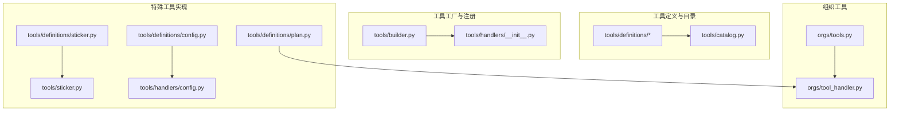
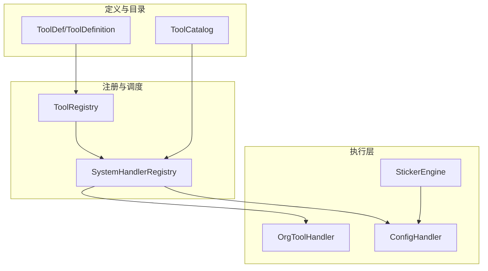
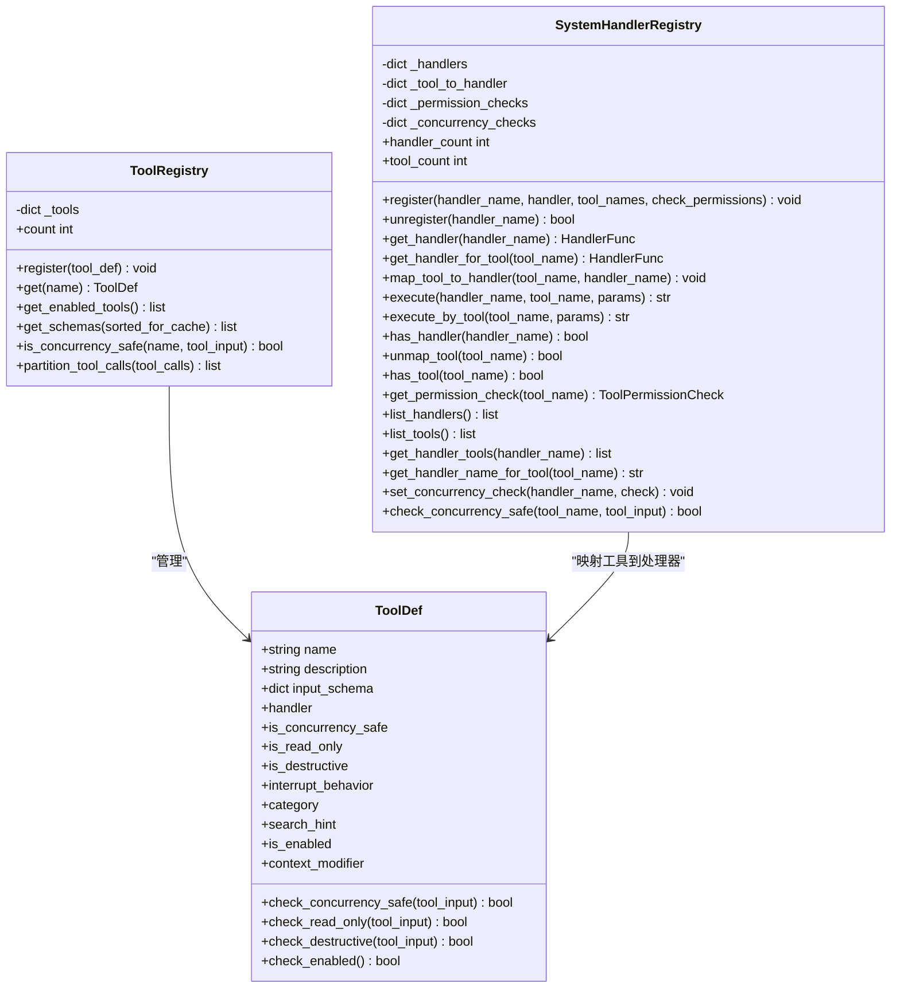
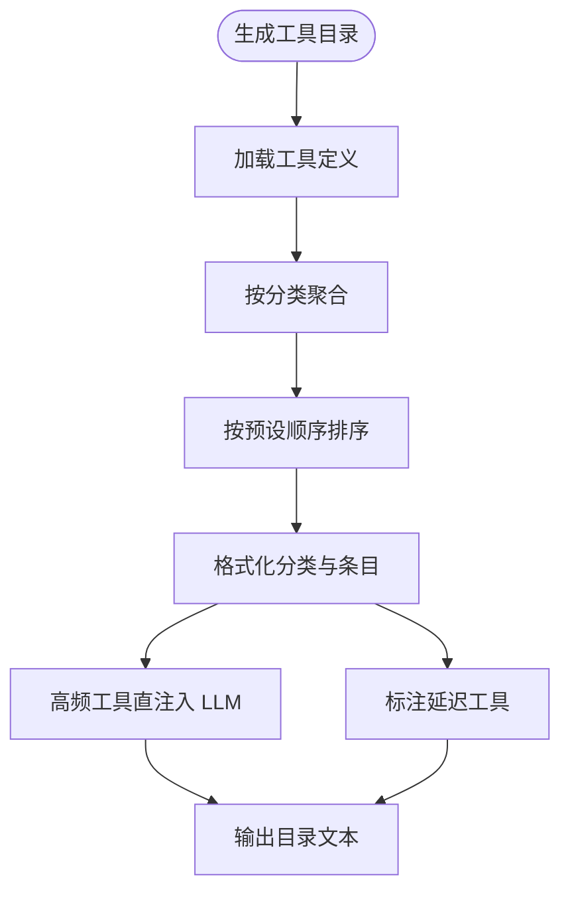
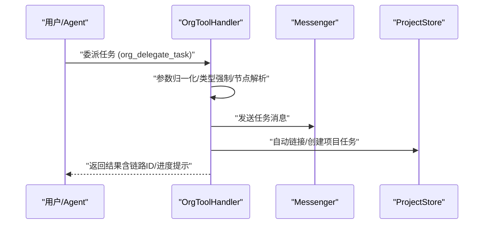
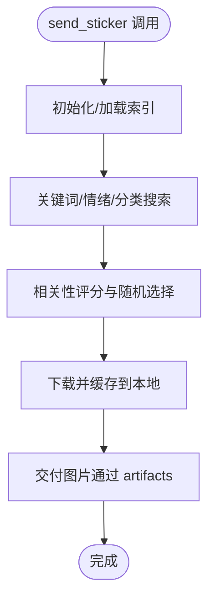
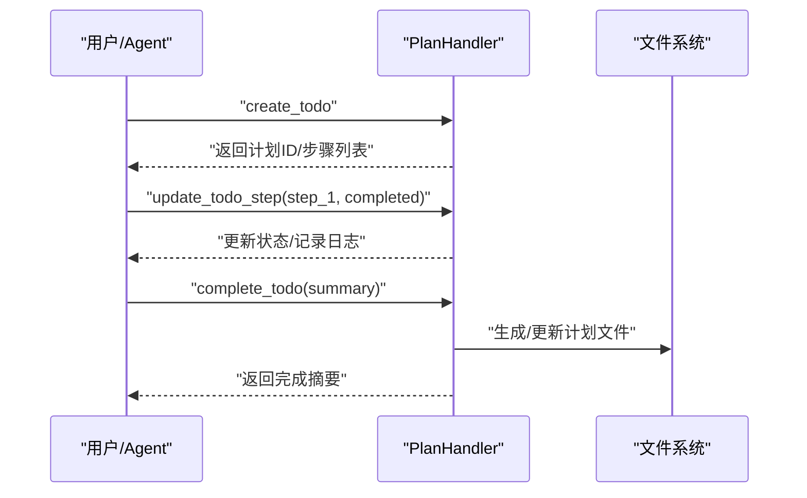
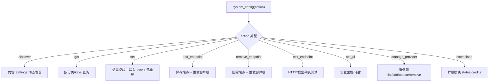
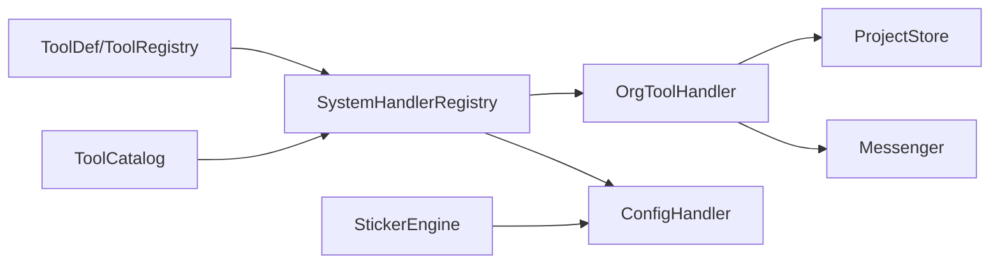

# 实用工具

<cite>
**本文档引用的文件**
- [tools/__init__.py](file://src/synapse/tools/__init__.py)
- [tools/builder.py](file://src/synapse/tools/builder.py)
- [tools/catalog.py](file://src/synapse/tools/catalog.py)
- [tools/definitions/base.py](file://src/synapse/tools/definitions/base.py)
- [tools/definitions/sticker.py](file://src/synapse/tools/definitions/sticker.py)
- [tools/definitions/plan.py](file://src/synapse/tools/definitions/plan.py)
- [tools/definitions/config.py](file://src/synapse/tools/definitions/config.py)
- [tools/handlers/__init__.py](file://src/synapse/tools/handlers/__init__.py)
- [tools/handlers/config.py](file://src/synapse/tools/handlers/config.py)
- [tools/sticker.py](file://src/synapse/tools/sticker.py)
- [orgs/tools.py](file://src/synapse/orgs/tools.py)
- [orgs/tool_handler.py](file://src/synapse/orgs/tool_handler.py)
</cite>

## 目录
1. [简介](#简介)
2. [项目结构](#项目结构)
3. [核心组件](#核心组件)
4. [架构总览](#架构总览)
5. [详细组件分析](#详细组件分析)
6. [依赖分析](#依赖分析)
7. [性能考虑](#性能考虑)
8. [故障排查指南](#故障排查指南)
9. [结论](#结论)
10. [附录](#附录)

## 简介
本文件面向“实用工具”体系，系统性阐述工具定义系统、处理器架构、工具注册机制、参数验证、结果处理与错误恢复，并结合贴纸工具、计划工具、配置工具等典型场景，给出使用示例、扩展开发指南与最佳实践。目标读者既包括一线开发者，也包括需要理解系统能力边界与使用方法的产品与运营人员。

## 项目结构
实用工具体系主要分布在以下模块：
- 工具定义与目录：tools/definitions、tools/catalog.py
- 工具工厂与注册：tools/builder.py、tools/handlers/__init__.py
- 组织专用工具：orgs/tools.py、orgs/tool_handler.py
- 特殊工具实现：tools/sticker.py（表情包）、tools/definitions/sticker.py、tools/definitions/plan.py、tools/definitions/config.py、tools/handlers/config.py

图表来源
- [tools/catalog.py:66-121](file://src/synapse/tools/catalog.py#L66-L121)
- [tools/builder.py:106-176](file://src/synapse/tools/builder.py#L106-L176)
- [tools/handlers/__init__.py:23-104](file://src/synapse/tools/handlers/__init__.py#L23-L104)
- [orgs/tools.py:10-557](file://src/synapse/orgs/tools.py#L10-L557)
- [orgs/tool_handler.py:36-82](file://src/synapse/orgs/tool_handler.py#L36-L82)
- [tools/sticker.py:35-102](file://src/synapse/tools/sticker.py#L35-L102)
- [tools/definitions/sticker.py:8-59](file://src/synapse/tools/definitions/sticker.py#L8-L59)
- [tools/definitions/plan.py:15-238](file://src/synapse/tools/definitions/plan.py#L15-L238)
- [tools/definitions/config.py:8-310](file://src/synapse/tools/definitions/config.py#L8-L310)
- [tools/handlers/config.py:228-266](file://src/synapse/tools/handlers/config.py#L228-L266)

章节来源
- [tools/__init__.py:1-88](file://src/synapse/tools/__init__.py#L1-L88)

## 核心组件
- 工具定义系统
  - ToolDef：声明式工具定义，支持行为标志（并发安全、只读、破坏性）、中断策略、分类、搜索提示、上下文修饰器等。
  - ToolRegistry：基于 ToolDef 的注册表，提供注册、查询、Schema生成、并发分批等能力。
- 工具目录系统
  - ToolCatalog：生成分级工具清单（Level 1），支持高频工具直注入LLM、延迟工具标注、分类排序与显示名映射。
- 处理器注册与执行
  - SystemHandlerRegistry：系统技能处理器注册表，支持按工具名映射处理器、权限回调、并发检查回调、异步执行。
- 组织工具
  - ORG_NODE_TOOLS：组织节点专属工具集合，涵盖通信、组织感知、记忆、制度流程、人事管理、会议、定时任务、任务交付与验收、工具授权等。
  - OrgToolHandler：组织工具执行器，负责参数归一化、类型强制、节点引用解析、项目任务联动、执行日志与进度计算。
- 特殊工具
  - 表情包引擎 StickerEngine：关键词/情绪搜索、镜像下载、本地缓存、发送链路。
  - 配置工具 system_config：统一配置发现、查看、修改、端点管理、UI偏好、服务商管理、扩展模块管理。
  - 计划工具 Todo/Plan：任务计划创建、步骤更新、状态查询、完成总结；结构化计划文件创建与审批。

章节来源
- [tools/builder.py:29-176](file://src/synapse/tools/builder.py#L29-L176)
- [tools/catalog.py:66-383](file://src/synapse/tools/catalog.py#L66-L383)
- [tools/handlers/__init__.py:23-287](file://src/synapse/tools/handlers/__init__.py#L23-L287)
- [orgs/tools.py:10-557](file://src/synapse/orgs/tools.py#L10-L557)
- [orgs/tool_handler.py:36-82](file://src/synapse/orgs/tool_handler.py#L36-L82)
- [tools/sticker.py:35-330](file://src/synapse/tools/sticker.py#L35-L330)
- [tools/definitions/config.py:8-310](file://src/synapse/tools/definitions/config.py#L8-L310)
- [tools/definitions/plan.py:15-238](file://src/synapse/tools/definitions/plan.py#L15-L238)

## 架构总览
实用工具系统采用“定义-目录-注册-执行”的分层架构：
- 定义层：ToolDef/ToolDefinition 提供统一的工具元数据与Schema。
- 目录层：ToolCatalog 生成分级清单，支持高频工具直注入与延迟工具标注。
- 注册层：ToolRegistry/SystemHandlerRegistry 提供注册、并发分批、权限与并发检查。
- 执行层：各工具处理器（含 OrgToolHandler、ConfigHandler、StickerEngine）负责参数归一化、业务逻辑、结果封装与错误恢复。

图表来源
- [tools/builder.py:106-176](file://src/synapse/tools/builder.py#L106-L176)
- [tools/catalog.py:66-121](file://src/synapse/tools/catalog.py#L66-L121)
- [tools/handlers/__init__.py:23-104](file://src/synapse/tools/handlers/__init__.py#L23-L104)
- [orgs/tool_handler.py:36-82](file://src/synapse/orgs/tool_handler.py#L36-L82)
- [tools/handlers/config.py:228-266](file://src/synapse/tools/handlers/config.py#L228-L266)
- [tools/sticker.py:35-102](file://src/synapse/tools/sticker.py#L35-L102)

## 详细组件分析

### 工具定义系统与注册机制
- ToolDef 与 ToolRegistry
  - ToolDef 提供默认行为标志（并发安全、只读、破坏性、中断策略、分类、搜索提示、启用开关、上下文修饰器）。
  - ToolRegistry 提供注册、查询、Schema生成、并发分批（将工具调用按并发安全与否分区）。
- SystemHandlerRegistry
  - 支持处理器注册（含权限检查回调、并发检查回调）、按工具名映射、异步执行、工具/处理器计数等。

图表来源
- [tools/builder.py:29-176](file://src/synapse/tools/builder.py#L29-L176)
- [tools/handlers/__init__.py:23-287](file://src/synapse/tools/handlers/__init__.py#L23-L287)

章节来源
- [tools/builder.py:29-176](file://src/synapse/tools/builder.py#L29-L176)
- [tools/handlers/__init__.py:23-287](file://src/synapse/tools/handlers/__init__.py#L23-L287)

### 工具目录系统（ToolCatalog）
- 生成分级清单（Level 1），支持：
  - 分类排序与显示名映射
  - 高频工具（如 run_shell/read_file/write_file/list_directory 等）直注入 LLM tools 参数
  - 延迟工具标注（deferred）
  - 工具信息格式化（Level 2：detail/triggers/prerequisites/examples/warnings/related_tools）
- 提供工具组构建、缓存失效、工具存在性检查等。

图表来源
- [tools/catalog.py:183-261](file://src/synapse/tools/catalog.py#L183-L261)
- [tools/catalog.py:347-516](file://src/synapse/tools/catalog.py#L347-L516)

章节来源
- [tools/catalog.py:66-383](file://src/synapse/tools/catalog.py#L66-L383)

### 组织工具（OrgToolHandler）
- 职责
  - 参数归一化与类型强制（优先级、带宽限制、数组/枚举/浮点等）
  - 节点引用解析（支持角色名/ID别名）
  - 项目任务自动联动（链路ID、父子关系、进度计算）
  - 执行日志追加、计划工具桥接（创建/更新/完成）
- 典型工具
  - 通信：发送消息、回复消息、委派任务、上报、广播
  - 组织感知：组织架构、同事查找、节点状态、组织状态
  - 记忆：黑板读写、部门/节点记忆
  - 制度流程：制度列表/读取/搜索、人事管理（冻结/解冻/申请克隆/裁撤）
  - 会议：请求会议
  - 定时任务：创建/列出/分配/指定
  - 任务交付与验收：提交/验收/打回
  - 工具申请/授权/收回
  - 项目任务：进度汇报、查询、列表、更新、创建

图表来源
- [orgs/tool_handler.py:473-602](file://src/synapse/orgs/tool_handler.py#L473-L602)
- [orgs/tool_handler.py:156-268](file://src/synapse/orgs/tool_handler.py#L156-L268)

章节来源
- [orgs/tools.py:10-557](file://src/synapse/orgs/tools.py#L10-L557)
- [orgs/tool_handler.py:36-82](file://src/synapse/orgs/tool_handler.py#L36-L82)

### 表情包工具（StickerEngine 与 send_sticker）
- StickerEngine
  - 初始化：加载/下载索引、构建关键词与分类索引
  - 搜索：关键词/情绪/分类组合，相关性评分与随机打散
  - 下载与缓存：MD5命名、镜像URL尝试、本地缓存
- 工具定义
  - send_sticker：支持关键词/情绪二选一搜索，可选分类过滤

图表来源
- [tools/sticker.py:69-102](file://src/synapse/tools/sticker.py#L69-L102)
- [tools/sticker.py:180-244](file://src/synapse/tools/sticker.py#L180-L244)
- [tools/sticker.py:271-301](file://src/synapse/tools/sticker.py#L271-L301)
- [tools/definitions/sticker.py:8-59](file://src/synapse/tools/definitions/sticker.py#L8-L59)

章节来源
- [tools/sticker.py:35-330](file://src/synapse/tools/sticker.py#L35-L330)
- [tools/definitions/sticker.py:8-59](file://src/synapse/tools/definitions/sticker.py#L8-L59)

### 计划工具（Todo/Plan）
- Todo 工具
  - create_todo：创建结构化任务计划（步骤、依赖、技能关联、所有者等）
  - update_todo_step：更新步骤状态（pending/in_progress/completed/failed/skipped）
  - get_todo_status：查看执行状态与日志
  - complete_todo：完成计划并生成摘要
- Plan 工具
  - create_plan_file：创建结构化计划文件（YAML frontmatter + Markdown body）
  - exit_plan_mode：通知系统规划完成，触发审批UI

图表来源
- [tools/definitions/plan.py:15-238](file://src/synapse/tools/definitions/plan.py#L15-L238)
- [orgs/tool_handler.py:305-381](file://src/synapse/orgs/tool_handler.py#L305-L381)

章节来源
- [tools/definitions/plan.py:15-238](file://src/synapse/tools/definitions/plan.py#L15-L238)
- [orgs/tool_handler.py:305-381](file://src/synapse/orgs/tool_handler.py#L305-L381)

### 配置工具（system_config）
- 统一配置入口，支持：
  - discover：动态发现可配置项（按分类过滤）
  - get：查看当前配置（分类/指定key）
  - set：修改配置（类型校验、只读字段拒绝、敏感字段脱敏）
  - 端点管理：add_endpoint/remove_endpoint/test_endpoint
  - UI偏好：set_ui（主题/语言）
  - 服务商管理：manage_provider（list/add/update/remove）
  - 扩展模块：extensions（status/credits）

图表来源
- [tools/definitions/config.py:8-310](file://src/synapse/tools/definitions/config.py#L8-L310)
- [tools/handlers/config.py:228-266](file://src/synapse/tools/handlers/config.py#L228-L266)
- [tools/handlers/config.py:268-800](file://src/synapse/tools/handlers/config.py#L268-L800)

章节来源
- [tools/definitions/config.py:8-310](file://src/synapse/tools/definitions/config.py#L8-L310)
- [tools/handlers/config.py:228-800](file://src/synapse/tools/handlers/config.py#L228-L800)

## 依赖分析
- 工具定义与目录
  - ToolDef/ToolRegistry 与 ToolCatalog 解耦，前者负责定义与注册，后者负责目录生成与格式化。
- 处理器注册与执行
  - SystemHandlerRegistry 通过工具名映射到处理器，支持异步执行与并发检查回调，避免直接耦合具体处理器实现。
- 组织工具
  - OrgToolHandler 依赖组织运行时（OrgRuntime）与消息系统（Messenger）、项目存储（ProjectStore），职责清晰。
- 特殊工具
  - StickerEngine 依赖网络下载与本地缓存，ConfigHandler 依赖配置模型与端点管理。

图表来源
- [tools/builder.py:106-176](file://src/synapse/tools/builder.py#L106-L176)
- [tools/catalog.py:66-121](file://src/synapse/tools/catalog.py#L66-L121)
- [tools/handlers/__init__.py:23-104](file://src/synapse/tools/handlers/__init__.py#L23-L104)
- [orgs/tool_handler.py:36-82](file://src/synapse/orgs/tool_handler.py#L36-L82)
- [tools/sticker.py:35-102](file://src/synapse/tools/sticker.py#L35-L102)
- [tools/handlers/config.py:228-266](file://src/synapse/tools/handlers/config.py#L228-L266)

章节来源
- [tools/builder.py:106-176](file://src/synapse/tools/builder.py#L106-L176)
- [tools/catalog.py:66-121](file://src/synapse/tools/catalog.py#L66-L121)
- [tools/handlers/__init__.py:23-104](file://src/synapse/tools/handlers/__init__.py#L23-L104)
- [orgs/tool_handler.py:36-82](file://src/synapse/orgs/tool_handler.py#L36-L82)
- [tools/sticker.py:35-102](file://src/synapse/tools/sticker.py#L35-L102)
- [tools/handlers/config.py:228-266](file://src/synapse/tools/handlers/config.py#L228-L266)

## 性能考虑
- 工具目录生成
  - ToolCatalog 对工具进行分类聚合与排序，建议在工具数量较大时启用缓存并按需刷新。
- 并发分批
  - ToolRegistry.partition_tool_calls 将并发安全与串行调用分离，提升吞吐同时避免竞态。
- 组织工具
  - 项目任务自动联动与执行日志追加可能产生IO，建议批量更新与限流。
- 表情包
  - StickerEngine 使用本地缓存与镜像URL，建议控制并发下载与缓存命中率。
- 配置变更
  - set 操作涉及 .env 写入与热重载，建议批量变更并避免频繁重启。

## 故障排查指南
- 工具未注册/映射
  - 检查 SystemHandlerRegistry.has_tool 与映射关系，确认处理器已注册且工具名正确。
- 参数类型错误
  - OrgToolHandler._coerce_types 与 ConfigHandler._validate_value 提供类型强制与校验，关注日志与返回信息。
- 节点引用无效
  - OrgToolHandler._resolve_node_refs 支持角色名/ID别名解析，若失败请核对组织结构与节点ID。
- 表情包下载失败
  - StickerEngine 尝试镜像URL，若全部失败请检查网络与缓存目录权限。
- 配置修改被拒绝
  - ConfigHandler 拒绝只读字段与未知字段，检查黑名单与字段存在性。

章节来源
- [tools/handlers/__init__.py:210-247](file://src/synapse/tools/handlers/__init__.py#L210-L247)
- [orgs/tool_handler.py:96-154](file://src/synapse/orgs/tool_handler.py#L96-L154)
- [tools/sticker.py:288-301](file://src/synapse/tools/sticker.py#L288-L301)
- [tools/handlers/config.py:431-533](file://src/synapse/tools/handlers/config.py#L431-L533)

## 结论
实用工具体系通过“定义-目录-注册-执行”的分层设计，实现了工具能力的标准化、可发现与可扩展。组织工具与系统工具分别覆盖组织协作与通用能力，配合严格的参数验证、并发控制与错误恢复，能够稳定支撑复杂场景。建议在扩展新工具时遵循工具定义规范，利用目录系统与处理器注册表，确保一致性与可维护性。

## 附录

### 使用示例（路径指引）
- 组织工具
  - 委派任务：[orgs/tool_handler.py:473-602](file://src/synapse/orgs/tool_handler.py#L473-L602)
  - 广播消息：[orgs/tool_handler.py:624-654](file://src/synapse/orgs/tool_handler.py#L624-L654)
  - 读写黑板：[orgs/tool_handler.py:760-800](file://src/synapse/orgs/tool_handler.py#L760-L800)
- 表情包工具
  - 搜索与发送：[tools/definitions/sticker.py:8-59](file://src/synapse/tools/definitions/sticker.py#L8-L59)、[tools/sticker.py:180-244](file://src/synapse/tools/sticker.py#L180-L244)
- 计划工具
  - 创建计划：[tools/definitions/plan.py:15-92](file://src/synapse/tools/definitions/plan.py#L15-L92)
  - 更新步骤：[tools/definitions/plan.py:93-124](file://src/synapse/tools/definitions/plan.py#L93-L124)
  - 完成计划：[tools/definitions/plan.py:138-155](file://src/synapse/tools/definitions/plan.py#L138-L155)
- 配置工具
  - 查看配置：[tools/definitions/config.py:8-310](file://src/synapse/tools/definitions/config.py#L8-L310)、[tools/handlers/config.py:345-398](file://src/synapse/tools/handlers/config.py#L345-L398)
  - 修改配置：[tools/handlers/config.py:431-533](file://src/synapse/tools/handlers/config.py#L431-L533)
  - 端点管理：[tools/handlers/config.py:599-702](file://src/synapse/tools/handlers/config.py#L599-L702)

### 扩展开发指南
- 定义工具
  - 使用 ToolBuilder 或 ToolDef 构建工具定义，设置描述、触发条件、前置条件、示例、分类等。
  - 参考：[tools/definitions/base.py:424-569](file://src/synapse/tools/definitions/base.py#L424-L569)
- 注册工具
  - 通过 ToolRegistry.register 注册，或通过 SystemHandlerRegistry.register 将工具映射到处理器。
  - 参考：[tools/builder.py:115-118](file://src/synapse/tools/builder.py#L115-L118)、[tools/handlers/__init__.py:53-98](file://src/synapse/tools/handlers/__init__.py#L53-L98)
- 处理器实现
  - 实现处理器函数（支持同步/异步），并在 SystemHandlerRegistry 中注册。
  - 参考：[tools/handlers/config.py:228-266](file://src/synapse/tools/handlers/config.py#L228-L266)
- 组织工具
  - 在 ORG_NODE_TOOLS 中定义工具定义，实现 OrgToolHandler 的 _handle_* 方法。
  - 参考：[orgs/tools.py:10-557](file://src/synapse/orgs/tools.py#L10-L557)、[orgs/tool_handler.py:383-403](file://src/synapse/orgs/tool_handler.py#L383-L403)

### 最佳实践
- 工具定义
  - 明确分类与触发条件，提供示例与警告，保持描述简洁清晰。
- 参数验证
  - 在处理器中进行类型强制与范围校验，必要时使用 ask_user 确认高风险变更。
- 并发与互斥
  - 对破坏性/非幂等工具设置并发安全标志，必要时使用并发分批。
- 错误恢复
  - 统一捕获异常并返回可读错误信息，记录日志以便排查。
- 性能优化
  - 合理使用缓存（目录、表情包缓存），批量更新（项目任务日志、配置变更）。