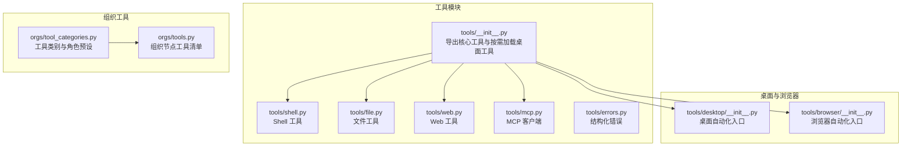
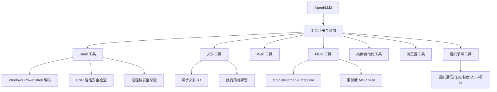
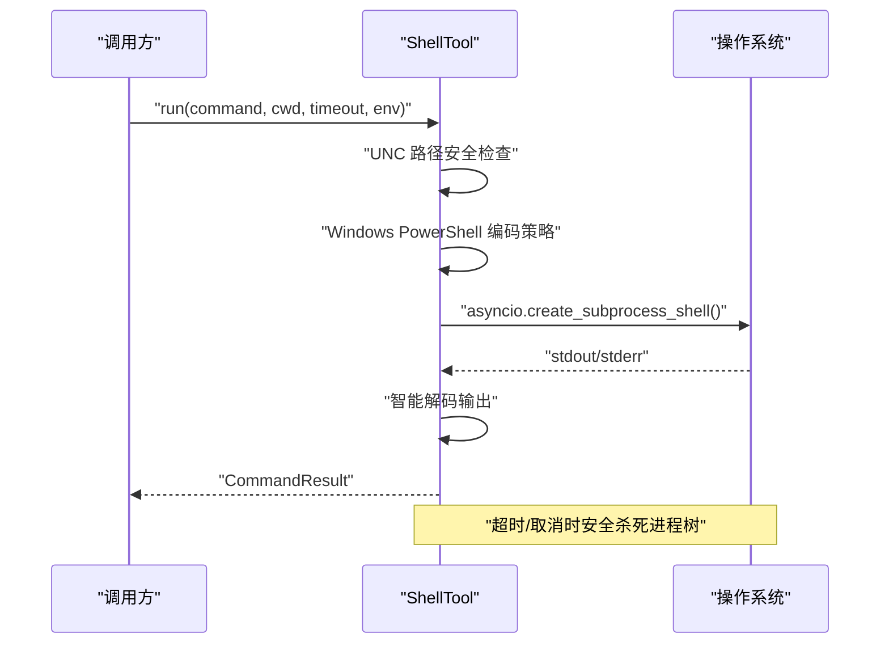
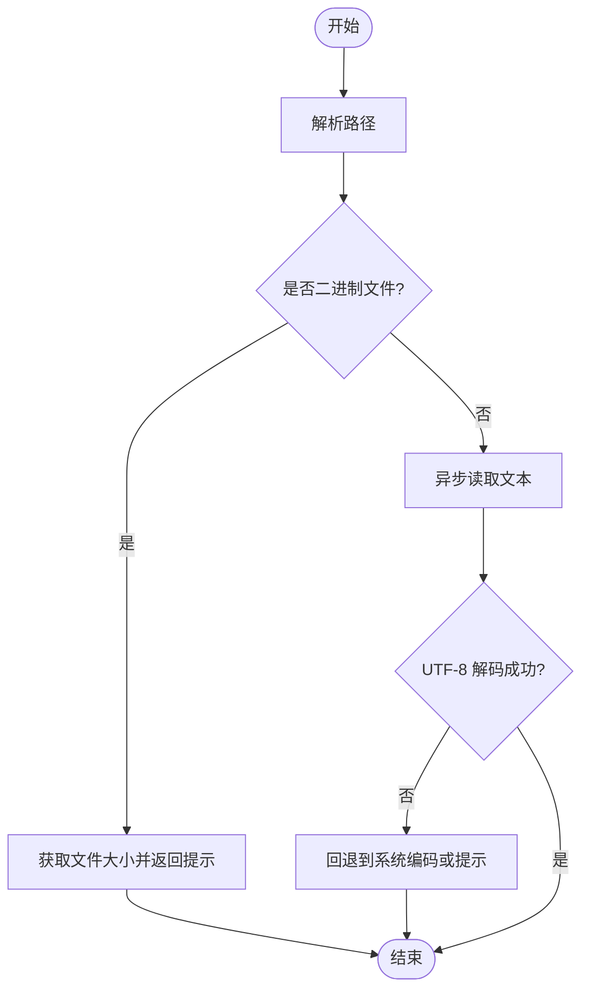
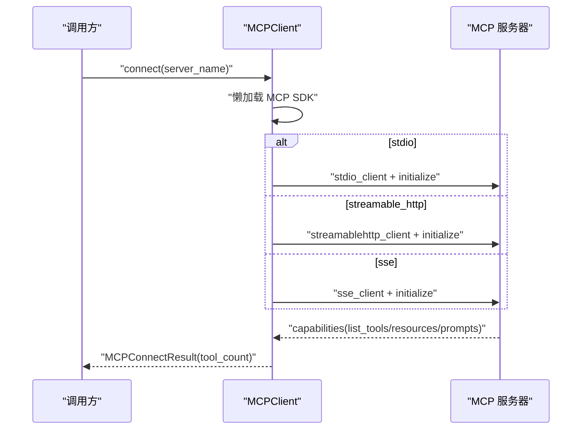
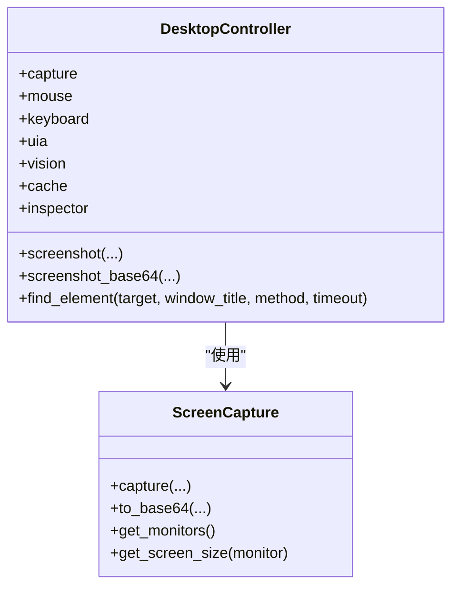
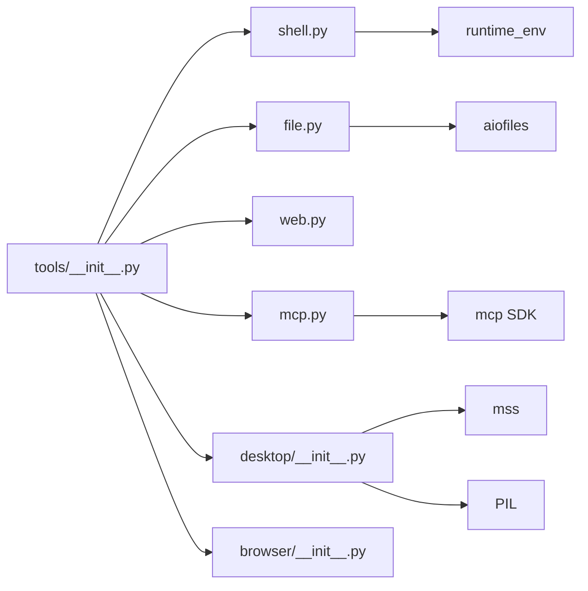

# 工具执行系统

<cite>
**本文档引用的文件**
- [src/synapse/tools/__init__.py](file://src/synapse/tools/__init__.py)
- [src/synapse/tools/shell.py](file://src/synapse/tools/shell.py)
- [src/synapse/tools/file.py](file://src/synapse/tools/file.py)
- [src/synapse/tools/web.py](file://src/synapse/tools/web.py)
- [src/synapse/tools/mcp.py](file://src/synapse/tools/mcp.py)
- [src/synapse/tools/errors.py](file://src/synapse/tools/errors.py)
- [src/synapse/orgs/tool_categories.py](file://src/synapse/orgs/tool_categories.py)
- [src/synapse/orgs/tools.py](file://src/synapse/orgs/tools.py)
- [src/synapse/tools/desktop/__init__.py](file://src/synapse/tools/desktop/__init__.py)
- [src/synapse/tools/browser/__init__.py](file://src/synapse/tools/browser/__init__.py)
</cite>

## 目录
1. [简介](#简介)
2. [项目结构](#项目结构)
3. [核心组件](#核心组件)
4. [架构总览](#架构总览)
5. [详细组件分析](#详细组件分析)
6. [依赖关系分析](#依赖关系分析)
7. [性能考虑](#性能考虑)
8. [故障排查指南](#故障排查指南)
9. [结论](#结论)
10. [附录](#附录)

## 简介
本文件面向“工具执行系统”的技术文档，系统覆盖九类工具：Shell 工具、文件工具、Web 工具、MCP 工具、桌面自动化工具、浏览器工具、组织节点工具、以及错误处理与参数校验体系。文档重点阐述：
- 九类工具的功能特性与适用场景
- 桌面自动化工具的实现原理与安全边界
- Shell 工具的安全执行机制（UNC 路径检查、Windows PowerShell 编码策略、进程树安全杀死）
- 文件工具的操作流程与跨平台兼容性
- 浏览器工具的自动化能力与 WebMCP 集成
- MCP 工具的连接、发现与调用机制
- 工具注册机制、参数验证规则、错误处理策略
- 工具使用示例、性能优化建议与安全配置指导

## 项目结构
工具系统位于 synapse 项目的 tools 子模块，并与 orgs、browser、desktop 等子模块协同工作，形成统一的工具生态。

**图表来源**
- [src/synapse/tools/__init__.py:1-88](file://src/synapse/tools/__init__.py#L1-L88)
- [src/synapse/tools/shell.py:1-617](file://src/synapse/tools/shell.py#L1-L617)
- [src/synapse/tools/file.py:1-492](file://src/synapse/tools/file.py#L1-L492)
- [src/synapse/tools/web.py:1-270](file://src/synapse/tools/web.py#L1-L270)
- [src/synapse/tools/mcp.py:1-800](file://src/synapse/tools/mcp.py#L1-L800)
- [src/synapse/tools/errors.py:1-201](file://src/synapse/tools/errors.py#L1-L201)
- [src/synapse/tools/desktop/__init__.py:1-132](file://src/synapse/tools/desktop/__init__.py#L1-L132)
- [src/synapse/tools/browser/__init__.py:1-30](file://src/synapse/tools/browser/__init__.py#L1-L30)
- [src/synapse/orgs/tool_categories.py:1-173](file://src/synapse/orgs/tool_categories.py#L1-L173)
- [src/synapse/orgs/tools.py:1-557](file://src/synapse/orgs/tools.py#L1-L557)

**章节来源**
- [src/synapse/tools/__init__.py:1-88](file://src/synapse/tools/__init__.py#L1-L88)

## 核心组件
- Shell 工具：跨平台命令执行，Windows 特性包括 PowerShell 命令编码、UTF-8 编码处理、UNC 路径安全检查、进程树安全杀死。
- 文件工具：异步文件读写、编辑、搜索、复制移动、目录操作，支持二进制文件识别与换行风格保留。
- Web 工具：HTTP 客户端封装、下载、GitHub 搜索与文件抓取。
- MCP 工具：MCP 客户端，支持 stdio、streamable_http、sse 三种传输协议，懒加载与自动安装 MCP SDK。
- 桌面自动化工具：基于 UIA 与视觉识别的 Windows 桌面自动化，按需加载，提供统一控制器。
- 浏览器工具：基于 Playwright 的页面自动化与 WebMCP 工具发现/调用。
- 组织节点工具：组织内通信、任务委派、制度流程、人事管理、项目任务等工具清单。
- 错误处理与参数校验：结构化 ToolError，ErrorType 枚举，统一错误分类与提示。

**章节来源**
- [src/synapse/tools/shell.py:121-617](file://src/synapse/tools/shell.py#L121-L617)
- [src/synapse/tools/file.py:37-492](file://src/synapse/tools/file.py#L37-L492)
- [src/synapse/tools/web.py:42-270](file://src/synapse/tools/web.py#L42-L270)
- [src/synapse/tools/mcp.py:244-800](file://src/synapse/tools/mcp.py#L244-L800)
- [src/synapse/tools/desktop/__init__.py:1-132](file://src/synapse/tools/desktop/__init__.py#L1-L132)
- [src/synapse/tools/browser/__init__.py:1-30](file://src/synapse/tools/browser/__init__.py#L1-L30)
- [src/synapse/orgs/tools.py:1-557](file://src/synapse/orgs/tools.py#L1-L557)
- [src/synapse/tools/errors.py:29-201](file://src/synapse/tools/errors.py#L29-L201)

## 架构总览
工具系统采用“按需加载 + 统一抽象 + 结构化错误”的设计：
- 桌面工具按需加载，避免模块级导入阻塞
- Shell 工具在 Windows 上采用 PowerShell 编码策略，规避转义与编码问题
- MCP 客户端支持多种传输协议，具备懒加载与自动安装能力
- 文件工具提供跨平台异步 IO 与换行风格兼容
- 错误处理模块提供统一的错误分类与提示，便于 LLM 决策

**图表来源**
- [src/synapse/tools/__init__.py:25-88](file://src/synapse/tools/__init__.py#L25-L88)
- [src/synapse/tools/shell.py:277-496](file://src/synapse/tools/shell.py#L277-L496)
- [src/synapse/tools/mcp.py:314-790](file://src/synapse/tools/mcp.py#L314-L790)
- [src/synapse/tools/file.py:92-251](file://src/synapse/tools/file.py#L92-L251)
- [src/synapse/orgs/tools.py:10-557](file://src/synapse/orgs/tools.py#L10-L557)

## 详细组件分析

### Shell 工具：跨平台命令执行与安全机制
- 功能特性
  - 跨平台命令执行，支持工作目录、超时、环境变量
  - Windows 上自动检测 PowerShell 命令并进行 UTF-8 Base64 编码，绕过 cmd.exe → PowerShell 的转义问题
  - macOS GUI 应用 PATH 增强，复用 login shell PATH
  - 打包模式下将外部 Python 目录前置到 PATH，保证 `python script.py` 能找到正确解释器
- 安全机制
  - UNC 路径安全检查：阻止 UNC 路径触发自动 NTLM 认证
  - 进程树安全杀死：Windows 使用 taskkill /T /F 杀死整个进程树，防止孤儿进程占用管道
  - OEM 编码回退：UTF-8 解码失败时回退到系统 OEM 代码页
- 错误处理
  - 超时与取消：捕获 CancelledError 与 TimeoutError，安全杀死进程并返回错误
  - 通用异常：捕获异常并返回错误结果

**图表来源**
- [src/synapse/tools/shell.py:367-496](file://src/synapse/tools/shell.py#L367-L496)

**章节来源**
- [src/synapse/tools/shell.py:121-617](file://src/synapse/tools/shell.py#L121-L617)

### 文件工具：异步文件操作与换行兼容
- 功能特性
  - 异步读写、追加、编辑（保留换行风格）、搜索、删除、复制移动、目录操作
  - 二进制文件识别与提示，避免文本读取二进制文件
  - 默认忽略目录与隐藏目录（保留 .github/.vscode 等）
- 换行兼容
  - 通过 `newline=""` 读写，保留原始 CRLF/LF 风格
  - 当 LLM 提供的换行符为 `\n`，但文件为 `\r\n` 时自动适配
- 错误处理
  - UnicodeDecodeError 提示编码问题或二进制文件
  - FileNotFoundError/PermissionError 等异常进行日志记录与返回

**图表来源**
- [src/synapse/tools/file.py:92-122](file://src/synapse/tools/file.py#L92-L122)

**章节来源**
- [src/synapse/tools/file.py:37-492](file://src/synapse/tools/file.py#L37-L492)

### Web 工具：HTTP 客户端与 GitHub 集成
- 功能特性
  - GET/POST 请求封装，自动 JSON 解析
  - 文件下载（流式写入），自动创建目录
  - GitHub 搜索与文件抓取
- 安全与健壮性
  - 使用代理工具获取 httpx 客户端参数，支持超时与跟随重定向
  - 异常捕获并返回响应对象，便于上层处理

**章节来源**
- [src/synapse/tools/web.py:42-270](file://src/synapse/tools/web.py#L42-L270)

### MCP 工具：Model Context Protocol 客户端
- 功能特性
  - 支持 stdio、streamable_http、sse 三种传输协议
  - 连接前命令解析与适配（含 Synapse 冻结环境）
  - 懒加载 MCP SDK，失败时自动尝试安装
  - 连接超时、调用超时配置，支持断连清理与资源回收
- 安全与健壮性
  - macOS 登录 shell PATH 增强，Windows 打包环境路径隔离
  - 断开连接时分离清理任务，避免 anyio 跨任务取消异常

**图表来源**
- [src/synapse/tools/mcp.py:314-790](file://src/synapse/tools/mcp.py#L314-L790)

**章节来源**
- [src/synapse/tools/mcp.py:244-800](file://src/synapse/tools/mcp.py#L244-L800)

### 桌面自动化工具：UIA 与视觉识别
- 功能特性
  - 统一控制器 DesktopController，自动选择 UIA 或视觉识别方案
  - 截图模块 ScreenCapture，支持全屏/区域/窗口截图与缓存
  - 操作模块：鼠标、键盘、窗口管理
- 安全与边界
  - 仅 Windows 平台可用
  - 截图时自动隐藏自身窗口，避免画面污染
  - 桌面工具按需加载，避免模块级导入阻塞

**图表来源**
- [src/synapse/tools/desktop/__init__.py:1-132](file://src/synapse/tools/desktop/__init__.py#L1-L132)

**章节来源**
- [src/synapse/tools/desktop/__init__.py:1-132](file://src/synapse/tools/desktop/__init__.py#L1-L132)

### 浏览器工具：Playwright 与 WebMCP
- 功能特性
  - BrowserManager：浏览器生命周期管理（状态机 + 多策略启动）
  - PlaywrightTools：基于 Playwright 的页面操作
  - WebMCP：页面工具发现与调用预留接口
- 使用建议
  - 仅浏览器内网页操作优先使用 browser_* 工具，桌面自动化工具适用于非浏览器桌面应用或混合场景

**章节来源**
- [src/synapse/tools/browser/__init__.py:1-30](file://src/synapse/tools/browser/__init__.py#L1-L30)

### 组织节点工具：通信、任务与制度
- 功能特性
  - 通信：消息发送/回复、任务委派、上报、广播
  - 组织感知：组织架构、同事搜索、节点状态
  - 记忆：组织/部门/节点级读写
  - 制度流程：制度列表、读取、搜索
  - 人事管理：冻结/解冻、克隆/招聘、裁撤
  - 会议与定时任务：发起会议、创建/管理定时任务
  - 项目任务：创建/更新任务、进度报告、交付验收
- 工具类别与角色预设
  - TOOL_CATEGORIES 定义工具类别，ROLE_TOOL_PRESETS 提供角色工具预设

**章节来源**
- [src/synapse/orgs/tools.py:1-557](file://src/synapse/orgs/tools.py#L1-L557)
- [src/synapse/orgs/tool_categories.py:1-173](file://src/synapse/orgs/tool_categories.py#L1-L173)

### 错误处理与参数校验
- 结构化错误
  - ToolError：包含错误类型、工具名、消息、重试建议、替代工具、细节
  - ErrorType：TRANSIENT/PREMANENT/PERMISSION/TIMEOUT/VALIDATION/RESOURCE_NOT_FOUND/RATE_LIMIT/DEPENDENCY
- 错误分类
  - 自动分类：TimeoutError → TIMEOUT，FileNotFoundError → RESOURCE_NOT_FOUND，PermissionError → PERMISSION，ValueError → VALIDATION，ConnectionError/OSError → TRANSIENT，缺额 → DEPENDENCY，其他 → PERMANENT
- 使用建议
  - 在工具实现中抛出 ToolError，便于 LLM 决策与用户提示

**章节来源**
- [src/synapse/tools/errors.py:29-201](file://src/synapse/tools/errors.py#L29-L201)

## 依赖关系分析
- 模块耦合
  - tools/__init__.py 作为统一入口，按需加载桌面工具，降低模块级导入成本
  - Shell 工具依赖运行时环境与打包信息，确保在冻结环境下能找到正确 Python 解释器
  - MCP 工具依赖外部 SDK，采用懒加载与自动安装策略
  - 文件工具依赖异步文件系统与路径解析
- 外部依赖
  - Windows：pyautogui、pywinauto、mss、PIL
  - macOS：login shell PATH 增强
  - MCP：mcp SDK（stdio/streamable_http/sse）

**图表来源**
- [src/synapse/tools/__init__.py:1-88](file://src/synapse/tools/__init__.py#L1-L88)
- [src/synapse/tools/mcp.py:49-156](file://src/synapse/tools/mcp.py#L49-L156)
- [src/synapse/tools/shell.py:423-433](file://src/synapse/tools/shell.py#L423-L433)
- [src/synapse/tools/file.py:10-11](file://src/synapse/tools/file.py#L10-L11)

**章节来源**
- [src/synapse/tools/__init__.py:1-88](file://src/synapse/tools/__init__.py#L1-L88)

## 性能考虑
- 桌面截图缓存：ScreenCapture 支持缓存与 TTL 控制，减少重复截图开销
- 异步 IO：文件工具与 Web 工具均采用异步实现，提升并发性能
- Shell 工具：Windows 上使用 UTF-8 Base64 编码与 chcp 65001，减少转义与编码问题带来的额外开销
- MCP 连接：支持多种传输协议，按需选择最优方案；断开连接时分离清理任务，避免阻塞

## 故障排查指南
- Shell 工具
  - UNC 路径被阻止：使用映射盘符代替 UNC 路径
  - Windows 中文乱码：工具已自动处理 UTF-8 与 OEM 编码回退
  - 进程卡住：工具会尝试安全杀死进程树，必要时增加超时或检查子进程
- 文件工具
  - 二进制文件无法读取：返回提示信息，改用二进制处理
  - 换行风格不一致：使用编辑功能保留原始换行风格
- Web 工具
  - 下载失败：检查 URL 与网络，确认响应状态
- MCP 工具
  - SDK 未安装：工具会尝试自动安装，失败时提示手动安装
  - 连接超时：检查命令/URL、超时配置与网络
- 桌面工具
  - 仅 Windows 可用：确认平台
  - 截图画面污染：工具会隐藏自身窗口，若仍出现请检查窗口层级

**章节来源**
- [src/synapse/tools/shell.py:390-400](file://src/synapse/tools/shell.py#L390-L400)
- [src/synapse/tools/file.py:106-121](file://src/synapse/tools/file.py#L106-L121)
- [src/synapse/tools/mcp.py:326-336](file://src/synapse/tools/mcp.py#L326-L336)
- [src/synapse/tools/desktop/__init__.py:24-27](file://src/synapse/tools/desktop/__init__.py#L24-L27)

## 结论
工具执行系统通过“按需加载 + 统一抽象 + 结构化错误”实现了高可用、可扩展、安全可控的工具生态。Shell 工具在 Windows 上提供了稳健的命令执行与安全机制；文件工具兼顾跨平台与换行兼容；Web 工具提供简洁的 HTTP 能力；MCP 工具支持多种传输协议与懒加载；桌面与浏览器工具分别覆盖非浏览器与浏览器场景；组织节点工具完善了企业级协作能力；错误处理模块提升了 LLM 的决策质量。建议在生产环境中结合安全配置与性能优化策略，合理选择工具与传输协议，确保稳定与安全。

## 附录
- 工具使用示例（路径指引）
  - Shell 工具执行命令：[run 方法:367-496](file://src/synapse/tools/shell.py#L367-L496)
  - 文件工具读取/写入：[read/write:92-147](file://src/synapse/tools/file.py#L92-L147)
  - Web 工具 GET/POST：[get/post:71-153](file://src/synapse/tools/web.py#L71-L153)
  - MCP 连接与调用：[connect/list_tools:314-730](file://src/synapse/tools/mcp.py#L314-L730)
  - 桌面截图与元素查找：[screenshot/find_element:120-200](file://src/synapse/tools/desktop/__init__.py#L120-L200)
  - 组织节点工具清单：[ORG_NODE_TOOLS:10-557](file://src/synapse/orgs/tools.py#L10-L557)
- 安全配置建议
  - Shell 工具：避免 UNC 路径，合理设置超时，Windows 使用 PowerShell 编码策略
  - 文件工具：二进制文件使用专用处理，保留换行风格
  - Web 工具：使用代理工具配置客户端，关注速率限制
  - MCP 工具：确保 MCP SDK 可用，选择合适传输协议，合理设置超时
  - 桌面工具：仅在 Windows 使用，注意窗口层级与截图缓存