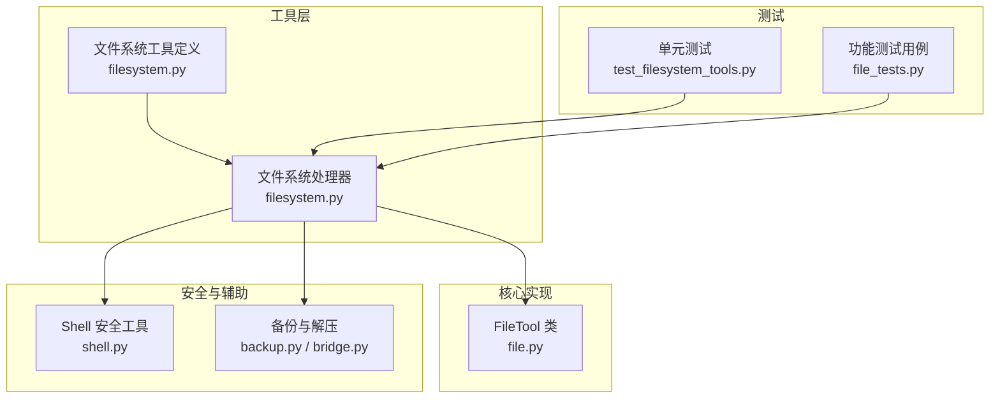
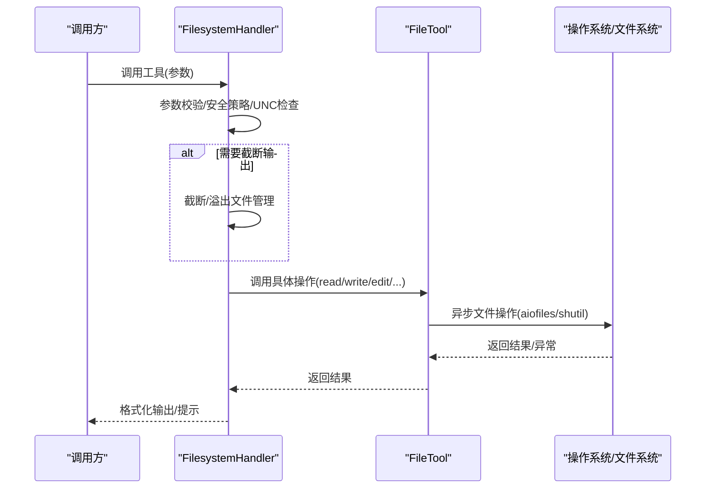
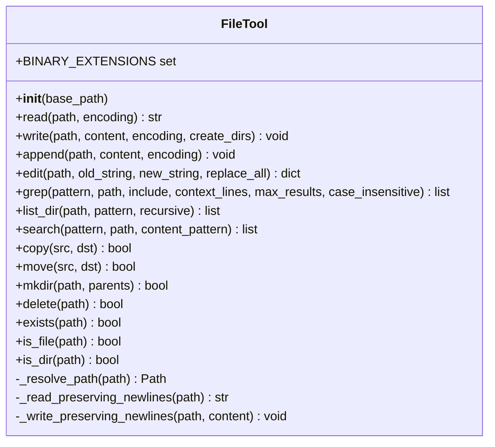
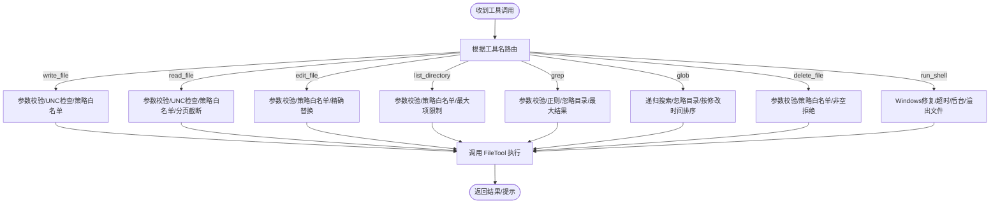
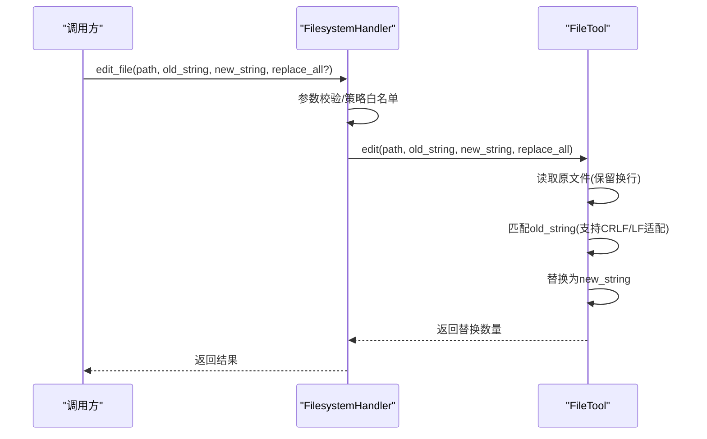
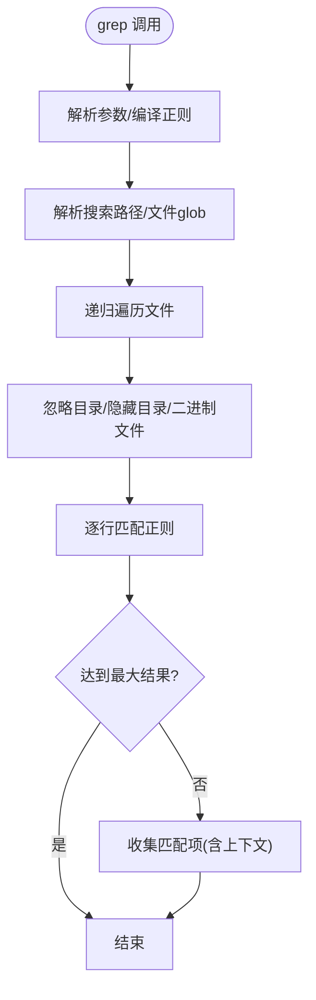
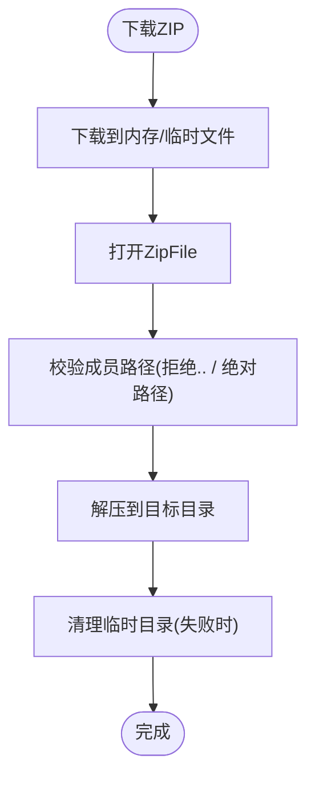
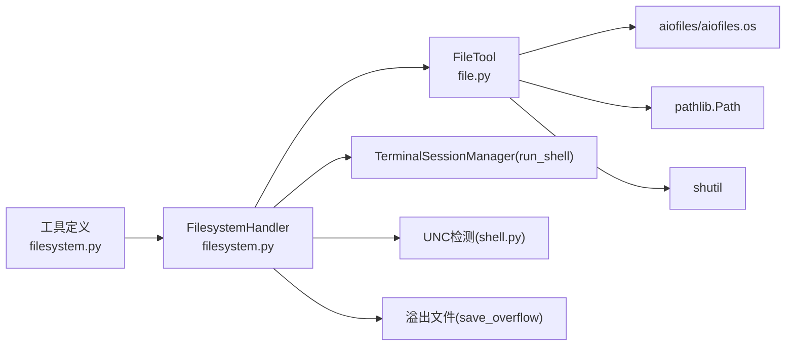

# 文件工具

<cite>
**本文引用的文件**
- [file.py](file://src/synapse/tools/file.py)
- [filesystem.py](file://src/synapse/tools/handlers/filesystem.py)
- [filesystem.py](file://src/synapse/tools/definitions/filesystem.py)
- [file_tests.py](file://src/synapse/testing/cases/tools/file_tests.py)
- [test_filesystem_tools.py](file://tests/unit/test_filesystem_tools.py)
- [shell.py](file://src/synapse/tools/shell.py)
- [backup.py](file://src/synapse/workspace/backup.py)
- [bridge.py](file://src/synapse/setup_center/bridge.py)
</cite>

## 目录
1. [简介](#简介)
2. [项目结构](#项目结构)
3. [核心组件](#核心组件)
4. [架构总览](#架构总览)
5. [详细组件分析](#详细组件分析)
6. [依赖关系分析](#依赖关系分析)
7. [性能考量](#性能考量)
8. [故障排查指南](#故障排查指南)
9. [结论](#结论)
10. [附录](#附录)

## 简介
本文件工具旨在为智能体提供安全、可控、高性能的文件系统操作能力。它围绕 FileTool 核心类构建，提供文件读写、编辑、目录遍历、内容搜索、文件复制移动、目录创建与删除等能力，并内置路径解析与安全校验（含 UNC 路径拦截、路径穿越防护、策略白名单限制等），同时支持大文件分页读取与输出截断，避免内存与网络传输压力。

## 项目结构
文件工具相关代码主要分布在以下模块：
- 核心实现：src/synapse/tools/file.py（FileTool 类）
- 工具定义：src/synapse/tools/definitions/filesystem.py（工具元数据与输入规范）
- 处理器：src/synapse/tools/handlers/filesystem.py（工具调用入口与安全策略）
- 安全辅助：src/synapse/tools/shell.py（UNC 路径检测与安全建议）
- 压缩/备份：src/synapse/workspace/backup.py、src/synapse/setup_center/bridge.py（ZIP 解压与路径穿越防护）
- 测试用例：src/synapse/testing/cases/tools/file_tests.py、tests/unit/test_filesystem_tools.py

图表来源
- [filesystem.py:1-425](file://src/synapse/tools/definitions/filesystem.py#L1-L425)
- [filesystem.py:1-791](file://src/synapse/tools/handlers/filesystem.py#L1-L791)
- [file.py:1-492](file://src/synapse/tools/file.py#L1-L492)
- [shell.py:79-100](file://src/synapse/tools/shell.py#L79-L100)
- [backup.py:300-333](file://src/synapse/workspace/backup.py#L300-L333)
- [bridge.py:1251-1362](file://src/synapse/setup_center/bridge.py#L1251-L1362)
- [test_filesystem_tools.py:70-96](file://tests/unit/test_filesystem_tools.py#L70-L96)
- [file_tests.py:1-140](file://src/synapse/testing/cases/tools/file_tests.py#L1-L140)

章节来源
- [filesystem.py:1-425](file://src/synapse/tools/definitions/filesystem.py#L1-L425)
- [filesystem.py:1-791](file://src/synapse/tools/handlers/filesystem.py#L1-L791)
- [file.py:1-492](file://src/synapse/tools/file.py#L1-L492)
- [shell.py:79-100](file://src/synapse/tools/shell.py#L79-L100)
- [backup.py:300-333](file://src/synapse/workspace/backup.py#L300-L333)
- [bridge.py:1251-1362](file://src/synapse/setup_center/bridge.py#L1251-L1362)
- [test_filesystem_tools.py:70-96](file://tests/unit/test_filesystem_tools.py#L70-L96)
- [file_tests.py:1-140](file://src/synapse/testing/cases/tools/file_tests.py#L1-L140)

## 核心组件
- FileTool：提供文件读写、编辑、搜索、遍历、复制移动、创建删除等异步操作，内置二进制文件识别、换行符保留读写、忽略目录与隐藏目录过滤、最大结果限制等。
- FilesystemHandler：封装工具调用入口，负责参数校验、安全策略（UNC 拦截、路径白名单）、输出截断与溢出文件管理、Windows 多行 python -c 修复等。
- 工具定义：统一描述每个工具的用途、输入参数、行为约束与最佳实践，便于 LLM 与用户理解工具边界。
- 安全辅助：UNC 路径检测、ZIP 路径穿越防护、策略引擎决策（由处理器集成）。

章节来源
- [file.py:37-492](file://src/synapse/tools/file.py#L37-L492)
- [filesystem.py:53-791](file://src/synapse/tools/handlers/filesystem.py#L53-L791)
- [filesystem.py:17-425](file://src/synapse/tools/definitions/filesystem.py#L17-L425)
- [shell.py:79-100](file://src/synapse/tools/shell.py#L79-L100)
- [backup.py:300-333](file://src/synapse/workspace/backup.py#L300-L333)
- [bridge.py:1251-1362](file://src/synapse/setup_center/bridge.py#L1251-L1362)

## 架构总览
文件工具的调用链路如下：
- 工具定义（definitions）声明工具接口与约束
- 处理器（handlers）接收调用，进行参数校验、安全策略检查、输出截断与溢出管理
- 核心工具（file）执行具体文件系统操作，返回结果

图表来源
- [filesystem.py:109-137](file://src/synapse/tools/handlers/filesystem.py#L109-L137)
- [file.py:92-147](file://src/synapse/tools/file.py#L92-L147)

章节来源
- [filesystem.py:109-137](file://src/synapse/tools/handlers/filesystem.py#L109-L137)
- [file.py:92-147](file://src/synapse/tools/file.py#L92-L147)

## 详细组件分析

### FileTool 类
FileTool 提供异步文件操作能力，关键点：
- 路径解析：支持相对路径与绝对路径，相对路径基于 base_path（默认当前工作目录）
- 二进制文件识别：通过扩展名集合判断，避免对二进制文件进行文本读取
- 文本读取：UTF-8 编码，Unicode 解码失败时给出提示
- 写入/追加：自动创建父目录，UTF-8 编码
- 精确编辑：保留换行风格（LF/CRLF），要求 old_string 唯一匹配（除非 replace_all=true）
- 搜索与遍历：支持正则、glob、递归、忽略目录与隐藏目录、最大结果限制
- 复制/移动/创建/删除：使用 shutil/os，删除非空目录拒绝

图表来源
- [file.py:37-492](file://src/synapse/tools/file.py#L37-L492)

章节来源
- [file.py:40-492](file://src/synapse/tools/file.py#L40-L492)

### 文件系统处理器（FilesystemHandler）
FilesystemHandler 负责：
- 工具路由：根据工具名分发到对应处理函数
- 安全策略：UNC 路径拦截、路径白名单（write_roots/read_roots）、Windows 多行 python -c 修复
- 输出截断：run_shell/grep 等大输出截断，溢出文件保存与提示
- 路径解析一致性：与 FileTool 保持 base_path 一致（cwd）

图表来源
- [filesystem.py:109-137](file://src/synapse/tools/handlers/filesystem.py#L109-L137)
- [filesystem.py:399-448](file://src/synapse/tools/handlers/filesystem.py#L399-L448)
- [filesystem.py:453-513](file://src/synapse/tools/handlers/filesystem.py#L453-L513)
- [filesystem.py:518-564](file://src/synapse/tools/handlers/filesystem.py#L518-L564)
- [filesystem.py:566-609](file://src/synapse/tools/handlers/filesystem.py#L566-L609)
- [filesystem.py:614-683](file://src/synapse/tools/handlers/filesystem.py#L614-L683)
- [filesystem.py:685-736](file://src/synapse/tools/handlers/filesystem.py#L685-L736)
- [filesystem.py:738-776](file://src/synapse/tools/handlers/filesystem.py#L738-L776)
- [filesystem.py:227-386](file://src/synapse/tools/handlers/filesystem.py#L227-L386)

章节来源
- [filesystem.py:92-137](file://src/synapse/tools/handlers/filesystem.py#L92-L137)
- [filesystem.py:399-448](file://src/synapse/tools/handlers/filesystem.py#L399-L448)
- [filesystem.py:453-513](file://src/synapse/tools/handlers/filesystem.py#L453-L513)
- [filesystem.py:518-564](file://src/synapse/tools/handlers/filesystem.py#L518-L564)
- [filesystem.py:566-609](file://src/synapse/tools/handlers/filesystem.py#L566-L609)
- [filesystem.py:614-683](file://src/synapse/tools/handlers/filesystem.py#L614-L683)
- [filesystem.py:685-736](file://src/synapse/tools/handlers/filesystem.py#L685-L736)
- [filesystem.py:738-776](file://src/synapse/tools/handlers/filesystem.py#L738-L776)
- [filesystem.py:227-386](file://src/synapse/tools/handlers/filesystem.py#L227-L386)

### 文件读写与编辑流程
- 读取：FileTool.read 识别二进制扩展名并提示；文本读取失败时提示编码问题
- 写入：FileTool.write 自动创建父目录，UTF-8 编码
- 编辑：FileTool.edit 保留换行风格，要求 old_string 唯一匹配或显式 replace_all=true

图表来源
- [file.py:193-251](file://src/synapse/tools/file.py#L193-L251)
- [filesystem.py:518-564](file://src/synapse/tools/handlers/filesystem.py#L518-L564)

章节来源
- [file.py:193-251](file://src/synapse/tools/file.py#L193-L251)
- [filesystem.py:518-564](file://src/synapse/tools/handlers/filesystem.py#L518-L564)

### 目录遍历与内容搜索
- list_dir：支持 pattern 与递归，限制最大返回条目
- grep：正则搜索，支持 include 过滤、上下文行、大小写不敏感、最大结果限制、忽略目录与隐藏目录、跳过二进制文件

图表来源
- [file.py:253-330](file://src/synapse/tools/file.py#L253-L330)
- [filesystem.py:614-683](file://src/synapse/tools/handlers/filesystem.py#L614-L683)

章节来源
- [file.py:253-330](file://src/synapse/tools/file.py#L253-L330)
- [filesystem.py:614-683](file://src/synapse/tools/handlers/filesystem.py#L614-L683)

### 文件压缩与解压（路径穿越防护）
- 下载与解压：GitHub ZIP 下载并通过 ZipFile 解压，失败清理临时目录
- 路径穿越防护：校验 ZIP 成员路径，拒绝包含绝对路径、上级目录引用等危险成员

图表来源
- [bridge.py:1251-1362](file://src/synapse/setup_center/bridge.py#L1251-L1362)
- [backup.py:300-333](file://src/synapse/workspace/backup.py#L300-L333)

章节来源
- [bridge.py:1251-1362](file://src/synapse/setup_center/bridge.py#L1251-L1362)
- [backup.py:300-333](file://src/synapse/workspace/backup.py#L300-L333)

## 依赖关系分析
- FileTool 依赖：aiofiles、aiofiles.os、pathlib.Path、shutil
- FilesystemHandler 依赖：FileTool、TerminalSessionManager（run_shell）、策略白名单、溢出文件保存
- 安全依赖：UNC 路径检测、ZIP 路径穿越防护、策略引擎（由处理器集成）

图表来源
- [file.py:5-13](file://src/synapse/tools/file.py#L5-L13)
- [filesystem.py:21-50](file://src/synapse/tools/handlers/filesystem.py#L21-L50)
- [shell.py:79-100](file://src/synapse/tools/shell.py#L79-L100)

章节来源
- [file.py:5-13](file://src/synapse/tools/file.py#L5-L13)
- [filesystem.py:21-50](file://src/synapse/tools/handlers/filesystem.py#L21-L50)
- [shell.py:79-100](file://src/synapse/tools/shell.py#L79-L100)

## 性能考量
- 异步 I/O：使用 aiofiles 进行异步读写，减少阻塞
- 大文件分页：read_file 支持 offset/limit 分页，避免一次性加载大文件
- 输出截断：run_shell/grep 超长输出截断并保存溢出文件，避免内存与网络压力
- 递归搜索限制：list_dir/glob/grep 设置最大条目/结果限制，避免大规模遍历
- 忽略目录：默认忽略常见构建缓存与版本控制目录，减少无效扫描

章节来源
- [file.py:92-147](file://src/synapse/tools/file.py#L92-L147)
- [filesystem.py:453-513](file://src/synapse/tools/handlers/filesystem.py#L453-L513)
- [filesystem.py:614-683](file://src/synapse/tools/handlers/filesystem.py#L614-L683)
- [filesystem.py:685-736](file://src/synapse/tools/handlers/filesystem.py#L685-L736)

## 故障排查指南
- 读取失败
  - 二进制文件：read 返回二进制提示，改用合适工具或分块读取
  - 编码问题：read 捕获 UnicodeDecodeError，提示非 UTF-8 或二进制
- 编辑失败
  - old_string 不唯一：edit 报错并提示提供更多上下文或设置 replace_all=true
  - 文件不存在：edit 抛出 FileNotFoundError
- 删除失败
  - 非空目录：拒绝删除并提示
  - 权限不足：捕获异常并返回错误信息
- UNC 路径
  - 检测到 UNC 路径：返回阻止信息，建议使用本地路径或映射盘符
- 输出过大
  - run_shell/grep 截断：使用溢出文件路径继续查看后续内容

章节来源
- [file.py:114-121](file://src/synapse/tools/file.py#L114-L121)
- [file.py:213-214](file://src/synapse/tools/file.py#L213-L214)
- [file.py:221-239](file://src/synapse/tools/file.py#L221-L239)
- [filesystem.py:388-397](file://src/synapse/tools/handlers/filesystem.py#L388-L397)
- [filesystem.py:738-776](file://src/synapse/tools/handlers/filesystem.py#L738-L776)
- [filesystem.py:368-386](file://src/synapse/tools/handlers/filesystem.py#L368-L386)

## 结论
文件工具通过 FileTool 与 FilesystemHandler 的协作，提供了安全、可控、高效的文件系统操作能力。其设计重点在于：
- 安全性：UNC 路径拦截、路径白名单、ZIP 路径穿越防护
- 可靠性：异步 I/O、错误处理、输出截断与溢出管理
- 易用性：清晰的工具定义、分页读取、上下文搜索、换行风格保留

## 附录

### 使用示例与最佳实践
- 写入文件：优先使用 write_file 创建新文件或整体替换，注意覆盖风险
- 编辑文件：优先使用 edit_file，先 read_file 再精确替换，old_string 必须唯一或设置 replace_all=true
- 读取大文件：使用 read_file(offset/limit) 分页读取
- 搜索内容：使用 grep 正则搜索，配合 include/context_lines/max_results
- 遍历目录：使用 list_directory，设置 pattern/recursive/max_items
- 删除文件：delete_file 仅删除空目录或文件，非空目录需使用 run_shell

章节来源
- [filesystem.py:104-138](file://src/synapse/tools/definitions/filesystem.py#L104-L138)
- [filesystem.py:142-185](file://src/synapse/tools/definitions/filesystem.py#L142-L185)
- [filesystem.py:188-235](file://src/synapse/tools/definitions/filesystem.py#L188-L235)
- [filesystem.py:238-278](file://src/synapse/tools/definitions/filesystem.py#L238-L278)
- [filesystem.py:281-344](file://src/synapse/tools/definitions/filesystem.py#L281-L344)
- [filesystem.py:347-390](file://src/synapse/tools/definitions/filesystem.py#L347-L390)
- [filesystem.py:393-422](file://src/synapse/tools/definitions/filesystem.py#L393-L422)