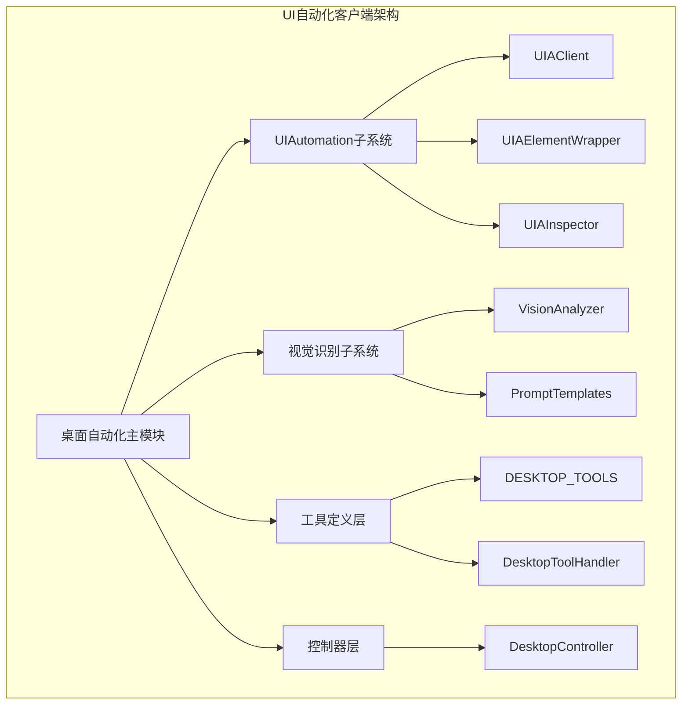
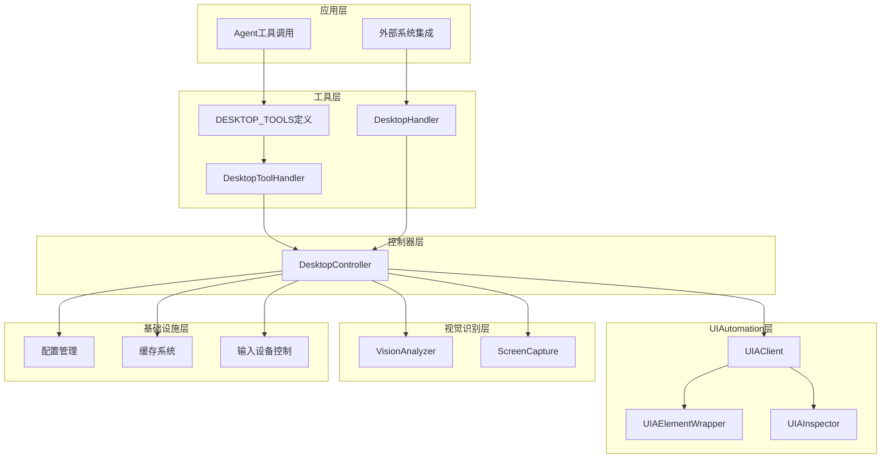
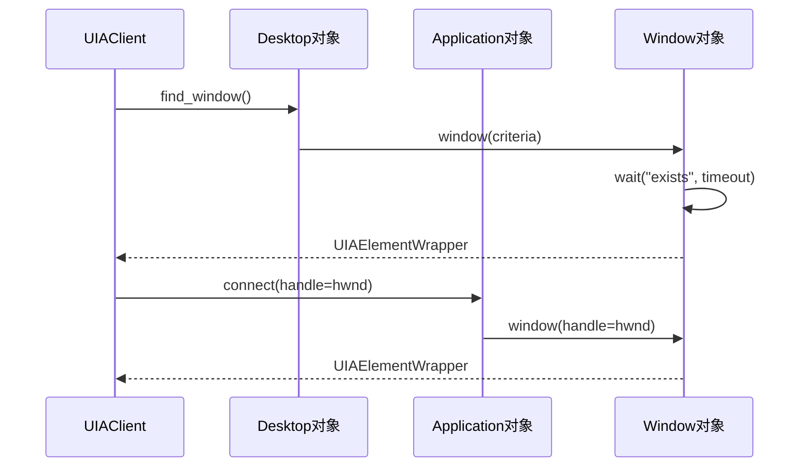
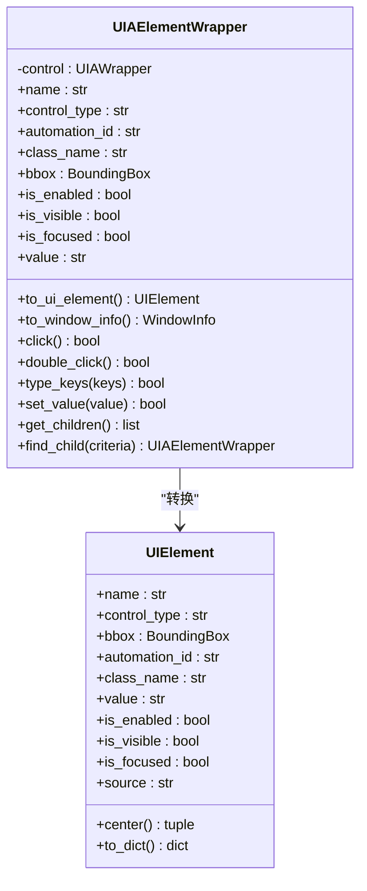
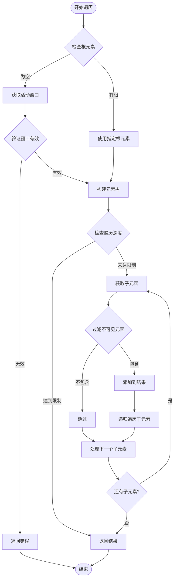
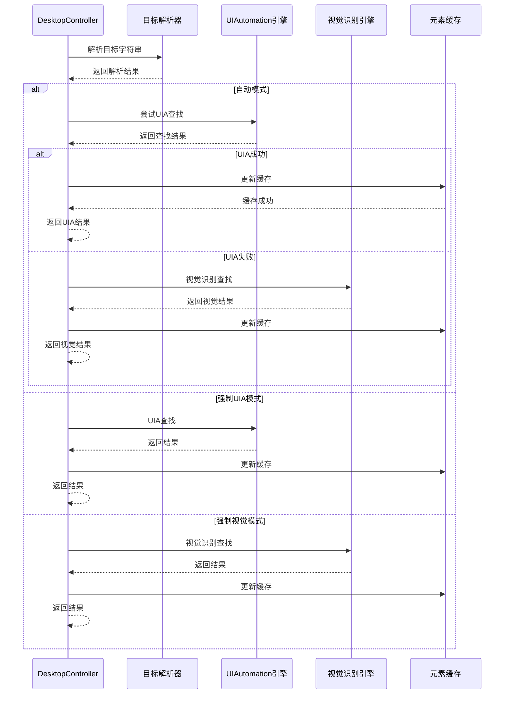
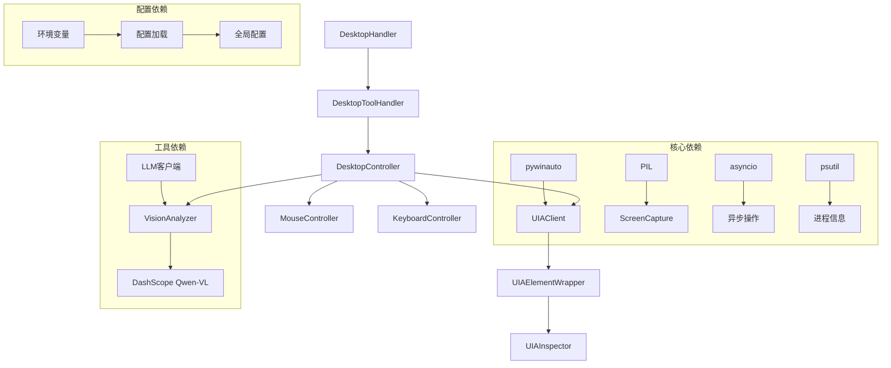

# UI自动化客户端

<cite>
**本文档引用的文件**
- [client.py](file://src/synapse/tools/desktop/uia/client.py)
- [elements.py](file://src/synapse/tools/desktop/uia/elements.py)
- [inspector.py](file://src/synapse/tools/desktop/uia/inspector.py)
- [controller.py](file://src/synapse/tools/desktop/controller.py)
- [tools.py](file://src/synapse/tools/desktop/tools.py)
- [types.py](file://src/synapse/tools/desktop/types.py)
- [config.py](file://src/synapse/tools/desktop/config.py)
- [__init__.py](file://src/synapse/tools/desktop/__init__.py)
- [analyzer.py](file://src/synapse/tools/desktop/vision/analyzer.py)
- [desktop.py](file://src/synapse/tools/handlers/desktop.py)
</cite>

## 目录
1. [简介](#简介)
2. [项目结构](#项目结构)
3. [核心组件](#核心组件)
4. [架构概览](#架构概览)
5. [详细组件分析](#详细组件分析)
6. [依赖关系分析](#依赖关系分析)
7. [性能考虑](#性能考虑)
8. [故障排除指南](#故障排除指南)
9. [结论](#结论)
10. [附录](#附录)

## 简介

UI自动化客户端是OpenAkita平台中用于Windows桌面应用程序自动化的核心组件。该系统集成了Microsoft UIAutomation框架和视觉识别技术，提供了完整的UI元素发现、属性查询和事件监听功能。

该客户端主要面向以下应用场景：
- Windows桌面应用程序的自动化操作
- 非标准UI界面的智能识别
- 复杂桌面工作流的自动化执行
- 跨应用的界面状态监控

系统采用双引擎架构：优先使用UIAutomation（pywinauto）进行快速准确的元素操作，当遇到非标准UI时自动回退到视觉识别方案。

## 项目结构

UI自动化客户端位于`src/synapse/tools/desktop`目录下，采用模块化设计：



**图表来源**
- [__init__.py:74-78](file://src/synapse/tools/desktop/__init__.py#L74-L78)
- [controller.py:39-46](file://src/synapse/tools/desktop/controller.py#L39-L46)

**章节来源**
- [__init__.py:1-132](file://src/synapse/tools/desktop/__init__.py#L1-L132)

## 核心组件

### UIAutomation客户端 (UIAClient)

UIAClient是Windows UIAutomation框架的Python封装，提供以下核心功能：

- **窗口管理**：窗口枚举、查找、激活、最小化、最大化等操作
- **元素查找**：基于多种条件的元素定位
- **等待机制**：元素和窗口的同步等待
- **应用程序管理**：应用启动和连接

### UI元素包装器 (UIAElementWrapper)

UIAElementWrapper封装了pywinauto的UIAWrapper，提供统一的元素操作接口：

- **属性查询**：名称、类型、ID、类名、边界框等
- **状态检测**：启用状态、可见性、焦点状态
- **交互操作**：点击、输入、滚动、选择等
- **层次遍历**：父子元素关系查询

### 检查器 (UIAInspector)

UIAInspector提供UI元素树的可视化和调试功能：

- **元素树构建**：递归遍历UI层次结构
- **元素搜索**：按文本、类型等条件查找元素
- **坐标定位**：基于屏幕坐标的元素获取
- **元素描述**：生成详细的元素信息报告

**章节来源**
- [client.py:35-673](file://src/synapse/tools/desktop/uia/client.py#L35-L673)
- [elements.py:29-483](file://src/synapse/tools/desktop/uia/elements.py#L29-L483)
- [inspector.py:23-430](file://src/synapse/tools/desktop/uia/inspector.py#L23-L430)

## 架构概览

系统采用分层架构设计，确保功能模块的清晰分离和高内聚低耦合：



**图表来源**
- [controller.py:39-719](file://src/synapse/tools/desktop/controller.py#L39-L719)
- [tools.py:22-401](file://src/synapse/tools/desktop/tools.py#L22-L401)
- [desktop.py:36-145](file://src/synapse/tools/handlers/desktop.py#L36-L145)

## 详细组件分析

### UIAutomation客户端实现

UIAClient提供了完整的Windows桌面自动化能力：

#### 窗口管理功能



**图表来源**
- [client.py:105-167](file://src/synapse/tools/desktop/uia/client.py#L105-L167)
- [client.py:190-221](file://src/synapse/tools/desktop/uia/client.py#L190-L221)

#### 元素查找机制

系统支持多种元素查找策略：

| 查找类型 | 条件参数 | 用途场景 |
|---------|---------|----------|
| 精确匹配 | name, control_type, automation_id | 稳定可靠的元素定位 |
| 正则匹配 | name_re | 灵活的文本匹配 |
| 层次查找 | root, depth | 限定范围的元素搜索 |
| 路径查找 | path | 多级嵌套元素定位 |

**章节来源**
- [client.py:320-468](file://src/synapse/tools/desktop/uia/client.py#L320-L468)

### UI元素包装器设计

UIAElementWrapper实现了统一的元素操作接口：



**图表来源**
- [elements.py:29-483](file://src/synapse/tools/desktop/uia/elements.py#L29-L483)
- [types.py:129-182](file://src/synapse/tools/desktop/types.py#L129-L182)

**章节来源**
- [elements.py:48-180](file://src/synapse/tools/desktop/uia/elements.py#L48-L180)

### 检查器功能实现

UIAInspector提供了强大的UI调试能力：

#### 元素树遍历算法



**图表来源**
- [inspector.py:37-114](file://src/synapse/tools/desktop/uia/inspector.py#L37-L114)

**章节来源**
- [inspector.py:61-114](file://src/synapse/tools/desktop/uia/inspector.py#L61-L114)

### 控制器层设计

DesktopController作为统一入口，协调各个子系统：

#### 智能查找策略



**图表来源**
- [controller.py:158-208](file://src/synapse/tools/desktop/controller.py#L158-L208)

**章节来源**
- [controller.py:158-281](file://src/synapse/tools/desktop/controller.py#L158-L281)

### 工具定义和处理器

系统提供了完整的Agent工具接口：

#### 工具分类体系

| 工具类别 | 工具名称 | 功能描述 |
|---------|---------|----------|
| 截图类 | desktop_screenshot | 截取桌面或窗口图像 |
| 查找类 | desktop_find_element | 查找UI元素位置 |
| 点击类 | desktop_click | 点击元素或坐标 |
| 输入类 | desktop_type | 文本输入操作 |
| 快捷键 | desktop_hotkey | 键盘快捷键执行 |
| 滚动类 | desktop_scroll | 鼠标滚轮操作 |
| 窗口类 | desktop_window | 窗口管理操作 |
| 等待类 | desktop_wait | 同步等待元素/窗口 |
| 检查类 | desktop_inspect | UI元素树检查 |

**章节来源**
- [tools.py:22-401](file://src/synapse/tools/desktop/tools.py#L22-L401)

## 依赖关系分析

系统采用松耦合设计，各模块间依赖关系清晰：



**图表来源**
- [client.py:23-30](file://src/synapse/tools/desktop/uia/client.py#L23-L30)
- [controller.py:12-28](file://src/synapse/tools/desktop/controller.py#L12-L28)
- [analyzer.py:50-56](file://src/synapse/tools/desktop/vision/analyzer.py#L50-L56)

**章节来源**
- [config.py:11-136](file://src/synapse/tools/desktop/config.py#L11-L136)

## 性能考虑

### 缓存策略

系统实现了多层次的缓存机制：

1. **元素缓存**：避免重复查找UI元素
2. **截图缓存**：减少屏幕捕获开销
3. **配置缓存**：延迟初始化昂贵组件

### 异步操作

- 使用asyncio实现非阻塞操作
- 支持批量操作的原子性执行
- 智能超时管理和重试机制

### 内存管理

- 及时释放不再使用的UI元素引用
- 控制截图内存占用
- 限制缓存大小和过期时间

## 故障排除指南

### 常见问题及解决方案

#### UIAutomation连接失败
- **症状**：无法找到UI元素或窗口
- **原因**：权限不足或UIAutomation服务未启动
- **解决**：以管理员权限运行或重启Windows UIAutomation服务

#### 元素查找不稳定
- **症状**：元素偶尔找不到
- **原因**：应用界面更新导致元素ID变化
- **解决**：使用更稳定的查找条件或启用缓存

#### 视觉识别准确性低
- **症状**：视觉识别经常失败
- **原因**：截图质量差或提示词不够准确
- **解决**：调整截图参数或改进描述语句

**章节来源**
- [config.py:32-63](file://src/synapse/tools/desktop/config.py#L32-L63)

## 结论

UI自动化客户端为Windows桌面应用程序提供了强大而灵活的自动化能力。通过UIAutomation和视觉识别的双重保障，系统能够在各种复杂的UI环境中稳定工作。

主要优势包括：
- **双引擎架构**：快速准确的UIAutomation + 通用的视觉识别
- **模块化设计**：清晰的功能分离和良好的扩展性
- **智能缓存**：显著提升性能表现
- **完善的工具链**：从元素发现到操作执行的完整生态

未来发展方向：
- 增强视觉识别的准确性
- 优化性能和资源使用
- 扩展更多UI框架的支持
- 提升错误处理和调试能力

## 附录

### 使用示例

#### 基础元素查找
```python
# 查找保存按钮
element = await controller.find_element("保存按钮")

# 使用精确匹配
element = await controller.find_element("name:保存")

# 使用自动化ID
element = await controller.find_element("id:btn_save")
```

#### 窗口操作
```python
# 切换到指定窗口
await controller.switch_to_window("记事本")

# 最小化所有窗口
windows = controller.list_windows()
for window in windows:
    controller.window_action("minimize", window.title)
```

#### 批量操作
```python
# 原子化批量执行
actions = [
    {"tool": "desktop_click", "params": {"target": "文件菜单"}},
    {"tool": "desktop_click", "params": {"target": "新建按钮"}},
    {"tool": "desktop_type", "params": {"text": "测试文档"}},
]
result = await handler.handle("desktop_batch", {"actions": actions})
```

### 最佳实践

1. **优先使用UIAutomation**：对于标准Windows应用，UIAutomation比视觉识别更可靠
2. **合理设置超时**：根据应用响应速度调整等待时间
3. **利用缓存**：对频繁使用的元素启用缓存
4. **错误处理**：为关键操作添加适当的异常处理
5. **调试工具**：使用inspect功能进行UI结构分析