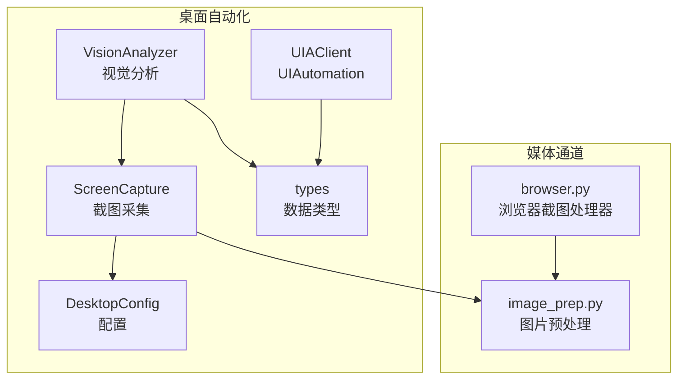
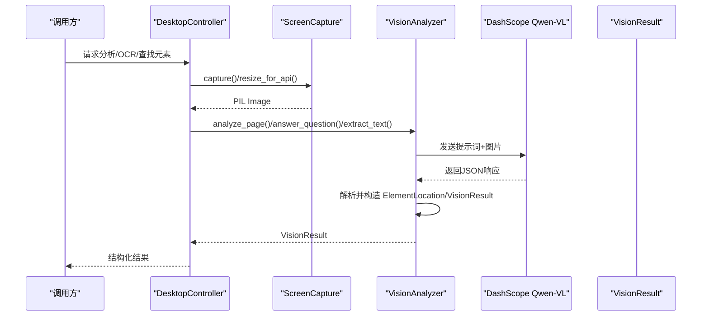
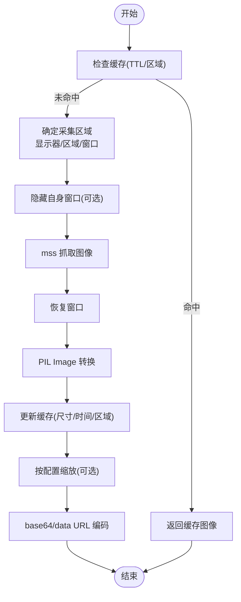
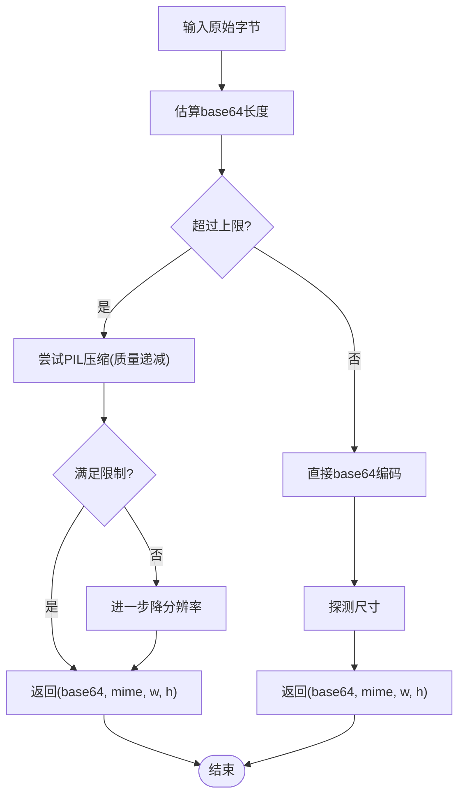
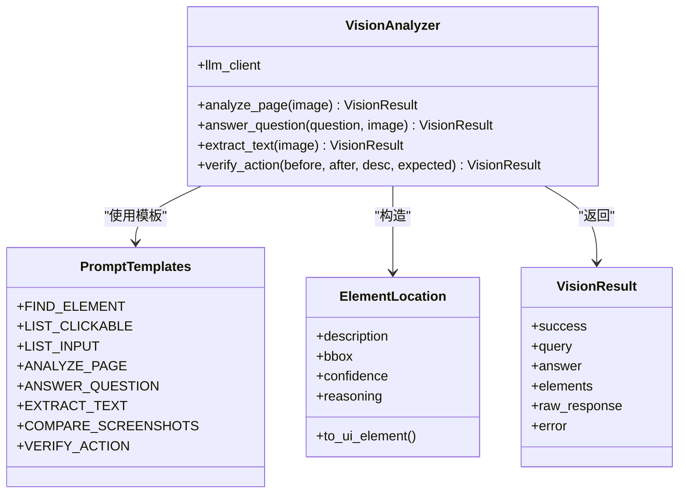
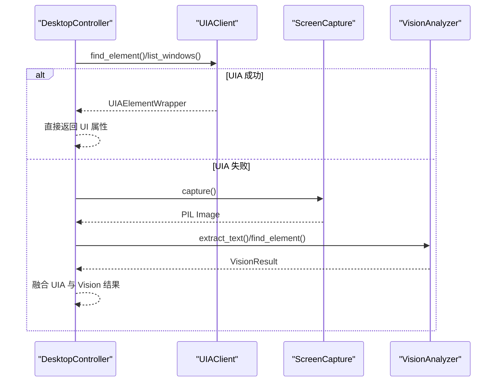
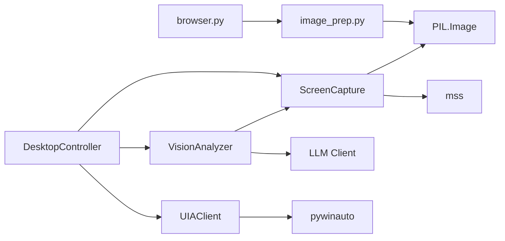

# 屏幕捕获与分析

<cite>
**本文档引用的文件**
- [capture.py](file://src/synapse/tools/desktop/capture.py)
- [types.py](file://src/synapse/tools/desktop/types.py)
- [analyzer.py](file://src/synapse/tools/desktop/vision/analyzer.py)
- [prompts.py](file://src/synapse/tools/desktop/vision/prompts.py)
- [config.py](file://src/synapse/tools/desktop/config.py)
- [client.py](file://src/synapse/tools/desktop/uia/client.py)
- [controller.py](file://src/synapse/tools/desktop/controller.py)
- [tools.py](file://src/synapse/tools/desktop/tools.py)
- [image_prep.py](file://src/synapse/channels/media/image_prep.py)
- [browser.py](file://src/synapse/tools/handlers/browser.py)
- [SKILL.md](file://skills/system/desktop-screenshot/SKILL.md)
</cite>

## 目录
1. [简介](#简介)
2. [项目结构](#项目结构)
3. [核心组件](#核心组件)
4. [架构总览](#架构总览)
5. [详细组件分析](#详细组件分析)
6. [依赖关系分析](#依赖关系分析)
7. [性能考量](#性能考量)
8. [故障排查指南](#故障排查指南)
9. [结论](#结论)
10. [附录](#附录)

## 简介
本文件面向“屏幕捕获与分析”组件，系统性阐述屏幕截图捕获、图像缓存、OCR 文本识别与视觉元素定位的实现原理与最佳实践。内容覆盖图像预处理、特征提取、模板匹配与对象检测的替代方案、多分辨率支持、性能优化与内存管理策略，并提供使用示例、分析最佳实践与调试技巧。

## 项目结构
该能力由桌面自动化子系统提供，核心位于 desktop 子模块，围绕“截图采集—图像预处理—视觉分析—结果输出”的链路组织；同时通过媒体通道对图片进行上下文嵌入前的尺寸与质量控制。

**图表来源**
- [capture.py:80-207](file://src/synapse/tools/desktop/capture.py#L80-L207)
- [config.py:11-112](file://src/synapse/tools/desktop/config.py#L11-L112)
- [analyzer.py:31-56](file://src/synapse/tools/desktop/vision/analyzer.py#L31-L56)
- [types.py:90-126](file://src/synapse/tools/desktop/types.py#L90-L126)
- [image_prep.py:21-48](file://src/synapse/channels/media/image_prep.py#L21-L48)
- [browser.py:532-601](file://src/synapse/tools/handlers/browser.py#L532-L601)

**章节来源**
- [capture.py:1-448](file://src/synapse/tools/desktop/capture.py#L1-L448)
- [config.py:1-136](file://src/synapse/tools/desktop/config.py#L1-L136)
- [analyzer.py:1-545](file://src/synapse/tools/desktop/vision/analyzer.py#L1-L545)
- [types.py:1-298](file://src/synapse/tools/desktop/types.py#L1-L298)
- [image_prep.py:1-156](file://src/synapse/channels/media/image_prep.py#L1-L156)
- [browser.py:532-624](file://src/synapse/tools/handlers/browser.py#L532-L624)

## 核心组件
- 截图采集（ScreenCapture）
  - 基于 mss 的高性能截图，支持全屏/显示器、区域、窗口三种模式；内置缓存与尺寸缩放；提供 base64/data URL 输出。
- 图像预处理（image_prep.py）
  - 统一将图片转为适合 LLM 上下文的 base64，按像素数与 base64 长度限制进行压缩与尺寸调整。
- 视觉分析（VisionAnalyzer + PromptTemplates）
  - 基于 DashScope Qwen-VL 的 OCR 与 UI 元素识别，支持“查找元素/列出可点击元素/提取文本/页面分析/问答/验证操作”等任务。
- UIAutomation（UIAClient）
  - 封装 pywinauto，提供窗口与元素的快速定位与属性读取，作为视觉识别的高速替代。
- 数据类型（types）
  - 统一的边界框、元素、窗口、分析结果等数据结构，支撑跨模块协作。
- 配置（config）
  - 截图、UIA、视觉、动作等配置项，支持环境变量注入与运行时修改。

**章节来源**
- [capture.py:80-207](file://src/synapse/tools/desktop/capture.py#L80-L207)
- [image_prep.py:21-156](file://src/synapse/channels/media/image_prep.py#L21-L156)
- [analyzer.py:31-545](file://src/synapse/tools/desktop/vision/analyzer.py#L31-L545)
- [prompts.py:8-249](file://src/synapse/tools/desktop/vision/prompts.py#L8-L249)
- [client.py:35-200](file://src/synapse/tools/desktop/uia/client.py#L35-L200)
- [types.py:90-298](file://src/synapse/tools/desktop/types.py#L90-L298)
- [config.py:11-112](file://src/synapse/tools/desktop/config.py#L11-L112)

## 架构总览
整体流程：调用方触发截图或分析请求，系统根据策略选择 UIA 或 Vision；Vision 路径会将截图送入 Qwen-VL 并解析 JSON 结果；最终返回结构化元素位置、文本块或问答摘要。

**图表来源**
- [controller.py:39-55](file://src/synapse/tools/desktop/controller.py#L39-L55)
- [capture.py:131-207](file://src/synapse/tools/desktop/capture.py#L131-L207)
- [analyzer.py:284-411](file://src/synapse/tools/desktop/vision/analyzer.py#L284-L411)
- [prompts.py:103-131](file://src/synapse/tools/desktop/vision/prompts.py#L103-L131)

## 详细组件分析

### 截图采集（ScreenCapture）
- 功能要点
  - 支持显示器索引、区域与窗口三种采集方式；自动隐藏自身窗口避免截图包含 UIAutomation 自身窗口。
  - 截图缓存：在 TTL 内复用上次截图，避免重复采集；缓存命中条件包括显示器与区域一致。
  - 图像预处理：按配置的最大宽高进行等比缩放；JPEG 转换时移除透明通道；提供 base64 与 data URL 输出。
- 性能与内存
  - 缓存减少重复 CPU/GPU 采集开销；缩放降低后续 OCR/Vision 的计算与网络成本。
  - 关闭时清理缓存与底层句柄，防止资源泄漏。

**图表来源**
- [capture.py:131-207](file://src/synapse/tools/desktop/capture.py#L131-L207)
- [capture.py:252-348](file://src/synapse/tools/desktop/capture.py#L252-L348)

**章节来源**
- [capture.py:80-207](file://src/synapse/tools/desktop/capture.py#L80-L207)
- [capture.py:252-348](file://src/synapse/tools/desktop/capture.py#L252-L348)

### 图像预处理（image_prep.py）
- 功能要点
  - 统一入口 prepare_image_for_context/prepare_image_file_for_context，先估算 base64 长度，超过阈值则用 PIL 逐步压缩（质量优先，再降分辨率）。
  - 支持多种格式 MIME 推断；必要时转为 RGB；探测原图尺寸。
- 与截图集成
  - 在将截图嵌入 LLM 上下文前调用，确保不超过消息长度与像素上限，避免失败或降级。

**图表来源**
- [image_prep.py:21-48](file://src/synapse/channels/media/image_prep.py#L21-L48)
- [image_prep.py:87-143](file://src/synapse/channels/media/image_prep.py#L87-L143)

**章节来源**
- [image_prep.py:1-156](file://src/synapse/channels/media/image_prep.py#L1-L156)

### 视觉分析（VisionAnalyzer + PromptTemplates）
- 功能要点
  - 提供多种提示词模板：查找元素、列出可点击/输入元素、页面分析、问答、OCR 文本提取、对比截图、验证操作。
  - 统一调用 LLM 客户端，解析 JSON 结果，封装为 ElementLocation/VisionResult。
- OCR 与文本提取
  - 使用专用 OCR 模板，返回文本块及其边界框与类型，便于后续定位与交互。
- 元素定位
  - 返回边界框与置信度，支持转换为 UIElement 以便与 UIA 结果融合。

**图表来源**
- [analyzer.py:31-56](file://src/synapse/tools/desktop/vision/analyzer.py#L31-L56)
- [prompts.py:8-249](file://src/synapse/tools/desktop/vision/prompts.py#L8-L249)
- [types.py:218-253](file://src/synapse/tools/desktop/types.py#L218-L253)

**章节来源**
- [analyzer.py:284-476](file://src/synapse/tools/desktop/vision/analyzer.py#L284-L476)
- [prompts.py:103-226](file://src/synapse/tools/desktop/vision/prompts.py#L103-L226)
- [types.py:218-253](file://src/synapse/tools/desktop/types.py#L218-L253)

### UIAutomation（UIAClient）
- 功能要点
  - 提供窗口枚举、模糊匹配、元素查找与属性读取；支持超时与重试策略；作为视觉识别的高速替代。
- 与视觉识别的协同
  - DesktopController 采用“UIA 优先、Vision 兜底”的策略，提升准确性与性能。

**图表来源**
- [client.py:105-188](file://src/synapse/tools/desktop/uia/client.py#L105-L188)
- [controller.py:39-55](file://src/synapse/tools/desktop/controller.py#L39-L55)

**章节来源**
- [client.py:35-200](file://src/synapse/tools/desktop/uia/client.py#L35-L200)
- [controller.py:39-55](file://src/synapse/tools/desktop/controller.py#L39-L55)

### 数据类型与配置
- 数据类型
  - BoundingBox/UIElement/WindowInfo/ElementLocation/VisionResult/ScreenshotInfo/ActionResult/桌面状态快照等，统一结构便于跨模块传递。
- 配置
  - 截图质量、最大宽高、缓存 TTL；UIA 超时与重试；视觉识别开关与超时；动作延迟与防误触等。

**章节来源**
- [types.py:90-298](file://src/synapse/tools/desktop/types.py#L90-L298)
- [config.py:11-112](file://src/synapse/tools/desktop/config.py#L11-L112)

## 依赖关系分析
- 截图采集依赖 mss 与 PIL；图像预处理依赖 PIL；视觉分析依赖 LLM 客户端；UIA 依赖 pywinauto。
- 模块内聚高、耦合低：VisionAnalyzer 与 UIAClient 通过 DesktopController 统一调度；image_prep 作为通用预处理工具被多处调用。
- 配置集中管理，支持环境变量注入，便于在不同部署场景下调整性能与稳定性。

**图表来源**
- [capture.py:28-34](file://src/synapse/tools/desktop/capture.py#L28-L34)
- [image_prep.py:94-98](file://src/synapse/channels/media/image_prep.py#L94-L98)
- [analyzer.py:50-56](file://src/synapse/tools/desktop/vision/analyzer.py#L50-L56)
- [client.py:23-30](file://src/synapse/tools/desktop/uia/client.py#L23-L30)
- [controller.py:14-28](file://src/synapse/tools/desktop/controller.py#L14-L28)
- [browser.py:537-544](file://src/synapse/tools/handlers/browser.py#L537-L544)

**章节来源**
- [capture.py:28-34](file://src/synapse/tools/desktop/capture.py#L28-L34)
- [image_prep.py:94-98](file://src/synapse/channels/media/image_prep.py#L94-L98)
- [analyzer.py:50-56](file://src/synapse/tools/desktop/vision/analyzer.py#L50-L56)
- [client.py:23-30](file://src/synapse/tools/desktop/uia/client.py#L23-L30)
- [controller.py:14-28](file://src/synapse/tools/desktop/controller.py#L14-L28)
- [browser.py:537-544](file://src/synapse/tools/handlers/browser.py#L537-L544)

## 性能考量
- 截图缓存
  - 在短时间内重复请求相同区域时直接返回缓存，显著降低 CPU/GPU 开销。
- 图像缩放与压缩
  - 截图阶段按最大宽高等比缩放；嵌入 LLM 前再次按阈值压缩，减少带宽与推理成本。
- 采样与分辨率
  - 通过配置项控制最大宽高与压缩质量，兼顾精度与性能；在高 DPI 场景下建议适当提高最大宽高。
- 并发与批处理
  - 支持批量动作（最多 20 步），原子性执行，避免中间态导致的失败。
- 错误与回退
  - UIA 失败时自动回退至 Vision；Vision 失败时返回结构化错误，便于上层重试或降级。

[本节为通用性能指导，无需特定文件引用]

## 故障排查指南
- 截图为空或包含自身窗口
  - 确认隐藏自身窗口逻辑启用；检查显示器索引与区域参数。
- OCR 无结果或结果不准确
  - 调整截图质量与缩放；确认提示词模板正确；检查图片预处理是否过度压缩。
- 元素定位不准
  - 优先使用 UIA；若 UIA 不可用，检查 Vision 的提示词与置信度阈值。
- LLM 调用超时
  - 增加视觉识别超时与重试次数；降低输入图片尺寸与质量。
- 图片过大无法嵌入
  - 使用 image_prep 的预处理入口；检查 MIME 类型与像素上限。

**章节来源**
- [capture.py:179-188](file://src/synapse/tools/desktop/capture.py#L179-L188)
- [image_prep.py:87-143](file://src/synapse/channels/media/image_prep.py#L87-L143)
- [analyzer.py:528-533](file://src/synapse/tools/desktop/vision/analyzer.py#L528-L533)
- [config.py:50-63](file://src/synapse/tools/desktop/config.py#L50-L63)

## 结论
本组件通过“UIA 快速定位 + Vision 强泛化”的双轨策略，在保证准确性的同时兼顾性能；结合截图缓存、图像预处理与统一数据结构，形成稳定高效的屏幕捕获与分析能力。建议在生产环境中合理配置缓存 TTL、最大宽高与压缩质量，并针对不同分辨率与 DPI 场景进行压测与调优。

[本节为总结，无需特定文件引用]

## 附录

### 使用示例与最佳实践
- 截图与分析
  - 使用 desktop_screenshot 技能截取桌面或指定窗口，结合 analyze 与 analyze_query 参数进行页面分析与元素查找。
  - 示例路径：[SKILL.md:27-45](file://skills/system/desktop-screenshot/SKILL.md#L27-L45)
- 图像分析最佳实践
  - 先进行图像预处理，确保尺寸与质量在阈值内；对高对比度文本优先使用 OCR；复杂布局使用页面分析与元素列表辅助定位。
  - 示例路径：[image_prep.py:21-48](file://src/synapse/channels/media/image_prep.py#L21-L48)
- 调试技巧
  - 通过 DesktopController 的统一入口观察 UIA 与 Vision 的切换；在浏览器截图场景，使用浏览器处理器将截图嵌入消息上下文并降级为文本描述。
  - 示例路径：[browser.py:547-580](file://src/synapse/tools/handlers/browser.py#L547-L580)

**章节来源**
- [SKILL.md:27-45](file://skills/system/desktop-screenshot/SKILL.md#L27-L45)
- [image_prep.py:21-48](file://src/synapse/channels/media/image_prep.py#L21-L48)
- [browser.py:547-580](file://src/synapse/tools/handlers/browser.py#L547-L580)