# 桌面控制器

<cite>
**本文档引用的文件**
- [controller.py](file://src/synapse/tools/desktop/controller.py)
- [config.py](file://src/synapse/tools/desktop/config.py)
- [__init__.py](file://src/synapse/tools/desktop/__init__.py)
- [types.py](file://src/synapse/tools/desktop/types.py)
- [client.py](file://src/synapse/tools/desktop/uia/client.py)
- [elements.py](file://src/synapse/tools/desktop/uia/elements.py)
- [analyzer.py](file://src/synapse/tools/desktop/vision/analyzer.py)
- [mouse.py](file://src/synapse/tools/desktop/actions/mouse.py)
- [keyboard.py](file://src/synapse/tools/desktop/actions/keyboard.py)
- [capture.py](file://src/synapse/tools/desktop/capture.py)
- [cache.py](file://src/synapse/tools/desktop/cache.py)
- [tools.py](file://src/synapse/tools/desktop/tools.py)
</cite>

## 目录
1. [简介](#简介)
2. [项目结构](#项目结构)
3. [核心组件](#核心组件)
4. [架构概览](#架构概览)
5. [详细组件分析](#详细组件分析)
6. [依赖分析](#依赖分析)
7. [性能考虑](#性能考虑)
8. [故障排除指南](#故障排除指南)
9. [结论](#结论)
10. [附录](#附录)

## 简介
桌面控制器是 Synapse 桌面自动化系统的核心组件，提供统一的 Windows 桌面交互接口。它集成了两种技术方案：
- **UIAutomation（UIA）**：基于 pywinauto 的标准 Windows 应用元素操作，快速且准确
- **视觉识别（Vision）**：基于 DashScope Qwen-VL 的智能识别，用于非标准 UI 场景

该组件支持完整的桌面自动化功能，包括元素查找、点击操作、文本输入、窗口管理、截图分析等，并提供了丰富的配置参数和错误处理机制。

## 项目结构
桌面控制器模块采用分层架构设计，主要包含以下核心目录：

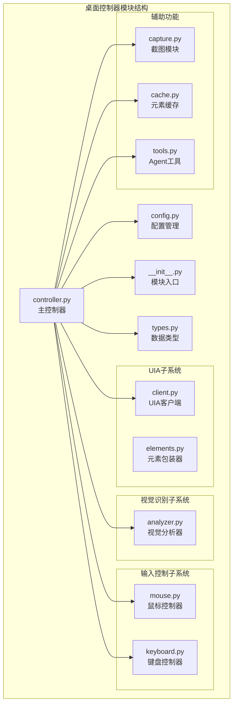

**图表来源**
- [controller.py:1-719](file://src/synapse/tools/desktop/controller.py#L1-L719)
- [config.py:1-136](file://src/synapse/tools/desktop/config.py#L1-L136)
- [__init__.py:1-132](file://src/synapse/tools/desktop/__init__.py#L1-L132)

**章节来源**
- [controller.py:1-719](file://src/synapse/tools/desktop/controller.py#L1-L719)
- [config.py:1-136](file://src/synapse/tools/desktop/config.py#L1-L136)
- [__init__.py:1-132](file://src/synapse/tools/desktop/__init__.py#L1-L132)

## 核心组件
桌面控制器系统由多个相互协作的组件构成，每个组件都有明确的职责分工：

### 主控制器 DesktopController
主控制器是整个系统的中枢，负责协调各个子系统的协同工作。它提供了统一的 API 接口，支持智能的 UIA/Vision 方案选择。

### 配置管理系统
配置系统采用分层设计，支持从环境变量和配置文件加载配置，包括：
- **CaptureConfig**：截图配置（显示器、压缩质量、缓存策略）
- **UIAConfig**：UIAutomation 配置（超时、重试机制）
- **VisionConfig**：视觉识别配置（启用状态、重试次数、超时时间）
- **ActionConfig**：操作配置（延迟、间隔、安全机制）

### 数据类型系统
统一的数据结构定义确保了不同子系统间的数据兼容性：
- **UIElement**：统一的 UI 元素表示
- **WindowInfo**：窗口信息结构
- **BoundingBox**：边界框定义
- **ActionResult**：操作结果封装

**章节来源**
- [controller.py:39-117](file://src/synapse/tools/desktop/controller.py#L39-L117)
- [config.py:11-136](file://src/synapse/tools/desktop/config.py#L11-L136)
- [types.py:13-298](file://src/synapse/tools/desktop/types.py#L13-L298)

## 架构概览
桌面控制器采用分层架构，实现了清晰的关注点分离：

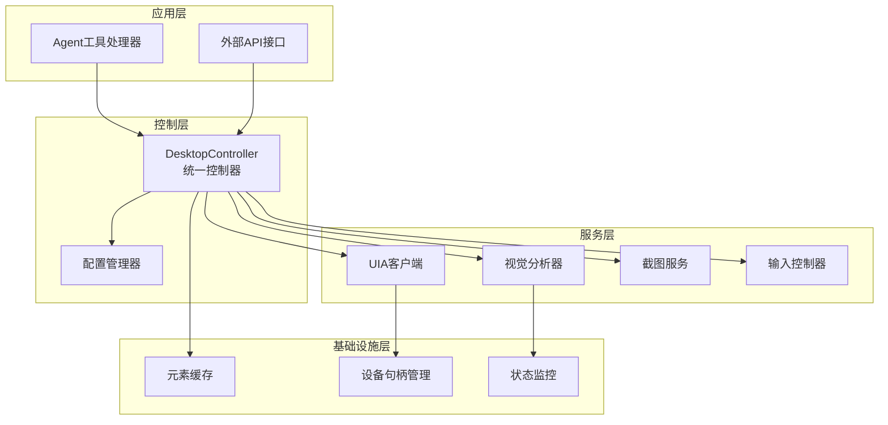

**图表来源**
- [controller.py:39-719](file://src/synapse/tools/desktop/controller.py#L39-L719)
- [client.py:35-673](file://src/synapse/tools/desktop/uia/client.py#L35-L673)
- [analyzer.py:31-546](file://src/synapse/tools/desktop/vision/analyzer.py#L31-L546)

### 初始化流程
桌面控制器的初始化过程遵循延迟加载原则，确保资源的有效利用：

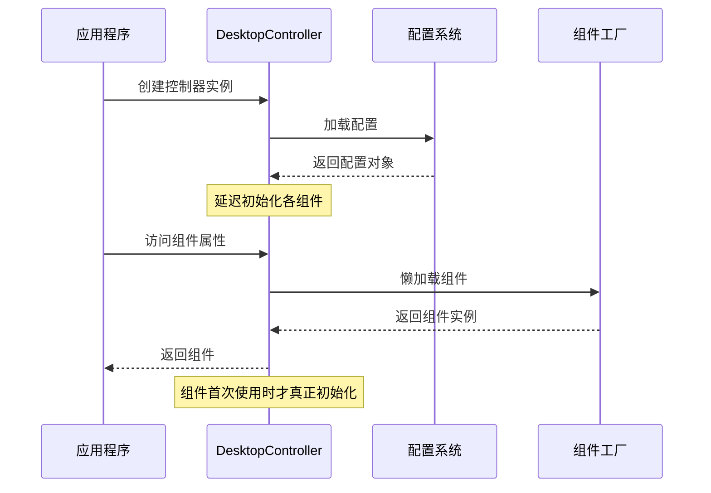

**图表来源**
- [controller.py:48-117](file://src/synapse/tools/desktop/controller.py#L48-L117)
- [config.py:118-136](file://src/synapse/tools/desktop/config.py#L118-L136)

**章节来源**
- [controller.py:48-117](file://src/synapse/tools/desktop/controller.py#L48-L117)
- [config.py:97-136](file://src/synapse/tools/desktop/config.py#L97-L136)

## 详细组件分析

### UIAutomation 客户端
UIA 客户端封装了 pywinauto 的复杂 API，提供了简洁易用的接口：

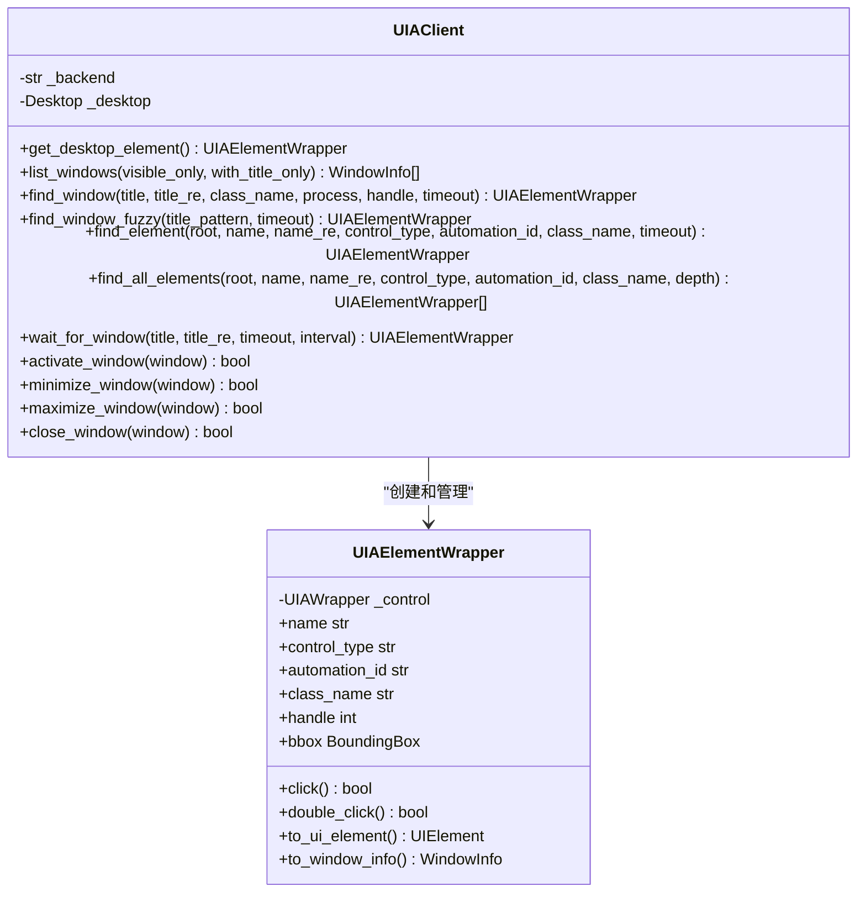

**图表来源**
- [client.py:35-673](file://src/synapse/tools/desktop/uia/client.py#L35-L673)
- [elements.py:29-483](file://src/synapse/tools/desktop/uia/elements.py#L29-L483)

#### 元素查找策略
UIA 客户端实现了多级查找策略，确保在各种场景下的可靠性：

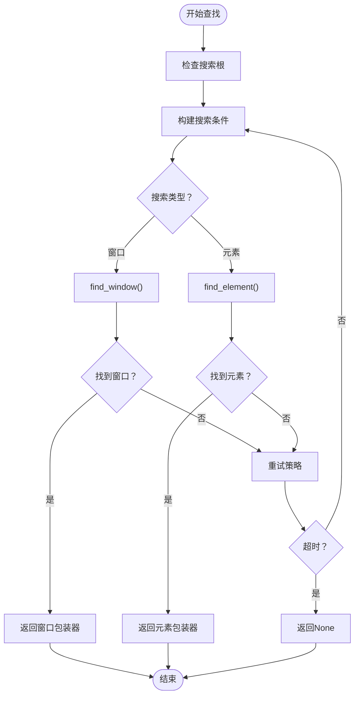

**图表来源**
- [client.py:105-168](file://src/synapse/tools/desktop/uia/client.py#L105-L168)
- [client.py:320-379](file://src/synapse/tools/desktop/uia/client.py#L320-L379)

**章节来源**
- [client.py:35-673](file://src/synapse/tools/desktop/uia/client.py#L35-L673)
- [elements.py:29-483](file://src/synapse/tools/desktop/uia/elements.py#L29-L483)

### 视觉识别分析器
视觉识别分析器基于 DashScope Qwen-VL 实现，提供了强大的非标准 UI 识别能力：

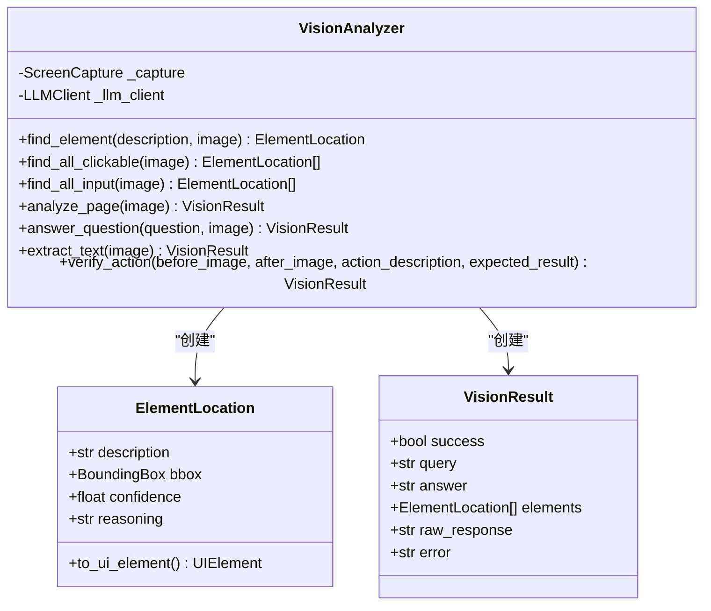

**图表来源**
- [analyzer.py:31-546](file://src/synapse/tools/desktop/vision/analyzer.py#L31-L546)
- [types.py:219-298](file://src/synapse/tools/desktop/types.py#L219-L298)

#### 视觉识别工作流程
视觉识别采用了多阶段处理机制：

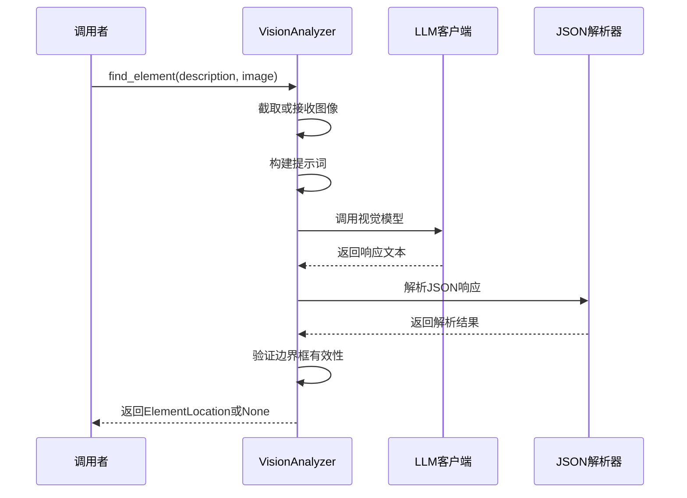

**图表来源**
- [analyzer.py:130-183](file://src/synapse/tools/desktop/vision/analyzer.py#L130-L183)
- [analyzer.py:100-129](file://src/synapse/tools/desktop/vision/analyzer.py#L100-L129)

**章节来源**
- [analyzer.py:31-546](file://src/synapse/tools/desktop/vision/analyzer.py#L31-L546)
- [types.py:219-298](file://src/synapse/tools/desktop/types.py#L219-L298)

### 输入控制系统
输入控制系统提供了鼠标和键盘的统一控制接口：

#### 鼠标控制器
鼠标控制器封装了 PyAutoGUI 的功能，提供了丰富的鼠标操作：

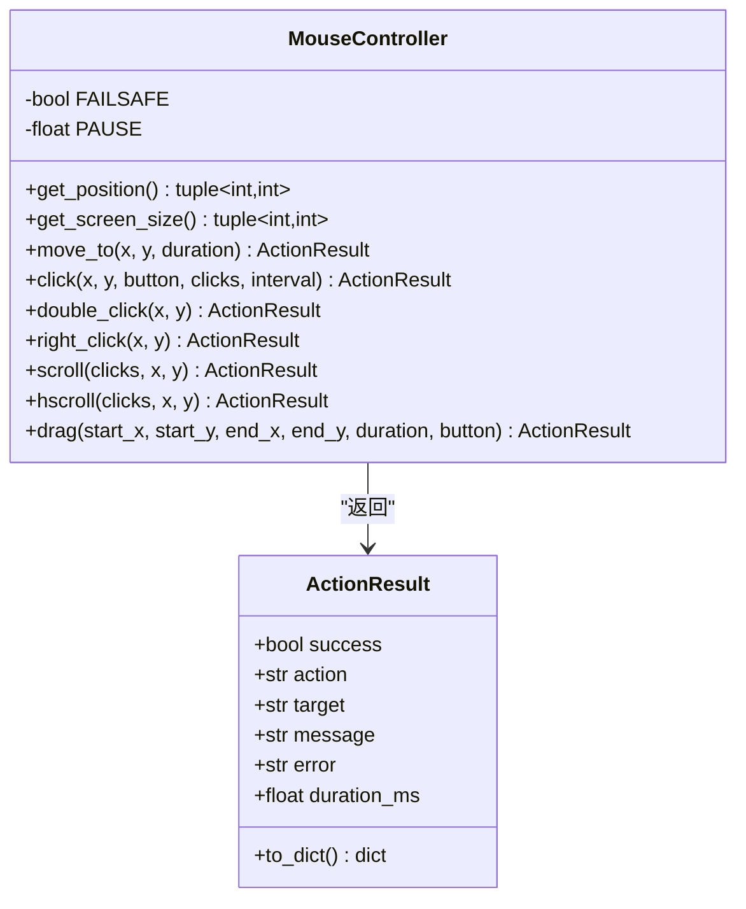

**图表来源**
- [mouse.py:30-571](file://src/synapse/tools/desktop/actions/mouse.py#L30-L571)
- [types.py:268-287](file://src/synapse/tools/desktop/types.py#L268-L287)

#### 键盘控制器
键盘控制器支持多种输入方式，特别是中文输入的处理：

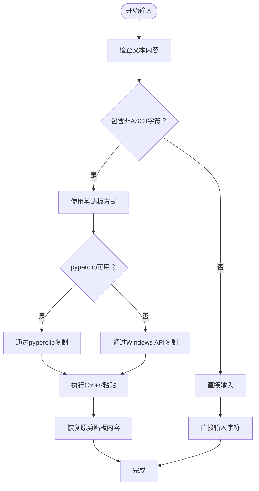

**图表来源**
- [keyboard.py:107-206](file://src/synapse/tools/desktop/actions/keyboard.py#L107-L206)
- [keyboard.py:207-279](file://src/synapse/tools/desktop/actions/keyboard.py#L207-L279)

**章节来源**
- [mouse.py:30-571](file://src/synapse/tools/desktop/actions/mouse.py#L30-L571)
- [keyboard.py:77-581](file://src/synapse/tools/desktop/actions/keyboard.py#L77-L581)

### 截图和缓存系统
截图系统提供了高性能的屏幕捕获功能，支持多种输出格式：

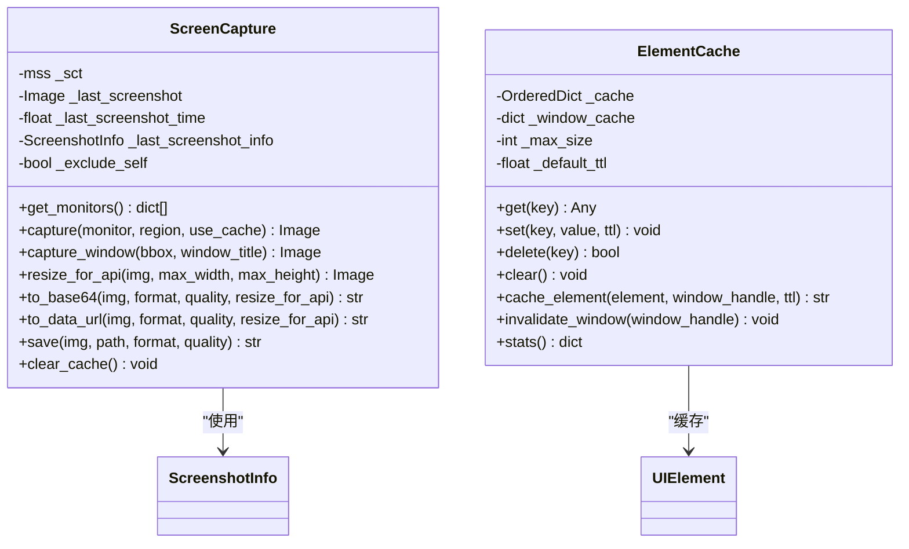

**图表来源**
- [capture.py:80-448](file://src/synapse/tools/desktop/capture.py#L80-L448)
- [cache.py:40-299](file://src/synapse/tools/desktop/cache.py#L40-L299)

#### 缓存策略
元素缓存采用了 LRU（最近最少使用）算法，结合 TTL（生存时间）过期机制：

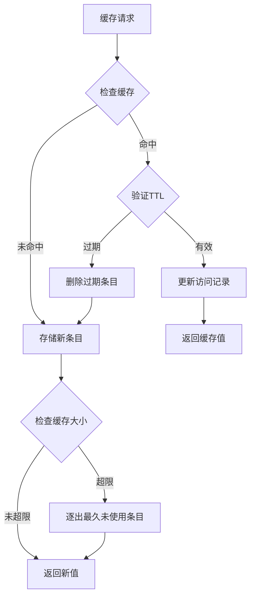

**图表来源**
- [cache.py:69-149](file://src/synapse/tools/desktop/cache.py#L69-L149)

**章节来源**
- [capture.py:80-448](file://src/synapse/tools/desktop/capture.py#L80-L448)
- [cache.py:40-299](file://src/synapse/tools/desktop/cache.py#L40-L299)

### Agent 工具集成
桌面控制器提供了完整的 Agent 工具集，支持自动化任务的编排：

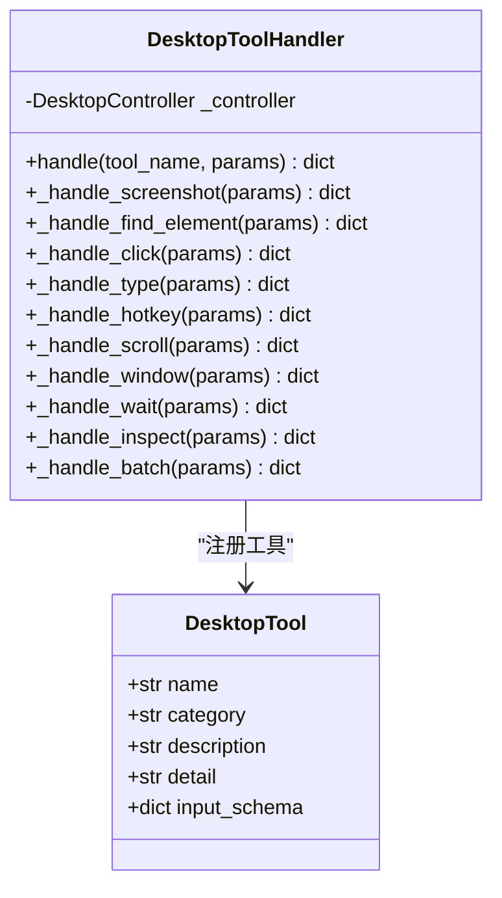

**图表来源**
- [tools.py:407-706](file://src/synapse/tools/desktop/tools.py#L407-L706)
- [tools.py:22-401](file://src/synapse/tools/desktop/tools.py#L22-L401)

**章节来源**
- [tools.py:407-706](file://src/synapse/tools/desktop/tools.py#L407-L706)

## 依赖分析
桌面控制器的依赖关系相对简单，遵循了单一职责原则：

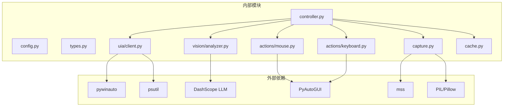

**图表来源**
- [controller.py:14-28](file://src/synapse/tools/desktop/controller.py#L14-L28)
- [client.py:23-30](file://src/synapse/tools/desktop/uia/client.py#L23-L30)
- [analyzer.py:50-56](file://src/synapse/tools/desktop/vision/analyzer.py#L50-L56)

### 组件耦合度分析
桌面控制器的设计体现了良好的内聚性和低耦合性：

- **主控制器**：作为协调者，与其他组件松耦合
- **配置系统**：独立于业务逻辑，提供集中式配置管理
- **数据类型**：标准化的数据结构，便于组件间通信
- **子系统**：UIA、Vision、输入控制、截图等子系统相对独立

**章节来源**
- [controller.py:14-28](file://src/synapse/tools/desktop/controller.py#L14-L28)
- [config.py:11-136](file://src/synapse/tools/desktop/config.py#L11-L136)

## 性能考虑
桌面控制器在设计时充分考虑了性能优化：

### 截图性能优化
- **缓存机制**：避免重复截图，减少系统开销
- **智能缩放**：根据 API 需求自动调整图片大小
- **区域截图**：支持局部区域捕获，提高效率
- **异步处理**：视觉识别采用异步调用

### 元素查找优化
- **智能回退**：UIA 失败时自动切换到视觉识别
- **缓存策略**：元素信息缓存，避免重复解析
- **超时控制**：可配置的超时和重试机制
- **窗口级别隔离**：窗口级别的缓存分区

### 内存管理
- **延迟加载**：组件按需初始化，减少启动时间
- **资源清理**：及时释放截图和窗口句柄资源
- **缓存淘汰**：LRU 算法确保内存使用合理

## 故障排除指南

### 常见问题及解决方案

#### UIA 元素查找失败
**症状**：`ElementNotFoundError` 或 `ElementAmbiguousError`
**原因**：
- 元素不存在或不可见
- 权限不足
- 应用程序使用非标准 UI

**解决方案**：
1. 检查元素定位条件是否正确
2. 尝试使用视觉识别方案
3. 增加超时时间
4. 使用模糊匹配模式

#### 视觉识别准确性问题
**症状**：视觉识别结果不准确或不稳定
**原因**：
- 图像质量不佳
- 提示词不够具体
- 模型响应解析失败

**解决方案**：
1. 调整截图质量设置
2. 优化提示词描述
3. 检查网络连接
4. 增加重试次数

#### 输入控制异常
**症状**：鼠标或键盘操作失败
**原因**：
- 操作系统权限限制
- 输入设备冲突
- 系统安全软件拦截

**解决方案**：
1. 以管理员权限运行
2. 检查安全软件设置
3. 调整 FAILSAFE 配置
4. 确认输入设备正常

#### 性能问题
**症状**：操作响应缓慢
**原因**：
- 缓存配置不当
- 截图分辨率过高
- 并发操作过多

**解决方案**：
1. 调整缓存 TTL 和大小
2. 降低截图分辨率
3. 减少并发操作
4. 优化超时设置

**章节来源**
- [client.py:147-167](file://src/synapse/tools/desktop/uia/client.py#L147-L167)
- [analyzer.py:100-129](file://src/synapse/tools/desktop/vision/analyzer.py#L100-L129)
- [mouse.py:120-138](file://src/synapse/tools/desktop/actions/mouse.py#L120-L138)

## 结论
桌面控制器是一个设计精良的 Windows 桌面自动化系统，具有以下特点：

### 技术优势
- **双引擎架构**：UIA 和 Vision 的智能切换确保了高成功率
- **模块化设计**：清晰的分层架构便于维护和扩展
- **配置灵活**：支持丰富的配置选项适应不同场景
- **错误处理完善**：全面的异常处理和回退机制

### 应用价值
- **开发效率**：简化了复杂的桌面自动化操作
- **稳定性**：通过多重验证和回退机制提高了系统稳定性
- **可扩展性**：模块化设计支持功能扩展和定制
- **易用性**：统一的 API 接口降低了使用门槛

### 发展前景
桌面控制器为 Synapse 生态系统提供了强大的桌面自动化能力，未来可以在以下方面进一步发展：
- 支持更多操作系统平台
- 增强视觉识别的准确性
- 优化性能和资源使用
- 扩展更多的应用场景

## 附录

### 配置参数详解

#### 环境变量配置
```bash
# 基础配置
DESKTOP_ENABLED=true                    # 启用桌面自动化
DESKTOP_DEFAULT_MONITOR=0              # 默认显示器索引
DESKTOP_FAILSAFE=true                  # 启用安全停止

# 截图配置
DESKTOP_COMPRESSION_QUALITY=85         # JPEG压缩质量
DESKTOP_MAX_WIDTH=1920                 # 最大宽度
DESKTOP_MAX_HEIGHT=1080                # 最大高度
DESKTOP_CACHE_TTL=1.0                  # 缓存时间（秒）

# UIA配置
DESKTOP_UIA_TIMEOUT=5.0               # UIA超时时间
DESKTOP_UIA_RETRY_INTERVAL=0.5        # 重试间隔
DESKTOP_UIA_MAX_RETRIES=3             # 最大重试次数

# 视觉识别配置
DESKTOP_VISION_ENABLED=true           # 启用视觉识别
DESKTOP_VISION_MAX_RETRIES=2          # 视觉识别重试次数
DESKTOP_VISION_TIMEOUT=30.0           # 视觉识别超时

# 操作配置
DESKTOP_CLICK_DELAY=0.1               # 点击延迟
DESKTOP_TYPE_INTERVAL=0.03            # 输入间隔
DESKTOP_MOVE_DURATION=0.15            # 移动持续时间
DESKTOP_PAUSE=0.1                     # 操作间暂停
```

### 使用示例

#### 基本元素查找
```python
from synapse.tools.desktop import get_controller

# 获取控制器实例
controller = get_controller()

# 查找元素（自动选择方案）
element = controller.find_element("保存按钮")

# 指定使用UIA方案
element = controller.find_element("name:save_btn", method="uia")

# 指定使用视觉识别方案
element = controller.find_element("红色按钮", method="vision")
```

#### 窗口管理操作
```python
# 列出所有窗口
windows = controller.list_windows()

# 切换到指定窗口
result = controller.switch_to_window("记事本")

# 窗口操作
result = controller.window_action("maximize", "Chrome")
```

#### 文本输入和快捷键
```python
# 输入文本
result = controller.type_text("Hello World", clear_first=True)

# 执行快捷键
result = controller.hotkey("ctrl", "s")

# 按键操作
result = controller.press("enter")
```

#### 截图和分析
```python
# 截取屏幕
img = controller.screenshot()

# 截取指定窗口
img = controller.screenshot(window_title="Chrome")

# 分析屏幕内容
result = controller.analyze_screen(query="找到所有按钮")
```

### 最佳实践

#### 性能优化建议
1. **合理使用缓存**：利用内置缓存机制减少重复操作
2. **选择合适的方案**：优先使用 UIA，必要时使用视觉识别
3. **控制超时时间**：根据场景调整超时和重试设置
4. **批量操作**：使用 `desktop_batch` 工具减少往返开销

#### 错误处理策略
1. **异常捕获**：始终捕获并处理操作异常
2. **回退机制**：实现 UIA 到视觉识别的自动回退
3. **状态检查**：定期检查系统状态和权限
4. **日志记录**：详细记录操作日志便于调试

#### 安全考虑
1. **权限管理**：确保应用程序有足够的系统权限
2. **输入验证**：验证所有用户输入的安全性
3. **资源清理**：及时释放系统资源防止泄漏
4. **异常隔离**：避免单个操作影响整个系统稳定性

**章节来源**
- [config.py:98-136](file://src/synapse/tools/desktop/config.py#L98-L136)
- [controller.py:158-707](file://src/synapse/tools/desktop/controller.py#L158-L707)
- [tools.py:22-401](file://src/synapse/tools/desktop/tools.py#L22-L401)