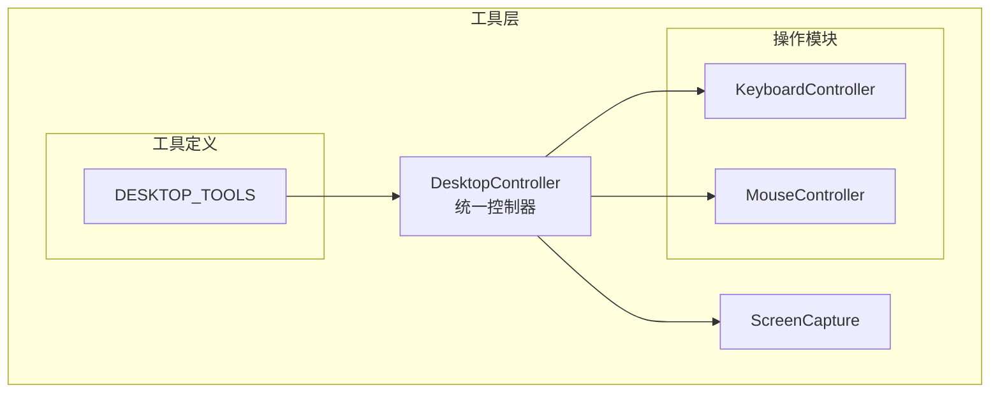
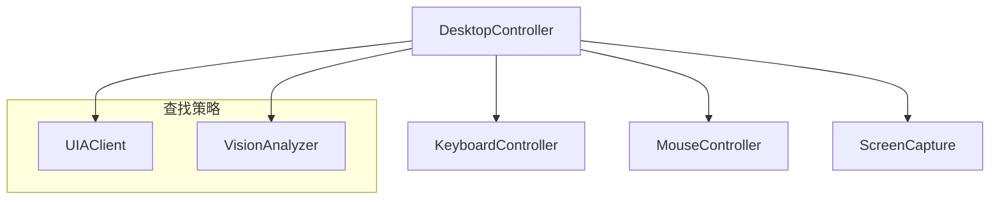
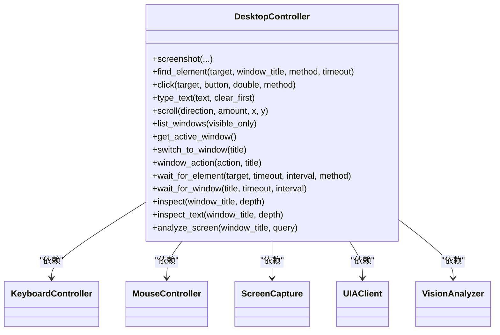
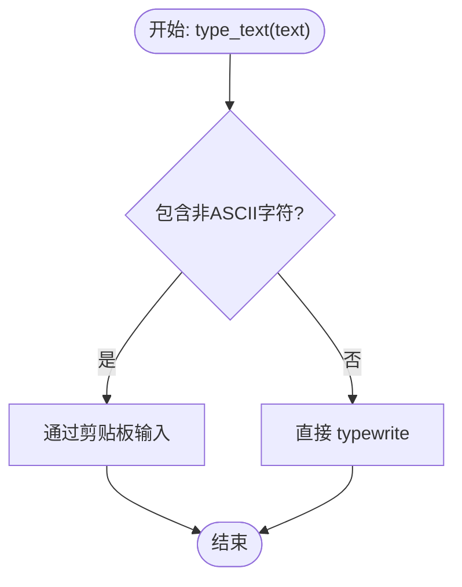
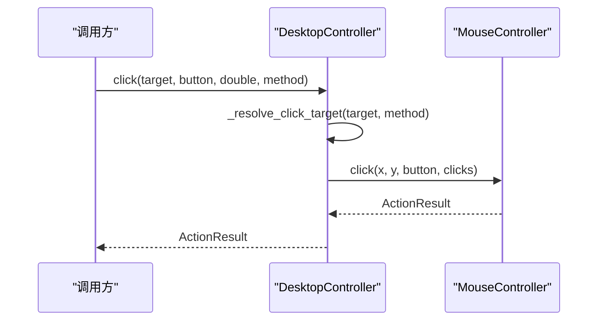
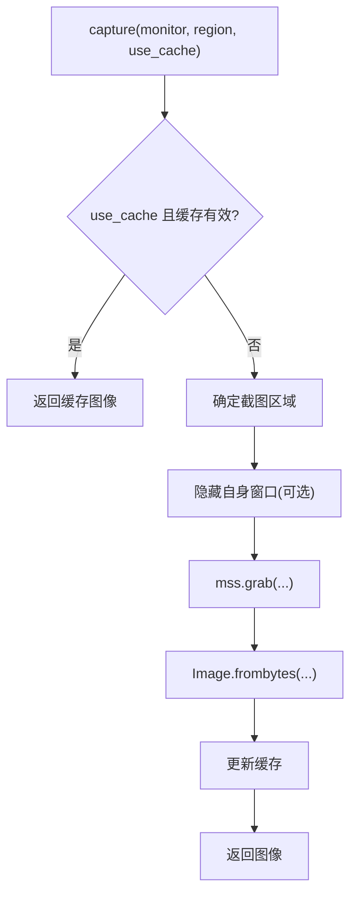
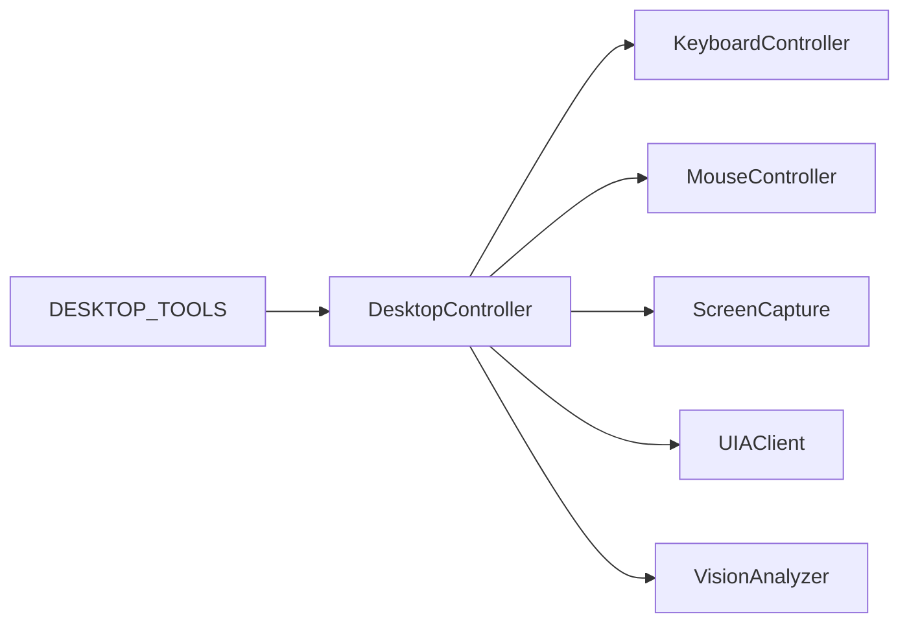

# 桌面自动化工具

<cite>
**本文引用的文件**
- [desktop/__init__.py](file://src/synapse/tools/desktop/__init__.py)
- [controller.py](file://src/synapse/tools/desktop/controller.py)
- [keyboard.py](file://src/synapse/tools/desktop/actions/keyboard.py)
- [mouse.py](file://src/synapse/tools/desktop/actions/mouse.py)
- [capture.py](file://src/synapse/tools/desktop/capture.py)
- [tools.py](file://src/synapse/tools/desktop/tools.py)
- [__init__.py](file://src/synapse/tools/__init__.py)
</cite>

## 目录
1. [简介](#简介)
2. [项目结构](#项目结构)
3. [核心组件](#核心组件)
4. [架构总览](#架构总览)
5. [详细组件分析](#详细组件分析)
6. [依赖分析](#依赖分析)
7. [性能考量](#性能考量)
8. [故障排除指南](#故障排除指南)
9. [结论](#结论)
10. [附录](#附录)

## 简介
本文件面向桌面自动化工具的使用者与开发者，系统性阐述基于 Windows 的桌面自动化实现架构与关键技术点，包括：
- UI 自动化框架集成（UIAutomation/pywinauto）
- 屏幕捕获与图像分析（mss + DashScope Qwen-VL）
- 键盘与鼠标控制（PyAutoGUI）
- 窗口管理、OCR 识别与视觉定位
- Windows 特定功能支持、权限要求与兼容性考虑
- 使用示例、性能优化与故障排除建议

该工具集旨在为复杂桌面交互提供“标准优先、视觉兜底”的统一接口，既可高效处理标准 Win32/WPF 控件，也能在非标准 UI 场景中通过视觉识别进行定位与操作。

## 项目结构
桌面自动化模块位于工具层的 desktop 子包中，采用“主控制器 + 子模块”的分层设计：
- 主控制器负责统一调度与策略选择（UIA 优先、视觉回退）
- 操作子模块封装键盘与鼠标控制
- 截图子模块提供高性能屏幕捕获与预处理
- 工具定义面向 Agent 的可调用工具清单

图表来源
- [controller.py:39-116](file://src/synapse/tools/desktop/controller.py#L39-L116)
- [keyboard.py:77-106](file://src/synapse/tools/desktop/actions/keyboard.py#L77-L106)
- [mouse.py:30-58](file://src/synapse/tools/desktop/actions/mouse.py#L30-L58)
- [capture.py:80-103](file://src/synapse/tools/desktop/capture.py#L80-L103)
- [tools.py:22-41](file://src/synapse/tools/desktop/tools.py#L22-L41)

章节来源
- [desktop/__init__.py:1-132](file://src/synapse/tools/desktop/__init__.py#L1-L132)
- [__init__.py:49-87](file://src/synapse/tools/__init__.py#L49-L87)

## 核心组件
- 主控制器 DesktopController：统一入口，负责元素查找（UIA/Vision）、点击、输入、滚动、窗口管理、等待、检查与视觉分析，并提供全局实例访问。
- 键盘控制器 KeyboardController：封装 PyAutoGUI 的键盘操作，支持剪贴板输入中文、快捷键组合、按键状态管理与常用快捷命令。
- 鼠标控制器 MouseController：封装 PyAutoGUI 的鼠标操作，支持绝对/相对移动、点击、拖拽、滚动与按键按下/释放。
- 截图模块 ScreenCapture：基于 mss 的高性能截图，支持多显示器、区域截图、窗口截图、缓存与压缩，提供 base64/data URL 输出。
- 工具定义 DESKTOP_TOOLS：面向 Agent 的工具清单，包含 desktop_screenshot 等工具的描述与使用约束。

章节来源
- [controller.py:39-116](file://src/synapse/tools/desktop/controller.py#L39-L116)
- [keyboard.py:77-106](file://src/synapse/tools/desktop/actions/keyboard.py#L77-L106)
- [mouse.py:30-58](file://src/synapse/tools/desktop/actions/mouse.py#L30-L58)
- [capture.py:80-103](file://src/synapse/tools/desktop/capture.py#L80-L103)
- [tools.py:22-41](file://src/synapse/tools/desktop/tools.py#L22-L41)

## 架构总览
桌面自动化采用“策略选择 + 组件解耦”的架构：
- 元素查找策略：优先 UIAutomation（UIA），失败则回退到视觉识别（Vision）
- 输入输出：键盘/鼠标通过 PyAutoGUI 实现，截图通过 mss 实现
- 统一接口：DesktopController 提供高层 API，屏蔽底层差异
- 配置驱动：ActionConfig/CaptureConfig/DesktopConfig 等配置项影响行为

图表来源
- [controller.py:18-28](file://src/synapse/tools/desktop/controller.py#L18-L28)
- [controller.py:158-207](file://src/synapse/tools/desktop/controller.py#L158-L207)

## 详细组件分析

### 主控制器 DesktopController
职责与特性：
- 延迟初始化各子组件，降低启动成本
- 统一元素查找：支持 UIA 与 Vision 两种路径，AUTO 模式下先 UIA 后 Vision
- 统一输入输出：键盘/鼠标操作封装，返回标准化结果
- 窗口管理：列出/切换/最小化/最大化/还原/关闭窗口
- 等待与检查：等待元素出现、等待窗口出现；检查 UI 树与文本
- 视觉分析：对截图进行通用分析或问答

图表来源
- [controller.py:39-116](file://src/synapse/tools/desktop/controller.py#L39-L116)
- [controller.py:158-207](file://src/synapse/tools/desktop/controller.py#L158-L207)

章节来源
- [controller.py:39-116](file://src/synapse/tools/desktop/controller.py#L39-L116)
- [controller.py:158-207](file://src/synapse/tools/desktop/controller.py#L158-L207)
- [controller.py:284-333](file://src/synapse/tools/desktop/controller.py#L284-L333)
- [controller.py:427-455](file://src/synapse/tools/desktop/controller.py#L427-L455)
- [controller.py:459-569](file://src/synapse/tools/desktop/controller.py#L459-L569)
- [controller.py:573-624](file://src/synapse/tools/desktop/controller.py#L573-L624)
- [controller.py:628-668](file://src/synapse/tools/desktop/controller.py#L628-L668)
- [controller.py:672-706](file://src/synapse/tools/desktop/controller.py#L672-L706)

### 键盘控制器 KeyboardController
特性：
- 按键别名映射与标准化
- 文本输入：ASCII 直接输入；含非 ASCII 字符时通过剪贴板方式输入
- 快捷键组合：支持任意组合键，自动标准化
- 按键状态管理：记录按住的键，提供上下文管理器与批量释放
- 常用快捷命令：复制/粘贴/剪切/撤销/重做/全选/保存/查找/新建/关闭窗口/切换窗口/显示桌面/运行/资源管理器/截图到剪贴板等

图表来源
- [keyboard.py:107-154](file://src/synapse/tools/desktop/actions/keyboard.py#L107-L154)
- [keyboard.py:156-205](file://src/synapse/tools/desktop/actions/keyboard.py#L156-L205)
- [keyboard.py:207-278](file://src/synapse/tools/desktop/actions/keyboard.py#L207-L278)

章节来源
- [keyboard.py:77-106](file://src/synapse/tools/desktop/actions/keyboard.py#L77-L106)
- [keyboard.py:107-154](file://src/synapse/tools/desktop/actions/keyboard.py#L107-L154)
- [keyboard.py:156-205](file://src/synapse/tools/desktop/actions/keyboard.py#L156-L205)
- [keyboard.py:207-278](file://src/synapse/tools/desktop/actions/keyboard.py#L207-L278)
- [keyboard.py:351-382](file://src/synapse/tools/desktop/actions/keyboard.py#L351-L382)
- [keyboard.py:451-476](file://src/synapse/tools/desktop/actions/keyboard.py#L451-L476)
- [keyboard.py:571-580](file://src/synapse/tools/desktop/actions/keyboard.py#L571-L580)

### 鼠标控制器 MouseController
特性：
- 坐标解析：支持元组、UIElement、BoundingBox、"x,y" 字符串
- 移动：绝对移动与相对移动，支持持续时间
- 点击：左/右/中键，支持单击/双击，可指定次数与间隔
- 拖拽：从指定起点拖拽到终点，支持持续时间
- 滚动：垂直/水平滚动，支持指定位置
- 按键状态：按下/释放鼠标键，支持批量管理

图表来源
- [controller.py:284-333](file://src/synapse/tools/desktop/controller.py#L284-L333)
- [controller.py:335-363](file://src/synapse/tools/desktop/controller.py#L335-L363)
- [mouse.py:179-232](file://src/synapse/tools/desktop/actions/mouse.py#L179-L232)

章节来源
- [mouse.py:68-99](file://src/synapse/tools/desktop/actions/mouse.py#L68-L99)
- [mouse.py:101-138](file://src/synapse/tools/desktop/actions/mouse.py#L101-L138)
- [mouse.py:179-232](file://src/synapse/tools/desktop/actions/mouse.py#L179-L232)
- [mouse.py:310-360](file://src/synapse/tools/desktop/actions/mouse.py#L310-L360)
- [mouse.py:383-423](file://src/synapse/tools/desktop/actions/mouse.py#L383-L423)
- [mouse.py:425-480](file://src/synapse/tools/desktop/actions/mouse.py#L425-L480)
- [mouse.py:482-558](file://src/synapse/tools/desktop/actions/mouse.py#L482-L558)

### 截图模块 ScreenCapture
特性：
- 多显示器支持：获取显示器列表与尺寸
- 高性能截图：基于 mss，支持区域/窗口截图
- 自身窗口隐藏：截图前临时隐藏当前进程窗口，避免被截入
- 缓存机制：短时间内的重复截图返回缓存
- 图像处理：缩放、压缩、base64/data URL 输出、文件保存

图表来源
- [capture.py:131-207](file://src/synapse/tools/desktop/capture.py#L131-L207)
- [capture.py:180-188](file://src/synapse/tools/desktop/capture.py#L180-L188)

章节来源
- [capture.py:80-103](file://src/synapse/tools/desktop/capture.py#L80-L103)
- [capture.py:104-129](file://src/synapse/tools/desktop/capture.py#L104-L129)
- [capture.py:131-207](file://src/synapse/tools/desktop/capture.py#L131-L207)
- [capture.py:209-231](file://src/synapse/tools/desktop/capture.py#L209-L231)
- [capture.py:252-285](file://src/synapse/tools/desktop/capture.py#L252-L285)
- [capture.py:287-348](file://src/synapse/tools/desktop/capture.py#L287-L348)
- [capture.py:350-378](file://src/synapse/tools/desktop/capture.py#L350-L378)
- [capture.py:380-391](file://src/synapse/tools/desktop/capture.py#L380-L391)

### 工具定义与注册
- DESKTOP_TOOLS：定义了桌面自动化工具清单，包含 desktop_screenshot 等工具的名称、分类、描述与使用限制
- register_desktop_tools：将工具注册到 Agent 系统，便于调用

章节来源
- [tools.py:22-41](file://src/synapse/tools/desktop/tools.py#L22-L41)
- [__init__.py:49-87](file://src/synapse/tools/__init__.py#L49-L87)

## 依赖分析
- 平台限制：模块仅支持 Windows（win32），在非 Windows 平台会抛出 ImportError
- 外部库依赖：pyautogui（键盘/鼠标）、mss（截图）、pyperclip（剪贴板，可选）、pywinauto（UIA，按需）
- 内部依赖：DesktopController 依赖 KeyboardController/MouseController/ScreenCapture/UIAClient/VisionAnalyzer；工具层通过 register_desktop_tools 注册工具

图表来源
- [controller.py:14-28](file://src/synapse/tools/desktop/controller.py#L14-L28)
- [__init__.py:23-27](file://src/synapse/tools/__init__.py#L23-L27)

章节来源
- [desktop/__init__.py:23-27](file://src/synapse/tools/desktop/__init__.py#L23-L27)
- [__init__.py:49-87](file://src/synapse/tools/__init__.py#L49-L87)

## 性能考量
- 截图缓存：短时间内的重复截图直接返回缓存，减少 CPU 与 I/O 开销
- 截图前隐藏自身窗口：避免自身窗口被截入，提高准确性
- 操作间隔与安全：FAILSAFE 与 PAUSE 配置可避免误触与提升稳定性
- 视觉识别回退：在 UIA 不可用时启用 Vision，保证鲁棒性但可能增加延迟
- 图像压缩：默认对 API 传输的图像进行缩放与压缩，降低网络与模型调用成本

章节来源
- [capture.py:150-207](file://src/synapse/tools/desktop/capture.py#L150-L207)
- [capture.py:252-285](file://src/synapse/tools/desktop/capture.py#L252-L285)
- [keyboard.py:88-93](file://src/synapse/tools/desktop/actions/keyboard.py#L88-L93)
- [mouse.py:40-49](file://src/synapse/tools/desktop/actions/mouse.py#L40-L49)
- [controller.py:196-207](file://src/synapse/tools/desktop/controller.py#L196-L207)

## 故障排除指南
常见问题与排查要点：
- 平台不支持：模块仅限 Windows，若在非 Windows 环境导入会报错
- 缺少依赖：keyboard/mouse 依赖 pyautogui，截图依赖 mss；安装提示见导入异常信息
- 权限与安全：开启 FAILSAFE 后，将鼠标移至屏幕左上角可立即停止；确保程序有前台窗口焦点
- 文本输入乱码：非 ASCII 字符通过剪贴板输入，若缺少 pyperclip，将尝试 Windows 原生剪贴板；仍失败请检查剪贴板服务
- 截图异常：确认显示器索引与区域参数；必要时禁用缓存或清理缓存
- 元素查找失败：优先使用 UIA；若 UIA 不可用，启用 Vision 并确保网络与模型可用

章节来源
- [desktop/__init__.py:23-27](file://src/synapse/tools/desktop/__init__.py#L23-L27)
- [keyboard.py:21-26](file://src/synapse/tools/desktop/actions/keyboard.py#L21-L26)
- [capture.py:28-34](file://src/synapse/tools/desktop/capture.py#L28-L34)
- [keyboard.py:194-197](file://src/synapse/tools/desktop/actions/keyboard.py#L194-L197)
- [capture.py:380-384](file://src/synapse/tools/desktop/capture.py#L380-L384)
- [controller.py:196-207](file://src/synapse/tools/desktop/controller.py#L196-L207)

## 结论
该桌面自动化工具通过“UIA 优先、视觉回退”的策略，在 Windows 平台上实现了稳定高效的桌面交互能力。其模块化设计与统一接口降低了使用门槛，同时通过缓存、压缩与安全配置提升了性能与可靠性。结合 Agent 工具体系，可覆盖从简单点击到复杂窗口管理与视觉定位的多种场景。

## 附录

### 使用示例（步骤说明）
- 截图并交付：调用 desktop_screenshot，获取文件路径后通过 deliver_artifacts 交付
- 点击元素：使用 find_element 获取 UIElement，再调用 click 进行点击
- 输入文本：调用 type_text，必要时先 select_all 再输入
- 滚动页面：根据方向调用 scroll
- 窗口管理：列出窗口、切换到目标窗口、最小化/最大化/关闭
- 等待元素：使用 wait_for_element 或 wait_for_window
- 视觉分析：调用 analyze_screen 获取页面分析结果

章节来源
- [tools.py:22-41](file://src/synapse/tools/desktop/tools.py#L22-L41)
- [controller.py:120-154](file://src/synapse/tools/desktop/controller.py#L120-L154)
- [controller.py:158-207](file://src/synapse/tools/desktop/controller.py#L158-L207)
- [controller.py:284-333](file://src/synapse/tools/desktop/controller.py#L284-L333)
- [controller.py:383-415](file://src/synapse/tools/desktop/controller.py#L383-L415)
- [controller.py:427-455](file://src/synapse/tools/desktop/controller.py#L427-L455)
- [controller.py:459-569](file://src/synapse/tools/desktop/controller.py#L459-L569)
- [controller.py:573-624](file://src/synapse/tools/desktop/controller.py#L573-L624)
- [controller.py:672-706](file://src/synapse/tools/desktop/controller.py#L672-L706)