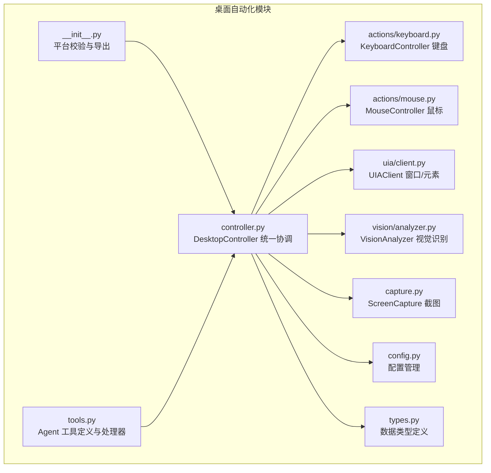
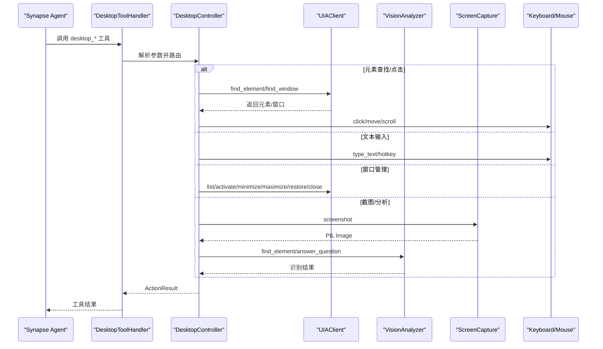
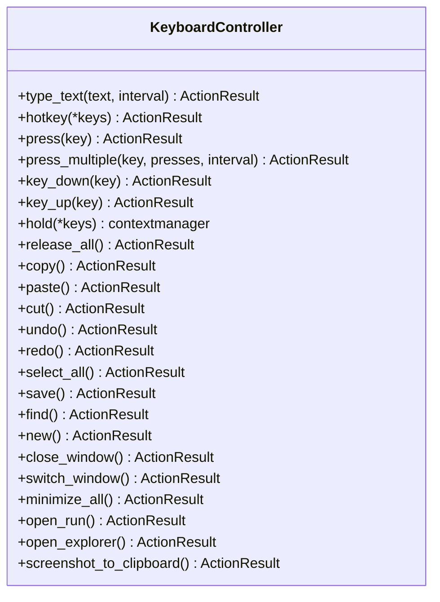
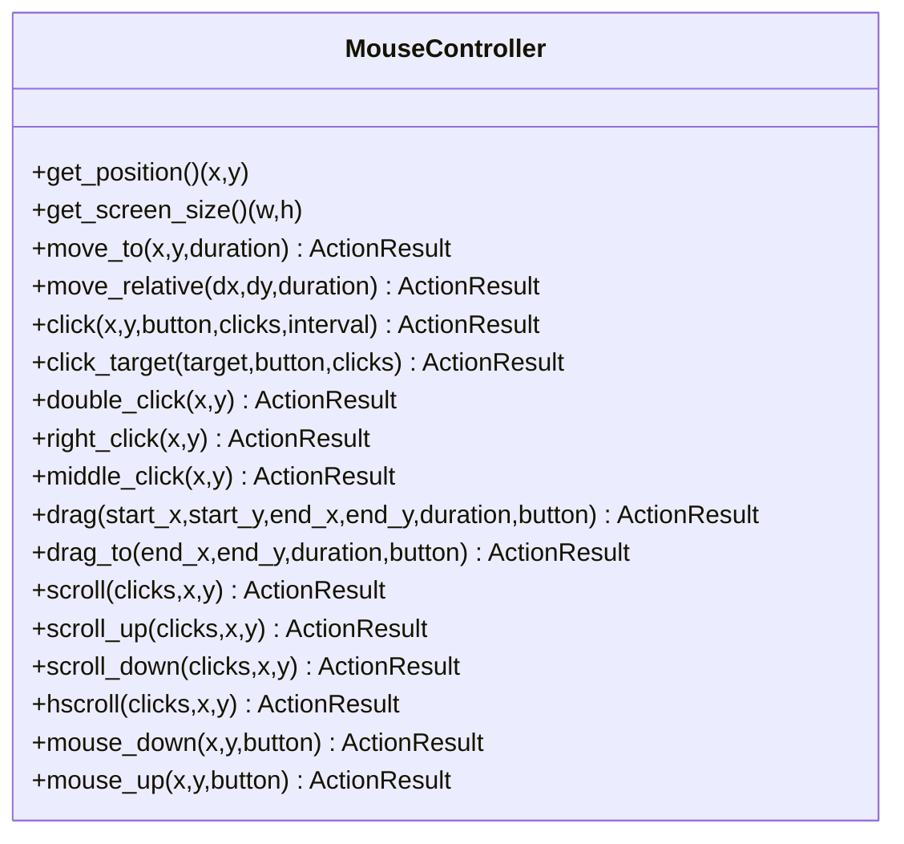
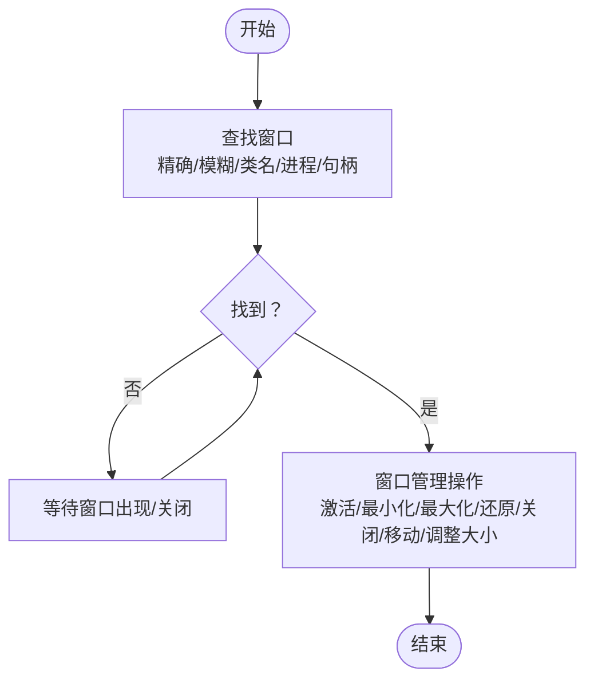
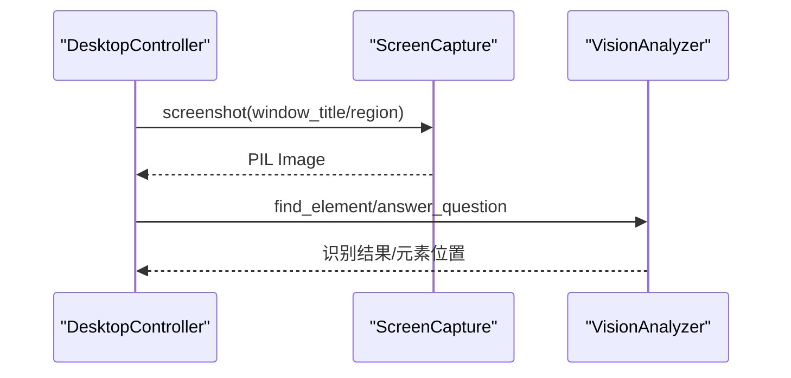
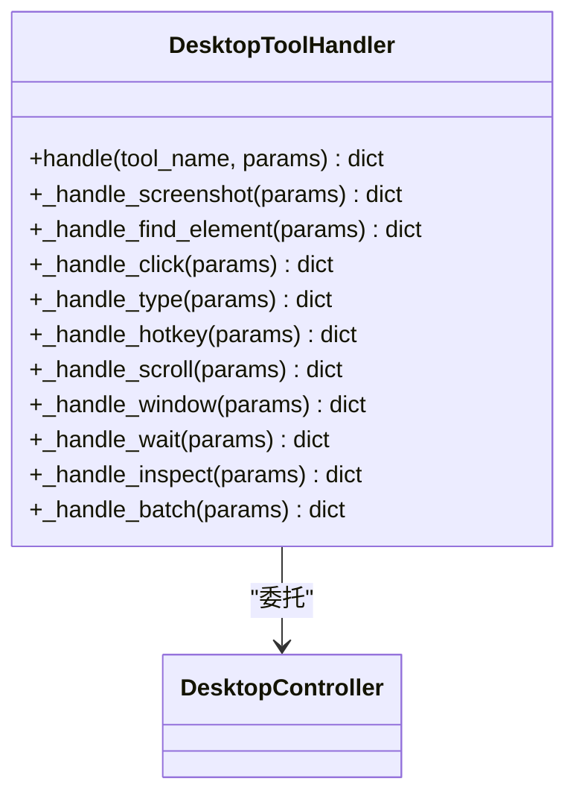
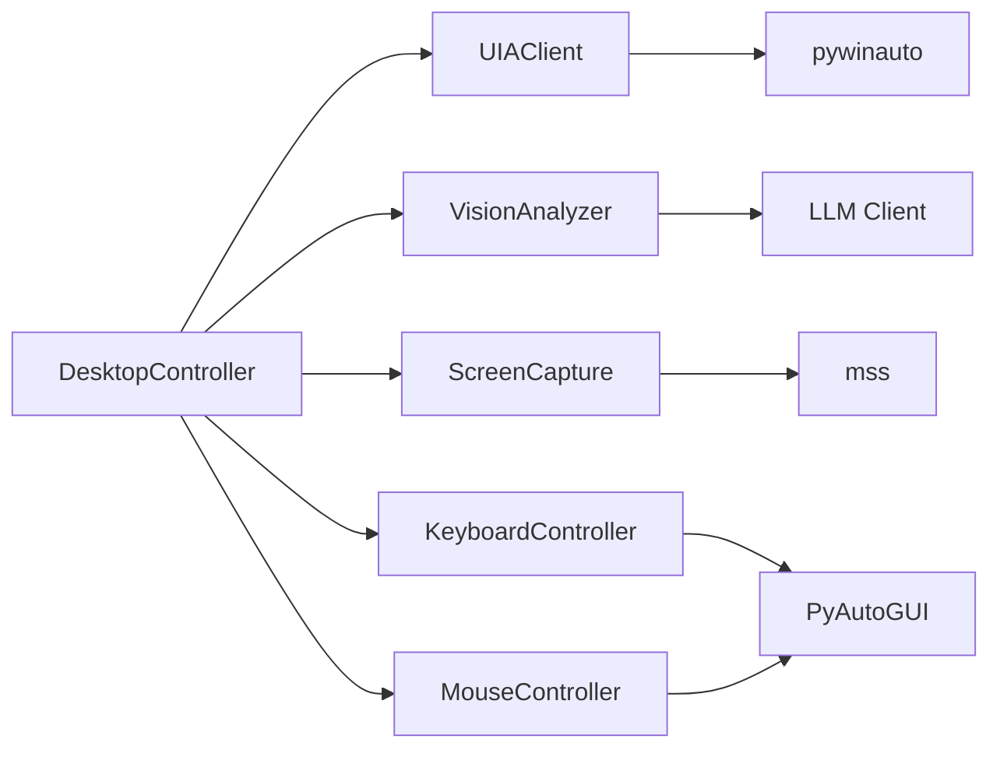

# 输入动作执行

<cite>
**本文档引用的文件**
- [__init__.py](file://src/synapse/tools/desktop/__init__.py)
- [controller.py](file://src/synapse/tools/desktop/controller.py)
- [keyboard.py](file://src/synapse/tools/desktop/actions/keyboard.py)
- [mouse.py](file://src/synapse/tools/desktop/actions/mouse.py)
- [tools.py](file://src/synapse/tools/desktop/tools.py)
- [config.py](file://src/synapse/tools/desktop/config.py)
- [types.py](file://src/synapse/tools/desktop/types.py)
- [client.py](file://src/synapse/tools/desktop/uia/client.py)
- [capture.py](file://src/synapse/tools/desktop/capture.py)
</cite>

## 目录
1. [简介](#简介)
2. [项目结构](#项目结构)
3. [核心组件](#核心组件)
4. [架构概览](#架构概览)
5. [详细组件分析](#详细组件分析)
6. [依赖关系分析](#依赖关系分析)
7. [性能考量](#性能考量)
8. [故障排除指南](#故障排除指南)
9. [结论](#结论)
10. [附录](#附录)

## 简介
本技术文档围绕“输入动作执行”子系统展开，聚焦于键盘输入模拟、鼠标操作控制、窗口焦点管理与系统级交互实现。该子系统基于 Windows 平台，结合 UIAutomation（pywinauto）、视觉识别（DashScope Qwen-VL）、截图（mss）与输入控制（PyAutoGUI）等能力，提供统一的桌面自动化接口，既可用于标准 Windows 应用，也可用于非标准 UI 的通用兜底方案。

## 项目结构
输入动作执行子系统位于桌面自动化模块中，采用分层设计：
- 统一入口与导出：模块入口负责平台校验、类型导出与组件聚合
- 控制器层：DesktopController 作为统一协调者，整合 UIA、视觉识别、截图与输入组件
- 输入动作层：KeyboardController 与 MouseController 封装 PyAutoGUI 的键盘与鼠标操作
- 窗口与元素层：UIAClient 提供窗口与元素查找、管理与等待
- 视觉识别层：VisionAnalyzer 基于 LLM 进行 UI 元素识别与问答
- 截图层：ScreenCapture 基于 mss 实现高性能截图与缓存
- 工具层：Agent 工具定义与处理器，面向 Synapse Agent 的工具注册与调用

图表来源
- [__init__.py:1-132](file://src/synapse/tools/desktop/__init__.py#L1-L132)
- [controller.py:1-719](file://src/synapse/tools/desktop/controller.py#L1-L719)
- [keyboard.py:1-581](file://src/synapse/tools/desktop/actions/keyboard.py#L1-L581)
- [mouse.py:1-571](file://src/synapse/tools/desktop/actions/mouse.py#L1-L571)
- [client.py:1-673](file://src/synapse/tools/desktop/uia/client.py#L1-L673)
- [capture.py:1-448](file://src/synapse/tools/desktop/capture.py#L1-L448)
- [tools.py:1-706](file://src/synapse/tools/desktop/tools.py#L1-L706)
- [config.py:1-136](file://src/synapse/tools/desktop/config.py#L1-L136)
- [types.py:1-298](file://src/synapse/tools/desktop/types.py#L1-L298)

章节来源
- [__init__.py:1-132](file://src/synapse/tools/desktop/__init__.py#L1-L132)
- [controller.py:1-719](file://src/synapse/tools/desktop/controller.py#L1-L719)

## 核心组件
- DesktopController：统一协调器，封装截图、UIA、视觉识别、输入与窗口管理，提供高层 API
- KeyboardController：键盘输入封装，支持文本输入、快捷键、按键按下/释放与上下文持有
- MouseController：鼠标输入封装，支持移动、点击、拖拽、滚动与按键按下/释放
- UIAClient：UIAutomation 客户端，提供窗口与元素查找、管理、等待与应用程序连接
- VisionAnalyzer：视觉分析器，基于 LLM 进行 UI 元素识别与问答
- ScreenCapture：截图模块，基于 mss 实现高性能截图、区域/窗口截图与缓存
- Agent 工具：面向 Synapse Agent 的工具定义与处理器，提供 desktop_* 工具集

章节来源
- [controller.py:39-719](file://src/synapse/tools/desktop/controller.py#L39-L719)
- [keyboard.py:77-581](file://src/synapse/tools/desktop/actions/keyboard.py#L77-L581)
- [mouse.py:30-571](file://src/synapse/tools/desktop/actions/mouse.py#L30-L571)
- [client.py:35-673](file://src/synapse/tools/desktop/uia/client.py#L35-L673)
- [capture.py:80-448](file://src/synapse/tools/desktop/capture.py#L80-L448)
- [tools.py:22-706](file://src/synapse/tools/desktop/tools.py#L22-L706)

## 架构概览
输入动作执行的整体架构如下：
- 控制器层（DesktopController）对外暴露统一接口，内部根据场景选择 UIA 或视觉识别方案
- 输入层（KeyboardController/MouseController）基于 PyAutoGUI 实现，支持配置化行为（如 failsafe、PAUSE、type_interval 等）
- 窗口与元素层（UIAClient）基于 pywinauto，提供窗口管理与元素查找
- 视觉识别层（VisionAnalyzer）基于 LLM，提供非标准 UI 的识别与问答
- 截图层（ScreenCapture）基于 mss，提供高性能截图与缓存
- 工具层（tools.py）面向 Agent，提供工具定义与处理器

图表来源
- [tools.py:426-706](file://src/synapse/tools/desktop/tools.py#L426-L706)
- [controller.py:158-707](file://src/synapse/tools/desktop/controller.py#L158-L707)
- [client.py:105-574](file://src/synapse/tools/desktop/uia/client.py#L105-L574)
- [capture.py:131-231](file://src/synapse/tools/desktop/capture.py#L131-L231)
- [keyboard.py:107-154](file://src/synapse/tools/desktop/actions/keyboard.py#L107-L154)
- [mouse.py:179-232](file://src/synapse/tools/desktop/actions/mouse.py#L179-L232)

## 详细组件分析

### 键盘输入模拟（KeyboardController）
- 功能要点
  - 文本输入：支持 ASCII 直接输入与非 ASCII（中文）通过剪贴板方式输入；可回退至 Windows 原生剪贴板
  - 快捷键：标准化按键别名，支持多键组合（如 ctrl+c、alt+f4、win+d）
  - 按键状态：支持按下/释放、按住（上下文管理器）、释放全部
  - 便捷方法：封装常用快捷键（复制、粘贴、撤销、重做、全选、保存、查找、新建、关闭窗口、切换窗口、显示桌面、打开运行、打开资源管理器、截图到剪贴板）
- 坐标系统与触发机制
  - 键盘操作不涉及屏幕坐标，但需确保目标应用处于焦点状态（通常由点击或窗口切换保证）
- 按键组合与修饰键
  - 支持 enter、tab、escape、space、backspace、delete、insert、方向键、功能键 F1-F12、以及 ctrl、alt、shift、win/cmd 等
- 错误处理与返回
  - 统一返回 ActionResult，包含 success、action、target、message、error、duration_ms

图表来源
- [keyboard.py:77-581](file://src/synapse/tools/desktop/actions/keyboard.py#L77-L581)

章节来源
- [keyboard.py:77-581](file://src/synapse/tools/desktop/actions/keyboard.py#L77-L581)

### 鼠标操作控制（MouseController）
- 功能要点
  - 移动：支持绝对移动与相对移动，可配置移动持续时间
  - 点击：支持左/右/中键、单击/双击，可配置点击延迟与间隔
  - 拖拽：支持从起点拖拽到终点，可配置按钮与持续时间
  - 滚动：支持垂直/水平滚动，支持指定位置滚动
  - 按键：支持按下/释放鼠标按钮
- 坐标系统与触发机制
  - 坐标系统为屏幕坐标（像素），支持从 UIElement/BoundingBox/坐标字符串解析目标
  - 可通过 UIA 或视觉识别获取元素中心点，再驱动鼠标点击
- 按键组合与鼠标事件
  - 支持多种按钮与组合操作，滚动支持方向与次数
- 错误处理与返回
  - 统一返回 ActionResult，包含操作详情与耗时

图表来源
- [mouse.py:30-571](file://src/synapse/tools/desktop/actions/mouse.py#L30-L571)

章节来源
- [mouse.py:30-571](file://src/synapse/tools/desktop/actions/mouse.py#L30-L571)

### 窗口焦点管理（UIAClient）
- 功能要点
  - 窗口枚举：支持可见窗口过滤与标题过滤
  - 窗口查找：支持精确/模糊标题匹配、类名、进程 ID、句柄等
  - 窗口管理：激活（置顶）、最小化、最大化、还原、关闭、移动、调整大小
  - 等待：等待窗口出现/关闭，支持超时与检查间隔
  - 应用连接：启动新应用或连接已有应用，获取主窗口
- 触发机制
  - 通过 pywinauto 的 Desktop/Application 接口实现，支持 UIA 与 Win32 后端
  - 激活窗口时会先恢复最小化状态，再设置焦点
- 错误处理
  - 对找不到元素/窗口、超时、多匹配等情况进行日志记录与降级处理

图表来源
- [client.py:105-316](file://src/synapse/tools/desktop/uia/client.py#L105-L316)

章节来源
- [client.py:35-673](file://src/synapse/tools/desktop/uia/client.py#L35-L673)

### 视觉识别与截图（VisionAnalyzer + ScreenCapture）
- 功能要点
  - 截图：支持全屏、指定显示器、区域、窗口截图；带缓存与压缩/缩放
  - 视觉识别：基于 LLM 的 UI 元素识别与问答，支持自然语言描述
- 触发机制
  - 控制器在 UIA 失败时自动回退到视觉识别
  - 截图后可直接交给视觉分析器进行元素定位与回答
- 性能与安全
  - 截图模块内置“隐藏自身窗口”逻辑，避免截屏包含自身窗口
  - 截图缓存减少重复请求，降低性能开销

图表来源
- [capture.py:131-231](file://src/synapse/tools/desktop/capture.py#L131-L231)
- [tools.py:500-508](file://src/synapse/tools/desktop/tools.py#L500-L508)

章节来源
- [capture.py:80-448](file://src/synapse/tools/desktop/capture.py#L80-L448)
- [vision/analyzer.py:31-545](file://src/synapse/tools/desktop/vision/analyzer.py#L31-L545)

### Agent 工具集成（DesktopToolHandler）
- 功能要点
  - 定义 desktop_* 工具：截图、元素查找、点击、文本输入、快捷键、滚动、窗口管理、等待、检查、批量执行
  - 处理器：将工具调用路由到 DesktopController，并返回结构化结果
  - 批量执行：desktop_batch 原子化顺序执行多个动作，支持错误中断
- 使用场景
  - 与 Synapse Agent 集成，提供桌面自动化能力
  - 通过 deliver_artifacts 交付截图等产物

图表来源
- [tools.py:407-706](file://src/synapse/tools/desktop/tools.py#L407-L706)
- [controller.py:426-570](file://src/synapse/tools/desktop/controller.py#L426-L570)

章节来源
- [tools.py:22-706](file://src/synapse/tools/desktop/tools.py#L22-L706)

## 依赖关系分析
- 组件耦合
  - DesktopController 作为协调者，依赖 UIA、视觉识别、截图与输入组件
  - KeyboardController/MouseController 依赖配置模块与 PyAutoGUI
  - UIAClient 依赖 pywinauto
  - VisionAnalyzer 依赖 LLM 客户端与截图模块
  - ScreenCapture 依赖 mss 与 PIL
- 外部依赖
  - PyAutoGUI：键盘/鼠标输入
  - pywinauto：UIAutomation 窗口与元素管理
  - mss：高性能截图
  - DashScope Qwen-VL：视觉识别（LLM）
  - pyperclip（可选）：剪贴板操作
- 循环依赖
  - 未发现循环依赖，模块间通过接口解耦

图表来源
- [controller.py:14-28](file://src/synapse/tools/desktop/controller.py#L14-L28)
- [keyboard.py:21-26](file://src/synapse/tools/desktop/actions/keyboard.py#L21-L26)
- [mouse.py:20-25](file://src/synapse/tools/desktop/actions/mouse.py#L20-L25)
- [client.py:23-30](file://src/synapse/tools/desktop/uia/client.py#L23-L30)
- [capture.py:28-34](file://src/synapse/tools/desktop/capture.py#L28-L34)
- [vision/analyzer.py:50-56](file://src/synapse/tools/desktop/vision/analyzer.py#L50-L56)

章节来源
- [controller.py:14-28](file://src/synapse/tools/desktop/controller.py#L14-L28)
- [keyboard.py:21-26](file://src/synapse/tools/desktop/actions/keyboard.py#L21-L26)
- [mouse.py:20-25](file://src/synapse/tools/desktop/actions/mouse.py#L20-L25)
- [client.py:23-30](file://src/synapse/tools/desktop/uia/client.py#L23-L30)
- [capture.py:28-34](file://src/synapse/tools/desktop/capture.py#L28-L34)
- [vision/analyzer.py:50-56](file://src/synapse/tools/desktop/vision/analyzer.py#L50-L56)

## 性能考量
- 截图缓存：ScreenCapture 默认启用缓存，短时间重复请求返回缓存图像，降低 CPU/GPU 开销
- 截图尺寸与压缩：支持自动缩放与 JPEG 压缩，减少 API 调用成本
- 操作间隔与安全：PyAutoGUI 的 PAUSE 与 FAILSAFE 可通过配置控制，平衡稳定性与性能
- UIA 超时与重试：UIAClient 的超时与重试配置可提升查找成功率
- 视觉识别：VisionAnalyzer 支持最大重试次数与超时，避免长时间阻塞
- 批量执行：desktop_batch 原子化顺序执行，减少往返开销

章节来源
- [config.py:11-136](file://src/synapse/tools/desktop/config.py#L11-L136)
- [capture.py:131-207](file://src/synapse/tools/desktop/capture.py#L131-L207)
- [client.py:128-167](file://src/synapse/tools/desktop/uia/client.py#L128-L167)
- [vision/analyzer.py:58-67](file://src/synapse/tools/desktop/vision/analyzer.py#L58-L67)
- [tools.py:636-672](file://src/synapse/tools/desktop/tools.py#L636-L672)

## 故障排除指南
- 平台限制
  - 模块仅支持 Windows（sys.platform == win32），非 Windows 平台会抛出导入异常
- 依赖缺失
  - PyAutoGUI、pywinauto、mss、DashScope 等依赖缺失时，会提示安装建议
- 输入失败
  - 键盘/鼠标操作失败时，返回 ActionResult.error，可通过日志定位原因
- 元素/窗口未找到
  - UIA 查找失败或超时，会记录调试信息；可切换到视觉识别或调整超时
- 窗口焦点问题
  - 激活窗口失败时，检查窗口状态（最小化/最大化）与权限
- 截图异常
  - 截图失败时，检查显示器索引、区域合法性与 mss 安装情况
- Agent 工具错误
  - desktop_batch 限制最多 20 步，且遇错即停；desktop_wait 支持窗口/元素等待，超时返回错误信息

章节来源
- [__init__.py:24-27](file://src/synapse/tools/desktop/__init__.py#L24-L27)
- [keyboard.py:23-26](file://src/synapse/tools/desktop/actions/keyboard.py#L23-L26)
- [mouse.py:22-25](file://src/synapse/tools/desktop/actions/mouse.py#L22-L25)
- [client.py:148-167](file://src/synapse/tools/desktop/uia/client.py#L148-L167)
- [capture.py:184-188](file://src/synapse/tools/desktop/capture.py#L184-L188)
- [tools.py:644-666](file://src/synapse/tools/desktop/tools.py#L644-L666)

## 结论
输入动作执行子系统通过统一的 DesktopController 将键盘、鼠标、窗口管理、截图与视觉识别有机整合，既满足标准 Windows 应用的高效自动化，也覆盖非标准 UI 的通用识别需求。其配置化设计与错误处理机制使得在不同环境中具备良好的稳定性与可维护性。配合 Agent 工具体系，可无缝集成到自动化工作流中，实现复杂的桌面交互任务。

## 附录

### 使用示例（路径指引）
- 键盘输入示例：[type_text/hotkey 示例:107-154](file://src/synapse/tools/desktop/actions/keyboard.py#L107-L154)
- 鼠标点击示例：[click/click_target 示例:179-260](file://src/synapse/tools/desktop/actions/mouse.py#L179-L260)
- 窗口管理示例：[window_action 示例:505-569](file://src/synapse/tools/desktop/controller.py#L505-L569)
- 截图与分析示例：[screenshot/analyze_screen 示例:120-154](file://src/synapse/tools/desktop/controller.py#L120-L154)
- Agent 工具调用示例：[desktop_click/desktop_type 等:535-557](file://src/synapse/tools/desktop/tools.py#L535-L557)

### 配置项一览（路径指引）
- 截图配置：[CaptureConfig:11-29](file://src/synapse/tools/desktop/config.py#L11-L29)
- UIA 配置：[UIAConfig:32-46](file://src/synapse/tools/desktop/config.py#L32-L46)
- 视觉配置：[VisionConfig:50-63](file://src/synapse/tools/desktop/config.py#L50-L63)
- 操作配置：[ActionConfig:66-84](file://src/synapse/tools/desktop/config.py#L66-L84)
- 全局配置：[DesktopConfig:87-112](file://src/synapse/tools/desktop/config.py#L87-L112)

### 数据类型定义（路径指引）
- 枚举与数据结构：[types.py:13-298](file://src/synapse/tools/desktop/types.py#L13-L298)